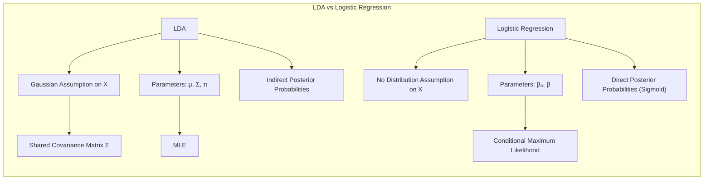
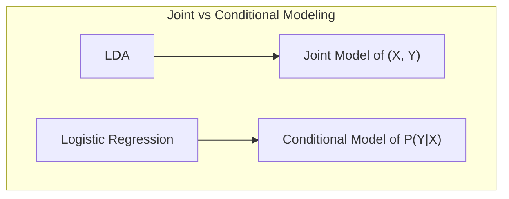
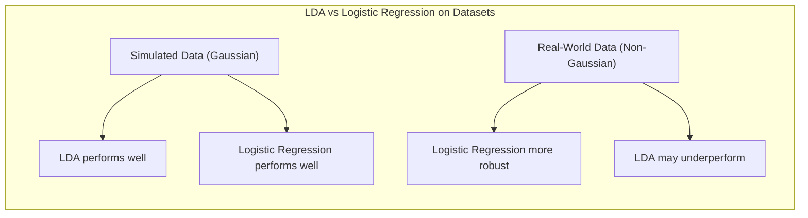
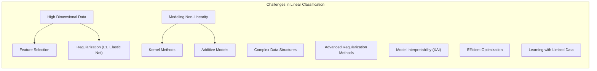

### Comparação entre LDA e Regressão Logística: Diferenças nas Suposições e Abordagem de Ajuste Apesar de uma Forma Matemática Compartilhada



A **Análise Discriminante Linear (LDA)** e a **regressão logística** são dois métodos amplamente utilizados para classificação linear. Embora ambos os métodos produzam **fronteiras de decisão lineares** e compartilhem uma forma matemática similar na modelagem do logaritmo das probabilidades posteriores das classes (ou *log-odds*), eles diferem fundamentalmente em suas suposições e abordagens de ajuste [^4.5]. Compreender essas diferenças é crucial para a aplicação adequada de cada método e para a interpretação correta de seus resultados.

**Forma Matemática Compartilhada:**

Ambos LDA e regressão logística modelam o logaritmo das probabilidades posteriores da classe $k$ como uma função linear dos preditores $x$. Para LDA com duas classes (G=1 ou G=2), o log-odds é:

$$
\log\left(\frac{Pr(G=1|X=x)}{Pr(G=2|X=x)}\right) = \log\frac{\pi_1}{\pi_2} + (\mu_1-\mu_2)^T\Sigma^{-1}x + (\mu_1^T\Sigma^{-1}\mu_1 - \mu_2^T\Sigma^{-1}\mu_2)
$$

que é uma forma linear em $x$. Já a regressão logística define o log-odds como:

$$
\log\left(\frac{Pr(G=1|X=x)}{Pr(G=2|X=x)}\right) = \beta_0 + \beta^Tx
$$

Essa similaridade na forma matemática dos dois métodos faz com que as fronteiras de decisão entre classes sejam lineares, ou hiperplanos em um espaço p-dimensional, mas a maneira como seus parâmetros são estimados e as premissas sobre os dados são bem diferentes.

> 💡 **Exemplo Numérico:**
>
> Suponha que temos duas classes (G=1 e G=2) e um único preditor $x$. Na LDA, assumimos que $x$ segue uma distribuição normal em cada classe, com médias $\mu_1 = 2$ e $\mu_2 = 5$, e uma variância comum $\sigma^2 = 1$. As probabilidades a priori são $\pi_1 = 0.6$ e $\pi_2 = 0.4$.
>
> 1.  **Cálculo dos termos da LDA:**
>     *   $\log\left(\frac{\pi_1}{\pi_2}\right) = \log\left(\frac{0.6}{0.4}\right) \approx 0.405$
>     *   $(\mu_1 - \mu_2) = 2 - 5 = -3$
>     *   $\Sigma^{-1} = \frac{1}{\sigma^2} = 1$
>     *   $\mu_1^T \Sigma^{-1} \mu_1 = 2 \cdot 1 \cdot 2 = 4$
>     *   $\mu_2^T \Sigma^{-1} \mu_2 = 5 \cdot 1 \cdot 5 = 25$
>
>     O log-odds para a LDA é:
>     $$
>     \log\left(\frac{Pr(G=1|X=x)}{Pr(G=2|X=x)}\right) = 0.405 - 3x + (4 - 25)/2 = 0.405 - 3x - 10.5 = -10.095 - 3x
>     $$
>
> 2.  **Regressão Logística:**
>     Suponha que a regressão logística ajustada para os mesmos dados resulta em $\beta_0 = -10$ e $\beta_1 = -3$. O log-odds para a regressão logística é:
>     $$
>     \log\left(\frac{Pr(G=1|X=x)}{Pr(G=2|X=x)}\right) = -10 - 3x
>     $$
>
>     Note que, neste exemplo, os coeficientes são muito próximos. A diferença principal está na forma como eles são derivados. O LDA usa as estatísticas das distribuições gaussianas, enquanto a regressão logística ajusta os parâmetros por maximização da verossimilhança.

**Diferenças nas Suposições:**

1.  **Distribuição das Variáveis Preditoras:** A LDA assume que as variáveis preditoras $x$ seguem uma distribuição gaussiana multivariada condicional às classes, ou seja, $X|G=k \sim N(\mu_k, \Sigma)$ [^4.3]. Além disso, a LDA assume que todas as classes compartilham a mesma matriz de covariância $\Sigma$. Por outro lado, a regressão logística não faz nenhuma suposição sobre a distribuição das variáveis preditoras [^4.4].
    ```mermaid
    graph LR
        subgraph "LDA Assumptions"
            direction TB
            A["X|G=k ~ N(μ_k, Σ)"]
            B["Shared Covariance Matrix: Σ"]
        end
         subgraph "Logistic Regression Assumptions"
            direction TB
           C["No Distribution Assumptions on X"]
        end
    ```

    > 💡 **Exemplo Numérico:**
    >
    > Imagine um dataset com duas classes, onde as variáveis preditoras são duas features, $x_1$ e $x_2$.
    >
    > *   **LDA:** Assume que, para cada classe, os pares $(x_1, x_2)$ seguem uma distribuição normal bivariada. Para a classe 1, essa distribuição pode ter média $\mu_1 = [1, 1]$ e covariância $\Sigma = [[1, 0.5], [0.5, 1]]$. Para a classe 2, a média pode ser $\mu_2 = [3, 3]$ com a mesma matriz de covariância $\Sigma$.
    *   **Regressão Logística:** Não faz nenhuma suposição sobre a distribuição dos pares $(x_1, x_2)$. Poderiam seguir qualquer distribuição, inclusive uma não gaussiana.

2.  **Ajuste e Otimização:** A LDA estima os parâmetros por meio da aplicação direta dos estimadores de máxima verossimilhança (MLE) para os parâmetros de uma distribuição gaussiana, estimando as médias $\mu_k$, a covariância $\Sigma$ e as probabilidades *a priori* das classes $\pi_k$. Para a regressão logística, os parâmetros $\beta_0$ e $\beta$ são estimados através da maximização da verossimilhança condicional das classes dadas as entradas [^4.4.1]. A regressão logística trata as variáveis preditoras como condicionais, não especificando como elas são distribuídas.
    ```mermaid
    graph LR
    subgraph "Parameter Estimation"
        direction LR
        A["LDA"] --> B["MLE of Gaussian Parameters: μ_k, Σ, π_k"]
        C["Logistic Regression"] --> D["Conditional MLE of β₀, β"]
     end
    ```

    > 💡 **Exemplo Numérico:**
    >
    > **LDA:** Para estimar $\mu_1$, $\mu_2$ e $\Sigma$, calcula-se as médias amostrais de cada classe e a matriz de covariância amostral conjunta. Por exemplo, se tivermos 100 pontos na classe 1, calculamos a média desses 100 pontos para obter $\hat{\mu}_1$. A mesma lógica é aplicada para a classe 2 e a matriz de covariância conjunta.
    >
    > **Regressão Logística:** A estimativa dos parâmetros $\beta_0$ e $\beta$ envolve um processo iterativo de maximização da função de verossimilhança.  Por exemplo, o algoritmo IRLS (Iteratively Reweighted Least Squares) é usado para encontrar os valores de $\beta$ que melhor se ajustam aos dados, calculando a probabilidade de cada classe dada a amostra.

3.  **Modelagem das Probabilidades Posteriores:** A LDA modela as probabilidades posteriores indiretamente por meio das densidades condicionais das classes e do teorema de Bayes. A regressão logística modela as probabilidades posteriores diretamente por meio de uma função sigmoide aplicada ao modelo linear.
    ```mermaid
    graph LR
    subgraph "Posterior Probabilities Modeling"
        direction LR
        A["LDA"] --> B["Indirectly Via Bayes Theorem"]
        C["Logistic Regression"] --> D["Directly Via Sigmoid Function"]
    end
    ```

4.  **Robustez a Outliers e Violação de Suposições:** A regressão logística geralmente é mais robusta a outliers e a violações da suposição de normalidade do que a LDA. A LDA, por ser baseada em distribuições gaussianas, pode ser mais sensível a valores atípicos, ao passo que a logística é mais flexível nesse sentido e pode ser mais apropriada quando se desconfia da normalidade dos dados ou da igualdade das covariâncias.

    > 💡 **Exemplo Numérico:**
    >
    > Imagine um dataset onde a maioria dos pontos da classe 1 está próxima de $\mu_1 = [1, 1]$, mas um outlier está em $[10, 10]$.
    >
    > *   **LDA:** O outlier pode distorcer a estimativa de $\hat{\mu}_1$ e $\hat{\Sigma}$, afetando a fronteira de decisão.
    *   **Regressão Logística:** O outlier tem menos influência na estimativa dos coeficientes $\beta$ porque a função logística não é tão sensível a valores extremos.

5.  **Informações A Priori:** A LDA utiliza as probabilidades *a priori* das classes $\pi_k$, enquanto a regressão logística não as assume, ou as estima de forma implícita pelos dados de treinamento. Isso pode levar a resultados diferentes quando as classes não são balanceadas.
    ```mermaid
    graph LR
        subgraph "A Priori Probabilities"
            direction LR
            A["LDA"] --> B["Uses Explicit Priors π_k"]
            C["Logistic Regression"] --> D["Implict Priors via Training Data"]
        end
    ```

    > 💡 **Exemplo Numérico:**
    >
    > Suponha que em um problema de classificação de emails, 90% dos emails são 'não spam' e 10% são 'spam'.
    >
    > *   **LDA:** Utilizaria essas probabilidades a priori ($\pi_1 = 0.9$ e $\pi_2 = 0.1$) no cálculo da função discriminante.
    *   **Regressão Logística:** Não usa explicitamente essas probabilidades, mas as estima implicitamente durante o ajuste.

**Abordagem de Ajuste:**

*   **LDA:** O ajuste da LDA envolve os seguintes passos:
    1.  Estimar as médias amostrais $\hat{\mu}_k$ para cada classe.
    2.  Estimar a matriz de covariância comum amostral $\hat{\Sigma}$.
    3.  Estimar as probabilidades *a priori* das classes $\hat{\pi}_k$ com base nas frequências relativas das classes na amostra.
    4.  Calcular as funções discriminantes lineares utilizando os parâmetros estimados:
$$
 \delta_k(x) =  x^T \hat{\Sigma}^{-1} \hat{\mu}_k - \frac{1}{2} \hat{\mu}_k^T \hat{\Sigma}^{-1} \hat{\mu}_k + \log \hat{\pi}_k
$$
    5.  Classificar $x$ na classe com maior valor de $\delta_k(x)$.
    ```mermaid
        graph TB
        subgraph "LDA Fitting Process"
        direction TB
            A["Estimate Sample Means: μ̂_k"]
            B["Estimate Common Covariance: Σ̂"]
            C["Estimate Prior Probabilities: π̂_k"]
            D["Compute Discriminant Functions: δ_k(x)"]
            E["Classify x: max δ_k(x)"]
            A --> B
            B --> C
            C --> D
            D --> E
        end
    ```

        > 💡 **Exemplo Numérico:**
        >
        > Suponha que temos duas classes com as seguintes estimativas:
        > *   $\hat{\mu}_1 = [1, 1]$
        > *   $\hat{\mu}_2 = [3, 3]$
        > *   $\hat{\Sigma} = [[1, 0.5], [0.5, 1]]$
        > *   $\hat{\pi}_1 = 0.6$
        > *   $\hat{\pi}_2 = 0.4$
        >
        > E queiramos classificar o ponto $x = [2, 2]$.
        >
        > 1.  **Calculando os termos:**
        >     *   $\hat{\Sigma}^{-1} = \frac{1}{1-0.5^2} [[1, -0.5], [-0.5, 1]] = \frac{4}{3} [[1, -0.5], [-0.5, 1]]$
        >     *   $\hat{\Sigma}^{-1} =  [[1.333, -0.667], [-0.667, 1.333]]$
        >
        > 2.  **Funções discriminantes:**
        >     *   $\delta_1(x) = [2, 2]^T [[1.333, -0.667], [-0.667, 1.333]] [1, 1] - \frac{1}{2} [1, 1]^T [[1.333, -0.667], [-0.667, 1.333]] [1, 1] + \log(0.6)$
        >     *   $\delta_1(x) = [2, 2]^T [0.666, 0.666] - \frac{1}{2} [1, 1]^T [0.666, 0.666]  + \log(0.6) = 2.664 - 0.666 - 0.510 \approx 1.488$
        >     *   $\delta_2(x) = [2, 2]^T [[1.333, -0.667], [-0.667, 1.333]] [3, 3] - \frac{1}{2} [3, 3]^T [[1.333, -0.667], [-0.667, 1.333]] [3, 3] + \log(0.4)$
        >     *   $\delta_2(x) = [2, 2]^T [2, 2] - \frac{1}{2} [3, 3]^T [2, 2] + \log(0.4) = 8 - 12 - 0.916 \approx -4.916$
        >
        > 3.  **Classificação:**
        >     Como $\delta_1(x) > \delta_2(x)$, o ponto $x=[2, 2]$ é classificado na classe 1.

*   **Regressão Logística:** O ajuste da regressão logística envolve os seguintes passos:
    1.  Maximizar a função de log-verossimilhança, usando algoritmos iterativos como IRLS, para encontrar os coeficientes $\hat{\beta}_0$ e $\hat{\beta}$.
    2.  Calcular as probabilidades posteriores através da função logística:

$$
        Pr(G=1|X=x) = \frac{exp(\hat{\beta_0} + \hat{\beta}^T x)}{1+exp(\hat{\beta_0} + \hat{\beta}^T x)}
$$

    3.  Classificar $x$ na classe com maior probabilidade posterior.
        ```mermaid
        graph TB
            subgraph "Logistic Regression Fitting Process"
            direction TB
                A["Maximize Log-Likelihood (Iteratively)"]
                B["Estimate Coefficients: β̂₀, β̂"]
                C["Compute Posterior Probabilities using Sigmoid"]
                D["Classify x using: max P(G|X)"]
                A --> B
                B --> C
                C --> D
        end
        ```

        > 💡 **Exemplo Numérico:**
        >
        > Suponha que após o ajuste da regressão logística, temos $\hat{\beta}_0 = -5$ e $\hat{\beta} = [1, 1]$.
        >
        > 1.  **Calculando a probabilidade:**
        >     Para o mesmo ponto $x = [2, 2]$:
        >     $$
        >     Pr(G=1|X=x) = \frac{exp(-5 + [1, 1]^T [2, 2])}{1+exp(-5 + [1, 1]^T [2, 2])} = \frac{exp(-5 + 4)}{1 + exp(-5 + 4)} = \frac{exp(-1)}{1 + exp(-1)} \approx \frac{0.368}{1.368} \approx 0.269
        >     $$
        > 2.  **Classificação:**
        >     Como $Pr(G=1|X=x) \approx 0.269 < 0.5$, o ponto $x=[2, 2]$ seria classificado na classe 2.

Embora a forma matemática dos dois modelos seja similar, a natureza diferente das premissas e do ajuste pode levar a resultados diferentes. A regressão logística, por não assumir uma distribuição para os preditores, geralmente é mais robusta do que o LDA, mas o LDA pode ser preferível quando se tem uma alta confiança nas premissas gaussianas. Em resumo, o LDA modela o conjunto de dados $X$ e $Y$ de forma conjunta, por meio de uma distribuição conjunta, enquanto a regressão logística condiciona a probabilidade da resposta $Y$ ao valor dos preditores $X$.



**Lemma 25:** *Embora a LDA e a regressão logística compartilhem uma forma matemática similar no log-odds, a LDA assume que as variáveis preditoras seguem uma distribuição gaussiana com mesma matriz de covariância, enquanto a regressão logística não faz nenhuma suposição sobre a distribuição dos preditores.*

*Prova:* A formulação da LDA se baseia em estimativas gaussianas, ao passo que a regressão logística se baseia na maximização da verossimilhança condicionada. [^4.3] [^4.4] $\blacksquare$

**Corolário 25:** *A LDA estima os parâmetros por meio de estimativas de máxima verossimilhança da distribuição conjunta de X e Y, enquanto a regressão logística estima os parâmetros por meio da maximização da verossimilhança condicional de Y dado X.*

*Prova:* A LDA calcula os parâmetros diretamente da distribuição gaussiana, ao passo que a regressão logística ajusta os coeficientes por meio de maximização da verossimilhança. [^4.3] [^4.4] $\blacksquare$

A escolha entre LDA e regressão logística depende das características dos dados e das suposições que se está disposto a fazer. Em geral, a regressão logística tende a ser mais robusta e flexível do que a LDA, mas o LDA pode ter melhor desempenho quando as suposições gaussianas são razoavelmente satisfeitas e quando há poucos dados.

### Comparativo entre LDA e Regressão Logística em Conjuntos de Dados Reais



A comparação entre a **Análise Discriminante Linear (LDA)** e a **regressão logística** em conjuntos de dados reais é essencial para entender as forças e fraquezas de cada método e como as suposições de cada um afetam seu desempenho [^4.3], [^4.4]. A análise comparativa pode envolver o uso de conjuntos de dados simulados, para entender como cada modelo se comporta sob suposições específicas, ou conjuntos de dados reais, para avaliar a capacidade de generalização dos modelos em condições práticas.

Em **conjuntos de dados simulados**, podemos gerar dados que satisfaçam as suposições da LDA, como dados que seguem uma distribuição gaussiana multivariada com mesma matriz de covariância para todas as classes. Nesses cenários, espera-se que a LDA tenha um desempenho bom, e até superior à regressão logística em cenários com poucos dados, uma vez que ela se beneficia das informações adicionais sobre a distribuição dos dados. A simulação permite a geração de dados com diferentes características, como dados com outliers, com distribuições não gaussianas, ou com diferentes graus de separabilidade, permitindo avaliar o efeito da violação das premissas sobre cada modelo.

> 💡 **Exemplo Numérico:**
>
> **Simulação de dados para LDA:**
>
> ```python
> import numpy as np
> import matplotlib.pyplot as plt
> from sklearn.discriminant_analysis import LinearDiscriminantAnalysis
> from sklearn.linear_model import LogisticRegression
> from sklearn.model_selection import train_test_split
> from sklearn.metrics import accuracy_score
>
> # Gerar dados simulados gaussianos
> np.random.seed(42)
> mean1 = [1, 1]
> mean2 = [3, 3]
> cov = [[1, 0.5], [0.5, 1]]
> n_samples = 200
>
> X1 = np.random.multivariate_normal(mean1, cov, n_samples)
> X2 = np.random.multivariate_normal(mean2, cov, n_samples)
> X = np.vstack((X1, X2))
> y = np.array([0] * n_samples + [1] * n_samples)
>
> # Dividir em treino e teste
> X_train, X_test, y_train, y_test = train_test_split(X, y, test_size=0.3, random_state=42)
>
> # Ajustar LDA
> lda = LinearDiscriminantAnalysis()
> lda.fit(X_train, y_train)
> y_pred_lda = lda.predict(X_test)
> acc_lda = accuracy_score(y_test, y_pred_lda)
>
> # Ajustar Regressão Logística
> logistic = LogisticRegression()
> logistic.fit(X_train, y_train)
> y_pred_logistic = logistic.predict(X_test)
> acc_logistic = accuracy_score(y_test, y_pred_logistic)
>
> print(f"Acurácia LDA: {acc_lda:.3f}")
> print(f"Acurácia Regressão Logística: {acc_logistic:.3f}")
>
> # Visualização dos dados e fronteira de decisão
> plt.figure(figsize=(8, 6))
> plt.scatter(X[:, 0], X[:, 1], c=y, cmap='viridis', edgecolors='k')
>
> # Gerar pontos para a fronteira de decisão
> x_min, x_max = X[:, 0].min() - 1, X[:, 0].max() + 1
> y_min, y_max = X[:, 1].min() - 1, X[:, 1].max() + 1
> xx, yy = np.meshgrid(np.arange(x_min, x_max, 0.02),
>                     np.arange(y_min, y_max, 0.02))
>
> Z_lda = lda.predict(np.c_[xx.ravel(), yy.ravel()])
> Z_lda = Z_lda.reshape(xx.shape)
> plt.contourf(xx, yy, Z_lda, alpha=0.3, cmap='viridis')
>
> plt.title("Dados Simulados e Fronteiras de Decisão")
> plt.xlabel("Feature 1")
> plt.ylabel("Feature 2")
> plt.show()
> ```
>
> Resultados típicos deste código mostrariam que a LDA tem uma acurácia ligeiramente superior à regressão logística, quando os dados seguem uma distribuição gaussiana.

Em **conjuntos de dados reais**, a situação é mais complexa. As suposições da LDA raramente são perfeitamente satisfeitas, e a distribuição dos dados pode ser não gaussiana ou apresentar covariâncias diferentes entre as classes. Nesses casos, a regressão logística, por ser mais flexível, tende a apresentar um melhor desempenho em comparação com a LDA. A regressão logística não faz suposições sobre a distribuição das variáveis preditoras, o que a torna mais robusta a desvios da normalidade e a presença de outliers.

Em geral, a comparação entre LDA e regressão logística em dados reais envolve avaliar as seguintes características:

1.  **Acurácia:** A acurácia dos modelos (a proporção de classificações corretas) é uma métrica básica para avaliar o desempenho dos classificadores. Outras métricas também podem ser avaliadas como precisão, recall, especificidade e F1-score, dependendo dos requisitos do problema.

2.  **Capacidade de Generalização:** A capacidade de generalização refere-se ao desempenho dos modelos em dados não vistos, que não foram utilizados no ajuste. A avaliação do desempenho em dados de teste ou por meio de validação cruzada permite avaliar a capacidade de generalização.
    ```mermaid
        graph LR
            subgraph "Generalization Capacity"
            direction TB
            A["Split Data into Training & Testing"]
            B["Train Model on Training Set"]
            C["Evaluate Model on Testing Set"]
            A --> B
            B --> C
            end
    ```

    > 💡 **Exemplo Numérico:**
    >
    > Para avaliar a capacidade de generalização, os dados são divididos em conjuntos de treinamento e teste. O modelo é treinado nos dados de treinamento e avaliado nos dados de teste para verificar seu desempenho em dados não vistos.
    >
    > ```python
    > # Exemplo com um dataset real (Iris)
    > from sklearn.datasets import load_iris
    > from sklearn.model_selection import train_test_split
    > from sklearn.discriminant_analysis import LinearDiscriminantAnalysis
    > from sklearn.linear_model import LogisticRegression
    > from sklearn.metrics import accuracy_score
    >
    > # Carregar o dataset Iris
    > iris = load_iris()
    > X, y = iris.data, iris.target
    >
    > # Dividir em treino e teste
    > X_train, X_test, y_train, y_test = train_test_split(X, y, test_size=0.3, random_state=42)
    >
    > # Ajustar LDA
    > lda = LinearDiscriminantAnalysis()
    > lda.fit(X_train, y_train)
    > y_pred_lda = lda.predict(X_test)
    > acc_lda = accuracy_score(y_test, y_pred_lda)
    >
    > # Ajustar Regressão Logística
    > logistic = LogisticRegression(max_iter=1000)
    > logistic.fit(X_train, y_train)
    > y_pred_logistic = logistic.predict(X_test)
    > acc_logistic = accuracy_score(y_test, y_pred_logistic)
    >
    > print(f"Acurácia LDA no Iris: {acc_lda:.3f}")
    > print(f"Acurácia Regressão Logística no Iris: {acc_logistic:.3f}")
    > ```
    >
    > Este exemplo mostra como avaliar os modelos em um dataset real, onde a LDA e a regressão logística podem ter desempenhos comparáveis, mas a escolha pode depender de outros fatores.

3.  **Interpretabilidade:** A interpretabilidade do modelo é importante em muitas aplicações. Em termos de interpretação, tanto o LDA como a regressão logística geram resultados com boa interpretabilidade, já que os parâmetros podem ser avaliados. A regressão logística pode levar uma interpretação mais direta dos coeficientes em termos de *odds ratios*.
    ```mermaid
        graph LR
            subgraph "Model Interpretability"
            direction LR
            A["LDA"] --> B["Interpret Linear Discriminant Coefficients"]
            C["Logistic Regression"] --> D["Interpret Coefficients as Log-Odds"]
            end
    ```

    > 💡 **Exemplo Numérico:**
    >
    > Na regressão logística, um coeficiente $\beta_i = 0.5$ significa que um aumento de uma unidade na variável $x_i$ aumenta o *log-odds* da classe 1 em 0.5, ou seja, o *odds ratio* é $e^{0.5} \approx 1.65$. Já para o LDA, os coeficientes na função discriminante podem ser interpretados como a importância de cada variável na separação das classes.

4.  **Estabilidade:** A estabilidade refere-se à sensibilidade do modelo a pequenas mudanças nos dados de treinamento ou no tamanho da amostra. A regressão logística tende a ser mais estável do que a LDA, especialmente em casos com outliers ou dados não gaussianos.

5.  **Eficiência Computacional:** A LDA, por ter uma solução analítica, tende a ser mais rápida computacionalmente do que a regressão logística, que precisa de métodos iterativos para ajustar os parâmetros.

6.  **Robustez a Outliers:** A LDA é sensível a outliers, enquanto a regressão logística é mais robusta. A presença de outliers pode distorcer os parâmetros estimados da LDA.

7.  **Desbalanceamento de Classes:** A regressão logística costuma apresentar um desempenho melhor em dados onde há classes desbalanceadas.

A análise comparativa entre LDA e regressão logística pode envolver o uso de gráficos e visualizações, como curvas ROC (Receiver Operating Characteristic) ou curvas de precisão-recall, que ajudam a avaliar o desempenho dos modelos em diferentes pontos de corte de probabilidade.

Em geral, a LDA é adequada em cenários onde as suposições gaussianas são razoavelmente satisfeitas, quando há poucas observações, ou quando a eficiência computacional é crucial. A regressão logística, por outro lado, é preferível em casos onde as suposições da LDA são violadas, quando se deseja uma maior robustez a outliers ou quando a interpretabilidade dos coeficientes é uma prioridade.

**Lemma 26:** *Em conjuntos de dados simulados, a LDA tende a ter um bom desempenho quando as suposições gaussianas são satisfeitas, enquanto a regressão logística é mais robusta a desvios dessas suposições.*

*Prova:* A LDA é mais adequada quando os dados são gaussianos e com mesma covariância, enquanto a regressão logística é mais flexível para diferentes distribuições. $\blacksquare$

**Corolário 26:** *Em conjuntos de dados reais, a escolha entre LDA e regressão logística depende das características dos dados, dos objetivos da análise, e do *trade-off* entre ajuste, interpretabilidade, e generalização.*

*Prova:* A LDA é mais adequada para dados que seguem uma distribuição gaussiana, e a regressão logística é mais adequada quando há desvios da normalidade e da equalidade de covariância. $\blacksquare$

A comparação entre LDA e regressão logística é um processo importante para guiar a escolha do modelo adequado em problemas de classificação, e para entender a importância de avaliar os modelos em diferentes cenários e dados reais.

### Desafios Atuais e Direções Futuras em Classificação Linear



A área de **classificação linear** continua sendo um campo de pesquisa ativo e relevante, apesar de sua natureza relativamente estabelecida. Os **desafios atuais** e as **direções futuras** da pesquisa em classificação linear incluem:

1.  **Dados de Alta Dimensionalidade:** Com o crescente volume de dados gerados por diferentes fontes, como sensores, genômica e redes sociais, os problemas de classificação em alta dimensionalidade se tornam cada vez mais comuns. Nesses cenários, as técnicas de seleção de variáveis e *shrinkage*, como a regularização L1 e *Elastic Net*, tornam-se ainda mais importantes. A adaptação e o desenvolvimento de algoritmos eficientes para lidar com esses dados é um desafio atual na área.

    > 💡 **Exemplo Numérico:**
    >
    > Em genômica, pode-se ter milhares de genes (preditores) e um número relativamente pequeno de amostras. Regularização L1 (Lasso) é usada para selecionar um subconjunto de genes mais relevantes e evitar overfitting.

2.  **Modelagem de Não Linearidade:** Embora os métodos lineares sejam úteis em muitas aplicações, eles não conseguem capturar relações não lineares complexas entre os preditores e a resposta. A incorporação de técnicas de modelagem não linear, como modelos aditivos ou *kernel methods*, aos modelos lineares para aumentar sua capacidade de modelagem e generalização é uma direção promissora de pesquisa. A combinação da eficiência e interpretabilidade dos métodos lineares com a flexibilidade dos métodos não lineares é um grande foco.
    ```mermaid
        graph LR
            subgraph "Nonlinearity Modeling"
            direction LR
                A["Linear Methods"] --> B["Limitations with Non-Linearity"]
                C["Non-Linear Methods (Kernels, Additive Models)"] --> D["Enhanced Modeling Capacity"]
                E["Combining Efficiency and Flexibility"] --> F["Active Research Focus"]
                B --> E
                D --> E
            end
    ```

    > 💡 **Exemplo Numérico:**
    >
    > Em problemas de classificação de imagens, features não lineares podem ser extraídas utilizando *kernels* para aumentar a capacidade de modelagem da regressão logística.

3.  **Dados Complexos:** Os dados reais muitas vezes apresentam estruturas complexas, como dados com dependência temporal, dados espaciais ou dados com dependência hierárquica. O desenvolvimento de métodos lineares que possam lidar com essas estruturas complexas é um desafio atual.
