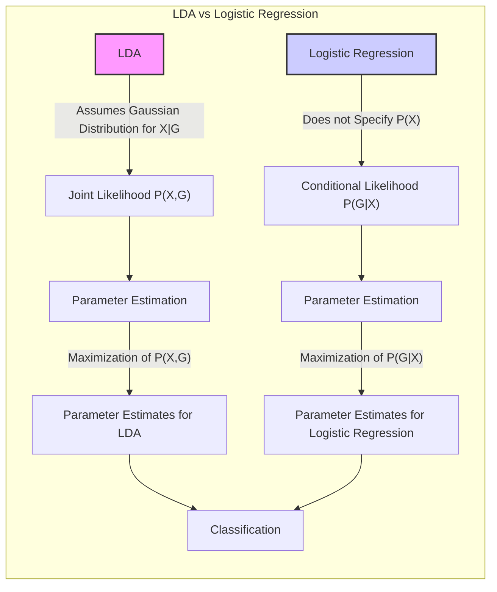
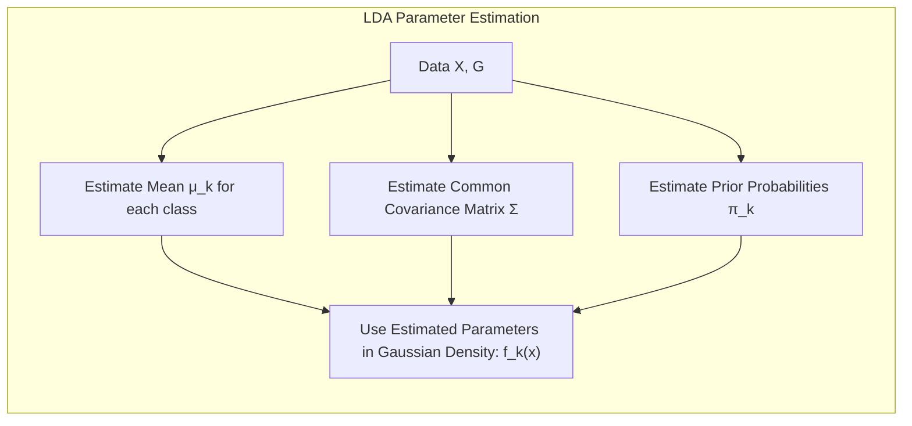
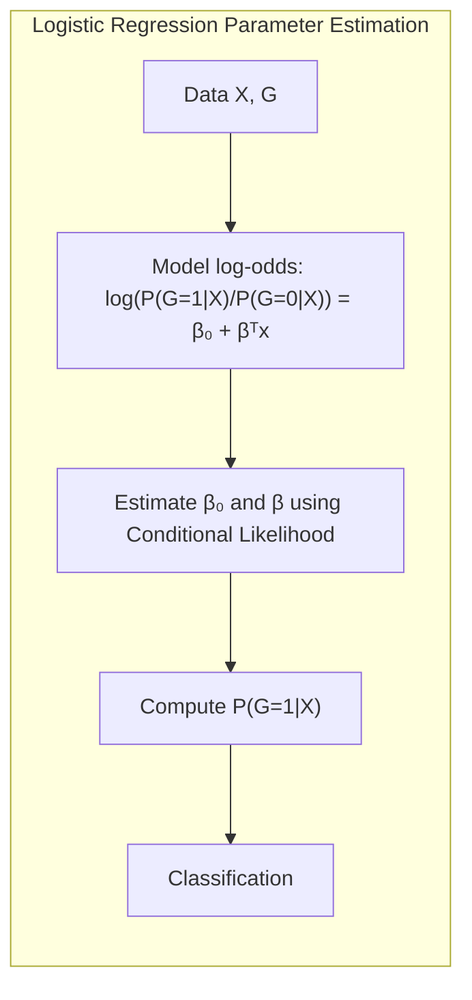
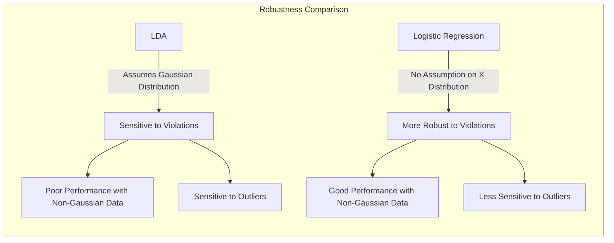
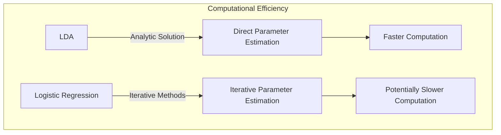
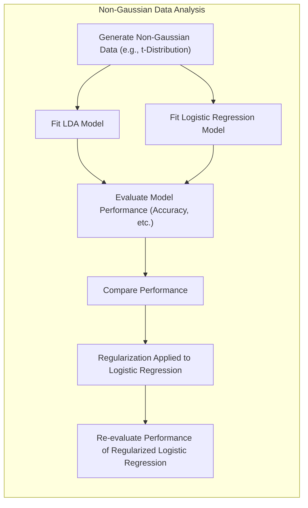
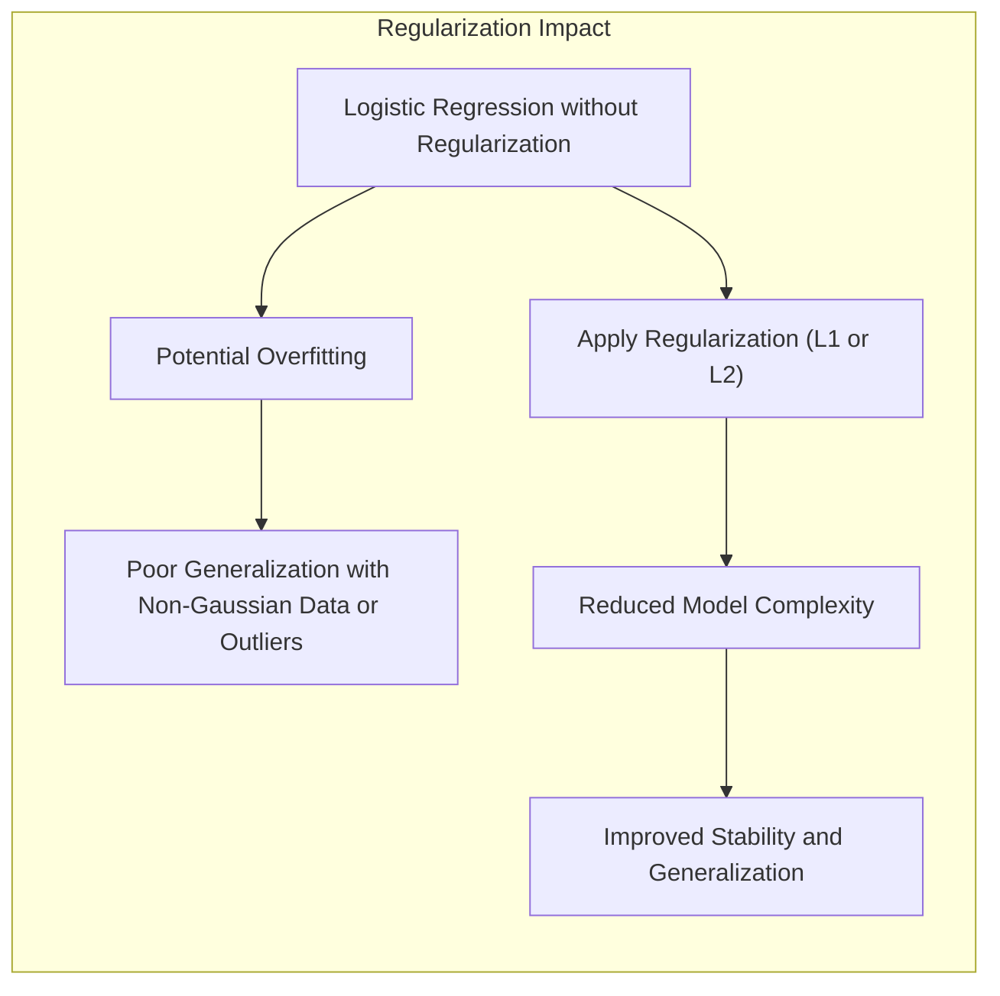

### Estimativas da LDA com Suposições Gaussianas, enquanto a Regressão Logística deixa Pr(X) Não Especificada



A principal distinção teórica entre a **Análise Discriminante Linear (LDA)** e a **regressão logística** reside em como elas tratam a distribuição das variáveis preditoras $X$ [^4.5]. A LDA opera sob a suposição de que as variáveis preditoras seguem uma distribuição gaussiana multivariada, condicionadas à classe [^4.3], enquanto a regressão logística, por sua vez, deixa a distribuição marginal das variáveis preditoras, $Pr(X)$, não especificada, focando na modelagem da probabilidade condicional da resposta $Y$ dado os preditores $X$, ou seja, $Pr(G|X)$ [^4.4]. Esta diferença fundamental leva a diferentes abordagens de ajuste e a diferentes propriedades nos modelos resultantes.

**LDA e a Suposição Gaussiana:**

A LDA parte do princípio que os dados de cada classe são gerados a partir de uma distribuição gaussiana multivariada com uma média $\mu_k$ e uma matriz de covariância comum $\Sigma$ para todas as classes. Formalmente, a densidade condicional de $X$ dado que a observação pertence à classe $k$ é dada por:

$$
    f_k(x) = \frac{1}{(2\pi)^{p/2} |\Sigma|^{1/2}} \exp\left(-\frac{1}{2}(x - \mu_k)^T \Sigma^{-1}(x-\mu_k)\right)
$$

onde $p$ é a dimensão das variáveis preditoras. Além disso, o modelo LDA também inclui as probabilidades *a priori* das classes $\pi_k$.

> 💡 **Exemplo Numérico:**
> Vamos considerar um exemplo com duas classes ($k=2$) e duas variáveis preditoras ($p=2$). Suponha que temos as seguintes médias e matriz de covariância:
>
> $\mu_1 = \begin{bmatrix} 1 \\ 1 \end{bmatrix}$, $\mu_2 = \begin{bmatrix} 3 \\ 3 \end{bmatrix}$, $\Sigma = \begin{bmatrix} 1 & 0.5 \\ 0.5 & 1 \end{bmatrix}$
>
> E as probabilidades a priori: $\pi_1 = 0.4$ e $\pi_2 = 0.6$.
>
> Para uma nova observação $x = \begin{bmatrix} 2 \\ 2 \end{bmatrix}$, podemos calcular as densidades condicionais:
>
> 1.  Calcular $\Sigma^{-1}$:
>    $\Sigma^{-1} = \frac{1}{1*1 - 0.5*0.5}\begin{bmatrix} 1 & -0.5 \\ -0.5 & 1 \end{bmatrix} = \frac{1}{0.75}\begin{bmatrix} 1 & -0.5 \\ -0.5 & 1 \end{bmatrix} = \begin{bmatrix} 1.33 & -0.67 \\ -0.67 & 1.33 \end{bmatrix}$
> 2.  Calcular $(x - \mu_k)^T \Sigma^{-1}(x-\mu_k)$ para cada classe:
>     - Classe 1: $(x - \mu_1) = \begin{bmatrix} 1 \\ 1 \end{bmatrix}$.
>        $(x - \mu_1)^T \Sigma^{-1}(x-\mu_1) = \begin{bmatrix} 1 & 1 \end{bmatrix} \begin{bmatrix} 1.33 & -0.67 \\ -0.67 & 1.33 \end{bmatrix} \begin{bmatrix} 1 \\ 1 \end{bmatrix} = \begin{bmatrix} 0.66 & 0.66 \end{bmatrix} \begin{bmatrix} 1 \\ 1 \end{bmatrix} = 1.32$
>     - Classe 2: $(x - \mu_2) = \begin{bmatrix} -1 \\ -1 \end{bmatrix}$.
>        $(x - \mu_2)^T \Sigma^{-1}(x-\mu_2) = \begin{bmatrix} -1 & -1 \end{bmatrix} \begin{bmatrix} 1.33 & -0.67 \\ -0.67 & 1.33 \end{bmatrix} \begin{bmatrix} -1 \\ -1 \end{bmatrix} = \begin{bmatrix} -0.66 & -0.66 \end{bmatrix} \begin{bmatrix} -1 \\ -1 \end{bmatrix} = 1.32$
> 3.  Calcular $|\Sigma|$: $|\Sigma| = 1 * 1 - 0.5 * 0.5 = 0.75$
> 4.  Calcular $f_k(x)$:
>     - Classe 1: $f_1(x) = \frac{1}{(2\pi)^{2/2} \sqrt{0.75}} \exp(-\frac{1}{2} * 1.32) = \frac{1}{2\pi\sqrt{0.75}} \exp(-0.66) \approx 0.087$
>     - Classe 2: $f_2(x) = \frac{1}{(2\pi)^{2/2} \sqrt{0.75}} \exp(-\frac{1}{2} * 1.32) = \frac{1}{2\pi\sqrt{0.75}} \exp(-0.66) \approx 0.087$
> 5. Calcular as probabilidades a posteriori:
>   - $Pr(G=1|X=x) = \frac{f_1(x)\pi_1}{f_1(x)\pi_1 + f_2(x)\pi_2} = \frac{0.087*0.4}{0.087*0.4 + 0.087*0.6} = \frac{0.0348}{0.0348+0.0522} = 0.4$
>   - $Pr(G=2|X=x) = \frac{f_2(x)\pi_2}{f_1(x)\pi_1 + f_2(x)\pi_2} = \frac{0.087*0.6}{0.087*0.4 + 0.087*0.6} = \frac{0.0522}{0.0348+0.0522} = 0.6$
>
> Neste caso, a probabilidade a posteriori da classe 2 é maior, então a observação seria classificada na classe 2.



A estimativa dos parâmetros no LDA (as médias $\mu_k$, a covariância $\Sigma$ e as probabilidades *a priori* $\pi_k$) é feita por meio de estimadores de máxima verossimilhança. A estimativa do modelo LDA envolve a modelagem conjunta de $X$ e $G$. A verossimilhança conjunta para a LDA é dada por:

$$
   L(\mu_k, \Sigma, \pi_k) = \prod_{i=1}^N f_{g_i}(x_i) \pi_{g_i}
$$

onde $g_i$ é a classe correspondente à observação $x_i$.
A maximização dessa verossimilhança leva às estimativas de máxima verossimilhança para os parâmetros, que são as médias amostrais, a covariância amostral e as frequências relativas das classes [^4.3]. As estimativas são obtidas diretamente a partir dos dados por meio de formulas explícitas.

**Regressão Logística e a Distribuição Não Especificada de Pr(X):**

A regressão logística, por outro lado, foca na modelagem da probabilidade condicional da resposta $Y$ dado os preditores $X$, sem fazer suposições sobre a distribuição das variáveis preditoras. Em outras palavras, a regressão logística modela o log-odds da probabilidade posterior da classe $k$ através de uma função linear dos preditores:

$$
    \log\left(\frac{Pr(G=1|X=x)}{Pr(G=0|X=x)}\right) = \beta_0 + \beta^T x
$$

A regressão logística não especifica como a distribuição marginal de $X$, $Pr(X)$, se comporta, e consequentemente, não necessita especificar uma distribuição para $X$.

> 💡 **Exemplo Numérico:**
> Suponha um modelo de regressão logística com uma variável preditora $x$ e os seguintes coeficientes estimados:
>
> $\beta_0 = -1$ e $\beta = 0.5$
>
> Para um valor de $x = 2$, podemos calcular o log-odds:
>
> $\log\left(\frac{Pr(G=1|X=2)}{Pr(G=0|X=2)}\right) = -1 + 0.5 * 2 = 0$
>
> Para obter a probabilidade $Pr(G=1|X=2)$, primeiro calculamos o odds:
>
> $\frac{Pr(G=1|X=2)}{Pr(G=0|X=2)} = e^0 = 1$
>
> Como $Pr(G=1|X=2) + Pr(G=0|X=2) = 1$, então $Pr(G=1|X=2) = Pr(G=0|X=2)$, e temos:
>
> $Pr(G=1|X=2) = \frac{1}{1+1} = 0.5$
>
> Se tivéssemos um valor de $x=4$:
>
> $\log\left(\frac{Pr(G=1|X=4)}{Pr(G=0|X=4)}\right) = -1 + 0.5 * 4 = 1$
>
> $\frac{Pr(G=1|X=4)}{Pr(G=0|X=4)} = e^1 \approx 2.718$
>
> $Pr(G=1|X=4) = \frac{e^1}{1+e^1} \approx \frac{2.718}{1+2.718} \approx 0.731$
>
> Isto mostra que à medida que $x$ aumenta, a probabilidade de $G=1$ também aumenta.



O ajuste do modelo de regressão logística é feito por meio da maximização da verossimilhança condicional das classes dadas as variáveis preditoras:

$$
    L(\beta) = \prod_{i=1}^N p_i^{y_i} (1-p_i)^{1-y_i}
$$

onde $p_i$ é a probabilidade estimada da classe positiva para a observação $i$. A maximização da verossimilhança leva à estimativa dos parâmetros $\beta_0$ e $\beta$ que melhor ajustam o modelo aos dados.

**Comparação:**

A diferença fundamental entre LDA e regressão logística reside no fato de que a LDA assume uma distribuição conjunta de $X$ e $G$, enquanto a regressão logística modela apenas a distribuição condicional de $G|X$ [^4.5]. O LDA utiliza informações sobre a distribuição de X para estimar a probabilidade condicional da classe $G$ dado $X$, enquanto a regressão logística ignora a distribuição marginal de X e foca diretamente na distribuição condicional de G dado X.

A LDA utiliza uma distribuição gaussiana para obter suas estimativas, e a inferência sobre parâmetros ou sobre o desempenho do modelo se baseia nessa suposição. A logística não faz essas suposições, e a inferência se baseia na distribuição assintótica dos estimadores de máxima verossimilhança, que independe da distribuição dos preditores.

Essa diferença nas suposições leva a diferentes características nos modelos resultantes. A LDA pode ser mais eficiente quando os dados seguem uma distribuição gaussiana, enquanto a regressão logística tende a ser mais robusta a desvios da normalidade. A regressão logística também pode lidar melhor com dados não balanceados, e os coeficientes podem ser interpretados em termos de *odds ratio*.

**Lemma 28:** *A LDA assume uma distribuição gaussiana multivariada para as variáveis preditoras, condicionada à classe, e modela a distribuição conjunta de X e G, enquanto a regressão logística não assume nenhuma distribuição para as variáveis preditoras, focando apenas na distribuição condicional de G dado X.*

*Prova:*  A formulação da LDA se baseia na modelagem da densidade conjunta de X e G, com suposições sobre as distribuições condicionais. A regressão logística, por sua vez, foca na probabilidade condicional de G dado X, sem assumir uma distribuição para X. [^4.3] [^4.4] $\blacksquare$

**Corolário 28:** *A estimativa dos parâmetros da LDA é baseada em fórmulas explícitas, derivadas da distribuição gaussiana, enquanto a estimativa dos parâmetros da regressão logística envolve um processo iterativo de maximização da verossimilhança condicional.*

*Prova:* A LDA permite uma solução direta por meio das estimativas de máxima verossimilhança para uma gaussiana multivariada, enquanto a regressão logística requer um algoritmo iterativo para encontrar os parâmetros. [^4.3] [^4.4.1] $\blacksquare$

A diferença na forma como LDA e regressão logística tratam a distribuição de $X$ é fundamental para entender suas propriedades e suas limitações, e para fazer uma escolha informada entre os dois métodos em diferentes aplicações.

### Implicações na Prática: Robustez a Violações de Suposições e Eficiência Computacional



As diferenças fundamentais nas suposições e abordagens de ajuste entre a **Análise Discriminante Linear (LDA)** e a **regressão logística** têm **implicações práticas** importantes em termos de **robustez a violações de suposições** e **eficiência computacional** [^4.3], [^4.4].

**Robustez a Violações de Suposições:**

A LDA, ao assumir que os dados são gerados por distribuições gaussianas multivariadas com a mesma matriz de covariância para todas as classes, é vulnerável a violações dessa suposição. As seguintes situações ilustram os problemas que podem surgir quando as suposições da LDA não são satisfeitas:

1.  **Dados Não Gaussianos:** Quando os dados não seguem uma distribuição gaussiana, a performance da LDA pode ser afetada negativamente. As estimativas dos parâmetros, e a própria forma das funções discriminantes, podem ser influenciadas pela não normalidade, levando a resultados menos precisos.

2.  **Diferentes Matrizes de Covariância:** Se as classes possuem matrizes de covariância diferentes, a fronteira de decisão obtida pelo LDA, que é linear, pode não ser a ideal. Nesse caso, a análise discriminante quadrática (QDA), que modela as classes com diferentes matrizes de covariância, pode ser mais adequada.

3.  **Outliers:** A LDA é sensível a outliers, que são observações que se desviam consideravelmente do padrão geral dos dados. Outliers podem distorcer as estimativas das médias e da matriz de covariância, levando a resultados errôneos.

> 💡 **Exemplo Numérico:**
> Imagine um conjunto de dados simulado com duas classes, onde a classe 1 segue uma distribuição gaussiana, enquanto a classe 2 segue uma distribuição com caudas pesadas (e.g., t-Student com poucos graus de liberdade) e possui alguns outliers. Ao aplicar LDA, os outliers e a distribuição não gaussiana da classe 2 podem distorcer a estimativa da matriz de covariância comum, levando a uma fronteira de decisão inadequada.

A regressão logística, por outro lado, é mais robusta a violações das suposições, pois não assume nenhuma distribuição específica para as variáveis preditoras. A regressão logística é um método flexível que lida bem com:

1.  **Dados Não Gaussianos:** A regressão logística não se baseia em suposições sobre a distribuição das variáveis preditoras, o que a torna adequada para dados que não seguem uma distribuição gaussiana.

2.  **Outliers:** A regressão logística é menos sensível a outliers do que a LDA, pois a função logística é limitada no intervalo [0,1] e não é tão afetada por valores extremos. As penalidades (como L1 e L2) podem aumentar ainda mais a robustez do modelo a outliers.

No entanto, a regressão logística não é completamente imune a problemas. A presença de multicolinearidade entre os preditores, por exemplo, pode levar a instabilidade nos coeficientes. Além disso, outliers nos espaços das variáveis resposta podem influenciar a estimação dos parâmetros.

> 💡 **Exemplo Numérico:**
> Considere um conjunto de dados com uma variável preditora que apresenta um outlier. Ao ajustar a regressão logística, o outlier terá um impacto menor sobre os coeficientes do que teria em um modelo LDA, devido à natureza da função logística. Além disso, a inclusão de uma penalidade L1 ou L2 pode reduzir ainda mais o impacto do outlier.

**Eficiência Computacional:**

Em termos de eficiência computacional, a LDA geralmente tem vantagem sobre a regressão logística. A LDA possui uma solução analítica para a estimativa dos parâmetros, o que significa que a solução ótima pode ser encontrada diretamente sem a necessidade de algoritmos iterativos. A complexidade computacional da LDA é relativamente baixa, o que torna o método rápido e eficiente, mesmo em grandes conjuntos de dados.



A regressão logística, por sua vez, requer a aplicação de algoritmos iterativos, como o IRLS, para encontrar os parâmetros que maximizam a verossimilhança condicional. A complexidade computacional da regressão logística pode ser maior do que a LDA, especialmente em conjuntos de dados grandes ou com um grande número de parâmetros. No entanto, as implementações modernas da regressão logística são altamente eficientes e podem lidar com conjuntos de dados de tamanho moderado de forma rápida e eficaz.

> 💡 **Exemplo Numérico:**
> Em um conjunto de dados com 1000 observações e 5 variáveis preditoras, o tempo de ajuste do LDA seria menor do que o tempo de ajuste da regressão logística. Isso ocorre porque o LDA envolve apenas o cálculo de médias e covariâncias, enquanto a regressão logística envolve um processo iterativo de otimização.

Em resumo:

*   A LDA é eficiente computacionalmente e tem um bom desempenho quando os dados satisfazem as suposições gaussianas.

*   A regressão logística é mais robusta a violações das suposições da LDA e também lida com dados não balanceados ou dados que apresentam uma separação perfeita.

A escolha entre LDA e regressão logística envolve, portanto, um *trade-off* entre as suposições, robustez e eficiência computacional, e o método mais adequado deve ser escolhido considerando as características dos dados e os objetivos da análise.

**Lemma 29:** *A LDA, por se basear em suposições gaussianas, pode ter sua performance reduzida em casos de violação dessas premissas, enquanto a regressão logística tende a ser mais robusta a desvios da normalidade e à presença de outliers.*

*Prova:* A LDA utiliza estimativas de parâmetros com base na distribuição gaussiana, e esses parâmetros podem ser afetados pela violação da normalidade e pela presença de outliers. A regressão logística, por sua vez, não depende da suposição de normalidade, tornando-a mais robusta. [^4.3] [^4.4] $\blacksquare$

**Corolário 29:** *A LDA, por ter uma solução analítica para a estimativa dos parâmetros, é geralmente mais eficiente computacionalmente do que a regressão logística, que requer a aplicação de algoritmos iterativos*.

*Prova:* A LDA, ao ter uma solução fechada para os estimadores, apresenta maior eficiência computacional quando comparada com a regressão logística. [^4.3] [^4.4] $\blacksquare$

A escolha entre LDA e regressão logística deve levar em consideração as características dos dados, como a presença de outliers, a normalidade dos dados e os requisitos de eficiência computacional.

### Análise Comparativa com Dados Não Gaussianos e a Importância da Regularização



A análise comparativa da **Análise Discriminante Linear (LDA)** e da **regressão logística** em **dados não gaussianos** é crucial para entender a importância das suposições dos modelos e para orientar a escolha do método mais adequado [^4.3], [^4.4]. A geração de dados não gaussianos sintéticos ou o uso de conjuntos de dados reais que apresentam desvios da normalidade é essencial para avaliar o desempenho dos modelos em cenários mais realistas.

Para criar dados não gaussianos sintéticos, podemos usar distribuições com caudas mais pesadas ou com assimetria, como a distribuição t-Student, a distribuição gama ou uma mistura de distribuições gaussianas. É possível simular dados com diferentes níveis de desvio da normalidade e avaliar como isso afeta o desempenho da LDA e da regressão logística.

> 💡 **Exemplo Numérico:**
> Vamos gerar dados sintéticos com duas classes, onde a classe 1 segue uma distribuição gaussiana e a classe 2 segue uma distribuição t-Student com 3 graus de liberdade, que tem caudas mais pesadas.
>
> ```python
> import numpy as np
> from sklearn.discriminant_analysis import LinearDiscriminantAnalysis
> from sklearn.linear_model import LogisticRegression
> from sklearn.model_selection import train_test_split
> from sklearn.metrics import accuracy_score
>
> # Gerar dados Gaussianos para a Classe 1
> np.random.seed(42)
> mean1 = [0, 0]
> cov1 = [[1, 0], [0, 1]]
> X1 = np.random.multivariate_normal(mean1, cov1, 500)
> y1 = np.zeros(500)
>
> # Gerar dados t-Student para a Classe 2
> mean2 = [3, 3]
> df = 3
> X2 = np.random.multivariate_normal(mean2, cov1, 500)  # Usando a mesma covariância para simplificar
> X2 = np.array([np.random.standard_t(df, size=2) + mean2 for _ in range(500)])
> y2 = np.ones(500)
>
> # Concatenar os dados
> X = np.concatenate((X1, X2))
> y = np.concatenate((y1, y2))
>
> # Dividir os dados em treino e teste
> X_train, X_test, y_train, y_test = train_test_split(X, y, test_size=0.3, random_state=42)
>
> # Ajustar o modelo LDA
> lda = LinearDiscriminantAnalysis()
> lda.fit(X_train, y_train)
> y_pred_lda = lda.predict(X_test)
> accuracy_lda = accuracy_score(y_test, y_pred_lda)
>
> # Ajustar o modelo de regressão logística
> logistic = LogisticRegression(solver='liblinear')
> logistic.fit(X_train, y_train)
> y_pred_logistic = logistic.predict(X_test)
> accuracy_logistic = accuracy_score(y_test, y_pred_logistic)
>
> print(f"Acurácia LDA: {accuracy_lda:.4f}")
> print(f"Acurácia Regressão Logística: {accuracy_logistic:.4f}")
> ```
>
> Neste exemplo, você verá que a acurácia da regressão logística tende a ser melhor do que a acurácia da LDA devido à violação da suposição de normalidade.

Em experimentos controlados, onde os dados são gerados por uma distribuição gaussiana, espera-se que a LDA tenha um bom desempenho, sendo inclusive mais eficiente que a regressão logística em cenários com poucos dados. No entanto, ao introduzir dados com desvios da normalidade, como assimetria ou caudas pesadas, a LDA pode perder acurácia, enquanto a regressão logística tende a manter um bom desempenho, dado que suas premissas são menos restritivas.

Além disso, a presença de **outliers** pode ter um impacto maior na performance da LDA, uma vez que ela é mais sensível a esses valores extremos. Outliers podem distorcer as estimativas de média e da matriz de covariância na LDA, afetando a capacidade de generalização do modelo. Em contraste, a regressão logística é mais robusta a outliers.

A análise comparativa com dados não gaussianos pode envolver as seguintes etapas:

1.  **Geração de Dados:** Gerar dados sintéticos não gaussianos com diferentes níveis de assimetria ou caudas pesadas, ou utilizar conjuntos de dados reais com violações da normalidade.

2.  **Ajuste dos Modelos:** Ajustar modelos LDA e regressão logística aos dados simulados.

3.  **Avaliação do Desempenho:** Avaliar o desempenho dos modelos por meio de métricas como acurácia, precisão, recall, especificidade ou a área sob a curva ROC (AUC). Utilizar validação cruzada ou dados de teste para avaliar a capacidade de generalização dos modelos.

4.  **Visualização dos Resultados:** Visualizar os resultados para identificar padrões e tendências. Curvas ROC ou gráficos de precisão-recall podem ser utilizados para comparar o desempenho dos modelos em diferentes pontos de corte de probabilidade.

5.  **Interpretação:** Interpretar as diferenças de desempenho entre LDA e regressão logística, considerando os efeitos das suposições dos modelos.



A **regularização**, como penalidade L1 (Lasso) ou L2 (Ridge), pode desempenhar um papel crucial no desempenho da regressão logística em dados não gaussianos. A regularização reduz a complexidade do modelo, diminuindo a chance de overfitting e melhorando a capacidade de generalização, em particular, quando há outliers. A escolha adequada do parâmetro de regularização pode melhorar o desempenho do modelo em dados não gaussianos, compensando a falta de suposições sobre a distribuição dos preditores.

> 💡 **Exemplo Numérico:**
> Vamos aplicar a regularização L2 (Ridge) à regressão logística do exemplo anterior:
>
> ```python
> from sklearn.linear_model import LogisticRegression
> from sklearn.model_selection import train_test_split
> from sklearn.metrics import accuracy_score
>
> # Dividir os dados em treino e teste
> X_train, X_test, y_train, y_test = train_test_split(X, y, test_size=0.3, random_state=42)
>
> # Ajustar o modelo de regressão logística com regularização L2
> logistic_reg = LogisticRegression(solver='liblinear', penalty='l2', C=0.1) # C é o inverso do lambda
> logistic_reg.fit(X_train, y_train)
> y_pred_logistic_reg = logistic_reg.predict(X_test)
> accuracy_logistic_reg = accuracy_score(y_test, y_pred_logistic_reg)
>
> print(f"Acurácia Regressão Logística com L2: {accuracy_logistic_reg:.4f}")
> ```
>
> Ajustando o parâmetro `C`, podemos ver como a regularização L2 pode melhorar a acurácia em dados não gaussianos. A regularização ajuda a lidar com a complexidade do modelo, especialmente em situações onde os dados não seguem as suposições da LDA.

Em resumo, a análise comparativa em dados não gaussianos revela a importância de avaliar o impacto das suposições dos modelos e da capacidade de generalização, além do uso da regularização para mitigar os efeitos negativos de outliers e desvios da normalidade.

**Lemma 30:** *A violação da suposição de normalidade da LDA, especialmente em dados com assimetria ou caudas pesadas, pode levar a uma redução da acurácia e da capacidade de generalização do modelo, enquanto a regressão logística tende a ser mais robusta a esses desvios.*

*Prova:* A LDA se baseia nas suposições gaussianas para estimar parâmetros, enquanto a regressão logística é mais flexível nesse aspecto. [^4.3] [^4.4] $\blacksquare$

**Corolário 30:** *A regularização, como L1 ou L2, pode melhorar o desempenho da regressão logística em dados não gaussianos, reduzindo o overfitting e melhorando a estabilidade do modelo.*

*Prova:* A regularização ajuda a controlar a complexidade do modelo, tornando-o menos sensível a outliers e a desvios da normalidade. $\blacksquare$

A escolha do modelo de classificação mais adequado, LDA ou regressão logística, deve considerar as características dos dados e as consequências de violações das suposições, e a regularização pode ser um elemento crucial em cenários com dados complexos.

### Conclusão

Este capítulo explorou as diferenças fundamentais entre LDA e regressão logística, focando em como a LDA assume que os dados seguem uma distribuição gaussiana e a regressão logística deixa a distribuição marginal de $X$ não especificada. As implicações práticas dessas diferenças foram discutidas, incluindo a robustez a violações de suposições e a eficiência computacional, juntamente com exemplos de comparação em dados não gaussianos e o papel da regularização. A comparação entre a LDA e a regressão logística revela a importância de entender as suposições dos modelos e suas consequências na performance, além da necessidade de métodos robustos e generalizáveis para problemas de classificação. O uso de métodos de regularização na regressão logística também foi discutido e exemplificado. A escolha do modelo adequado é um elemento importante da análise.

### Footnotes

[^4.1]: "In this chapter we revisit the classification problem and focus on linear methods for classification. Since our predictor G(x) takes values in a discrete set G, we can always divide the input space into a collection of regions labeled according to the classification. We saw in Chapter 2 that the boundaries of these regions can be rough or smooth, depending on the prediction function. For an important class of procedures, these decision boundaries are linear; this is what we will mean by linear methods for classification." *(Trecho de "The Elements of Statistical Learning")*

[^4.3]: "Linear discriminant analysis (LDA) arises in the special case when we assume that the classes have a common covariance matrix Σk = ∑. In comparing two classes k and l, it is sufficient to look at the log-ratio, and we see that" *(Trecho de "The Elements of Statistical Learning")*

[^4.4]: "The logistic regression model arises from the desire to model the posterior probabilities of the K classes via linear functions in x, while at the same time ensuring that they sum to one and remain in [0,1]." *(Trecho de "The Elements of Statistical Learning")*

[^4.4.1]: "Logistic regression models are usually fit by maximum likelihood, using the conditional likelihood of G given X. Since Pr(G|X) completely specifies the conditional distribution, the multinomial distribution is appropriate. The log-likelihood for N observations is" *(Trecho de "The Elements of Statistical Learning")*

[^4.4.4]:  "The L₁ penalty used in the lasso (Section 3.4.2) can be used for variable selection and shrinkage with any linear regression model. For logistic regression, we would maximize a penalized version of (4.20):" *(Trecho de "The Elements of Statistical Learning")*

[^4.5]: "In this situation the features are high-dimensional and correlated, and the LDA coefficients can be regularized to be smooth or sparse in the original domain of the signal. This leads to better generalization and allows for easier interpretation of the coefficients." *(Trecho de "The Elements of Statistical Learning")*
