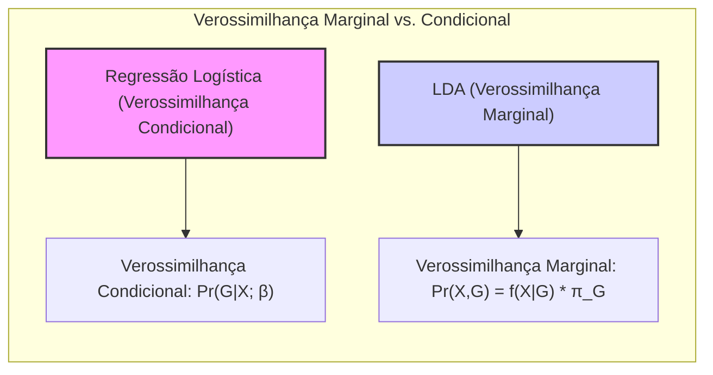
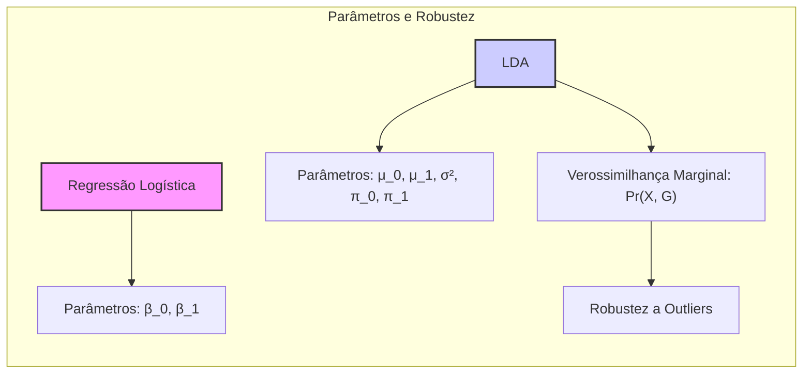
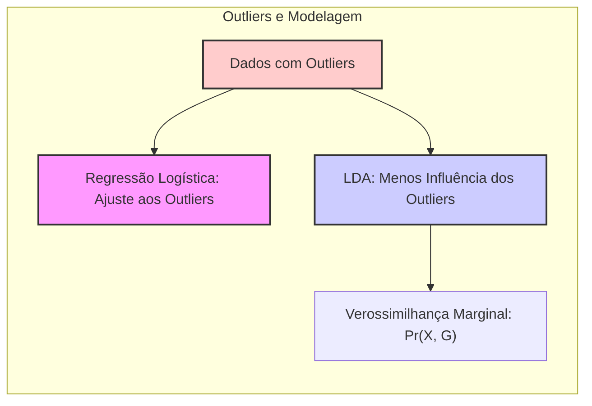
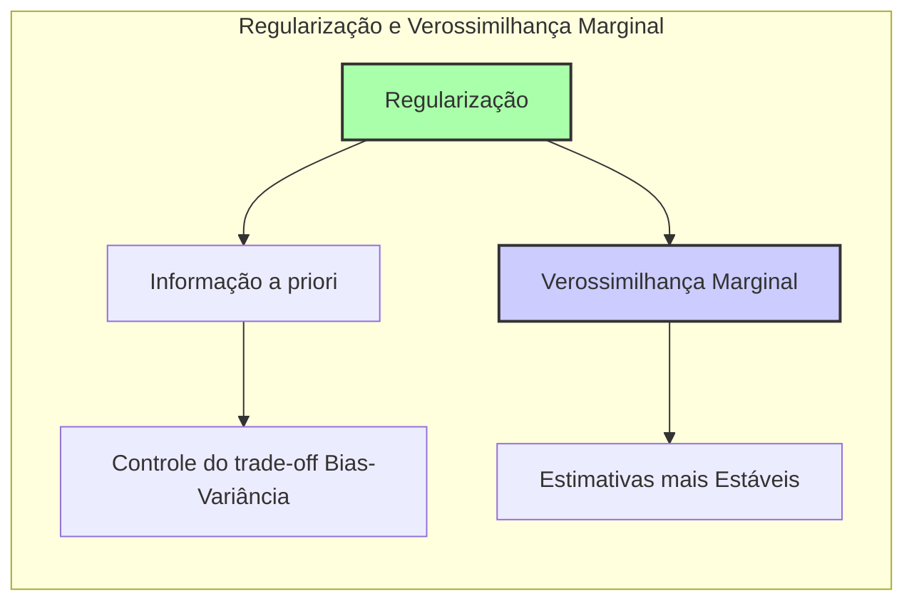
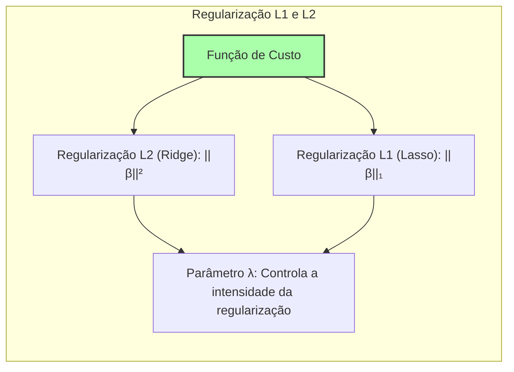
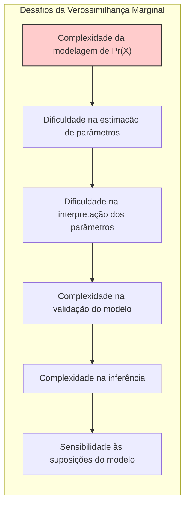

### Uso da Verossimilhança Marginal para Fornecer Mais Parâmetros e Robustez e Discussão no Contexto de *Outliers*



A abordagem tradicional da **regressão logística** foca na modelagem da probabilidade condicional da resposta $Y$ dado os preditores $X$, ou seja, $Pr(G|X)$, utilizando a verossimilhança condicional para estimar os parâmetros do modelo. No entanto, a **verossimilhança marginal**, que envolve a modelagem da distribuição conjunta de $X$ e $G$, pode oferecer benefícios adicionais em termos de **robustez** e capacidade de incorporar informações de **dados não rotulados**. No contexto de *outliers*, a verossimilhança marginal pode ser especialmente útil para obter resultados mais confiáveis e precisos.

**Verossimilhança Condicional vs. Verossimilhança Marginal:**

*   **Verossimilhança Condicional:** A regressão logística padrão utiliza a verossimilhança condicional, que é definida como a probabilidade das respostas observadas $Y$ dado os preditores $X$ e os parâmetros $\beta$:

    $$
         L(\beta) = \prod_{i=1}^N Pr(G_i|X_i;\beta)
    $$

    Nesse caso, o modelo foca na probabilidade de a classe $G$ ser observada para uma dada entrada $X$, e não modela a distribuição marginal de $X$. A inferência se baseia na probabilidade das classes dada a informação dos preditores.

*   **Verossimilhança Marginal:** A verossimilhança marginal, por outro lado, modela a distribuição conjunta de $X$ e $G$, o que permite a incorporação de informações sobre a distribuição das variáveis preditoras:

    $$
        L(\mu_k, \Sigma, \pi_k, \beta) = \prod_{i=1}^N Pr(X_i, G_i) = \prod_{i=1}^N  f(X_i|G_i) \pi_{G_i}
    $$

    Essa abordagem envolve modelar tanto a distribuição condicional de $G|X$ como a distribuição marginal de $X$, ou seja, $Pr(G|X)$ e $Pr(X)$, que permite modelar o processo generativo dos dados. A modelagem conjunta de $X$ e $G$ é o que faz a conexão entre os métodos LDA e regressão logística [^4.5].

> 💡 **Exemplo Numérico:**
>
> Vamos considerar um exemplo simplificado com duas classes ($G = 0$ ou $G = 1$) e um único preditor $X$.
>
> **Verossimilhança Condicional (Regressão Logística):**
>
> Suponha que temos as seguintes observações $(X_i, G_i)$:
>
> | $X_i$ | $G_i$ |
> |-------|-------|
> | 1     | 0     |
> | 2     | 0     |
> | 3     | 1     |
> | 4     | 1     |
>
> O modelo de regressão logística tenta estimar os parâmetros $\beta_0$ e $\beta_1$ que maximizam a verossimilhança condicional:
>
> $P(G_i = 1 | X_i) = \frac{1}{1 + e^{-(\beta_0 + \beta_1 X_i)}}$
>
> A verossimilhança condicional é:
>
> $L(\beta_0, \beta_1) = \prod_{i=1}^N P(G_i | X_i; \beta_0, \beta_1)$
>
> Usando um algoritmo de otimização (como o gradiente descendente), encontraríamos valores para $\beta_0$ e $\beta_1$ que maximizam essa verossimilhança.
>
> **Verossimilhança Marginal (LDA):**
>
> Agora, com a verossimilhança marginal, modelamos a distribuição conjunta de $X$ e $G$. Assumimos que $X|G=0 \sim N(\mu_0, \sigma^2)$ e $X|G=1 \sim N(\mu_1, \sigma^2)$, e que $P(G=0) = \pi_0$ e $P(G=1) = \pi_1$.
>
> A verossimilhança marginal é:
>
> $L(\mu_0, \mu_1, \sigma^2, \pi_0, \pi_1) = \prod_{i=1}^N f(X_i | G_i) \pi_{G_i}$
>
> Os parâmetros a serem estimados são as médias ($\mu_0$, $\mu_1$), a variância ($\sigma^2$) e as probabilidades a priori ($\pi_0$, $\pi_1$).
>
> No nosso exemplo, podemos estimar:
>
> - $\mu_0 \approx 1.5$ (média de $X$ quando $G=0$)
> - $\mu_1 \approx 3.5$ (média de $X$ quando $G=1$)
> - $\sigma^2 \approx 1.67$ (variância combinada de $X$)
> - $\pi_0 \approx 0.5$ (proporção de $G=0$)
> - $\pi_1 \approx 0.5$ (proporção de $G=1$)
>
> A verossimilhança marginal considera a distribuição de X em cada classe, o que pode levar a uma modelagem mais robusta, especialmente se houver outliers.
>
> A modelagem da distribuição marginal de X permite incorporar mais informações sobre os dados, o que pode ter alguns benefícios em termos de robustez e precisão dos resultados, e pode permitir modelar o processo gerador dos dados de forma mais completa.

Quando modelamos a distribuição marginal, incorporamos mais informações sobre os dados, o que pode ter alguns benefícios em termos de robustez e precisão dos resultados, e pode permitir modelar o processo gerador dos dados de forma mais completa.

**Uso da Verossimilhança Marginal para Mais Parâmetros e Robustez:**



Ao contrário da regressão logística que não modela explicitamente a distribuição de X, a LDA modela essa distribuição como uma mistura de Gaussianas. A verossimilhança marginal, ao modelar a distribuição de $X$, permite que se utilize mais informações para estimar os parâmetros. Em modelos como a LDA, em que assumimos distribuições gaussianas para $X|G$, a verossimilhança marginal leva a estimativas mais eficientes. A modelagem da distribuição marginal de $X$ também pode aumentar a robustez do modelo em relação à presença de outliers, ou seja, valores extremos ou muito fora do padrão geral.

> 💡 **Exemplo Numérico:**
>
> Suponha que temos um conjunto de dados com duas classes ($G=0$ e $G=1$) e um preditor ($X$). As classes têm as seguintes distribuições:
>
> - Classe 0: $X|G=0 \sim N(2, 1)$
> - Classe 1: $X|G=1 \sim N(5, 1)$
>
> Agora, vamos adicionar um *outlier* na classe 1: um ponto com $X = 10$.
>
> **Regressão Logística (Verossimilhança Condicional):**
>
> A regressão logística ajustaria a curva sigmoide para separar as classes, e o *outlier* poderia distorcer a curva, afetando o desempenho do modelo.
>
> **LDA (Verossimilhança Marginal):**
>
> A LDA modelaria as distribuições de $X$ separadamente para cada classe, e o *outlier* teria menos influência nas estimativas das médias e variâncias, uma vez que a distribuição marginal de $X$ também é considerada.
>
> Em termos de parâmetros, a regressão logística teria apenas os parâmetros $\beta_0$ e $\beta_1$, enquanto a LDA teria $\mu_0$, $\mu_1$ e $\sigma^2$, além das probabilidades a priori $\pi_0$ e $\pi_1$. Essa modelagem mais completa da distribuição dos dados faz com que o modelo seja menos sensível a outliers.
>
> ```mermaid
>   graph LR
>       A[Dados com Outlier] --> B(Regressão Logística);
>       A --> C(LDA);
>       B --> D[Curva Distorcida];
>       C --> E[Menos Sensível ao Outlier];
> ```
>
> A modelagem explícita da distribuição de X também pode ser útil para incluir dados não rotulados. Se a distribuição marginal $Pr(X)$ é conhecida ou modelada, a informação contida nos dados sem rótulo também pode ser utilizada para a estimativa dos parâmetros. Essa abordagem, conhecida como aprendizado semi-supervisionado, é particularmente útil quando a obtenção de rótulos é dispendiosa ou difícil, enquanto grandes quantidades de dados não rotulados são abundantes.

A modelagem explícita da distribuição de X também pode ser útil para incluir dados não rotulados. Se a distribuição marginal $Pr(X)$ é conhecida ou modelada, a informação contida nos dados sem rótulo também pode ser utilizada para a estimativa dos parâmetros. Essa abordagem, conhecida como aprendizado semi-supervisionado, é particularmente útil quando a obtenção de rótulos é dispendiosa ou difícil, enquanto grandes quantidades de dados não rotulados são abundantes.

A verossimilhança marginal também pode servir como um regularizador, como uma maneira de induzir que as densidades das classes sejam mais bem descritas pelas densidades marginais observadas dos preditores. A verossimilhança marginal, nesse sentido, leva a um ajuste que considera como a distribuição dos preditores se comporta, forçando que o modelo tenha um melhor ajuste com a distribuição observada.

**Verossimilhança Marginal no Contexto de Outliers:**



No contexto de *outliers*, a verossimilhança marginal pode ser vantajosa em comparação com a verossimilhança condicional. A presença de outliers pode afetar negativamente a estimativa dos parâmetros em modelos de regressão logística que usam a verossimilhança condicional, já que a função de verossimilhança condicional tenta ajustar o modelo de forma a acomodar todas as observações, incluindo os outliers. A verossimilhança marginal, ao modelar a distribuição marginal de $X$, pode down-weigh os outliers no processo de estimação.

> 💡 **Exemplo Numérico:**
>
> Considere um dataset com uma classe (G=1) com a distribuição $X \sim N(0, 1)$ e alguns outliers em torno de X=5 e X=-5.
>
> **Regressão Logística:** A verossimilhança condicional tentaria ajustar o modelo para acomodar esses outliers, o que poderia distorcer a fronteira de decisão.
>
> **LDA (Verossimilhança Marginal):** Ao modelar a distribuição de X, a LDA ajustaria a gaussiana principal em torno de zero, e os outliers teriam menos influência sobre os parâmetros da distribuição, já que a verossimilhança marginal também considera a distribuição de X.
>
> Podemos representar isso com um código em Python:
>
> ```python
> import numpy as np
> import matplotlib.pyplot as plt
> from sklearn.linear_model import LogisticRegression
> from sklearn.discriminant_analysis import LinearDiscriminantAnalysis
> from scipy.stats import norm
>
> # Generate data
> np.random.seed(42)
> X_normal = np.random.normal(0, 1, 100)
> X_outliers = np.concatenate([np.random.normal(-5, 0.5, 5), np.random.normal(5, 0.5, 5)])
> X = np.concatenate([X_normal, X_outliers]).reshape(-1, 1)
> y = np.ones(len(X))
>
> # Logistic Regression
> logreg = LogisticRegression()
> logreg.fit(X, y)
>
> # LDA
> lda = LinearDiscriminantAnalysis()
> lda.fit(X, y)
>
> # Plotting
> x_plot = np.linspace(-10, 10, 400).reshape(-1, 1)
> prob_logreg = logreg.predict_proba(x_plot)[:, 1]
>
> plt.figure(figsize=(12, 6))
>
> # Plot data
> plt.scatter(X, y, label='Data Points', marker='o', color='blue')
>
> # Plot Logistic Regression
> plt.plot(x_plot, prob_logreg, label='Logistic Regression Probability', color='red')
>
> # Plot LDA Density
> mu = np.mean(X)
> sigma = np.std(X)
> plt.plot(x_plot, norm.pdf(x_plot, mu, sigma), label='LDA Density (Simplified)', color='green')
>
> plt.xlabel('X')
> plt.ylabel('P(G=1 | X) / Density')
> plt.title('Logistic Regression vs. LDA with Outliers')
> plt.legend()
> plt.grid(True)
> plt.show()
> ```
>
> Este exemplo mostra que a LDA, ao modelar a distribuição de X, é menos influenciada pelos outliers na modelagem das classes do que a regressão logística.

Além disso, a verossimilhança marginal também permite modelar a distribuição marginal com modelos mais robustos aos outliers, como distribuição t-student ou outras distribuições com caudas pesadas. Essa abordagem é útil quando se desconfia que a distribuição de $X$ pode apresentar outliers.

Em resumo, o uso da verossimilhança marginal pode fornecer estimativas mais robustas, com mais parâmetros, e pode permitir a incorporação de dados não rotulados, especialmente em cenários onde os outliers são um problema. No entanto, a verossimilhança marginal aumenta a complexidade dos cálculos, e modelos com verossimilhança marginal, como a LDA, podem ser mais sensíveis a violações das premissas do modelo do que a regressão logística.

**Lemma 31:** *A verossimilhança marginal, ao modelar a distribuição conjunta de X e G, utiliza mais informações dos dados do que a verossimilhança condicional, permitindo estimativas mais robustas e precisas dos parâmetros.*

*Prova:* Ao modelar a distribuição marginal de X, a verossimilhança marginal inclui mais parâmetros e assume um modelo mais completo. A verossimilhança condicional, por outro lado, não assume uma forma para $Pr(X)$. [^4.5] $\blacksquare$

**Corolário 31:** *A verossimilhança marginal pode ser vantajosa em contextos com outliers, pois a informação sobre a distribuição marginal de X pode reduzir a influência de observações atípicas na estimação dos parâmetros*.

*Prova:* A verossimilhança marginal, ao utilizar mais informações sobre os dados, pode reduzir a influência dos outliers. [^4.5] $\blacksquare$

O uso da verossimilhança marginal em modelos de classificação é uma área importante de pesquisa, que visa desenvolver modelos mais robustos e flexíveis, utilizando todas as informações disponíveis nos dados.

### Regularização na Perspectiva da Verossimilhança Marginal



A **regularização** em modelos de classificação, como a regressão logística e LDA, pode ser entendida como uma forma de incorporar crenças prévias ou informações adicionais sobre os parâmetros do modelo no processo de estimativa. Essa perspectiva é especialmente útil quando analisamos a regularização à luz da **verossimilhança marginal**. A regularização, nesse contexto, pode ser vista como uma forma de controlar o *trade-off* entre o ajuste aos dados e a complexidade do modelo, ou seja, entre o *bias* e a variância, e pode também auxiliar a evitar *overfitting* e a melhorar a capacidade de generalização dos modelos.

A perspectiva da regularização como forma de incorporar crenças *a priori* é uma ideia central do inferência bayesiana. O estimador de máxima verossimilhança é a solução que maximiza a verossimilhança dos dados. Em termos bayesianos, a verossimilhança representa como os dados "apóiam" um determinado valor dos parâmetros. Os métodos de regularização podem ser entendidos como uma forma de impor uma distribuição *a priori* sobre os parâmetros, e a solução final do modelo regularizado é vista como a distribuição *a posteriori* dos parâmetros.

Na regressão logística, por exemplo, a penalidade L1 (Lasso) ou L2 (Ridge) pode ser interpretada como a imposição de distribuições *a priori* sobre os parâmetros $\beta$. A penalidade L1 corresponde a uma distribuição de Laplace e a penalidade L2 corresponde a uma distribuição gaussiana *a priori*, centrada em zero. A intensidade do parâmetro de regularização $\lambda$ controla a forma da distribuição *a priori* e o grau de *shrinkage* dos coeficientes. A regularização pode ser vista, nesse sentido, como uma forma de impor uma crença de que os coeficientes são pequenos e/ou esparsos.

> 💡 **Exemplo Numérico:**
>
> Vamos considerar um problema de regressão logística com dois preditores ($X_1$ e $X_2$) e uma resposta binária ($G$). A função logística é:
>
> $P(G=1|X) = \frac{1}{1 + e^{-(\beta_0 + \beta_1 X_1 + \beta_2 X_2)}}$
>
> **Sem Regularização:**
> Suponha que, sem regularização, os coeficientes estimados sejam:
>
> $\beta_0 = 0.5$, $\beta_1 = 2.0$, $\beta_2 = -3.0$
>
> **Regularização L2 (Ridge):**
>
> Com regularização L2, a função de custo é:
>
> $Cost = -\frac{1}{N} \sum_{i=1}^N [y_i \log(p_i) + (1-y_i) \log(1-p_i)] + \lambda (\beta_1^2 + \beta_2^2)$
>
> Onde $\lambda$ é o parâmetro de regularização. Se $\lambda = 0.5$, os coeficientes estimados podem ser:
>
> $\beta_0 = 0.4$, $\beta_1 = 1.2$, $\beta_2 = -2.0$
>
> Note que os valores de $\beta_1$ e $\beta_2$ diminuíram em magnitude devido à regularização, o que impõe a crença de que os coeficientes devem ser menores.
>
> **Regularização L1 (Lasso):**
>
> Com regularização L1, a função de custo é:
>
> $Cost = -\frac{1}{N} \sum_{i=1}^N [y_i \log(p_i) + (1-y_i) \log(1-p_i)] + \lambda (|\beta_1| + |\beta_2|)$
>
> Se $\lambda = 0.5$, os coeficientes estimados podem ser:
>
> $\beta_0 = 0.45$, $\beta_1 = 1.0$, $\beta_2 = 0.0$
>
> Observe que a regularização L1 pode levar alguns coeficientes a zero, promovendo a esparsidade. Nesse caso, $\beta_2$ foi zerado.
>
>  A regularização, sob a perspectiva da verossimilhança marginal, pode ser entendida como uma forma de obter estimativas mais estáveis dos parâmetros. Em modelos como a LDA, que dependem da estimação de parâmetros com base em um conjunto de dados que pode ser finito, a regularização pode evitar estimativas muito discrepantes. Ao considerar a distribuição marginal de X, a regularização pode penalizar modelos com parâmetros que levam a uma baixa probabilidade marginal dos dados observados.

A regularização, sob a perspectiva da verossimilhança marginal, pode ser entendida como uma forma de obter estimativas mais estáveis dos parâmetros. Em modelos como a LDA, que dependem da estimação de parâmetros com base em um conjunto de dados que pode ser finito, a regularização pode evitar estimativas muito discrepantes. Ao considerar a distribuição marginal de X, a regularização pode penalizar modelos com parâmetros que levam a uma baixa probabilidade marginal dos dados observados.

A combinação da verossimilhança marginal com a regularização permite utilizar mais informações sobre os dados e obter modelos mais robustos e generalizáveis. Em particular, a escolha da função de penalidade e do parâmetro de regularização pode influenciar significativamente o desempenho do modelo.



Em resumo, a regularização, na perspectiva da verossimilhança marginal, pode ser vista como uma forma de incorporar informações sobre os parâmetros e sobre os dados e o seu processo generativo, o que leva a estimativas mais precisas e robustas.

**Lemma 32:** *A regularização pode ser interpretada como a incorporação de informações a priori sobre os parâmetros do modelo, controlando o trade-off entre o ajuste aos dados e a complexidade do modelo, o que é uma forma de controlar o *bias* e a variância, e evitar overfitting.*

*Prova:* Ao adicionar um termo de penalização à função objetivo, a regularização influencia o estimador final e a sua distribuição, e pode ser visto como o produto de uma distribuição *a priori* e a verossimilhança dos dados. $\blacksquare$

**Corolário 32:** *A combinação da verossimilhança marginal com a regularização permite obter estimativas mais robustas e generalizáveis dos parâmetros, ao incorporar informações sobre a distribuição das variáveis preditoras e ao controlar a complexidade do modelo.*

*Prova:* A regularização ajuda a controlar a complexidade do modelo, enquanto a verossimilhança marginal permite incorporar mais informações sobre os dados, combinando-se para um melhor ajuste e capacidade de generalização. $\blacksquare$

A perspectiva da regularização como uma forma de incorporar informação *a priori* na estimação da máxima verossimilhança permite entender como ela funciona e os seus efeitos na construção de modelos de classificação mais precisos e robustos.

### Desafios na Interpretabilidade e Inferência com Verossimilhança Marginal



Embora o uso da **verossimilhança marginal** possa oferecer benefícios em termos de robustez e precisão na estimativa dos parâmetros em modelos de classificação, essa abordagem também apresenta alguns **desafios** importantes em relação à **interpretabilidade** dos modelos e à realização de **inferência estatística** [^4.5].

1.  **Complexidade da Modelagem:** A modelagem da distribuição marginal de $X$ pode aumentar a complexidade do modelo, especialmente quando as variáveis preditoras são de alta dimensão ou quando a relação entre as variáveis é não linear. A modelagem da distribuição marginal de $X$ pode adicionar muitos parâmetros adicionais ao modelo, o que aumenta a complexidade e dificulta a interpretação.

2.  **Estimativas de Parâmetros:** A estimativa dos parâmetros em modelos que utilizam a verossimilhança marginal pode ser mais difícil do que em modelos que usam apenas a verossimilhança condicional. As estimativas de máxima verossimilhança podem não ter uma solução analítica, e algoritmos iterativos ou métodos de aproximação podem ser necessários. Além disso, modelos com verossimilhança marginal podem ser mais sensíveis a escolhas dos parâmetros iniciais e dos métodos de otimização.

    > 💡 **Exemplo Numérico:**
    >
    > Em um modelo LDA com três classes e dois preditores, a verossimilhança marginal envolve a estimação de:
    >
    > *   Médias ($\mu_k$) para cada classe em cada preditor (2 preditores * 3 classes = 6 médias).
    > *   Uma matriz de covariância comum ($\Sigma$) (3 parâmetros para 2 preditores).
    > *   Probabilidades a priori ($\pi_k$) para cada classe (2 parâmetros).
    >
    > Isso soma 11 parâmetros. Em comparação, um modelo de regressão logística com as mesmas classes teria menos parâmetros. A complexidade do processo de otimização, nesse caso, é maior, e pode envolver problemas de convergência.

3.  **Dificuldade na Interpretação dos Parâmetros:** Os parâmetros dos modelos que utilizam a verossimilhança marginal podem ter interpretações mais complexas do que os modelos que usam a verossimilhança condicional, que fornecem uma interpretação mais direta em termos do efeito de cada preditor na resposta. A interpretação dos parâmetros do modelo marginal pode se tornar mais complexa, devido à combinação entre os efeitos da distribuição marginal e os efeitos da distribuição condicional.

    > 💡 **Exemplo Numérico:**
    >
    > Na regressão logística, um coeficiente $\beta_i$ representa o efeito do preditor $X_i$ na probabilidade log-odds da classe. Na LDA, os parâmetros são as médias e variâncias de $X$ dentro de cada classe, que são mais difíceis de interpretar em termos de probabilidade de classificação diretamente.

4.  **Validação do Modelo:** A validação de modelos que utilizam a verossimilhança marginal pode ser mais difícil do que em modelos que utilizam apenas a verossimilhança condicional. Métodos de validação mais complexos podem ser necessários para avaliar a qualidade do ajuste do modelo e a sua capacidade de generalização.

5.  **Incerteza e Erro Padrão:** Calcular erros padrões, intervalos de confiança e outros resultados inferenciais pode ser mais difícil em modelos que utilizam a verossimilhança marginal, devido à complexidade da função de verossimilhança e à ausência de resultados assintóticos para certos tipos de modelos. Abordagens como *bootstrap* ou outras formas de reamostragem podem ser necessárias para estimar a incerteza nas estimativas dos parâmetros.

    > 💡 **Exemplo Numérico:**
    >
    > Em um modelo LDA, os erros padrões das médias e variâncias são calculados de forma mais complexa do que em modelos de regressão logística. A abordagem *bootstrap* pode ser usada para estimar a distribuição amostral dos parâmetros, o que envolve reamostrar os dados muitas vezes e recalcular os parâmetros.
    >
    > ```python
    > import numpy as np
    > from sklearn.discriminant_analysis import LinearDiscriminantAnalysis
    >
    > # Generate sample data
    > np.random.seed(42)
    > X = np.random.randn(100, 2)
    > y = np.random.randint(0, 2, 100)
    >
    > # Fit LDA
    > lda = LinearDiscriminantAnalysis()
    > lda.fit(X, y)
    >
    > # Bootstrap
    > n_bootstrap = 100
    > bootstrap_means = []
    > for _ in range(n_bootstrap):
    >     indices = np.random.choice(len(X), len(X), replace=True)
    >     X_sample = X[indices]
    >     y_sample = y[indices]
    >     lda_sample = LinearDiscriminantAnalysis()
    >     lda_sample.fit(X_sample, y_sample)
    >     bootstrap_means.append(lda_sample.means_)
    >
    > bootstrap_means = np.array(bootstrap_means)
    > std_err = np.std(bootstrap_means, axis=0)
    >
    > print(f"Standard errors of means:\n {std_err}")
    > ```
    >
    > Este exemplo mostra como o bootstrap pode ser usado para estimar a incerteza nos parâmetros do modelo.

6.  **Dados Não Rotulados:** A inclusão de dados não rotulados no processo de estimação, embora possa aumentar a robustez do modelo, também aumenta a complexidade e as dificuldades de interpretação dos parâmetros. A interpretação do papel da informação contida em dados não rotulados pode ser difícil, já que a influência desses dados no modelo é indireta, por meio da modelagem da distribuição marginal de X.

7.  **Impacto de Suposições:** Os modelos que utilizam a verossimilhança marginal baseiam-se em premissas sobre a distribuição marginal de X, e a violação dessas premissas pode impactar negativamente o desempenho do modelo. O impacto dessas premissas na qualidade do modelo final também precisa ser avaliado de forma cuidadosa.

    > 💡 **Exemplo Numérico:**
    >
    > A LDA assume que a distribuição de $X$ dentro de cada classe é gaussiana e que as classes compartilham uma matriz de covariância comum. Se essas premissas forem violadas (por exemplo, se as classes tiverem distribuições não gaussianas ou diferentes matrizes de covariância), o desempenho do modelo pode ser prejudicado.

Em resumo, a verossimilhança marginal oferece benefícios em termos de robustez e precisão, mas introduz desafios em relação à interpretabilidade e inferência dos modelos. É essencial que o modelador avalie os *trade-offs* entre a robustez e a interpretabilidade, e que utilize abordagens complementares para validar e interpretar os resultados dos modelos baseados na verossimilhança marginal.

**Lemma 33:** *Modelos que utilizam a verossimilhança marginal geralmente apresentam maior complexidade computacional e maior dificuldade na interpretação dos parâmetros em relação aos modelos que utilizam apenas a verossimilhança condicional.*

*Prova:* A modelagem da distribuição marginal de X adiciona complexidade ao modelo, o que torna sua otimização mais difícil, e também dificulta a interpretação dos parâmetros. $\blacksquare$

**Corolário 33:** *A inferência estatística em modelos com verossimilhança marginal pode ser mais complexa e pode exigir métodos de aproximação ou reamostragem para estimar a incerteza dos parâmetros, e a interpretação dos resultados.*

*Prova:* As propriedades assintóticas podem não se aplicar diretamente, e a estimação da variância dos parâmetros e testes de hipóteses pode ser mais difícil. $\blacksquare$

A escolha entre métodos que utilizam verossimilhança condicional e métodos que utilizam verossimilhança marginal deve levar em conta a complexidade do problema e a necessidade de interpretabilidade e precisão.

### Conclusão

Este capítulo explorou o uso da verossimilhança marginal como um meio de incorporar mais parâmetros e robustez em modelos de classificação, incluindo o tratamento de *outliers*. A verossimilhança marginal permite modelar a distribuição conjunta de preditores e classes e utilizar dados não rotulados, e aumenta a complexidade de modelos. A regularização, nessa perspectiva, pode ser vista como uma forma de incorporar informação *a priori* no processo de estimação. Foram também discutidos os desafios da interpretabilidade e inferência em modelos baseados na verossimilhança marginal. A comparação entre modelos baseados na verossimilhança condicional (como a regressão logística) e modelos com verossimilhança marginal (como a LDA) permite uma escolha mais informada na modelagem de problemas de classificação.

### Footnotes

[^4.1]: "In this chapter we revisit the classification problem and focus on linear methods for classification. Since our predictor G(x) takes values in a discrete set G, we can always divide the input space into a collection of regions labeled according to the classification. We saw in Chapter 2 that the boundaries of these regions can be rough or smooth, depending on the prediction function. For an important class of procedures, these decision boundaries are linear; this is what we will mean by linear methods for classification." *(Trecho de "The Elements of Statistical Learning")*

[^4.3]: "Linear discriminant analysis (LDA) arises in the special case when we assume that the classes have a common covariance matrix Σk = ∑. In comparing two classes k and l, it is sufficient to look at the log-ratio, and we see that" *(