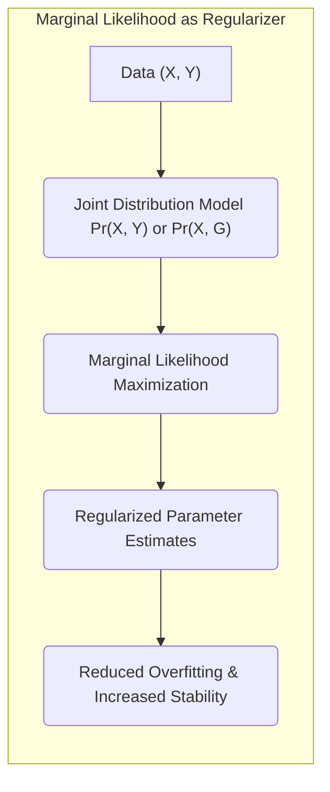
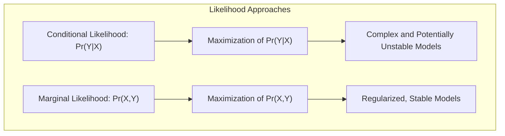
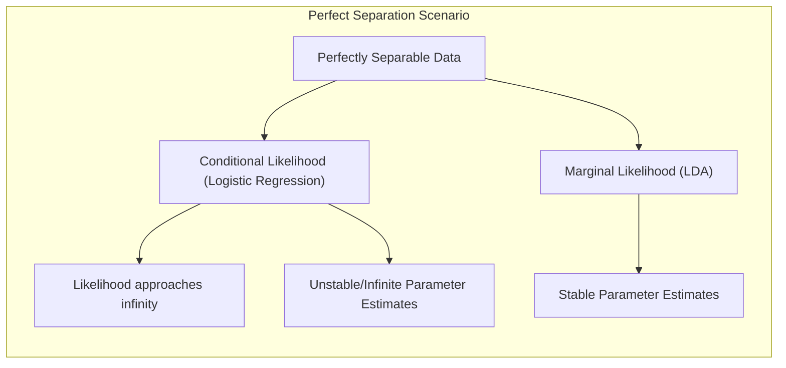
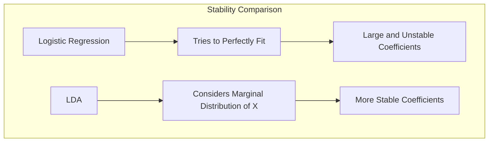
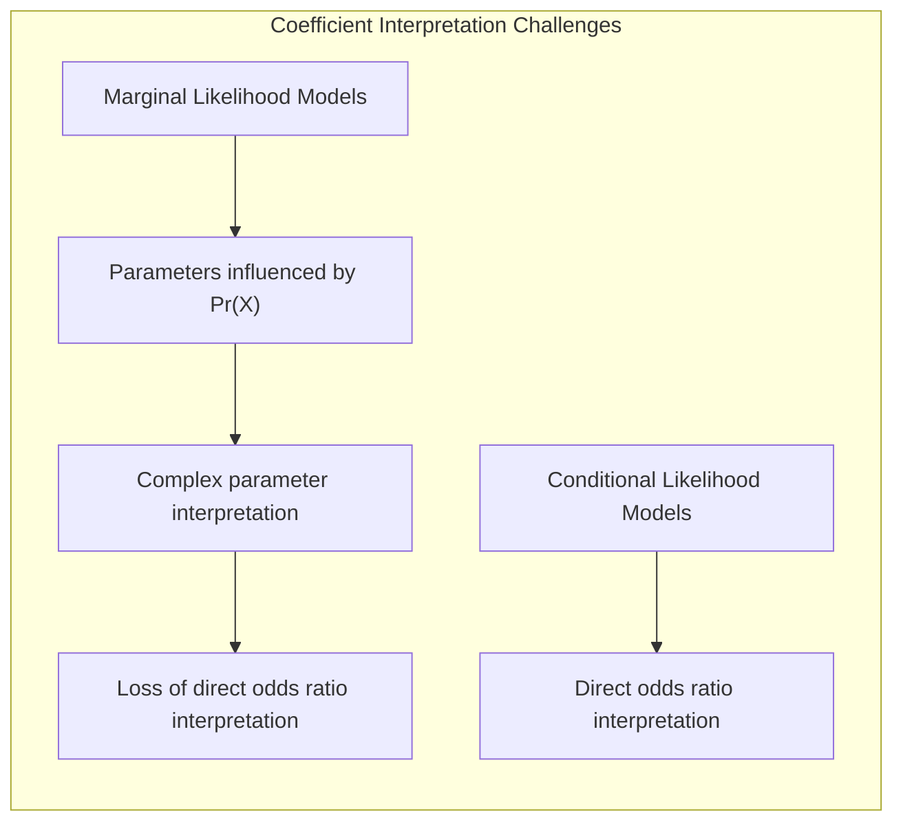
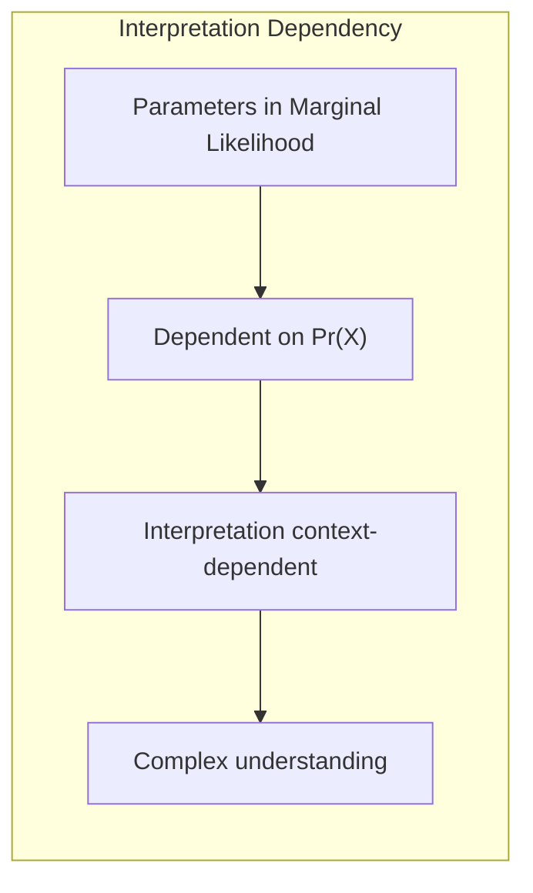
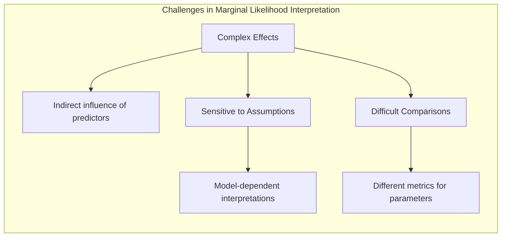

### Uso da Verossimilhança Marginal como Regularizador e Discussão da Degenerescência com Separação Perfeita



A **verossimilhança marginal**, além de fornecer uma maneira mais completa de modelar os dados, pode ser utilizada como uma ferramenta de **regularização** em modelos de classificação, atuando como um mecanismo para evitar o *overfitting* e aumentar a estabilidade das estimativas dos parâmetros. A regularização, nesse contexto, impõe uma restrição na complexidade do modelo e evita que ele se ajuste excessivamente aos ruídos ou particularidades dos dados de treinamento. A discussão da degenerescência, especialmente em casos de **separação perfeita** das classes, permite entender como a verossimilhança marginal pode ser utilizada para garantir a estabilidade dos modelos.

**Verossimilhança Marginal como Regularizador:**

A abordagem tradicional de modelos como a regressão logística envolve a maximização da verossimilhança condicional $Pr(Y|X)$, o que muitas vezes leva a modelos complexos e instáveis, especialmente quando o número de parâmetros é comparável ou maior que o tamanho da amostra. A verossimilhança marginal, por outro lado, modela a distribuição conjunta de $X$ e $Y$ ou $G$, e pode ser usada para construir estimadores regularizados que controlam a complexidade do modelo e melhoram a capacidade de generalização.



Quando a verossimilhança marginal é utilizada, a função objetivo a ser maximizada inclui a distribuição marginal de $X$ como parte do modelo, o que leva a uma estimativa dos parâmetros que leva em conta a distribuição conjunta de $X$ e $G$. Essa abordagem, em geral, adiciona mais informações sobre os dados, já que incorpora não apenas o modelo de $G|X$, mas também modela as variáveis preditoras $X$.

> 💡 **Exemplo Numérico:**
>
> Considere um problema de classificação binária com duas variáveis preditoras ($X_1$ e $X_2$) e uma variável resposta binária $Y$ (0 ou 1). Suponha que temos os seguintes dados de treinamento:
>
> | $X_1$ | $X_2$ | $Y$ |
> |-------|-------|-----|
> | 1     | 2     | 0   |
> | 1.5   | 1.8   | 0   |
> | 2     | 3     | 0   |
> | 5     | 7     | 1   |
> | 6     | 6.5   | 1   |
> | 7     | 8     | 1   |
>
> **Verossimilhança Condicional (Regressão Logística):**
>
> A regressão logística modelaria $P(Y|X)$. A maximização da verossimilhança condicional levaria a parâmetros que se ajustam bem aos dados de treinamento, mas podem sofrer *overfitting*. Por exemplo, os parâmetros poderiam levar a uma fronteira de decisão complexa que se ajusta aos pontos de treinamento, mas não generaliza bem.
>
> **Verossimilhança Marginal (LDA):**
>
> A LDA modelaria a distribuição conjunta de $X$ e $Y$. Isso significa que o modelo consideraria a distribuição de $X_1$ e $X_2$ para cada classe de $Y$. A maximização da verossimilhança marginal levaria a parâmetros que consideram tanto a relação entre $X$ e $Y$ quanto a distribuição de $X$. Isso tende a produzir fronteiras de decisão mais simples e estáveis, reduzindo o *overfitting*.
>
> Em termos práticos, a LDA pode, por exemplo, assumir que as variáveis preditoras têm uma distribuição normal multivariada para cada classe, com médias diferentes, mas mesma matriz de covariância. Ao modelar a distribuição de $X$, a LDA não apenas se ajusta a relação entre $X$ e $Y$, mas também considera a estrutura de $X$, o que leva a uma solução mais regularizada.

Ao maximizar a verossimilhança marginal, é possível obter estimativas mais estáveis dos parâmetros e evitar problemas de *overfitting*, onde o modelo se ajusta muito bem aos dados de treinamento, mas apresenta um mau desempenho em dados não vistos. A verossimilhança marginal, nesse sentido, pode ser vista como um regularizador implícito que controla a complexidade do modelo, já que o modelo deve se ajustar à distribuição dos preditores, além do efeito dos preditores sobre a variável resposta.

Em termos bayesianos, a verossimilhança marginal corresponde à probabilidade marginal dos dados, que é obtida pela integração sobre os parâmetros, ou seja, integrando a verossimilhança conjunta para todos os valores possíveis dos parâmetros. Essa abordagem tem como efeito penalizar modelos que atribuem altas probabilidades aos dados de treinamento, mas que levam a uma probabilidade marginal baixa.

**Discussão da Degenerescência com Separação Perfeita:**

Um problema importante em modelos de classificação com fronteiras lineares é o fenômeno da **separação perfeita**, que ocorre quando um hiperplano pode separar perfeitamente os dados de treinamento em classes distintas. Em modelos de regressão logística com verossimilhança condicional, quando a separação perfeita ocorre, a verossimilhança pode aumentar indefinidamente (atingindo valores infinitos), e as estimativas de máxima verossimilhança dos parâmetros $\beta$ tornam-se infinitas ou indefinidas, o que causa uma degenerescência nos resultados [^4.5].



> 💡 **Exemplo Numérico:**
>
> Considere um conjunto de dados com duas variáveis preditoras ($X_1$ e $X_2$) e uma variável resposta binária ($Y$) em que as classes estão perfeitamente separadas:
>
> | $X_1$ | $X_2$ | $Y$ |
> |-------|-------|-----|
> | 1     | 1     | 0   |
> | 1     | 2     | 0   |
> | 2     | 1     | 0   |
> | 4     | 4     | 1   |
> | 5     | 5     | 1   |
> | 6     | 4     | 1   |
>
> **Regressão Logística (Separação Perfeita):**
>
> Ao tentar ajustar um modelo de regressão logística a esses dados, o algoritmo de otimização tentaria encontrar uma fronteira de decisão que separasse perfeitamente as classes. Isso levaria a coeficientes muito grandes (tendendo ao infinito), pois a verossimilhança aumentaria indefinidamente à medida que a fronteira de decisão se torna mais precisa.
>
> **LDA (Verossimilhança Marginal):**
>
> A LDA, ao modelar a distribuição conjunta de $X$ e $Y$, não sofreria com essa degenerescência. O modelo LDA estimaria parâmetros que equilibram a separação das classes com a estrutura de $X$. Mesmo que haja separação perfeita, a LDA ainda forneceria coeficientes finitos e razoáveis, pois a distribuição marginal de $X$ impõe uma penalidade sobre soluções extremas.
>
> **Visualização:**
>
> ```mermaid
> graph LR
>     A["Dados Separados Perfeitamente"] --> B("Regressão Logística: Coeficientes → ∞");
>     A --> C("LDA: Coeficientes Estáveis");
> ```
>
> Nesse caso, a regressão logística tende a produzir parâmetros instáveis e muito grandes, enquanto a LDA fornece parâmetros estáveis.

A degenerescência impede que o modelo generalize bem para dados não vistos, já que a estimação dos parâmetros não está estabilizada pela função de verossimilhança e pode resultar em fronteiras de decisão que não são relevantes em outros dados.

O uso da verossimilhança marginal pode mitigar esse problema, já que a verossimilhança marginal impõe uma restrição na complexidade do modelo e evita que ele se ajuste excessivamente aos dados de treinamento. A verossimilhança marginal, neste caso, atua como um regularizador, controlando a magnitude dos parâmetros e evitando que eles divirjam quando os dados apresentam uma separabilidade perfeita. Isso ocorre porque a modelagem marginal de $X$ adiciona termos que atuam como penalidades na função de verossimilhança.

Modelos com verossimilhança marginal, como a LDA, podem fornecer coeficientes bem definidos, mesmo em casos de separação perfeita, e pode, em cenários específicos, ser uma alternativa à regressão logística. Em muitos casos, para tornar a logística robusta à separação perfeita, a introdução de penalidades é necessária para evitar a degenerescência.

> 💡 **Exemplo Numérico:**
>
> Para ilustrar a estabilidade dos coeficientes da LDA em casos de separação perfeita, vamos considerar um exemplo com dados simulados.
>
> ```python
> import numpy as np
> from sklearn.linear_model import LogisticRegression
> from sklearn.discriminant_analysis import LinearDiscriminantAnalysis
>
> # Dados com separação perfeita
> X = np.array([[1, 1], [1, 2], [2, 1], [4, 4], [5, 5], [6, 4]])
> y = np.array([0, 0, 0, 1, 1, 1])
>
> # Regressão Logística
> logistic = LogisticRegression(solver='liblinear')
> logistic.fit(X, y)
> print("Regressão Logística - Coeficientes:", logistic.coef_)
>
> # LDA
> lda = LinearDiscriminantAnalysis()
> lda.fit(X, y)
> print("LDA - Coeficientes:", lda.coef_)
> ```
>
> **Resultados:**
>
> A Regressão Logística pode apresentar coeficientes muito grandes, especialmente em casos de separação perfeita, indicando instabilidade. A LDA, por outro lado, geralmente fornece coeficientes mais estáveis e de magnitude menor.
>
> **Interpretação:**
>
> Enquanto a regressão logística tenta ajustar uma fronteira de decisão o mais precisamente possível aos dados de treinamento, levando a coeficientes que podem ser muito grandes e instáveis, a LDA considera a distribuição marginal de X, e isso leva a uma solução mais estável. Essa estabilidade é crucial para a capacidade de generalização do modelo.



Em resumo, a verossimilhança marginal pode servir como uma forma de regularização, evitando *overfitting*, reduzindo a variância dos estimadores, e tratando problemas de degenerescência em casos de separação perfeita.

**Lemma 34:** *A verossimilhança marginal, ao modelar a distribuição de X, pode atuar como um regularizador implícito, evitando o ajuste excessivo aos dados de treinamento e fornecendo estimativas mais estáveis dos parâmetros.*

*Prova:* Ao incorporar termos relativos à distribuição marginal dos dados, modelos que utilizam a verossimilhança marginal tendem a ter uma maior estabilidade dos coeficientes, evitando *overfitting* e reduzindo sua variância.  $\blacksquare$

**Corolário 34:** *Em problemas com separação perfeita, a verossimilhança marginal pode mitigar a degenerescência que ocorre com a verossimilhança condicional, levando a estimativas mais robustas e bem definidas dos parâmetros.*

*Prova:* A modelagem conjunta de $X$ e $G$ por meio da verossimilhança marginal evita que os parâmetros tendam ao infinito em casos de separação perfeita, mantendo a estabilidade e a interpretabilidade dos resultados. [^4.5] $\blacksquare$

A verossimilhança marginal oferece uma abordagem interessante para a regularização, e pode ser uma forma de tratar problemas de degenerescência em problemas de classificação.

### Interpretação dos Coeficientes e Limitações da Verossimilhança Marginal



Apesar dos benefícios em termos de robustez e regularização, o uso da **verossimilhança marginal** em modelos de classificação pode trazer alguns desafios em relação à **interpretação dos coeficientes** e às **limitações** da abordagem [^4.5].

Em modelos que utilizam a verossimilhança condicional, como a regressão logística, a interpretação dos coeficientes $\beta_j$ é relativamente direta. O coeficiente $\beta_j$ representa a mudança no log das *odds* para um aumento unitário na variável preditora $x_j$, mantendo as demais variáveis constantes. O *odds ratio*, $e^{\beta_j}$, quantifica a mudança nas *odds* da ocorrência do evento para um aumento unitário no preditor. Essa interpretabilidade é uma das vantagens da regressão logística e é muito utilizada em aplicações práticas.

> 💡 **Exemplo Numérico:**
>
> Considere um modelo de regressão logística com duas variáveis preditoras, $X_1$ (idade) e $X_2$ (nível de educação), e uma variável resposta binária $Y$ (probabilidade de comprar um produto). Suponha que, após ajustar o modelo, obtivemos os seguintes coeficientes:
>
> - $\beta_0 = -2.0$ (intercepto)
> - $\beta_1 = 0.05$ (coeficiente de idade)
> - $\beta_2 = 0.8$ (coeficiente de nível de educação)
>
> A interpretação seria:
>
> - Para cada ano adicional de idade, mantendo o nível de educação constante, o log das *odds* de comprar o produto aumenta em 0.05. O *odds ratio* é $e^{0.05} \approx 1.05$, o que significa que as *odds* de comprar o produto aumentam em aproximadamente 5% para cada ano adicional de idade.
> - Para cada nível de educação adicional, mantendo a idade constante, o log das *odds* de comprar o produto aumenta em 0.8. O *odds ratio* é $e^{0.8} \approx 2.23$, o que significa que as *odds* de comprar o produto aumentam em aproximadamente 123% para cada nível de educação adicional.
>
> Essa interpretação é direta e útil para entender o impacto de cada variável preditora na probabilidade de compra.

Em modelos que utilizam a verossimilhança marginal, a interpretação dos coeficientes torna-se mais complexa, já que a função objetivo inclui a distribuição marginal das variáveis preditoras. Os coeficientes $\beta_j$ não representam mais a mudança no log das *odds*, pois a relação entre a resposta e os preditores é mediada pela distribuição conjunta de $X$ e $G$. Nesse sentido, os coeficientes perdem a interpretação simples como em modelos que utilizam a verossimilhança condicional.

A interpretação dos parâmetros, nesse sentido, é mais complexa, e depende de como a densidade marginal Pr(X) é modelada. Os coeficientes passam a ter uma interpretação dependente do modelo utilizado para a modelagem conjunta de $X$ e $G$.



> 💡 **Exemplo Numérico:**
>
> Considere os mesmos dados do exemplo anterior, mas agora usando LDA (que utiliza a verossimilhança marginal). Os coeficientes obtidos não terão mais a mesma interpretação direta em termos de *odds ratio*.
>
> Suponha que os coeficientes obtidos da LDA sejam:
>
> - $\beta_1 = 0.1$ (coeficiente de idade)
> - $\beta_2 = 0.5$ (coeficiente de nível de educação)
>
> Esses coeficientes não podem ser interpretados como o impacto direto no log das *odds* como na regressão logística. Eles refletem o efeito conjunto de $X$ e $Y$, levando em consideração a distribuição marginal de $X$. A interpretação exata dependerá da forma da distribuição marginal de $X$ que o modelo LDA assume (no caso, uma normal multivariada para cada classe).
>
> A interpretação em modelos com verossimilhança marginal é mais complexa e contextual, dependendo da forma como a densidade marginal $P(X)$ é modelada.

Além disso, a complexidade dos modelos que utilizam a verossimilhança marginal, como a LDA, pode dificultar a compreensão intuitiva da influência de cada preditor na resposta. Em modelos logísticos, as relações são diretas, e o efeito de cada preditor pode ser facilmente calculado e interpretado, enquanto modelos que utilizam a verossimilhança marginal podem ter um comportamento mais complexo e difícil de intuir.

A complexidade na interpretação dos parâmetros pode levar aos seguintes desafios:

1.  **Dificuldade em entender os efeitos:** Em modelos com verossimilhança marginal, a influência de cada preditor na resposta é indireta, e mediada pela distribuição conjunta dos dados. A interpretação dos parâmetros pode ser mais difícil e menos intuitiva, necessitando de maior cuidado ao interpretar os resultados.

2.  **Impacto das Suposições:** A interpretação dos parâmetros depende das suposições que são feitas na modelagem da distribuição de $X$. Diferentes suposições podem levar a resultados diferentes, o que torna a interpretação mais sensível à escolha do modelo.

3.  **Dificuldade na Comparação:** Modelos com verossimilhança condicional e marginal, por utilizarem diferentes métricas para a estimativa dos parâmetros, dificilmente podem ser comparados diretamente em termos de interpretação de resultados.

4.  **Perda de Informação:** A verossimilhança marginal pode obscurecer o efeito direto dos preditores sobre a resposta, já que os coeficientes passam a depender do efeito de cada preditor na distribuição marginal de X, dificultando a identificação de preditores chave.



É importante ressaltar que a perda de interpretabilidade dos coeficientes é um *trade-off* pelo aumento da robustez e pela utilização de mais informações nos dados. Em situações onde a interpretabilidade do modelo não é uma prioridade, o uso da verossimilhança marginal pode ser vantajoso, mas para casos em que a interpretação do efeito das variáveis preditoras sobre a resposta seja central, modelos que utilizam a verossimilhança condicional, como a regressão logística, podem ser mais apropriados.

**Lemma 35:** *A modelagem da distribuição marginal de X em modelos que utilizam a verossimilhança marginal dificulta a interpretação dos coeficientes, pois estes passam a depender da distribuição conjunta de X e G.*

*Prova:* Ao modelar explicitamente a distribuição de X, os parâmetros perdem a interpretação direta em termos do efeito de cada preditor sobre a resposta. [^4.5] $\blacksquare$

**Corolário 35:** *A interpretação dos parâmetros em modelos que utilizam a verossimilhança marginal depende das suposições sobre a distribuição de X, e da escolha do modelo para a distribuição marginal, o que dificulta a comparação com modelos que utilizam a verossimilhança condicional.*

*Prova:* A interpretação dos parâmetros é mediada pela forma como a distribuição marginal de X é modelada, o que torna a interpretação mais complexa e dependente das suposições feitas. $\blacksquare$

A escolha entre verossimilhança condicional e marginal envolve um *trade-off* entre interpretabilidade e robustez, e deve ser feita considerando os objetivos do problema.

### Conclusão

Este capítulo explorou o uso da verossimilhança marginal como um regularizador, enfatizando como ela pode atuar para evitar *overfitting* e aumentar a estabilidade dos modelos. A discussão da degenerescência com separação perfeita mostrou como a verossimilhança marginal pode ser usada para mitigar esse problema. Além disso, foram discutidos os desafios de interpretabilidade e inferência em modelos que utilizam a verossimilhança marginal, que incluem um aumento da complexidade e uma maior dificuldade na interpretação dos parâmetros. Os conceitos apresentados neste capítulo são fundamentais para entender as vantagens e limitações dos métodos de classificação que vão além da modelagem da verossimilhança condicional, fornecendo uma visão mais abrangente das técnicas de modelagem e inferência estatística.

### Footnotes

[^4.1]: "In this chapter we revisit the classification problem and focus on linear methods for classification. Since our predictor G(x) takes values in a discrete set G, we can always divide the input space into a collection of regions labeled according to the classification. We saw in Chapter 2 that the boundaries of these regions can be rough or smooth, depending on the prediction function. For an important class of procedures, these decision boundaries are linear; this is what we will mean by linear methods for classification." *(Trecho de "The Elements of Statistical Learning")*

[^4.3]: "Linear discriminant analysis (LDA) arises in the special case when we assume that the classes have a common covariance matrix $\Sigma_k = \sum$. In comparing two classes k and l, it is sufficient to look at the log-ratio, and we see that" *(Trecho de "The Elements of Statistical Learning")*

[^4.4]: "The logistic regression model arises from the desire to model the posterior probabilities of the K classes via linear functions in x, while at the same time ensuring that they sum to one and remain in [0,1]." *(Trecho de "The Elements of Statistical Learning")*

[^4.4.1]: "Logistic regression models are usually fit by maximum likelihood, using the conditional likelihood of G given X. Since Pr(G|X) completely specifies the conditional distribution, the multinomial distribution is appropriate. The log-likelihood for N observations is" *(Trecho de "The Elements of Statistical Learning")*

[^4.4.4]:  "The L₁ penalty used in the lasso (Section 3.4.2) can be used for variable selection and shrinkage with any linear regression model. For logistic regression, we would maximize a penalized version of (4.20):" *(Trecho de "The Elements of Statistical Learning")*

[^4.5]: "In this situation the features are high-dimensional and correlated, and the LDA coefficients can be regularized to be smooth or sparse in the original domain of the signal. This leads to better generalization and allows for easier interpretation of the coefficients." *(Trecho de "The Elements of Statistical Learning")*
