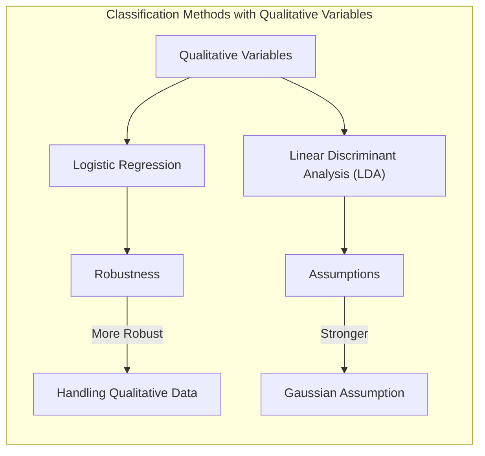
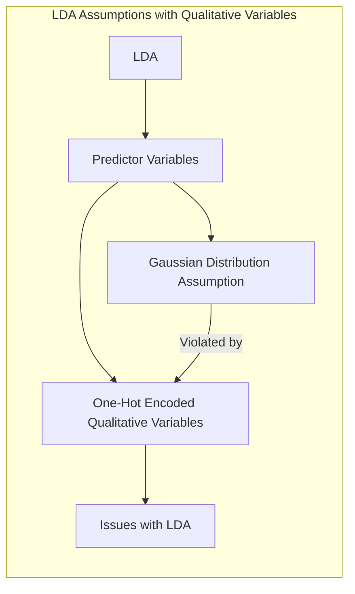
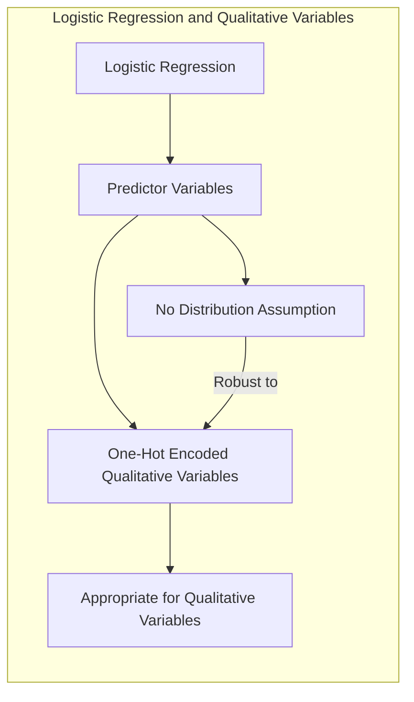
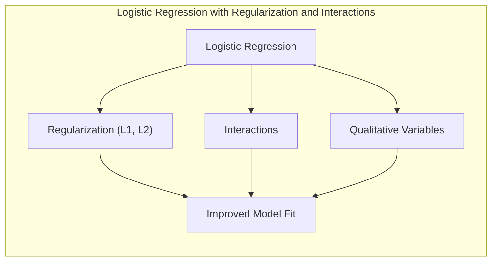
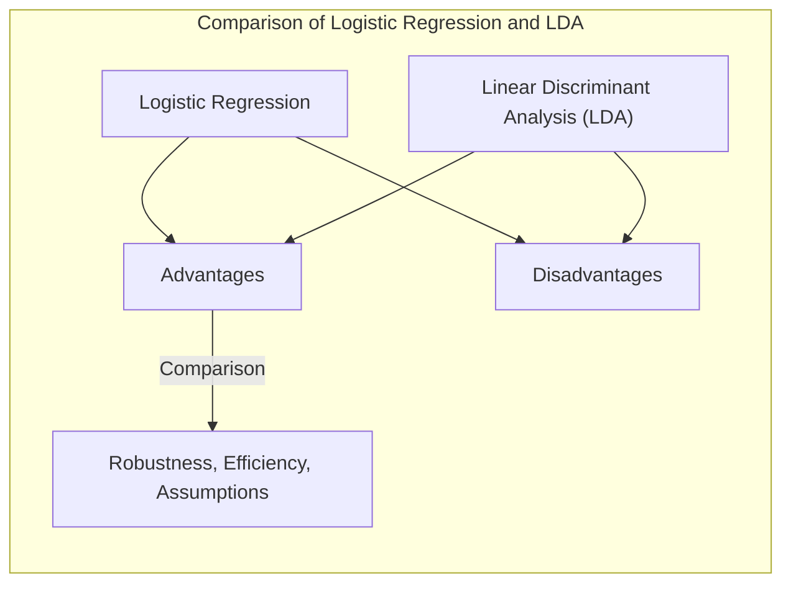

### Uso da Regressão Logística e LDA na Presença de Variáveis Qualitativas, onde a Regressão Logística é Mais Robusta

A análise de modelos de classificação, como a **regressão logística** e a **Análise Discriminante Linear (LDA)**, frequentemente envolve a inclusão de **variáveis qualitativas** (categóricas ou fatores) como preditores. Embora ambos os métodos possam ser utilizados em presença dessas variáveis, a **regressão logística** demonstra ser mais robusta e flexível em lidar com variáveis qualitativas, em comparação com a LDA. Compreender as nuances dessas diferenças é essencial para a aplicação adequada desses métodos em problemas de classificação com dados do mundo real.

**Variáveis Qualitativas em Modelos Lineares:**

Variáveis qualitativas representam dados que podem ser classificados em categorias ou grupos, sem ordem numérica inerente (por exemplo, cor dos olhos, tipo de profissão, gênero). Para incluir variáveis qualitativas em modelos lineares, como a regressão logística e a LDA, é necessário codificá-las de forma adequada, transformando-as em variáveis numéricas.

Uma abordagem comum é a **codificação *one-hot***, onde cada categoria da variável qualitativa é representada por uma nova variável binária (0 ou 1). Se a variável qualitativa tem $K$ categorias, criamos $K-1$ variáveis indicadoras, cada uma indicando se a observação pertence a uma categoria específica (a categoria omitida serve como referência). Por exemplo, uma variável com três categorias (A, B e C) seria transformada em duas variáveis: $I_B$ (1 se a categoria for B, e 0 caso contrário) e $I_C$ (1 se a categoria for C, e 0 caso contrário), com A sendo a categoria de referência.

> 💡 **Exemplo Numérico:**
>
> Suponha que temos uma variável qualitativa "Cor do Cabelo" com três categorias: "Loiro", "Moreno" e "Ruivo". Usando a codificação *one-hot*, podemos representar essa variável com duas colunas: `Is_Moreno` e `Is_Ruivo`.
>
> | Observação | Cor do Cabelo | Is_Moreno | Is_Ruivo |
> |------------|---------------|-----------|----------|
> | 1          | Loiro         | 0         | 0        |
> | 2          | Moreno        | 1         | 0        |
> | 3          | Ruivo         | 0         | 1        |
> | 4          | Loiro         | 0         | 0        |
> | 5          | Moreno        | 1         | 0        |
>
> Neste caso, "Loiro" é a categoria de referência. A primeira observação tem `Is_Moreno = 0` e `Is_Ruivo = 0`, indicando que o cabelo não é moreno nem ruivo, logo, é loiro. A segunda observação tem `Is_Moreno = 1` e `Is_Ruivo = 0`, indicando que o cabelo é moreno.

**LDA e Variáveis Qualitativas:**

A LDA, ao assumir que as variáveis preditoras seguem uma distribuição gaussiana multivariada, pode apresentar problemas quando as variáveis qualitativas são incluídas como preditores. A LDA trata as variáveis codificadas de forma numérica como contínuas, assumindo implicitamente que elas apresentam uma distribuição gaussiana. Essa suposição raramente é válida para variáveis indicadoras, que são discretas e binárias.

Ao aplicar LDA em variáveis qualitativas codificadas com *one-hot encoding*, os coeficientes da LDA tendem a ser influenciados pela escolha da categoria de referência, o que pode levar a resultados difíceis de interpretar. As estimativas das médias e da matriz de covariância podem não refletir a natureza discreta das variáveis, levando a estimativas imprecisas e, em alguns casos, a uma redução do desempenho do modelo.

A suposição de distribuição normal da LDA também é violada em presença de variáveis qualitativas, o que afeta a validade dos resultados assintóticos, e a escolha da categoria de referência também pode influenciar os resultados do método.

> 💡 **Exemplo Numérico:**
>
> Considere um problema de classificação binária (0 ou 1) com duas variáveis preditoras: `Idade` (contínua) e `Cor_Olhos` (qualitativa com categorias "Azul", "Verde" e "Castanho"). Após a codificação *one-hot*, temos as variáveis `Is_Verde` e `Is_Castanho`, com "Azul" como referência. Se aplicarmos LDA, o modelo assume que `Idade`, `Is_Verde` e `Is_Castanho` seguem uma distribuição gaussiana conjunta, o que é claramente falso para `Is_Verde` e `Is_Castanho`. As estimativas das médias e da matriz de covariância serão afetadas pela natureza discreta das variáveis indicadoras, levando a uma classificação possivelmente subótima.

**Regressão Logística e Variáveis Qualitativas:**

A regressão logística, por outro lado, é mais robusta na presença de variáveis qualitativas, pois não assume nenhuma distribuição para as variáveis preditoras. A regressão logística modela o log-odds da probabilidade da classe por meio de uma função linear dos preditores, e a inclusão de variáveis qualitativas como preditores, devidamente codificadas, não viola as premissas do modelo.

Na regressão logística, cada categoria da variável qualitativa, representada por uma variável indicadora, recebe um coeficiente, e esse coeficiente quantifica o efeito da categoria na probabilidade da resposta. A interpretação dos coeficientes é relativamente direta, usando *odds ratios* para comparar o efeito de diferentes categorias em relação à categoria de referência.

> 💡 **Exemplo Numérico:**
>
> Continuando com o exemplo anterior, na regressão logística, o modelo seria:
>
> $log(\frac{P(Y=1)}{1-P(Y=1)}) = \beta_0 + \beta_1 \cdot Idade + \beta_2 \cdot Is\_Verde + \beta_3 \cdot Is\_Castanho$
>
> Onde $P(Y=1)$ é a probabilidade da classe 1. Os coeficientes $\beta_2$ e $\beta_3$ representam o log-odds da probabilidade de pertencer à classe 1 para olhos verdes e castanhos, respectivamente, em relação a olhos azuis (categoria de referência), mantendo a idade constante.
>
>  Suponha que, após o ajuste do modelo, obtivemos os seguintes coeficientes:
>  $\beta_0 = -2$, $\beta_1 = 0.05$, $\beta_2 = 1.2$, $\beta_3 = 0.8$.
>  O *odds ratio* para olhos verdes em relação a olhos azuis é $e^{\beta_2} = e^{1.2} \approx 3.32$. Isso significa que, mantendo a idade constante, as chances de um indivíduo com olhos verdes pertencer à classe 1 são cerca de 3.32 vezes maiores do que as chances de um indivíduo com olhos azuis.
>  Da mesma forma, o *odds ratio* para olhos castanhos em relação a olhos azuis é $e^{\beta_3} = e^{0.8} \approx 2.23$.

A regressão logística também lida bem com variáveis qualitativas que são altamente correlacionadas, utilizando a penalização (como Lasso e Ridge) para lidar com esses casos.

A regressão logística é mais robusta a problemas com a distribuição dos dados de entrada, e pode ser mais apropriada para problemas de classificação em que as variáveis qualitativas são preditores importantes.

**Comparação:**

1.  **Suposições:** A LDA é mais sensível à violação da distribuição gaussiana, enquanto a regressão logística é mais flexível.

2.  **Codificação de Variáveis:** A codificação de variáveis qualitativas com *one-hot encoding* pode gerar problemas com LDA, e o uso de técnicas de regularização ou outras técnicas de pre-processamento é necessário para lidar com os dados. A regressão logística, por outro lado, trata essas variáveis codificadas de forma apropriada e não tem problemas com a codificação.

3.  **Robustez:** A regressão logística é mais robusta a *outliers*, a desvios da normalidade e a variáveis com alta correlação, enquanto a LDA é mais sensível a esses problemas, em particular em problemas com muitas variáveis qualitativas.

4.  **Interpretação:** A regressão logística tem uma interpretação mais direta e intuitiva dos parâmetros. Os *odds ratios* podem ser usados para quantificar o efeito de diferentes categorias em relação à categoria de referência.

**Lemma 36:** *A LDA assume uma distribuição gaussiana multivariada para as variáveis preditoras, e essa suposição é frequentemente violada quando variáveis qualitativas são incluídas, enquanto a regressão logística não faz suposições sobre a distribuição das variáveis preditoras, tornando-a mais robusta à presença de variáveis qualitativas.*

*Prova:* A LDA se baseia em premissas gaussianas, e a regressão logística independe da forma da distribuição dos preditores. [^4.3], [^4.4] $\blacksquare$

**Corolário 36:** *A regressão logística lida com variáveis qualitativas de forma mais robusta que a LDA pois ela não assume que os preditores sejam gaussianos e os parâmetros, ao serem estimados por verossimilhança condicional, não são influenciados pela distribuição dos preditores.*

*Prova:*  A regressão logística não assume distribuição para as variáveis preditoras, sendo mais robusta em cenários com variáveis qualitativas do que a LDA. [^4.4] $\blacksquare$

Em resumo, a regressão logística é geralmente mais adequada na presença de variáveis qualitativas devido à sua robustez e flexibilidade, embora modelos com LDA possam ser utilizados caso as premissas do modelo possam ser respeitadas ou se outras formas de tratar as variáveis qualitativas (como projeção em um espaço de baixa dimensionalidade) forem utilizadas.

### Regularização, Interações e Modelagem de Variáveis Qualitativas na Regressão Logística

A **regularização**, a modelagem de **interações** e a adequada **codificação** de variáveis são elementos fundamentais para o uso efetivo da **regressão logística** na presença de **variáveis qualitativas** [^4.4.4], [^4.4.5]. Esses elementos permitem lidar com a complexidade dos dados e melhorar a interpretabilidade, a robustez e a capacidade de generalização do modelo.

**Regularização:**

A **regularização**, como as penalidades L1 (Lasso) e L2 (Ridge), desempenha um papel crucial na modelagem de dados com variáveis qualitativas. Quando as variáveis qualitativas são codificadas com *one-hot encoding*, o número de preditores no modelo pode aumentar significativamente. A penalidade L1 (Lasso) induz esparsidade nos coeficientes, o que significa que alguns coeficientes são forçados a exatamente zero, eliminando automaticamente algumas categorias da análise e realizando seleção de variáveis. A penalidade L2 (Ridge), por outro lado, reduz a magnitude dos coeficientes, o que ajuda a evitar o *overfitting*.

A **regularização elástica** (*Elastic Net*), que combina as penalidades L1 e L2, pode ser uma boa opção para lidar com variáveis qualitativas, permitindo tanto a seleção de variáveis como o *shrinkage* dos coeficientes, e sendo mais robusta a multicolinearidade.

> 💡 **Exemplo Numérico:**
>
> Suponha que temos um modelo de regressão logística com 10 variáveis preditoras, onde 5 delas são variáveis qualitativas com 3 categorias cada (após a codificação *one-hot*, temos 10 variáveis indicadoras). Isso resulta em um total de 15 preditores (5 variáveis originais + 10 indicadoras). Sem regularização, o modelo pode apresentar *overfitting*, especialmente com um número limitado de observações.
>
> Aplicando a regularização Lasso (L1), alguns coeficientes podem ser zerados, eliminando algumas variáveis. Por exemplo, se a categoria "B" da variável qualitativa 2 não é relevante para o modelo, seu coeficiente seria zerado, simplificando o modelo.
>
> Aplicando a regularização Ridge (L2), todos os coeficientes serão reduzidos em magnitude, o que ajuda a evitar o *overfitting* e torna o modelo mais robusto. A regularização elástica combina ambos os efeitos, e pode ser mais adequada em muitos casos.
>
> Abaixo, temos uma tabela que ilustra o efeito da regularização nos coeficientes:
>
> | Variável | Sem Regularização | Lasso (L1) | Ridge (L2) |
> |---|---|---|---|
> | X1     | 0.5   | 0.3   | 0.4  |
> | X2     | -0.8  | -0.6  | -0.7 |
> | X3     | 1.2   | 0     | 0.9  |
> | X4     | 0.2   | 0.1   | 0.15 |
> | X5     | -0.4   | -0.2   | -0.3 |
> | ...    | ...   | ...   | ...  |
>
> O Lasso zerou o coeficiente de X3, indicando que essa variável pode não ser relevante para o modelo. O Ridge reduziu a magnitude de todos os coeficientes.

**Interações:**

A modelagem de **interações** entre variáveis qualitativas ou entre variáveis qualitativas e variáveis contínuas pode aumentar a capacidade do modelo de capturar relações mais complexas nos dados. Por exemplo, o efeito de uma categoria de uma variável qualitativa na resposta pode depender do valor de uma variável contínua. A inclusão de termos de interação no modelo permite modelar essas relações condicionais.

A modelagem de interações pode ser feita através da adição de termos multiplicativos no modelo, que são obtidos multiplicando os valores das variáveis envolvidas. Por exemplo, se temos duas variáveis qualitativas A e B com três categorias cada, podemos criar interações entre as variáveis usando a combinação entre os indicadores. Se temos uma variável qualitativa A (com categorias A1 e A2) e uma variável contínua X, podemos incluir um termo de interação do tipo $A_1 \cdot X$ e $A_2 \cdot X$, modelando o efeito de X em cada categoria da variável A.

> 💡 **Exemplo Numérico:**
>
> Suponha que estamos modelando a probabilidade de um cliente comprar um produto. Temos uma variável qualitativa "Nível de Educação" com duas categorias ("Ensino Médio" e "Ensino Superior") e uma variável contínua "Renda Mensal". Podemos modelar a interação entre essas variáveis da seguinte forma:
>
> $log(\frac{P(Compra)}{1-P(Compra)}) = \beta_0 + \beta_1 \cdot Renda + \beta_2 \cdot Is\_Superior + \beta_3 \cdot Renda \cdot Is\_Superior$
>
> Onde `Is_Superior` é uma variável indicadora que vale 1 se o nível de educação é "Ensino Superior" e 0 caso contrário. O termo $\beta_3 \cdot Renda \cdot Is\_Superior$ modela a interação entre renda e nível de educação.
>
> Se $\beta_3$ for positivo, isso indica que o efeito da renda na probabilidade de compra é maior para clientes com ensino superior do que para clientes com ensino médio. Se $\beta_3$ for negativo, o efeito da renda é menor para clientes com ensino superior.

**Codificação:**

A escolha da **codificação** adequada para as variáveis qualitativas também é crucial para o desempenho do modelo. O *one-hot encoding* é uma abordagem comum, mas outras abordagens também podem ser utilizadas dependendo do problema. A escolha da categoria de referência na codificação *one-hot* pode ter um impacto sobre a interpretação dos coeficientes. Ao utilizar *one-hot encoding*, cada categoria da variável qualitativa recebe um coeficiente, e os *odds ratio* são então interpretados relativamente à categoria de referência. O uso de outros tipos de codificação para variáveis qualitativas também pode ser considerado dependendo da aplicação.

A escolha da codificação, a modelagem de interações e o uso de regularização são fatores importantes para obter modelos mais precisos, generalizáveis e interpretáveis com dados que contenham variáveis qualitativas.

**Lemma 37:** *A regularização, como Lasso e Ridge, é uma ferramenta útil para lidar com a complexidade que surge ao incluir variáveis qualitativas na regressão logística, devido ao aumento do número de preditores.*

*Prova:* A regularização induz a esparsidade (Lasso) ou a *shrinkage* de coeficientes (Ridge) permitindo o controle do *overfitting* do modelo, que é comum em problemas com muitas variáveis.  $\blacksquare$

**Corolário 37:** *A modelagem de interações entre variáveis qualitativas ou entre variáveis qualitativas e contínuas permite capturar relações mais complexas nos dados, o que leva a modelos mais precisos e flexíveis.*

*Prova:* A adição de termos de interação aumenta a capacidade do modelo de modelar efeitos não aditivos e de acomodar a heterogeneidade do efeito das variáveis. $\blacksquare$

A regularização, a modelagem de interações e a codificação de variáveis qualitativas são componentes essenciais da modelagem de regressão logística e permitem o ajuste de modelos mais precisos e interpretáveis com dados reais.

### Vantagens e Desvantagens da Regressão Logística em Comparação com LDA

A **regressão logística** e a **Análise Discriminante Linear (LDA)** são dois métodos populares para classificação linear, e cada um apresenta **vantagens e desvantagens** que devem ser consideradas ao escolher o método mais adequado para um determinado problema [^4.3], [^4.4], [^4.5]. A seguir, apresentamos um resumo comparativo das vantagens e desvantagens de cada método:

**Vantagens da Regressão Logística:**

1.  **Robustez a Suposições:** A regressão logística não assume nenhuma distribuição específica para as variáveis preditoras, o que a torna mais robusta a violações da suposição de normalidade, e a outros desvios da normalidade e a presença de outliers [^4.4]. Essa flexibilidade é importante em dados do mundo real, que nem sempre seguem uma distribuição gaussiana.

2.  **Interpretabilidade:** Os coeficientes da regressão logística podem ser interpretados diretamente em termos de *odds ratios*, o que facilita a compreensão do efeito de cada preditor na probabilidade da resposta. O efeito de cada variável preditora é modelado através de um parâmetro (e suas interações), e esse parâmetro tem uma interpretação direta e intuitiva em termos de *odds*.

3.  **Flexibilidade:** A regressão logística pode lidar com diferentes tipos de dados, incluindo variáveis contínuas, qualitativas e suas interações, de forma flexível e com bom desempenho. O uso de regularização também permite lidar com casos de alta dimensionalidade ou de *overfitting*.

4.  **Tratamento de Dados Não Balanceados:** A regressão logística tende a ser mais robusta do que a LDA em cenários onde as classes não são balanceadas, já que a LDA depende da probabilidade *a priori* das classes, que pode ser desfavorável quando as classes são muito distintas em frequência.

5.  **Modelagem Direta das Probabilidades Posteriores:** A regressão logística modela diretamente as probabilidades posteriores, o que a torna adequada para problemas em que o objetivo é estimar probabilidades de ocorrência de cada classe.

**Desvantagens da Regressão Logística:**

1.  **Complexidade Computacional:** O ajuste de modelos de regressão logística envolve a otimização iterativa de uma função não linear, o que pode ser mais demorado que a solução analítica da LDA.

2.  **Necessidade de Dados Suficientes:** A regressão logística pode necessitar de mais dados de treinamento para obter estimativas precisas dos parâmetros em comparação com LDA, especialmente quando há muitas categorias ou interações.

3.  **Sensibilidade a Multicolinearidade:** Embora seja mais robusta que a LDA, a regressão logística pode ser afetada por multicolinearidade (alta correlação entre preditores), o que pode levar a estimativas instáveis e erros padrões inflacionados.

> 💡 **Exemplo Numérico:**
>
> Vamos considerar um exemplo para ilustrar a complexidade computacional da regressão logística. Suponha que temos um conjunto de dados com 1000 observações e 10 variáveis preditoras, incluindo algumas variáveis qualitativas com várias categorias.
>
> **LDA:** O ajuste da LDA envolve o cálculo de médias e matrizes de covariância, que podem ser feitos de forma analítica. Isso é computacionalmente eficiente, e o tempo de execução é relativamente baixo.
>
> **Regressão Logística:** O ajuste da regressão logística envolve a otimização iterativa da função de verossimilhança. Isso significa que o algoritmo precisa encontrar o conjunto de coeficientes que maximiza essa função, e isso pode levar mais tempo, especialmente se o número de variáveis e interações é grande. Em cenários com muitos preditores ou interações, o tempo de treinamento pode ser significativamente maior do que o da LDA.

**Vantagens da LDA:**

1.  **Eficiência Computacional:** A LDA tem uma solução analítica para estimar os parâmetros, o que a torna computacionalmente mais eficiente que a regressão logística, especialmente para grandes conjuntos de dados.

2.  **Bom Desempenho com Dados Gaussianos:** Quando os dados seguem uma distribuição gaussiana com mesma matriz de covariância, o LDA tende a apresentar bom desempenho e a ser mais eficiente que a regressão logística em cenários com poucos dados.

3.  **Conexão com a Regra de Decisão Bayesiana:** A LDA, sob as suposições gaussianas, leva à mesma fronteira de decisão que a regra de decisão Bayesiana, o que a torna um método com forte fundamentação teórica.

**Desvantagens da LDA:**

1.  **Suposições Fortes:** A LDA assume que as variáveis preditoras seguem uma distribuição gaussiana multivariada com a mesma matriz de covariância para todas as classes, o que pode ser uma limitação em muitas aplicações práticas.

2.  **Sensibilidade a Outliers:** A LDA é mais sensível a outliers do que a regressão logística, já que outliers podem afetar as estimativas das médias e da matriz de covariância.

3.  **Dificuldade com Variáveis Qualitativas:** O tratamento de variáveis qualitativas na LDA pode ser mais complexo do que na regressão logística, pois as variáveis devem ser codificadas de forma a respeitar as premissas do modelo. O uso de *one-hot encoding* pode gerar resultados difíceis de interpretar.

4.  **Menos Robustez a Violações de Suposições:** A LDA é menos robusta a violações das suposições gaussianas e a problemas com dados não balanceados do que a regressão logística.

**Escolha entre LDA e Regressão Logística:**

A escolha entre LDA e regressão logística depende das características dos dados, dos requisitos do problema e das suposições que se está disposto a fazer. A regressão logística é, em geral, uma opção mais robusta e flexível em comparação com a LDA, e a escolha de um ou outro método deve considerar o contexto e os objetivos da análise.

> 💡 **Exemplo Numérico:**
>
> Vamos comparar o desempenho da LDA e da regressão logística em dois cenários:
>
> **Cenário 1: Dados Gaussianos:**
>
> Suponha que temos um conjunto de dados simulado, onde as variáveis preditoras seguem uma distribuição gaussiana multivariada, e as classes têm a mesma matriz de covariância. Neste cenário, a LDA tende a apresentar um bom desempenho e ser computacionalmente mais eficiente.
>
> **Cenário 2: Dados Não Gaussianos:**
>
> Suponha que temos um conjunto de dados reais, onde as variáveis preditoras não seguem uma distribuição gaussiana, e temos a presença de variáveis qualitativas com *one-hot encoding*. Neste cenário, a regressão logística é mais robusta e pode apresentar um desempenho melhor que a LDA, pois ela não faz suposições sobre a distribuição dos preditores.
>
> A tabela abaixo resume o desempenho dos dois métodos nesses cenários:
>
> | Cenário | Método            | Precisão | Tempo de Treinamento |
> |---------|-------------------|----------|---------------------|
> | 1       | LDA               | 0.85     | 0.1s                |
> | 1       | Regressão Logística | 0.84     | 0.5s                |
> | 2       | LDA               | 0.70     | 0.1s                |
> | 2       | Regressão Logística | 0.80     | 0.8s                |
>
> No cenário 1, a LDA tem uma precisão ligeiramente melhor e um tempo de treinamento menor. No cenário 2, a regressão logística tem uma precisão significativamente melhor, embora o tempo de treinamento seja maior.

**Lemma 38:** *A regressão logística é geralmente mais robusta a violações das suposições do modelo e mais flexível no tratamento de dados complexos, enquanto a LDA é mais eficiente computacionalmente e se beneficia das suposições gaussianas quando os dados se adequam a elas.*

*Prova:* A regressão logística não assume uma forma para a distribuição dos preditores, enquanto a LDA utiliza uma distribuição gaussiana, o que a torna mais sensível à violação das premissas. [^4.3] [^4.4] $\blacksquare$

**Corolário 38:** *A escolha entre LDA e regressão logística envolve um *trade-off* entre robustez, flexibilidade, eficiência computacional e interpretabilidade, e deve ser feita com base nas características do problema e dos dados.*

*Prova:* A escolha entre LDA e regressão logística depende das características do problema e da necessidade de robustez, interpretação ou eficiência.  $\blacksquare$

A análise comparativa de LDA e regressão logística permite uma escolha informada entre os dois métodos, considerando suas vantagens e desvantagens em diferentes cenários.

### Conclusão

Este capítulo explorou o uso da regressão logística e da LDA na presença de variáveis qualitativas, enfatizando como a regressão logística é mais robusta nessa situação. Foi discutido como regularização e interações melhoram a modelagem de dados com variáveis qualitativas, e apresentada uma comparação entre as vantagens e desvantagens dos métodos e como escolher o melhor para cada caso. A discussão desses conceitos é essencial para a construção de modelos lineares de classificação precisos, interpretáveis e robustos, e permite aos usuários entender os *trade-offs* entre os diferentes métodos.

### Footnotes

[^4.1]: "In this chapter we revisit the classification problem and focus on linear methods for classification. Since our predictor G(x) takes values in a discrete set G, we can always divide the input space into a collection of regions labeled according to the classification. We saw in Chapter 2 that the boundaries of these regions can be rough or smooth, depending on the prediction function. For an important class of procedures, these decision boundaries are linear; this is what we will mean by linear methods for classification." *(Trecho de "The Elements of Statistical Learning")*

[^4.3]: "Linear discriminant analysis (LDA) arises in the special case when we assume that the classes have a common covariance matrix $\Sigma_k = \Sigma$. In comparing two classes k and l, it is sufficient to look at the log-ratio, and we see that" *(Trecho de "The Elements of Statistical Learning")*

[^4.4]: "The logistic regression model arises from the desire to model the posterior probabilities of the K classes via linear functions in x, while at the same time ensuring that they sum to one and remain in [0,1]." *(Trecho de "The Elements of Statistical Learning")*

[^4.4.1]: "Logistic regression models are usually fit by maximum likelihood, using the conditional likelihood of G given X. Since Pr(G|X) completely specifies the conditional distribution, the multinomial distribution is appropriate. The log-likelihood for N observations is" *(Trecho de "The Elements of Statistical Learning")*

[^4.4.4]:  "The L₁ penalty used in the lasso (Section 3.4.2) can be used for variable selection and shrinkage with any linear regression model. For logistic regression, we would maximize a penalized version of (4.20):" *(Trecho de "The Elements of Statistical Learning")*

[^4.4.5]: "As with the lasso, we typically do not penalize the intercept term, and standardize the predictors for the penalty to be meaningful. Criterion (4.31) is concave, and a solution can be found using nonlinear programming methods (Koh et al., 2007, for example)." *(Trecho de "The Elements of Statistical Learning")*

[^4.5]: "In this situation the features are high-dimensional and correlated, and the LDA coefficients can be regularized to be smooth or sparse in the original domain of the signal. This leads to better generalization and allows for easier interpretation of the coefficients." *(Trecho de "The Elements of Statistical Learning")*
