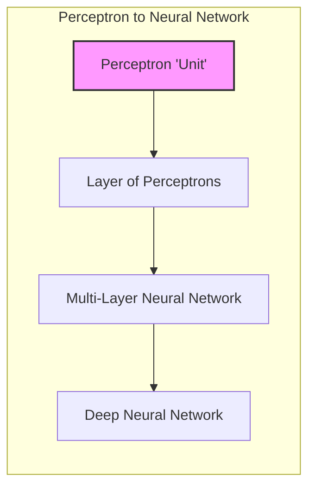
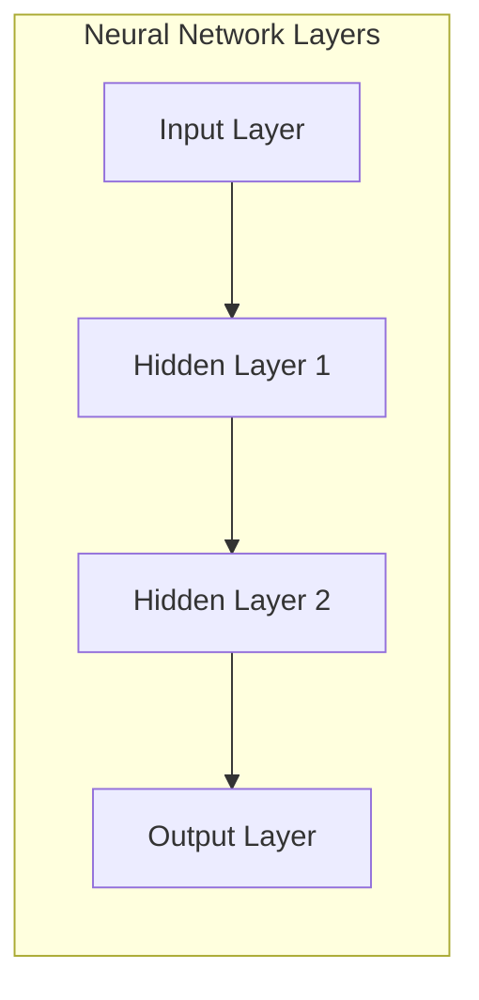
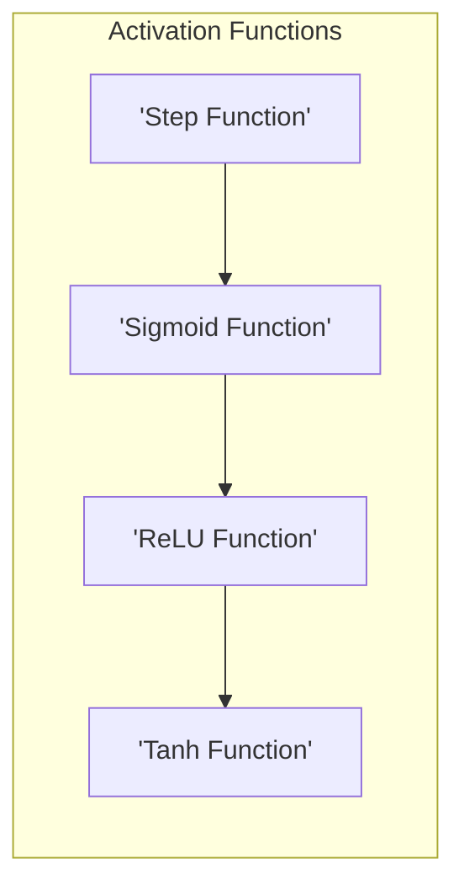
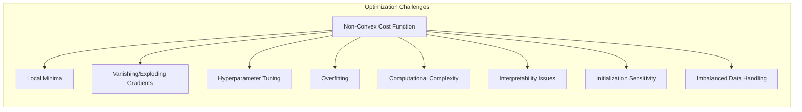
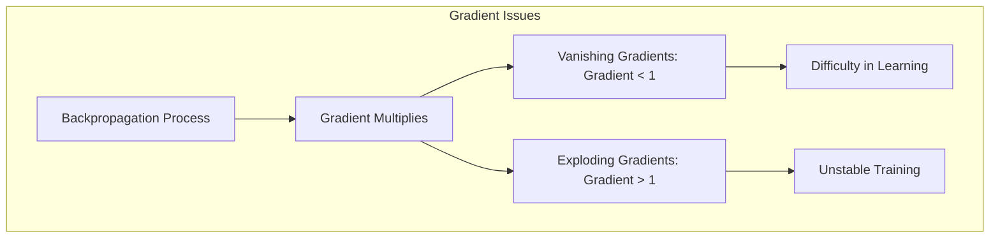
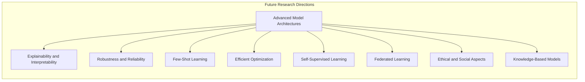

### Perceptrons como Base para Redes Neurais



Os **perceptrons**, introduzidos na década de 1950, representam uma das primeiras tentativas de modelar o aprendizado de máquina, e são a base fundamental das **redes neurais** [^4.5.1]. Os perceptrons, com sua simplicidade e capacidade de aprender fronteiras de decisão lineares, desempenham um papel crucial na construção de arquiteturas mais complexas de redes neurais, e são peças fundamentais da computação e aprendizado de máquina moderno.

**Perceptron: A Unidade Básica de Processamento:**

Um perceptron é uma unidade de processamento que recebe um vetor de entrada $x$, realiza uma combinação linear desses valores, e aplica uma função de ativação para produzir uma saída. Formalmente, a saída de um perceptron é dada por:

$$
    f(x) = a(\beta_0 + \beta^T x)
$$

onde $\beta_0$ é o *bias*, $\beta$ é o vetor de pesos, e $a$ é uma função de ativação. A função de ativação pode ser uma função degrau, uma função sigmoide, ou outras funções que introduzem não linearidade no modelo.

> 💡 **Exemplo Numérico:**
>
> Suponha que temos um perceptron com dois inputs, $x = [x_1, x_2]$, pesos $\beta = [\beta_1, \beta_2] = [0.5, -0.3]$, bias $\beta_0 = 0.1$, e a função de ativação é a função degrau, onde $a(z) = 1$ se $z \ge 0$ e $a(z) = 0$ se $z < 0$. Se a entrada for $x = [2, 1]$, a saída do perceptron será:
>
> 1.  **Cálculo da combinação linear:** $\beta_0 + \beta^T x = 0.1 + (0.5 \times 2) + (-0.3 \times 1) = 0.1 + 1 - 0.3 = 0.8$
> 2.  **Aplicação da função de ativação:**  $a(0.8) = 1$, pois $0.8 \ge 0$.
>
> Se a entrada fosse $x = [ -1, 2]$, teríamos:
>
> 1.  **Cálculo da combinação linear:** $\beta_0 + \beta^T x = 0.1 + (0.5 \times -1) + (-0.3 \times 2) = 0.1 - 0.5 - 0.6 = -1$
> 2. **Aplicação da função de ativação:** $a(-1) = 0$, pois $-1 < 0$.
>
> Este exemplo demonstra como o perceptron combina as entradas e usa a função degrau para classificar as entradas em duas categorias.

O perceptron é capaz de modelar fronteiras de decisão lineares. Em outras palavras, o perceptron classifica dados por meio de um hiperplano, que divide o espaço de entrada em duas regiões correspondentes às classes. O algoritmo de aprendizado do perceptron, como discutido em capítulos anteriores, ajusta os pesos $\beta$ e o bias $\beta_0$ por meio de um processo iterativo baseado em exemplos de treinamento.

**Redes Neurais: A Organização de Perceptrons em Camadas:**

As redes neurais são construídas pela organização de múltiplos perceptrons em camadas. As camadas são conectadas de forma a formar uma rede, onde a saída de uma camada serve como entrada para a camada seguinte. Uma rede neural típica é composta por:

1.  **Camada de Entrada:** Recebe as variáveis preditoras do problema.

2.  **Camadas Ocultas:** Realizam transformações não lineares nos dados, com o objetivo de aprender padrões complexos nos dados de entrada. Cada camada oculta contém vários perceptrons, e a saída de uma camada é usada como entrada para a camada seguinte.

3.  **Camada de Saída:** Produz a saída final do modelo. O número de nós da camada de saída depende do problema: em problemas de classificação, o número de nós de saída é igual ao número de classes.

A saída de cada perceptron em cada camada é dada por:

$$
    f(x) = a(\beta_0 + \beta^T x)
$$

onde $x$ é a entrada do perceptron, e a função de ativação $a$ pode variar entre as camadas. A não linearidade introduzida pelas funções de ativação nos perceptrons e as múltiplas camadas de processamento permitem que a rede neural modele relações não lineares complexas nos dados.



> 💡 **Exemplo Numérico:**
>
> Considere uma rede neural simples com:
> *   Uma camada de entrada com 2 neurônios.
> *   Uma camada oculta com 3 neurônios.
> *   Uma camada de saída com 1 neurônio.
>
> Vamos focar em como os dados fluem da camada de entrada para a camada oculta.
>
> 1.  **Dados de entrada:** Suponha que a entrada seja $x = [1, 2]$.
> 2.  **Pesos e biases da camada oculta:** Cada neurônio da camada oculta tem seus próprios pesos e bias. Vamos denotar os pesos do neurônio $j$ como $\beta_j = [\beta_{j1}, \beta_{j2}]$ e o bias como $\beta_{0j}$.  Suponha que os pesos e biases sejam:
>     *   Neurônio 1: $\beta_1 = [0.2, -0.1]$, $\beta_{01} = 0.3$
>     *   Neurônio 2: $\beta_2 = [-0.3, 0.4]$, $\beta_{02} = -0.2$
>     *   Neurônio 3: $\beta_3 = [0.5, 0.1]$, $\beta_{03} = 0.1$
> 3.  **Cálculos na camada oculta:** Para cada neurônio na camada oculta, calculamos a combinação linear e aplicamos uma função de ativação (por exemplo, ReLU):
>     *   Neurônio 1: $z_1 = 0.3 + (0.2 \times 1) + (-0.1 \times 2) = 0.3$. $a(z_1) = \text{ReLU}(0.3) = 0.3$.
>     *   Neurônio 2: $z_2 = -0.2 + (-0.3 \times 1) + (0.4 \times 2) = 0.3$. $a(z_2) = \text{ReLU}(0.3) = 0.3$.
>     *   Neurônio 3: $z_3 = 0.1 + (0.5 \times 1) + (0.1 \times 2) = 0.8$. $a(z_3) = \text{ReLU}(0.8) = 0.8$.
>
> A saída da camada oculta, que será a entrada da próxima camada, é o vetor $[0.3, 0.3, 0.8]$. Este processo se repete para as camadas subsequentes, cada uma aprendendo representações mais complexas dos dados de entrada.

**Funções de Ativação:**

A escolha da função de ativação é importante para o desempenho das redes neurais. Funções de ativação comuns incluem:

*   **Função Degrau:**  Essa função produz uma saída binária (0 ou 1) e é utilizada em perceptrons mais simples. A função degrau é uma função não linear que permite modelar fronteiras de decisão não lineares, e tem um papel importante na convergência do algoritmo do perceptron.

*   **Função Sigmoide:** A função sigmoide, como a função logística, produz uma saída entre 0 e 1, e é usada para problemas de classificação.



> 💡 **Exemplo Numérico:**
>
> A função sigmoide é definida como $\sigma(z) = \frac{1}{1 + e^{-z}}$. Se tivermos um valor de entrada $z = 2$, a saída da função sigmoide será:
>
> $\sigma(2) = \frac{1}{1 + e^{-2}} \approx \frac{1}{1 + 0.135} \approx 0.88$
>
> Se tivermos uma entrada $z = -2$, a saída será:
>
> $\sigma(-2) = \frac{1}{1 + e^{2}} \approx \frac{1}{1 + 7.389} \approx 0.12$
>
> A função sigmoide mapeia valores para o intervalo (0, 1), o que a torna útil para interpretar saídas como probabilidades em problemas de classificação.

*   **Função ReLU (Rectified Linear Unit):** A função ReLU é uma função não linear que produz zero se a entrada é negativa, e a própria entrada se a entrada é positiva. A ReLU é uma função não linear simples e é muito utilizada em modelos de *deep learning*.

> 💡 **Exemplo Numérico:**
>
> A função ReLU é definida como $\text{ReLU}(z) = \max(0, z)$. Se a entrada for $z = 3$, a saída será $\text{ReLU}(3) = 3$. Se a entrada for $z = -1$, a saída será $\text{ReLU}(-1) = 0$. A ReLU introduz não linearidade de forma simples e eficiente.

*   **Função *tanh* (Tangente Hiperbólica):** A função *tanh* produz uma saída entre -1 e 1, e é usada para modelos com dados com entradas negativas e positivas.

> 💡 **Exemplo Numérico:**
>
> A função *tanh* é definida como $\tanh(z) = \frac{e^z - e^{-z}}{e^z + e^{-z}}$. Se a entrada for $z = 1$, a saída será $\tanh(1) \approx 0.76$. Se a entrada for $z = -1$, a saída será $\tanh(-1) \approx -0.76$. A função *tanh* mapeia valores para o intervalo (-1, 1).

**Aprendizado em Redes Neurais:**

O aprendizado em redes neurais envolve o ajuste dos pesos $\beta$ em cada camada para minimizar uma função de custo, utilizando um algoritmo de otimização, como o gradiente descendente e suas variantes. O algoritmo de retropropagação (*backpropagation*) calcula as derivadas da função de custo em relação aos pesos, e esses gradientes são utilizados para atualizar os pesos da rede neural.

As redes neurais, por meio da organização de múltiplos perceptrons em camadas e do uso de funções de ativação não lineares, representam modelos muito flexíveis, capazes de modelar relações complexas nos dados, e são capazes de aprender representações hierárquicas dos dados de entrada, e por esse motivo são a base para *deep learning*.

**Lemma 39:** *Os perceptrons, como unidades de processamento linear, são a base fundamental das redes neurais, que são construídas pela organização desses perceptrons em múltiplas camadas, combinadas com funções de ativação não lineares.*

*Prova:* As redes neurais são construídas combinando as unidades lineares (perceptron) com funções de ativação. $\blacksquare$

**Corolário 39:** *As funções de ativação não lineares, como ReLU, sigmoid ou *tanh*, introduzem não linearidade nas redes neurais, o que permite que esses modelos capturem relações não lineares complexas nos dados.*

*Prova:* O uso de funções não lineares é um elemento chave das redes neurais, que possibilita a modelagem de relações não lineares. $\blacksquare$

A construção de modelos complexos com base em blocos simples e lineares como os perceptrons, utilizando funções não lineares e uma estrutura hierárquica, permite o aprendizado e o desenvolvimento de modelos de alta complexidade.

### Limitações e Desafios na Otimização de Redes Neurais



Apesar do grande sucesso das **redes neurais** em diversas aplicações de aprendizado de máquina, a otimização desses modelos apresenta **limitações e desafios** importantes [^4.5.1]. A não convexidade da função de custo, a complexidade da arquitetura das redes e a escolha de hiperparâmetros podem dificultar a obtenção de soluções ótimas e a garantia de convergência. Compreender essas limitações é essencial para o desenvolvimento de modelos mais robustos e eficazes.

Os principais desafios na otimização de redes neurais incluem:

1.  **Mínimos Locais:** A função de custo de redes neurais, devido à sua natureza não linear e à complexidade da arquitetura, geralmente apresenta múltiplos mínimos locais. Os algoritmos de otimização, como o gradiente descendente e suas variantes, podem convergir para um mínimo local, que pode não ser a solução ótima do problema. A não convexidade do problema torna difícil encontrar o mínimo global, e a otimização da rede neural pode depender da inicialização dos parâmetros, da taxa de aprendizagem e de outros hiperparâmetros, além de uma escolha adequada da arquitetura do modelo.

> 💡 **Exemplo Numérico:**
>
> Imagine uma função de custo que tem a forma de um vale com vários pequenos buracos. Cada um desses buracos representa um mínimo local. O algoritmo de otimização, como o gradiente descendente, pode ficar preso em um desses buracos (mínimo local) em vez de encontrar o ponto mais baixo de todo o vale (mínimo global). Uma rede neural com muitos parâmetros e não linearidades pode ter uma função de custo extremamente complexa com muitos desses mínimos locais.

2.  **Desaparecimento e Explosão de Gradientes:** Durante o treinamento de redes neurais profundas, os gradientes, calculados por meio do algoritmo de retropropagação, podem sofrer problemas de desaparecimento ou explosão. O problema do desaparecimento de gradientes ocorre quando os gradientes tornam-se muito pequenos, especialmente nas camadas inferiores da rede, o que dificulta a aprendizagem dessas camadas. O problema da explosão de gradientes, por outro lado, ocorre quando os gradientes tornam-se muito grandes, levando a instabilidade no treinamento e à não convergência do modelo.

> 💡 **Exemplo Numérico:**
>
> Considere uma rede neural profunda com várias camadas. Durante o *backpropagation*, os gradientes são multiplicados camada a camada. Se os valores dos gradientes forem menores que 1, eles tendem a se tornar cada vez menores à medida que se propagam para as camadas mais profundas, levando ao desaparecimento do gradiente. Por outro lado, se os valores dos gradientes forem maiores que 1, eles podem se tornar muito grandes, causando a explosão do gradiente. Por exemplo, se em cada camada o gradiente for multiplicado por 0.2, após 5 camadas, o gradiente será 0.2^5 = 0.00032, que é muito pequeno. Se o gradiente for multiplicado por 2, após 5 camadas será 2^5=32, que é muito grande.



3.  **Escolha de Hiperparâmetros:** A escolha adequada dos hiperparâmetros, como o número de camadas, o número de neurônios em cada camada, a função de ativação, a taxa de aprendizagem, o tamanho do *batch* e outros parâmetros de regularização, pode ter um impacto significativo no desempenho das redes neurais. A escolha dos hiperparâmetros é geralmente feita por meio de métodos de busca, como a validação cruzada, que podem ser computacionalmente intensivos.

> 💡 **Exemplo Numérico:**
>
> Imagine que você está treinando uma rede neural para classificar imagens de gatos e cachorros. Se você escolher uma taxa de aprendizagem muito alta, o modelo pode oscilar e não convergir. Se você escolher uma taxa de aprendizagem muito baixa, o modelo pode demorar muito para aprender. O número de camadas e neurônios também pode afetar o desempenho. Se a rede for muito rasa, ela pode não conseguir aprender padrões complexos. Se a rede for muito profunda, ela pode sofrer com o desaparecimento de gradientes. A escolha ideal dos hiperparâmetros é um processo de tentativa e erro, e geralmente envolve a validação cruzada para avaliar diferentes configurações.

4.  **Overfitting:** As redes neurais, devido à sua alta capacidade de modelagem, podem apresentar *overfitting*, onde o modelo se ajusta muito bem aos dados de treinamento, mas apresenta um desempenho ruim em dados não vistos. A regularização, como *dropout*, *batch normalization* ou *weight decay*, é usada para mitigar o problema de overfitting.

> 💡 **Exemplo Numérico:**
>
> Um modelo de rede neural com muitos parâmetros pode "memorizar" os dados de treinamento em vez de aprender padrões generalizáveis. Por exemplo, se o modelo se ajusta perfeitamente a todos os dados de treinamento, mas falha em classificar novas imagens corretamente, ele está sofrendo com *overfitting*. A regularização ajuda a evitar que o modelo fique excessivamente complexo e se ajuste demais aos dados de treinamento.

5.  **Complexidade Computacional:** O treinamento de redes neurais, especialmente em grandes conjuntos de dados e com modelos profundos, pode ser computacionalmente custoso e demorado. A complexidade computacional dos algoritmos de otimização e a quantidade de memória necessária são fatores limitantes para o treinamento desses modelos.

6.  **Interpretabilidade:** A interpretabilidade das redes neurais é um desafio importante. As transformações não lineares e a complexidade da arquitetura dificultam a compreensão do que cada camada está aprendendo e de como os preditores influenciam a resposta. Métodos para aumentar a interpretabilidade das redes neurais são essenciais para que sejam utilizadas em aplicações onde a compreensão do modelo é importante.

7.  **Inicialização:** A inicialização dos pesos das redes neurais pode ter um impacto significativo no processo de treinamento. Uma inicialização inadequada pode levar a problemas de convergência ou a mínimos locais ruins.

8.  **Dados Não Balanceados:** O treinamento de redes neurais com classes não balanceadas pode ser um desafio, pois o modelo pode ser tendencioso a favor da classe majoritária. Técnicas de amostragem ou de ponderação podem ser utilizadas para mitigar esse problema.

**Lemma 40:** *A não convexidade da função de custo das redes neurais pode levar os algoritmos de otimização a convergirem para mínimos locais e não para o mínimo global da função.*

*Prova:* A função de custo de redes neurais pode apresentar múltiplas regiões de mínimo local.  $\blacksquare$

**Corolário 40:** *O desaparecimento e a explosão dos gradientes durante o treinamento de redes neurais profundas podem levar a problemas de convergência e à dificuldade na aprendizagem das camadas inferiores do modelo.*

*Prova:* Os gradientes do algoritmo de backpropagation podem se tornar muito pequenos ou muito grandes, o que prejudica a aprendizagem do modelo. $\blacksquare$

Os desafios na otimização de redes neurais destacam a necessidade de pesquisa e desenvolvimento de algoritmos mais robustos, eficientes e interpretáveis.

### Métodos de Regularização e Otimização em Redes Neurais

```mermaid
graph LR
    subgraph "Regularization Methods"
        direction TB
        A["'Weight Decay'"] --> B["Cost Function Penalization: "C(β) + λ∑β²""]
        A --> C["'Dropout'"]
        C --> D["Random Neuron Deactivation"]
        A --> E["'Batch Normalization'"]
        E --> F["Activation Normalization"]
     end

    subgraph "Optimization Algorithms"
    direction TB
        G["SGD"] --> H["'Gradient Descent Update'"]
        G --> I["SGD with Momentum"]
        I --> J["'Momentum Added to Update'"]
        G --> K["RMSprop"]
        K --> L["'Adaptive Learning Rates'"]
        G --> M["Adam"]
        M --> N["'Adaptive Learning Rates & Momentum'"]
    end

   style A fill:#ccf,stroke:#333,stroke-width:2px
    style G fill:#fcc,stroke:#333,stroke-width:2px
```

A otimização de **redes neurais** é um processo complexo que envolve o ajuste de um grande número de parâmetros, o que aumenta a probabilidade de *overfitting* e a necessidade de técnicas de **regularização**. Além disso, a escolha de um algoritmo de **otimização** adequado é crucial para garantir uma convergência eficiente e um bom desempenho do modelo.

**Métodos de Regularização:**

1.  ***Weight Decay*** **(Decaimento de Pesos):** O *weight decay* é uma técnica de regularização que adiciona um termo de penalização à função de custo, proporcional à soma dos quadrados dos pesos. Essa penalização encoraja os pesos a assumirem valores menores, reduzindo a complexidade do modelo e diminuindo o risco de *overfitting*:

    $$
        C(\beta) + \lambda \sum_{j=1}^p \beta_j^2
    $$
    onde $\lambda$ é o parâmetro de regularização.

> 💡 **Exemplo Numérico:**
>
> Suponha que a função de custo original seja $C(\beta) = 0.5$. Considere um modelo com pesos $\beta = [0.8, -0.5, 0.6]$. Se aplicarmos *weight decay* com $\lambda = 0.1$, o novo custo penalizado será:
>
> $C_{penalizado}(\beta) = 0.5 + 0.1 \times (0.8^2 + (-0.5)^2 + 0.6^2) = 0.5 + 0.1 \times (0.64 + 0.25 + 0.36) = 0.5 + 0.1 \times 1.25 = 0.625$
>
> O *weight decay* adiciona uma penalidade ao custo original, incentivando os pesos a serem menores.

2.  ***Dropout***: O *dropout* é uma técnica de regularização que desativa aleatoriamente alguns neurônios durante o treinamento. A cada iteração, alguns neurônios são desativados aleatoriamente, o que força o modelo a não depender de neurônios específicos, aumentando a capacidade de generalização do modelo.

> 💡 **Exemplo Numérico:**
>
> Imagine uma camada com 10 neurônios. Se usarmos *dropout* com uma taxa de 0.3, em cada iteração, 3 neurônios serão aleatoriamente desativados, o que significa que eles não contribuirão para o cálculo da saída e para a atualização dos pesos nessa iteração. Essa desativação aleatória força o modelo a aprender representações mais robustas e menos dependentes de neurônios específicos.

3.  ***Batch Normalization***: O *batch normalization* é uma técnica que normaliza as ativações das camadas durante o treinamento. Essa técnica ajuda a reduzir problemas de desaparecimento ou explosão de gradientes e acelera a convergência do modelo.

> 💡 **Exemplo Numérico:**
>
> Suponha que as ativações de uma camada em um *batch* sejam [10, 2, 15, 5]. O *batch normalization* calcula a média e o desvio padrão dessas ativações:
>
> *   Média: $\mu = (10 + 2 + 15 + 5) / 4 = 8$
> *   Desvio padrão: $\sigma \approx 5.4$
>
> As ativações normalizadas serão então:
>
> $[(10-8)/5.4, (2-8)/5.4, (15-8)/5.4, (5-8)/5.4] \approx [0.37, -1.11, 1.30, -0.56]$
>
> Essas ativações normalizadas são usadas na camada, o que ajuda a estabilizar o treinamento.

**Algoritmos de Otimização:**

1.  **Gradiente Descendente Estocástico (SGD):** O SGD é um algoritmo iterativo que atualiza os pesos do modelo com base no gradiente da função de custo. A atualização dos pesos é feita em direção ao negativo do gradiente. Embora simples, o SGD pode apresentar problemas de convergência, especialmente para funções de custo não convexas, e seu desempenho pode depender do valor da taxa de aprendizagem.

> 💡 **Exemplo Numérico:**
>
> Suponha que o gradiente da função de custo em relação a um peso seja $\frac{\partial C}{\partial \beta} = 0.2$ e a taxa de aprendizagem seja $\eta = 0.01$. A atualização do peso $\beta$ usando SGD será:
>
> $\beta_{novo} = \beta_{antigo} - \eta \frac{\partial C}{\partial \beta} = \beta_{antigo} - 0.01 \times 0.2 = \beta_{antigo} - 0.002$
>
> O peso é atualizado na direção oposta ao gradiente.

2.  **SGD com *Momentum***: O SGD com *momentum* acelera a convergência do SGD ao adicionar um termo de *momentum* que considera a direção das atualizações anteriores. A ideia é que a atualização dos pesos seja mais rápida e evite oscilações.

> 💡 **Exemplo Numérico:**
>
> Se o *momentum* for $\gamma = 0.9$, a atualização do peso $\beta$ com SGD com *momentum* envolve um termo de velocidade $v$:
>
> $v_{novo} = \gamma v_{antigo} + \eta \frac{\partial C}{\partial \beta}$
>
> $\beta_{novo} = \beta_{antigo} - v_{novo}$
>
> O termo de velocidade acumula as atualizações anteriores, o que ajuda a acelerar o aprendizado.

3.  **RMSprop (Root Mean Square Propagation):** O RMSprop é um algoritmo de otimização que adapta a taxa de aprendizagem para cada parâmetro individualmente, considerando a média das magnitudes recentes dos gradientes. O RMSprop utiliza taxas de aprendizagem diferentes para cada parâmetro, o que melhora a convergência do algoritmo.

4.  **Adam (Adaptive Moment Estimation):** O Adam combina as vantagens do RMSprop e do SGD com *momentum*. O Adam adapta a taxa de aprendizagem para cada parâmetro, e utiliza a média do gradiente e da média do gradiente ao quadrado para cada parâmetro.

> 💡 **Exemplo Numérico:**
>
> O Adam calcula as médias móveis do gradiente ($m_t$) e do quadrado do gradiente ($v_t$) e usa essas médias para adaptar a taxa de aprendizagem. As atualizações dos pesos são:
>
> $m_t = \beta_1 m_{t-1} + (1 - \beta_1) \frac{\partial C}{\partial \beta}$
>
> $v_t = \beta_2 v_{t-1} + (1 - \beta_2) (\frac{\partial C}{\partial \beta})^2$
>
> $\hat{m}_t = \frac{m_t}{1 - \beta_1^t}$
>
> $\hat{v}_t = \frac{v_t}{1 - \beta_2^t}$
>
> $\beta_{novo} = \beta_{antigo} - \frac{\eta}{\sqrt{\hat{v}_t} + \epsilon} \hat{m}_t$
>
> Onde $\beta_1$ e $\beta_2$ são os fatores de decaimento das médias móveis, $\eta$ é a taxa de aprendizagem, e $\epsilon$ é um valor pequeno para evitar divisão por zero. O Adam ajusta a taxa de aprendizagem de forma adaptativa para cada parâmetro, o que melhora a convergência.

A escolha do algoritmo de otimização e a combinação de diferentes métodos de regularização são elementos fundamentais para o sucesso do treinamento de redes neurais. A escolha do algoritmo de otimização ideal e a busca pelos melhores hiperparâmetros são um problema de pesquisa ativo no campo de aprendizado de máquina.

**Lemma 41:** *Os métodos de regularização, como *dropout*, *batch normalization* e *weight decay*, são usados para reduzir o *overfitting* em redes neurais, controlando a complexidade do modelo e tornando o aprendizado mais robusto.*

*Prova:* A regularização diminui o *overfitting* e aumenta a capacidade de generalização dos modelos ao impor restrições na complexidade do modelo.  $\blacksquare$

**Corolário 41:** *Algoritmos de otimização como Adam e RMSprop adaptam as taxas de aprendizagem durante o treinamento, o que acelera a convergência e melhora o desempenho das redes neurais.*

*Prova:* A adaptação da taxa de aprendizagem torna a convergência mais eficiente.  $\blacksquare$

A combinação de métodos de regularização e de algoritmos de otimização é essencial para o treinamento de modelos de redes neurais mais robustos, eficientes e generalizáveis.

### Direções Futuras da Pesquisa e Desafios em Deep Learning



A área de **deep learning** e redes neurais continua a evoluir rapidamente, com novas arquiteturas, algoritmos de otimização e aplicações surgindo constantemente. As **direções futuras da pesquisa** incluem:

1.  **Arquiteturas de Modelos Avançadas:** O desenvolvimento de novas arquiteturas de redes neurais, como redes convolucionais, redes recorrentes, redes transformadoras e outras arquiteturas inovadoras, continua sendo uma área ativa de pesquisa. O objetivo é criar arquiteturas que possam lidar com diferentes tipos de dados, como imagens, texto, áudio e sequências temporais, e que permitam a modelagem de relações complexas entre as variáveis.

2.  **Explicabilidade e Interpretabilidade:** A necessidade de modelos mais explicáveis e interpretáveis (XAI) é cada vez maior. O desenvolvimento de técnicas que permitam entender o que as redes neurais aprendem e como elas tomam decisões é essencial para sua utilização em aplicações críticas. Técnicas como *attention mechanisms*, *saliency maps* ou visualizações dos pesos podem ajudar na compreensão dos modelos.

3.  **Robustez e Confiabilidade:** A robustez e a confiabilidade dos modelos de *deep learning* são áreas de pesquisa importantes. O objetivo é desenvolver modelos que sejam menos sensíveis a ruído, *outliers* ou ataques adversários, e que apresentem um desempenho confiável em diferentes cenários.

4.  **Aprendizado com Poucos Dados:** A capacidade de aprender com poucos dados é uma área importante de pesquisa. Modelos de *deep learning* geralmente exigem grandes conjuntos de dados para o treinamento, e o desenvolvimento de técnicas que permitam o aprendizado com poucos exemplos (aprendizado *few-shot*, *transfer learning*, e aprendizagem meta) é um desafio relevante.

5.  **Otimização Eficiente:** O desenvolvimento de algoritmos de otimização mais eficientes e rápidos para treinar redes neurais, especialmente em conjuntos de dados de alta dimensionalidade e grandes modelos, continua sendo um tema importante na pesquisa. Algoritmos adaptativos, que ajustam os parâmetros automaticamente, e algoritmos que exploram a estrutura do problema são áreas de interesse.

6.  **Aprendizado Auto-Supervisionado:** O aprendizado auto-supervisionado utiliza os dados sem rótulos para pré-treinar o modelo, permitindo que o modelo aprenda representações úteis dos dados. O uso de aprendizado auto-supervisionado para aumentar o desempenho das redes neurais e para reduzir a necessidade de dados rotulados é uma área de grande interesse.

7.  **Aprendizado Federado:** O aprendizado federado é uma técnica que permite treinar modelos de *deep learning* em dados descentralizados, sem a necessidade de compartilhar os dados. Essa abordagem é importante para lidar com dados sensíveis ou para a construção de modelos colaborativos.

8.  **Aspectos Éticos e Sociais:** A área de *deep learning* também tem a responsabilidade de lidar com os aspectos éticos e sociais relacionados à aplicação desses modelos. A privacidade dos dados, a transparência dos algoritmos, o combate ao preconceito e o uso responsável da inteligência artificial são temas que merecem atenção na pesquisa em *deep learning*.

9.  **Modelos Baseados em Conhecimento:** O desenvolvimento de modelos que combinem *deep learning* com conhecimento prévio ou modelos simbólicos é uma área importante de pesquisa. A combinação de modelos baseados em dados e modelos baseados em conhecimento permite aproveitar o melhor de ambas as abordagens.

As direções futuras da pesquisa em *deep learning* refletem os desafios atuais e a necessidade de desenvolver modelos mais poderosos, robustos, interpretáveis, éticos e flexíveis.

**Lemma 42:** *As direções futuras da pesquisa em deep learning incluem arquiteturas mais complexas, a busca por interpretabilidade, robustez, e métodos de aprendizado com menos dados.*

*Prova:* Esses são elementos chave para aumentar o poder, a confiabilidade e a aplicabilidade dos modelos de deep learning.  $\blacksquare$

**Corolário 42:** *A combinação de deep learning com outras abordagens de aprendizado de máquina e o uso de modelos baseados em conhecimento representam direções promissoras para o avanço da área.*

*Prova:* A integração entre modelos, abordagens e conhecimentos representa o caminho para desenvolver modelos mais sofisticados e eficientes. $\blacksquare$

As direções futuras da pesquisa em *deep learning* são variadas e prometem avanços importantes na área do aprendizado de máquina.

### Conclusão

Este capítulo explorou os perceptrons como a base das redes neurais, mostrando como a organização de perceptrons em camadas e a introdução de funções de ativação não lineares permitem que esses modelos aprendam relações complexas. Discutimos as limitações e os desafios da otimização de redes neurais, e também como os métodos de regularização e algoritmos de otimização podem ser utilizados para melhorar o