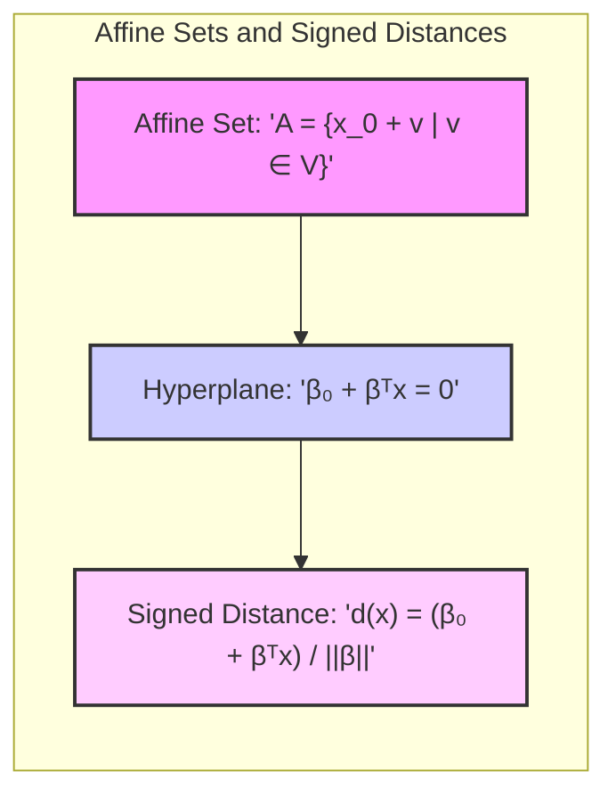
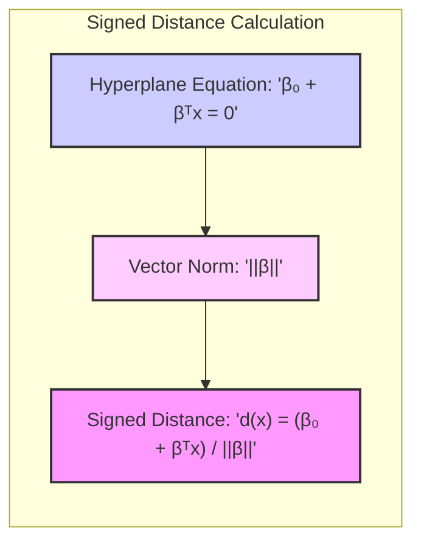
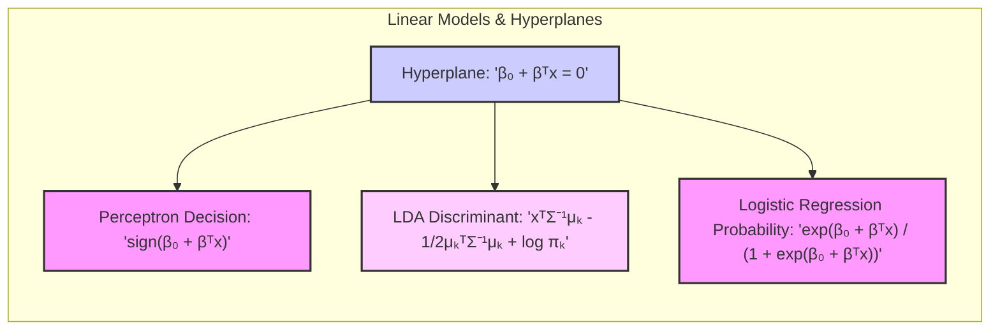
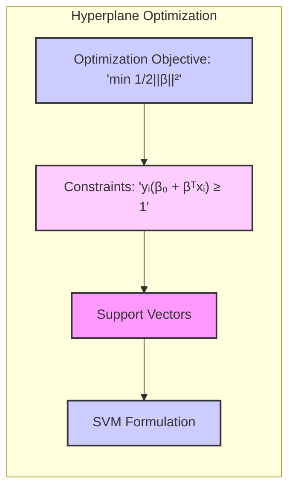

### Conjuntos Afins e o Uso de Distâncias Sinalizadas a um Hiperplano

A compreensão dos **conjuntos afins** e o uso de **distâncias sinalizadas** a um **hiperplano** são fundamentais para entender a geometria dos modelos de classificação linear, incluindo os *perceptrons* e os hiperplanos separadores. Esses conceitos fornecem uma base matemática para a construção e interpretação de modelos de classificação, e são essenciais para modelar as fronteiras de decisão.

**Conjuntos Afins:**

Um **conjunto afim** é um subconjunto de um espaço vetorial que é obtido por meio da translação de um subespaço vetorial. Formalmente, um conjunto afim $A$ pode ser definido como o conjunto de todos os pontos $x$ que podem ser expressos como:

$$
    x = x_0 + v
$$

onde $x_0$ é um ponto fixo no espaço, e $v$ é um vetor que pertence a um subespaço vetorial $V$. Uma forma de descrever um conjunto afim é por meio de sua equação, que define um hiperplano:

$$
    \beta_0 + \beta^T x = 0
$$

onde $\beta$ é um vetor normal ao hiperplano, e $\beta_0$ é um termo que define a translação. Quando $\beta_0 = 0$, o hiperplano passa pela origem, e nesse caso, ele também é um subespaço vetorial. Quando $\beta_0 \neq 0$, o hiperplano não passa pela origem, mas ainda representa um conjunto afim.

> 💡 **Exemplo Numérico:**
>
> Considere um espaço bidimensional onde $x = [x_1, x_2]^T$. Um hiperplano (neste caso, uma linha) pode ser definido por $\beta_0 + \beta_1 x_1 + \beta_2 x_2 = 0$. Se $\beta = [2, -1]^T$ e $\beta_0 = 3$, a equação do hiperplano é $3 + 2x_1 - x_2 = 0$.
>
> Se escolhermos um ponto $x_0 = [0, 3]^T$ que satisfaz a equação (já que $3 + 2(0) - 3 = 0$), podemos encontrar outros pontos no mesmo hiperplano. Por exemplo, se $v = [1, 2]^T$ é um vetor paralelo ao hiperplano, então o ponto $x = x_0 + v = [1, 5]^T$ também deve pertencer ao hiperplano. De fato, $3 + 2(1) - 5 = 0$.
>
> Se $\beta_0 = 0$, então o hiperplano passa pela origem. Por exemplo, se a equação fosse $2x_1 - x_2 = 0$, o ponto $[0, 0]^T$ pertenceria ao hiperplano.

Em duas dimensões, um hiperplano é uma linha, em três dimensões, um hiperplano é um plano, e em geral, em um espaço de dimensão $p$, o hiperplano tem dimensão $p-1$. Um hiperplano divide o espaço de entrada em duas regiões, e a classificação de um ponto é feita com base em qual região o ponto pertence.

**Distâncias Sinalizadas a um Hiperplano:**

A **distância sinalizada** de um ponto $x$ a um hiperplano definido por $\beta_0 + \beta^T x = 0$ é uma medida da distância perpendicular do ponto ao hiperplano, com um sinal que indica o lado do hiperplano em que o ponto está localizado.

A distância sinalizada é dada por:

$$
    d(x) = \frac{\beta_0 + \beta^T x}{||\beta||}
$$

onde $||\beta||$ é a norma euclidiana do vetor $\beta$. Essa medida é uma distância em que:

*   Se $d(x) > 0$, o ponto $x$ está localizado no lado do hiperplano para onde aponta o vetor normal $\beta$.
*   Se $d(x) < 0$, o ponto $x$ está localizado no lado oposto.
*   Se $d(x) = 0$, o ponto $x$ está no próprio hiperplano.

> 💡 **Exemplo Numérico:**
>
> Usando o exemplo anterior, onde $\beta = [2, -1]^T$ e $\beta_0 = 3$, vamos calcular a distância sinalizada de um ponto $x = [2, 2]^T$ ao hiperplano $3 + 2x_1 - x_2 = 0$.
>
> Primeiro, calculamos a norma de $\beta$:
>
> $$||\beta|| = \sqrt{2^2 + (-1)^2} = \sqrt{4 + 1} = \sqrt{5}$$
>
> Agora, calculamos a distância sinalizada:
>
> $$d(x) = \frac{3 + 2(2) - 2}{\sqrt{5}} = \frac{3 + 4 - 2}{\sqrt{5}} = \frac{5}{\sqrt{5}} = \sqrt{5} \approx 2.236$$
>
> Como $d(x) > 0$, o ponto $[2, 2]^T$ está no lado do hiperplano para onde aponta o vetor normal $\beta = [2, -1]^T$.
>
> Agora, vamos calcular a distância sinalizada de um ponto $x = [0, 4]^T$:
>
> $$d(x) = \frac{3 + 2(0) - 4}{\sqrt{5}} = \frac{3 - 4}{\sqrt{5}} = \frac{-1}{\sqrt{5}} \approx -0.447$$
>
> Como $d(x) < 0$, o ponto $[0, 4]^T$ está no lado oposto ao vetor normal $\beta$.
>
> Se o ponto estivesse no hiperplano, como o ponto $x = [1, 5]^T$, a distância seria:
>
> $$d(x) = \frac{3 + 2(1) - 5}{\sqrt{5}} = \frac{0}{\sqrt{5}} = 0$$
>
> A distância sinalizada é zero, indicando que o ponto está exatamente no hiperplano.

O uso de distâncias sinalizadas permite que as técnicas de classificação linear considerem a direção da distância em relação ao hiperplano, e essa informação é crucial para separar as classes e para a construção de modelos como o perceptron e o hiperplano separador ótimo.

Em termos de classificação, cada classe está associada a uma região do espaço definida pela distância sinalizada em relação ao hiperplano. Os pontos são atribuídos à classe cuja região corresponde ao sinal da distância sinalizada. Em classificadores como o *perceptron*, os parâmetros $\beta$ e $\beta_0$ são ajustados durante o processo de aprendizado para definir a orientação e a posição do hiperplano que melhor separa as classes.

**Lemma 43:** *Um conjunto afim é um subconjunto de um espaço vetorial obtido por meio de uma translação de um subespaço vetorial, e pode ser descrito por meio de uma equação linear, que define um hiperplano no espaço.*

*Prova:* A equação de um conjunto afim (hiperplano) é dada por $\beta_0 + \beta^T x = 0$, e essa equação define uma região do espaço.  $\blacksquare$

**Corolário 43:** *A distância sinalizada de um ponto a um hiperplano é uma medida da distância perpendicular do ponto ao hiperplano, com um sinal que indica o lado em que o ponto está localizado, permitindo que modelos de classificação linear se baseiem na distância e na direção dos dados em relação à fronteira de decisão.*

*Prova:* A distância sinalizada é dada pela equação $\frac{\beta_0 + \beta^T x}{||\beta||}$, e permite entender a posição relativa de cada ponto em relação ao hiperplano. $\blacksquare$

A compreensão de conjuntos afins e distâncias sinalizadas são fundamentais para a construção de modelos lineares para classificação.

### Relação com os Modelos de Classificação Linear

Os conceitos de **conjuntos afins** e **distâncias sinalizadas a um hiperplano** são a base matemática para muitos **modelos de classificação linear**, como o *perceptron*, a **Análise Discriminante Linear (LDA)** e a **regressão logística** [^4.1], [^4.3], [^4.4]. Esses conceitos fornecem a estrutura geométrica que permite definir as fronteiras de decisão e classificar as observações em diferentes classes.

1.  ***Perceptron***: O algoritmo do *perceptron* utiliza um hiperplano para separar as classes e ajusta seus parâmetros por meio de um processo iterativo que busca minimizar a distância de observações mal classificadas até a fronteira de decisão. A função de decisão do *perceptron* é baseada no sinal da distância sinalizada ao hiperplano. Formalmente, a decisão de classe do perceptron é dada por:

    $$
        \hat{G}(x) = \text{sign}(\beta_0 + \beta^T x)
    $$

    onde $\text{sign}$ é a função sinal (1 para valores positivos e -1 para valores negativos). Nesse caso, a distância sinalizada ao hiperplano divide o espaço em duas regiões, e as observações são classificadas com base em qual região elas pertencem.

    > 💡 **Exemplo Numérico:**
    >
    > Suponha que após o treinamento, o perceptron tenha encontrado os parâmetros $\beta = [2, -1]^T$ e $\beta_0 = 3$. A função de decisão é $\hat{G}(x) = \text{sign}(3 + 2x_1 - x_2)$.
    >
    > Para o ponto $x = [2, 2]^T$, calculamos $3 + 2(2) - 2 = 5$. Como $5 > 0$, $\text{sign}(5) = 1$, e o ponto é classificado como pertencente à classe 1.
    >
    > Para o ponto $x = [0, 4]^T$, calculamos $3 + 2(0) - 4 = -1$. Como $-1 < 0$, $\text{sign}(-1) = -1$, e o ponto é classificado como pertencente à classe -1.
    >
    > O perceptron usa o sinal da distância sinalizada para classificar os pontos.

2.  ***LDA (Análise Discriminante Linear)***: A LDA utiliza um hiperplano para separar as classes, e a decisão de classe é baseada na distância sinalizada do ponto ao hiperplano e nas probabilidades *a priori* das classes. A função discriminante da LDA pode ser interpretada como um conjunto de distâncias sinalizadas com um ponto de corte que considera a variância comum entre as classes e as probabilidades *a priori* de cada classe.

    A regra de decisão da LDA é baseada na comparação da função discriminante para cada classe.  Quando assumimos covariâncias iguais, cada discriminante é uma função linear de $x$:

$$
 \delta_k(x) =  x^T \Sigma^{-1} \mu_k - \frac{1}{2} \mu_k^T \Sigma^{-1} \mu_k + \log \pi_k
$$

que representa uma distância sinalizada ponderada pelos parâmetros do modelo.

> 💡 **Exemplo Numérico:**
>
> Suponha que temos duas classes com médias $\mu_1 = [1, 1]^T$ e $\mu_2 = [3, 3]^T$, uma matriz de covariância comum $\Sigma = \begin{bmatrix} 1 & 0 \\ 0 & 1 \end{bmatrix}$ e probabilidades a priori $\pi_1 = 0.6$ e $\pi_2 = 0.4$.
>
> A função discriminante para a classe 1 é:
>
> $$
> \delta_1(x) = x^T \begin{bmatrix} 1 & 0 \\ 0 & 1 \end{bmatrix}^{-1} \begin{bmatrix} 1 \\ 1 \end{bmatrix} - \frac{1}{2} \begin{bmatrix} 1 & 1 \end{bmatrix} \begin{bmatrix} 1 & 0 \\ 0 & 1 \end{bmatrix}^{-1} \begin{bmatrix} 1 \\ 1 \end{bmatrix} + \log(0.6)
> $$
>
> $$
> \delta_1(x) = x^T \begin{bmatrix} 1 \\ 1 \end{bmatrix} - \frac{1}{2} \begin{bmatrix} 1 & 1 \end{bmatrix} \begin{bmatrix} 1 \\ 1 \end{bmatrix} + \log(0.6) = x_1 + x_2 - 1 + \log(0.6)
> $$
>
> Similarmente, para a classe 2:
>
> $$
> \delta_2(x) = x^T \begin{bmatrix} 1 & 0 \\ 0 & 1 \end{bmatrix}^{-1} \begin{bmatrix} 3 \\ 3 \end{bmatrix} - \frac{1}{2} \begin{bmatrix} 3 & 3 \end{bmatrix} \begin{bmatrix} 1 & 0 \\ 0 & 1 \end{bmatrix}^{-1} \begin{bmatrix} 3 \\ 3 \end{bmatrix} + \log(0.4)
> $$
>
> $$
> \delta_2(x) = x^T \begin{bmatrix} 3 \\ 3 \end{bmatrix} - \frac{1}{2} \begin{bmatrix} 3 & 3 \end{bmatrix} \begin{bmatrix} 3 \\ 3 \end{bmatrix} + \log(0.4) = 3x_1 + 3x_2 - 9 + \log(0.4)
> $$
>
> Para classificar um ponto $x = [2, 2]^T$, calculamos:
>
> $$
> \delta_1([2, 2]^T) = 2 + 2 - 1 + \log(0.6) \approx 2.51
> $$
>
> $$
> \delta_2([2, 2]^T) = 3(2) + 3(2) - 9 + \log(0.4) \approx 2.08
> $$
>
> Como $\delta_1(x) > \delta_2(x)$, o ponto é classificado como pertencente à classe 1.

3.  ***Regressão Logística***: A regressão logística também utiliza um hiperplano como fronteira de decisão, e a probabilidade de uma observação pertencer a uma classe é modelada através de uma função logística aplicada à distância sinalizada ao hiperplano. A decisão de classe é feita com base na comparação entre a probabilidade de cada classe:

$$
    Pr(G=1|X=x) = \frac{exp(\beta_0 + \beta^T x)}{1+exp(\beta_0 + \beta^T x)}
$$

A probabilidade é uma transformação da distância sinalizada.

> 💡 **Exemplo Numérico:**
>
> Suponha que a regressão logística tenha encontrado os parâmetros $\beta = [1, -1]^T$ e $\beta_0 = -1$. A probabilidade de um ponto $x$ pertencer à classe 1 é:
>
> $$
> Pr(G=1|X=x) = \frac{exp(-1 + x_1 - x_2)}{1+exp(-1 + x_1 - x_2)}
> $$
>
> Para o ponto $x = [2, 1]^T$:
>
> $$
> Pr(G=1|X=[2, 1]^T) = \frac{exp(-1 + 2 - 1)}{1+exp(-1 + 2 - 1)} = \frac{exp(0)}{1+exp(0)} = \frac{1}{1+1} = 0.5
> $$
>
> Para o ponto $x = [1, 2]^T$:
>
> $$
> Pr(G=1|X=[1, 2]^T) = \frac{exp(-1 + 1 - 2)}{1+exp(-1 + 1 - 2)} = \frac{exp(-2)}{1+exp(-2)} \approx \frac{0.135}{1+0.135} \approx 0.119
> $$
>
> Se o limiar de decisão for 0.5, o ponto [2, 1] seria classificado na classe 1, enquanto o ponto [1, 2] seria classificado na classe 0.

Em todos esses modelos, os parâmetros $\beta$ e $\beta_0$ definem a orientação e a posição do hiperplano, e o algoritmo de aprendizado de cada modelo ajusta os parâmetros de forma a obter uma fronteira de decisão que separe as classes com a maior precisão possível. As distâncias sinalizadas são, então, um elemento fundamental para expressar as regras de decisão desses modelos.

A organização das classes no espaço é baseada nas distâncias sinalizadas com relação a hiperplanos que separam o espaço de entrada em regiões correspondentes a cada classe.

**Lemma 44:** *Os modelos de classificação linear, como o perceptron, a LDA e a regressão logística, utilizam hiperplanos como fronteiras de decisão, e a classificação das observações é baseada na distância sinalizada dessas observações em relação a esses hiperplanos.*

*Prova:* As funções de decisão do perceptron, da LDA e da regressão logística são baseadas no sinal da distância sinalizada ou em transformações da distância sinalizada.  $\blacksquare$

**Corolário 44:** *O ajuste dos parâmetros dos modelos de classificação linear envolve a otimização da posição e orientação do hiperplano para separar as classes com a maior precisão possível*.

*Prova:* O ajuste dos modelos de classificação linear tem como objetivo obter os parâmetros que definem a melhor posição e orientação do hiperplano separador, minimizando os erros de classificação. $\blacksquare$

A compreensão da relação entre conjuntos afins, distâncias sinalizadas e modelos de classificação linear permite entender a geometria desses modelos e a forma como eles operam para classificar dados.

### Otimização de Hiperplanos Separadores e Relação com SVM

A busca por **hiperplanos separadores** ótimos é uma extensão natural do conceito de conjuntos afins e distâncias sinalizadas, e é central na formulação das **Máquinas de Vetores de Suporte (SVM)** [^4.5.2]. O objetivo é encontrar um hiperplano que não apenas separe as classes, mas que também maximize a **margem** entre elas. A margem é definida como a distância mínima entre o hiperplano e as observações mais próximas de cada classe.

A otimização do hiperplano separador envolve a solução de um problema de otimização convexa com restrições de desigualdade. A função objetivo busca maximizar a margem, e as restrições garantem que todas as observações sejam classificadas corretamente e que estejam a uma distância mínima do hiperplano [^4.5.2].

O problema de otimização do hiperplano separador pode ser formulado da seguinte forma:

$$
    \min_{\beta, \beta_0} \frac{1}{2} ||\beta||^2
$$

sujeito a:
$$
    y_i (\beta_0 + \beta^T x_i) \geq 1, \text{ para } i = 1,...,N
$$
onde $y_i$ é o rótulo da classe da observação $i$, e $\beta$ e $\beta_0$ são os parâmetros do hiperplano.

> 💡 **Exemplo Numérico:**
>
> Vamos considerar um exemplo simples com 3 pontos na classe +1: $x_1 = [1, 1]^T$, $x_2 = [2, 2]^T$, $x_3 = [3, 1]^T$ e 2 pontos na classe -1: $x_4 = [1, 3]^T$, $x_5 = [2, 3]^T$. O objetivo é encontrar um hiperplano que maximize a margem entre as duas classes.
>
> O problema de otimização a ser resolvido é:
>
> $$
> \min_{\beta, \beta_0} \frac{1}{2} ||\beta||^2
> $$
>
> sujeito a:
>
> $$
>  \begin{cases}
>  \beta_0 + \beta^T x_1 \geq 1 \\
>  \beta_0 + \beta^T x_2 \geq 1 \\
>  \beta_0 + \beta^T x_3 \geq 1 \\
>  -(\beta_0 + \beta^T x_4) \geq 1 \\
>  -(\beta_0 + \beta^T x_5) \geq 1
>  \end{cases}
> $$
>
> Este problema pode ser resolvido usando um solver de otimização. A solução, após a otimização, poderia ser algo como $\beta = [-1, 1]^T$ e $\beta_0 = 2$, que define um hiperplano $-x_1 + x_2 + 2 = 0$. A margem seria a distância entre o hiperplano e os pontos mais próximos (os vetores de suporte).

O problema de otimização acima representa a busca por um hiperplano que separa as classes com a maior margem possível. Esse problema pode ser resolvido utilizando a teoria da dualidade de Wolfe e o método de multiplicadores de Lagrange, o que leva a uma formulação dual do problema que é mais fácil de resolver.

Na formulação dual do problema, a solução para o hiperplano separador ótimo é expressa como uma combinação linear dos **vetores de suporte**, que são as observações que se encontram mais próximas da fronteira de decisão (e que definem a margem). A maioria dos outros pontos de treino não contribuem para a definição da solução final. A solução do problema dual é dada por:

$$
   \max_{\alpha}  \sum_{i=1}^N \alpha_i - \frac{1}{2}\sum_{i=1}^N \sum_{j=1}^N \alpha_i \alpha_j y_i y_j x_i^T x_j
$$

sujeito a:
$$
  \sum_{i=1}^N \alpha_i y_i = 0
$$
$$
    \alpha_i \geq 0, \text{ para } i = 1,...,N
$$

onde $\alpha_i$ são os multiplicadores de Lagrange. Os multiplicadores $\alpha_i$ que são diferentes de zero correspondem aos vetores de suporte. Os parâmetros do hiperplano são calculados por meio desses multiplicadores, e as observações não correspondentes a vetores de suporte não influenciam a solução.

> 💡 **Exemplo Numérico:**
>
> Usando os mesmos dados do exemplo anterior, o problema dual seria:
>
> $$
> \max_{\alpha} \sum_{i=1}^5 \alpha_i - \frac{1}{2} \sum_{i=1}^5 \sum_{j=1}^5 \alpha_i \alpha_j y_i y_j x_i^T x_j
> $$
>
> sujeito a:
>
> $$
> \alpha_1 + \alpha_2 + \alpha_3 - \alpha_4 - \alpha_5 = 0
> $$
>
> $$
> \alpha_i \geq 0, \text{ para } i = 1, ..., 5
> $$
>
> A solução deste problema, obtida através de um solver de otimização, nos daria valores para $\alpha_i$. Suponha que os valores resultantes fossem $\alpha_1 = 0.5$, $\alpha_2 = 0$, $\alpha_3 = 0.5$, $\alpha_4 = 0.5$, $\alpha_5 = 0$. Os vetores de suporte seriam $x_1$, $x_3$ e $x_4$ (onde $\alpha_i > 0$). Os parâmetros $\beta$ e $\beta_0$ podem ser obtidos a partir destes multiplicadores e vetores de suporte.

A relação com as **Máquinas de Vetores de Suporte (SVM)** é direta, já que o SVM é uma generalização dessa abordagem ao permitir que o modelo lide com dados que não são linearmente separáveis, e utiliza uma formulação similar para determinar o hiperplano separador. O SVM utiliza uma abordagem similar de otimização para obter os parâmetros e utiliza uma função kernel para transformar os dados para um espaço de maior dimensionalidade, onde a separação linear é possível.

A busca por hiperplanos separadores ótimos, por meio da maximização da margem, é uma abordagem fundamental em muitos métodos de classificação linear, e desempenha um papel importante para garantir a capacidade de generalização desses modelos.

**Lemma 45:** *A otimização do hiperplano separador envolve a maximização da margem entre as classes, o que leva a uma solução que é expressa como uma combinação linear dos vetores de suporte*.

*Prova:* A otimização da margem leva a um problema de otimização convexa cuja solução é definida em termos dos vetores de suporte, que são as observações mais próximas à fronteira de decisão.  $\blacksquare$

**Corolário 45:** *A formulação dual do problema de otimização do hiperplano separador permite a obtenção de soluções mais eficientes e a aplicação de métodos de otimização convexa padrão, sendo a base da formulação das Máquinas de Vetores de Suporte (SVM).*

*Prova:* A formulação dual transforma o problema em um problema mais fácil de resolver, e leva a um modelo que se baseia nos vetores de suporte.  $\blacksquare$

A otimização de hiperplanos separadores é um conceito central no desenvolvimento de modelos de classificação lineares robustos e com boa capacidade de generalização.

### Conclusão

Este capítulo explorou os conjuntos afins e o uso de distâncias sinalizadas a um hiperplano como base geométrica para modelos de classificação linear. Foi demonstrado como os perceptrons, a LDA e a regressão logística utilizam esses conceitos para definir fronteiras de decisão e classificar observações. A otimização de hiperplanos separadores e sua relação com as Máquinas de Vetores de Suporte (SVM) foi discutida. A compreensão desses conceitos geométricos é fundamental para entender os modelos de classificação linear e para o desenvolvimento de abordagens mais sofisticadas para modelagem e inferência estatística.

### Footnotes

[^4.1]: "In this chapter we revisit the classification problem and focus on linear methods for classification. Since our predictor G(x) takes values in a discrete set G, we can always divide the input space into a collection of regions labeled according to the classification. We saw in Chapter 2 that the boundaries of these regions can be rough or smooth, depending on the prediction function. For an important class of procedures, these decision boundaries are linear; this is what we will mean by linear methods for classification." *(Trecho de "The Elements of Statistical Learning")*

[^4.3]: "Linear discriminant analysis (LDA) arises in the special case when we assume that the classes have a common covariance matrix Σk = ∑. In comparing two classes k and l, it is sufficient to look at the log-ratio, and we see that" *(Trecho de "The Elements of Statistical Learning")*

[^4.4]: "The logistic regression model arises from the desire to model the posterior probabilities of the K classes via linear functions in x, while at the same time ensuring that they sum to one and remain in [0,1]." *(Trecho de "The Elements of Statistical Learning")*

[^4.5]: "In this situation the features are high-dimensional and correlated, and the LDA coefficients can be regularized to be smooth or sparse in the original domain of the signal. This leads to better generalization and allows for easier interpretation of the coefficients." *(Trecho de "The Elements of Statistical Learning")*

[^4.5.1]: "The first is the well-known perceptron model of Rosenblatt (1958), with an algorithm that finds a separating hyperplane in the training data, if one exists." *(Trecho de "The Elements of Statistical Learning")*

[^4.5.2]: "The second method, due to Vapnik (1996), finds an optimally separating hyperplane if one exists, else finds a hyperplane that minimizes some measure of overlap in the training data. We treat the separable case here, and defer treatment of the nonseparable case to Chapter 12." *(Trecho de "The Elements of Statistical Learning")*
