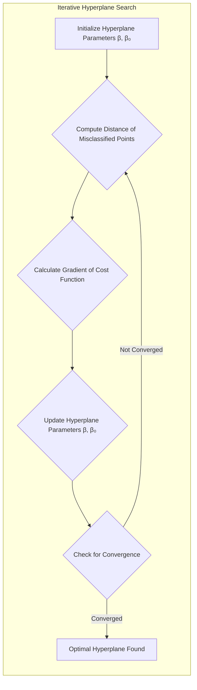
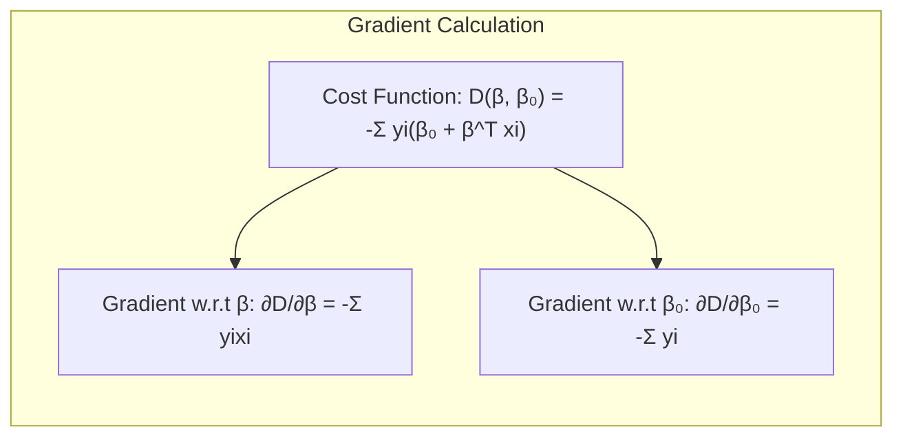
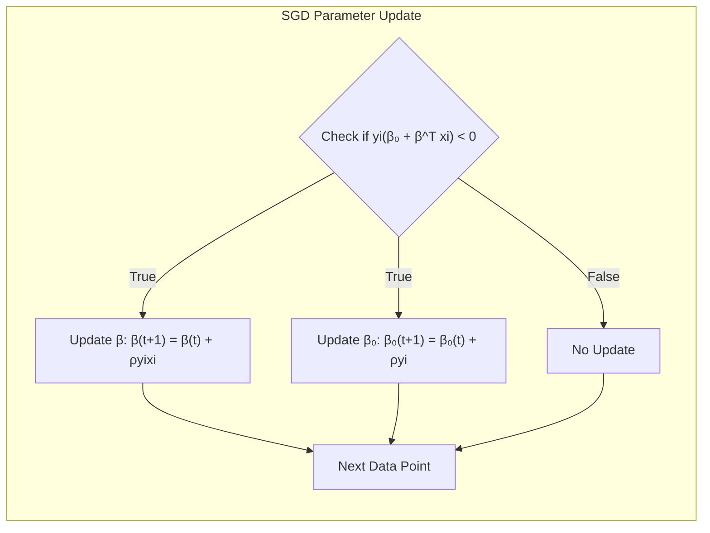
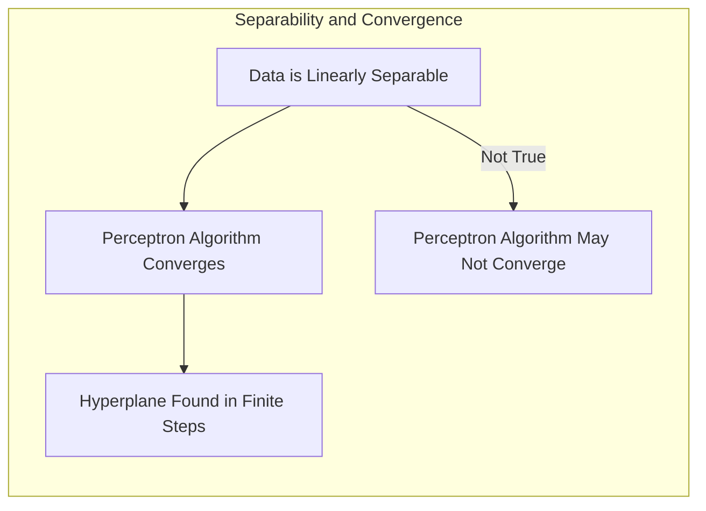
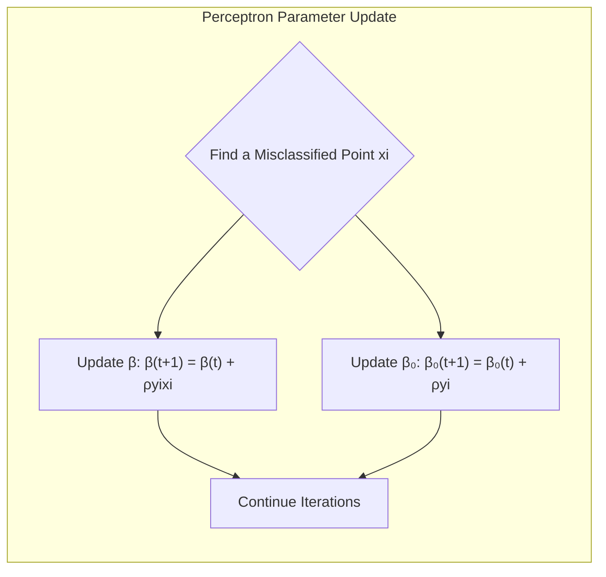
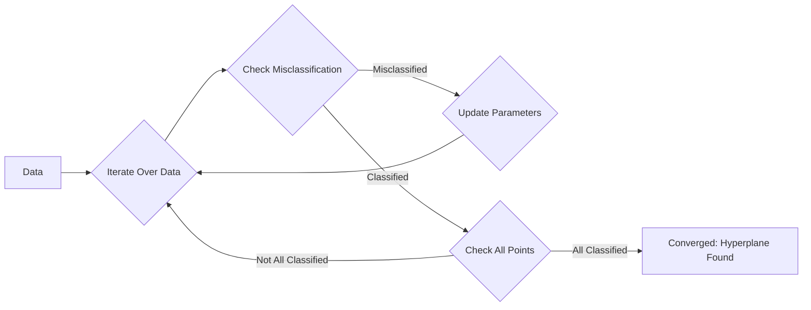
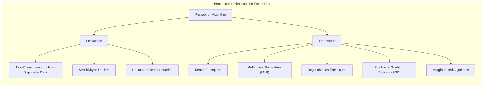
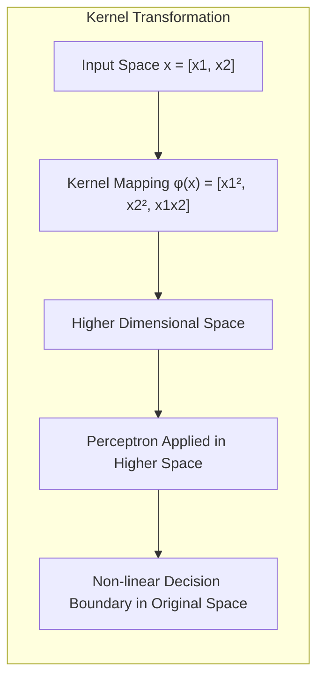

### Estratégia Iterativa para Encontrar um Hiperplano Separador por Gradiente Descendente Usando Abordagens Estocásticas

A busca por um **hiperplano separador** em problemas de classificação linear é um desafio fundamental em aprendizado de máquina [^4.5.1]. Quando os dados são linearmente separáveis, o objetivo é encontrar um hiperplano que separe perfeitamente as classes. Uma estratégia comum para resolver este problema é utilizar um algoritmo iterativo baseado em **gradiente descendente**, onde as distâncias dos pontos mal classificados são usadas para atualizar os parâmetros do hiperplano. Uma abordagem mais eficiente é o uso de abordagens **estocásticas** do gradiente descendente, que atualizam os parâmetros do modelo com base em observações individuais ou pequenos *batches* de observações [^4.5.1].

O problema de otimização é encontrar os parâmetros do hiperplano (o vetor normal $\beta$ e o *bias* $\beta_0$) que minimizem uma função de custo. Essa função de custo é definida de forma a penalizar as observações mal classificadas. Uma função de custo comum para esse propósito é a soma das distâncias sinalizadas das observações mal classificadas até o hiperplano.

Formalmente, a função de custo a ser minimizada é dada por:

$$
    D(\beta, \beta_0) = -\sum_{i \in M} y_i (\beta_0 + \beta^T x_i)
$$

onde $M$ é o conjunto de observações mal classificadas, $y_i$ é o rótulo da classe da observação $i$ (+1 ou -1), e $x_i$ é o vetor de preditores da observação $i$. O objetivo é encontrar o hiperplano que minimize a soma das distâncias de todos os pontos mal classificados. Em outras palavras, a soma dos pontos para os quais $y_i (\beta_0 + \beta^T x_i) < 0$ é penalizada.

O gradiente da função de custo em relação aos parâmetros $\beta$ e $\beta_0$ é dado por:

$$
    \frac{\partial D}{\partial \beta} = -\sum_{i \in M} y_i x_i
$$

$$
    \frac{\partial D}{\partial \beta_0} = -\sum_{i \in M} y_i
$$

No **gradiente descendente**, os parâmetros são atualizados em direção ao negativo do gradiente:

$$
    \beta^{(t+1)} = \beta^{(t)} - \rho \frac{\partial D}{\partial \beta}
$$

$$
    \beta_0^{(t+1)} = \beta_0^{(t)} - \rho \frac{\partial D}{\partial \beta_0}
$$

onde $\rho$ é a taxa de aprendizagem. Essa abordagem, no entanto, calcula o gradiente com base em todas as observações mal classificadas, o que pode ser computacionalmente custoso em conjuntos de dados grandes.

> 💡 **Exemplo Numérico:**
> Suponha que temos um conjunto de dados com duas classes e duas características (x1, x2). Inicializamos os parâmetros do hiperplano como $\beta = [0.1, -0.2]$ e $\beta_0 = 0.5$, e a taxa de aprendizagem $\rho = 0.1$. Vamos considerar um ponto mal classificado $x_i = [2, 1]$ com rótulo $y_i = -1$.
>
> 1.  **Cálculo da distância sinalizada:**
>     $\beta_0 + \beta^T x_i = 0.5 + (0.1 * 2) + (-0.2 * 1) = 0.5 + 0.2 - 0.2 = 0.5$.
>     Como $y_i (\beta_0 + \beta^T x_i) = -1 * 0.5 = -0.5 < 0$, o ponto está mal classificado.
>
> 2.  **Cálculo dos gradientes:**
>     $\frac{\partial D}{\partial \beta} = -y_i x_i = -(-1) * [2, 1] = [2, 1]$.
>     $\frac{\partial D}{\partial \beta_0} = -y_i = -(-1) = 1$.
>
> 3.  **Atualização dos parâmetros (Gradiente Descendente):**
>     $\beta^{(t+1)} = \beta^{(t)} - \rho \frac{\partial D}{\partial \beta} = [0.1, -0.2] - 0.1 * [2, 1] = [0.1 - 0.2, -0.2 - 0.1] = [-0.1, -0.3]$.
>     $\beta_0^{(t+1)} = \beta_0^{(t)} - \rho \frac{\partial D}{\partial \beta_0} = 0.5 - 0.1 * 1 = 0.5 - 0.1 = 0.4$.
>
>   Após esta atualização, o hiperplano é ajustado na direção de classificar corretamente o ponto $x_i$. O gradiente descendente clássico faria isso para todos os pontos mal classificados antes de fazer a atualização.

No **gradiente descendente estocástico (SGD)**, uma abordagem mais eficiente, os parâmetros são atualizados com base em uma única observação ou em um pequeno *batch* de observações [^4.5.1]. O SGD itera pelos dados de treinamento, e a cada observação (ou *batch*) o gradiente e os parâmetros são atualizados utilizando a regra:

$$
    \beta^{(t+1)} = \beta^{(t)} + \rho y_i x_i \text{ se } y_i(\beta_0 + \beta^T x_i) < 0
$$

$$
    \beta_0^{(t+1)} = \beta_0^{(t)} + \rho y_i \text{ se } y_i(\beta_0 + \beta^T x_i) < 0
$$
Caso a observação não seja mal classificada, os parâmetros não são atualizados. O processo iterativo continua até a convergência do algoritmo, ou seja, até que um hiperplano separador seja encontrado ou um número máximo de iterações seja atingido.

> 💡 **Exemplo Numérico (SGD):**
> Usando os mesmos dados do exemplo anterior, com $\beta = [0.1, -0.2]$, $\beta_0 = 0.5$, $\rho = 0.1$, $x_i = [2, 1]$, e $y_i = -1$, e sabendo que o ponto foi mal classificado ($y_i(\beta_0 + \beta^T x_i) = -0.5 < 0$):
>
> 1.  **Atualização dos parâmetros (SGD):**
>     $\beta^{(t+1)} = \beta^{(t)} + \rho y_i x_i = [0.1, -0.2] + 0.1 * (-1) * [2, 1] = [0.1 - 0.2, -0.2 - 0.1] = [-0.1, -0.3]$.
>     $\beta_0^{(t+1)} = \beta_0^{(t)} + \rho y_i = 0.5 + 0.1 * (-1) = 0.5 - 0.1 = 0.4$.
>
>  Observe que a atualização é similar ao gradiente descendente, mas a principal diferença é que no SGD essa atualização é feita imediatamente após encontrar um ponto mal classificado, ao invés de acumular os gradientes de todos os pontos mal classificados para uma única atualização.

O uso de abordagens estocásticas, como o SGD, melhora a eficiência computacional do algoritmo, especialmente em grandes conjuntos de dados, e também introduz um elemento de aleatoriedade no processo de otimização, o que pode ajudar a evitar mínimos locais. O algoritmo SGD pode ser visto como uma forma iterativa de atualizar os parâmetros do hiperplano, usando apenas informações de um subconjunto do conjunto de treinamento para realizar a atualização.

É importante ressaltar que, mesmo com abordagens estocásticas, não há garantias de convergência para problemas não separáveis. O uso de técnicas de regularização ou outros mecanismos são necessários para lidar com casos não separáveis ou dados ruidosos.

**Lemma 46:** *O gradiente descendente estocástico, ao atualizar os parâmetros com base em um subconjunto dos dados, é computacionalmente mais eficiente para encontrar um hiperplano separador do que o gradiente descendente clássico, que considera todos os dados*.

*Prova:* A atualização iterativa com apenas um subconjunto dos dados diminui o custo computacional de cada atualização e torna o algoritmo mais rápido em termos de computação.  $\blacksquare$

**Corolário 46:** *O algoritmo de gradiente descendente estocástico, aplicado ao problema de encontrar um hiperplano separador, busca iterativamente um conjunto de parâmetros que minimizem a distância dos pontos mal classificados até a fronteira de decisão.*

*Prova:* O algoritmo SGD, ao atualizar os parâmetros com base no gradiente da função de custo, busca iterativamente encontrar o hiperplano separador que melhor separe as classes.   $\blacksquare$

O uso de gradiente descendente e, em particular, de abordagens estocásticas, é uma técnica comum para encontrar hiperplanos separadores em problemas de classificação linear.

### Convergência do Algoritmo Perceptron e a Condição de Separável

A **convergência** do algoritmo do *perceptron*, um dos primeiros algoritmos de aprendizado de máquina, está intimamente ligada à condição de **separabilidade linear** dos dados [^4.5.1]. A condição de separabilidade linear, como visto em capítulos anteriores, garante que as classes possam ser separadas por um hiperplano no espaço de entrada. Compreender a relação entre a separabilidade e a convergência do algoritmo é fundamental para analisar o desempenho e as limitações do *perceptron*.

**Condição de Separável Linear:**

Um conjunto de dados é considerado **linearmente separável** se existe um hiperplano que pode separar perfeitamente todas as observações nas classes corretas. Ou seja, se existe um hiperplano definido por $\beta_0 + \beta^T x = 0$ tal que:

*   $\beta_0 + \beta^T x_i > 0$ para todas as observações $x_i$ pertencentes à classe positiva.
*   $\beta_0 + \beta^T x_i < 0$ para todas as observações $x_i$ pertencentes à classe negativa.

Em outras palavras, um conjunto de dados linearmente separável pode ser dividido por um hiperplano de forma que nenhuma observação esteja mal classificada. O conceito de separabilidade linear é central para o algoritmo perceptron.

**Convergência do Algoritmo Perceptron:**

Quando os dados são linearmente separáveis, é possível demonstrar que o algoritmo do perceptron converge para uma solução separadora em um **número finito de passos**. O algoritmo do perceptron utiliza um processo iterativo baseado em gradiente descendente, onde os parâmetros do hiperplano ($\beta_0$ e $\beta$) são atualizados com base nas observações mal classificadas.

A cada iteração, o algoritmo encontra uma observação mal classificada e atualiza os parâmetros da seguinte forma:

$$
    \beta^{(t+1)} = \beta^{(t)} + \rho y_i x_i
$$

$$
    \beta_0^{(t+1)} = \beta_0^{(t)} + \rho y_i
$$
onde $\rho$ é a taxa de aprendizagem, $y_i$ é a classe da observação e $x_i$ são os preditores.
O algoritmo continua até que todas as observações sejam classificadas corretamente, o que ocorre em um número finito de iterações quando os dados são separáveis. O número de iterações necessárias para a convergência pode depender da escolha da taxa de aprendizagem e do vetor de parâmetros inicial.

> 💡 **Exemplo Numérico:**
> Vamos considerar um conjunto de dados bidimensional com dois pontos da classe +1: $x_1 = [1, 1]$ e $x_2 = [2, 2]$, e dois pontos da classe -1: $x_3 = [-1, -1]$ e $x_4 = [-2, -2]$. Inicializamos os parâmetros do perceptron como $\beta = [0, 0]$ e $\beta_0 = 0$, e a taxa de aprendizagem $\rho = 1$.
>
> 1.  **Primeira iteração:**
>    *   Consideramos o ponto $x_1 = [1, 1]$ com $y_1 = 1$.
>    *   Calculamos a distância sinalizada: $\beta_0 + \beta^T x_1 = 0 + (0*1) + (0*1) = 0$. Como $y_1(\beta_0 + \beta^T x_1) = 1 * 0 = 0$, o ponto não está mal classificado, então não há atualização.
>    *   Consideramos o ponto $x_2 = [2, 2]$ com $y_2 = 1$.
>    *   Calculamos a distância sinalizada: $\beta_0 + \beta^T x_2 = 0 + (0*2) + (0*2) = 0$. Como $y_2(\beta_0 + \beta^T x_2) = 1 * 0 = 0$, o ponto não está mal classificado, então não há atualização.
>    *   Consideramos o ponto $x_3 = [-1, -1]$ com $y_3 = -1$.
>    *   Calculamos a distância sinalizada: $\beta_0 + \beta^T x_3 = 0 + (0*-1) + (0*-1) = 0$. Como $y_3(\beta_0 + \beta^T x_3) = -1 * 0 = 0$, o ponto não está mal classificado, então não há atualização.
>    *   Consideramos o ponto $x_4 = [-2, -2]$ com $y_4 = -1$.
>    *   Calculamos a distância sinalizada: $\beta_0 + \beta^T x_4 = 0 + (0*-2) + (0*-2) = 0$. Como $y_4(\beta_0 + \beta^T x_4) = -1 * 0 = 0$, o ponto não está mal classificado, então não há atualização.
>
> 2. **Segunda iteração:**
>    *   Suponha que na segunda iteração a ordem dos pontos seja diferente, e o primeiro ponto considerado seja $x_3 = [-1, -1]$.
>    *   Como o ponto não está classificado corretamente (distância sinalizada é 0), atualizamos os parâmetros:
>         $\beta^{(t+1)} = [0, 0] + 1 * (-1) * [-1, -1] = [1, 1]$.
>         $\beta_0^{(t+1)} = 0 + 1 * (-1) = -1$.
>    *    Agora, o hiperplano é definido por $-1 + x_1 + x_2 = 0$.
>
> 3.  **Iterações subsequentes:**
>     O algoritmo continua iterando pelos pontos, atualizando os parâmetros quando encontra pontos mal classificados. Eventualmente, o algoritmo irá convergir para um hiperplano que separe as duas classes.

A garantia de convergência é uma propriedade importante do perceptron, e essa propriedade se deve à condição de separabilidade linear dos dados, uma vez que se os dados não são separáveis o algoritmo não irá convergir e oscilará em torno de uma solução. A convergência garante que um hiperplano separador será encontrado em um número finito de passos se existir.

**Implicações da Não Separabilidade:**

Se os dados não forem linearmente separáveis, o algoritmo do perceptron não irá convergir, e pode apresentar ciclos ou oscilações sem atingir uma solução separadora. Nesse caso, outras técnicas mais sofisticadas, como *kernel methods* ou o uso de camadas adicionais em redes neurais, são necessárias para lidar com a não linearidade dos dados.

**Lemma 46:** *O algoritmo perceptron converge para um hiperplano separador em um número finito de passos se e somente se os dados são linearmente separáveis.*

*Prova:* O algoritmo garante uma solução quando os dados são separáveis, por meio de atualizações iterativas dos parâmetros do hiperplano. $\blacksquare$

**Corolário 46:** *Em dados não linearmente separáveis, o algoritmo perceptron não converge e pode oscilar sem atingir uma solução separadora, o que justifica a necessidade de outros modelos ou algoritmos.*

*Prova:* A não separabilidade dos dados impossibilita que um hiperplano possa dividir perfeitamente as classes, e o algoritmo não irá convergir para nenhuma solução. $\blacksquare$

A condição de separabilidade linear é fundamental para a convergência do perceptron, e sua violação requer abordagens alternativas e mais poderosas para modelar os dados.

### Limitações e Extensões do Algoritmo Perceptron

Apesar de sua importância histórica e de seu papel fundamental na base das redes neurais, o algoritmo do **perceptron** apresenta **limitações** importantes, especialmente quando se lida com dados que não são linearmente separáveis [^4.5.1]. No entanto, algumas **extensões** e adaptações do perceptron têm sido desenvolvidas para lidar com esses desafios, e são importantes para compreender a sua capacidade e seus limites.

**Limitações do Algoritmo Perceptron:**

1.  **Não Convergência em Dados Não Separáveis:** A principal limitação do perceptron é que ele não converge para uma solução quando os dados não são linearmente separáveis. Nesse caso, o algoritmo pode apresentar ciclos e oscilações, sem encontrar um hiperplano que separe as classes.

2.  **Dependência da Inicialização:** A solução final encontrada pelo perceptron, quando os dados são separáveis, depende da inicialização dos parâmetros e da ordem de apresentação dos dados. Diferentes inicializações podem levar a diferentes hiperplanos separadores, e não necessariamente o melhor.

3.  **Sensibilidade a Outliers:** O perceptron é sensível a *outliers*, que são observações atípicas que se desviam muito do padrão geral dos dados. A presença de *outliers* pode dificultar a convergência do algoritmo e influenciar negativamente o hiperplano separador obtido, e o algoritmo pode convergir para um hiperplano com uma margem menor do que o desejável.

4.  **Fronteiras de Decisão Lineares:** O perceptron só pode modelar fronteiras de decisão lineares, e não consegue capturar relações não lineares complexas nos dados. Em muitas aplicações reais, as classes podem ser separadas apenas por fronteiras de decisão não lineares.

5.  **Não Fornece Probabilidades:** O perceptron não fornece estimativas de probabilidades posteriores, apenas classifica as observações em uma das classes, o que pode ser uma limitação em certos problemas.

**Extensões e Adaptações do Algoritmo Perceptron:**

Para mitigar as limitações do perceptron, algumas extensões e adaptações foram desenvolvidas:

1.  ***Kernel Perceptron***: O *kernel perceptron* combina a simplicidade do perceptron com a flexibilidade dos métodos de *kernel*. A função *kernel* mapeia os dados para um espaço de alta dimensionalidade, onde a separação linear é mais provável. O algoritmo é similar ao do perceptron, mas opera com o *kernel* dos dados, permitindo criar fronteiras de decisão não lineares.

2.  **Multi-Layer Perceptron (MLP):** O *Multi-Layer Perceptron* é um modelo que organiza múltiplos perceptrons em camadas, criando uma rede neural que é capaz de modelar relações não lineares entre as variáveis. O MLP utiliza funções de ativação não lineares nas camadas para capturar relações complexas e aprender representações hierárquicas dos dados. Os MLPs são a base das redes neurais modernas.

3.  **Regularização:** A regularização é usada para evitar o *overfitting* e para melhorar a capacidade de generalização do modelo. Métodos como *weight decay*, *dropout* e *batch normalization* são frequentemente utilizados para regularizar redes neurais, e também podem ser utilizados em combinações com o algoritmo perceptron mais simples.

4.  **Abordagens Estocásticas:** A utilização do gradiente descendente estocástico (SGD) melhora a eficiência do algoritmo perceptron, e também aumenta a sua capacidade de lidar com dados não linearmente separáveis e com grandes conjuntos de dados.

5.  **Algoritmos de Margem:** Modelos que incluem o conceito de margem máxima, como as *Máquinas de Vetores de Suporte (SVM)*, podem ser vistas como uma extensão do perceptron que busca não só a separação das classes mas também maximizar a margem entre as classes para ter mais robustez e melhor generalização.

> 💡 **Exemplo Numérico (Kernel Perceptron):**
> Suponha que temos dados não linearmente separáveis em duas dimensões. A função *kernel* pode ser uma função polinomial, por exemplo, $\phi(x) = [x_1^2, x_2^2, x_1x_2]$. Ao aplicar essa função, transformamos os dados para um espaço de maior dimensionalidade. O algoritmo do perceptron é então aplicado nesse novo espaço, e a fronteira de decisão obtida pode ser não linear no espaço original.
>
> 1. **Mapeamento:**
>    * Um ponto $x = [x_1, x_2] = [1, 2]$ é mapeado para $\phi(x) = [1^2, 2^2, 1*2] = [1, 4, 2]$.
> 2. **Aplicação do Perceptron:**
>   * O algoritmo do perceptron é aplicado ao conjunto de dados transformado, buscando um hiperplano separador no novo espaço.
> 3. **Fronteira de decisão:**
>    * A fronteira de decisão nesse espaço transformado corresponde a uma fronteira não linear no espaço original.

As extensões e adaptações do perceptron permitem que modelos lineares possam ser utilizados em problemas complexos, mas com resultados menos interpretáveis e que exigem um custo computacional maior.

**Lemma 47:** *O algoritmo perceptron possui limitações importantes, especialmente em problemas não linearmente separáveis, e as soluções dependem da inicialização e da ordem de apresentação dos dados*.

*Prova:* O algoritmo perceptron não converge em dados não separáveis, e em dados separáveis há mais de uma solução possível.  $\blacksquare$

**Corolário 47:** *Extensões do algoritmo perceptron, como o uso de *kernels*, o MLP e métodos de regularização, permitem que o modelo lide com dados não lineares e aumente sua capacidade de generalização.*

*Prova:* Métodos como *kernel perceptron* e as redes neurais, combinados com regularização, melhoram a qualidade do ajuste e da generalização.  $\blacksquare$

Apesar de suas limitações, o perceptron é um marco no desenvolvimento de métodos de aprendizado de máquina, e sua compreensão é fundamental para o estudo de modelos mais complexos.

### Conclusão

Este capítulo abordou as estratégias iterativas para encontrar um hiperplano separador, utilizando métodos de gradiente descendente estocástico. Discutiu-se a importância da separabilidade linear para a convergência do algoritmo Perceptron, e como a violação dessa premissa pode limitar a aplicação do modelo, e foram discutidas as extensões e adaptações do perceptron, como o *kernel perceptron* e o MLP, que procuram lidar com dados não lineares. As limitações do perceptron e o seu papel como unidade básica de processamento de redes neurais modernas foram também discutidas. A compreensão dos conceitos apresentados neste capítulo são essenciais para o estudo de métodos de classificação linear e seus limites e aplicações.

### Footnotes

[^4.1]: "In this chapter we revisit the classification problem and focus on linear methods for classification. Since our predictor G(x) takes values in a discrete set G, we can always divide the input space into a collection of regions labeled according to the classification. We saw in Chapter 2 that the boundaries of these regions can be rough or smooth, depending on the prediction function. For an important class of procedures, these decision boundaries are linear; this is what we will mean by linear methods for classification." *(Trecho de "The Elements of Statistical Learning")*

[^4.3]: "Linear discriminant analysis (LDA) arises in the special case when we assume that the classes have a common covariance matrix Σk = ∑. In comparing two classes k and l, it is sufficient to look at the log-ratio, and we see that" *(Trecho de "The Elements of Statistical Learning")*

[^4.4]: "The logistic regression model arises from the desire to model the posterior probabilities of the K classes via linear functions in x, while at the same time ensuring that they sum to one and remain in [0,1]." *(Trecho de "The Elements of Statistical Learning")*

[^4.5]: "In this situation the features are high-dimensional and correlated, and the LDA coefficients can be regularized to be smooth or sparse in the original domain of the signal. This leads to better generalization and allows for easier interpretation of the coefficients." *(Trecho de "The Elements of Statistical Learning")*

[^4.5.1]: "The first is the well-known perceptron model of Rosenblatt (1958), with an algorithm that finds a separating hyperplane in the training data, if one exists." *(Trecho de "The Elements of Statistical Learning")*

[^4.5.2]: "The second method, due to Vapnik (1996), finds an optimally separating hyperplane if one exists, else finds a hyperplane that minimizes some measure of overlap in the training data. We treat the separable case here, and defer treatment of the nonseparable case to Chapter 12." *(Trecho de "The Elements of Statistical Learning")*
