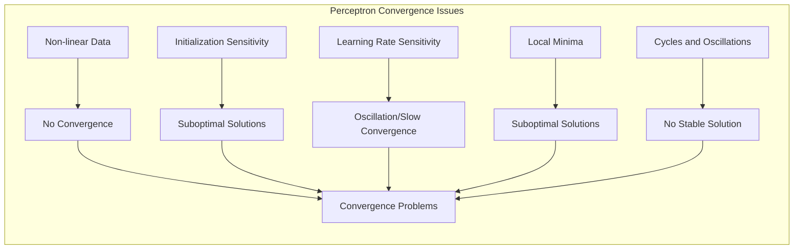
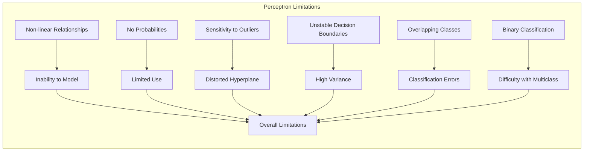
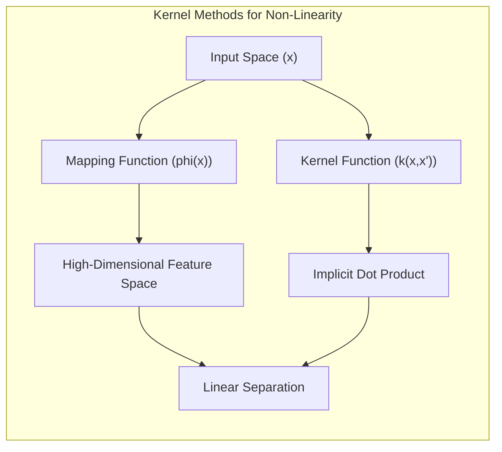
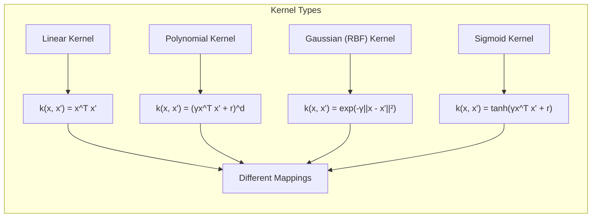
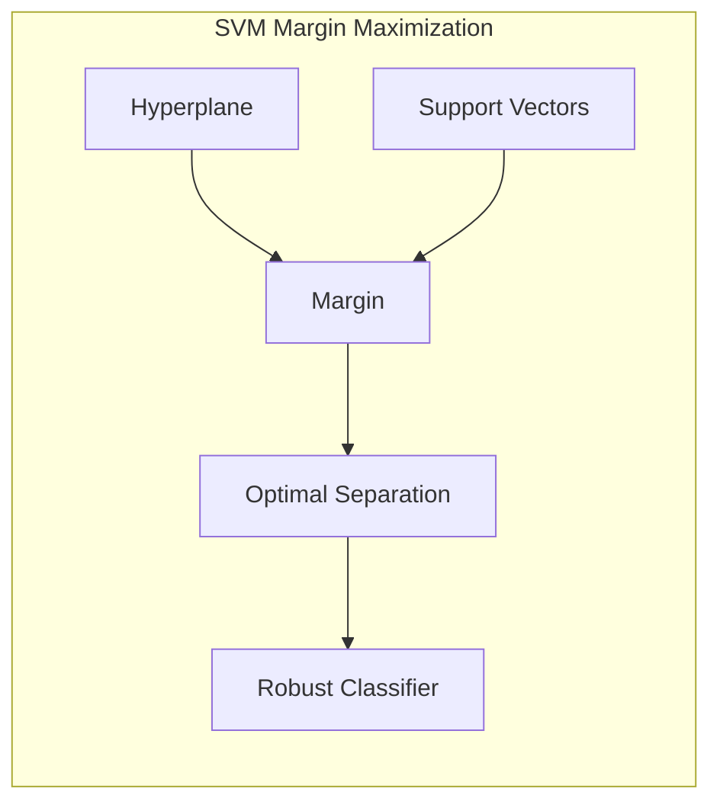
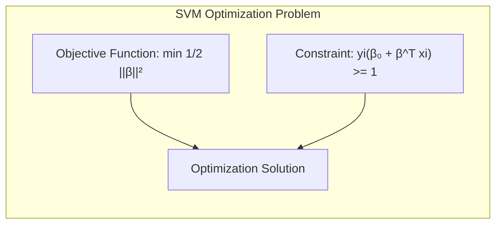
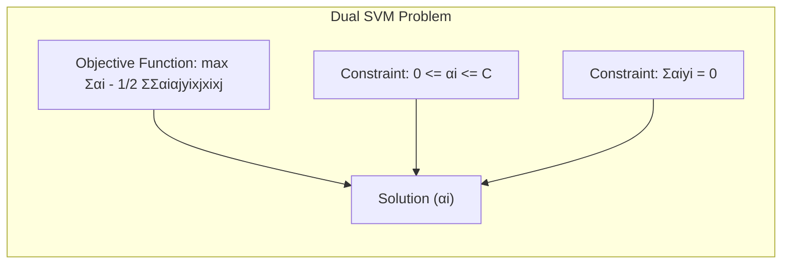

### Problemas de Convergência e uma Lista de Problemas Decorrentes do Algoritmo Perceptron



Apesar de sua importância histórica e de sua simplicidade, o algoritmo do **perceptron**, como visto em seções anteriores, apresenta alguns **problemas de convergência** e uma série de **limitações** que podem surgir em diversas situações [^4.5.1]. A compreensão desses problemas é fundamental para a escolha adequada de modelos de classificação e para o entendimento das limitações de algoritmos baseados em fronteiras lineares.

**Problemas de Convergência:**

1.  **Não Convergência em Dados Não Linearmente Separáveis:** O principal problema do algoritmo do perceptron é que ele não converge para uma solução quando os dados não são linearmente separáveis. Nesse caso, o algoritmo pode oscilar, ou apresentar ciclos no processo de aprendizado, sem atingir um hiperplano que separe as classes. A falta de convergência é uma limitação fundamental do perceptron, e exige a utilização de outros métodos mais sofisticados para lidar com dados não linearmente separáveis, como o uso de *kernels* ou redes neurais multicamadas.

    > 💡 **Exemplo Numérico:**
    > Considere um conjunto de dados 2D com duas classes, onde os pontos da classe 1 são $(1, 1), (2, 2)$ e os pontos da classe 2 são $(1, 2), (2, 1)$. Visualmente, esses pontos formam um padrão "X", que não pode ser separado por uma linha reta. Ao aplicar o algoritmo do perceptron, ele não conseguirá encontrar uma linha que separe as duas classes e oscilará continuamente, sem convergir para uma solução estável.
    >
    > ```python
    > import numpy as np
    > import matplotlib.pyplot as plt
    >
    > # Dados de exemplo
    > X = np.array([[1, 1], [2, 2], [1, 2], [2, 1]])
    > y = np.array([1, 1, -1, -1]) # 1 para classe 1, -1 para classe 2
    >
    > # Plot dos dados
    > plt.scatter(X[:2, 0], X[:2, 1], color='blue', label='Classe 1')
    > plt.scatter(X[2:, 0], X[2:, 1], color='red', label='Classe 2')
    > plt.xlabel('X1')
    > plt.ylabel('X2')
    > plt.title('Dados Não Linearmente Separáveis')
    > plt.legend()
    > plt.grid(True)
    > plt.show()
    > ```
    >
    > A visualização mostra claramente que nenhuma linha reta pode separar os pontos azuis dos vermelhos, ilustrando o problema de não convergência do perceptron.

2.  **Sensibilidade à Inicialização:** A solução para a qual o algoritmo converge, mesmo quando os dados são separáveis, depende da inicialização dos parâmetros $\beta_0$ e $\beta$. Diferentes inicializações podem levar a diferentes hiperplanos separadores, o que pode levar a uma não unicidade da solução e, em alguns casos, a soluções sub-ótimas. Alguns algoritmos de inicialização, como o uso de amostras aleatórias dos dados, podem ajudar a mitigar esse problema.

    > 💡 **Exemplo Numérico:**
    > Suponha um conjunto de dados linearmente separável. Se inicializarmos os parâmetros $\beta$ com um vetor próximo de zero, o algoritmo pode levar mais iterações para convergir. Se inicializarmos com um vetor muito grande, o algoritmo pode convergir rapidamente, mas para um hiperplano diferente.
    >
    > ```python
    > import numpy as np
    >
    > # Dados linearmente separáveis
    > X = np.array([[1, 1], [2, 1], [1, 2], [2, 3], [3, 2], [4, 3]])
    > y = np.array([1, 1, 1, -1, -1, -1])
    >
    > def perceptron(X, y, learning_rate, initial_beta, initial_beta0, max_iterations):
    >     beta = initial_beta
    >     beta0 = initial_beta0
    >     for _ in range(max_iterations):
    >         misclassified = False
    >         for i in range(len(X)):
    >             if y[i] * (np.dot(X[i], beta) + beta0) <= 0:
    >                 beta = beta + learning_rate * y[i] * X[i]
    >                 beta0 = beta0 + learning_rate * y[i]
    >                 misclassified = True
    >         if not misclassified:
    >             break
    >     return beta, beta0
    >
    > # Inicialização 1: beta proximo de zero
    > initial_beta1 = np.array([0.1, 0.1])
    > initial_beta0_1 = 0.1
    >
    > # Inicialização 2: beta aleatório
    > initial_beta2 = np.array([-0.5, 1.0])
    > initial_beta0_2 = -0.2
    >
    > learning_rate = 0.1
    > max_iterations = 1000
    >
    > beta1, beta0_1 = perceptron(X, y, learning_rate, initial_beta1, initial_beta0_1, max_iterations)
    > beta2, beta0_2 = perceptron(X, y, learning_rate, initial_beta2, initial_beta0_2, max_iterations)
    >
    > print(f"Inicialização 1 - Beta: {beta1}, Beta0: {beta0_1}")
    > print(f"Inicialização 2 - Beta: {beta2}, Beta0: {beta0_2}")
    > ```
    >
    > Este exemplo demonstra como diferentes inicializações podem levar a diferentes parâmetros $\beta$ e $\beta_0$, mesmo para dados separáveis.

3.  **Sensibilidade à Taxa de Aprendizagem:** A escolha adequada da taxa de aprendizagem $\rho$ é crucial para a convergência do perceptron. Uma taxa de aprendizagem muito alta pode levar a oscilações e à não convergência do algoritmo, enquanto uma taxa de aprendizagem muito baixa pode fazer com que o algoritmo demore muito para convergir ou que não alcance a solução ótima. A escolha da taxa de aprendizagem adequada é um *trade-off* entre velocidade de convergência e precisão da solução. Taxas de aprendizagem adaptativas, que ajustam o tamanho do passo durante a iteração, podem melhorar o resultado e a convergência do algoritmo.

    > 💡 **Exemplo Numérico:**
    > Com os mesmos dados do exemplo anterior, se usarmos uma taxa de aprendizagem $\rho = 1$, o algoritmo pode oscilar em torno da solução, enquanto com $\rho = 0.01$ ele pode demorar muito para convergir. Uma taxa de aprendizagem em torno de 0.1 geralmente produz um resultado equilibrado.
    >
    > ```python
    > import numpy as np
    > import matplotlib.pyplot as plt
    >
    > # Dados linearmente separáveis
    > X = np.array([[1, 1], [2, 1], [1, 2], [2, 3], [3, 2], [4, 3]])
    > y = np.array([1, 1, 1, -1, -1, -1])
    >
    > def perceptron_with_lr(X, y, learning_rate, initial_beta, initial_beta0, max_iterations):
    >     beta = initial_beta
    >     beta0 = initial_beta0
    >     iterations_taken = 0
    >     for _ in range(max_iterations):
    >         misclassified = False
    >         for i in range(len(X)):
    >             if y[i] * (np.dot(X[i], beta) + beta0) <= 0:
    >                 beta = beta + learning_rate * y[i] * X[i]
    >                 beta0 = beta0 + learning_rate * y[i]
    >                 misclassified = True
    >         iterations_taken += 1
    >         if not misclassified:
    >             break
    >     return beta, beta0, iterations_taken
    >
    > initial_beta = np.array([0.1, 0.1])
    > initial_beta0 = 0.1
    > max_iterations = 1000
    >
    > learning_rates = [0.01, 0.1, 1]
    >
    > for lr in learning_rates:
    >     beta, beta0, iterations = perceptron_with_lr(X, y, lr, initial_beta, initial_beta0, max_iterations)
    >     print(f"Taxa de Aprendizagem: {lr}, Iterações: {iterations}, Beta: {beta}, Beta0: {beta0}")
    >
    > ```
    >
    > Este exemplo mostra o impacto da taxa de aprendizagem no número de iterações necessárias para a convergência. Taxas de aprendizagem muito altas podem levar a oscilações e não convergência, enquanto taxas muito baixas levam a uma convergência mais lenta.

4.  **Mínimos Locais:** Em algumas situações, a função de custo do perceptron pode apresentar mínimos locais, e o algoritmo pode convergir para uma solução sub-ótima, especialmente em dados que são quase separáveis. A escolha da inicialização e de outros hiperparâmetros podem impactar o resultado do algoritmo, com a possibilidade de convergência para um mínimo local.

    > 💡 **Exemplo Numérico:**
    > Embora o perceptron comumente não sofra de mínimos locais em problemas linearmente separáveis, em casos de dados quase separáveis, o algoritmo pode convergir para uma solução que não separa totalmente as classes, representando um mínimo local.
    >
    > É difícil demonstrar um mínimo local com o perceptron simples diretamente pois ele não tem uma função de perda "suave" para criar mínimos locais. No entanto, variações mais sofisticadas do algoritmo podem apresentar esse problema.

5.  **Ciclos e Oscilações:** Quando os dados não são linearmente separáveis, o algoritmo do perceptron pode apresentar ciclos e oscilações no processo de atualização dos parâmetros, sem nunca atingir uma solução estável. Essa oscilação ocorre devido ao fato de que o perceptron é incapaz de encontrar um hiperplano que separe todos os dados, e com isso, ele continuará ajustando os parâmetros até que se atinja o limite de iterações.

    > 💡 **Exemplo Numérico:**
    > Reutilizando o exemplo de dados não linearmente separáveis, o algoritmo do perceptron irá oscilar sem convergir. O valor dos parâmetros $\beta$ e $\beta_0$ irá mudar a cada iteração, sem estabilizar em um valor específico.
    >
    > ```python
    > import numpy as np
    >
    > # Dados não linearmente separáveis (como no exemplo 1)
    > X = np.array([[1, 1], [2, 2], [1, 2], [2, 1]])
    > y = np.array([1, 1, -1, -1])
    >
    > def perceptron_with_history(X, y, learning_rate, initial_beta, initial_beta0, max_iterations):
    >     beta = initial_beta
    >     beta0 = initial_beta0
    >     beta_history = []
    >     beta0_history = []
    >     for _ in range(max_iterations):
    >         misclassified = False
    >         for i in range(len(X)):
    >             if y[i] * (np.dot(X[i], beta) + beta0) <= 0:
    >                 beta = beta + learning_rate * y[i] * X[i]
    >                 beta0 = beta0 + learning_rate * y[i]
    >                 misclassified = True
    >         beta_history.append(beta.copy())
    >         beta0_history.append(beta0)
    >         if not misclassified:
    >             break
    >     return beta_history, beta0_history
    >
    > learning_rate = 0.1
    > initial_beta = np.array([0.1, 0.1])
    > initial_beta0 = 0.1
    > max_iterations = 20
    >
    > beta_history, beta0_history = perceptron_with_history(X, y, learning_rate, initial_beta, initial_beta0, max_iterations)
    >
    > print("Histórico de Beta:")
    > for i, beta in enumerate(beta_history):
    >     print(f"Iteração {i+1}: {beta}, Beta0: {beta0_history[i]}")
    > ```
    >
    > Este exemplo mostra como os valores de $\beta$ e $\beta_0$ oscilam ao longo das iterações, sem convergir para valores estáveis.

**Lista de Problemas Decorrentes do Algoritmo Perceptron:**


Além dos problemas de convergência, o algoritmo do perceptron apresenta outras limitações que o tornam menos adequado para diversas aplicações:

1.  **Incapacidade de Modelar Relações Não Lineares:** O perceptron só consegue modelar fronteiras de decisão lineares, e é incapaz de capturar relações não lineares complexas nos dados. Em muitos problemas reais, as fronteiras de decisão são não lineares, o que limita a aplicabilidade do perceptron.

2.  **Não Fornece Probabilidades:** O perceptron não fornece estimativas de probabilidades posteriores, apenas uma classificação binária, o que dificulta o uso do algoritmo em problemas que requerem estimativas de confiança e para problemas onde as probabilidades são importantes na tomada de decisão.

3.  **Sensibilidade a Outliers:** O perceptron é sensível a *outliers*, o que pode distorcer o hiperplano separador e levar a um mau desempenho do modelo. A presença de *outliers* pode dificultar a convergência e influenciar negativamente o modelo final, e faz com que o modelo possa ser muito dependente de alguns poucos pontos de treino.

    > 💡 **Exemplo Numérico:**
    > Considere um conjunto de dados linearmente separável, mas com um *outlier* na classe errada. O perceptron tentará ajustar a fronteira para classificar corretamente o *outlier*, o que pode levar a uma fronteira de decisão inadequada para a maioria dos pontos.
    >
    > ```python
    > import numpy as np
    > import matplotlib.pyplot as plt
    >
    > # Dados linearmente separáveis com um outlier
    > X = np.array([[1, 1], [2, 1], [1, 2], [2, 3], [3, 2], [4, 3], [1, 4]])
    > y = np.array([1, 1, 1, -1, -1, -1, -1])  # Outlier na última posição
    >
    > # Perceptron sem tratamento de outlier
    > def perceptron(X, y, learning_rate, initial_beta, initial_beta0, max_iterations):
    >     beta = initial_beta
    >     beta0 = initial_beta0
    >     for _ in range(max_iterations):
    >         misclassified = False
    >         for i in range(len(X)):
    >             if y[i] * (np.dot(X[i], beta) + beta0) <= 0:
    >                 beta = beta + learning_rate * y[i] * X[i]
    >                 beta0 = beta0 + learning_rate * y[i]
    >                 misclassified = True
    >         if not misclassified:
    >             break
    >     return beta, beta0
    >
    > initial_beta = np.array([0.1, 0.1])
    > initial_beta0 = 0.1
    > learning_rate = 0.1
    > max_iterations = 1000
    >
    > beta, beta0 = perceptron(X, y, learning_rate, initial_beta, initial_beta0, max_iterations)
    >
    > # Plot dos dados e da fronteira de decisão
    > plt.figure(figsize=(8, 6))
    > plt.scatter(X[:3, 0], X[:3, 1], color='blue', label='Classe 1')
    > plt.scatter(X[3:6, 0], X[3:6, 1], color='red', label='Classe 2')
    > plt.scatter(X[6, 0], X[6, 1], color='purple', marker='x', s=100, label='Outlier')
    >
    > x_values = np.linspace(0, 5, 100)
    > y_values = (-beta[0] * x_values - beta0) / beta[1]
    > plt.plot(x_values, y_values, color='black', label='Fronteira de Decisão')
    >
    > plt.xlabel('X1')
    > plt.ylabel('X2')
    > plt.title('Perceptron e Outlier')
    > plt.legend()
    > plt.grid(True)
    > plt.show()
    >
    > print(f"Beta: {beta}, Beta0: {beta0}")
    > ```
    >
    > A visualização mostra como o *outlier* (cruz roxa) desloca a fronteira de decisão, demonstrando a sensibilidade do perceptron a esses pontos.

4.  **Fronteiras de Decisão Instáveis:** As soluções do perceptron, especialmente quando os dados são quase separáveis, são instáveis, o que significa que pequenas alterações nos dados de treinamento podem levar a grandes mudanças no hiperplano separador.

5.  **Dificuldade com *Overlapping* de Classes:** Quando as classes se sobrepõem no espaço de entrada, o perceptron pode não encontrar uma solução satisfatória e apresentar erros de classificação. Modelos mais sofisticados, que consideram o conceito de margem e permitem o *overlapping* das classes, podem ser mais adequados para esses casos.

6.  **Problemas com Multiclasse:** O algoritmo do perceptron, na sua forma original, é adequado apenas para problemas de classificação binária. A aplicação do perceptron em problemas de classificação com múltiplas classes exige estratégias de generalização, como a abordagem *one-vs-all* ou a construção de um perceptron por par de classes.

A compreensão dessas limitações e problemas é crucial para entender a necessidade de modelos mais sofisticados como as redes neurais e modelos baseados em margem.

**Lemma 48:** *O algoritmo do perceptron não converge quando os dados de treinamento não são linearmente separáveis, e apresenta sensibilidade à inicialização dos parâmetros e à taxa de aprendizagem*.

*Prova:* A convergência do perceptron depende da separabilidade linear e de outros fatores que podem afetar a trajetória do algoritmo, como a inicialização e o valor da taxa de aprendizagem.  $\blacksquare$

**Corolário 48:** *As limitações do perceptron em termos de não linearidade, sensibilidade a outliers e incapacidade de fornecer probabilidades para a decisão indicam a necessidade de métodos mais sofisticados para lidar com dados complexos.*

*Prova:* A necessidade de modelos mais sofisticados é imposta pelos limites teóricos e práticos do algoritmo do perceptron, que é, em essência, um classificador linear. $\blacksquare$

A compreensão dos problemas de convergência e outras limitações do algoritmo do perceptron é essencial para o desenvolvimento de modelos de aprendizado de máquina mais robustos e flexíveis.

### Alternativas ao Perceptron e o Uso de Métodos Kernel



As limitações do algoritmo do **perceptron** em lidar com dados não linearmente separáveis podem ser superadas utilizando **métodos *kernel*** [^4.5.2]. Os *kernels* oferecem uma forma de mapear os dados de entrada para um espaço de alta dimensionalidade, onde a separação linear pode se tornar possível, mantendo a simplicidade do algoritmo do perceptron. Os **métodos *kernel*** generalizam o conceito de hiperplano separador do perceptron para fronteiras de decisão não lineares.

**O *Kernel Trick*:**

A ideia central dos métodos *kernel* é utilizar uma função *kernel* $k(x,x')$ que calcula o produto interno entre os vetores transformados $\phi(x)$ e $\phi(x')$ no espaço de alta dimensionalidade sem que seja necessário calcular explicitamente a transformação $\phi$:

$$
    k(x, x') = \phi(x)^T \phi(x')
$$

Esse truque é conhecido como "*kernel trick*", e permite que modelos lineares possam ser aplicados a dados que apresentam uma estrutura não linear, sem aumentar significativamente o custo computacional.

O *kernel trick* é utilizado de forma a realizar as operações do perceptron no espaço de maior dimensionalidade. As atualizações dos parâmetros podem ser escritas em termos do produto interno dos vetores no espaço de entrada, sem que a transformação seja calculada de forma explícita.

**Tipos de *Kernels*:**

Existem vários tipos de funções *kernel* que podem ser utilizadas para mapear os dados de entrada para um espaço de maior dimensionalidade:

1.  ***Kernel* Linear:** $k(x,x') = x^T x'$. Este *kernel* corresponde ao produto interno usual e representa um caso particular sem transformação.

2.  ***Kernel* Polinomial:** $k(x, x') = (\gamma x^T x' + r)^d$, onde $\gamma$, $r$ e $d$ são parâmetros do *kernel*. Este *kernel* mapeia os dados para um espaço de maior dimensão, através de produtos e polinômios dos preditores originais.

    > 💡 **Exemplo Numérico:**
    > Considere dois pontos $x = [1, 2]$ e $x' = [2, 1]$ com um *kernel* polinomial de grau 2, com $\gamma = 1$ e $r = 0$.
    >
    > $k(x, x') = (1 \cdot x^T x' + 0)^2 = (1 \cdot ([1, 2] \cdot [2, 1]) + 0)^2 = (1 \cdot (1*2 + 2*1))^2 = (1 \cdot 4)^2 = 16$.
    >
    > Este cálculo mostra como o *kernel* polinomial transforma o produto interno dos pontos em um valor.

3.  ***Kernel* Gaussiano (RBF):** $k(x, x') = \exp(-\gamma ||x - x'||^2)$, onde $\gamma$ é o parâmetro do *kernel*. Este *kernel* cria um espaço de alta dimensão, e permite modelar relações não lineares complexas entre as variáveis.

    > 💡 **Exemplo Numérico:**
    > Usando os mesmos pontos $x = [1, 2]$ e $x' = [2, 1]$ e um *kernel* Gaussiano com $\gamma = 0.5$.
    >
    > $k(x, x') = \exp(-0.5 \cdot ||x - x'||^2) = \exp(-0.5 \cdot ||[1, 2] - [2, 1]||^2) = \exp(-0.5 \cdot ||[-1, 1]||^2) = \exp(-0.5 \cdot ((-1)^2 + 1^2)) = \exp(-0.5 \cdot 2) = \exp(-1) \approx 0.368$.
    >
    > O *kernel* Gaussiano mapeia a similaridade entre os pontos para um valor entre 0 e 1.

4.  ***Kernel* Sigmoide:** $k(x, x') = \tanh(\gamma x^T x' + r)$, onde $\gamma$ e $r$ são parâmetros do *kernel*.



A escolha do *kernel* adequado e de seus parâmetros tem um impacto significativo na capacidade do modelo de modelar fronteiras de decisão complexas.

**Perceptron com *Kernel***:

O algoritmo do *kernel perceptron* funciona de forma similar ao perceptron clássico, mas utiliza o *kernel trick* para computar o produto interno dos vetores transformados no espaço de alta dimensionalidade, sem calcular a transformação explicitamente. O algoritmo do *kernel perceptron* itera sobre os dados, e os parâmetros (neste caso, os coeficientes dos vetores de suporte) são atualizados com base nas observações mal classificadas no espaço transformado.

Os métodos *kernel*, portanto, oferecem uma forma de lidar com problemas de não separabilidade em modelos lineares, mantendo a simplicidade e a eficiência do algoritmo do perceptron e, com isso, expandem a capacidade de modelos lineares.

**Lemma 48:** *Os métodos *kernel* permitem que o algoritmo perceptron, e outros métodos lineares, operem implicitamente em um espaço de alta dimensionalidade por meio do *kernel trick*, que evita o cálculo explícito da transformação, e com isso permitem lidar com problemas de classificação não lineares*.

*Prova:* Os métodos *kernel* transformam os dados em um espaço de alta dimensão, onde a separação linear torna-se mais fácil.  $\blacksquare$

**Corolário 48:** *A escolha do *kernel* adequado e de seus parâmetros tem um impacto crucial na capacidade do modelo de modelar fronteiras de decisão não lineares e na capacidade de generalização do modelo.*

*Prova:* A escolha do *kernel* influencia a forma do espaço transformado e a capacidade de separação entre as classes.  $\blacksquare$

Os métodos *kernel* são uma ferramenta poderosa para a construção de modelos de classificação não lineares com base em algoritmos lineares como o perceptron.

### Máquinas de Vetores de Suporte e a Maximização da Margem



As **Máquinas de Vetores de Suporte (SVM)** são uma classe de modelos de classificação baseados na ideia de encontrar um **hiperplano separador** que maximize a **margem** entre as classes. O conceito de margem, já discutido em seções anteriores, representa a distância mínima entre o hiperplano separador e os pontos de treinamento mais próximos, que são conhecidos como **vetores de suporte** [^4.5.2].

O objetivo do SVM é, portanto, encontrar um hiperplano que não apenas separe as classes, mas que também maximize a sua distância para as observações mais próximas. Essa abordagem leva a modelos com maior robustez e com melhor capacidade de generalização.

**Formulação do SVM:**

O problema de otimização do SVM pode ser formulado como:

$$
    \min_{\beta, \beta_0} \frac{1}{2} ||\beta||^2
$$
sujeito a:
$$
    y_i (\beta_0 + \beta^T x_i) \geq 1, \text{ para } i = 1,\ldots,N
$$
onde $y_i$ é o rótulo da classe da observação $i$, $\beta$ e $\beta_0$ são os parâmetros do hiperplano, e $||.||$ é a norma euclidiana do vetor. As restrições garantem que todas as observações estejam corretamente classificadas e a uma distância mínima de 1 da fronteira de decisão.



Esse problema de otimização pode ser resolvido usando a teoria da dualidade de Wolfe e os multiplicadores de Lagrange, levando a um problema dual, o que permite obter soluções para problemas de alta dimensionalidade. O problema dual do SVM é:

$$
    \max_{\alpha} \sum_{i=1}^N \alpha_i - \frac{1}{2} \sum_{i=1}^N \sum_{j=1}^N \alpha_i \alpha_j y_i y_j x_i^T x_j
$$
sujeito a:
$$
    0 \leq \alpha_i \leq C, \text{ para } i = 1,\ldots,N
$$
$$
    \sum_{i=1}^N \alpha_i y_i = 0
$$
onde $\alpha_i$ são os multiplicadores de Lagrange, e $C$ é um parâmetro de regularização que controla a permissão para erros de classificação (em casos onde os dados não são separáveis). A solução é obtida através de métodos de otimização que procuram os melhores valores de $\alpha_i$.



Os vetores de suporte são as observações para as quais $\alpha_i \neq 0$. Ou seja, a solução para o hiperplano separador é definida em termos de uma combinação linear dos vetores de suporte.

    > 💡 **Exemplo Numérico:**
    > Considere um conjunto de dados simples com 3 pontos da classe 1: $x_1 = [1, 1], x_2 = [2, 1], x_3 = [1, 2]$ e 3 pontos da classe -1: $x_4 = [3, 3], x_5 = [4, 2], x_6 = [4, 4]$.
    >
    > Visualmente, pode-se notar que os pontos $x_3$ e $x_4$ são os vetores de suporte.
    >
    > Ao resolver o problema dual do SVM, os multiplicadores de Lagrange $\alpha_i$ para $x_3$ e $x_4$ serão maiores que zero, indicando que estes são os vetores de suporte. Os outros $\alpha_i$ serão zero, pois os pontos correspondentes não são vetores de suporte.
    >
    > A solução é uma combinação linear dos vetores de suporte, e define o hiperplano que maximiza a margem entre as duas classes.
    >
    > ```python
    > import numpy as np
    > from sklearn.svm import SVC
    > import matplotlib.pyplot as plt
    >
    > # Dados de exemplo
    > X = np.array([[1, 1], [2, 1], [1, 2], [3, 3], [4, 2], [4, 4]])
    > y = np.array([1, 1, 1, -1, -1, -1])
    >
    > # Treinar o modelo SVM
    > svm = SVC(kernel='linear', C=100)  # C grande para forçar a margem
    > svm.fit(X, y)
    >
    > # Obter os vetores de suporte
    > support_vectors = svm.support_vectors_
    >
    > # Plot dos dados e dos vetores de suporte
    > plt.figure(figsize=(8, 6))
    > plt.scatter(X[:3, 0], X[:3, 1], color='blue', label='Classe 1')
    > plt.scatter(X[3:, 0], X[3:, 1], color='red', label='Classe -1')
    > plt.scatter(support_vectors[:, 0], support_vectors[:, 1], color='green', marker='o', s=150, edgecolors='black', label='Vetores de Suporte')
    >
    > # Criar o grid para plotar a fronteira de decisão
    > x_min, x_max = X[:, 0].min() - 1, X[:, 0].max() + 1
    > y_min, y_max = X[:, 1].min() - 1, X[:, 1].max() + 1
    > xx, yy = np.meshgrid(np.arange(x_min, x_max, 0.02), np.arange(y_min, y_max, 0.02))
    > Z = svm.decision_function(np.c_[xx.ravel(), yy.ravel()])
    > Z = Z.reshape(xx.shape)
    > plt.contour(xx, yy, Z, colors=['black', 'black', 'black'], linestyles=['--', '-', '--'], levels=[-1, 0, 1])
    >
    > plt.xlabel('X1')
    > plt.ylabel('X2')
    > plt.title('SVM