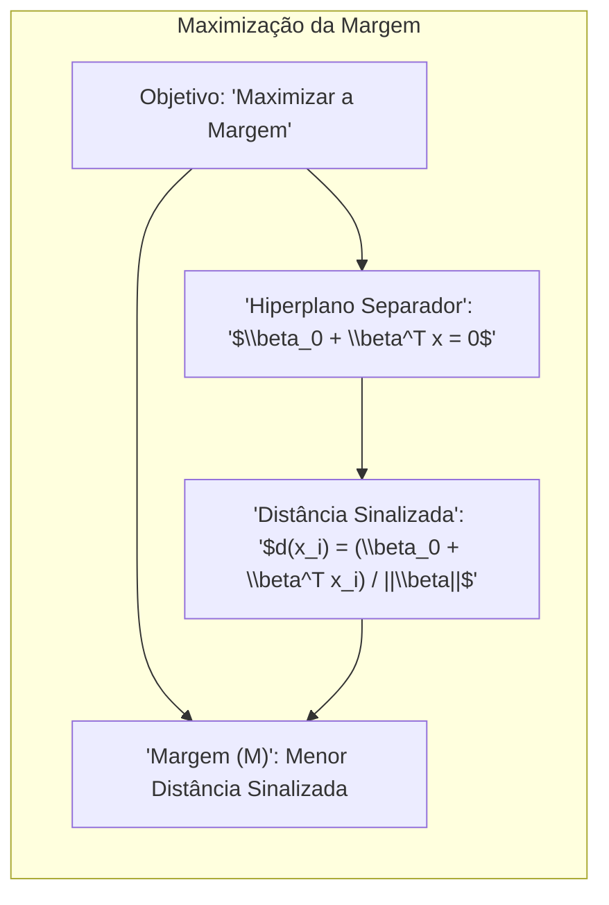
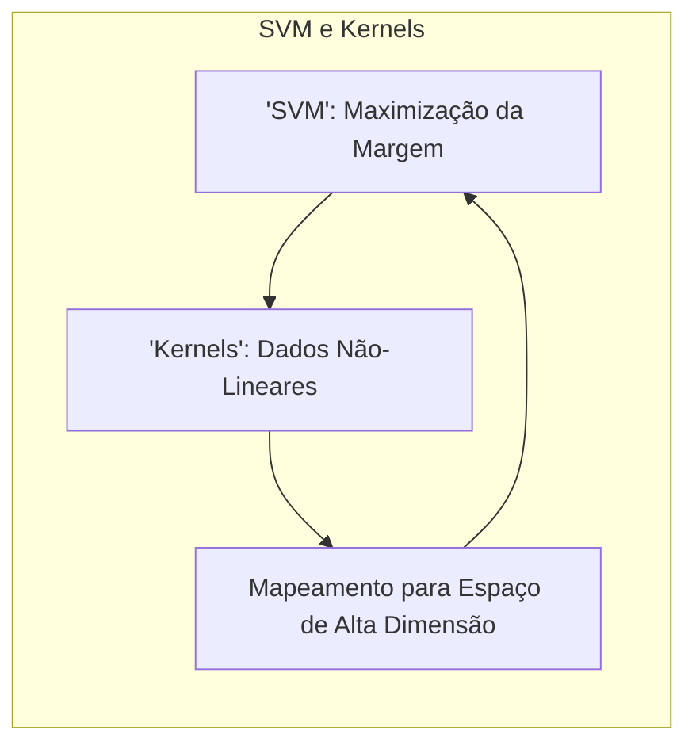
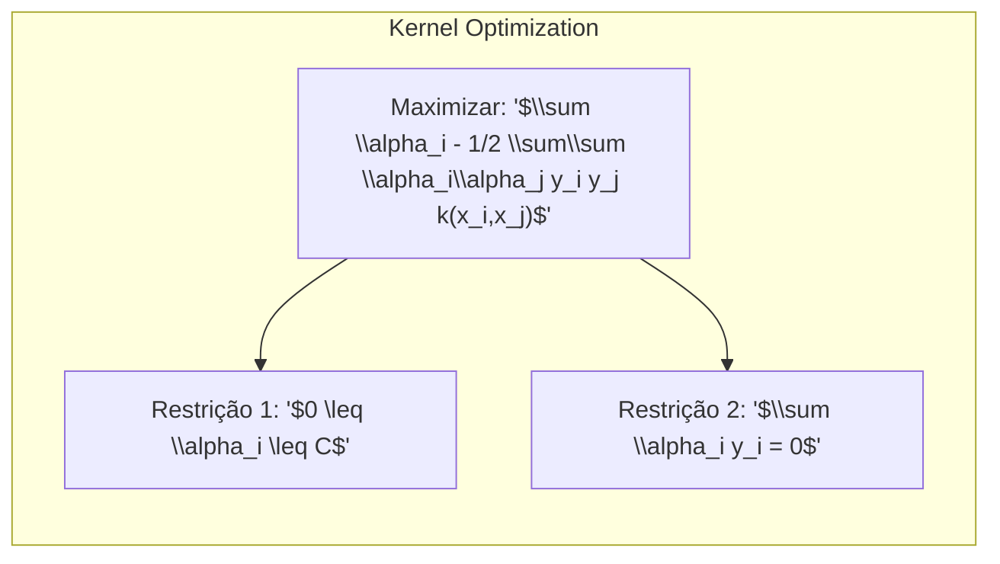

### O Problema de Otimização para Maximização da Margem entre Classes Usando a Estratégia da Distância Sinalizada Máxima



O problema de otimização para a **maximização da margem entre classes** utilizando a estratégia da **distância sinalizada máxima** é um conceito central na construção de modelos de classificação linear robustos, e está na base das **Máquinas de Vetores de Suporte (SVM)** [^4.5.2]. Ao contrário de simplesmente buscar um hiperplano que separe as classes, essa estratégia busca encontrar o hiperplano que maximize a distância mínima entre as classes, o que leva a uma maior capacidade de generalização e melhor desempenho em dados não vistos.

**Formulação do Problema de Otimização:**

O problema de otimização para a maximização da margem pode ser formulado da seguinte forma:

1.  **Definição do Hiperplano:** Inicialmente, definimos um hiperplano separador como:

    $$
        \beta_0 + \beta^T x = 0
    $$

    onde $\beta$ é o vetor normal ao hiperplano e $\beta_0$ é o *bias*.

2.  **Distância Sinalizada:** A distância sinalizada de um ponto $x_i$ até o hiperplano é dada por:

    $$
        d(x_i) = \frac{\beta_0 + \beta^T x_i}{||\beta||}
    $$

    onde $||\beta||$ é a norma euclidiana do vetor $\beta$. O sinal dessa distância indica o lado do hiperplano em que o ponto está localizado.

    > 💡 **Exemplo Numérico:**
    > Vamos considerar um hiperplano definido por $\beta = [2, 1]$ e $\beta_0 = -3$. Temos dois pontos: $x_1 = [1, 1]$ e $x_2 = [2, 2]$.
    >
    > *   **Cálculo da distância sinalizada para $x_1$:**
    >     *   $\beta^T x_1 = (2 * 1) + (1 * 1) = 3$
    >     *   $\beta_0 + \beta^T x_1 = -3 + 3 = 0$
    >     *   $||\beta|| = \sqrt{2^2 + 1^2} = \sqrt{5}$
    >     *   $d(x_1) = \frac{0}{\sqrt{5}} = 0$
    >
    > *   **Cálculo da distância sinalizada para $x_2$:**
    >     *   $\beta^T x_2 = (2 * 2) + (1 * 2) = 6$
    >     *   $\beta_0 + \beta^T x_2 = -3 + 6 = 3$
    >     *   $d(x_2) = \frac{3}{\sqrt{5}} \approx 1.34$
    >
    > O ponto $x_1$ está exatamente no hiperplano ($d(x_1) = 0$), enquanto $x_2$ está a uma distância de aproximadamente 1.34 e do lado positivo do hiperplano.

3.  **Definição da Margem:** A margem $M$ é definida como a menor distância sinalizada entre as observações e o hiperplano. O objetivo do problema de otimização é encontrar o hiperplano que maximize o valor de $M$.

4.  **Formulação da Maximização da Margem:** O problema de otimização pode ser formulado da seguinte forma:

    $$
        \max_{\beta,\beta_0} M
    $$

    sujeito a:

    $$
        y_i (\beta_0 + \beta^T x_i) \geq M ||\beta|| \text{ para todo } i = 1,...,N
    $$

    onde $y_i$ é o rótulo da classe (1 ou -1) e $N$ é o número de observações. A condição acima garante que todos os pontos estejam classificados corretamente, e com uma distância de pelo menos $M$ em relação ao hiperplano.

5.  **Reformulação da Maximização:** Para tornar o problema mais fácil de ser resolvido, a restrição de norma e a maximização podem ser transformadas em:

    ```mermaid
    graph LR
        subgraph "Reformulação do Problema"
            direction TB
            A["Minimizar: '1/2 ||$\\beta||²'"]
            B["Restrição: '$y_i(\\beta_0 + \\beta^T x_i) \geq 1$'"]
            A --> B
        end
    ```

    $$
        \min_{\beta, \beta_0} \frac{1}{2} ||\beta||^2
    $$
    sujeito a:

        $$
        y_i (\beta_0 + \beta^T x_i) \geq 1, \text{ para todo } i = 1,...,N
        $$
    Essa formulação é equivalente ao problema original, e agora é um problema de otimização convexa com restrições de desigualdade. Note que $M = \frac{1}{||\beta||}$.

    > 💡 **Exemplo Numérico:**
    > Suponha que temos dois pontos, um de cada classe: $x_1 = [1, 1]$, $y_1 = 1$ e $x_2 = [2, -1]$, $y_2 = -1$. Queremos encontrar o hiperplano que maximize a margem. A restrição original seria:
    >
    > $1 * (\beta_0 + \beta^T x_1) \geq M ||\beta||$
    > $-1 * (\beta_0 + \beta^T x_2) \geq M ||\beta||$
    >
    > Após a reformulação, temos:
    >
    > $y_1(\beta_0 + \beta^T x_1) \geq 1$
    > $y_2(\beta_0 + \beta^T x_2) \geq 1$
    >
    >  Ou seja:
    >
    > $\beta_0 + \beta_1 + \beta_2 \geq 1$
    > $-\beta_0 - 2\beta_1 + \beta_2 \geq 1$
    >
    >  O objetivo é minimizar $\frac{1}{2} ||\beta||^2 = \frac{1}{2}(\beta_1^2 + \beta_2^2)$, sujeito às restrições acima. A solução deste problema de otimização nos dará o hiperplano que maximiza a margem.
    >
    >  O valor de $\beta$ resultante da otimização será tal que os pontos de ambas as classes estarão o mais distante possível do hiperplano, maximizando a margem.

O objetivo desse problema de otimização é encontrar o hiperplano que maximize a margem, ou seja, a distância mínima entre as classes, garantindo que todas as observações sejam classificadas corretamente.

**Resolução do Problema de Otimização:**

O problema de otimização apresentado acima pode ser resolvido usando o método dos multiplicadores de Lagrange e a teoria da dualidade de Wolfe, que levam a uma formulação dual do problema. A solução do problema dual permite encontrar os parâmetros do hiperplano em termos de vetores de suporte, que são as observações que estão mais próximas do hiperplano.

Em resumo, a estratégia de maximização da margem com base na distância sinalizada máxima procura uma fronteira de decisão que seja robusta, pois tenta aumentar a separação entre as classes, e também eficiente, por meio da formulação em termos de um problema de otimização convexa.

**Lemma 50:** *O problema de otimização da maximização da margem, utilizando a distância sinalizada, busca encontrar o hiperplano que separe as classes e maximize a distância mínima entre as observações e o hiperplano.*

*Prova:* A formulação do problema busca o hiperplano que maximize a margem por meio de restrições de desigualdade que definem uma separação mínima.  $\blacksquare$

**Corolário 50:** *A reformulação do problema de maximização da margem em um problema de minimização do quadrado da norma do vetor de parâmetros, com restrições de desigualdade, leva a um problema de otimização convexa que pode ser resolvido por métodos padrão.*

*Prova:* O problema transformado é mais fácil de resolver por meio de multiplicadores de Lagrange e métodos de otimização convexa. $\blacksquare$

A maximização da margem utilizando a distância sinalizada máxima é um conceito fundamental na construção de modelos de classificação lineares robustos e com boa capacidade de generalização.

### Relação com as Máquinas de Vetores de Suporte (SVM) e a Utilização de Kernels



As **Máquinas de Vetores de Suporte (SVM)** são uma classe de modelos de aprendizado de máquina que utilizam o princípio da **maximização da margem** para encontrar hiperplanos separadores ótimos, e também utilizam **métodos *kernel*** para lidar com dados que não são linearmente separáveis. O SVM, por meio da combinação da maximização da margem com a flexibilidade dos *kernels*, é um método poderoso e versátil para problemas de classificação.

**A Maximização da Margem no SVM:**

O objetivo do SVM, como discutido na seção anterior, é encontrar um hiperplano que separe as classes com a maior margem possível [^4.5.2]. A margem é definida como a menor distância entre o hiperplano e as observações mais próximas, que são chamadas de vetores de suporte.

O SVM pode ser formulado como um problema de otimização convexa com restrições de desigualdade:

$$
    \min_{\beta, \beta_0} \frac{1}{2} ||\beta||^2
$$
sujeito a:
$$
    y_i (\beta_0 + \beta^T x_i) \geq 1, \text{ para } i = 1,...,N
$$
onde $y_i$ é o rótulo da classe da observação $i$, $\beta$ e $\beta_0$ são os parâmetros do hiperplano, e $||.||$ é a norma euclidiana do vetor.

A solução desse problema de otimização leva a um hiperplano separador que maximiza a margem, e os pontos de treinamento que se encontram sobre a margem (ou seja, para os quais a restrição é satisfeita com igualdade) são chamados de vetores de suporte. A solução final é definida em termos de vetores de suporte.

**O *Kernel Trick* em SVM:**

Uma das características mais importantes do SVM é a capacidade de lidar com dados não linearmente separáveis por meio do uso de funções *kernel*. O *kernel trick* permite mapear os dados para um espaço de alta dimensionalidade, onde a separação linear pode ser possível. O problema de otimização do SVM utilizando o *kernel trick* é dado por:


$$
    \max_{\alpha} \sum_{i=1}^N \alpha_i - \frac{1}{2} \sum_{i=1}^N \sum_{j=1}^N \alpha_i \alpha_j y_i y_j k(x_i, x_j)
$$

sujeito a:
$$
    0 \leq \alpha_i \leq C, \text{ para } i = 1,...,N
$$
$$
    \sum_{i=1}^N \alpha_i y_i = 0
$$

onde $k(x_i, x_j)$ é a função *kernel* que computa o produto interno no espaço transformado, e $\alpha_i$ são os multiplicadores de Lagrange. O parâmetro $C$ controla a penalidade por erros de classificação.

> 💡 **Exemplo Numérico:**
    > Suponha que temos dois pontos de cada classe, que não são linearmente separáveis no espaço original: $x_1 = [1, 1]$, $y_1 = 1$, $x_2 = [2, 2]$, $y_2 = 1$, $x_3 = [1, 2]$, $y_3 = -1$, $x_4 = [2, 1]$, $y_4 = -1$. Um kernel polinomial de grau 2 poderia ser usado para mapear esses pontos para um espaço de dimensão superior. Por exemplo, o kernel poderia ser $k(x_i, x_j) = (x_i^T x_j + 1)^2$.
    >
    > Calculando $k(x_1, x_1) = (1*1 + 1*1 + 1)^2 = 9$, $k(x_1, x_2) = (1*2 + 1*2 + 1)^2 = 25$, e assim por diante, podemos construir a matriz do kernel. A solução do problema de otimização com a matriz do kernel nos dará os multiplicadores de Lagrange $\alpha_i$, e os vetores de suporte serão aqueles com $\alpha_i > 0$.
    >
    > Por exemplo, se após resolver o problema de otimização, obtivermos $\alpha = [0.2, 0, 0.5, 0.3]$, então $x_1, x_3, x_4$ seriam os vetores de suporte. A decisão final do SVM será baseada nesses vetores de suporte, usando o kernel para calcular a classificação de novos pontos.

Por meio do *kernel trick*, a formulação do SVM pode ser utilizada para obter fronteiras de decisão não lineares sem que seja necessário calcular explicitamente a transformação de mapeamento. O *kernel* permite operar no espaço de entrada original, mas de uma forma que equivale a trabalhar em um espaço de maior dimensão.

**SVM e o Hiperplano Ótimo:**

O SVM, ao maximizar a margem e utilizar o *kernel trick*, busca um hiperplano separador que seja ótimo em termos de capacidade de generalização. Os vetores de suporte definem o hiperplano, e a margem maximizada reduz o risco de *overfitting*, o que melhora o desempenho do modelo em dados não vistos.

O SVM é uma técnica poderosa e flexível que combina as ideias de maximização da margem e de *kernels* para resolver problemas de classificação linear e não linear.

**Lemma 51:** *As Máquinas de Vetores de Suporte (SVM) se baseiam no princípio da maximização da margem entre as classes para encontrar um hiperplano separador que seja mais robusto e generalizável.*

*Prova:* A formulação do SVM busca a maximização da margem entre classes, que se relaciona com uma melhor generalização para dados não vistos.  $\blacksquare$

**Corolário 51:** *A combinação da maximização da margem com o uso do *kernel trick* permite que o SVM lide com problemas de classificação não linear, mapeando os dados para um espaço de alta dimensão e obtendo fronteiras de decisão não lineares.*

*Prova:* O *kernel trick* transforma o problema em um equivalente em um espaço de maior dimensão onde a separação linear é mais fácil de ser encontrada.  $\blacksquare$

O SVM é um modelo poderoso para problemas de classificação, devido à sua capacidade de maximizar a margem e lidar com não linearidade por meio de métodos *kernel*.

### Conclusão

Este capítulo explorou o problema de otimização para maximizar a margem entre classes usando a estratégia de distância sinalizada máxima. Foi discutida a relação entre o conceito de margem e o SVM, e como os *kernels* podem ser usados para estender modelos lineares para problemas não lineares. A compreensão desses conceitos é fundamental para a construção de modelos de classificação linear robustos e para a utilização de modelos complexos como o SVM.

### Footnotes

[^4.1]: "In this chapter we revisit the classification problem and focus on linear methods for classification. Since our predictor G(x) takes values in a discrete set G, we can always divide the input space into a collection of regions labeled according to the classification. We saw in Chapter 2 that the boundaries of these regions can be rough or smooth, depending on the prediction function. For an important class of procedures, these decision boundaries are linear; this is what we will mean by linear methods for classification." *(Trecho de "The Elements of Statistical Learning")*

[^4.3]: "Linear discriminant analysis (LDA) arises in the special case when we assume that the classes have a common covariance matrix Σk = ∑. In comparing two classes k and l, it is sufficient to look at the log-ratio, and we see that" *(Trecho de "The Elements of Statistical Learning")*

[^4.4]: "The logistic regression model arises from the desire to model the posterior probabilities of the K classes via linear functions in x, while at the same time ensuring that they sum to one and remain in [0,1]." *(Trecho de "The Elements of Statistical Learning")*

[^4.5]: "In this situation the features are high-dimensional and correlated, and the LDA coefficients can be regularized to be smooth or sparse in the original domain of the signal. This leads to better generalization and allows for easier interpretation of the coefficients." *(Trecho de "The Elements of Statistical Learning")*

[^4.5.2]: "The second method, due to Vapnik (1996), finds an optimally separating hyperplane if one exists, else finds a hyperplane that minimizes some measure of overlap in the training data. We treat the separable case here, and defer treatment of the nonseparable case to Chapter 12." *(Trecho de "The Elements of Statistical Learning")*
