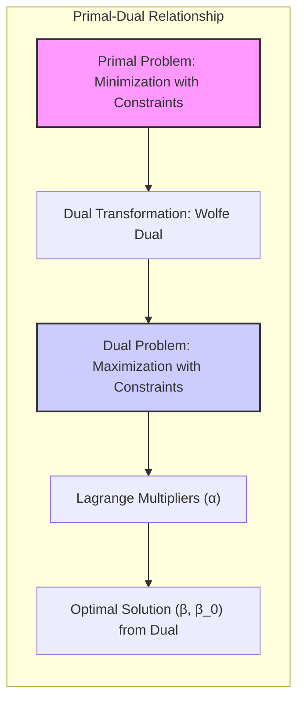
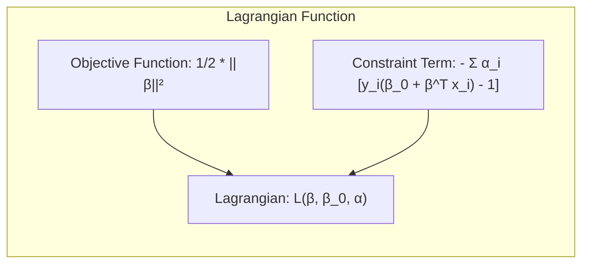
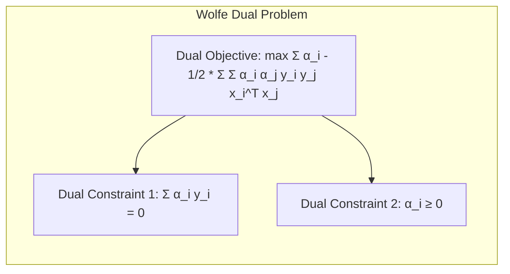
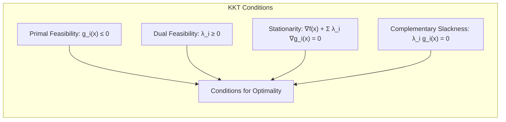
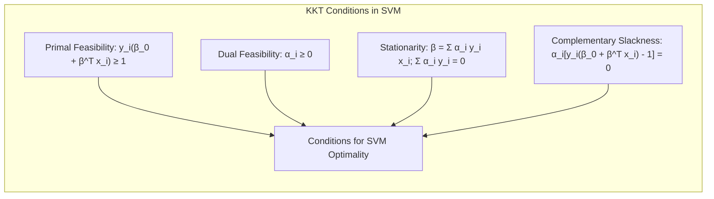

### Introduzindo o Dual de Wolfe para Otimização

A teoria da **dualidade** em otimização oferece uma abordagem poderosa para resolver problemas de otimização com restrições, transformando o problema original (o problema primal) em um problema relacionado (o problema dual) [^4.5.2]. O **dual de Wolfe** é uma formulação específica do problema dual que é particularmente útil em problemas de otimização convexa com restrições de desigualdade, como o problema da maximização da margem em **Máquinas de Vetores de Suporte (SVM)**.

**Problema Primal e Dual:**

O problema de otimização que estamos estudando (o problema primal), dado por

$$
    \min_{\beta, \beta_0} \frac{1}{2} ||\beta||^2
$$
sujeito a:
$$
    y_i (\beta_0 + \beta^T x_i) \geq 1, \text{ para } i = 1,\ldots,N
$$
é um problema de minimização da norma do vetor $\beta$, com restrições de desigualdade sobre os dados de treinamento.

> 💡 **Exemplo Numérico:**
> Vamos considerar um exemplo simples com 3 pontos de dados bidimensionais (N=3) para ilustrar o problema primal. Suponha que temos os seguintes dados:
>
>  - $x_1 = [1, 2]$, $y_1 = 1$
>  - $x_2 = [2, 1]$, $y_2 = 1$
>  - $x_3 = [1, -1]$, $y_3 = -1$
>
> O problema primal busca o $\beta = [\beta_1, \beta_2]$ e $\beta_0$ que minimizem $\frac{1}{2}(\beta_1^2 + \beta_2^2)$ e satisfaçam as restrições $y_i(\beta_0 + \beta_1x_{i1} + \beta_2x_{i2}) \geq 1$. Este é um problema de otimização com restrições que pode ser difícil de resolver diretamente. O dual de Wolfe transforma este problema em uma forma mais tratável.

A abordagem do dual de Wolfe envolve a introdução de **multiplicadores de Lagrange** $\alpha_i \geq 0$ para cada restrição de desigualdade, e a construção da função lagrangiana:

$$
    L(\beta, \beta_0, \alpha) = \frac{1}{2} ||\beta||^2 - \sum_{i=1}^N \alpha_i [y_i (\beta_0 + \beta^T x_i) - 1]
$$

A função lagrangiana combina a função objetivo e as restrições, incluindo um multiplicador de Lagrange para cada restrição.

O problema dual de Wolfe é obtido maximizando a função lagrangiana em relação aos parâmetros primais $\beta$ e $\beta_0$, e minimizando a função dual resultante em relação aos multiplicadores de Lagrange $\alpha_i$. Especificamente, tomamos as derivadas parciais em relação a $\beta_0$ e $\beta$, e igualamos a zero, para obter as relações:

$$
     \frac{\partial L}{\partial \beta_0} = - \sum_{i=1}^N \alpha_i y_i = 0
$$
$$
     \frac{\partial L}{\partial \beta} = \beta - \sum_{i=1}^N \alpha_i y_i x_i = 0
$$
e com isso, obtemos a relações:
$$
     \sum_{i=1}^N \alpha_i y_i = 0
$$
$$
    \beta = \sum_{i=1}^N \alpha_i y_i x_i
$$

> 💡 **Exemplo Numérico (continuação):**
>
> Usando as derivadas parciais, temos:
>
> $\frac{\partial L}{\partial \beta_0} = -\alpha_1(1) - \alpha_2(1) - \alpha_3(-1) = 0$, ou seja, $\alpha_3 = \alpha_1 + \alpha_2$.
>
> $\frac{\partial L}{\partial \beta} = \beta - \alpha_1(1)[1, 2] - \alpha_2(1)[2, 1] - \alpha_3(-1)[1, -1] = 0$, ou seja, $\beta = [\alpha_1 + 2\alpha_2 - \alpha_3, 2\alpha_1 + \alpha_2 + \alpha_3]$.
>
> Substituindo $\alpha_3$, obtemos $\beta = [2\alpha_2, 2\alpha_1 + 2\alpha_2]$.
>
> Estas relações são cruciais para transformar o problema primal no dual.

Ao substituir $\beta$ na função lagrangiana e adicionar a restrição de $\alpha_i \geq 0$, obtemos o problema dual de Wolfe:

$$
\max_{\alpha} \sum_{i=1}^N \alpha_i - \frac{1}{2} \sum_{i=1}^N \sum_{j=1}^N \alpha_i \alpha_j y_i y_j x_i^T x_j
$$
sujeito a:
$$
    \sum_{i=1}^N \alpha_i y_i = 0
$$
$$
    \alpha_i \geq 0, \text{ para } i = 1,\ldots,N
$$
O problema dual é um problema de maximização com restrições de desigualdade, onde o objetivo é encontrar os multiplicadores de Lagrange $\alpha_i$ que maximizem a função dual. As soluções para os parâmetros originais $\beta$ e $\beta_0$ podem ser obtidas a partir dos multiplicadores de Lagrange ótimos, como mostrado acima.

> 💡 **Exemplo Numérico (continuação):**
>
> Substituindo $\beta$ na lagrangiana, obtemos o problema dual:
>
> $\max_{\alpha} \alpha_1 + \alpha_2 + \alpha_3 - \frac{1}{2} (\alpha_1^2(1^2+2^2) + \alpha_2^2(2^2+1^2) + \alpha_3^2(1^2+(-1)^2) + 2\alpha_1\alpha_2(1*2+2*1) - 2\alpha_1\alpha_3(1*1+2*(-1)) - 2\alpha_2\alpha_3(2*1+1*(-1))) $
>
> $\max_{\alpha} \alpha_1 + \alpha_2 + \alpha_3 - \frac{1}{2} (5\alpha_1^2 + 5\alpha_2^2 + 2\alpha_3^2 + 8\alpha_1\alpha_2 + 2\alpha_1\alpha_3 - 2\alpha_2\alpha_3) $
>
> Sujeito a: $\alpha_1 + \alpha_2 - \alpha_3 = 0$ e $\alpha_1, \alpha_2, \alpha_3 \geq 0$.
>
> Este problema dual é mais fácil de resolver computacionalmente. A solução para os $\alpha_i$ ótimos nos dará os pesos para calcular $\beta$ e, consequentemente, o hiperplano de separação.

**Vantagens do Dual de Wolfe:**

A formulação dual apresenta algumas vantagens importantes:

1.  **Problema de Otimização Mais Fácil:** O problema dual é um problema de otimização convexa, e é mais fácil de resolver do que o problema primal original, que pode ser não convexo.

2.  **Interpretabilidade:** As soluções do problema dual estão diretamente relacionadas aos vetores de suporte, que são as observações que definem a margem. As soluções do dual também nos dizem quais observações importam para a construção da fronteira de decisão.

3.  **Utilização do *Kernel Trick*:** O problema dual pode ser generalizado para incorporar o *kernel trick*, que permite mapear os dados para espaços de alta dimensão e modelar fronteiras de decisão não lineares. Essa generalização é obtida por meio da substituição do produto interno  $x_i^T x_j$ por uma função *kernel* $k(x_i, x_j)$.

4.  **Transformação em um problema convexo:** O problema dual é um problema de otimização convexa, e esse resultado permite utilizar os algoritmos bem conhecidos para a solução desse tipo de problemas.

A formulação dual de Wolfe é um passo fundamental para a construção de Máquinas de Vetores de Suporte (SVMs) e para o desenvolvimento de algoritmos eficientes para a resolução de problemas de classificação linear.

**Lemma 52:** *O dual de Wolfe transforma um problema de minimização com restrições (problema primal) em um problema de maximização com restrições (problema dual), por meio da introdução de multiplicadores de Lagrange*.

*Prova:* Ao construir a função Lagrangiana e aplicar as condições de otimalidade, o problema dual é obtido. $\blacksquare$

**Corolário 52:** *A solução do dual de Wolfe é dada em termos dos multiplicadores de Lagrange, que estão relacionados com os vetores de suporte, o que torna a solução mais interpretável.*

*Prova:* As soluções do problema dual se baseiam nas condições de KKT e em como os multiplicadores de Lagrange são interpretados. $\blacksquare$

A utilização do dual de Wolfe transforma o problema original, e permite um tratamento mais fácil e eficiente da otimização, que é fundamental para a construção das Máquinas de Vetores de Suporte (SVM).

### Condições de Karush-Kuhn-Tucker (KKT) e a Otimalidade

As **Condições de Karush-Kuhn-Tucker (KKT)** são um conjunto de condições necessárias para a otimalidade em problemas de otimização convexa com restrições de desigualdade [^4.4.4]. Essas condições fornecem um arcabouço formal para entender as propriedades da solução ótima e para derivar algoritmos de otimização. Em particular, as condições KKT são fundamentais para entender a relação entre o problema primal e dual em otimização e são usadas para derivar as soluções para problemas como o da maximização da margem em Máquinas de Vetores de Suporte (SVM) e outros problemas de classificação.

**As Condições KKT:**

Em geral, um problema de otimização convexa com restrições de desigualdade pode ser formulado da seguinte forma:

$$
   \min_x f(x)
$$

sujeito a:

$$
   g_i(x) \leq 0 \text{ para } i=1,\ldots,m
$$
onde $f(x)$ é a função objetivo a ser minimizada, e $g_i(x)$ são as funções de restrição. As condições KKT são dadas por:

1.  **Viabilidade Primal:** As soluções $x$ devem satisfazer as restrições:

    $$
        g_i(x) \leq 0 \text{ para } i = 1,\ldots,m
    $$

2.  **Viabilidade Dual:** Os multiplicadores de Lagrange $\lambda_i$ devem ser não negativos:

    $$
        \lambda_i \geq 0 \text{ para } i = 1,\ldots,m
    $$

3.  **Estacionariedade:** O gradiente da função lagrangiana deve ser igual a zero:

    $$
        \nabla f(x) + \sum_{i=1}^m \lambda_i \nabla g_i(x) = 0
    $$

    onde a função Lagrangiana é dada por:

    $$
        L(x,\lambda) = f(x) + \sum_{i=1}^m \lambda_i g_i(x)
    $$

4.  **Folga Complementar:** O produto dos multiplicadores de Lagrange pelas restrições deve ser igual a zero:

    $$
        \lambda_i g_i(x) = 0 \text{ para } i = 1,\ldots,m
    $$

Essas condições são necessárias para a otimalidade da solução de problemas de otimização convexa com restrições de desigualdade. A condição de folga complementar indica que os multiplicadores de Lagrange $\lambda_i$ são diferentes de zero somente quando a restrição correspondente é satisfeita com igualdade, isto é, quando $g_i(x) = 0$. As restrições com multiplicadores iguais a zero são consideradas restrições inativas.

> 💡 **Exemplo Numérico:**
>
> Considere um problema simples de minimizar $f(x) = x^2$ sujeito a $g(x) = x - 2 \leq 0$.
>
> 1.  **Viabilidade Primal:** $x \leq 2$.
> 2.  **Viabilidade Dual:** $\lambda \geq 0$.
> 3.  **Estacionariedade:** $\nabla f(x) + \lambda \nabla g(x) = 2x + \lambda(1) = 0$, portanto $2x + \lambda = 0$.
> 4.  **Folga Complementar:** $\lambda(x - 2) = 0$.
>
> Se $\lambda = 0$, então $2x = 0$, o que implica $x = 0$. Isso satisfaz as condições KKT e a solução ótima.
> Se $x = 2$, então $2(2) + \lambda = 0$, o que implica $\lambda = -4$. Isso viola a viabilidade dual ($\lambda \geq 0$), portanto, $x=2$ não é a solução.
>
> A solução ótima é $x = 0$ com $\lambda = 0$. A condição de folga complementar indica que a restrição $x \leq 2$ não está ativa (não é satisfeita com igualdade) no ótimo.

**As Condições KKT em SVM:**

Aplicando as condições KKT ao problema de otimização do SVM, obtemos informações importantes sobre a relação entre a solução dual e a solução primal, além de entender como os vetores de suporte são selecionados.

O problema primal do SVM com margem máxima, para classes linearmente separáveis, é dado por:

$$
    \min_{\beta, \beta_0} \frac{1}{2} ||\beta||^2
$$
sujeito a:
$$
    y_i (\beta_0 + \beta^T x_i) \geq 1, \text{ para } i = 1,\ldots,N
$$

Aplicando as condições KKT, podemos mostrar que os multiplicadores de Lagrange $\alpha_i$ são iguais a zero para observações que não são vetores de suporte (ou seja, para as observações que não se encontram na margem), e são maiores do que zero para vetores de suporte, e com isso, vemos como o hiperplano separador é definido por apenas um subconjunto dos dados.

> 💡 **Exemplo Numérico (SVM):**
>
> Retomando o exemplo anterior, as condições KKT para o SVM são:
>
> 1.  **Viabilidade Primal:** $y_i(\beta_0 + \beta^Tx_i) \geq 1$.
> 2.  **Viabilidade Dual:** $\alpha_i \geq 0$.
> 3.  **Estacionariedade:** $\beta = \sum_{i=1}^N \alpha_i y_i x_i$ e $\sum_{i=1}^N \alpha_i y_i = 0$.
> 4.  **Folga Complementar:** $\alpha_i[y_i(\beta_0 + \beta^T x_i) - 1] = 0$.
>
> Se o ponto $x_i$ está no lado correto da margem, então $y_i(\beta_0 + \beta^T x_i) > 1$, e, pela folga complementar, $\alpha_i = 0$. Se o ponto $x_i$ é um vetor de suporte, então $y_i(\beta_0 + \beta^T x_i) = 1$ e $\alpha_i > 0$.
>
> Este exemplo ilustra como as condições KKT ajudam a identificar quais pontos são vetores de suporte e como eles são usados para determinar o hiperplano separador.

O dual de Wolfe e as condições KKT oferecem um conjunto de ferramentas para análise e resolução de problemas de otimização convexa com restrições, incluindo o problema da maximização da margem em modelos de classificação lineares e nas Máquinas de Vetores de Suporte (SVM).

**Lemma 53:** *As Condições de Karush-Kuhn-Tucker (KKT) são condições necessárias para a otimalidade de problemas de otimização convexa com restrições de desigualdade, e relacionam os parâmetros, os multiplicadores de Lagrange e as restrições do problema*.

*Prova:* As condições de KKT são derivadas da teoria da dualidade, e descrevem as propriedades que devem ser satisfeitas no ótimo da função.   $\blacksquare$

**Corolário 53:** *A condição de folga complementar nas condições KKT indica que os multiplicadores de Lagrange são diferentes de zero apenas para as restrições ativas, o que é crucial para entender como os vetores de suporte definem o hiperplano separador em SVM*.

*Prova:* O multiplicador de Lagrange está associado a cada restrição, e valores não nulos indicam que a restrição é ativa (vetores de suporte) e faz parte da definição da solução. $\blacksquare$

As condições KKT fornecem um entendimento formal e preciso das relações entre as variáveis de um problema de otimização convexa e suas soluções.

### Conclusão

Este capítulo apresentou o dual de Wolfe como uma ferramenta para a transformação de problemas de otimização com restrições e enfatizou a importância das condições de Karush-Kuhn-Tucker (KKT) para a otimalidade em problemas de otimização convexa. A relação do dual de Wolfe e das condições KKT com a construção de modelos de classificação lineares baseados na maximização da margem, como as Máquinas de Vetores de Suporte (SVM), também foi discutida. A compreensão desses conceitos é essencial para o estudo de métodos de otimização e para o desenvolvimento de modelos de aprendizado de máquina mais sofisticados.

### Footnotes

[^4.1]: "In this chapter we revisit the classification problem and focus on linear methods for classification. Since our predictor G(x) takes values in a discrete set G, we can always divide the input space into a collection of regions labeled according to the classification. We saw in Chapter 2 that the boundaries of these regions can be rough or smooth, depending on the prediction function. For an important class of procedures, these decision boundaries are linear; this is what we will mean by linear methods for classification." *(Trecho de "The Elements of Statistical Learning")*

[^4.3]: "Linear discriminant analysis (LDA) arises in the special case when we assume that the classes have a common covariance matrix Σk = ∑. In comparing two classes k and l, it is sufficient to look at the log-ratio, and we see that" *(Trecho de "The Elements of Statistical Learning")*

[^4.4]: "The logistic regression model arises from the desire to model the posterior probabilities of the K classes via linear functions in x, while at the same time ensuring that they sum to one and remain in [0,1]." *(Trecho de "The Elements of Statistical Learning")*

[^4.4.4]:  "The L₁ penalty used in the lasso (Section 3.4.2) can be used for variable selection and shrinkage with any linear regression model. For logistic regression, we would maximize a penalized version of (4.20):" *(Trecho de "The Elements of Statistical Learning")*

[^4.5]: "In this situation the features are high-dimensional and correlated, and the LDA coefficients can be regularized to be smooth or sparse in the original domain of the signal. This leads to better generalization and allows for easier interpretation of the coefficients." *(Trecho de "The Elements of Statistical Learning")*

[^4.5.2]: "The second method, due to Vapnik (1996), finds an optimally separating hyperplane if one exists, else finds a hyperplane that minimizes some measure of overlap in the training data. We treat the separable case here, and defer treatment of the nonseparable case to Chapter 12." *(Trecho de "The Elements of Statistical Learning")*
