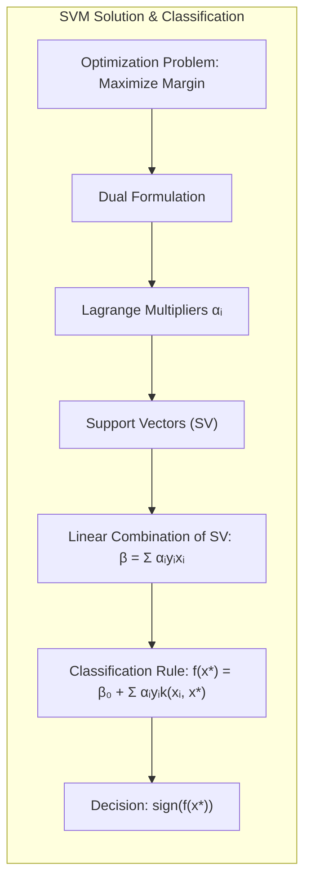
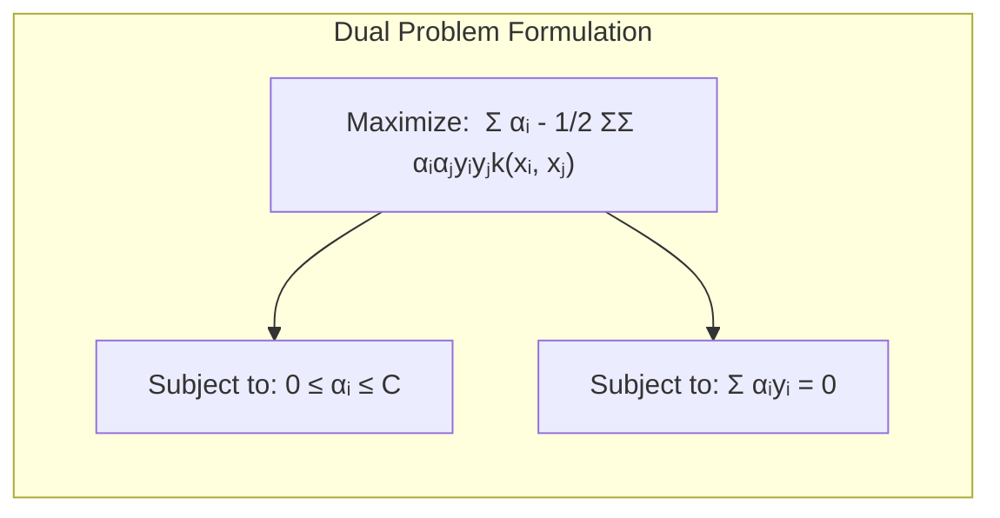
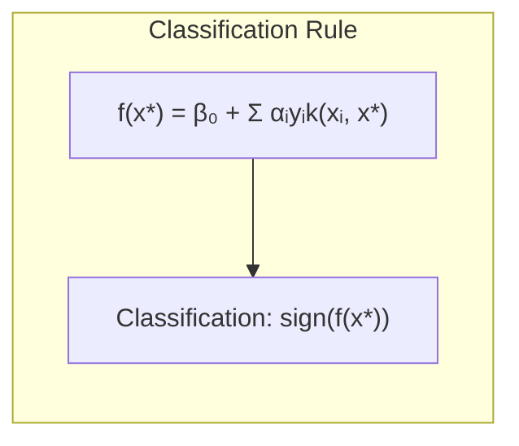
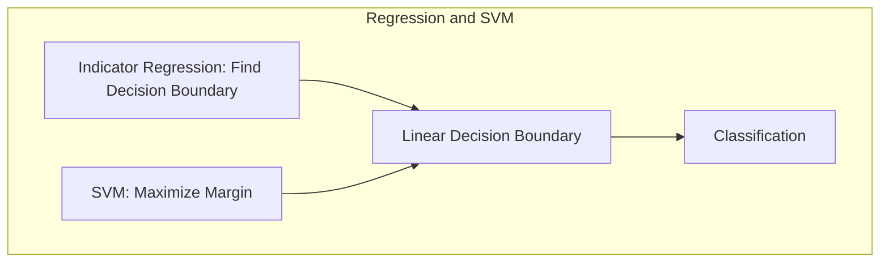
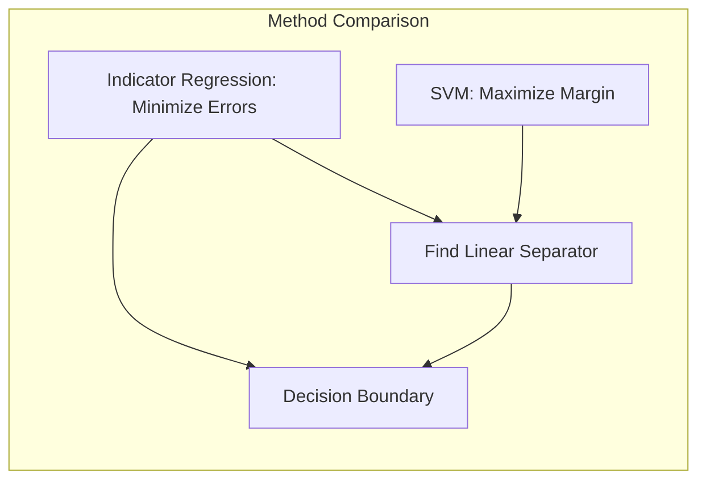

### Encontrando uma Solução como Combinação Linear dos Pontos de Suporte e uma Regra de Classificação para Novas Observações

A solução para o problema de otimização na busca do **hiperplano separador** ótimo, em problemas de classificação linear como em **Máquinas de Vetores de Suporte (SVM)**, apresenta uma característica fundamental: a solução para os parâmetros do hiperplano pode ser expressa como uma **combinação linear dos vetores de suporte**, e essa combinação linear define a regra de classificação para **novas observações** [^4.5.2]. Essa propriedade, que é consequência da formulação dual do problema e das condições de Karush-Kuhn-Tucker (KKT), é crucial para o entendimento do SVM e de sua capacidade de generalização.

**A Solução como Combinação Linear dos Vetores de Suporte:**

Conforme discutido nas seções anteriores, a formulação dual do problema de otimização do SVM é dada por:

$$
\max_{\alpha} \sum_{i=1}^N \alpha_i - \frac{1}{2} \sum_{i=1}^N \sum_{j=1}^N \alpha_i \alpha_j y_i y_j k(x_i, x_j)
$$
sujeito a:
$$
  0 \leq \alpha_i \leq C, \text{ para } i = 1,\ldots,N
$$
$$
    \sum_{i=1}^N \alpha_i y_i = 0
$$
onde $\alpha_i$ são os multiplicadores de Lagrange, $y_i$ são os rótulos das classes, e $k(x_i, x_j)$ é a função *kernel* (ou o produto interno $x_i^T x_j$ no caso linear). A solução para esse problema de otimização é dada em termos dos multiplicadores de Lagrange $\alpha_i$, onde os multiplicadores que são diferentes de zero correspondem aos **vetores de suporte**.

O vetor de parâmetros $\beta$ do hiperplano separador pode ser expresso como uma combinação linear dos vetores de suporte:

$$
    \beta = \sum_{i \in SV} \alpha_i y_i x_i
$$
onde $SV$ é o conjunto de índices das observações que são vetores de suporte, ou seja, onde $\alpha_i \neq 0$. Essa expressão mostra que a solução do SVM depende apenas dos vetores de suporte. As observações que não são vetores de suporte não afetam a solução final.

> 💡 **Exemplo Numérico:**
>
> Vamos considerar um exemplo simples com 4 pontos em duas dimensões, onde os pontos $(1, 1)$ e $(2, 2)$ pertencem à classe +1, e os pontos $(1, 2)$ e $(2, 1)$ pertencem à classe -1. Usaremos um kernel linear, ou seja, $k(x_i, x_j) = x_i^T x_j$.
>
> Os pontos são:
>  - $x_1 = (1, 1)$, $y_1 = 1$
>  - $x_2 = (2, 2)$, $y_2 = 1$
>  - $x_3 = (1, 2)$, $y_3 = -1$
>  - $x_4 = (2, 1)$, $y_4 = -1$
>
> Suponha que, após resolver o problema dual, encontramos os seguintes multiplicadores de Lagrange:
>
> - $\alpha_1 = 0.5$
> - $\alpha_2 = 0$
> - $\alpha_3 = 0.5$
> - $\alpha_4 = 0$
>
> Isso significa que os vetores de suporte são $x_1$ e $x_3$. O vetor $\beta$ é calculado como:
>
> $\beta = \alpha_1 y_1 x_1 + \alpha_3 y_3 x_3 = 0.5 * 1 * (1, 1) + 0.5 * (-1) * (1, 2) = (0.5, 0.5) + (-0.5, -1) = (0, -0.5)$
>
> Portanto, o vetor $\beta$ é $(0, -0.5)$. Observe que apenas os vetores de suporte contribuem para o cálculo de $\beta$.

**Regra de Classificação para Novas Observações:**

Para classificar uma nova observação $x^*$, calculamos a distância sinalizada dessa observação até o hiperplano separador. No contexto do *kernel trick*, essa distância pode ser calculada como:

$$
    f(x^*) = \beta_0 + \beta^T \phi(x^*) =  \beta_0 + \sum_{i \in SV} \alpha_i y_i k(x_i, x^*)
$$
onde $\phi(x^*)$ é o mapeamento de $x^*$ no espaço de características. A classe da observação $x^*$ é então determinada pelo sinal de $f(x^*)$:

$$
  \hat{G}(x^*) = \text{sign}(f(x^*)) = \text{sign}\left(\beta_0 + \sum_{i \in SV} \alpha_i y_i k(x_i, x^*)\right)
$$

onde o parâmetro $\beta_0$ pode ser computado a partir de qualquer vetor de suporte.

> 💡 **Exemplo Numérico (continuação):**
>
> Continuando com o exemplo anterior, vamos calcular o valor de $\beta_0$. Podemos usar um dos vetores de suporte, por exemplo, $x_1$. Como $y_1 = 1$ e sabemos que $f(x_1) = \beta_0 + \beta^T x_1 = 1$, temos:
>
> $1 = \beta_0 + (0, -0.5)^T (1, 1) = \beta_0 - 0.5$,
>
> portanto, $\beta_0 = 1.5$.
>
> Agora, vamos classificar uma nova observação $x^* = (1.5, 1.5)$:
>
> $f(x^*) = 1.5 + \sum_{i \in SV} \alpha_i y_i k(x_i, x^*) = 1.5 + 0.5 * 1 * (1, 1)^T (1.5, 1.5) + 0.5 * (-1) * (1, 2)^T (1.5, 1.5)$
> $f(x^*) = 1.5 + 0.5 * (1.5 + 1.5) - 0.5 * (1.5 + 3) = 1.5 + 1.5 - 2.25 = 0.75$
>
> Como $f(x^*) = 0.75 > 0$, a nova observação $x^*$ é classificada como pertencente à classe +1.

Essa expressão revela que a classificação de uma nova observação depende da soma ponderada da função *kernel* entre a nova observação e os vetores de suporte, onde os pesos são dados pelos multiplicadores de Lagrange $\alpha_i$ e pelas classes $y_i$. Os vetores de suporte desempenham um papel central na decisão de classificação, enquanto as observações que não são vetores de suporte não contribuem para a decisão.

A utilização de *kernels* na regra de classificação permite que o SVM opere em um espaço de alta dimensão, sem que seja necessário calcular explicitamente a transformação do espaço de entrada.

**Lemma 54:** *A solução para o problema de otimização do SVM, expressa em termos de multiplicadores de Lagrange, leva a uma representação dos parâmetros do hiperplano separador como uma combinação linear dos vetores de suporte.*

*Prova:* A solução do dual de Wolfe do SVM fornece os valores dos multiplicadores de Lagrange, que são usados para calcular os parâmetros do hiperplano.  $\blacksquare$

**Corolário 54:** *A regra de classificação para novas observações em SVM é definida com base na distância sinalizada da observação em relação ao hiperplano, expressa como uma combinação linear das funções *kernel* entre a nova observação e os vetores de suporte.*

*Prova:* A regra de decisão é definida com base na função $f(x)$, que depende de uma combinação dos vetores de suporte, e a classe final da observação é definida pelo sinal da função.   $\blacksquare$

A combinação linear dos vetores de suporte e a regra de classificação com base na distância sinalizada são elementos chave do SVM e permite entender como esse modelo funciona na prática.

### Relação com a Regressão de Indicadores

A **relação entre a regressão de indicadores** e os modelos de classificação baseados na **maximização da margem**, como as **Máquinas de Vetores de Suporte (SVM)**, é uma conexão interessante que revela como diferentes abordagens podem levar a resultados similares em problemas de classificação linear [^4.2], [^4.5.2]. Embora a regressão de indicadores seja uma técnica mais simples, ela pode ser utilizada para entender alguns dos conceitos por trás do SVM e de como o hiperplano separador pode ser construído.

**Regressão de Indicadores para Classificação:**

Na regressão de indicadores, como discutido em capítulos anteriores, cada classe é codificada por meio de uma variável indicadora, que assume o valor 1 quando a observação pertence à classe correspondente e 0 caso contrário [^4.2]. Um modelo de regressão linear é ajustado para cada variável indicadora, e as classificações são realizadas com base nos valores ajustados, utilizando a regra:

*   Atribuir a observação à classe cujo valor ajustado é maior.

Essa abordagem busca modelar as variáveis indicadoras diretamente como uma função linear dos preditores e pode ser usada para obter uma fronteira de decisão entre as classes.

**Relação com o SVM:**

Embora a regressão de indicadores seja uma técnica de classificação mais simples, há algumas conexões importantes com o problema da otimização do hiperplano separador em SVM. A regressão de indicadores busca encontrar o hiperplano que minimize os erros de classificação, enquanto o SVM busca encontrar o hiperplano que maximize a margem entre as classes.

Em um problema de classificação com duas classes, a regressão de indicadores, como mostrado em capítulos anteriores, leva a uma fronteira de decisão linear. No entanto, a regressão de indicadores busca encontrar um hiperplano que minimize os erros, mas não maximiza a margem entre as classes.

O SVM, por outro lado, busca encontrar o hiperplano que maximize a distância entre as classes, o que geralmente leva a modelos com melhor capacidade de generalização e com maior robustez. A otimização do SVM é um problema de otimização convexa, o que leva a uma solução mais estável e consistente do que a regressão linear simples.

A conexão entre as abordagens pode ser entendida da seguinte forma:

*   A regressão de indicadores busca encontrar um hiperplano que separa as classes, utilizando métodos de mínimos quadrados. A abordagem se baseia em modelar os indicadores, e a decisão é tomada por meio da classe que apresenta maior probabilidade condicional.

*   O SVM também busca um hiperplano, mas com o objetivo de maximizar a margem entre as classes. A solução é dada em termos de vetores de suporte, e o hiperplano separador é obtido através da solução de um problema de otimização.

> 💡 **Exemplo Numérico:**
>
> Considere o mesmo conjunto de dados do exemplo anterior:
>  - $x_1 = (1, 1)$, $y_1 = 1$
>  - $x_2 = (2, 2)$, $y_2 = 1$
>  - $x_3 = (1, 2)$, $y_3 = -1$
>  - $x_4 = (2, 1)$, $y_4 = -1$
>
> Para regressão de indicadores, criamos uma variável indicadora $I(y_i = 1)$, que é 1 para os pontos da classe +1 e 0 para os pontos da classe -1. Aplicamos uma regressão linear a esses dados, buscando encontrar um hiperplano que separe as classes.
>
> Embora a regressão linear possa encontrar um hiperplano separador, a solução não necessariamente maximiza a margem. Por exemplo, um modelo linear que poderia separar os dados seria $f(x) = -0.5 + 0.5x_1 + 0.5x_2$.  A fronteira de decisão seria definida por $0 = -0.5 + 0.5x_1 + 0.5x_2$ ou $x_1 + x_2 = 1$.
>
> No entanto, este hiperplano pode não ter a maior margem possível, que é o objetivo do SVM. O SVM, ao maximizar a margem, busca uma separação mais robusta e generalizável.

Em essência, a regressão de indicadores busca um ajuste linear dos indicadores por meio de mínimos quadrados, e o SVM busca uma separação linear com a maior margem possível. Em certos contextos, o hiperplano separador definido por regressão linear (ou LDA, em modelos de classificação com duas classes) é proporcional ao hiperplano obtido via SVM. No entanto, a abordagem da margem máxima, utilizada pelo SVM, é mais robusta e geral para problemas de classificação.

A regressão de indicadores, embora mais simples, pode ser usada para entender o conceito de hiperplano separador e como ele divide o espaço de entrada em diferentes classes. A abordagem do SVM, ao maximizar a margem, se torna mais robusta e eficiente em problemas de classificação.

**Lemma 55:** *A regressão de indicadores pode ser vista como uma forma de encontrar um hiperplano separador, que busca minimizar o erro de classificação entre as classes.*

*Prova:* A regressão de indicadores modela as classes por meio de indicadores, e a decisão final é tomada com base na classe que apresenta a maior probabilidade.  $\blacksquare$

**Corolário 55:** *O SVM, ao buscar maximizar a margem entre as classes, busca uma separação mais robusta entre elas, o que geralmente leva a um melhor desempenho do modelo quando comparado a regressão de indicadores.*

*Prova:* A formulação do SVM se baseia no conceito de margem máxima e fornece soluções mais estáveis do que modelos baseados em mínimos quadrados. $\blacksquare$

A relação entre regressão de indicadores e modelos de margem máxima permite entender como diferentes abordagens podem levar a resultados similares e como cada abordagem se posiciona em relação à capacidade de generalização e robustez dos modelos.

### Conclusão

Este capítulo explorou como a solução do problema de otimização do SVM pode ser expressa como uma combinação linear de vetores de suporte, e como essa combinação define a regra de classificação para novas observações. Foi discutida a relação entre a regressão de indicadores e os modelos baseados na maximização da margem (SVM), mostrando como diferentes abordagens podem buscar fronteiras lineares de separação. A compreensão desses conceitos é crucial para a construção e interpretação de modelos de classificação linear e para entender as propriedades e as limitações de cada método.

<!-- END DOCUMENT -->

### Footnotes

[^4.1]: "In this chapter we revisit the classification problem and focus on linear methods for classification. Since our predictor G(x) takes values in a discrete set G, we can always divide the input space into a collection of regions labeled according to the classification. We saw in Chapter 2 that the boundaries of these regions can be rough or smooth, depending on the prediction function. For an important class of procedures, these decision boundaries are linear; this is what we will mean by linear methods for classification." *(Trecho de "The Elements of Statistical Learning")*

[^4.2]: "In Chapter 2 we fit linear regression models to the class indicator variables, and classify to the largest fit. Suppose there are K classes, for convenience labeled 1,2,..., K, and the fitted linear model for the kth indicator response variable is $f_k(x) = \beta_{k0} + \beta^T x$. The decision boundary between class k and l is that set of points for which $f_k(x) = f_l(x)$, that is, the set $\{x: (\beta_{k0} – \beta_{l0}) + (\beta_{\kappa} – \beta_l)^T x = 0\}$, an affine set or hyperplane" *(Trecho de "The Elements of Statistical Learning")*

[^4.3]: "Linear discriminant analysis (LDA) arises in the special case when we assume that the classes have a common covariance matrix $\Sigma_k = \sum$. In comparing two classes k and l, it is sufficient to look at the log-ratio, and we see that" *(Trecho de "The Elements of Statistical Learning")*

[^4.4]: "The logistic regression model arises from the desire to model the posterior probabilities of the K classes via linear functions in x, while at the same time ensuring that they sum to one and remain in [0,1]." *(Trecho de "The Elements of Statistical Learning")*

[^4.5]: "In this situation the features are high-dimensional and correlated, and the LDA coefficients can be regularized to be smooth or sparse in the original domain of the signal. This leads to better generalization and allows for easier interpretation of the coefficients." *(Trecho de "The Elements of Statistical Learning")*

[^4.5.2]: "The second method, due to Vapnik (1996), finds an optimally separating hyperplane if one exists, else finds a hyperplane that minimizes some measure of overlap in the training data. We treat the separable case here, and defer treatment of the nonseparable case to Chapter 12." *(Trecho de "The Elements of Statistical Learning")*
