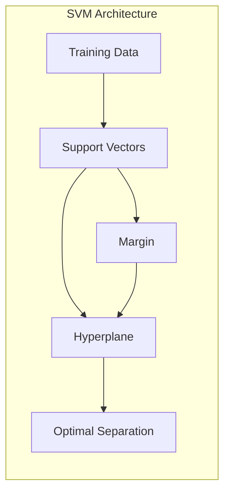
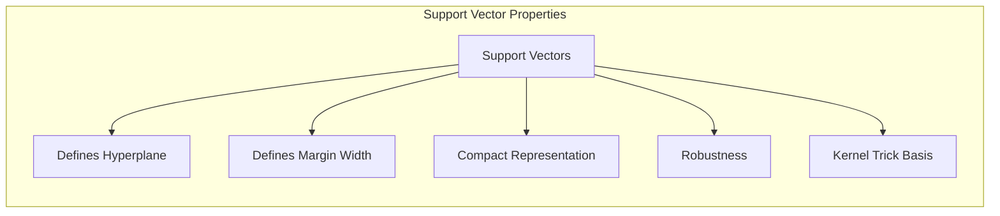
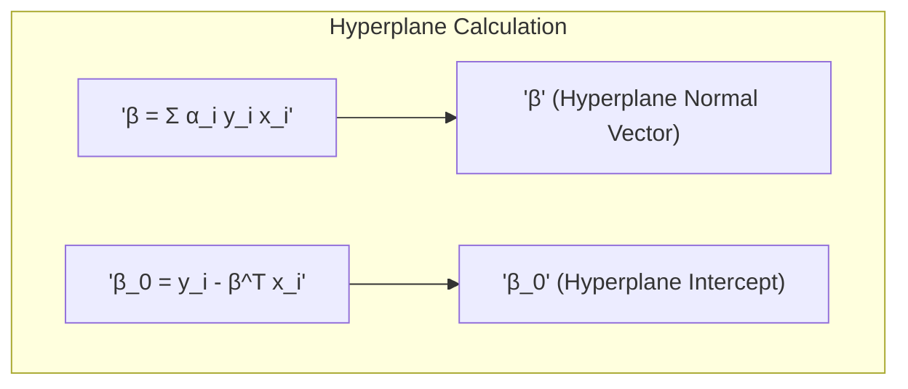
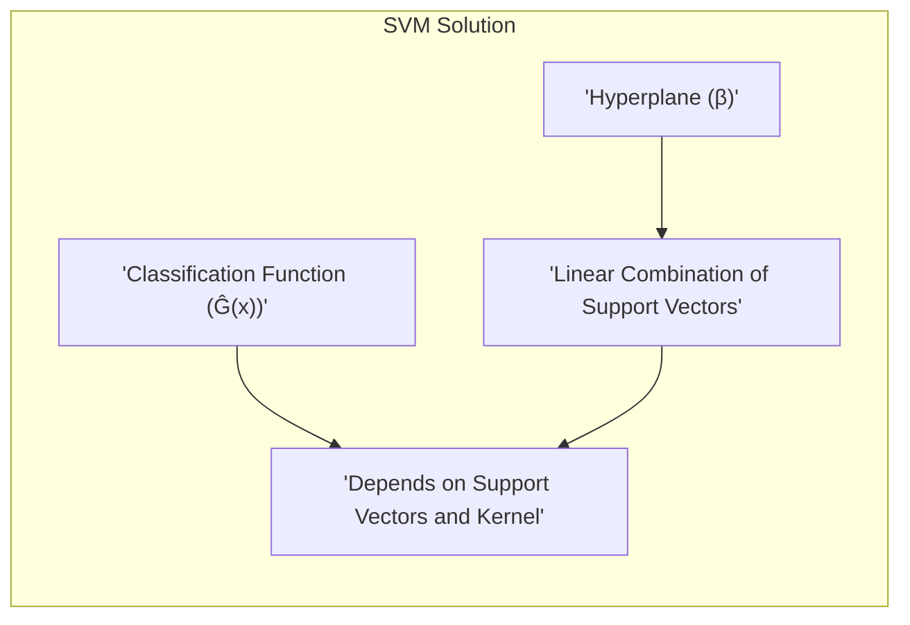
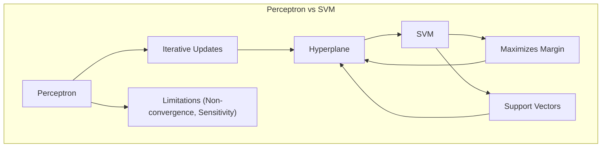
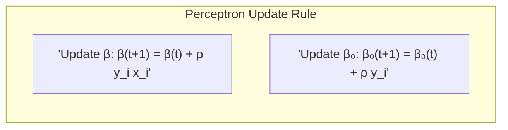

### Vetores de Suporte Definem a Separação Ótima

Em modelos de classificação linear baseados em **maximização da margem**, como as **Máquinas de Vetores de Suporte (SVM)**, os **vetores de suporte** desempenham um papel fundamental na definição do **hiperplano separador ótimo** [^4.5.2]. Esses vetores, que são um subconjunto das observações de treinamento, são os únicos pontos que realmente influenciam a posição e a orientação do hiperplano, tornando-os essenciais para a compressão e a construção de modelos SVM.

**O Papel dos Vetores de Suporte:**

Os vetores de suporte são as observações de treinamento que se encontram mais próximas ao hiperplano separador. Formalmente, são as observações que estão na fronteira da margem ou no lado incorreto da fronteira, ou seja, aquelas que estão mais próximas da região de separação. Em termos da formulação matemática do SVM, os vetores de suporte são as observações para as quais os multiplicadores de Lagrange ($\alpha_i$) obtidos na solução do problema dual de otimização são diferentes de zero.

As propriedades dos vetores de suporte são:

1.  **Definição do Hiperplano:** A solução para o hiperplano separador ótimo em SVM é dada em termos de uma combinação linear dos vetores de suporte. As observações que não são vetores de suporte não contribuem para a solução final. Isso significa que a posição e orientação do hiperplano são totalmente determinadas pelos vetores de suporte, o que torna os modelos SVM esparsos e eficientes.

2.  **Margem:** Os vetores de suporte são os pontos que definem a largura da margem. A distância entre os vetores de suporte e o hiperplano é igual à margem, e o SVM busca encontrar um hiperplano que maximize essa distância.

3.  **Representação Compacta:** Como a solução depende apenas dos vetores de suporte, o modelo resultante é mais compacto e eficiente em termos de armazenamento e computação. A solução, com um número reduzido de vetores de suporte, gera um modelo eficiente em termos de capacidade de generalização.

4.  **Robustez:** Os vetores de suporte são selecionados de forma a garantir a robustez do modelo em relação a pequenas variações nos dados. O modelo não é influenciado por pontos muito distantes da fronteira de decisão, mas é guiado pelos pontos mais relevantes para a separação das classes.

5.  **Relação com o Kernel Trick:** Quando os SVM são utilizados com *kernels*, os vetores de suporte são projetados no espaço de maior dimensionalidade, e a solução do problema de otimização depende apenas dos vetores de suporte nesse espaço transformado. A função *kernel* é utilizada para o cálculo da combinação linear no espaço de alta dimensão.

> 💡 **Exemplo Numérico:**
>
> Vamos considerar um exemplo simples em 2D com duas classes (azul e vermelho) e alguns pontos de dados. Suponha que após o treinamento de um SVM, tenhamos encontrado três vetores de suporte:
>
> -   $x_1 = (1, 2)$, com rótulo $y_1 = 1$ (classe azul)
> -   $x_2 = (2, 1)$, com rótulo $y_2 = -1$ (classe vermelha)
> -   $x_3 = (2.5, 2.5)$, com rótulo $y_3 = 1$ (classe azul)
>
> E os multiplicadores de Lagrange associados são:
>
> -   $\alpha_1 = 0.5$
> -   $\alpha_2 = 1$
> -   $\alpha_3 = 0.8$
>
> O vetor normal do hiperplano ($\beta$) é dado por:
>
> $\beta = \sum_{i \in SV} \alpha_i y_i x_i = 0.5 * 1 * (1, 2) + 1 * -1 * (2, 1) + 0.8 * 1 * (2.5, 2.5) = (0.5, 1) + (-2, -1) + (2, 2) = (0.5, 2)$
>
> O intercepto $\beta_0$ é obtido a partir das condições de Karush-Kuhn-Tucker (KKT) e pode ser calculado usando um dos vetores de suporte, por exemplo, $x_1$:
>
> $\beta_0 = y_1 - \beta^T x_1 = 1 - (0.5 * 1 + 2 * 2) = 1 - 4.5 = -3.5$
>
> Assim, o hiperplano é definido por $0.5x_1 + 2x_2 - 3.5 = 0$.  Se tivéssemos um novo ponto $x = (3, 1)$, a classificação seria dada por:
>
>  $\hat{G}(x) = \text{sign}(0.5 * 3 + 2 * 1 - 3.5) = \text{sign}(1.5+2-3.5) = \text{sign}(0) = 0$, indicando que estaria no hiperplano.
>
>  Se tivéssemos um novo ponto $x = (3, 2)$, a classificação seria dada por:
>
>  $\hat{G}(x) = \text{sign}(0.5 * 3 + 2 * 2 - 3.5) = \text{sign}(1.5+4-3.5) = \text{sign}(2) = 1$, indicando que estaria na classe azul.
>
> Note que apenas os vetores de suporte influenciaram o cálculo de $\beta$ e $\beta_0$.

**Formalmente:**

Dado o problema de otimização do SVM:

$$
    \min_{\beta, \beta_0} \frac{1}{2} ||\beta||^2
$$
sujeito a:
$$
    y_i (\beta_0 + \beta^T x_i) \geq 1, \text{ para } i = 1,\ldots,N
$$
a solução para o hiperplano ótimo é dada por:

$$
    \beta = \sum_{i \in SV} \alpha_i y_i \phi(x_i)
$$

onde $\alpha_i$ são os multiplicadores de Lagrange, $y_i$ são os rótulos de classe, $\phi(x_i)$ é o mapeamento do vetor de entrada $x_i$ para o espaço de características, e o conjunto SV são os vetores de suporte (para os quais $\alpha_i > 0$). O resultado acima mostra que a solução é uma combinação linear dos vetores de suporte (no espaço transformado pelo kernel), e que os outros pontos não influenciam o hiperplano resultante.

A decisão de classificação para uma nova observação $x$ é dada por:

$$
    \hat{G}(x) = \text{sign} \left( \sum_{i \in SV} \alpha_i y_i k(x_i, x) + \beta_0 \right)
$$
e depende apenas dos vetores de suporte.

**Lemma 56:** *Os vetores de suporte são as observações de treinamento que se encontram na margem ou no lado incorreto da fronteira de decisão, e que determinam a posição e a orientação do hiperplano separador ótimo em SVM.*

*Prova:* Os vetores de suporte são as observações para as quais os multiplicadores de Lagrange são diferentes de zero, e sua combinação linear define o vetor normal do hiperplano.  $\blacksquare$

**Corolário 56:** *A solução para o hiperplano separador ótimo em SVM é dada como uma combinação linear dos vetores de suporte, o que leva a modelos esparsos e com capacidade de generalização.*

*Prova:* A solução para o problema do SVM é dada em termos dos multiplicadores de Lagrange que são diferentes de zero, e sua combinação linear define o hiperplano.  $\blacksquare$

A identificação e a utilização de vetores de suporte é essencial para a compreensão do funcionamento dos modelos de classificação baseados em maximização da margem, como o SVM.

### Relação com o Algoritmo Perceptron e a Busca por Pontos de Suporte

A relação entre o algoritmo **perceptron** e as **Máquinas de Vetores de Suporte (SVM)** é fundamental para entender como os métodos de classificação linear evoluíram ao longo do tempo e como as limitações de um modelo mais simples levaram ao desenvolvimento de modelos mais sofisticados [^4.5.1], [^4.5.2]. Apesar da simplicidade do perceptron, sua lógica de aprendizado iterativo e a busca por um hiperplano separador são elementos presentes na formulação do SVM, mas com algumas melhorias.

**O Perceptron e sua Busca por um Hiperplano Separador:**

O algoritmo do perceptron, como discutido em seções anteriores, busca encontrar um hiperplano separador por meio de um processo iterativo baseado em gradiente descendente. O perceptron atualiza os pesos ($\beta$ e $\beta_0$) do hiperplano com base nas observações mal classificadas, buscando um hiperplano que separe as classes com o menor número de erros possível.

O algoritmo do perceptron utiliza a seguinte regra de atualização iterativa para os parâmetros:

$$
    \beta^{(t+1)} = \beta^{(t)} + \rho y_i x_i \text{ se } y_i(\beta_0 + \beta^T x_i) < 0
$$

$$
    \beta_0^{(t+1)} = \beta_0^{(t)} + \rho y_i \text{ se } y_i(\beta_0 + \beta^T x_i) < 0
$$

onde $\rho$ é a taxa de aprendizagem, $y_i$ é a classe da observação e $x_i$ são os preditores.

Apesar de sua simplicidade, o perceptron apresenta algumas limitações:

1.  **Convergência em Dados Não Separáveis:** O perceptron não converge quando os dados não são linearmente separáveis, e pode apresentar ciclos e oscilações.

2.  **Sensibilidade a Outliers:** O perceptron é sensível a *outliers*, e sua solução pode ser influenciada por valores extremos.

3.  **Solução Não Única:** A solução final do perceptron depende da inicialização dos parâmetros e da ordem de apresentação dos dados, o que pode levar a diferentes hiperplanos separadores.

> 💡 **Exemplo Numérico:**
>
> Considere um conjunto de dados com duas classes, onde temos os seguintes pontos com rótulos $y_i \in \{-1, 1\}$:
>
> - $x_1 = (1, 1)$, $y_1 = 1$
> - $x_2 = (2, 0)$, $y_2 = 1$
> - $x_3 = (0, 1)$, $y_3 = -1$
> - $x_4 = (0, 0)$, $y_4 = -1$
>
> Inicializamos $\beta = (0, 0)$ e $\beta_0 = 0$. Vamos usar uma taxa de aprendizagem $\rho = 1$.
>
> **Iteração 1:**
>
> - Para $x_1$: $y_1(\beta_0 + \beta^T x_1) = 1(0 + 0*1 + 0*1) = 0 < 1$, então não há erro.
> - Para $x_2$: $y_2(\beta_0 + \beta^T x_2) = 1(0 + 0*2 + 0*0) = 0 < 1$, então não há erro.
> - Para $x_3$: $y_3(\beta_0 + \beta^T x_3) = -1(0 + 0*0 + 0*1) = 0 < 1$, então não há erro.
> - Para $x_4$: $y_4(\beta_0 + \beta^T x_4) = -1(0 + 0*0 + 0*0) = 0 < 1$, então não há erro.
>
> Como não há erros, vamos supor um novo ponto $x_1$ mal classificado para exemplificar a atualização.
>
> **Iteração 2:**
>
> - Para $x_1$: Suponha que $y_1(\beta_0 + \beta^T x_1) < 0$.
> - Atualização:
>    - $\beta^{(1)} = \beta^{(0)} + \rho y_1 x_1 = (0, 0) + 1 * 1 * (1, 1) = (1, 1)$
>    - $\beta_0^{(1)} = \beta_0^{(0)} + \rho y_1 = 0 + 1 * 1 = 1$
>
> O hiperplano agora é definido por $x_1 + x_2 + 1 = 0$, ou $x_1+x_2 = -1$.
>
> Se continuarmos o processo iterativo, o perceptron ajustará o hiperplano até encontrar uma solução (se os dados forem linearmente separáveis). A solução final dependerá da ordem dos dados e da inicialização.

**O SVM e a Busca por um Hiperplano com Margem Máxima:**

O SVM surge como uma extensão do perceptron, que busca não apenas um hiperplano que separe as classes, mas um hiperplano que maximize a margem entre as classes [^4.5.2]. Essa abordagem leva a modelos mais robustos e com maior capacidade de generalização.

O SVM utiliza um problema de otimização convexo para encontrar o hiperplano separador que maximize a margem, que é definida como a distância mínima entre o hiperplano e as observações mais próximas (os vetores de suporte). A formulação do SVM, como vimos em capítulos anteriores, resulta em uma solução que depende somente dos vetores de suporte. A busca do SVM é por um hiperplano que seja estável e que tenha o maior nível possível de generalização para novos dados.

**Relação Entre os Dois Modelos:**

Embora o perceptron seja mais simples e não otimize a margem, a sua estrutura básica, com a busca por uma fronteira linear separadora, está na base do SVM.  O SVM utiliza o mesmo conceito de hiperplano separador, mas o otimiza sob a perspectiva da maximização da margem. Ambos os modelos utilizam uma combinação linear dos preditores para definir uma fronteira de decisão.

O SVM surge como uma evolução do perceptron ao adicionar o conceito de margem e o uso de métodos *kernel* para lidar com problemas não lineares, sendo mais robusto e generalizável que o perceptron.

A busca do SVM por uma margem maior pode ser vista como uma forma de buscar a solução que seja mais robusta para novas observações, o que o torna um método com maior poder e capacidade de generalização do que o Perceptron, além de apresentar uma conexão com os métodos para problemas de otimização convexa.

**Lemma 57:** *O perceptron e o SVM são modelos lineares que buscam um hiperplano separador, mas o SVM adiciona o conceito de margem máxima e se baseia em vetores de suporte.*

*Prova:* O Perceptron busca apenas a separação, e o SVM busca o hiperplano que maximize a margem, o que define a sua diferença fundamental.  $\blacksquare$

**Corolário 57:** *O SVM, ao buscar maximizar a margem, obtém soluções mais estáveis e generalizáveis do que o perceptron, que é sensível à inicialização e à ordem dos dados.*

*Prova:* A maximização da margem e a solução baseada em vetores de suporte diminui a sensibilidade a ruídos e à ordem da apresentação dos dados de treino. $\blacksquare$

A compreensão da relação entre o Perceptron e o SVM permite uma melhor compreensão da evolução dos modelos de classificação linear e das vantagens do SVM em relação ao Perceptron.

### Conclusão

Este capítulo explorou como os vetores de suporte definem a separação ótima em SVM, apresentando a solução como uma combinação linear dos vetores de suporte e a regra de classificação para novas observações. Foi discutida a relação entre a regressão de indicadores e os SVM, e como a busca por um hiperplano separador pode ser feita utilizando diferentes abordagens e com diferenças na solução. Foi também explorada a relação do algoritmo do perceptron e do SVM, e as vantagens e limitações de cada um. A compreensão desses conceitos é essencial para entender os modelos de classificação linear e para a utilização das Máquinas de Vetores de Suporte (SVM) em problemas práticos.

### Footnotes

[^4.1]: "In this chapter we revisit the classification problem and focus on linear methods for classification. Since our predictor G(x) takes values in a discrete set G, we can always divide the input space into a collection of regions labeled according to the classification. We saw in Chapter 2 that the boundaries of these regions can be rough or smooth, depending on the prediction function. For an important class of procedures, these decision boundaries are linear; this is what we will mean by linear methods for classification." *(Trecho de "The Elements of Statistical Learning")*

[^4.2]: "In Chapter 2 we fit linear regression models to the class indicator variables, and classify to the largest fit. Suppose there are K classes, for convenience labeled 1,2,..., K, and the fitted linear model for the kth indicator response variable is fk(x) = βko + βTx. The decision boundary between class k and l is that set of points for which fk(x) = fl(x), that is, the set {x: (βko – βeo) + (βκ – βe)Tx = 0}, an affine set or hyperplane" *(Trecho de "The Elements of Statistical Learning")*

[^4.3]: "Linear discriminant analysis (LDA) arises in the special case when we assume that the classes have a common covariance matrix Σk = ∑. In comparing two classes k and l, it is sufficient to look at the log-ratio, and we see that" *(Trecho de "The Elements of Statistical Learning")*

[^4.4]: "The logistic regression model arises from the desire to model the posterior probabilities of the K classes via linear functions in x, while at the same time ensuring that they sum to one and remain in [0,1]." *(Trecho de "The Elements of Statistical Learning")*

[^4.5]: "In this situation the features are high-dimensional and correlated, and the LDA coefficients can be regularized to be smooth or sparse in the original domain of the signal. This leads to better generalization and allows for easier interpretation of the coefficients." *(Trecho de "The Elements of Statistical Learning")*

[^4.5.1]: "The first is the well-known perceptron model of Rosenblatt (1958), with an algorithm that finds a separating hyperplane in the training data, if one exists." *(Trecho de "The Elements of Statistical Learning")*

[^4.5.2]: "The second method, due to Vapnik (1996), finds an optimally separating hyperplane if one exists, else finds a hyperplane that minimizes some measure of overlap in the training data. We treat the separable case here, and defer treatment of the nonseparable case to Chapter 12." *(Trecho de "The Elements of Statistical Learning")*
