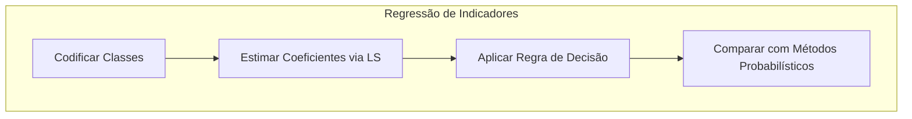

Você está encarregado de criar um **capítulo de livro** extenso, detalhado e avançado sobre um tópico específico no campo de **Modelos de Classificação Linear, Seleção de Variáveis e Regularização**, com foco em técnicas estatísticas e de aprendizado de máquina. Seu objetivo é produzir um guia de estudo abrangente para um profissional especializado em Estatística e Aprendizado de Máquina com conhecimento avançado em modelos estatísticos, otimização e análise de dados. Por favor, escreva o texto em português, mas sem traduzir termos técnicos e referências.

O tópico para o seu capítulo é:

<X></X>

**Diretrizes Importantes:**

1. **Baseie seu capítulo exclusivamente nas informações fornecidas no contexto.** Não introduza conhecimento externo. **Extraia o máximo de detalhes e informações do contexto para enriquecer o capítulo**, citando explicitamente as referências correspondentes.

2. **Atribua um número sequencial a cada trecho relevante do contexto.** Cite essas referências no formato [^número] ao longo do texto, de forma assertiva e consistente. Por exemplo, [^4.1] refere-se ao tópico “4.1 Introduction” do contexto. Ajuste conforme necessário para referenciar “4.2 Linear Regression of an Indicator Matrix”, “4.3 Linear Discriminant Analysis (LDA)”, etc. Quando fizer menção a subitens (4.3.1, 4.4.1, etc.), mantenha as referências de forma clara, por exemplo: [^4.3.1] ou [^4.4.1].

3. **Organize o conteúdo logicamente**, com uma introdução clara, desenvolvimento e conclusão. Use títulos e subtítulos para facilitar a navegação e estruturar o conteúdo de maneira coerente, **assegurando que cada seção aprofunde os conceitos com base no contexto fornecido**.

4. **Aprofunde-se em conceitos técnicos e matemáticos.** Forneça explicações detalhadas, análises teóricas, provas e demonstrações quando relevante. **Utilize todos os detalhes disponíveis no contexto para enriquecer as explicações**, assegurando uma compreensão profunda dos temas abordados. Não traduza nomes técnicos e teóricos.

5. **Use a seguinte formatação:**

   -   Use **negrito** para conceitos principais.
   -   Use *itálico* para citações ou paráfrases importantes.
   -   Use caixas de destaque para informações cruciais.
   -   Use emojis (⚠️❗✔️💡) para ênfase quando apropriado.

   **Evite formatação de bullet points. Foque em criar um texto corrido e bem estruturado.**

6. **Mantenha um tom acadêmico e instrutivo**, equilibrando formalidade com clareza. Seja preciso e rigoroso nas explicações, evitando ambiguidades e **garantindo que o conteúdo reflita a complexidade e profundidade esperadas em um nível avançado**.

7. **Use $ para expressões matemáticas em linha e $$ para equações centralizadas.** Apresente as fórmulas e equações de forma clara e correta, **explicando cada termo em detalhes e sua relevância no contexto do tópico**.

8. **Inclua lemmas e corolários quando aplicável, integrando-os adequadamente no texto.**

   -   Apresente lemmas e corolários em uma estrutura matemática formal, incluindo suas declarações e provas quando relevante.
   -   Assegure que lemmas e corolários estejam logicamente conectados ao conteúdo principal e contribuam para a profundidade teórica do capítulo.

9. **Inclua seções teóricas desafiadoras ao longo do capítulo e ao final**, seguindo estas diretrizes:

   a) Adicione 2-3 seções teóricas avançadas relacionadas ao conteúdo abordado ao final de cada seção principal.

   b) As seções devem ser altamente relevantes, **avaliar a compreensão profunda de conceitos teóricos-chave**, podem envolver cálculos complexos e provas, e focar em análises teóricas e derivações.

   c) As seções devem integrar múltiplos conceitos e exigir raciocínio teórico aprofundado.

   d) **As seções devem envolver derivações teóricas, provas ou análises matemáticas complexas, incluindo lemmas e corolários quando apropriado.** Evite focar em aspectos de aplicação ou implementação. Adicione $\blacksquare$ ao final das provas.

   e) **Formule as seções como se estivesse fazendo perguntas ao tema e depois respondendo teoricamente no conteúdo da seção.**

10. **Referencie o contexto de forma assertiva e consistente.** Certifique-se de que todas as informações utilizadas estão devidamente referenciadas, utilizando os números atribuídos aos tópicos disponibilizados. **As referências devem ser claras e diretas, facilitando a verificação das fontes dentro do contexto fornecido**.

11. **Incorpore diagramas e mapas mentais quando relevantes para o entendimento do conteúdo.** Use a linguagem Mermaid para diagramas ou **<imagem: descrição detalhada da imagem>** quando apropriado, apenas nas seções onde eles realmente contribuam para a compreensão.

    **Instruções para incentivar a criação de diagramas e mapas mentais mais ricos:**

    -   Ao utilizar Mermaid, crie diagramas complexos que representem estruturas detalhadas, como árvores de decisão para seleção de modelos, fluxos de dados em algoritmos de classificação, relações entre métodos de discriminantes ou passos de algoritmos complexos de regularização.
    -   Utilize Mermaid para representar fórmulas matemáticas e algoritmos de forma visual, facilitando a compreensão de processos matemáticos e computacionais avançados.
    -   Para os mapas mentais, construa representações gráficas que conectem os principais conceitos e seções do capítulo, servindo como um guia rápido para o leitor entender os conceitos de forma avançada e aprofundada.
    -   Para as imagens descritas em **<imagem: ...>**, forneça descrições ricas que permitam visualizar gráficos complexos, como curvas de decisão, fronteiras lineares vs. não lineares, ou esquemas detalhados de análises discriminantes.

    **Exemplos de como usar diagramas e mapas mentais com foco no conteúdo de classificação e regressão:**

    - **Usando Mermaid para Mapas Mentais:**  

      ```mermaid
      graph TD
        A[Classificação] --> B[Linear Discriminant Analysis]
        A --> C[Logistic Regression]
        A --> D[Separating Hyperplanes]
        B --> E[Regularized Discriminant Analysis]
      ```

      **Explicação:** Este mapa mental ilustra a categorização dos principais métodos de classificação linear, conforme descrito no contexto [^4.1], [^4.2], [^4.3], [^4.4], e [^4.5].

    - **Usando Mermaid para Explicar Algoritmos:**  

      ```mermaid
      stateDiagram-v2
          [*] --> Identificacao
          Identificacao --> Ajuste: Inicia processamento
          Ajuste --> Funcao: Atualiza pesos
          Funcao --> Verificacao: Calcula f(x)
          Verificacao --> Ajuste: Não convergiu
          Verificacao --> [*]: Convergiu
      
          state Identificacao: Identificação da Fronteira
          state Ajuste: Ajuste de Parâmetros
          state Funcao: Função Discriminante
          state Verificacao: Verificação
      ```

      **Explicação:** Este diagrama representa de forma genérica os passos sequenciais de um método de classificação linear, como mostrado no contexto [^4.2], [^4.4].

    - **Usando Mermaid para Visualizar Fórmulas Matemáticas:**  

      ```mermaid
      graph LR
          A["Probabilidade\np(x)"]
          B["Transformação Logit\nln(p(x)/(1-p(x)))"]
          C["Modelo Linear\nβ₀ + β₁x₁ + β₂x₂ + ... + βₙxₙ"]
          D["Função de Verossimilhança\nL(β) = Σ yᵢln(p(xᵢ)) + (1-yᵢ)ln(1-p(xᵢ))"]
      
          A -->|"Aplicar\nlogit"| B
          B -->|"Igualar ao\nmodelo"| C
          C -->|"Otimizar\nparâmetros"| D
      
          style A fill:#e3f2fd,stroke:#1976d2,stroke-width:3px
          style B fill:#e8f5e9,stroke:#388e3c,stroke-width:3px
          style C fill:#fff3e0,stroke:#f57c00,stroke-width:3px
          style D fill:#fce4ec,stroke:#c2185b,stroke-width:3px
      ```

      **Explicação:** Este diagrama mostra a formulação do log-odds na Regressão Logística, conforme discutido em [^4.4].

    - **Usando <imagem: descrição detalhada da imagem>:**  

      <imagem: Gráfico mostrando as fronteiras de decisão resultantes de um modelo LDA vs. um modelo Logistic Regression, ilustrando semelhanças e diferenças nas fronteiras lineares>

12. **Adicione mais instruções que incentivem a escrita de um texto aprofundado e avançado:**

    -   **Aprofunde cada conceito com exemplos complexos, discussões críticas e análises comparativas, sempre fundamentadas nos tópicos 4.1 a 4.5.2.**
    -   **Integre referências cruzadas entre seções para mostrar conexões entre diferentes abordagens de classificação.**
    -   **Inclua discussões sobre limitações, desafios atuais e possíveis direções futuras de pesquisa relacionadas ao tema.**
    -   **Utilize linguagem técnica apropriada, mantendo precisão terminológica e rigor conceitual, com foco em métodos estatísticos, otimização e análise de dados.**

**Importante:**

-   **Comece criando a introdução e as primeiras 3 a 4 seções do capítulo.** Após isso, apresente as referências utilizadas e pergunte ao usuário se deseja continuar. Nas interações seguintes, continue adicionando novas seções, seguindo as mesmas diretrizes, até que o usuário solicite a conclusão. Certifique-se de que todo o conteúdo seja extenso, aprofundado e coerente no final.
-   **Instruções de marcação (HTML Comments):**  
    - Em cada seção do capítulo, use `<!-- START Nome da Seção -->` no início e `<!-- END Nome da Seção -->` no final. Substitua "Nome da Seção" pelo título real da seção em questão (por exemplo: Introdução, Conceitos Fundamentais, etc.).  
    - Ao final de todo o texto (quando realmente encerrar a escrita do conteúdo), insira `<!-- END DOCUMENT -->` para indicar que o modelo terminou de escrever.

Lembre-se de usar $ em vez de \( e \), e $$ em vez de \[ e \] para expressões matemáticas!

**Estruture seu capítulo da seguinte forma (incluindo as marcações de início e fim de seções conforme instruído):**

## Título Conciso

<imagem: proponha uma imagem relevante para o conteúdo do capítulo, por exemplo, um diagrama complexo que ilustra a relação entre as abordagens de classificação (LDA, Logistic Regression, Hyperplanes) ou um mapa mental abrangente que conecte os subtemas (4.1 a 4.5.2)>
Introdução

<!-- START Introdução -->

Uma introdução contextual abrangente que apresenta o tópico e sua relevância no contexto da **classificação e análise discriminante**, **extraindo informações detalhadas dos tópicos [^4.1] e [^4.2]** (ou conforme for adequado ao seu texto).
<!-- END Introdução -->

### Conceitos Fundamentais

<!-- START Conceitos Fundamentais -->

Desenvolva um texto contínuo que explique cada conceito fundamental, integrando-os harmoniosamente na narrativa e **referenciando o contexto apropriado**:

**Conceito 1:** Apresentação detalhada, incluindo teoria e análises matemáticas do **problema de classificação** e como o uso de métodos lineares se relaciona ao viés e variância, com exemplos práticos. **Utilize informações dos tópicos [^4.1] e [^4.2]** para enriquecer a explicação.

**Lemma 1:** Formule e demonstre um lemma relevante que suporte esse conceito, **com base nos tópicos [^4.3]**. Por exemplo, um lemma sobre a decomposição de funções discriminantes lineares ou sobre a relação entre regressão de indicadores e decisões de classe.

**Conceito 2:** Exploração aprofundada, sustentada por fundamentos teóricos e matemáticos da **Linear Discriminant Analysis (LDA)**, detalhando as suposições de normalidade, covariâncias e a construção da fronteira de decisão. **Baseie-se nos tópicos [^4.3], [^4.3.1], [^4.3.2], [^4.3.3] para aprofundar os detalhes**.

**Corolário 1:** Apresente um corolário derivado do Lemma 1 ou do próprio Conceito 2, **referenciando os tópicos [^4.3.1]** ou outros subitens pertinentes, como por exemplo a relação entre a função discriminante linear e a projeção em subespaços de menor dimensão.

**Conceito 3:** Discussão abrangente e com suporte teórico sobre a **Logistic Regression**, explicando o logit e a maximização da verossimilhança, **referenciando os tópicos [^4.4], [^4.4.1], [^4.4.2], [^4.4.3], [^4.4.4], [^4.4.5]** conforme aplicável. Detalhe as conexões com a LDA e quando cada método pode ser mais apropriado.

Utilize as formatações para destacar informações cruciais quando necessário:

> ⚠️ **Nota Importante**: Informação crítica que merece destaque. **Referência ao tópico [^4.4.1]**.

> ❗ **Ponto de Atenção**: Observação crucial sobre o uso de classes não-balanceadas. **Conforme indicado em [^4.4.2]**.

> ✔️ **Destaque**: Importante correlação entre estimativas de parâmetros em LDA e em regressão logística. **Baseado no tópico [^4.5]**.

<!-- END Conceitos Fundamentais -->

<!-- START Regressão Linear e Mínimos Quadrados para Classificação -->

### Regressão Linear e Mínimos Quadrados para Classificação

<imagem: descrição detalhada ou utilize a linguagem Mermaid para diagramas ricos e relevantes, como mapas mentais que conectam conceitos ou diagramas que explicam algoritmos e fórmulas matemáticas ligados à regressão de indicadores>

**Exemplo de diagrama com Mermaid:**



**Explicação:** Este diagrama representa o fluxo do processo de regressão de indicadores e como ele se relaciona à classificação, **conforme descrito nos tópicos [1](https://chatgpt.com/c/6779488f-4cac-8011-bfb6-42e6adb87c7e#user-content-fn-4.2)**.

Desenvolva uma explicação aprofundada sobre como a regressão linear em matriz de indicadores pode ser aplicada à classificação e quais são suas limitações, **sempre referenciando os tópicos [2](https://chatgpt.com/c/6779488f-4cac-8011-bfb6-42e6adb87c7e#user-content-fn-4.1) e [1](https://chatgpt.com/c/6779488f-4cac-8011-bfb6-42e6adb87c7e#user-content-fn-4.2)**. Inclua provas matemáticas quando possível. Se houver menções específicas ao “masking problem” ou à influência de covariância entre classes, cite o tópico [3](https://chatgpt.com/c/6779488f-4cac-8011-bfb6-42e6adb87c7e#user-content-fn-4.3) para mostrar as conexões com LDA.

Inclua mapas mentais para relacionar os conceitos apresentados, facilitando a compreensão aprofundada pelo leitor.

Adicione lemmas e corolários quando aplicável:

**Lemma 2:** Declare e prove um lemma que seja fundamental para o entendimento deste tópico, **baseado em [1](https://chatgpt.com/c/6779488f-4cac-8011-bfb6-42e6adb87c7e#user-content-fn-4.2)**. Por exemplo, um lemma sobre a equivalência entre as projeções nos hiperplanos de decisão gerados por regressão linear e discriminantes lineares em certas condições.

**Corolário 2:** Apresente um corolário que resulte diretamente do Lemma 2, **conforme indicado em [3](https://chatgpt.com/c/6779488f-4cac-8011-bfb6-42e6adb87c7e#user-content-fn-4.3)**, destacando como esse resultado pode simplificar a análise do modelo.

Mencione comparações e limitações:

“Em alguns cenários, conforme apontado em [4](https://chatgpt.com/c/6779488f-4cac-8011-bfb6-42e6adb87c7e#user-content-fn-4.4), a regressão logística pode fornecer estimativas mais estáveis de probabilidade, enquanto a regressão de indicadores pode levar a extrapolações fora de [0,1].”

“No entanto, há situações em que a regressão de indicadores, de acordo com [1](https://chatgpt.com/c/6779488f-4cac-8011-bfb6-42e6adb87c7e#user-content-fn-4.2), é suficiente e até mesmo vantajosa quando o objetivo principal é a fronteira de decisão linear.”

### Métodos de Seleção de Variáveis e Regularização em Classificação

<imagem: descrição detalhada da imagem se relevante, incluindo mapas mentais que relacionem este conceito com LDA, logistic regression e hyperplanes, conforme discussão nos tópicos [5](https://chatgpt.com/c/6779488f-4cac-8011-bfb6-42e6adb87c7e#user-content-fn-4.5)>

Apresente definições matemáticas detalhadas, **apoiando-se nos tópicos [6](https://chatgpt.com/c/6779488f-4cac-8011-bfb6-42e6adb87c7e#user-content-fn-4.4.4), [5](https://chatgpt.com/c/6779488f-4cac-8011-bfb6-42e6adb87c7e#user-content-fn-4.5), [7](https://chatgpt.com/c/6779488f-4cac-8011-bfb6-42e6adb87c7e#user-content-fn-4.5.1), [8](https://chatgpt.com/c/6779488f-4cac-8011-bfb6-42e6adb87c7e#user-content-fn-4.5.2)**. Por exemplo, discuta a adoção de penalizações L1 e L2 em modelos logísticos para controle de sparsity e estabilidade.

Podem ser incluídos exemplos teóricos sobre como a regularização se encaixa na formulação de uma função de custo que combine verossimilhança e termos de penalização, **como abordado em [6](https://chatgpt.com/c/6779488f-4cac-8011-bfb6-42e6adb87c7e#user-content-fn-4.4.4)**.

**Lemma 3:** Apresente um lemma que demonstre como a penalização L1 em classificação logística leva a coeficientes esparsos, **com base em [6](https://chatgpt.com/c/6779488f-4cac-8011-bfb6-42e6adb87c7e#user-content-fn-4.4.4)**.

**Prova do Lemma 3:** Desenvolva a prova detalhada, **utilizando conceitos de inferência e otimização discutidos em [9](https://chatgpt.com/c/6779488f-4cac-8011-bfb6-42e6adb87c7e#user-content-fn-4.4.3)**. $\blacksquare$

**Corolário 3:** Apresente um corolário que resulte do Lemma 3, destacando suas implicações para a interpretabilidade dos modelos classificatórios, **conforme indicado em [10](https://chatgpt.com/c/6779488f-4cac-8011-bfb6-42e6adb87c7e#user-content-fn-4.4.5)**.

Inclua anotações importantes, como:

> ⚠️ **Ponto Crucial**: L1 e L2 podem ser combinadas (Elastic Net) para aproveitar vantagens de ambos os tipos de regularização, **conforme discutido em [5](https://chatgpt.com/c/6779488f-4cac-8011-bfb6-42e6adb87c7e#user-content-fn-4.5)**.

### Separating Hyperplanes e Perceptrons

Descreva em texto corrido como a ideia de maximizar a margem de separação leva ao conceito de hiperplanos ótimos, **referenciando [8](https://chatgpt.com/c/6779488f-4cac-8011-bfb6-42e6adb87c7e#user-content-fn-4.5.2)** para a formulação do problema de otimização e o uso do dual de Wolfe. Explique como as soluções surgem a partir de combinações lineares dos pontos de suporte. Se desejar, inclua detalhes do Perceptron de Rosenblatt e sua convergência sob condições específicas, **conforme em [7](https://chatgpt.com/c/6779488f-4cac-8011-bfb6-42e6adb87c7e#user-content-fn-4.5.1)**.

Apresente teoremas, lemmas ou corolários se necessário para aprofundar a análise teórica, especialmente sobre a condição de separabilidade de dados e a garantia de convergência sob hipóteses de linear separability, **utilizando [7](https://chatgpt.com/c/6779488f-4cac-8011-bfb6-42e6adb87c7e#user-content-fn-4.5.1)** e [8](https://chatgpt.com/c/6779488f-4cac-8011-bfb6-42e6adb87c7e#user-content-fn-4.5.2) para fundamentar cada afirmação.

### Pergunta Teórica Avançada (Exemplo): Quais as diferenças fundamentais entre a formulação de LDA e a Regra de Decisão Bayesiana considerando distribuições Gaussianas com covariâncias iguais?

**Resposta:**

Estabeleça as hipóteses de cada método e mostre como, sob certas suposições, o LDA se torna equivalente à decisão Bayesiana, **conforme indicado em [3](https://chatgpt.com/c/6779488f-4cac-8011-bfb6-42e6adb87c7e#user-content-fn-4.3)**. Aprofunde a explicação, trazendo detalhes sobre a derivação de limites de decisão, projeções lineares e como a escolha da média e da covariância influencia o resultado.

Inclua lemmas e corolários, se necessário:

**Lemma 4:** Apresente um lemma que mostre a equivalência formal, **baseando-se em [3](https://chatgpt.com/c/6779488f-4cac-8011-bfb6-42e6adb87c7e#user-content-fn-4.3), [11](https://chatgpt.com/c/6779488f-4cac-8011-bfb6-42e6adb87c7e#user-content-fn-4.3.3)**.

**Corolário 4:** Mostre como, ao relaxar a hipótese de covariâncias iguais, surgem as fronteiras quadráticas (QDA), **conforme em [3](https://chatgpt.com/c/6779488f-4cac-8011-bfb6-42e6adb87c7e#user-content-fn-4.3)**.

> ⚠️ **Ponto Crucial**: A adoção ou não de covariâncias iguais impacta fortemente o tipo de fronteira de decisão (linear vs. quadrática), **conforme discutido em [12](https://chatgpt.com/c/6779488f-4cac-8011-bfb6-42e6adb87c7e#user-content-fn-4.3.1)**.

As perguntas devem ser altamente relevantes, **avaliar a compreensão profunda de conceitos teóricos-chave**, podem envolver derivações matemáticas e provas, e focar em análises teóricas.

### Conclusão

Conclua o catpítulo e adicione o <!-- END DOCUMENT --> no final da sua escrita.

### Footnotes

Após gerar as primeiras 3 a 4 seções, adicione as referências utilizadas no capítulo obtidas do contexto da seguinte forma:

[^4.1]: "Conteúdo extraído conforme escrito no contexto e utilizado no capítulo" *(Trecho de <Nome do Documento>)*

[^4.2]: "Conteúdo extraído conforme escrito no contexto e utilizado no capítulo" *(Trecho de <Nome do Documento>)*

[^4.3]: ... *[Continue numerando e citando trechos relevantes do contexto]*

**Notas Finais:**

- Este modelo é um guia flexível; adapte conforme necessário mantendo-se fiel ao contexto fornecido.

- **Priorize profundidade e detalhamento, extraindo o máximo de informações dos tópicos 4.1 a 4.5.2 e referenciando-as de forma assertiva.**

- Use [^4.x] para todas as referências aos tópicos do contexto.

- Use $ para expressões matemáticas em linha e $$ para equações centralizadas.

- Exemplos técnicos devem ser apenas em Python e avançados, **preferencialmente utilizando bibliotecas como numpy ou similares, conforme indicado no contexto** (se houver menção a isso).

- Não traduza nomes técnicos e teóricos.

- Adicione $\blacksquare$ ao final das provas.

- **Incorpore diagramas e mapas mentais quando relevantes para o entendimento do conteúdo, utilizando a linguagem Mermaid ou <imagem: descrição detalhada da imagem>.**

  **Exemplos:**

  - **Ao explicar métodos de regressão para classificação, utilize Mermaid para representar o fluxo de dados e interações entre passos.**
  - **Para ilustrar gráficos complexos, insira <imagem: Gráfico detalhado mostrando as fronteiras lineares geradas por LDA, Logistic Regression e Separating Hyperplanes>.**
  - **Para criar mapas mentais que conectem os principais métodos e seções, utilize Mermaid para representar as relações entre LDA, logistic regression, e hyperplanes, facilitando a compreensão global do conteúdo pelo leitor.**

Lembre-se de usar $ em vez de ee, e $$ em vez de ee para expressões matemáticas!

Tenha cuidado para não se desviar do tópico proposto em .

**Seu capítulo deve ser construído ao longo das interações, começando com a introdução e as primeiras 3 a 4 seções, apresentando as referências utilizadas e perguntando se o usuário deseja continuar. Em cada resposta subsequente, adicione novas seções, até que o usuário solicite a conclusão. Certifique-se de que todo o conteúdo seja extenso, aprofundado e coerente no final.**

**Assim que finalizar completamente a escrita do capítulo, utilize a marcação:**

<!-- END DOCUMENT -->