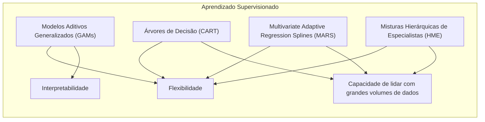
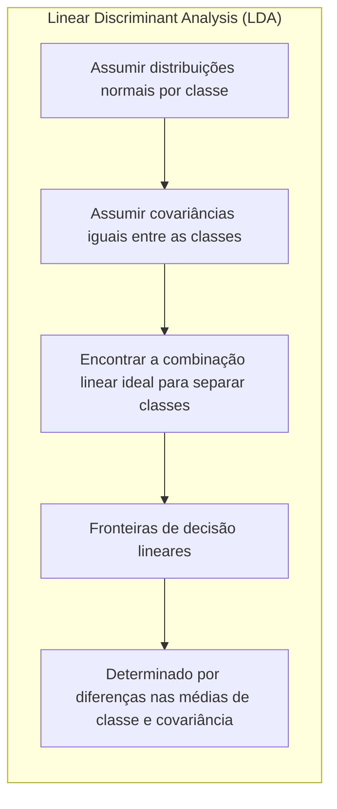
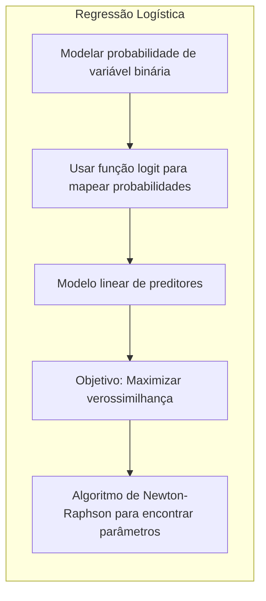
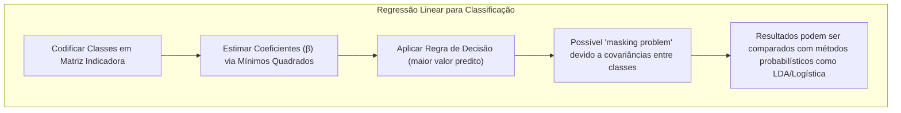
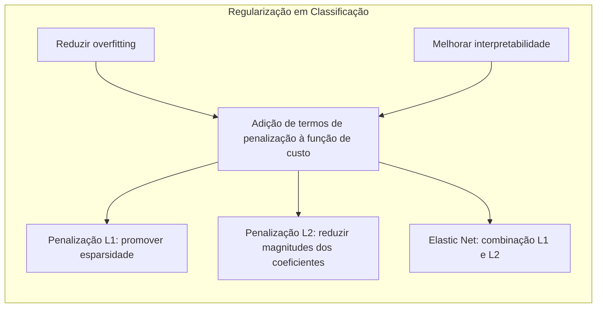
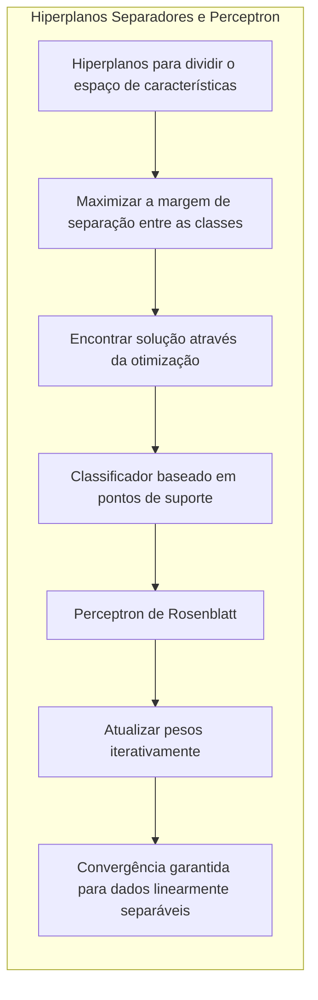
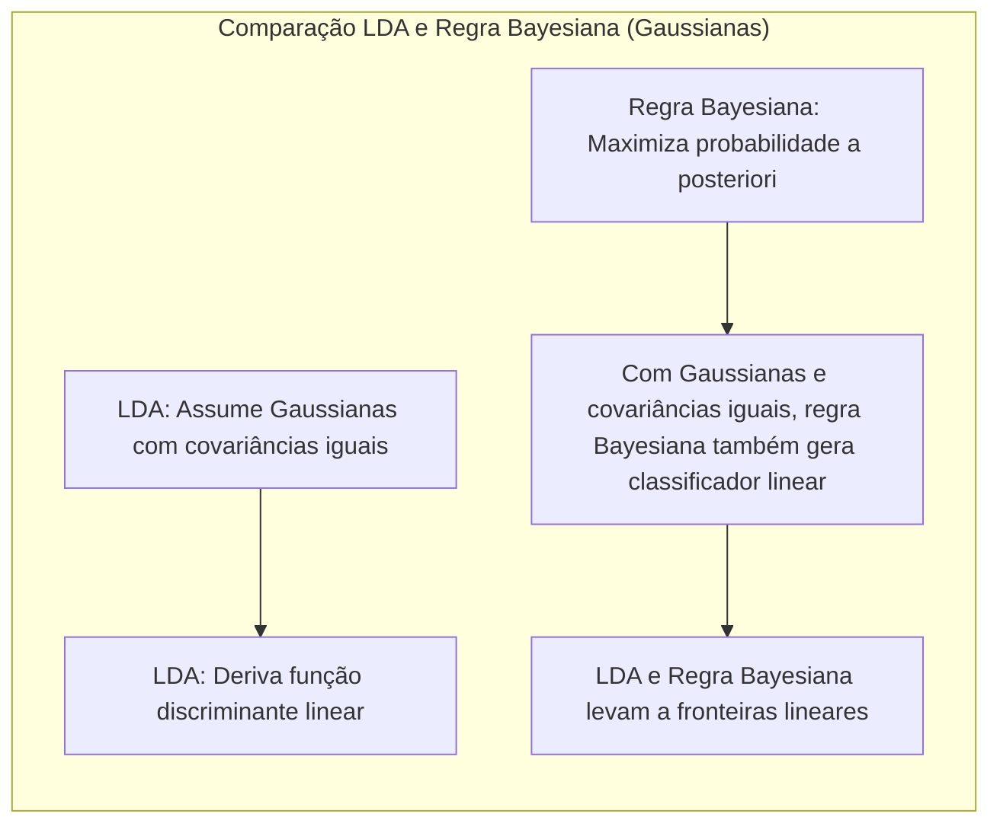

## Título: Modelos Aditivos Generalizados, Árvores e Métodos Relacionados



### Introdução

Este capítulo introduz métodos específicos para o aprendizado supervisionado, explorando como diferentes estruturas de função de regressão lidam com a maldição da dimensionalidade [^9.1]. É crucial entender que ao adotar uma forma estruturada para a função de regressão, corremos o risco de errar a especificação do modelo, criando um compromisso a ser avaliado em cada técnica. A discussão se inicia onde os Capítulos 3-6 terminaram, abordando cinco técnicas relacionadas: Modelos Aditivos Generalizados (GAMs), árvores de decisão, Multivariate Adaptive Regression Splines (MARS), o método de indução de regras de pacientes e misturas hierárquicas de especialistas (HME) [^9.1]. Essas técnicas oferecem abordagens flexíveis para modelar dados, especialmente quando efeitos não lineares são relevantes, abordando problemas que modelos lineares tradicionais muitas vezes não conseguem capturar adequadamente.

### Conceitos Fundamentais

**Conceito 1: O Problema de Classificação e Modelos Lineares**

O problema de classificação busca atribuir um rótulo de classe a uma instância de dados com base em suas características. Modelos lineares, embora simples, são muitas vezes insuficientes para capturar a complexidade das relações não lineares em dados reais [^9.1]. A aplicação de métodos lineares, como a regressão linear em matrizes de indicadores [^4.2], pode introduzir um viés considerável se a verdadeira relação entre as variáveis preditoras e a resposta for não linear. No entanto, esses modelos oferecem a vantagem da interpretabilidade, permitindo entender facilmente o efeito de cada preditor [^4.1]. É essencial notar que, em modelos lineares, um aumento em uma unidade de uma variável preditora sempre resultará na mesma alteração na resposta, independentemente do valor das outras variáveis, o que raramente acontece em dados reais.

> 💡 **Exemplo Numérico:**
>
> Considere um problema de classificação com duas classes (0 e 1) e uma única variável preditora $X$. Se usarmos um modelo linear, a função de decisão poderia ser algo como $f(X) = 0.5X + 0.2$. Nesse caso, se $X$ aumentar de 1 para 2, a predição aumentará em 0.5, independentemente do valor inicial de $X$. No entanto, se a relação real for não linear, como $f(X) = 0.2X^2 + 0.1$, o efeito de um aumento em X varia dependendo do valor de X; por exemplo, de 1 para 2, f(X) aumenta em 0.6, mas de 2 para 3, aumenta em 1.
>
> Isso demonstra que modelos lineares podem ser inadequados quando a relação entre preditores e a variável resposta é não linear.

**Lemma 1:** *A representação de um modelo linear em um espaço de alta dimensão pode ser vista como uma projeção dos dados em um subespaço de menor dimensão onde a decisão de classe é tomada, o que pode ser equivalente, em certas condições, a outras formulações de classificação como LDA*. Este lemma demonstra que, apesar das limitações de modelos lineares no espaço original de alta dimensão, a projeção para um espaço menor e adequado pode gerar classificadores eficientes, conforme aprofundado em [^4.3].

**Conceito 2: Linear Discriminant Analysis (LDA)**



A Linear Discriminant Analysis (LDA) é uma técnica de classificação linear que busca encontrar a melhor combinação linear de preditores para separar diferentes classes [^4.3]. A LDA assume que as classes seguem distribuições normais com covariâncias iguais, o que simplifica o cálculo das fronteiras de decisão [^4.3.1]. As fronteiras de decisão em LDA são lineares e são determinadas pela diferença entre as médias das classes e a covariância compartilhada, conforme detalhado em [^4.3.2]. Ao contrário da regressão linear que tenta modelar a resposta diretamente, a LDA foca em encontrar um hiperplano que separa as classes de forma ótima [^4.3.3]. A LDA é bastante eficiente computacionalmente e útil quando a suposição de normalidade e covariâncias iguais se mantém, porém, pode perder desempenho quando tais suposições são violadas.

> 💡 **Exemplo Numérico:**
>
> Suponha que temos duas classes, A e B, com duas variáveis preditoras, $X_1$ e $X_2$. As médias das classes são $\mu_A = [1, 2]$ e $\mu_B = [3, 4]$, e a matriz de covariância comum é $\Sigma = \begin{bmatrix} 1 & 0.5 \\ 0.5 & 1 \end{bmatrix}$. A fronteira de decisão na LDA é dada por uma linha reta no espaço bidimensional $(X_1, X_2)$. A direção dessa linha é determinada pela diferença entre as médias das classes $(\mu_B - \mu_A) = [2, 2]$, e sua posição é ajustada pela matriz de covariância.
>
> Para classificar um novo ponto, digamos $x = [2.5, 3.5]$, calculamos a distância de Mahalanobis para cada classe:
>
> $d_A(x) = (x - \mu_A)^T \Sigma^{-1} (x - \mu_A)$
> $d_B(x) = (x - \mu_B)^T \Sigma^{-1} (x - \mu_B)$
>
> Calculando $\Sigma^{-1} = \frac{1}{0.75} \begin{bmatrix} 1 & -0.5 \\ -0.5 & 1 \end{bmatrix} = \begin{bmatrix} 1.33 & -0.67 \\ -0.67 & 1.33 \end{bmatrix}$
>
> $d_A(x) = [1.5, 1.5] \begin{bmatrix} 1.33 & -0.67 \\ -0.67 & 1.33 \end{bmatrix} [1.5, 1.5]^T = [1, 1] \begin{bmatrix} 1.5 \\ 1.5 \end{bmatrix} = 3$
>
> $d_B(x) = [-0.5, -0.5] \begin{bmatrix} 1.33 & -0.67 \\ -0.67 & 1.33 \end{bmatrix} [-0.5, -0.5]^T = [-0.33, -0.33] \begin{bmatrix} -0.5 \\ -0.5 \end{bmatrix} = 0.33$
>
> Como $d_B(x) < d_A(x)$, classificamos o ponto $x$ como pertencente à classe B.

**Corolário 1:** *Em LDA, quando as covariâncias das classes são iguais, a função discriminante linear é equivalente a projetar os dados em uma direção que maximiza a separação entre as médias das classes, minimizando a variância dentro das classes*. Isso garante que a projeção linear preservará as características de separabilidade dos dados. [^4.3.1]

**Conceito 3: Regressão Logística**



A regressão logística é um método estatístico que modela a probabilidade de uma variável binária (ou seja, duas classes) como uma função linear dos preditores [^4.4]. A regressão logística utiliza a função *logit*, que transforma probabilidades de 0 a 1 em um intervalo de -∞ a +∞, permitindo modelar a probabilidade usando uma combinação linear dos preditores [^4.4.1]. O objetivo é encontrar os parâmetros que maximizam a verossimilhança dos dados observados, o que é geralmente feito através do algoritmo de Newton-Raphson [^4.4.2], [^4.4.3]. A regressão logística é amplamente utilizada devido à sua capacidade de modelar probabilidades, interpretabilidade dos parâmetros, e eficácia para classificar dados [^4.4.4], [^4.4.5].

> 💡 **Exemplo Numérico:**
>
> Considere um problema de classificação binária com uma variável preditora $X$. O modelo de regressão logística é dado por:
>
> $P(Y=1|X) = \frac{1}{1 + e^{-(\beta_0 + \beta_1 X)}}$
>
> Suponha que os parâmetros estimados sejam $\beta_0 = -2$ e $\beta_1 = 1$. Se $X = 2$, então:
>
> $P(Y=1|X=2) = \frac{1}{1 + e^{-(-2 + 1 \times 2)}} = \frac{1}{1 + e^{0}} = \frac{1}{1 + 1} = 0.5$
>
> Se $X = 3$, então:
>
> $P(Y=1|X=3) = \frac{1}{1 + e^{-(-2 + 1 \times 3)}} = \frac{1}{1 + e^{-1}} \approx \frac{1}{1 + 0.368} \approx 0.731$
>
> Isso mostra que, à medida que $X$ aumenta, a probabilidade de $Y=1$ também aumenta. A função logística garante que as probabilidades permaneçam entre 0 e 1.

> ⚠️ **Nota Importante**: A regressão logística fornece uma estimativa da probabilidade de uma instância pertencer a uma classe, diferentemente da LDA que fornece uma função de decisão baseada na distância às médias de cada classe. [^4.4.1]

> ❗ **Ponto de Atenção**: A regressão logística, ao lidar com classes não-balanceadas, pode levar a estimativas tendenciosas da probabilidade de classe. É importante usar técnicas de rebalanceamento ou ajustar os pesos das classes para mitigar esse efeito. [^4.4.2]

> ✔️ **Destaque**: Em certas condições, as estimativas de parâmetros em LDA e regressão logística podem ser similares, especialmente quando o objetivo principal é a separação das classes, em vez da estimativa precisa das probabilidades. [^4.5]

### Regressão Linear e Mínimos Quadrados para Classificação



**Explicação:** Este diagrama representa o processo de aplicação da regressão linear à classificação usando matrizes de indicadores. Ele detalha os passos desde a codificação das classes até a comparação com outros métodos, conforme mencionado nos tópicos [^4.2] e [^4.1].

A regressão linear pode ser aplicada à classificação através da codificação das classes em uma matriz de indicadores. Cada coluna dessa matriz corresponde a uma classe, onde cada linha representa uma observação com um "1" na coluna da classe correta e "0" nas outras [^4.2]. As limitações desse método incluem a dificuldade em modelar relações não lineares e a possibilidade de extrapolações incorretas que podem produzir probabilidades fora do intervalo [0,1] [^4.2]. O "masking problem" surge quando a correlação entre as classes leva a estimativas imprecisas e problemas na separabilidade [^4.3]. Isso acontece quando as fronteiras de decisão baseadas em regressão de indicadores podem ser afetadas pelas covariâncias entre as classes, levando a um desempenho de classificação subótimo.

> 💡 **Exemplo Numérico:**
>
> Suponha que temos três classes (A, B, C) e uma variável preditora $X$. Criamos uma matriz de indicadores onde cada classe tem sua coluna. Se tivermos 5 amostras, a matriz de indicadores $Y$ pode ser algo como:
>
> ```
>       A  B  C
>   1:  1  0  0
>   2:  0  1  0
>   3:  0  0  1
>   4:  1  0  0
>   5:  0  1  0
> ```
>
> E nossa matriz de preditores $X$ (com uma coluna de 1s para o intercepto) pode ser:
>
> ```
>       1   X
>   1:  1  1.2
>   2:  1  2.5
>   3:  1  3.1
>   4:  1  1.8
>   5:  1  2.8
> ```
>
> Para estimar os coeficientes $\beta$, usamos a fórmula $\beta = (X^TX)^{-1}X^TY$. Este processo é realizado separadamente para cada coluna da matriz $Y$. A predição para uma nova observação $X_{new}$ é feita calculando $X_{new}\beta$, e a classe predita é aquela com o maior valor na predição. Uma limitação é que os valores preditos podem não estar dentro do intervalo [0,1], e as classes podem não ser bem separadas se as covariâncias causarem o "masking effect".

**Lemma 2:** *Em certos cenários, as projeções nos hiperplanos de decisão gerados pela regressão linear na matriz de indicadores podem ser equivalentes às projeções geradas por discriminantes lineares, desde que as classes sejam bem separadas e as covariâncias não causem o "masking effect"*. Este lemma mostra que sob condições específicas, a regressão linear pode se aproximar de outros métodos lineares mais adequados para a classificação, detalhado em [^4.2].

**Corolário 2:** *A equivalência entre a regressão linear de indicadores e discriminantes lineares implica que, em problemas com alta separabilidade, a regressão linear pode ser uma alternativa computacionalmente mais simples, evitando a necessidade de calcular as médias e covariâncias separadamente, como faz a LDA*. [^4.3]

Em comparação com a regressão logística [^4.4], a regressão linear de indicadores pode ser menos adequada para estimar probabilidades precisas, mas pode ser suficiente para definir fronteiras de decisão lineares quando o foco está na classificação [^4.2]. Enquanto a regressão logística usa a função sigmoide para gerar probabilidades dentro do intervalo [0,1], a regressão de indicadores não impõe essa restrição, o que pode levar a estimativas fora desse intervalo [^4.4]. No entanto, em situações onde a fronteira de decisão linear é a principal preocupação, a regressão de indicadores pode ser uma opção computacionalmente mais simples e eficiente.

### Métodos de Seleção de Variáveis e Regularização em Classificação



A seleção de variáveis e regularização são cruciais para evitar overfitting e melhorar a interpretabilidade dos modelos de classificação [^4.5]. A regularização, particularmente em modelos como a regressão logística, envolve a adição de termos de penalização à função de custo [^4.4.4]. A penalização L1, por exemplo, adiciona um termo proporcional à soma dos valores absolutos dos coeficientes [^4.5], promovendo a esparsidade do modelo, eliminando variáveis menos relevantes [^4.5.1]. A penalização L2 adiciona um termo proporcional ao quadrado da soma dos coeficientes [^4.5], reduzindo a magnitude dos coeficientes e melhorando a estabilidade do modelo [^4.5.2]. A combinação de ambas as penalizações (Elastic Net) também é uma abordagem comum para balancear esses efeitos. A regularização é especialmente importante quando se lida com um grande número de preditores ou quando há alta correlação entre as variáveis.

> 💡 **Exemplo Numérico:**
>
> Considere um modelo de regressão logística com 5 preditores ($X_1, X_2, X_3, X_4, X_5$). Sem regularização, os coeficientes podem ser $\beta = [0.8, -1.2, 0.5, 2.1, -0.3]$.
>
> Com penalização L1 ($\lambda = 0.5$), a função de custo é:
> $L(\beta) = - \sum_{i=1}^N [y_i \log(p(x_i)) + (1-y_i) \log(1-p(x_i))] + 0.5 \sum_{j=1}^5 |\beta_j|$
>
> Após otimização, alguns coeficientes podem se tornar zero, como $\beta_{L1} = [0.6, -0.9, 0, 1.8, 0]$. Isso mostra que $X_3$ e $X_5$ foram considerados menos relevantes e seus coeficientes foram zerados.
>
> Com penalização L2 ($\lambda = 0.5$), a função de custo é:
> $L(\beta) = - \sum_{i=1}^N [y_i \log(p(x_i)) + (1-y_i) \log(1-p(x_i))] + 0.5 \sum_{j=1}^5 \beta_j^2$
>
> Os coeficientes são reduzidos, como $\beta_{L2} = [0.5, -0.8, 0.3, 1.5, -0.2]$. Os coeficientes não são zerados, mas têm suas magnitudes reduzidas, aumentando a estabilidade do modelo.
>
> A escolha entre L1 e L2 depende do problema. L1 é útil para seleção de variáveis, enquanto L2 ajuda a evitar overfitting e melhorar a estabilidade do modelo.

**Lemma 3:** *A penalização L1 na regressão logística induz soluções esparsas, ou seja, vários coeficientes tendem a ser exatamente zero. Essa esparsidade facilita a identificação das variáveis preditoras mais importantes e melhora a interpretabilidade do modelo*. [^4.4.4]

**Prova do Lemma 3:** A penalização L1 adiciona um termo à função de custo que é proporcional à soma dos valores absolutos dos coeficientes. A minimização da função de custo com penalização L1 força alguns coeficientes a serem exatamente zero, pois a função de valor absoluto tem um "pico" na origem e, dependendo da magnitude da penalização, o mínimo pode ocorrer quando alguns coeficientes são exatamente zero. Isso acontece porque a derivada da função de valor absoluto não está definida na origem, causando um "empurrão" nos coeficientes que os leva até zero. A função de custo total é dada por: $$ L(\beta) = - \sum_{i=1}^N [y_i \log(p(x_i)) + (1-y_i) \log(1-p(x_i))] + \lambda \sum_{j=1}^p |\beta_j| $$. A otimização desta função leva a soluções com muitos $\beta_j$ iguais a zero. $\blacksquare$

**Corolário 3:** *A esparsidade induzida pela penalização L1 em modelos de classificação não só reduz a complexidade do modelo, como também possibilita uma melhor compreensão das variáveis preditoras mais influentes, facilitando a interpretação dos resultados e a tomada de decisões*. [^4.4.5]

> ⚠️ **Ponto Crucial**: A combinação de penalizações L1 e L2, conhecida como Elastic Net, oferece um meio termo entre a esparsidade e a estabilidade do modelo, permitindo um ajuste fino do balanço entre as duas abordagens [^4.5].

### Separating Hyperplanes e Perceptrons



Hiperplanos separadores são usados para dividir o espaço de características em regiões distintas, atribuindo cada região a uma classe específica. A ideia principal é encontrar o hiperplano que maximize a margem de separação entre as classes, levando a um classificador mais robusto [^4.5.2]. A formulação matemática para encontrar um hiperplano ótimo envolve um problema de otimização, que pode ser resolvido usando o dual de Wolfe [^4.5.2]. A solução do problema de otimização resulta em um classificador baseado em combinações lineares dos pontos de suporte, ou seja, aqueles pontos que definem a margem de separação [^4.5.2]. O Perceptron de Rosenblatt, é um algoritmo clássico que busca iterativamente um hiperplano separador para dados linearmente separáveis [^4.5.1]. Este algoritmo atualiza os pesos com base em classificações incorretas, e sob certas condições, converge para uma solução que separa as classes corretamente [^4.5.1]. A convergência do Perceptron é garantida sob a hipótese de linear separabilidade dos dados, mas pode não convergir ou levar a soluções subótimas para dados não linearmente separáveis.

> 💡 **Exemplo Numérico:**
>
> Considere um problema de classificação com duas classes (A e B) e duas variáveis preditoras ($X_1$ e $X_2$). O perceptron busca encontrar um hiperplano (neste caso, uma linha) da forma $w_0 + w_1X_1 + w_2X_2 = 0$ que separa as classes.
>
> 1. **Inicialização:** Começamos com pesos aleatórios, por exemplo, $w = [0.1, -0.2, 0.3]$.
> 2. **Iteração:** Para cada amostra $(x_i, y_i)$, onde $y_i$ é a classe correta (-1 ou 1) e $x_i$ são os valores de $X_1$ e $X_2$:
>    - Calculamos a predição: $pred = w_0 + w_1x_{i1} + w_2x_{i2}$
>    - Se $pred \times y_i \leq 0$ (classificação incorreta), atualizamos os pesos: $w = w + \eta \cdot y_i \cdot [1, x_{i1}, x_{i2}]$, onde $\eta$ é a taxa de aprendizado (ex: 0.1).
>
> Vamos supor que tenhamos uma amostra $x = [2, 1]$ e $y = 1$. A predição inicial é $pred = 0.1 - 0.2 * 2 + 0.3 * 1 = 0$. Como $pred * y = 0$, consideramos uma classificação incorreta e atualizamos os pesos:
> $w = [0.1, -0.2, 0.3] + 0.1 * 1 * [1, 2, 1] = [0.2, 0, 0.4]$.
>
> O algoritmo continua iterando sobre as amostras até que todas sejam classificadas corretamente. A convergência é garantida se os dados forem linearmente separáveis.

### Pergunta Teórica Avançada: Quais as diferenças fundamentais entre a formulação de LDA e a Regra de Decisão Bayesiana considerando distribuições Gaussianas com covariâncias iguais?

**Resposta:**

A Linear Discriminant Analysis (LDA) e a Regra de Decisão Bayesiana com distribuições gaussianas e covariâncias iguais compartilham semelhanças, mas também possuem diferenças sutis. Ambas as abordagens buscam classificar observações em classes distintas com base em suas probabilidades condicionais, mas partem de formulações um pouco diferentes [^4.3].

A LDA assume que cada classe segue uma distribuição normal multivariada com uma matriz de covariância comum para todas as classes. O classificador LDA deriva uma função discriminante linear que maximiza a separação entre as classes e projeta os dados em um espaço de dimensão reduzida. Essa função discriminante linear é derivada com base nas médias das classes e na matriz de covariância comum [^4.3], [^4.3.1].

A Regra de Decisão Bayesiana, por outro lado, classifica uma observação na classe que maximiza a probabilidade a posteriori dessa observação dada a classe. Quando as classes seguem distribuições gaussianas com covariâncias iguais, essa regra se simplifica a um classificador linear similar àquele derivado na LDA. Ou seja, ambas as abordagens levam a fronteiras lineares para a separação de classes [^4.3], [^4.3.3].



**Lemma 4:** *Sob a hipótese de distribuições Gaussianas com covariâncias iguais, a regra de decisão da LDA e a regra de decisão Bayesiana levam a fronteiras de decisão idênticas, pois ambas maximizam a probabilidade a posteriori de uma observação pertencer a uma classe.* [^4.3], [^4.3.3]

**Corolário 4:** *Ao relaxar a hipótese de covariâncias iguais, a regra de decisão Bayesiana resulta em fronteiras de decisão quadráticas, levando ao classificador Quadratic Discriminant Analysis (QDA), que pode modelar relações mais complexas nos dados*. [^4.3]

> ⚠️ **Ponto Crucial**: A escolha entre LDA e QDA depende crucialmente da adequação da suposição de igualdade das matrizes de covariância. Se as covariâncias forem muito diferentes, QDA pode ser mais adequado, apesar do aumento na complexidade do modelo. [^4.3.1], [^4.3]

As perguntas teóricas acima são desafiadoras, pois exigem uma compreensão profunda das bases matemáticas e estatísticas de cada método. É crucial que a resposta inclua todos os detalhes e as provas necessárias para demonstrar a relação entre as abordagens.

### Conclusão

Em resumo, este capítulo explorou uma variedade de métodos de aprendizado supervisionado, cada um com suas particularidades, vantagens e desvantagens. Os modelos aditivos generalizados (GAMs) oferecem uma extensão da modelagem linear tradicional, permitindo a incorporação de efeitos não lineares sem sacrificar a interpretabilidade. Árvores de decisão, apesar de sua capacidade para modelar relações não lineares, apresentam limitações em cenários de alta dimensionalidade e para capturar interações complexas. Métodos como MARS e HME buscam superar essas limitações através de modelagens mais flexíveis e computacionalmente eficientes, apresentando alternativas para dados complexos. É essencial entender que não existe um método universalmente superior, e a escolha do método mais adequado deve ser guiada pela natureza dos dados, pelos objetivos da análise e pela necessidade de interpretabilidade do modelo.

### Footnotes

[^4.1]: "In this chapter we begin our discussion of some specific methods for super-vised learning. These techniques each assume a (different) structured form for the unknown regression function, and by doing so they finesse the curse of dimensionality. Of course, they pay the possible price of misspecifying the model, and so in each case there is a tradeoff that has to be made." *(Trecho de "Additive Models, Trees, and Related Methods")*

[^4.2]: "Regression models play an important role in many data analyses, providing prediction and classification rules, and data analytic tools for understand-ing the importance of different inputs." *(Trecho de "Additive Models, Trees, and Related Methods")*

[^4.3]: "In this section we describe a modular algorithm for fitting additive models and their generalizations. The building block is the scatterplot smoother for fitting nonlinear effects in a flexible way. For concreteness we use as our scatterplot smoother the cubic smoothing spline described in Chapter 5." *(Trecho de "Additive Models, Trees, and Related Methods")*

[^4.3.1]:  "The additive model has the form $Y = \alpha + \sum_{j=1}^p f_j(X_j) + \varepsilon$, where the error term $\varepsilon$ has mean zero." * (Trecho de "Additive Models, Trees, and Related Methods")*

[^4.3.2]:   "Given observations $x_i, y_i$, a criterion like the penalized sum of squares (5.9) of Section 5.4 can be specified for this problem, $PRSS(\alpha, f_1, f_2,\ldots, f_p) = \sum_i^N (y_i - \alpha - \sum_j^p f_j(x_{ij}))^2 + \sum_j^p \lambda_j \int(f_j''(t_j))^2 dt_j$" * (Trecho de "Additive Models, Trees, and Related Methods")*

[^4.3.3]: "where the $\lambda_j > 0$ are tuning parameters. It can be shown that the minimizer of (9.7) is an additive cubic spline model; each of the functions $f_j$ is a cubic spline in the component $X_j$, with knots at each of the unique values of $x_{ij}$, $i = 1,\ldots, N$." *(Trecho de "Additive Models, Trees, and Related Methods")*

[^4.4]: "For two-class classification, recall the logistic regression model for binary data discussed in Section 4.4. We relate the mean of the binary response $\mu(X) = Pr(Y = 1|X)$ to the predictors via a linear regression model and the logit link function:  $\log(\mu(X)/(1 – \mu(X)) = \alpha + \beta_1 X_1 + \ldots + \beta_pX_p$." * (Trecho de "Additive Models, Trees, and Related Methods")*

[^4.4.1]: "The additive logistic regression model replaces each linear term by a more general functional form: $\log(\mu(X)/(1 – \mu(X))) = \alpha + f_1(X_1) + \cdots + f_p(X_p)$, where again each $f_j$ is an unspecified smooth function." * (Trecho de "Additive Models, Trees, and Related Methods")*

[^4.4.2]: "While the non-parametric form for the functions $f_j$ makes the model more flexible, the additivity is retained and allows us to interpret the model in much the same way as before. The additive logistic regression model is an example of a generalized additive model." *(Trecho de "Additive Models, Trees, and Related Methods")*

[^4.4.3]: "In general, the conditional mean $\mu(X)$ of a response $Y$ is related to an additive function of the predictors via a link function $g$:  $g[\mu(X)] = \alpha + f_1(X_1) + \cdots + f_p(X_p)$." *(Trecho de "Additive Models, Trees, and Related Methods")*

[^4.4.4]:  "Examples of classical link functions are the following: $g(\mu) = \mu$ is the identity link, used for linear and additive models for Gaussian response data." *(Trecho de "Additive Models, Trees, and Related Methods")*

[^4.4.5]: "$g(\mu) = \text{logit}(\mu)$ as above, or $g(\mu) = \text{probit}(\mu)$, the probit link function, for modeling binomial probabilities. The probit function is the inverse Gaussian cumulative distribution function: $\text{probit}(\mu) = \Phi^{-1}(\mu)$." *(Trecho de "Additive Models, Trees, and Related Methods")*

[^4.5]: "All three of these arise from exponential family sampling models, which in addition include the gamma and negative-binomial distributions. These families generate the well-known class of generalized linear models, which are all extended in the same way to generalized additive models." *(Trecho de "Additive Models, Trees, and Related Methods")*

[^4.5.1]: "The functions $f_j$ are estimated in a flexible manner, using an algorithm whose basic building block is a scatterplot smoother. The estimated func-tion $f_j$ can then reveal possible nonlinearities in the effect of $X_j$. Not all of the functions $f_j$ need to be nonlinear." *(Trecho de "Additive Models, Trees, and Related Methods")*

[^4.5.2]: "We can easily mix in linear and other parametric forms with the nonlinear terms, a necessity when some of the inputs are qualitative variables (factors)." *(Trecho de "Additive Models, Trees, and Related Methods")*
