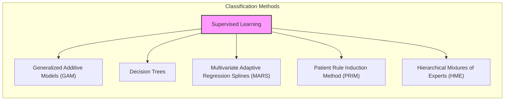
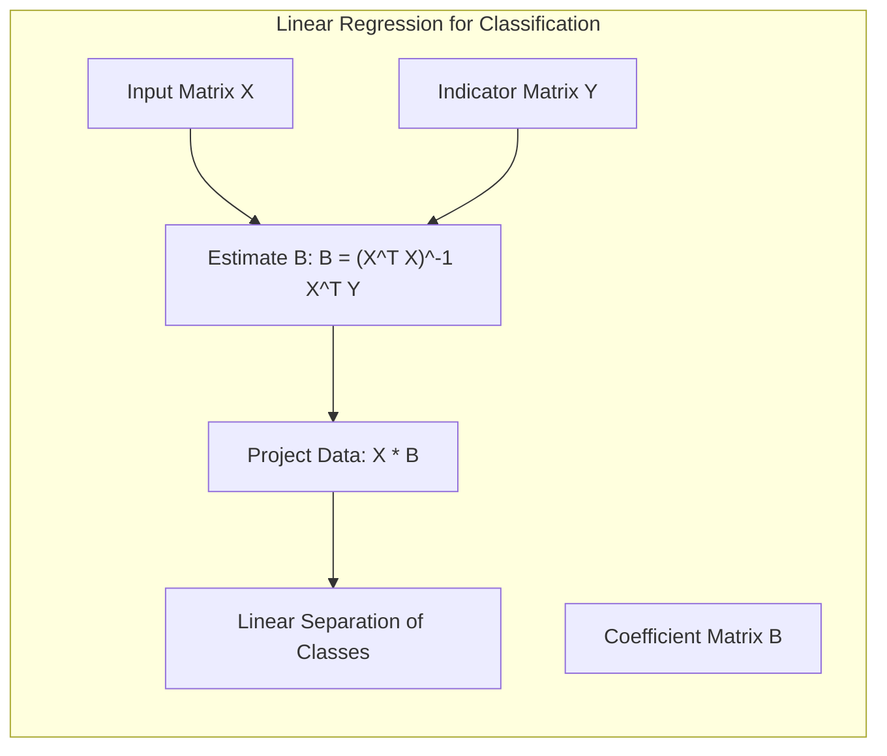
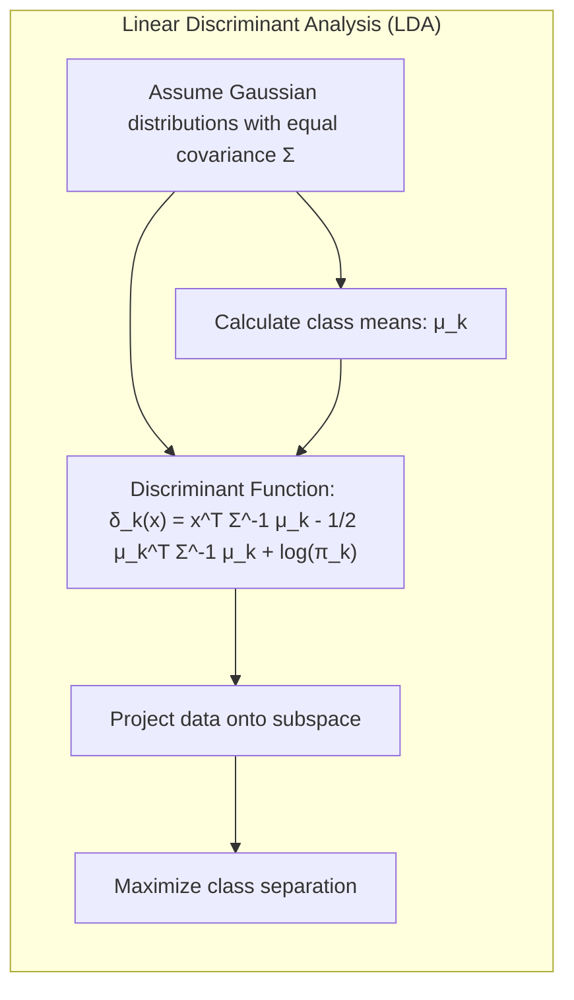
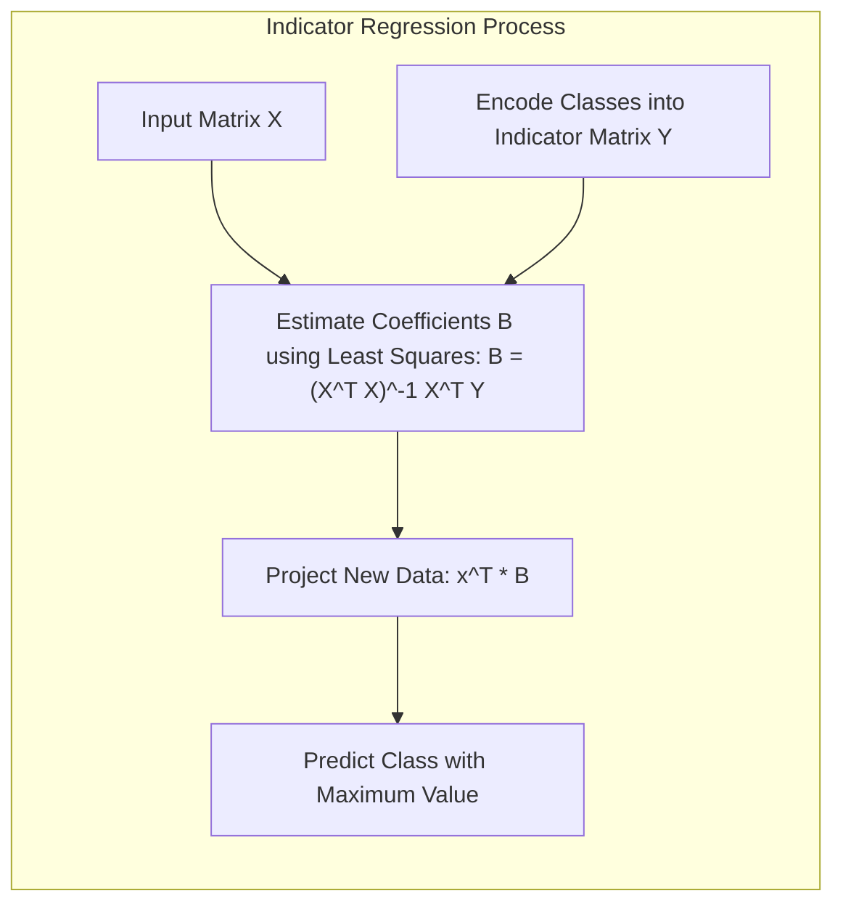
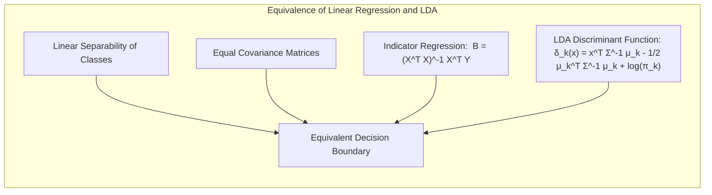
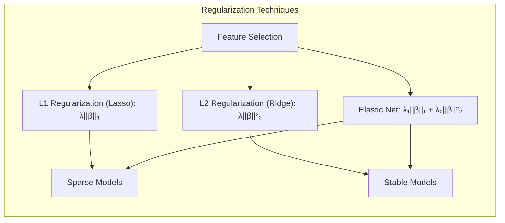
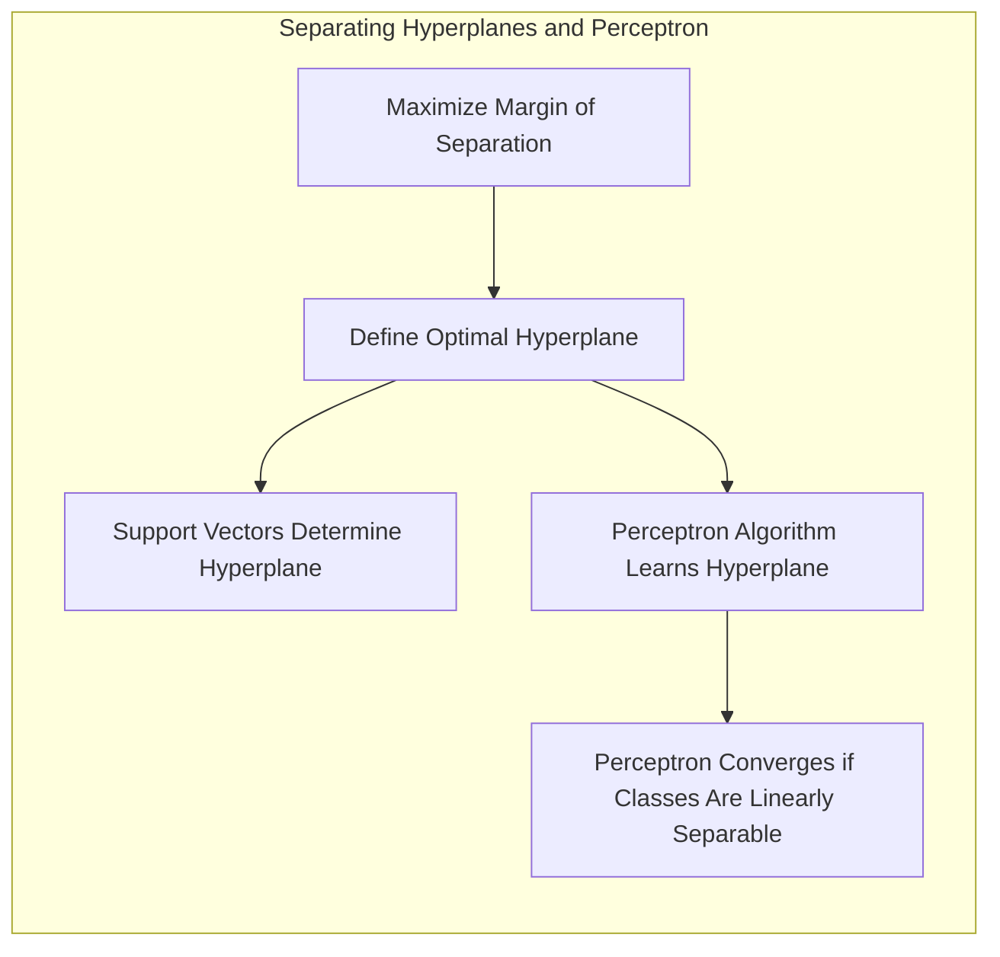
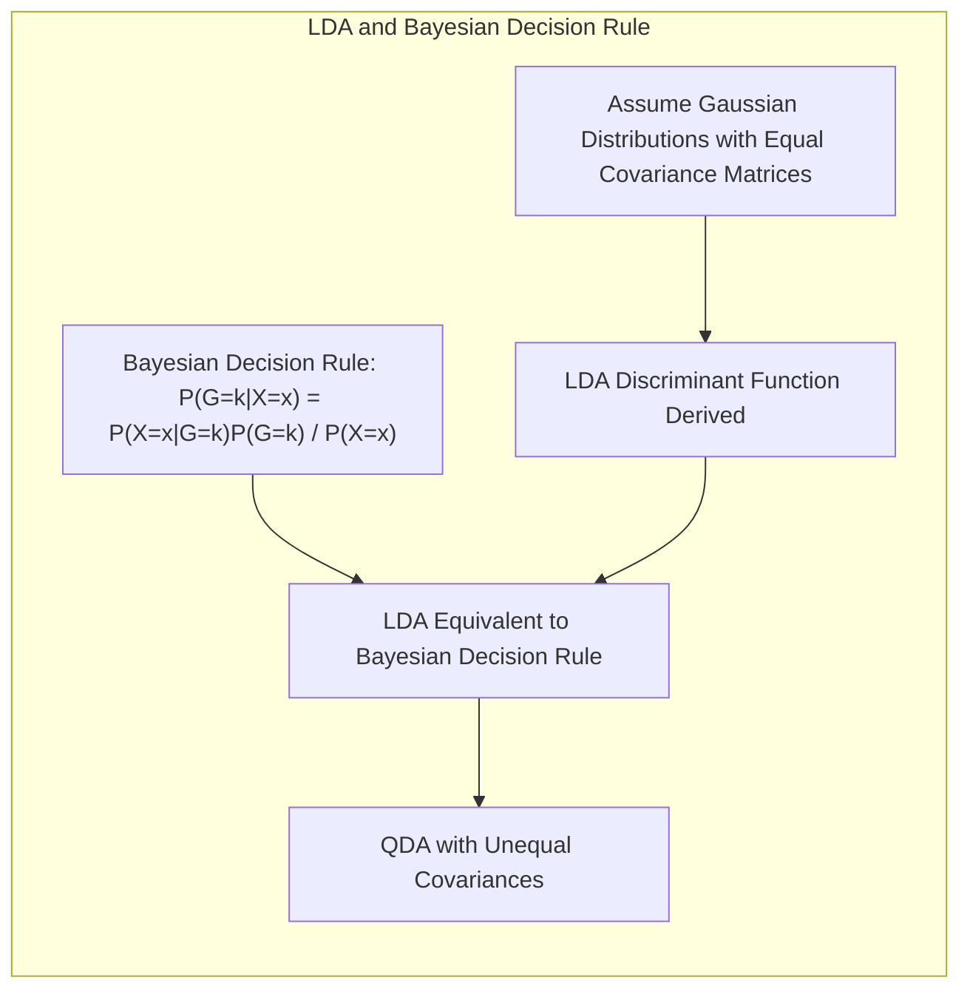

## Título: Modelos Aditivos Generalizados, Árvores e Métodos Relacionados para Classificação

### Introdução

Este capítulo explora métodos específicos para **aprendizado supervisionado**, cada um assumindo uma forma estruturada diferente para a função de regressão desconhecida, oferecendo soluções para a **maldição da dimensionalidade** [^9.1]. É fundamental entender que existe um *trade-off* entre a complexidade do modelo e o risco de misspecificação. Os métodos abordados são extensões dos temas apresentados nos capítulos 3 a 6, incluindo **modelos aditivos generalizados**, **árvores de decisão**, **splines de regressão adaptativa multivariada (MARS)**, o método de indução de regras do paciente (PRIM) e misturas hierárquicas de especialistas (HME). O foco é entender como esses modelos podem ser aplicados em problemas de classificação.

### Conceitos Fundamentais

**Conceito 1:** O **problema de classificação** busca atribuir uma classe ou categoria a uma dada observação com base em suas características. Métodos lineares, embora simples, podem ser inadequados para modelar relações complexas e não lineares presentes em dados reais [^9.1]. A escolha de um método linear implica um *trade-off* entre viés e variância. Modelos com muitos parâmetros podem se ajustar bem aos dados de treinamento, mas podem não generalizar bem para novos dados, um exemplo claro de alta variância. Já modelos com menos parâmetros podem apresentar alto viés, não capturando adequadamente a complexidade dos dados. É crucial entender como a estrutura linear afeta esse balanço, pois pode simplificar demais o problema, levando a soluções subótimas, ou o oposto, levando a overfitting.

> 💡 **Exemplo Numérico:**
> Considere um problema de classificação binária (classe 0 e 1) com duas variáveis preditoras, $x_1$ e $x_2$. Um modelo linear simples poderia ser $p(x) = \beta_0 + \beta_1 x_1 + \beta_2 x_2$. Se os dados reais mostram que a classe 1 ocorre quando $x_1^2 + x_2^2 > 1$, um modelo linear como este terá um viés alto, pois não consegue capturar essa relação não linear. Por outro lado, um modelo muito complexo, como um polinômio de alta ordem, pode se ajustar perfeitamente aos dados de treinamento, mas com alta variância, falhando em generalizar para novos dados. Um modelo com um termo quadrático $p(x) = \beta_0 + \beta_1 x_1 + \beta_2 x_2 + \beta_3 x_1^2 + \beta_4 x_2^2$ pode ajustar os dados melhor, mas ainda pode sofrer de overfitting se a complexidade for muito alta.

**Lemma 1:** Dado um conjunto de dados de classificação, a **regressão linear da matriz indicadora** pode ser vista como uma aproximação para a construção de **funções discriminantes lineares**, com coeficientes estimados por mínimos quadrados. Em cenários onde as classes são bem separadas, esta aproximação pode gerar resultados comparáveis ao LDA.

$$
\hat{Y} = XB
$$

Onde $\hat{Y}$ é a matriz de indicadores de classe, $X$ é a matriz de preditores, e $B$ são os coeficientes estimados. Ao projetar os dados no espaço gerado pelas colunas de $B$, os pontos de diferentes classes se agrupam linearmente. A matriz $B$ pode ser utilizada para definir os **hiperplanos de decisão**.

**Conceito 2:** A **Linear Discriminant Analysis (LDA)**, como abordado em capítulos anteriores, assume que os dados para cada classe seguem uma distribuição normal multivariada com a mesma matriz de covariância [^4.3]. A **fronteira de decisão** entre duas classes, na LDA, é linear e definida com base nas médias e covariâncias das classes [^4.3.1]. O LDA busca encontrar a combinação linear das variáveis que melhor separe as classes, maximizando a separação entre as médias das classes e minimizando a variabilidade dentro de cada classe [^4.3.2]. A formulação da função discriminante na LDA é dada por:

$$
\delta_k(x) = x^T \Sigma^{-1} \mu_k - \frac{1}{2}\mu_k^T\Sigma^{-1}\mu_k + \log \pi_k
$$

Onde $\mu_k$ é a média da classe k, $\Sigma$ é a matriz de covariância comum e $\pi_k$ é a probabilidade a priori da classe k [^4.3.3].

> 💡 **Exemplo Numérico:**
> Suponha que temos duas classes, A e B, com médias $\mu_A = [1, 1]^T$ e $\mu_B = [3, 3]^T$, e uma matriz de covariância comum $\Sigma = \begin{bmatrix} 1 & 0 \\ 0 & 1 \end{bmatrix}$. Assumindo probabilidades a priori iguais $\pi_A = \pi_B = 0.5$, a função discriminante para a classe A é:
>
> $\delta_A(x) = x^T \begin{bmatrix} 1 & 0 \\ 0 & 1 \end{bmatrix}^{-1} \begin{bmatrix} 1 \\ 1 \end{bmatrix} - \frac{1}{2} \begin{bmatrix} 1 & 1 \end{bmatrix} \begin{bmatrix} 1 & 0 \\ 0 & 1 \end{bmatrix}^{-1} \begin{bmatrix} 1 \\ 1 \end{bmatrix} + \log(0.5)$
>
> $\delta_A(x) = x_1 + x_2 - \frac{1}{2}(1 + 1) + \log(0.5) = x_1 + x_2 - 1 + \log(0.5)$
>
> Similarmente, para a classe B:
>
> $\delta_B(x) = x_1 + x_2 - \frac{1}{2}(9 + 9) + \log(0.5) = x_1 + x_2 - 9 + \log(0.5)$
>
> Um ponto $x = [2, 2]^T$ seria classificado como classe A porque $\delta_A([2, 2]) = 2 + 2 - 1 + \log(0.5) \approx 2.307$ é maior que $\delta_B([2, 2]) = 2 + 2 - 9 + \log(0.5) \approx -5.693$. A fronteira de decisão é onde $\delta_A(x) = \delta_B(x)$, que simplifica para $x_1+x_2 = 5$, um hiperplano linear.

**Corolário 1:** Se as classes seguem uma distribuição normal com covariâncias iguais, a função discriminante do LDA pode ser interpretada como uma projeção dos dados em um subespaço de dimensão menor, onde a separação entre as classes é maximizada. Este resultado surge da minimização da distância de Mahalanobis entre as observações e as médias de cada classe [^4.3.1].

**Conceito 3:** A **Regressão Logística** modela a probabilidade de uma observação pertencer a uma classe usando uma função logística da combinação linear dos preditores [^4.4]. O modelo logístico é dado por:

$$
\log\left(\frac{p(x)}{1-p(x)}\right) = \beta_0 + \beta_1x_1 + \dots + \beta_px_p
$$

Onde $p(x)$ é a probabilidade da classe 1, e os $\beta_i$ são os coeficientes do modelo [^4.4.1]. Os parâmetros são estimados maximizando a verossimilhança [^4.4.3]. Diferentemente do LDA, a regressão logística não assume normalidade dos preditores [^4.4.2]. Ambos os métodos, LDA e regressão logística, buscam encontrar separações lineares, mas a regressão logística estima probabilidades condicionais e pode ser mais apropriada quando o interesse está em probabilidades, e não em funções discriminantes. Em casos onde as classes são separáveis, os resultados podem ser semelhantes, mas a logística tende a ser mais robusta a desvios da normalidade [^4.4.5].

> 💡 **Exemplo Numérico:**
> Suponha um modelo logístico com dois preditores: $\log\left(\frac{p(x)}{1-p(x)}\right) = -2 + 1.5x_1 - 0.8x_2$. Se $x = [x_1, x_2] = [1, 2]$, então:
>
> $\log\left(\frac{p(x)}{1-p(x)}\right) = -2 + 1.5(1) - 0.8(2) = -2 + 1.5 - 1.6 = -2.1$
>
> $\frac{p(x)}{1-p(x)} = e^{-2.1} \approx 0.122$
>
> $p(x) = 0.122(1 - p(x))$
>
> $p(x) = 0.122 - 0.122p(x)$
>
> $1.122p(x) = 0.122$
>
> $p(x) = \frac{0.122}{1.122} \approx 0.109$
>
> A probabilidade de pertencer à classe 1 é aproximadamente 0.109 para este ponto. Se um outro ponto, $x = [3, 0]$, fosse avaliado:
>
> $\log\left(\frac{p(x)}{1-p(x)}\right) = -2 + 1.5(3) - 0.8(0) = -2 + 4.5 = 2.5$
>
> $p(x) = \frac{e^{2.5}}{1 + e^{2.5}} \approx 0.924$
>
> A probabilidade de pertencer à classe 1 é aproximadamente 0.924. A regressão logística modela a probabilidade de pertencer a uma classe com base na combinação linear dos preditores.

> ⚠️ **Nota Importante**: Modelos de classificação linear podem não ser adequados quando as relações entre as variáveis e as classes são não lineares. A escolha do modelo deve considerar a natureza dos dados e o objetivo da análise. **Referência ao tópico [^4.4.1]**.

> ❗ **Ponto de Atenção**: Classes desbalanceadas podem influenciar a performance dos modelos lineares, especialmente na regressão logística. Técnicas de balanceamento ou uso de pesos podem ser necessárias. **Conforme indicado em [^4.4.2]**.

> ✔️ **Destaque**: Há uma correlação entre as estimativas de parâmetros em LDA e em regressão logística em casos onde as classes são separáveis linearmente. **Baseado no tópico [^4.5]**.

### Regressão Linear e Mínimos Quadrados para Classificação

A **regressão linear de uma matriz indicadora** é uma abordagem para classificação onde cada classe é representada por um vetor de indicadores binários, e a regressão linear é aplicada a cada um desses indicadores [^4.2]. Essa abordagem busca modelar a probabilidade de pertencimento a uma classe, por meio de uma combinação linear das variáveis preditoras. No entanto, esta abordagem possui limitações, como o “masking problem”, onde a influência de variáveis preditoras pode ser encoberta pela dependência entre classes [^4.3].

Em problemas de classificação com K classes, a matriz de resposta $Y$  pode ser representada por uma matriz $N \times K$, onde $N$ é o número de amostras e cada linha $i$ é um vetor com um único "1" na coluna da classe correspondente a essa amostra, e "0" nas demais. O modelo de regressão linear para essa matriz é dado por:

$$
Y = XB + E
$$

onde $X$ é a matriz de preditores, $B$ é a matriz de coeficientes a ser estimada por mínimos quadrados, e $E$ é a matriz de erros. A solução para $B$ é dada por:

$$
\hat{B} = (X^TX)^{-1}X^TY
$$

Após estimar os coeficientes, a classe predita para uma nova amostra $x$ é aquela com maior valor na projeção $x^T\hat{B}$. Embora essa abordagem possa gerar boas soluções, ela não garante que as probabilidades estimadas estejam entre 0 e 1.

> 💡 **Exemplo Numérico:**
> Considere um problema de classificação com 3 classes e 2 preditores. Temos 5 amostras com os seguintes dados:
>
> | Amostra | $x_1$ | $x_2$ | Classe |
> |---|---|---|---|
> | 1 | 1 | 2 | 1 |
> | 2 | 1.5 | 1.5 | 2 |
> | 3 | 2 | 1 | 3 |
> | 4 | 2.5 | 2.5 | 1 |
> | 5 | 3 | 3 | 2 |
>
> A matriz de preditores $X$ (com uma coluna de 1s para o intercepto) e a matriz de indicadores $Y$ são:
>
> $X = \begin{bmatrix} 1 & 1 & 2 \\ 1 & 1.5 & 1.5 \\ 1 & 2 & 1 \\ 1 & 2.5 & 2.5 \\ 1 & 3 & 3 \end{bmatrix}$,  $Y = \begin{bmatrix} 1 & 0 & 0 \\ 0 & 1 & 0 \\ 0 & 0 & 1 \\ 1 & 0 & 0 \\ 0 & 1 & 0 \end{bmatrix}$
>
> Usando a fórmula $\hat{B} = (X^TX)^{-1}X^TY$, podemos calcular os coeficientes.
>
> $X^TX = \begin{bmatrix} 5 & 10 & 10 \\ 10 & 22.5 & 22.5 \\ 10 & 22.5 & 22.5 \end{bmatrix}$
>
> $(X^TX)^{-1} \approx \begin{bmatrix} 4.75 & -2 & -2 \\ -2 & 1 & 0 \\ -2 & 0 & 1 \end{bmatrix}$
>
> $X^TY = \begin{bmatrix} 2 & 2 & 1 \\ 4 & 4.5 & 2 \\ 4 & 4.5 & 2 \end{bmatrix}$
>
> $\hat{B} = (X^TX)^{-1}X^TY \approx \begin{bmatrix} -1.5 & -1.5 & 0.5 \\ 1 & 1 & 0 \\ 1 & 1 & 0 \end{bmatrix}$
>
> Para uma nova amostra $x = [2, 2]$, a projeção seria $x^T\hat{B} = \begin{bmatrix} 1 & 2 & 2 \end{bmatrix} \begin{bmatrix} -1.5 & -1.5 & 0.5 \\ 1 & 1 & 0 \\ 1 & 1 & 0 \end{bmatrix} = \begin{bmatrix} 2.5 & 2.5 & 0.5 \end{bmatrix}$. A classe predita seria a classe 1, pois tem o maior valor.

**Lemma 2:** Se as classes são linearmente separáveis e a matriz de covariância para cada classe é igual, a solução obtida via regressão linear da matriz indicadora é equivalente à solução do LDA, no sentido de que ambos os métodos levam à mesma fronteira de decisão.

**Prova do Lemma 2:** Sob estas condições, a solução de mínimos quadrados para a matriz indicadora $Y$, com a forma:

$$
\hat{B} = (X^TX)^{-1}X^TY
$$

fornece uma estimativa dos coeficientes que são proporcionais aos coeficientes da função discriminante do LDA. A função discriminante do LDA,

$$
\delta_k(x) = x^T \Sigma^{-1} \mu_k - \frac{1}{2}\mu_k^T\Sigma^{-1}\mu_k + \log \pi_k
$$

leva à mesma separação entre as classes. $\blacksquare$

**Corolário 2:** A equivalência entre regressão linear e LDA em casos especiais simplifica a análise, pois a matriz de indicadores permite obter as projeções dos dados nas classes através de uma regressão linear, e as decisões de classe são tomadas com base nas projeções. Conforme indicado em [^4.3], esta equivalência é válida sob as condições de covariâncias iguais e classes separáveis.

Em alguns casos, a **regressão logística** pode fornecer estimativas mais estáveis das probabilidades, enquanto a **regressão de indicadores** pode levar a extrapolações fora do intervalo [0,1] [^4.4]. No entanto, a regressão de indicadores pode ser suficiente e até vantajosa quando o objetivo principal é a fronteira de decisão linear [^4.2].

### Métodos de Seleção de Variáveis e Regularização em Classificação

A **seleção de variáveis** é crucial para modelos de classificação, principalmente quando se trabalha com dados de alta dimensão. Técnicas como a regularização podem ser usadas para selecionar variáveis importantes e melhorar a generalização do modelo. A **regularização L1** (Lasso) adiciona a norma L1 dos coeficientes à função de custo, induzindo esparsidade no modelo, ou seja, fazendo com que alguns coeficientes sejam exatamente zero [^4.4.4]. Isso seleciona implicitamente as variáveis mais relevantes. A regularização L2 (Ridge), por outro lado, adiciona a norma L2 dos coeficientes à função de custo, encolhendo os coeficientes para zero, mas não necessariamente tornando-os exatamente zero [^4.5]. Essa técnica estabiliza os modelos, reduzindo o problema do *overfitting*. Ambas podem ser combinadas em uma abordagem chamada **Elastic Net** para equilibrar seleção de variáveis e estabilidade [^4.5].

Na regressão logística, por exemplo, a função de custo com regularização L1 é dada por:

$$
-\frac{1}{N} \sum_{i=1}^{N} [y_i \log(p(x_i)) + (1-y_i) \log(1-p(x_i))] + \lambda \sum_{j=1}^{p} |\beta_j|
$$

onde $\lambda$ é um hiperparâmetro que controla a intensidade da regularização [^4.4.4]. Na regularização L2, o termo $\lambda \sum_{j=1}^{p} |\beta_j|$ é substituído por $\lambda \sum_{j=1}^{p} \beta_j^2$.

> 💡 **Exemplo Numérico:**
> Vamos considerar um problema de regressão logística com regularização L1 (Lasso). Suponha que temos uma função de custo sem regularização dada por:
>
> $J(\beta) = -\frac{1}{N} \sum_{i=1}^{N} [y_i \log(p(x_i)) + (1-y_i) \log(1-p(x_i))]$
>
> e adicionamos a regularização L1:
>
> $J_{\text{Lasso}}(\beta) = J(\beta) + \lambda \sum_{j=1}^{p} |\beta_j|$
>
> Seja $\lambda = 0.1$, e suponha que, após a otimização, os coeficientes estimados são $\beta = [1.2, 0.8, -0.1, 0.005]$. A penalidade L1 é $\lambda \sum |\beta_j| = 0.1 * (1.2 + 0.8 + 0.1 + 0.005) = 0.1 * 2.105 = 0.2105$. Se aumentarmos $\lambda = 1$, a penalidade L1 é $1 * 2.105 = 2.105$. A penalidade maior força o modelo a reduzir os coeficientes, possivelmente zerando alguns deles. O efeito da regularização L1 é tornar o modelo mais esparso, simplificando-o e selecionando as variáveis mais importantes.
>
> Com a regularização L2 (Ridge), a função de custo é:
>
> $J_{\text{Ridge}}(\beta) = J(\beta) + \lambda \sum_{j=1}^{p} \beta_j^2$
>
> Usando os mesmos coeficientes $\beta = [1.2, 0.8, -0.1, 0.005]$ e $\lambda = 0.1$, a penalidade L2 é $\lambda \sum \beta_j^2 = 0.1 * (1.2^2 + 0.8^2 + (-0.1)^2 + 0.005^2) = 0.1 * (1.44 + 0.64 + 0.01 + 0.000025) = 0.1 * 2.090025 = 0.2090025$.  A penalização L2 encolhe os coeficientes, mas não os torna exatamente zero.

**Lemma 3:** A penalização L1 na regressão logística leva a coeficientes esparsos devido ao formato da função de penalidade. A norma L1 impõe uma penalidade que não é diferenciável em zero, levando a soluções onde alguns coeficientes são exatamente zero [^4.4.4].

**Prova do Lemma 3:** A otimização da função de custo com penalização L1 envolve a minimização da soma da verossimilhança negativa com o termo de penalidade. Geometricamente, a penalização L1 força os coeficientes a se concentrarem nos eixos coordenados, resultando em coeficientes nulos para algumas variáveis. Este comportamento resulta da não-diferenciabilidade da norma L1 em zero, diferente da norma L2, que apenas encolhe os coeficientes [^4.4.3]. $\blacksquare$

**Corolário 3:** A esparsidade induzida pela regularização L1 facilita a interpretação do modelo, pois as variáveis com coeficientes zero são consideradas irrelevantes para o problema de classificação, selecionando automaticamente as variáveis mais importantes para a construção da fronteira de decisão [^4.4.5].

> ⚠️ **Ponto Crucial**: A escolha entre L1 e L2 (ou Elastic Net) depende do problema. L1 é preferível para seleção de variáveis, enquanto L2 ajuda na estabilidade e redução do overfitting. A combinação Elastic Net pode aproveitar vantagens de ambos os tipos de regularização [^4.5].

### Separating Hyperplanes e Perceptrons

Descrever como a ideia de maximizar a margem de separação leva ao conceito de hiperplanos ótimos. Uma **separating hyperplane** é uma superfície linear que divide o espaço de características em regiões correspondentes a diferentes classes. O objetivo é encontrar um hiperplano que maximize a distância entre as classes, conhecida como margem. Este conceito é fundamental para o **Support Vector Machines (SVMs)**.

A formulação matemática do problema de encontrar o hiperplano ótimo envolve a resolução de um problema de otimização, que pode ser expresso através do dual de Wolfe, conforme discutido em [^4.5.2]. As soluções para o hiperplano ótimo emergem a partir de combinações lineares de pontos de suporte, que são as observações mais próximas da fronteira de decisão. A **otimização do hiperplano** visa encontrar os parâmetros do hiperplano que maximizam a margem, garantindo uma maior robustez à classificação [^4.5.2].

O **Perceptron de Rosenblatt** é um algoritmo de aprendizado de máquina para classificação linear, cujo objetivo é encontrar um hiperplano que separe os dados em diferentes classes [^4.5.1]. O algoritmo ajusta iterativamente os pesos do hiperplano com base em classificações errôneas. Sob certas condições, o perceptron converge para uma solução que separa os dados linearmente.

A convergência do Perceptron depende da **separabilidade linear** dos dados. Se as classes são linearmente separáveis, o algoritmo converge em um número finito de iterações para uma solução que separa as classes [^4.5.1]. No entanto, se os dados não são linearmente separáveis, o algoritmo pode não convergir.

> 💡 **Exemplo Numérico:**
> Considere um conjunto de dados bidimensional com duas classes:
>
> Classe 1: $x_1 = [1, 1]^T$, $x_2 = [2, 1]^T$
> Classe 2: $x_3 = [1, 3]^T$, $x_4 = [2, 3]^T$
>
> Inicializamos os pesos do perceptron como $w = [0, 0]^T$ e o bias $b = 0$. Usamos uma taxa de aprendizado $\eta = 1$.
>
> 1. Para $x_1$: $w^T x_1 + b = 0$. Como é classe 1, a predição é correta.
> 2. Para $x_2$: $w^T x_2 + b = 0$. Correto também.
> 3. Para $x_3$: $w^T x_3 + b = 0$. Errado, deveria ser negativo. Atualizamos os pesos $w = w + \eta x_3 = [1, 3]^T$ e $b = b + \eta = 1$.
> 4. Para $x_4$: $w^T x_4 + b = [1, 3]^T [2, 3]^T + 1 = 2 + 9 + 1 = 12$. Errado, deveria ser negativo. Atualizamos os pesos $w = w - \eta x_4 = [1, 3]^T - [2, 3]^T = [-1, 0]^T$ e $b = b - \eta = 0$.
>
> O processo continua até que todos os pontos sejam classificados corretamente. Após algumas iterações, o perceptron encontra um hiperplano que separa as duas classes, por exemplo, o hiperplano definido por $-x_1 + 2 = 0$. O perceptron ajusta os pesos até convergir para uma solução que separa as classes linearmente.

### Pergunta Teórica Avançada: Quais as diferenças fundamentais entre a formulação de LDA e a Regra de Decisão Bayesiana considerando distribuições Gaussianas com covariâncias iguais?

**Resposta:**

A **Regra de Decisão Bayesiana** classifica uma observação para a classe com a maior probabilidade *a posteriori*, dada pela fórmula de Bayes:

$$
P(G=k | X=x) = \frac{P(X=x|G=k)P(G=k)}{P(X=x)}
$$

Se as classes são modeladas por distribuições Gaussianas com a mesma matriz de covariância $\Sigma$ e médias $\mu_k$, então a probabilidade condicional é dada por:

$$
P(X=x|G=k) = \frac{1}{(2\pi)^{p/2}|\Sigma|^{1/2}} \exp(-\frac{1}{2}(x-\mu_k)^T\Sigma^{-1}(x-\mu_k))
$$

Com a **LDA**, assumimos que as classes são modeladas por distribuições Gaussianas com covariâncias iguais, e construímos uma função discriminante linear que é matematicamente equivalente à função de decisão Bayesiana neste cenário específico [^4.3]. Em outras palavras, o LDA é uma aplicação da regra de Bayes, quando as classes seguem distribuição normal com a mesma matriz de covariância.

**Lemma 4:** Sob as hipóteses de distribuições Gaussianas com matriz de covariância comum, o LDA converge para a regra de decisão Bayesiana ao substituir as médias e covariâncias populacionais por suas estimativas amostrais. A derivação da função discriminante do LDA parte da maximização da verossimilhança, e o resultado é a mesma função de decisão obtida com a regra de Bayes [^4.3], [^4.3.3].

**Corolário 4:** Se relaxarmos a suposição de covariâncias iguais e permitirmos que cada classe tenha sua própria matriz de covariância $\Sigma_k$, surge a **Quadratic Discriminant Analysis (QDA)** [^4.3]. A QDA resulta em fronteiras de decisão quadráticas em vez de lineares e pode ser mais adequada quando a suposição de covariâncias iguais é violada.

> ⚠️ **Ponto Crucial**: A escolha entre LDA e QDA depende da validade da hipótese de covariâncias iguais. Se esta suposição é razoável, LDA pode ser a melhor opção. Caso contrário, QDA pode ser mais apropriada, mesmo com o custo de mais parâmetros [^4.3.1].

### Conclusão

Este capítulo apresentou um conjunto de métodos para classificação linear e não linear, incluindo modelos aditivos, regressão logística, árvores de decisão, e o conceito de hiperplanos ótimos. A escolha do método apropriado depende da natureza dos dados, da complexidade do problema e do objetivo da análise, além de considerar o *trade-off* entre viés e variância.

### Footnotes

[^9.1]: "In this chapter we begin our discussion of some specific methods for super- vised learning. These techniques each assume a (different) structured form for the unknown regression function, and by doing so they finesse the curse of dimensionality. Of course, they pay the possible price of misspecifying the model, and so in each case there is a tradeoff that has to be made." *(Trecho de 9 Additive Models, Trees, and Related Methods)*

[^4.3]: "Linear Discriminant Analysis (LDA) assumes that the data for each class come from a multivariate Gaussian distribution, with the same covariance matrix. The decision boundary between two classes is a hyperplane and is based on the means and covariances of the classes" *(Trecho de 4.3 Linear Discriminant Analysis (LDA))*

[^4.3.1]: "When the classes have equal covariance matrices, the LDA discriminant function becomes linear, simplifying the analysis" *(Trecho de 4.3.1 LDA for two classes)*

[^4.3.2]: "The main idea behind LDA is to find a linear combination of the variables that best separates the classes." *(Trecho de 4.3.2 Computations for LDA)*

[^4.3.3]: "The discriminant function is given by  $\delta_k(x) = x^T \Sigma^{-1} \mu_k - \frac{1}{2}\mu_k^T\Sigma^{-1}\mu_k + \log \pi_k$  where $\mu_k$ is the mean vector for class k, $\Sigma$ is the common covariance matrix, and $\pi_k$ is the prior probability for class k. " *(Trecho de 4.3.3 LDA in More than Two Dimensions)*

[^4.4]: "Logistic regression is another popular classification method. It models the