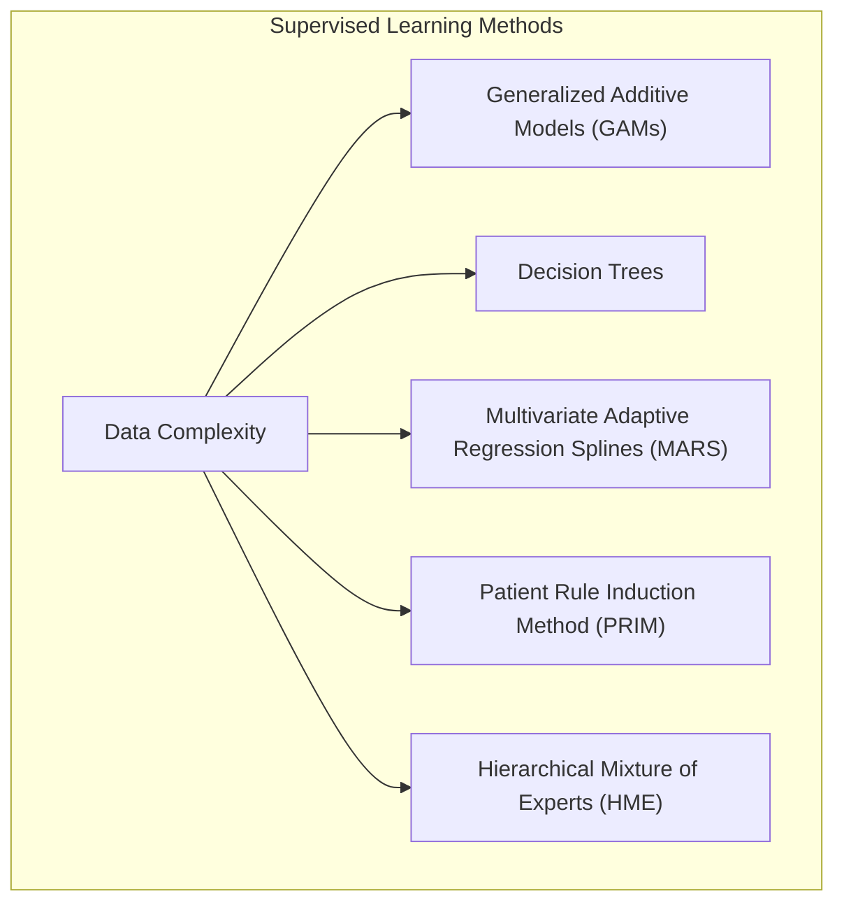
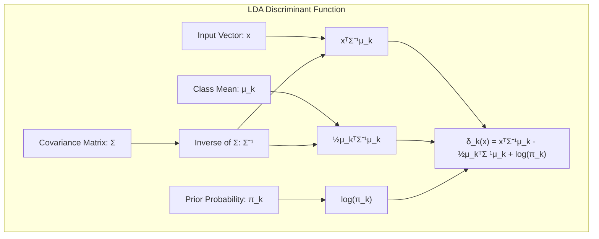
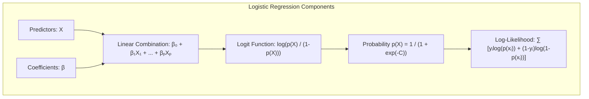
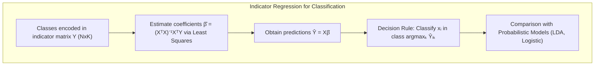
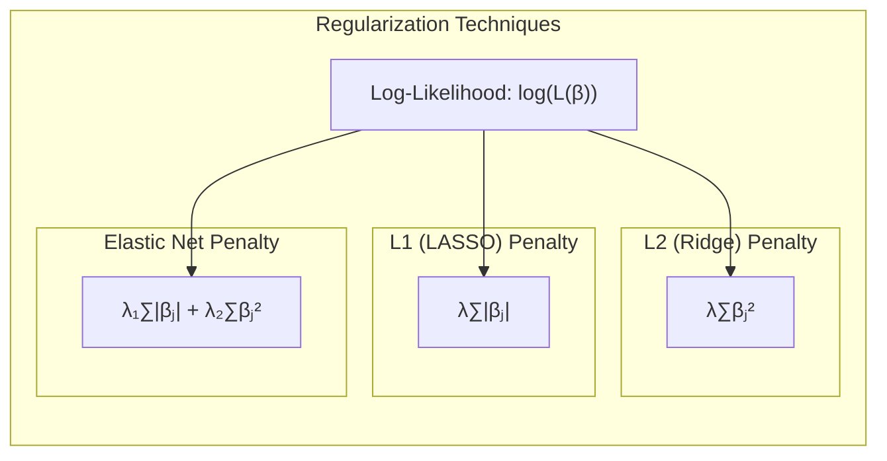
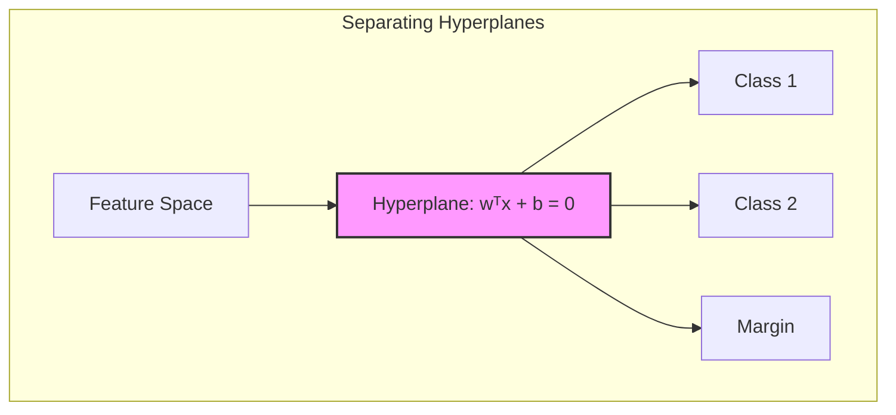
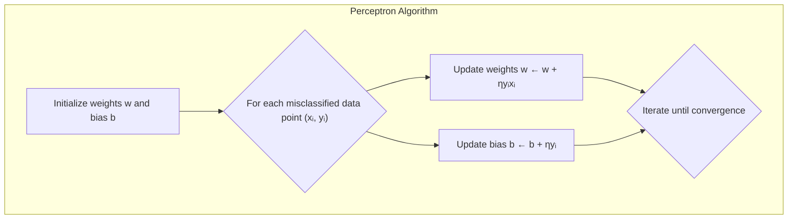

## Título: Modelos Aditivos Generalizados, Árvores e Métodos Relacionados

### Introdução

Este capítulo explora métodos específicos de aprendizado supervisionado que modelam a função de regressão subjacente de forma estruturada para mitigar a maldição da dimensionalidade [^9.1]. Cada técnica oferece uma abordagem distinta para lidar com a complexidade dos dados e suas possíveis não linearidades, apresentando um *trade-off* entre flexibilidade e risco de erro de especificação [^9.1]. Iniciando a discussão a partir do ponto onde os capítulos 3-6 finalizaram, examinamos cinco métodos fundamentais: Modelos Aditivos Generalizados (GAMs), árvores de decisão, Multivariate Adaptive Regression Splines (MARS), o método de indução de regras de pacientes (PRIM), e Misturas Hierárquicas de Especialistas (HME) [^9.1]. O objetivo principal é fornecer uma compreensão aprofundada das abordagens estatísticas e de aprendizado de máquina que são utilizadas para modelar e analisar dados complexos, com foco em sua formulação matemática e fundamentos teóricos.

### Conceitos Fundamentais

**Conceito 1: O Problema de Classificação e Modelos Lineares**

O problema de classificação consiste em atribuir uma observação a uma de várias classes com base em suas características. Em sua forma mais básica, um modelo linear busca modelar a relação entre as variáveis preditoras ($X$) e a resposta ($Y$) como:

$$
Y = \beta_0 + \beta_1X_1 + \beta_2X_2 + \ldots + \beta_pX_p + \epsilon
$$

onde $\beta_i$ são os coeficientes que quantificam a influência de cada preditor $X_i$ na resposta, e $\epsilon$ é o termo de erro, geralmente assumido como tendo uma distribuição normal com média zero. No contexto de classificação, podemos usar a matriz de indicadores para modelar a variável resposta, onde cada coluna representa uma classe e cada linha representa uma observação com um "1" na coluna da classe correta e "0" nas outras. A aplicação de modelos lineares, como a regressão linear com matrizes de indicadores [^4.2], impõe uma relação linear entre os preditores e a resposta, o que pode levar a um *bias* significativo se a relação verdadeira for não-linear.

> 💡 **Exemplo Numérico:**
> Suponha que temos um problema de classificação binária com dois preditores ($X_1$ e $X_2$) e uma variável de resposta $Y$ (0 ou 1). Usando um modelo linear, podemos ter a seguinte equação:
>
> $Y = 0.5 + 0.8X_1 - 0.3X_2 + \epsilon$
>
>  Aqui, $\beta_0 = 0.5$, $\beta_1 = 0.8$, e $\beta_2 = -0.3$. Se tivermos uma observação com $X_1 = 1$ e $X_2 = 2$, a previsão seria:
>
>  $Y = 0.5 + 0.8(1) - 0.3(2) = 0.5 + 0.8 - 0.6 = 0.7$.
>
>  Se usarmos um limiar de 0.5, classificaríamos essa observação como pertencente à classe 1. Este modelo assume que o efeito de $X_1$ e $X_2$ em $Y$ é linear, o que pode não ser verdade na realidade.

**Lemma 1:** *Seja $f(x)$ a função de classificação verdadeira, uma aproximação linear $g(x) = w^Tx + b$ pode ser vista como uma projeção de $x$ em um espaço de menor dimensão definido pelo vetor $w$, onde a decisão de classe é determinada pelo sinal de $g(x)$. Em condições específicas, essa projeção é equivalente àquela encontrada em LDA.* Este lemma enfatiza que, apesar de sua simplicidade, a modelagem linear pode ser vista como uma projeção de dados em um espaço adequado, onde as decisões de classe são tomadas, conforme demonstrado em [^4.3].

**Conceito 2: Linear Discriminant Analysis (LDA)**

LDA busca encontrar a melhor combinação linear de preditores para separar diferentes classes [^4.3]. Para duas classes, a função discriminante linear da LDA é dada por:

$$
\delta_k(x) = x^T \Sigma^{-1} \mu_k - \frac{1}{2} \mu_k^T \Sigma^{-1} \mu_k + \log(\pi_k)
$$

onde $x$ é o vetor de preditores, $\mu_k$ é a média da classe $k$, $\Sigma$ é a matriz de covariância comum, e $\pi_k$ é a probabilidade a priori da classe $k$.  As decisões de classe são tomadas baseadas no maior valor da função discriminante $\delta_k(x)$. LDA assume que as classes seguem distribuições normais multivariadas com covariâncias iguais [^4.3.1], ou seja, $\Sigma_k = \Sigma$, o que simplifica o cálculo da fronteira de decisão. O classificador LDA busca projetar os dados em um subespaço de menor dimensão que maximize a separabilidade entre classes.

> 💡 **Exemplo Numérico:**
> Vamos considerar duas classes com as seguintes características:
>
> Classe 1: $\mu_1 = \begin{bmatrix} 1 \\ 2 \end{bmatrix}$, $\pi_1 = 0.6$
> Classe 2: $\mu_2 = \begin{bmatrix} 3 \\ 1 \end{bmatrix}$, $\pi_2 = 0.4$
> Matriz de covariância comum: $\Sigma = \begin{bmatrix} 1 & 0.5 \\ 0.5 & 1 \end{bmatrix}$
>
> Um ponto de dados $x = \begin{bmatrix} 2 \\ 1.5 \end{bmatrix}$.
>
> **Cálculo de $\Sigma^{-1}$:**
> $\Sigma^{-1} = \frac{1}{1*1 - 0.5*0.5} \begin{bmatrix} 1 & -0.5 \\ -0.5 & 1 \end{bmatrix} = \frac{1}{0.75} \begin{bmatrix} 1 & -0.5 \\ -0.5 & 1 \end{bmatrix} = \begin{bmatrix} 4/3 & -2/3 \\ -2/3 & 4/3 \end{bmatrix}$
>
> **Cálculo de $\delta_1(x)$:**
>
> $\delta_1(x) = \begin{bmatrix} 2 & 1.5 \end{bmatrix} \begin{bmatrix} 4/3 & -2/3 \\ -2/3 & 4/3 \end{bmatrix} \begin{bmatrix} 1 \\ 2 \end{bmatrix} - \frac{1}{2} \begin{bmatrix} 1 & 2 \end{bmatrix} \begin{bmatrix} 4/3 & -2/3 \\ -2/3 & 4/3 \end{bmatrix} \begin{bmatrix} 1 \\ 2 \end{bmatrix} + \log(0.6)$
>
> $\delta_1(x) = \begin{bmatrix} 2 & 1.5 \end{bmatrix} \begin{bmatrix} 0 \\ 2 \end{bmatrix} - \frac{1}{2} \begin{bmatrix} 1 & 2 \end{bmatrix} \begin{bmatrix} -4/3 \\ 2 \end{bmatrix} + \log(0.6)$
>
> $\delta_1(x) = 3  - \frac{1}{2} (8/3) + \log(0.6) = 3 - 4/3 -0.51 = 1.82$
>
> **Cálculo de $\delta_2(x)$:**
>
> $\delta_2(x) = \begin{bmatrix} 2 & 1.5 \end{bmatrix} \begin{bmatrix} 4/3 & -2/3 \\ -2/3 & 4/3 \end{bmatrix} \begin{bmatrix} 3 \\ 1 \end{bmatrix} - \frac{1}{2} \begin{bmatrix} 3 & 1 \end{bmatrix} \begin{bmatrix} 4/3 & -2/3 \\ -2/3 & 4/3 \end{bmatrix} \begin{bmatrix} 3 \\ 1 \end{bmatrix} + \log(0.4)$
>
> $\delta_2(x) = \begin{bmatrix} 2 & 1.5 \end{bmatrix} \begin{bmatrix} 10/3 \\ -2/3 \end{bmatrix} - \frac{1}{2} \begin{bmatrix} 3 & 1 \end{bmatrix} \begin{bmatrix} 10/3 \\ -2/3 \end{bmatrix} + \log(0.4)$
>
> $\delta_2(x) = 17/3 - \frac{1}{2} (28/3) + \log(0.4) = 17/3 - 14/3 -0.92 = -0.92$
>
> Como $\delta_1(x) > \delta_2(x)$, o ponto $x$ seria classificado como pertencente à Classe 1.

**Corolário 1:** *A função discriminante linear da LDA, quando as covariâncias das classes são iguais, pode ser interpretada como uma projeção dos dados em uma direção que maximiza a distância entre as médias das classes, ou seja, a projeção é realizada na direção $w = \Sigma^{-1}(\mu_1 - \mu_2)$, onde $1$ e $2$ representam as duas classes.* [^4.3.1]

**Conceito 3: Regressão Logística**

A regressão logística modela a probabilidade de uma variável binária $Y$ como uma função linear dos preditores $X$. Utiliza a função *logit* para transformar probabilidades em um intervalo de $-\infty$ a $+\infty$, o que permite modelar a probabilidade usando uma combinação linear dos preditores:

$$
\text{logit}(p(X)) = \log \left( \frac{p(X)}{1-p(X)} \right) = \beta_0 + \beta_1 X_1 + \ldots + \beta_p X_p
$$

onde $p(X) = P(Y=1|X)$. A probabilidade é dada por:

$$
p(X) = \frac{1}{1 + e^{-(\beta_0 + \beta_1 X_1 + \ldots + \beta_p X_p)}}
$$

Os coeficientes $\beta_i$ são estimados maximizando a verossimilhança dos dados. O processo de otimização geralmente envolve o método de Newton-Raphson [^4.4.2] ou outras técnicas de otimização numérica. A função de verossimilhança para regressão logística é dada por:

$$
L(\beta) = \prod_{i=1}^N p(x_i)^{y_i}(1-p(x_i))^{1-y_i}
$$

e a *log-likelihood* correspondente é:

$$
\log(L(\beta)) = \sum_{i=1}^N [y_i\log(p(x_i)) + (1-y_i)\log(1-p(x_i))]
$$

> 💡 **Exemplo Numérico:**
> Suponha que temos um modelo de regressão logística com um único preditor $X$:
>
> $\text{logit}(p(X)) = -2 + 1.5X$
>
>  Se $X = 1$, então:
>
>  $\text{logit}(p(X)) = -2 + 1.5(1) = -0.5$
>
>  Para obter a probabilidade $p(X)$, usamos a função logística inversa:
>
>  $p(X) = \frac{1}{1 + e^{-(-0.5)}} = \frac{1}{1 + e^{0.5}} \approx \frac{1}{1 + 1.6487} \approx 0.378$
>
>  Isso significa que para $X = 1$, a probabilidade de $Y=1$ é aproximadamente 0.378.
>
>  Se $X = 2$, então:
>
> $\text{logit}(p(X)) = -2 + 1.5(2) = 1$
>
> $p(X) = \frac{1}{1 + e^{-1}} \approx \frac{1}{1 + 0.3679} \approx 0.731$
>
>  A probabilidade de $Y=1$ aumenta para aproximadamente 0.731 quando $X=2$.

> ⚠️ **Nota Importante**: A função *logit* transforma a probabilidade em log-odds, o que permite modelar a probabilidade usando uma função linear. [^4.4.1]

> ❗ **Ponto de Atenção**: A regressão logística, assim como outros modelos, pode ser afetada por classes não balanceadas. A correção desse problema envolve o ajuste dos pesos da função de custo ou o rebalanceamento dos dados [^4.4.2].

> ✔️ **Destaque**: Em cenários onde a separação entre as classes é clara, os parâmetros estimados na regressão logística podem se aproximar daqueles obtidos pela LDA, embora ambos os modelos sejam derivados de princípios diferentes [^4.5].

### Regressão Linear e Mínimos Quadrados para Classificação

**Explicação:** Este diagrama representa o fluxo do processo de regressão de indicadores e como ele se relaciona à classificação, conforme descrito nos tópicos [^4.2] e [^4.1].

A regressão linear pode ser usada para classificação codificando as classes em uma matriz de indicadores. A matriz de indicadores $Y$ é uma matriz $N \times K$, onde $N$ é o número de observações e $K$ é o número de classes, com $y_{ik} = 1$ se a i-ésima observação pertence à classe $k$, e $y_{ik} = 0$ caso contrário. O objetivo é encontrar os coeficientes $\beta$ que minimizam a soma dos erros quadráticos:

$$
\min_\beta ||Y - X\beta||^2
$$

A solução para este problema é dada por:

$$
\hat{\beta} = (X^T X)^{-1} X^T Y
$$

As previsões de classe são obtidas calculando $\hat{Y} = X\hat{\beta}$, e cada observação $x_i$ é classificada na classe $k$ que maximiza o valor predito $\hat{y}_{ik}$.  As limitações dessa abordagem incluem a incapacidade de modelar não-linearidades, bem como a possibilidade de produzir valores preditos fora do intervalo [0,1], uma vez que a regressão linear não impõe restrições aos valores preditos. O "masking problem" surge quando a covariância entre as classes leva a uma classificação subótima, pois a regressão linear não leva em consideração as relações entre as classes.

> 💡 **Exemplo Numérico:**
> Suponha que temos 3 observações e 2 classes. A matriz de indicadores $Y$ e a matriz de preditores $X$ são:
>
> $Y = \begin{bmatrix} 1 & 0 \\ 0 & 1 \\ 1 & 0 \end{bmatrix}$
>
> $X = \begin{bmatrix} 1 & 2 \\ 2 & 1 \\ 3 & 3 \end{bmatrix}$
>
> Primeiro, calculamos $X^T X$:
>
> $X^T X = \begin{bmatrix} 1 & 2 & 3 \\ 2 & 1 & 3 \end{bmatrix} \begin{bmatrix} 1 & 2 \\ 2 & 1 \\ 3 & 3 \end{bmatrix} = \begin{bmatrix} 14 & 13 \\ 13 & 14 \end{bmatrix}$
>
> Calculamos o inverso de $X^T X$:
>
> $(X^T X)^{-1} = \frac{1}{14*14 - 13*13} \begin{bmatrix} 14 & -13 \\ -13 & 14 \end{bmatrix} = \begin{bmatrix} 14/27 & -13/27 \\ -13/27 & 14/27 \end{bmatrix}$
>
> Calculamos $X^T Y$:
>
> $X^T Y = \begin{bmatrix} 1 & 2 & 3 \\ 2 & 1 & 3 \end{bmatrix} \begin{bmatrix} 1 & 0 \\ 0 & 1 \\ 1 & 0 \end{bmatrix} = \begin{bmatrix} 4 & 2 \\ 5 & 1 \end{bmatrix}$
>
> Calculamos $\hat{\beta}$:
>
> $\hat{\beta} = (X^T X)^{-1} X^T Y = \begin{bmatrix} 14/27 & -13/27 \\ -13/27 & 14/27 \end{bmatrix} \begin{bmatrix} 4 & 2 \\ 5 & 1 \end{bmatrix} = \begin{bmatrix} -9/27 & 15/27 \\ 18/27 & -12/27 \end{bmatrix} = \begin{bmatrix} -1/3 & 5/9 \\ 2/3 & -4/9 \end{bmatrix}$
>
> Agora podemos calcular as previsões $\hat{Y}$:
>
> $\hat{Y} = X\hat{\beta} = \begin{bmatrix} 1 & 2 \\ 2 & 1 \\ 3 & 3 \end{bmatrix} \begin{bmatrix} -1/3 & 5/9 \\ 2/3 & -4/9 \end{bmatrix} = \begin{bmatrix} 1 & -1/3 \\ 0 & 6/9 \\ 1 & 1/9 \end{bmatrix}$
>
> Classificamos a observação $i$ na classe $k$ que maximiza $\hat{y}_{ik}$. Por exemplo, a primeira observação é classificada na classe 1 porque $\hat{y}_{11} = 1 > \hat{y}_{12} = -1/3$.

**Lemma 2:** *Em um cenário linearmente separável, onde as classes podem ser separadas por hiperplanos, as projeções nos hiperplanos de decisão gerados pela regressão linear podem ser, em certas condições, equivalentes às projeções geradas por outros métodos lineares, como discriminantes lineares. O problema de "masking" pode ocorrer quando as covariâncias entre as classes causam confusão nas projeções* [^4.2].

**Corolário 2:** *A equivalência entre regressão linear de indicadores e discriminantes lineares implica que, em problemas com alta separabilidade, a regressão linear pode ser utilizada como alternativa computacionalmente mais eficiente, desde que os efeitos do "masking" sejam pequenos.* [^4.3]

Comparando com a regressão logística [^4.4], a regressão linear de indicadores pode ser menos adequada para gerar estimativas precisas de probabilidade. No entanto, sua simplicidade e eficiência podem ser vantajosas quando o objetivo principal é obter uma fronteira de decisão linear. A regressão logística utiliza a função sigmoide para forçar os valores preditos a ficarem no intervalo [0,1], ao passo que a regressão de indicadores não impõe essa restrição [^4.4].

### Métodos de Seleção de Variáveis e Regularização em Classificação

A seleção de variáveis e regularização são técnicas cruciais para evitar overfitting, melhorar a generalização e a interpretabilidade dos modelos de classificação [^4.5]. Em regressão logística, a regularização pode ser aplicada através da adição de termos de penalização à função de custo. A penalização L1 (LASSO) adiciona um termo proporcional ao valor absoluto dos coeficientes:

$$
\log(L(\beta))  - \lambda \sum_{j=1}^p |\beta_j|
$$

onde $\lambda$ é o parâmetro de regularização e $\beta_j$ são os coeficientes dos preditores. Esta penalização tende a zerar alguns coeficientes, promovendo a esparsidade do modelo [^4.5.1]. A penalização L2 (Ridge) adiciona um termo proporcional ao quadrado dos coeficientes:

$$
\log(L(\beta))  - \lambda \sum_{j=1}^p \beta_j^2
$$

Esta penalização reduz a magnitude dos coeficientes, melhorando a estabilidade do modelo [^4.5.2]. A regularização Elastic Net combina ambas as penalizações L1 e L2:

$$
\log(L(\beta))  - \lambda_1 \sum_{j=1}^p |\beta_j| - \lambda_2 \sum_{j=1}^p \beta_j^2
$$

onde $\lambda_1$ e $\lambda_2$ controlam a intensidade das penalidades L1 e L2, respectivamente [^4.5].

> 💡 **Exemplo Numérico:**
> Vamos considerar um modelo de regressão logística com dois preditores $X_1$ e $X_2$. A função de log-verossimilhança sem regularização é $\log(L(\beta))$.
>
> **Penalização L1 (LASSO):**
>
> Suponha que $\lambda = 0.5$ e os coeficientes estimados são $\beta_1 = 1.2$ e $\beta_2 = -0.8$. A função de custo com penalização L1 seria:
>
> $\log(L(\beta)) - 0.5(|1.2| + |-0.8|) = \log(L(\beta)) - 0.5(1.2 + 0.8) = \log(L(\beta)) - 1$.
>
> A penalidade reduz o valor da função de log-verossimilhança.
>
> **Penalização L2 (Ridge):**
>
> Suponha que $\lambda = 0.5$ e os mesmos coeficientes estimados. A função de custo com penalização L2 seria:
>
> $\log(L(\beta)) - 0.5(1.2^2 + (-0.8)^2) = \log(L(\beta)) - 0.5(1.44 + 0.64) = \log(L(\beta)) - 1.04$.
>
> A penalidade L2 também reduz o valor da função de log-verossimilhança, mas de maneira diferente.
>
> **Penalização Elastic Net:**
>
> Suponha que $\lambda_1 = 0.3$, $\lambda_2 = 0.2$ e os mesmos coeficientes. A função de custo com Elastic Net seria:
>
> $\log(L(\beta)) - 0.3(|1.2| + |-0.8|) - 0.2(1.2^2 + (-0.8)^2) = \log(L(\beta)) - 0.3(2) - 0.2(2.08) = \log(L(\beta)) - 0.6 - 0.416 = \log(L(\beta)) - 1.016$.
>
>  O Elastic Net combina as duas penalidades, proporcionando um efeito combinado.

**Lemma 3:** *A penalização L1 na regressão logística leva a coeficientes esparsos devido à sua natureza que promove a seleção de um subconjunto de variáveis preditoras mais importantes. A função de valor absoluto não é diferenciável na origem, o que leva alguns coeficientes a serem exatamente zero quando a função de custo é minimizada. A regularização L1 é usada para a seleção de variáveis.* [^4.4.4]

**Prova do Lemma 3:** Ao minimizar a função de custo com a penalização L1, a adição do termo $\lambda \sum_{j=1}^p |\beta_j|$ faz com que os coeficientes menos relevantes sejam levados a zero, já que a derivada da função de valor absoluto não está definida na origem e causa uma força que leva alguns coeficientes a serem exatamente zero quando a função de custo é minimizada. $\blacksquare$

**Corolário 3:** *A esparsidade induzida pela penalização L1, além de simplificar o modelo e evitar overfitting, auxilia na interpretação dos resultados, uma vez que apenas os preditores mais relevantes são considerados. Esta característica é vantajosa em problemas com muitos preditores onde se busca identificar as variáveis mais influentes* [^4.4.5].

> ⚠️ **Ponto Crucial**: A penalização L1 (LASSO) é mais adequada para a seleção de variáveis, enquanto a penalização L2 (Ridge) é mais adequada para aumentar a estabilidade do modelo. A combinação das duas, como no Elastic Net, permite um ajuste fino da regularização [^4.5].

### Separating Hyperplanes e Perceptrons

A ideia de hiperplanos separadores busca encontrar um hiperplano que divide o espaço de características em regiões distintas, de modo que cada região corresponda a uma classe. A separação ótima é alcançada quando o hiperplano maximiza a margem entre as classes, o que leva a um classificador mais robusto. O hiperplano é definido pela equação:

$$
w^Tx + b = 0
$$

onde $w$ é o vetor normal ao hiperplano, $x$ é o vetor de preditores, e $b$ é o viés (bias). A margem de separação é dada pela distância entre os pontos mais próximos de cada classe ao hiperplano.  A formulação matemática deste problema de otimização pode ser expressa como:

$$
\max_{w, b} \frac{1}{||w||}  \text{ sujeito a: } y_i(w^Tx_i + b) \geq 1 \text{ para todos } i
$$

onde $y_i \in \{-1, 1\}$ são os rótulos de classe. Essa otimização pode ser resolvida através do dual de Wolfe, com soluções dependentes dos pontos de suporte [^4.5.2].

> 💡 **Exemplo Numérico:**
> Imagine um problema de classificação binária em duas dimensões, com os pontos de uma classe localizados na região $x_2 > x_1$ e os da outra classe em $x_2 < x_1$.
>
> Um possível hiperplano separador seria dado por $w = \begin{bmatrix} -1 \\ 1 \end{bmatrix}$ e $b = 0$, ou seja, $-x_1 + x_2 = 0$.
>
> Para um ponto $x = \begin{bmatrix} 1 \\ 2 \end{bmatrix}$, temos $-1 + 2 = 1 > 0$, que seria classificado como da primeira classe.
>
> Para um ponto $x = \begin{bmatrix} 2 \\ 1 \end{bmatrix}$, temos $-2 + 1 = -1 < 0$, que seria classificado como da segunda classe.
>
> A margem de separação é a distância entre os pontos mais próximos ao hiperplano, que é maximizada por uma solução ótima.

O Perceptron é um algoritmo iterativo que busca encontrar um hiperplano separador para dados linearmente separáveis. O algoritmo começa com um hiperplano inicial e atualiza os pesos $w$ e o viés $b$ baseando-se nas classificações incorretas:

$$
w \leftarrow w + \eta y_i x_i
$$
$$
b \leftarrow b + \eta y_i
$$

onde $\eta$ é a taxa de aprendizado. Sob a hipótese de dados linearmente separáveis, o Perceptron converge para uma solução que separa as classes corretamente, como descrito em [^4.5.1].

> 💡 **Exemplo Numérico:**
> Suponha que temos um conjunto de dados com duas classes, onde $y_i \in \{-1, 1\}$. Inicializamos $w = \begin{bmatrix} 0 \\ 0 \end{bmatrix}$ e $b = 0$, e a taxa de aprendizado $\eta = 0.1$.
>
> 1.  Primeira observação: $x_1 = \begin{bmatrix} 1 \\ 1 \end{bmatrix}$, $y_1 = 1$.  A previsão inicial é $w^Tx_1 + b = 0$.  Como a previsão é incorreta $(0 < 1)$, atualizamos os pesos:
>
> $w \leftarrow \begin{bmatrix} 0 \\ 0 \end{bmatrix} + 0.1 * 1 * \begin{bmatrix} 1 \\ 1 \end{bmatrix} = \begin{bmatrix} 0.1 \\ 0.1 \end{bmatrix}$
>
> $b \leftarrow 0 + 0.1 * 1 = 0.1$
>
> 2.  Segunda observação: $x_2 = \begin{bmatrix} 2 \\ -1 \end{bmatrix}$, $y_2 = -1$. A previsão é $w^Tx_2 + b = 0.1 * 2 + 0.1 * -1 + 0.1 = 0.2$. Como a previsão é incorreta $(0.2 > -1)$, atualizamos os pesos:
>
> $w \leftarrow \begin{bmatrix} 0.1 \\ 0.1 \end{bmatrix} + 0.1 * -1 * \begin{bmatrix} 2 \\ -1 \end{bmatrix} = \begin{bmatrix} -0.1 \\ 0.2 \end{bmatrix}$
>
> $b \leftarrow 0.1 + 0.1 * -1 = 0$
>
> Este processo é repetido até que o algoritmo encontre um hiperplano que separe as classes corretamente.

### Pergunta Teórica Avançada: Quais as diferenças fundamentais entre a formulação de LDA e a Regra de Decisão Bayesiana considerando distribuições Gaussianas com covariâncias iguais?

**Resposta:**

Embora a LDA e a Regra de Decisão Bayesiana, sob distribuições gaussianas com covariâncias iguais, levem a classificadores lineares com fronteiras de decisão similares, existem diferenças sutis em suas formulações e fundamentos teóricos.

A LDA é um método discriminativo que busca projetar os dados em um subespaço de menor dimensão que maximize a separabilidade entre as classes. A função discriminante linear é dada por:

$$
\delta_k(x) = x^T \Sigma^{-1} \mu_k - \frac{1}{2} \mu_k^T \Sigma^{-1} \mu_k + \log(\pi_k)
$$

onde $\mu_k$ é a média da classe $k$, $\Sigma$ é a matriz de covariância comum e $\pi_k$ é a probabilidade a priori da classe $k$.  A classificação é feita atribuindo a observação $x$ à classe que maximiza a função discriminante $\delta_k(x)$ [^4.3], [^4.3.2], [^4.3.3].

A Regra de Decisão Bayesiana, por outro lado, é uma abordagem generativa que busca maximizar a probabilidade a posteriori da classe dada a observação:

$$
P(Y = k|x) = \frac{P(x|Y=k) P(Y=k)}{P(x)}
$$

Para distribuições