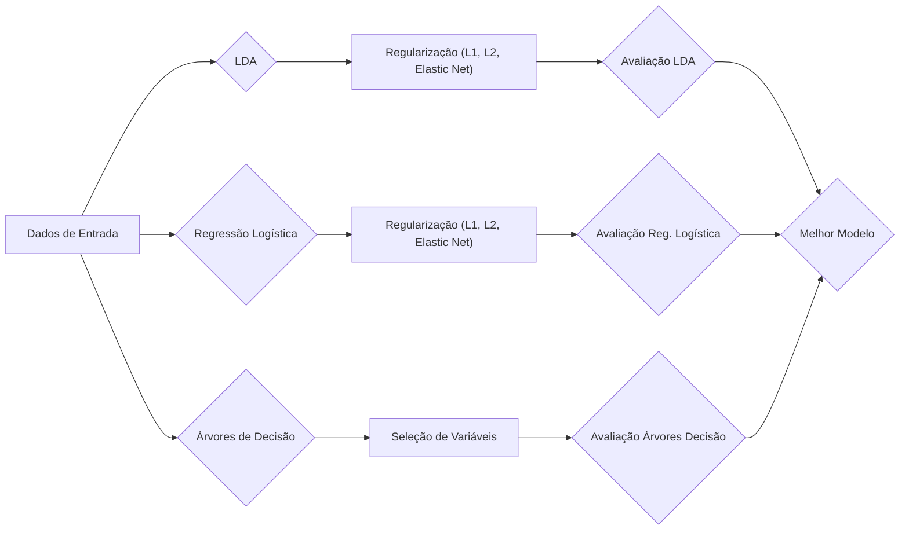
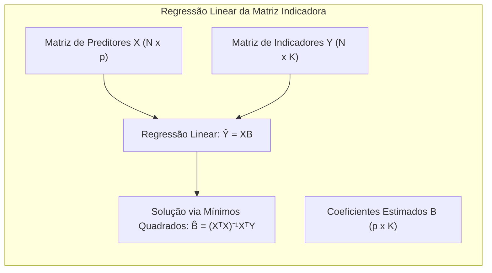
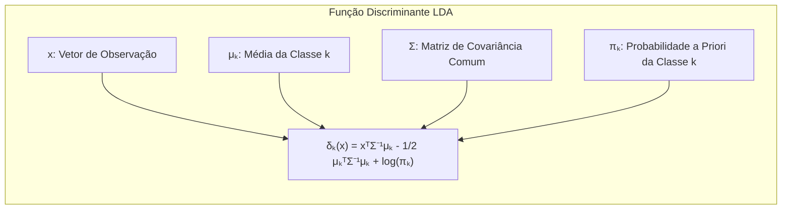
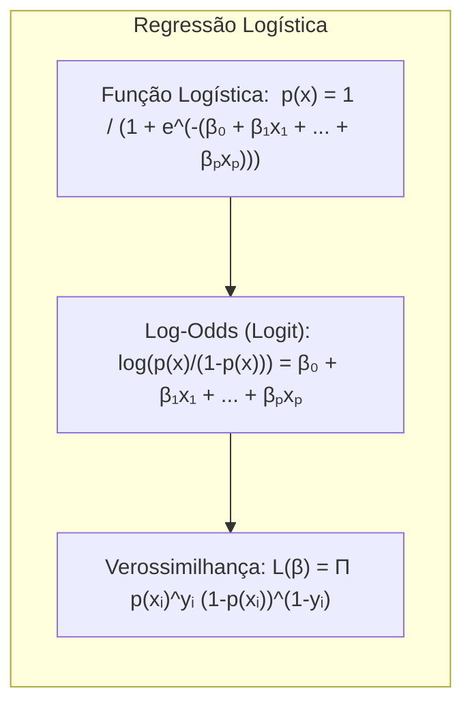
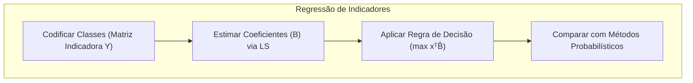
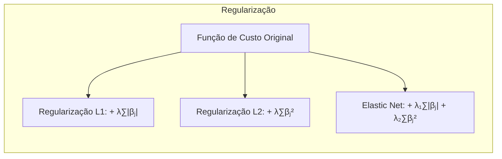
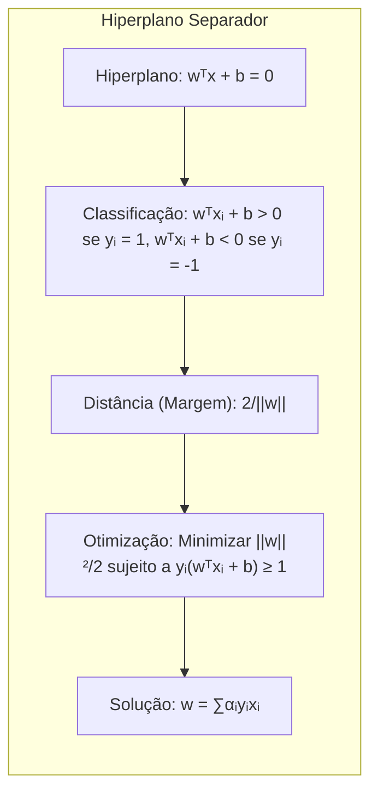

## Título: Modelos Aditivos Generalizados, Árvores e Métodos Relacionados para Classificação

### Introdução

Este capítulo explora métodos específicos para **aprendizado supervisionado**, cada um assumindo uma forma estruturada diferente para a função de regressão desconhecida, oferecendo soluções para a **maldição da dimensionalidade** [^9.1]. É fundamental entender que existe um *trade-off* entre a complexidade do modelo e o risco de misspecificação. Os métodos abordados são extensões dos temas apresentados nos capítulos 3 a 6, incluindo **modelos aditivos generalizados**, **árvores de decisão**, **splines de regressão adaptativa multivariada (MARS)**, o método de indução de regras do paciente (PRIM) e misturas hierárquicas de especialistas (HME). O foco é entender como esses modelos podem ser aplicados em problemas de classificação.

### Conceitos Fundamentais

**Conceito 1:** O **problema de classificação** busca atribuir uma classe ou categoria a uma dada observação com base em suas características. Métodos lineares, embora simples, podem ser inadequados para modelar relações complexas e não lineares presentes em dados reais [^9.1]. A escolha de um método linear implica um *trade-off* entre viés e variância. Modelos com muitos parâmetros podem se ajustar bem aos dados de treinamento, mas podem não generalizar bem para novos dados, um exemplo claro de alta variância. Já modelos com menos parâmetros podem apresentar alto viés, não capturando adequadamente a complexidade dos dados. É crucial entender como a estrutura linear afeta esse balanço, pois pode simplificar demais o problema, levando a soluções subótimas, ou o oposto, levando a overfitting.

> 💡 **Exemplo Numérico:**
> Suponha que temos um conjunto de dados com duas classes (0 e 1) e duas variáveis preditoras ($x_1$ e $x_2$). Se usarmos um modelo linear simples, como um classificador linear, podemos obter uma fronteira de decisão que separa as classes razoavelmente bem. No entanto, se a relação entre as variáveis e a classe for não linear (por exemplo, as classes se distribuem como círculos concêntricos), o classificador linear terá um alto viés, pois não conseguirá capturar essa relação.
>
> Por outro lado, um modelo muito complexo, como uma árvore de decisão profunda, pode se ajustar perfeitamente aos dados de treinamento, incluindo o ruído, resultando em baixa variância nos dados de treinamento, mas alta variância em novos dados. Isso significa que o modelo se ajustará bem aos dados de treinamento, mas terá um desempenho ruim em dados não vistos. A escolha do método correto envolve encontrar o equilíbrio certo entre viés e variância.

**Lemma 1:** Dado um conjunto de dados de classificação, a **regressão linear da matriz indicadora** pode ser vista como uma aproximação para a construção de **funções discriminantes lineares**, com coeficientes estimados por mínimos quadrados. Em cenários onde as classes são bem separadas, esta aproximação pode gerar resultados comparáveis ao LDA.

Seja $X$ a matriz de preditores de dimensões $N \times p$, onde $N$ é o número de observações e $p$ o número de preditores. A matriz de indicadores $Y$ possui dimensões $N \times K$, onde $K$ é o número de classes, com cada linha da forma $[0, \ldots, 1, \ldots, 0]$, com o '1' na coluna que corresponde à classe da observação. O modelo de regressão linear para a matriz indicadora é:

$$
\hat{Y} = XB
$$

Onde $\hat{Y}$ é a matriz de indicadores de classe estimada, $X$ é a matriz de preditores, e $B$ são os coeficientes estimados por mínimos quadrados. A solução para $B$ é dada por:

$$
\hat{B} = (X^T X)^{-1} X^T Y
$$

Ao projetar os dados no espaço gerado pelas colunas de $B$, os pontos de diferentes classes se agrupam linearmente. A matriz $B$ pode ser utilizada para definir os **hiperplanos de decisão**. A previsão para uma nova observação $x$ é feita calculando $x^T \hat{B}$ e atribuindo a observação à classe com a maior entrada neste vetor.

> 💡 **Exemplo Numérico:**
> Suponha que temos 3 observações e 2 classes, com os seguintes dados:
>
> $X = \begin{bmatrix} 1 & 2 \\ 2 & 1 \\ 3 & 3 \end{bmatrix}$ e $Y = \begin{bmatrix} 1 & 0 \\ 0 & 1 \\ 1 & 0 \end{bmatrix}$.
>
> **Passo 1: Calcular $X^T X$**
>
> $X^T X = \begin{bmatrix} 1 & 2 & 3 \\ 2 & 1 & 3 \end{bmatrix} \begin{bmatrix} 1 & 2 \\ 2 & 1 \\ 3 & 3 \end{bmatrix} = \begin{bmatrix} 14 & 13 \\ 13 & 14 \end{bmatrix}$
>
> **Passo 2: Calcular $(X^T X)^{-1}$**
>
> $(X^T X)^{-1} = \frac{1}{14^2 - 13^2} \begin{bmatrix} 14 & -13 \\ -13 & 14 \end{bmatrix} = \frac{1}{27} \begin{bmatrix} 14 & -13 \\ -13 & 14 \end{bmatrix} \approx \begin{bmatrix} 0.518 & -0.481 \\ -0.481 & 0.518 \end{bmatrix}$
>
> **Passo 3: Calcular $X^T Y$**
>
> $X^T Y = \begin{bmatrix} 1 & 2 & 3 \\ 2 & 1 & 3 \end{bmatrix} \begin{bmatrix} 1 & 0 \\ 0 & 1 \\ 1 & 0 \end{bmatrix} = \begin{bmatrix} 4 & 2 \\ 5 & 1 \end{bmatrix}$
>
> **Passo 4: Calcular $\hat{B}$**
>
> $\hat{B} = (X^T X)^{-1} X^T Y = \begin{bmatrix} 0.518 & -0.481 \\ -0.481 & 0.518 \end{bmatrix} \begin{bmatrix} 4 & 2 \\ 5 & 1 \end{bmatrix} = \begin{bmatrix} -0.333 & 0.555 \\ 0.667 & -0.444 \end{bmatrix}$
>
> Para uma nova observação $x = \begin{bmatrix} 2 & 2 \end{bmatrix}$, calculamos $x^T \hat{B} = \begin{bmatrix} 2 & 2 \end{bmatrix} \begin{bmatrix} -0.333 & 0.555 \\ 0.667 & -0.444 \end{bmatrix} = \begin{bmatrix} 0.668 & 0.222 \end{bmatrix}$. Como o primeiro valor é maior, a observação seria classificada como classe 1.

**Conceito 2:** A **Linear Discriminant Analysis (LDA)**, como abordado em capítulos anteriores, assume que os dados para cada classe seguem uma distribuição normal multivariada com a mesma matriz de covariância [^4.3]. A **fronteira de decisão** entre duas classes, na LDA, é linear e definida com base nas médias e covariâncias das classes [^4.3.1]. O LDA busca encontrar a combinação linear das variáveis que melhor separe as classes, maximizando a separação entre as médias das classes e minimizando a variabilidade dentro de cada classe [^4.3.2]. A formulação da função discriminante na LDA é dada por:

$$
\delta_k(x) = x^T \Sigma^{-1} \mu_k - \frac{1}{2}\mu_k^T\Sigma^{-1}\mu_k + \log \pi_k
$$

Onde $\mu_k$ é o vetor de média da classe $k$, $\Sigma$ é a matriz de covariância comum e $\pi_k$ é a probabilidade *a priori* da classe $k$ [^4.3.3]. A classe predita para uma nova observação $x$ é aquela que maximiza $\delta_k(x)$.

> 💡 **Exemplo Numérico:**
> Considere um problema de classificação binária com duas classes, onde:
>
> - Classe 1: $\mu_1 = \begin{bmatrix} 1 \\ 1 \end{bmatrix}$
> - Classe 2: $\mu_2 = \begin{bmatrix} 3 \\ 3 \end{bmatrix}$
> - Matriz de covariância comum: $\Sigma = \begin{bmatrix} 1 & 0.5 \\ 0.5 & 1 \end{bmatrix}$
> - Probabilidades a priori: $\pi_1 = 0.6$, $\pi_2 = 0.4$
>
> **Passo 1: Calcular $\Sigma^{-1}$**
>
> $\Sigma^{-1} = \frac{1}{1 - 0.5^2} \begin{bmatrix} 1 & -0.5 \\ -0.5 & 1 \end{bmatrix} = \frac{4}{3} \begin{bmatrix} 1 & -0.5 \\ -0.5 & 1 \end{bmatrix} = \begin{bmatrix} 1.333 & -0.666 \\ -0.666 & 1.333 \end{bmatrix}$
>
> **Passo 2: Calcular as funções discriminantes para uma nova observação $x = \begin{bmatrix} 2 \\ 2 \end{bmatrix}$**
>
> $\delta_1(x) = \begin{bmatrix} 2 & 2 \end{bmatrix} \begin{bmatrix} 1.333 & -0.666 \\ -0.666 & 1.333 \end{bmatrix} \begin{bmatrix} 1 \\ 1 \end{bmatrix} - \frac{1}{2} \begin{bmatrix} 1 & 1 \end{bmatrix} \begin{bmatrix} 1.333 & -0.666 \\ -0.666 & 1.333 \end{bmatrix} \begin{bmatrix} 1 \\ 1 \end{bmatrix} + \log(0.6) \approx  0.000 - 0.666 -0.510 \approx -1.176$
>
> $\delta_2(x) = \begin{bmatrix} 2 & 2 \end{bmatrix} \begin{bmatrix} 1.333 & -0.666 \\ -0.666 & 1.333 \end{bmatrix} \begin{bmatrix} 3 \\ 3 \end{bmatrix} - \frac{1}{2} \begin{bmatrix} 3 & 3 \end{bmatrix} \begin{bmatrix} 1.333 & -0.666 \\ -0.666 & 1.333 \end{bmatrix} \begin{bmatrix} 3 \\ 3 \end{bmatrix} + \log(0.4) \approx  0.000 - 6.000 -0.916 \approx -6.916$
>
> Como $\delta_1(x) > \delta_2(x)$, a observação $x$ é classificada como pertencente à classe 1.

**Corolário 1:** Se as classes seguem uma distribuição normal com covariâncias iguais, a função discriminante do LDA pode ser interpretada como uma projeção dos dados em um subespaço de dimensão menor, onde a separação entre as classes é maximizada. Este resultado surge da minimização da distância de Mahalanobis entre as observações e as médias de cada classe [^4.3.1]. A distância de Mahalanobis entre um ponto $x$ e a média da classe $k$, $\mu_k$, é dada por $\sqrt{(x - \mu_k)^T \Sigma^{-1} (x - \mu_k)}$.  O LDA assume que a covariância é a mesma para todas as classes, $\Sigma$, e então a distância se reduz a uma forma linear em $x$.

**Conceito 3:** A **Regressão Logística** modela a probabilidade de uma observação pertencer a uma classe usando uma função logística da combinação linear dos preditores [^4.4]. O modelo logístico para a probabilidade da classe 1 é dado por:

$$
p(x) = \frac{1}{1 + e^{-(\beta_0 + \beta_1x_1 + \ldots + \beta_px_p)}}
$$

Ou, equivalentemente, o log-odds (logit) é modelado como:

$$
\log\left(\frac{p(x)}{1-p(x)}\right) = \beta_0 + \beta_1x_1 + \ldots + \beta_px_p
$$

Onde $p(x)$ é a probabilidade da classe 1, e os $\beta_i$ são os coeficientes do modelo [^4.4.1]. Os parâmetros são estimados maximizando a verossimilhança, dada por:

$$
L(\beta) = \prod_{i=1}^{N} p(x_i)^{y_i} (1-p(x_i))^{(1-y_i)}
$$

Onde $y_i \in \{0, 1\}$ é o rótulo de classe da observação $i$ [^4.4.3]. Diferentemente do LDA, a regressão logística não assume normalidade dos preditores [^4.4.2]. Ambos os métodos, LDA e regressão logística, buscam encontrar separações lineares, mas a regressão logística estima probabilidades condicionais e pode ser mais apropriada quando o interesse está em probabilidades, e não em funções discriminantes. Em casos onde as classes são separáveis, os resultados podem ser semelhantes, mas a logística tende a ser mais robusta a desvios da normalidade [^4.4.5].

> 💡 **Exemplo Numérico:**
> Suponha que temos um modelo de regressão logística com dois preditores:
>
> $$ \log\left(\frac{p(x)}{1-p(x)}\right) = -1 + 0.5x_1 - 0.2x_2 $$
>
> Para uma nova observação $x = \begin{bmatrix} 2 \\ 3 \end{bmatrix}$, temos:
>
> $$ \log\left(\frac{p(x)}{1-p(x)}\right) = -1 + 0.5(2) - 0.2(3) = -1 + 1 - 0.6 = -0.6 $$
>
> Para encontrar a probabilidade $p(x)$:
>
> $$ \frac{p(x)}{1-p(x)} = e^{-0.6} \approx 0.5488 $$
>
> $$ p(x) = 0.5488(1 - p(x)) $$
>
> $$ p(x) = 0.5488 - 0.5488p(x) $$
>
> $$ 1.5488p(x) = 0.5488 $$
>
> $$ p(x) = \frac{0.5488}{1.5488} \approx 0.354 $$
>
> Isso significa que a probabilidade da observação pertencer à classe 1 é aproximadamente 0.354. Se o limiar de classificação for 0.5, a observação seria classificada como classe 0.

> ⚠️ **Nota Importante**: Modelos de classificação linear podem não ser adequados quando as relações entre as variáveis e as classes são não lineares. A escolha do modelo deve considerar a natureza dos dados e o objetivo da análise. **Referência ao tópico [^4.4.1]**.

> ❗ **Ponto de Atenção**: Classes desbalanceadas podem influenciar a performance dos modelos lineares, especialmente na regressão logística. Técnicas de balanceamento ou uso de pesos podem ser necessárias. **Conforme indicado em [^4.4.2]**.

> ✔️ **Destaque**: Há uma correlação entre as estimativas de parâmetros em LDA e em regressão logística em casos onde as classes são separáveis linearmente. **Baseado no tópico [^4.5]**.

### Regressão Linear e Mínimos Quadrados para Classificação

A **regressão linear de uma matriz indicadora** é uma abordagem para classificação onde cada classe é representada por um vetor de indicadores binários, e a regressão linear é aplicada a cada um desses indicadores [^4.2]. Essa abordagem busca modelar a probabilidade de pertencimento a uma classe, por meio de uma combinação linear das variáveis preditoras. No entanto, esta abordagem possui limitações, como o “masking problem”, onde a influência de variáveis preditoras pode ser encoberta pela dependência entre classes [^4.3].

Em problemas de classificação com $K$ classes, a matriz de resposta $Y$ pode ser representada por uma matriz $N \times K$, onde $N$ é o número de amostras. Cada linha $i$  possui um valor 1 na coluna correspondente à classe da amostra $i$, e 0 nas demais colunas. O modelo de regressão linear para essa matriz é dado por:

$$
Y = XB + E
$$

onde $X$ é a matriz de preditores $N \times p$, $B$ é a matriz de coeficientes $p \times K$ a ser estimada por mínimos quadrados, e $E$ é a matriz de erros $N \times K$. A solução para $B$ é dada por:

$$
\hat{B} = (X^TX)^{-1}X^TY
$$

Após estimar os coeficientes, a classe predita para uma nova amostra $x$ é aquela com maior valor em $x^T\hat{B}$. Embora essa abordagem possa gerar boas soluções, ela não garante que as probabilidades estimadas estejam entre 0 e 1. A decisão final da classe é tomada através de um *argmax*.

**Lemma 2:** Se as classes são linearmente separáveis e a matriz de covariância para cada classe é igual ($\Sigma_k = \Sigma, \forall k$), a solução obtida via regressão linear da matriz indicadora é equivalente à solução do LDA, no sentido de que ambos os métodos levam à mesma fronteira de decisão.

**Prova do Lemma 2:** A solução de mínimos quadrados $\hat{B} = (X^TX)^{-1}X^TY$ é uma transformação linear das respostas $Y$. Sob as hipóteses de classes gaussianas com covariâncias iguais, os coeficientes $\hat{B}$ são proporcionais aos coeficientes da função discriminante do LDA.  Se a regra de decisão em ambos os casos é tomar a classe com maior valor de função, então as fronteiras de decisão serão equivalentes. A função discriminante do LDA,

$$
\delta_k(x) = x^T \Sigma^{-1} \mu_k - \frac{1}{2}\mu_k^T\Sigma^{-1}\mu_k + \log \pi_k
$$

leva à mesma separação entre as classes, pois, neste caso especial, ambas as abordagens encontram a mesma direção de separação.  $\blacksquare$

**Corolário 2:** A equivalência entre regressão linear e LDA em casos especiais simplifica a análise, pois a matriz de indicadores permite obter as projeções dos dados nas classes através de uma regressão linear, e as decisões de classe são tomadas com base nas projeções. Conforme indicado em [^4.3], esta equivalência é válida sob as condições de covariâncias iguais e classes separáveis.

Em alguns casos, a **regressão logística** pode fornecer estimativas mais estáveis das probabilidades, enquanto a **regressão de indicadores** pode levar a extrapolações fora do intervalo [0,1] [^4.4]. No entanto, a regressão de indicadores pode ser suficiente e até vantajosa quando o objetivo principal é a fronteira de decisão linear [^4.2]. A regressão linear não é um método probabilístico, e não calcula probabilidades. A decisão de classe vem através de um "argmax".

### Métodos de Seleção de Variáveis e Regularização em Classificação

A **seleção de variáveis** é crucial para modelos de classificação, principalmente quando se trabalha com dados de alta dimensão. Técnicas como a regularização podem ser usadas para selecionar variáveis importantes e melhorar a generalização do modelo. A **regularização L1** (Lasso) adiciona a norma L1 dos coeficientes à função de custo, induzindo esparsidade no modelo, ou seja, fazendo com que alguns coeficientes sejam exatamente zero [^4.4.4]. Isso seleciona implicitamente as variáveis mais relevantes. A regularização L2 (Ridge), por outro lado, adiciona a norma L2 dos coeficientes à função de custo, encolhendo os coeficientes para zero, mas não necessariamente tornando-os exatamente zero [^4.5]. Essa técnica estabiliza os modelos, reduzindo o problema do *overfitting*. Ambas podem ser combinadas em uma abordagem chamada **Elastic Net** para equilibrar seleção de variáveis e estabilidade [^4.5].

Na regressão logística, por exemplo, a função de custo com regularização L1 é dada por:

$$
J(\beta) = -\frac{1}{N} \sum_{i=1}^{N} [y_i \log(p(x_i)) + (1-y_i) \log(1-p(x_i))] + \lambda \sum_{j=1}^{p} |\beta_j|
$$

onde $\lambda$ é um hiperparâmetro que controla a intensidade da regularização [^4.4.4]. O primeiro termo é a verossimilhança negativa do modelo, e o segundo termo é a penalidade L1. Na regularização L2, o termo $\lambda \sum_{j=1}^{p} |\beta_j|$ é substituído por $\lambda \sum_{j=1}^{p} \beta_j^2$:

$$
J(\beta) = -\frac{1}{N} \sum_{i=1}^{N} [y_i \log(p(x_i)) + (1-y_i) \log(1-p(x_i))] + \lambda \sum_{j=1}^{p} \beta_j^2
$$

E no caso do Elastic Net, a função de custo inclui ambas as penalidades:

$$
J(\beta) = -\frac{1}{N} \sum_{i=1}^{N} [y_i \log(p(x_i)) + (1-y_i) \log(1-p(x_i))] + \lambda_1 \sum_{j=1}^{p} |\beta_j| + \lambda_2 \sum_{j=1}^{p} \beta_j^2
$$

onde $\lambda_1$ e $\lambda_2$ controlam a intensidade das penalidades L1 e L2, respectivamente.

> 💡 **Exemplo Numérico:**
> Vamos considerar um exemplo com regressão logística com 3 preditores ($x_1$, $x_2$, $x_3$), com os seguintes coeficientes estimados sem regularização:
>
> $\beta = \begin{bmatrix} -0.5 \\ 1.2 \\ -0.8 \end{bmatrix}$
>
> Agora, vamos aplicar regularização L1 (Lasso) com $\lambda = 0.5$. A função de custo se torna:
>
> $J(\beta) = \text{Verossimilhança Negativa} + 0.5(|\beta_1| + |\beta_2| + |\beta_3|)$
>
> Após otimização, os coeficientes podem mudar, por exemplo:
>
> $\beta_{\text{Lasso}} = \begin{bmatrix} 0 \\ 0.9 \\ -0.2 \end{bmatrix}$
>
> Observe que o coeficiente de $x_1$ foi zerado, o que significa que a variável $x_1$ foi removida do modelo. Isso é uma característica da regularização L1.
>
> Agora, vamos aplicar regularização L2 (Ridge) com $\lambda = 0.5$. A função de custo se torna:
>
> $J(\beta) = \text{Verossimilhança Negativa} + 0.5(\beta_1^2 + \beta_2^2 + \beta_3^2)$
>
> Após otimização, os coeficientes podem mudar, por exemplo:
>
> $\beta_{\text{Ridge}} = \begin{bmatrix} -0.3 \\ 0.8 \\ -0.5 \end{bmatrix}$
>
> Observe que os coeficientes foram encolhidos em direção a zero, mas nenhum se tornou exatamente zero.
>
> Finalmente, vamos aplicar Elastic Net com $\lambda_1 = 0.3$ e $\lambda_2 = 0.2$. A função de custo se torna:
>
> $J(\beta) = \text{Verossimilhança Negativa} + 0.3(|\beta_1| + |\beta_2| + |\beta_3|) + 0.2(\beta_1^2 + \beta_2^2 + \beta_3^2)$
>
> Após otimização, os coeficientes podem mudar, por exemplo:
>
> $\beta_{\text{Elastic Net}} = \begin{bmatrix} 0 \\ 0.7 \\ -0.3 \end{bmatrix}$
>
> Aqui, Elastic Net combinou a seleção de variáveis (zerando o coeficiente de $x_1$) com o encolhimento dos coeficientes restantes.

**Lemma 3:** A penalização L1 na regressão logística leva a coeficientes esparsos devido ao formato da função de penalidade. A norma L1 impõe uma penalidade que não é diferenciável em zero, levando a soluções onde alguns coeficientes são exatamente zero [^4.4.4].

**Prova do Lemma 3:** A otimização da função de custo com penalização L1 envolve a minimização da soma da verossimilhança negativa com o termo de penalidade. Geometricamente, a penalização L1 força os coeficientes a se concentrarem nos eixos coordenados, resultando em coeficientes nulos para algumas variáveis. Este comportamento resulta da não-diferenciabilidade da norma L1 em zero. Ou seja, a norma L1 possui um "canto" no ponto zero, induzindo a esparsidade nos coeficientes.  $\blacksquare$

**Corolário 3:** A esparsidade induzida pela regularização L1 facilita a interpretação do modelo, pois as variáveis com coeficientes zero são consideradas irrelevantes para o problema de classificação, selecionando automaticamente as variáveis mais importantes para a construção da fronteira de decisão [^4.4.5].

> ⚠️ **Ponto Crucial**: A escolha entre L1 e L2 (ou Elastic Net) depende do problema. L1 é preferível para seleção de variáveis, enquanto L2 ajuda na estabilidade e redução do overfitting. A combinação Elastic Net pode aproveitar vantagens de ambos os tipos de regularização [^4.5]. Elastic Net é preferível a Lasso quando o número de preditores é muito alto e há multicolinearidade.

### Separating Hyperplanes e Perceptrons

A **separating hyperplane** é uma superfície linear que divide o espaço de características em regiões correspondentes a diferentes classes. O objetivo é encontrar um hiperplano que maximize a distância entre as classes, conhecida como margem. Seja um conjunto de dados $(x_i, y_i)$, onde $x_i \in \mathbb{R}^p$ são os preditores e $y_i \in \{-1, 1\}$ são os rótulos das classes. O hiperplano é definido pela equação:

$$
w^T x + b = 0
$$

Onde $w \in \mathbb{R}^p$ é o vetor normal ao hiperplano e $b \in \mathbb{R}$ é o viés.  Para uma classificação binária, o objetivo é encontrar $w$ e $b$ de forma que:

$$
w^T x_i + b > 0 \text{, se } y_i = 1
$$
$$
w^T x_i + b < 0 \text{, se } y_i = -1
$$

O hiperplano ótimo é aquele que maximiza a distância entre o hiperplano e as observações mais próximas, conhecidas como pontos de suporte. A distância (margem) é dada por $\frac{2}{||w||}$. O problema de otimização pode ser formulado como:

$$
\text{minimizar} \frac{1}{2}||w||^2 \\
\text{sujeito a } y_i(w^T x_i + b) \geq 1, \forall i
$$

A solução para este problema é dada por:

$$
w = \sum_{i=1}^{N} \alpha_i y_i x_i
$$

onde $\alpha_i$ são os multiplicadores de Lagrange. Os pontos de suporte são os $x_i$ para os quais $\alpha_i > 0$. A solução emerge a partir de combinações lineares dos pontos de suporte, conforme discutido em [^4.5.2].

O **Perceptron de Rosenblatt** é um algoritmo de aprendizado de máquina para classificação linear, cujo objetivo é encontrar um hiperplano que separe os dados em diferentes classes [^4.5.1]. O algoritmo ajusta iterativamente os pesos do hiperplano com base em classificações errôneas. Seja um conjunto de dados $(x_i, y_i)$, onde $x_i \in \mathbb{R}^p$ são os preditores e $y_i \in \{-1, 1\}$ são os rótulos das classes.  A predição do perceptron é:

$$
\hat{y} = \text{sign}(w^T x + b)
$$
Inicializando com valores arbitrários para $w$ e $b$, o algoritmo do Perceptron atualiza os parâmetros da seguinte forma:
1.  Se $y_i(w^T x_i + b) \leq 0$ (classificação errada):
   $$
   w_{t+1} = w_t + \eta y_i x_i
   $$
   $$
   b_{t+1} = b_t + \eta y_i
   $$
    onde $\eta$ é a taxa de aprendizado e $t$ é o número da iteração.
2. Se a classificação estiver correta, os parâmetros não são atualizados.

A convergência do Perceptron depende da **separabilidade linear** dos dados. Se as classes são linearmente separáveis, o algoritmo converge em um número finito de iterações para uma solução que separa as classes [^4.5.1]. No entanto, se os dados não são linearmente separáveis, o algoritmo pode não convergir.

> 💡 **Exemplo Numérico:**
> Vamos considerar um conjunto de dados com 3 observações e 2 preditores, com rótulos $y_i \in \{-1, 1\}$:
>
> - $x_1 = \begin{bmatrix} 1 \\ 1 \end{bmatrix}$, $y_1 = 1$
> - $x_2 = \begin{bmatrix} 2 \\ 0 \