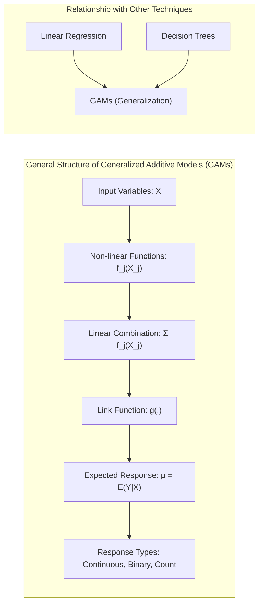
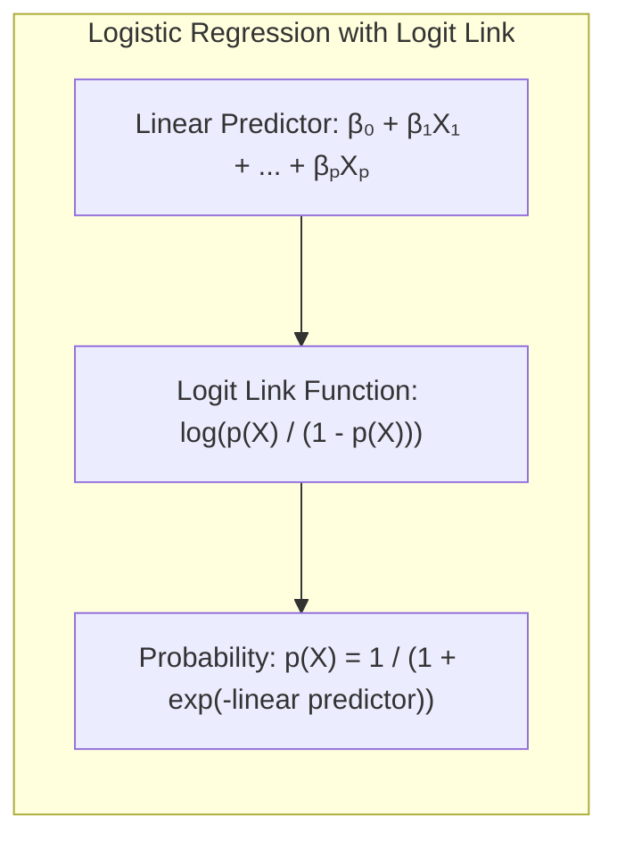
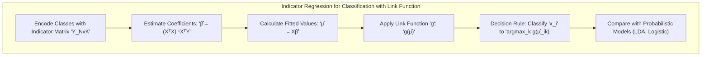
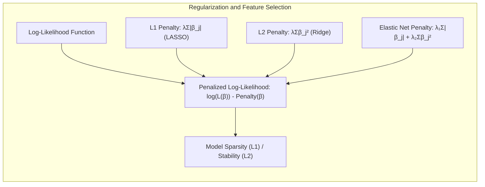
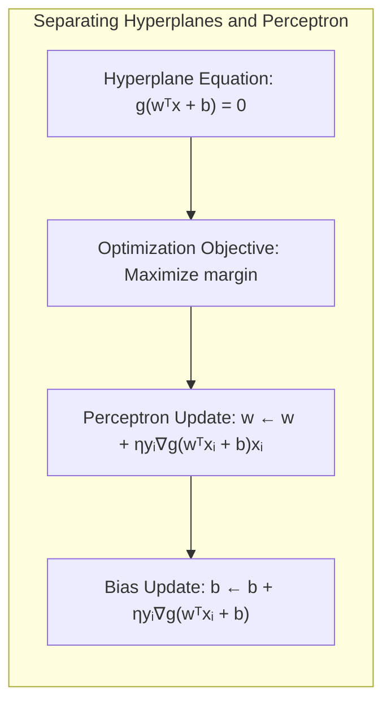
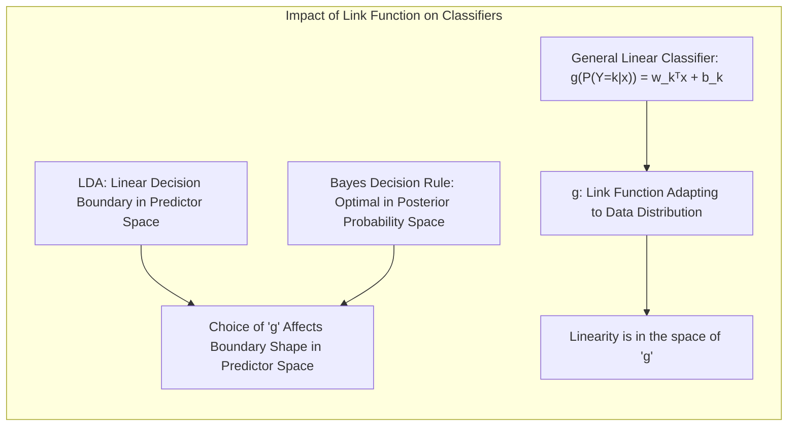

## Título: Modelos Aditivos Generalizados, Árvores e Métodos Relacionados: Uma Visão Aprofundada

### Introdução

Este capítulo oferece uma análise detalhada de métodos específicos para aprendizado supervisionado, com foco em como diferentes estruturas para a função de regressão lidam com a maldição da dimensionalidade, especialmente em situações onde os efeitos não lineares são proeminentes [^9.1]. Em cada técnica, há um *trade-off* entre a flexibilidade do modelo e a possibilidade de erro de especificação, o que deve ser cuidadosamente considerado. Partindo do ponto onde os Capítulos 3 a 6 terminaram, o capítulo explora cinco métodos principais: Modelos Aditivos Generalizados (GAMs), árvores de decisão, Multivariate Adaptive Regression Splines (MARS), o método de indução de regras de pacientes (PRIM), e misturas hierárquicas de especialistas (HME) [^9.1]. O foco principal é o entendimento profundo das formulações matemáticas, dos algoritmos de otimização e da análise teórica de cada método, com ênfase nas suas conexões e diferenças.

### Conceitos Fundamentais

**Conceito 1: O Problema de Classificação e Modelos Lineares com Função de Ligação**

No contexto da classificação e regressão, um modelo linear básico pode ser generalizado para lidar com diferentes tipos de variáveis resposta através da incorporação de uma função de ligação $g$. Essa função relaciona a média da resposta $\mu = E(Y|X)$ a uma combinação linear dos preditores. No caso mais simples (modelo linear), a função de ligação é a identidade, ou seja, $g(\mu) = \mu$. No entanto, para outros tipos de dados, como dados binários ou de contagem, funções de ligação diferentes podem ser mais apropriadas. A representação geral com a função de ligação é dada por:

$$
g(\mu) = \beta_0 + \beta_1X_1 + \beta_2X_2 + \ldots + \beta_pX_p
$$

onde $\mu$ é a média condicional da resposta $Y$ dado os preditores $X$, e $g$ é a função de ligação que conecta essa média com a combinação linear dos preditores. Embora simples, modelos lineares com a função de ligação podem ser limitados pela incapacidade de modelar não linearidades complexas, que são frequentemente encontradas em dados reais. A modelagem linear pode ser inadequada quando as relações entre os preditores e a resposta não seguem um padrão linear, resultando em *bias* e menor capacidade de generalização.

> 💡 **Exemplo Numérico:**
>
> Vamos considerar um cenário onde desejamos modelar a relação entre o tempo de estudo ($X_1$) e a nota em um exame ($Y$). Suponha que, em vez de uma relação linear, a nota aumente rapidamente com pouco tempo de estudo, e depois o aumento desacelera. Um modelo linear com função de ligação identidade ($g(\mu) = \mu$) poderia ser:
>
> $\mu = \beta_0 + \beta_1 X_1$
>
> Se $\beta_0 = 40$ e $\beta_1 = 5$, a previsão para 10 horas de estudo seria $40 + 5*10 = 90$. No entanto, um estudante que estudou 2 horas poderia ter uma nota de $40 + 5*2 = 50$, o que talvez não capture a não linearidade. Uma função de ligação diferente, como uma função logarítmica, poderia ser mais adequada para modelar a relação não linear, por exemplo:
>
> $g(\mu) = \log(\mu) = \beta_0 + \beta_1 X_1$
>
> Neste caso, se $g(\mu) = \log(\mu)$, a relação entre o tempo de estudo e a nota seria modelada de forma não linear, permitindo uma melhor representação da realidade.

**Lemma 1:** *A representação linear com a função de ligação, apesar da sua simplicidade, pode ser vista como uma aproximação de primeira ordem da relação entre os preditores e a resposta. Em muitos casos, a linearização da relação pode ser uma simplificação razoável, mas quando a relação é altamente não linear, essa linearização introduz um erro que pode prejudicar a qualidade do modelo*. A aproximação linear pode ser suficiente em certos contextos, mas é necessário considerar abordagens mais flexíveis para modelos mais complexos e não lineares [^4.3].

**Conceito 2: Linear Discriminant Analysis (LDA) e a Função de Decisão**

Em LDA, o objetivo é encontrar uma combinação linear de preditores que maximize a separação entre as classes. A função discriminante linear para uma classe $k$ é dada por:

$$
\delta_k(x) = x^T \Sigma^{-1} \mu_k - \frac{1}{2} \mu_k^T \Sigma^{-1} \mu_k + \log(\pi_k)
$$

onde $x$ é o vetor de preditores, $\mu_k$ é a média da classe $k$, $\Sigma$ é a matriz de covariância compartilhada entre todas as classes e $\pi_k$ é a probabilidade a priori da classe $k$ [^4.3]. A decisão é baseada na classe com maior valor da função discriminante. Em termos de uma função de ligação, podemos representar a decisão como:

$$
g(\mu_k) = x^T \Sigma^{-1} \mu_k - \frac{1}{2} \mu_k^T \Sigma^{-1} \mu_k + \log(\pi_k)
$$

onde $g$ pode ser vista como uma função de ligação que relaciona a média da classe $\mu_k$ com a função linear dos preditores. LDA assume a gaussianidade dos dados e homocedasticidade para todas as classes [^4.3.1]. A decisão baseada na comparação das funções discriminantes lineares equivale a escolher a classe com a maior probabilidade a posteriori, dada a observação $x$.

> 💡 **Exemplo Numérico:**
>
> Suponha que temos duas classes, $k=1$ e $k=2$, com as seguintes médias e matriz de covariância:
>
> $\mu_1 = \begin{bmatrix} 1 \\ 1 \end{bmatrix}$, $\mu_2 = \begin{bmatrix} 3 \\ 3 \end{bmatrix}$, $\Sigma = \begin{bmatrix} 1 & 0 \\ 0 & 1 \end{bmatrix}$, $\pi_1 = 0.5$, $\pi_2 = 0.5$
>
> Vamos calcular a função discriminante para uma observação $x = \begin{bmatrix} 2 \\ 2 \end{bmatrix}$.
>
> $\Sigma^{-1} = \begin{bmatrix} 1 & 0 \\ 0 & 1 \end{bmatrix}$
>
> $\delta_1(x) = \begin{bmatrix} 2 & 2 \end{bmatrix} \begin{bmatrix} 1 & 0 \\ 0 & 1 \end{bmatrix} \begin{bmatrix} 1 \\ 1 \end{bmatrix} - \frac{1}{2} \begin{bmatrix} 1 & 1 \end{bmatrix} \begin{bmatrix} 1 & 0 \\ 0 & 1 \end{bmatrix} \begin{bmatrix} 1 \\ 1 \end{bmatrix} + \log(0.5)$
>
> $\delta_1(x) = 4 - \frac{1}{2} * 2 + \log(0.5) = 3 - 0.693 = 2.307$
>
> $\delta_2(x) = \begin{bmatrix} 2 & 2 \end{bmatrix} \begin{bmatrix} 1 & 0 \\ 0 & 1 \end{bmatrix} \begin{bmatrix} 3 \\ 3 \end{bmatrix} - \frac{1}{2} \begin{bmatrix} 3 & 3 \end{bmatrix} \begin{bmatrix} 1 & 0 \\ 0 & 1 \end{bmatrix} \begin{bmatrix} 3 \\ 3 \end{bmatrix} + \log(0.5)$
>
> $\delta_2(x) = 12 - \frac{1}{2} * 18 + \log(0.5) = 3 - 0.693 = 2.307$
>
> Como $\delta_1(x) = \delta_2(x)$, a decisão seria ambígua, mas se tivéssemos $\delta_1(x) = 2.307$ e $\delta_2(x) = 4.307$, classificaríamos $x$ na classe 2.
>
> A função de ligação aqui é a própria função discriminante, que transforma os preditores em um valor que indica a qual classe a observação pertence.

**Corolário 1:** *A função discriminante linear da LDA, sob a premissa de distribuições Gaussianas com covariâncias iguais, pode ser interpretada como uma transformação dos dados para um espaço onde a diferença entre as médias das classes é maximizada, proporcionando a melhor separação linear possível*. A função discriminante, portanto, realiza a projeção dos dados em uma direção que maximiza a distância entre as médias, e a decisão de classe é tomada com base no maior valor projetado [^4.3.1].

**Conceito 3: Regressão Logística e a Função Logit**

Na regressão logística, a variável resposta é binária ($Y = 0$ ou $1$), e a probabilidade de $Y=1$ é modelada usando a função *logit* como função de ligação:

$$
\text{logit}(p(X)) = \log \left( \frac{p(X)}{1-p(X)} \right) = \beta_0 + \beta_1 X_1 + \ldots + \beta_p X_p
$$

onde $p(X) = P(Y=1|X)$. O modelo da regressão logística utiliza uma função de ligação do tipo *logit* para garantir que a probabilidade fique no intervalo [0,1]. A probabilidade é dada por:

$$
p(X) = \frac{1}{1 + e^{-(\beta_0 + \beta_1 X_1 + \ldots + \beta_p X_p)}}
$$

A função *logit* é a inversa da função logística, ou seja, $\text{logit}(p) = \log(\frac{p}{1-p})$. A função logística, na verdade, pode ser vista como uma função de ligação que relaciona a média da resposta binária à combinação linear dos preditores através do parâmetro $\beta$. A estimativa dos parâmetros $\beta$ é realizada através da maximização da *log-likelihood*:

$$
\log(L(\beta)) = \sum_{i=1}^N [y_i\log(p(x_i)) + (1-y_i)\log(1-p(x_i))]
$$

> ⚠️ **Nota Importante**: A função de ligação *logit* transforma a probabilidade em *log-odds*, o que lineariza a relação entre a probabilidade e a combinação linear dos preditores, permitindo o uso de métodos de regressão [^4.4.1].

> ❗ **Ponto de Atenção**: Quando a base de dados tem classes desbalanceadas, ou seja, uma classe tem mais observações do que a outra, a estimativa dos parâmetros pode ser tendenciosa e a acurácia da previsão pode ser afetada. Técnicas de reamostragem e ajuste de pesos podem ser utilizadas para mitigar esse problema [^4.4.2].

> ✔️ **Destaque**: Apesar de serem abordagens diferentes, a LDA e a regressão logística podem levar a resultados similares sob certas condições, especialmente quando se busca a separação linear das classes [^4.5].

> 💡 **Exemplo Numérico:**
>
> Vamos considerar um modelo de regressão logística com um único preditor, $X_1$, onde $X_1$ representa o número de horas de estudo para um exame. Suponha que, após ajustar o modelo, encontramos:
>
> $\text{logit}(p(X)) = -3 + 0.5 X_1$
>
> Se um estudante estuda 6 horas, a probabilidade de sucesso no exame ($Y=1$) seria:
>
> $\text{logit}(p(6)) = -3 + 0.5 * 6 = 0$
>
> $p(6) = \frac{1}{1 + e^{-0}} = \frac{1}{1+1} = 0.5$
>
> Isso significa que um estudante que estuda 6 horas tem 50% de chance de sucesso no exame. Se um estudante estuda 10 horas:
>
> $\text{logit}(p(10)) = -3 + 0.5 * 10 = 2$
>
> $p(10) = \frac{1}{1 + e^{-2}} = \frac{1}{1 + 0.135} \approx 0.88$
>
> Um estudante que estuda 10 horas tem aproximadamente 88% de chance de sucesso. A função *logit* lineariza a relação entre a probabilidade e o preditor, permitindo que a regressão logística modele a relação probabilística de forma eficaz.

### Regressão Linear e Mínimos Quadrados para Classificação com Função de Ligação

**Explicação:** Este diagrama representa o fluxo do processo de regressão de indicadores, incluindo a aplicação de uma função de ligação g, para modelar diferentes tipos de variáveis respostas, e como ele se relaciona à classificação, conforme descrito nos tópicos [^4.2] e [^4.1].

Na regressão linear para classificação, as classes são codificadas usando uma matriz indicadora $Y$ de dimensão $N \times K$, onde $N$ é o número de observações e $K$ é o número de classes. Os coeficientes $\beta$ são estimados usando o método dos mínimos quadrados, onde a função de ligação é usada para mapear as médias de resposta para as variáveis preditoras:

$$
\hat{\beta} = (X^T X)^{-1} X^T Y
$$

As previsões das classes são dadas por $\hat{Y} = X\hat{\beta}$. A escolha da função de ligação $g$ pode influenciar significativamente o resultado do modelo. A aplicação da função de ligação $g$ nos valores preditos $\hat{Y}$ resulta em novos valores $\hat{\mu} = g(\hat{Y})$. O processo de decisão de classe é feito atribuindo uma observação $x_i$ à classe que maximiza $g(\hat{\mu}_{ik})$. As limitações desta abordagem incluem a dificuldade em modelar não linearidades complexas e problemas com a influência da covariância entre classes (masking effect). A escolha da função de ligação pode ajudar a mitigar alguns desses problemas, mas não os resolve completamente.

> 💡 **Exemplo Numérico:**
>
> Suponha que temos 3 classes e 2 preditores e uma base de dados com 5 amostras:
>
> $$ X = \begin{bmatrix} 1 & 2 \\ 2 & 1 \\ 3 & 3 \\ 4 & 2 \\ 5 & 4 \end{bmatrix} $$
>
> A matriz indicadora Y (5x3) é dada por:
>
> $$ Y = \begin{bmatrix} 1 & 0 & 0 \\ 0 & 1 & 0 \\ 0 & 0 & 1 \\ 1 & 0 & 0 \\ 0 & 1 & 0 \end{bmatrix} $$
>
> Calculamos $\hat{\beta} = (X^T X)^{-1} X^T Y$:
>
> $X^T X = \begin{bmatrix} 55 & 43 \\ 43 & 35 \end{bmatrix}$
>
> $(X^T X)^{-1} = \frac{1}{192}\begin{bmatrix} 35 & -43 \\ -43 & 55 \end{bmatrix}$
>
> $X^T Y = \begin{bmatrix} 10 & 6 & 3 \\ 11 & 6 & 3 \end{bmatrix}$
>
> $\hat{\beta} = (X^T X)^{-1} X^T Y = \frac{1}{192}\begin{bmatrix} 35 & -43 \\ -43 & 55 \end{bmatrix} \begin{bmatrix} 10 & 6 & 3 \\ 11 & 6 & 3 \end{bmatrix} = \begin{bmatrix} -0.20 & 0.06 & 0.07 \\ 0.26 & -0.04 & -0.06 \end{bmatrix}$
>
> Calculamos as previsões:
>
> $\hat{Y} = X\hat{\beta} = \begin{bmatrix} 0.32 & -0.02 & -0.05 \\ 0.25 & 0.08 & 0.01 \\ 0.43 & 0.00 & -0.02 \\ 0.29 & 0.08 & 0.00 \\ 0.45 & 0.00 & -0.03 \end{bmatrix}$
>
> Aplicando a função de ligação identidade $g(\mu) = \mu$, a classe prevista para a primeira observação seria a classe 1, pois $\hat{\mu}_{11}$ (0.32) é maior que $\hat{\mu}_{12}$ (-0.02) e $\hat{\mu}_{13}$ (-0.05).
>
> Este exemplo mostra como a regressão linear com matriz indicadora e função de ligação pode ser usada para classificação. A função de ligação identidade é usada aqui, mas outras funções podem ser usadas dependendo do problema.

**Lemma 2:** *Em casos onde as classes são separáveis por hiperplanos, o uso de uma função de ligação adequada na regressão linear da matriz de indicadores pode levar a resultados semelhantes a outros métodos lineares, como a LDA, sob certas condições. A necessidade da função de ligação se torna ainda mais relevante quando as variáveis respostas não são contínuas, e são discretas, como a probabilidade de classes, no caso da classificação*. [^4.2]

**Corolário 2:** *A aplicação de funções de ligação na regressão linear de indicadores pode ser útil para lidar com dados com diferentes distribuições, e pode gerar modelos mais robustos que modelos lineares com ligação identidade. As projeções para a decisão das classes podem ser similares aos modelos lineares, mas o uso da função de ligação possibilita modelar diferentes tipos de variáveis de resposta*. [^4.3]

Quando comparamos a regressão linear com função de ligação e a regressão logística [^4.4], a regressão logística utiliza a função *logit* como função de ligação e maximiza a verossimilhança para estimar os parâmetros, enquanto a regressão linear usa uma função de ligação dependente da variável resposta, como a identidade para respostas contínuas, e minimiza os erros quadráticos para estimar os parâmetros. A escolha do método depende do tipo de variável resposta e do objetivo do modelo, seja predição ou análise exploratória dos dados.

### Métodos de Seleção de Variáveis e Regularização em Classificação com Função de Ligação

A seleção de variáveis e a regularização são técnicas importantes para melhorar a interpretabilidade e a generalização dos modelos de classificação, especialmente quando se utiliza funções de ligação. A regularização, em modelos como a regressão logística, é implementada através da adição de um termo de penalidade na função de *log-likelihood*:

$$
\log(L(\beta))  - \text{Penalidade}(\beta)
$$

Para a penalização L1 (LASSO), o termo de penalidade é dado por:
$$
\text{Penalidade}(\beta) = \lambda \sum_{j=1}^p |\beta_j|
$$

onde $\lambda$ controla a intensidade da regularização. A penalização L1 induz esparsidade, ou seja, muitos coeficientes são estimados como zero [^4.5.1]. A penalização L2 (Ridge), o termo de penalidade é dado por:

$$
\text{Penalidade}(\beta) = \lambda \sum_{j=1}^p \beta_j^2
$$

Esta penalização reduz a magnitude dos coeficientes, melhorando a estabilidade do modelo [^4.5.2]. Uma combinação das duas é conhecida como penalização Elastic Net:

$$
\text{Penalidade}(\beta) = \lambda_1 \sum_{j=1}^p |\beta_j| + \lambda_2 \sum_{j=1}^p \beta_j^2
$$

onde $\lambda_1$ e $\lambda_2$ são os parâmetros de regularização para L1 e L2, respectivamente. A função de ligação influencia a escolha da penalização, uma vez que esta penaliza os parâmetros na escala da combinação linear dos preditores.

> 💡 **Exemplo Numérico:**
>
> Vamos considerar um modelo de regressão logística com dois preditores, $X_1$ e $X_2$, e uma penalização L1 (LASSO). A função de log-verossimilhança penalizada é:
>
> $\log(L(\beta)) - \lambda (|\beta_1| + |\beta_2|)$
>
> Suponha que, sem penalização, os coeficientes estimados sejam $\beta_1 = 2$ e $\beta_2 = -1.5$. Se definirmos $\lambda = 1$, o problema de otimização penalizado tentará minimizar a função de log-verossimilhança ao mesmo tempo que minimiza a soma dos valores absolutos dos coeficientes, reduzindo a magnitude dos coeficientes:
>
> Com uma penalização L2 (Ridge), a função de log-verossimilhança penalizada é:
>
> $\log(L(\beta)) - \lambda (\beta_1^2 + \beta_2^2)$
>
> Usando o mesmo exemplo, com $\lambda = 1$, a penalização L2 reduzirá os coeficientes, mas não os forçará a zero. Os coeficientes estimados seriam menores em magnitude do que sem a penalização, mas ambos permaneceriam diferentes de zero.
>
> Elastic Net combina L1 e L2. Se usarmos $\lambda_1 = 0.5$ e $\lambda_2 = 0.5$, a função de log-verossimilhança penalizada é:
>
> $\log(L(\beta)) - 0.5(|\beta_1| + |\beta_2|) - 0.5(\beta_1^2 + \beta_2^2)$
>
> A penalização Elastic Net induz esparsidade, como L1, e reduz a magnitude dos coeficientes, como L2. A escolha entre L1, L2 e Elastic Net depende do problema, da necessidade de esparsidade e da estabilidade dos coeficientes.

**Lemma 3:** *Em modelos com função de ligação, a penalização L1 na função de *log-likelihood* induz a esparsidade dos parâmetros na escala da combinação linear de preditores, o que facilita a interpretação e identificação das variáveis mais importantes.* A penalização L1 é dada por:

$$ \text{Penalidade}(\beta) =  \lambda \sum_{j=1}^p |\beta_j| $$

onde $\lambda$ é um parâmetro de ajuste que controla a intensidade da regularização. A natureza não diferenciável da função de valor absoluto na origem tende a gerar soluções com muitos coeficientes iguais a zero. [^4.4.4]

**Prova do Lemma 3:** A função de custo, incluindo a regularização L1, é:

$$ C(\beta) = - \sum_{i=1}^N [y_i \log(p(x_i)) + (1-y_i) \log(1-p(x_i))] +  \lambda \sum_{j=1}^p |\beta_j| $$

Para minimizar esta função, alguns dos coeficientes $\beta_j$ são levados a zero devido à natureza da função de valor absoluto, que não é diferenciável na origem, fazendo com que a função de custo total tenha um mínimo com alguns coeficientes iguais a zero. $\blacksquare$

**Corolário 3:** *A esparsidade induzida pela penalização L1 promove a seleção de variáveis relevantes, simplificando o modelo e melhorando sua capacidade de generalização em modelos com diferentes funções de ligação. A interpretação do modelo também é facilitada, pois apenas as variáveis mais influentes são consideradas*. [^4.4.5]

> ⚠️ **Ponto Crucial**: A escolha da penalização (L1, L2 ou Elastic Net) deve ser baseada na natureza do problema, no número de preditores e na necessidade de esparsidade ou estabilidade dos parâmetros. A escolha da função de ligação também pode influenciar na importância da penalização e seus resultados finais [^4.5].

### Separating Hyperplanes e Perceptrons com Função de Ligação

Hiperplanos separadores, quando utilizados em conjunto com uma função de ligação, buscam dividir o espaço de características de uma maneira mais flexível. A equação do hiperplano é dada por:

$$
g(w^Tx + b) = 0
$$

onde $w$ é o vetor normal ao hiperplano, $x$ é o vetor de preditores, $b$ é o bias e $g$ é a função de ligação que transforma o resultado do produto interno com o bias em um espaço onde a separação das classes é mais clara. A margem de separação, nesse caso, deve ser definida no espaço da função de ligação $g$. A otimização do hiperplano separador busca maximizar a margem entre classes:

$$
\max_{w, b} \frac{1}{||w||} \text{ sujeito a } y_i g(w^Tx_i + b) \geq 1
$$

onde $y_i$ são os rótulos de classe. A escolha da função de ligação $g$ pode influenciar a forma do hiperplano, o que permite a separação de classes com não linearidades [^4.5.2]. O Perceptron, como um algoritmo iterativo, busca otimizar o hiperplano através de atualizações nos pesos e no viés usando uma função de ligação:

$$
w \leftarrow w + \eta y_i \nabla g(w^Tx_i + b)x_i
$$
$$
b \leftarrow b + \eta y_i \nabla g(w^Tx_i + b)
$$

onde $\eta$ é a taxa de aprendizagem, e $\nabla g$ é o gradiente da função de ligação. A convergência deste algoritmo depende da separabilidade linear dos dados, bem como da escolha da função de ligação e taxa de aprendizado [^4.5.1].

> 💡 **Exemplo Numérico:**
>
> Suponha que temos duas classes com as seguintes amostras:
>
> Classe 1: $x_1 = \begin{bmatrix} 1 \\ 1 \end{bmatrix}$, $x_2 = \begin{bmatrix} 2 \\ 1 \end{bmatrix}$
>
> Classe 2: $x_3 = \begin{bmatrix} 1 \\ 3 \end{bmatrix}$, $x_4 = \begin{bmatrix} 2 \\ 3 \end{bmatrix}$
>
> Inicializamos os pesos $w = \begin{bmatrix} 0.5 \\ 0.5 \end{bmatrix}$ e o bias $b = -1$. Vamos usar a função de ligação identidade $g(z) = z$. A taxa de aprendizagem $\eta = 0.1$.
>
> 1. Para $x_1$: $w^Tx_1 + b = 0.5*1 + 0.5*1 - 1 = 0$. Como $y_1 = 1$, a previsão está correta, então não atualizamos os pesos.
>
> 2. Para $x_2$: $w^Tx_2 + b = 0.5*2 + 0.5*1 - 1 = 0.5$. Como $y_2 = 1$, a previsão está correta.
>
> 3. Para $x_3$: $w^Tx_3 + b = 0.5*1 + 0.5*3 - 1 = 1$. Como $y_3 = -1$, a previsão está errada. Atualizamos os pesos:
>
> $w \leftarrow w + \eta y_3 x_3 = \begin{bmatrix} 0.5 \\ 0.5 \end{bmatrix} + 0.1 * -1 * \begin{bmatrix} 1 \\ 3 \end{bmatrix} = \begin{bmatrix} 0.4 \\ 0.2 \end{bmatrix}$
>
> $b \leftarrow b + \eta y_3 = -1 + 0.1 * -1 = -1.1$
>
> 4. Para $x_4$: $w^Tx_4 + b = 0.4*2 + 0.2*3 - 1.1 = 0.7$. Como $y_4 = -1$, a previsão está errada. Atualizamos os pesos:
>
> $w \leftarrow w + \eta y_4 x_4 = \begin{bmatrix} 0.4 \\ 0.2 \end{bmatrix} + 0.1 * -1 * \begin{bmatrix} 2 \\ 3 \end{bmatrix} = \begin{bmatrix} 0.2 \\ -0.1 \end{bmatrix}$
>
> $b \leftarrow b + \eta y_4 = -1.1 + 0.1 * -1 = -1.2$
>
> O algoritmo do Perceptron continua iterando e ajustando $w$ e $b$ até que todos os dados sejam classificados corretamente. A função de ligação nesse caso é identidade, mas outras funções podem ser usadas para modelar problemas não linearmente separáveis.

### Pergunta Teórica Avançada: Como a escolha da função de ligação afeta a formulação do classificador linear e a relação entre LDA e Regra de Decisão Bayesiana?

**Resposta:**

A escolha da função de ligação em um classificador linear tem um impacto significativo na formulação do modelo e na sua relação com a LDA e a Regra de Decisão Bayesiana, particularmente quando as distribuições não são gaussianas com covariâncias iguais.

Na LDA, a linearidade é introduzida diretamente na formulação do classificador. A função discriminante assume que as classes são Gaussianas com covariâncias iguais e busca um hiperplano que maximize a separação entre as classes. A função de decisão é linear no espaço dos preditores. Ao usar uma função de ligação na formulação, podemos pensar que o hiperplano é linear no espaço da função de ligação.

Na Regra de Decisão Bayesiana, com distribuições gaussianas e covariâncias iguais, a função de ligação é implicitamente determinada pela própria distribuição gaussiana e pela regra de Bayes. A decisão é tomada atribuindo uma observação à classe que maximiza a probabilidade a posteriori. No entanto, quando as distribuições não são Gaussianas, a função de ligação pode modificar a forma da fronteira de decisão, que pode não ser linear no espaço dos preditores.

Quando uma função de ligação genérica é usada, o classificador pode ser escrito na forma:

$$
g(P(Y = k|x)) = w_k^T x + b_k
$$

onde $g$ é a função de ligação. Essa formulação permite maior flexibilidade na modelagem da relação entre a probabilidade e os preditores. Em comparação com a LDA, onde a linearidade é intrínseca ao método, a escolha da função de ligação permite modelar não linearidades na relação entre a probabilidade a posteriori da classe e os preditores.

**Lemma 4:** *Sob a premissa de que a Regra de Decisão Bayesiana gera fronteiras lineares no espaço da função de ligação, a escolha da função de ligação afeta a forma da fronteira de decisão no espaço dos preditores e, portanto, a equivalência entre LDA e a Regra de Decisão Bayesiana é válida somente sob condições específicas e com funções de ligação apropriadas.* Isso mostra que o uso de funções de ligação influencia diretamente a relação entre as duas abordagens [^4.3], [^