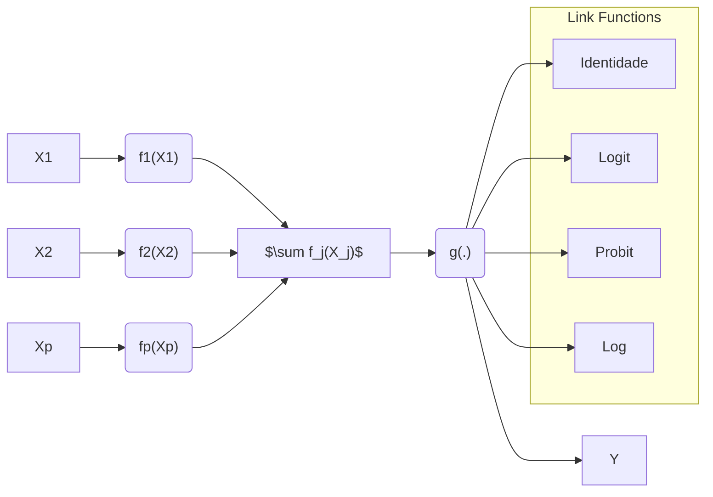
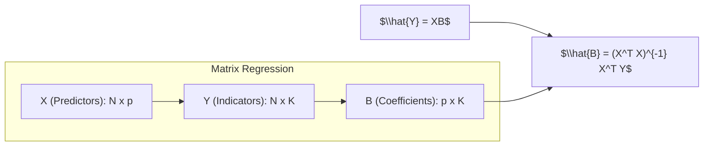
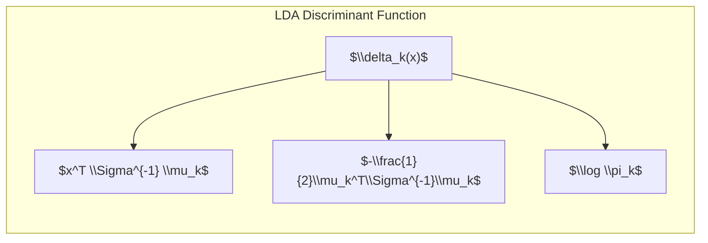
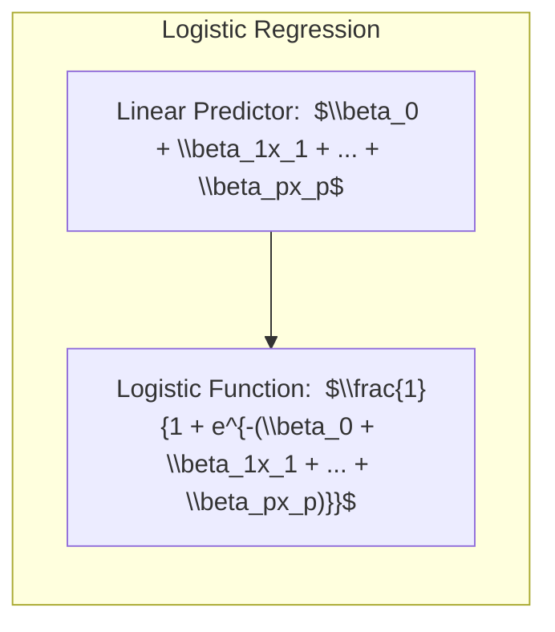
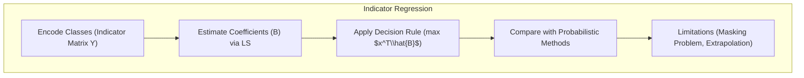
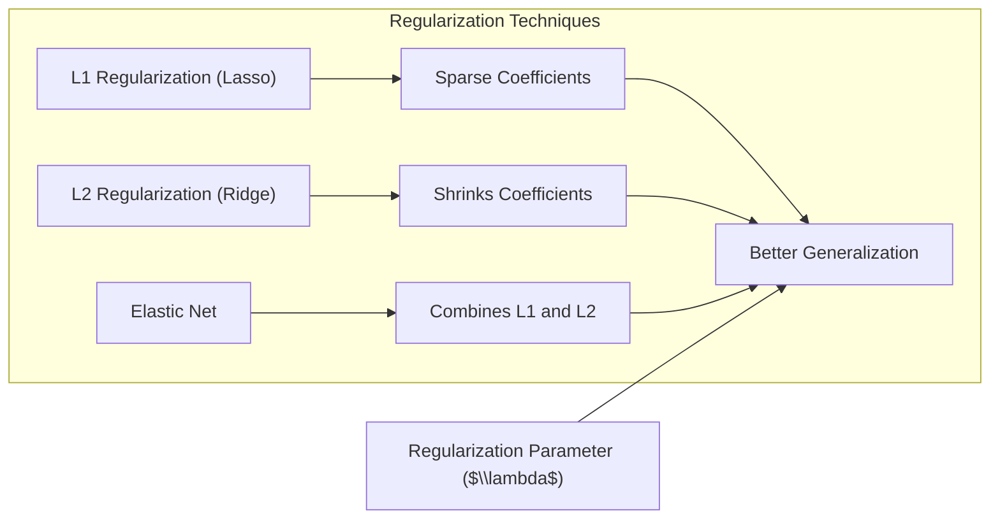
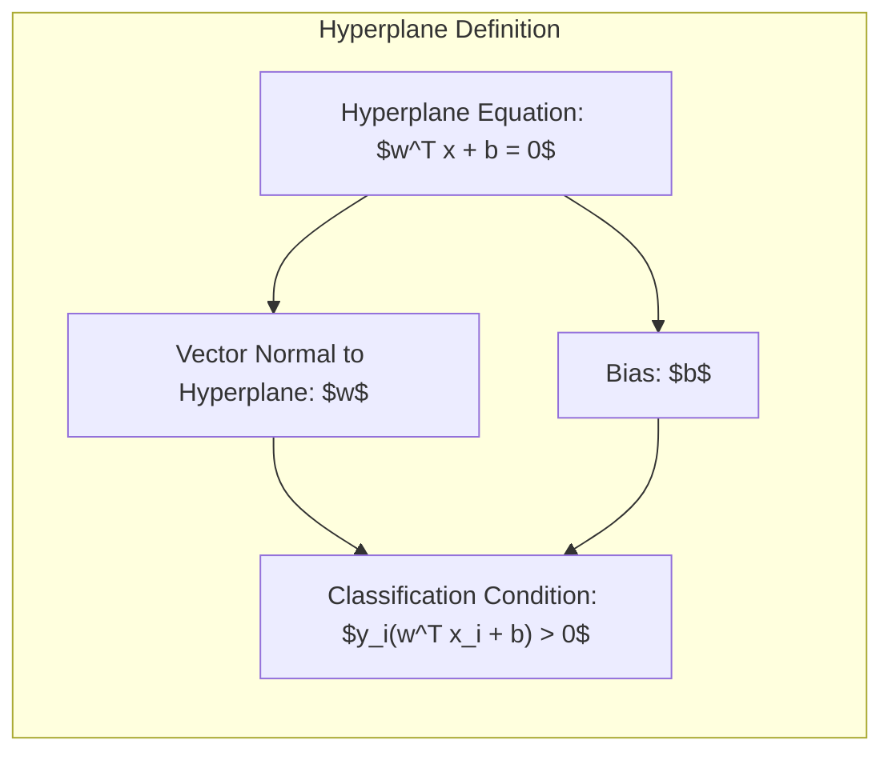

## Título: Modelos Aditivos Generalizados, Árvores e Métodos Relacionados para Classificação



### Introdução

Este capítulo explora métodos específicos para **aprendizado supervisionado**, cada um assumindo uma forma estruturada diferente para a função de regressão desconhecida, oferecendo soluções para a **maldição da dimensionalidade** [^9.1]. É fundamental entender que existe um *trade-off* entre a complexidade do modelo e o risco de misspecificação. Os métodos abordados são extensões dos temas apresentados nos capítulos 3 a 6, incluindo **modelos aditivos generalizados**, **árvores de decisão**, **splines de regressão adaptativa multivariada (MARS)**, o método de indução de regras do paciente (PRIM) e misturas hierárquicas de especialistas (HME). O foco é entender como esses modelos podem ser aplicados em problemas de classificação e regressão, especialmente em situações onde a relação entre as variáveis preditoras e a variável de resposta não é linear.

### Conceitos Fundamentais

**Conceito 1:** O **problema de classificação** busca atribuir uma classe ou categoria a uma dada observação com base em suas características. Métodos lineares, embora simples, podem ser inadequados para modelar relações complexas e não lineares presentes em dados reais [^9.1]. A escolha de um método linear implica um *trade-off* entre viés e variância. Modelos com muitos parâmetros podem se ajustar bem aos dados de treinamento, mas podem não generalizar bem para novos dados, um exemplo claro de alta variância. Já modelos com menos parâmetros podem apresentar alto viés, não capturando adequadamente a complexidade dos dados. É crucial entender como a estrutura linear afeta esse balanço, pois pode simplificar demais o problema, levando a soluções subótimas, ou o oposto, levando a overfitting.

> 💡 **Exemplo Numérico:**
> Considere um problema de classificação binária com duas variáveis preditoras ($X_1$ e $X_2$) e uma variável resposta ($Y$ com classes 0 e 1). Em um cenário onde as classes são separadas por uma fronteira circular, um modelo linear (como uma regressão logística simples) não conseguiria capturar essa relação, resultando em um modelo com alto viés e desempenho ruim. Por outro lado, um modelo complexo, como uma árvore de decisão profunda, poderia se ajustar perfeitamente aos dados de treino, mas poderia ter um desempenho ruim em dados novos (alta variância). Um GAM, por exemplo, poderia modelar cada preditor com funções não lineares, capturando a separação das classes, equilibrando viés e variância.

**Lemma 1:** Dado um conjunto de dados de classificação, a **regressão linear da matriz indicadora** pode ser vista como uma aproximação para a construção de **funções discriminantes lineares**, com coeficientes estimados por mínimos quadrados. Em cenários onde as classes são bem separadas, esta aproximação pode gerar resultados comparáveis ao LDA.

Seja $X$ a matriz de preditores de dimensões $N \times p$, onde $N$ é o número de observações e $p$ o número de preditores. A matriz de indicadores $Y$ possui dimensões $N \times K$, onde $K$ é o número de classes, com cada linha da forma $[0, \ldots, 1, \ldots, 0]$, com o '1' na coluna que corresponde à classe da observação. O modelo de regressão linear para a matriz indicadora é:

$$
\hat{Y} = XB
$$

Onde $\hat{Y}$ é a matriz de indicadores de classe estimada, $X$ é a matriz de preditores, e $B$ são os coeficientes estimados por mínimos quadrados. A solução para $B$ é dada por:

$$
\hat{B} = (X^T X)^{-1} X^T Y
$$


Ao projetar os dados no espaço gerado pelas colunas de $B$, os pontos de diferentes classes se agrupam linearmente. A matriz $B$ pode ser utilizada para definir os **hiperplanos de decisão**. A previsão para uma nova observação $x$ é feita calculando $x^T \hat{B}$ e atribuindo a observação à classe com a maior entrada neste vetor. A função discriminante para cada classe $k$ é dada por $\delta_k(x) = x^T \hat{B}_k$, onde $\hat{B}_k$ é a $k$-ésima coluna de $\hat{B}$.

> 💡 **Exemplo Numérico:**
> Suponha um problema de classificação com $N=4$ amostras, $p=2$ preditores e $K=2$ classes. As matrizes $X$ e $Y$ são:
>
> $X = \begin{bmatrix} 1 & 2 \\ 2 & 1 \\ 3 & 3 \\ 4 & 2 \end{bmatrix}$
>
> $Y = \begin{bmatrix} 1 & 0 \\ 1 & 0 \\ 0 & 1 \\ 0 & 1 \end{bmatrix}$
>
> Primeiro, calculamos $X^T X$:
>
> $X^T X = \begin{bmatrix} 1 & 2 & 3 & 4 \\ 2 & 1 & 3 & 2 \end{bmatrix} \begin{bmatrix} 1 & 2 \\ 2 & 1 \\ 3 & 3 \\ 4 & 2 \end{bmatrix} = \begin{bmatrix} 30 & 25 \\ 25 & 18 \end{bmatrix}$
>
> Em seguida, calculamos $(X^T X)^{-1}$:
>
> $(X^T X)^{-1} = \frac{1}{(30)(18)-(25)(25)} \begin{bmatrix} 18 & -25 \\ -25 & 30 \end{bmatrix} = \begin{bmatrix} 0.346 & -0.480 \\ -0.480 & 0.577 \end{bmatrix}$
>
> Agora, calculamos $X^T Y$:
>
> $X^T Y = \begin{bmatrix} 1 & 2 & 3 & 4 \\ 2 & 1 & 3 & 2 \end{bmatrix} \begin{bmatrix} 1 & 0 \\ 1 & 0 \\ 0 & 1 \\ 0 & 1 \end{bmatrix} = \begin{bmatrix} 3 & 7 \\ 3 & 5 \end{bmatrix}$
>
> Finalmente, calculamos $\hat{B}$:
>
> $\hat{B} = (X^T X)^{-1} X^T Y = \begin{bmatrix} 0.346 & -0.480 \\ -0.480 & 0.577 \end{bmatrix} \begin{bmatrix} 3 & 7 \\ 3 & 5 \end{bmatrix} = \begin{bmatrix} -0.402 & 0.022 \\ 0.291 & -0.461 \end{bmatrix}$
>
> Para classificar uma nova amostra, por exemplo $x = \begin{bmatrix} 2 \\ 2 \end{bmatrix}$, calculamos $x^T \hat{B}$:
>
> $x^T \hat{B} = \begin{bmatrix} 2 & 2 \end{bmatrix} \begin{bmatrix} -0.402 & 0.022 \\ 0.291 & -0.461 \end{bmatrix} = \begin{bmatrix} -0.222 & -0.878 \end{bmatrix}$
>
> A amostra seria classificada na classe 0, pois o primeiro valor é maior.

**Conceito 2:** A **Linear Discriminant Analysis (LDA)**, como abordado em capítulos anteriores, assume que os dados para cada classe seguem uma distribuição normal multivariada com a mesma matriz de covariância [^4.3]. A **fronteira de decisão** entre duas classes, na LDA, é linear e definida com base nas médias e covariâncias das classes [^4.3.1]. O LDA busca encontrar a combinação linear das variáveis que melhor separe as classes, maximizando a separação entre as médias das classes e minimizando a variabilidade dentro de cada classe [^4.3.2]. A formulação da função discriminante na LDA é dada por:

$$
\delta_k(x) = x^T \Sigma^{-1} \mu_k - \frac{1}{2}\mu_k^T\Sigma^{-1}\mu_k + \log \pi_k
$$

Onde $\mu_k$ é o vetor de média da classe $k$, $\Sigma$ é a matriz de covariância comum e $\pi_k$ é a probabilidade *a priori* da classe $k$ [^4.3.3]. A classe predita para uma nova observação $x$ é aquela que maximiza $\delta_k(x)$. O LDA pode ser interpretado como uma aplicação da regra Bayesiana para o caso particular de distribuições Gaussianas com covariâncias iguais, e a função discriminante $\delta_k(x)$ fornece um critério linear de decisão.


> 💡 **Exemplo Numérico:**
> Suponha duas classes com as seguintes médias e matriz de covariância comum:
>
> $\mu_1 = \begin{bmatrix} 1 \\ 1 \end{bmatrix}$, $\mu_2 = \begin{bmatrix} 3 \\ 3 \end{bmatrix}$, $\Sigma = \begin{bmatrix} 1 & 0.5 \\ 0.5 & 1 \end{bmatrix}$
>
> E as probabilidades *a priori*  são: $\pi_1 = 0.6$ e $\pi_2 = 0.4$. Calculamos $\Sigma^{-1}$:
>
> $\Sigma^{-1} = \frac{1}{(1)(1)-(0.5)(0.5)} \begin{bmatrix} 1 & -0.5 \\ -0.5 & 1 \end{bmatrix} = \begin{bmatrix} 1.33 & -0.67 \\ -0.67 & 1.33 \end{bmatrix}$
>
> Para classificar uma nova observação $x = \begin{bmatrix} 2 \\ 2 \end{bmatrix}$, calculamos as funções discriminantes:
>
> $\delta_1(x) = \begin{bmatrix} 2 & 2 \end{bmatrix} \begin{bmatrix} 1.33 & -0.67 \\ -0.67 & 1.33 \end{bmatrix} \begin{bmatrix} 1 \\ 1 \end{bmatrix} - \frac{1}{2} \begin{bmatrix} 1 & 1 \end{bmatrix} \begin{bmatrix} 1.33 & -0.67 \\ -0.67 & 1.33 \end{bmatrix} \begin{bmatrix} 1 \\ 1 \end{bmatrix} + \log(0.6) = 1.33 - 0.67 + \log(0.6) = 0.66 - 0.51 = 0.15$
>
> $\delta_2(x) = \begin{bmatrix} 2 & 2 \end{bmatrix} \begin{bmatrix} 1.33 & -0.67 \\ -0.67 & 1.33 \end{bmatrix} \begin{bmatrix} 3 \\ 3 \end{bmatrix} - \frac{1}{2} \begin{bmatrix} 3 & 3 \end{bmatrix} \begin{bmatrix} 1.33 & -0.67 \\ -0.67 & 1.33 \end{bmatrix} \begin{bmatrix} 3 \\ 3 \end{bmatrix} + \log(0.4) = 7.98 - 6.00 + \log(0.4) = 1.98 - 0.92 = 1.06$
>
> Como $\delta_2(x) > \delta_1(x)$, a amostra seria classificada na classe 2.

**Corolário 1:** Se as classes seguem uma distribuição normal com covariâncias iguais, a função discriminante do LDA pode ser interpretada como uma projeção dos dados em um subespaço de dimensão menor, onde a separação entre as classes é maximizada. Este resultado surge da minimização da distância de Mahalanobis entre as observações e as médias de cada classe [^4.3.1]. A distância de Mahalanobis entre um ponto $x$ e a média da classe $k$, $\mu_k$, é dada por $\sqrt{(x - \mu_k)^T \Sigma^{-1} (x - \mu_k)}$. O LDA assume que a covariância é a mesma para todas as classes, $\Sigma$, e então a distância se reduz a uma forma linear em $x$.

**Conceito 3:** A **Regressão Logística** modela a probabilidade de uma observação pertencer a uma classe usando uma função logística da combinação linear dos preditores [^4.4]. O modelo logístico para a probabilidade da classe 1 é dado por:

$$
p(x) = \frac{1}{1 + e^{-(\beta_0 + \beta_1x_1 + \ldots + \beta_px_p)}}
$$

Ou, equivalentemente, o log-odds (logit) é modelado como:

$$
\log\left(\frac{p(x)}{1-p(x)}\right) = \beta_0 + \beta_1x_1 + \ldots + \beta_px_p
$$

Onde $p(x)$ é a probabilidade da classe 1, e os $\beta_i$ são os coeficientes do modelo [^4.4.1]. Os parâmetros são estimados maximizando a verossimilhança, dada por:

$$
L(\beta) = \prod_{i=1}^{N} p(x_i)^{y_i} (1-p(x_i))^{(1-y_i)}
$$

Onde $y_i \in \{0, 1\}$ é o rótulo de classe da observação $i$ [^4.4.3]. Diferentemente do LDA, a regressão logística não assume normalidade dos preditores [^4.4.2]. Ambos os métodos, LDA e regressão logística, buscam encontrar separações lineares, mas a regressão logística estima probabilidades condicionais e pode ser mais apropriada quando o interesse está em probabilidades, e não em funções discriminantes. Em casos onde as classes são separáveis, os resultados podem ser semelhantes, mas a logística tende a ser mais robusta a desvios da normalidade [^4.4.5].


> 💡 **Exemplo Numérico:**
> Considere um modelo de regressão logística com dois preditores, $x_1$ e $x_2$, e os seguintes coeficientes: $\beta_0 = -1$, $\beta_1 = 0.5$, $\beta_2 = 0.8$. Para uma amostra com $x = \begin{bmatrix} 2 \\ 1 \end{bmatrix}$, a probabilidade de pertencer à classe 1 é:
>
> $p(x) = \frac{1}{1 + e^{-(-1 + 0.5*2 + 0.8*1)}} = \frac{1}{1 + e^{-0.8}} = \frac{1}{1 + 0.45} = \frac{1}{1.45} \approx 0.69$
>
> A probabilidade de pertencer à classe 0 seria $1 - 0.69 = 0.31$. A amostra seria classificada na classe 1, pois a probabilidade é maior.

A forma geral de um **Modelo Aditivo Generalizado (GAM)** é dada por:

$$
g[E(Y|X_1, X_2, \ldots, X_p)] = \alpha + f_1(X_1) + f_2(X_2) + \ldots + f_p(X_p)
$$

Onde $g$ é uma função de ligação (link function), $E(Y|X_1, X_2, \ldots, X_p)$ é a esperança condicional da resposta $Y$ dado os preditores $X_1, X_2, \ldots, X_p$, $\alpha$ é o intercepto e $f_j$ são funções não paramétricas desconhecidas.

> ⚠️ **Nota Importante**: Modelos de classificação linear podem não ser adequados quando as relações entre as variáveis e as classes são não lineares. A escolha do modelo deve considerar a natureza dos dados e o objetivo da análise. **Referência ao tópico [^4.4.1]**. A flexibilidade dos GAMs permite que cada preditor tenha sua própria função, não limitada a uma forma linear.

> ❗ **Ponto de Atenção**: Classes desbalanceadas podem influenciar a performance dos modelos lineares, especialmente na regressão logística. Técnicas de balanceamento ou uso de pesos podem ser necessárias. **Conforme indicado em [^4.4.2]**. A aplicação da regressão logística dentro de um GAM, como mostrado acima, também pode ser afetada.

> ✔️ **Destaque**: Há uma correlação entre as estimativas de parâmetros em LDA e em regressão logística em casos onde as classes são separáveis linearmente. **Baseado no tópico [^4.5]**. É importante notar que modelos como o GAM, que são mais flexíveis, podem superar as limitações dos modelos lineares quando o problema não é linear.

### Regressão Linear e Mínimos Quadrados para Classificação



A **regressão linear de uma matriz indicadora** é uma abordagem para classificação onde cada classe é representada por um vetor de indicadores binários, e a regressão linear é aplicada a cada um desses indicadores [^4.2]. Essa abordagem busca modelar a probabilidade de pertencimento a uma classe, por meio de uma combinação linear das variáveis preditoras. No entanto, esta abordagem possui limitações, como o “masking problem”, onde a influência de variáveis preditoras pode ser encoberta pela dependência entre classes [^4.3].

Em problemas de classificação com $K$ classes, a matriz de resposta $Y$ pode ser representada por uma matriz $N \times K$, onde $N$ é o número de amostras. Cada linha $i$ possui um valor 1 na coluna correspondente à classe da amostra $i$, e 0 nas demais colunas. O modelo de regressão linear para essa matriz é dado por:

$$
Y = XB + E
$$

onde $X$ é a matriz de preditores $N \times p$, $B$ é a matriz de coeficientes $p \times K$ a ser estimada por mínimos quadrados, e $E$ é a matriz de erros $N \times K$. A solução para $B$ é dada por:

$$
\hat{B} = (X^TX)^{-1}X^TY
$$

Após estimar os coeficientes, a classe predita para uma nova amostra $x$ é aquela com maior valor em $x^T\hat{B}$. Embora essa abordagem possa gerar boas soluções, ela não garante que as probabilidades estimadas estejam entre 0 e 1. A decisão final da classe é tomada através de um *argmax*. Este método busca encontrar o melhor hiperplano de decisão através de projeções lineares.

**Lemma 2:** Se as classes são linearmente separáveis e a matriz de covariância para cada classe é igual ($\Sigma_k = \Sigma, \forall k$), a solução obtida via regressão linear da matriz indicadora é equivalente à solução do LDA, no sentido de que ambos os métodos levam à mesma fronteira de decisão.

**Prova do Lemma 2:** A solução de mínimos quadrados $\hat{B} = (X^TX)^{-1}X^TY$ é uma transformação linear das respostas $Y$. Sob as hipóteses de classes gaussianas com covariâncias iguais, os coeficientes $\hat{B}$ são proporcionais aos coeficientes da função discriminante do LDA. Se a regra de decisão em ambos os casos é tomar a classe com maior valor de função, então as fronteiras de decisão serão equivalentes. A função discriminante do LDA,

$$
\delta_k(x) = x^T \Sigma^{-1} \mu_k - \frac{1}{2}\mu_k^T\Sigma^{-1}\mu_k + \log \pi_k
$$

leva à mesma separação entre as classes, pois, neste caso especial, ambas as abordagens encontram a mesma direção de separação. $\blacksquare$

**Corolário 2:** A equivalência entre regressão linear e LDA em casos especiais simplifica a análise, pois a matriz de indicadores permite obter as projeções dos dados nas classes através de uma regressão linear, e as decisões de classe são tomadas com base nas projeções. Conforme indicado em [^4.3], esta equivalência é válida sob as condições de covariâncias iguais e classes separáveis. O método de regressão linear é não-probabilístico e não oferece estimativas diretas de probabilidades de classe.

Em alguns casos, a **regressão logística** pode fornecer estimativas mais estáveis das probabilidades, enquanto a **regressão de indicadores** pode levar a extrapolações fora do intervalo [0,1] [^4.4]. No entanto, a regressão de indicadores pode ser suficiente e até vantajosa quando o objetivo principal é a fronteira de decisão linear [^4.2].

### Métodos de Seleção de Variáveis e Regularização em Classificação



A **seleção de variáveis** é crucial para modelos de classificação, principalmente quando se trabalha com dados de alta dimensão. Técnicas como a regularização podem ser usadas para selecionar variáveis importantes e melhorar a generalização do modelo. A **regularização L1** (Lasso) adiciona a norma L1 dos coeficientes à função de custo, induzindo esparsidade no modelo, ou seja, fazendo com que alguns coeficientes sejam exatamente zero [^4.4.4]. Isso seleciona implicitamente as variáveis mais relevantes. A regularização L2 (Ridge), por outro lado, adiciona a norma L2 dos coeficientes à função de custo, encolhendo os coeficientes para zero, mas não necessariamente tornando-os exatamente zero [^4.5]. Essa técnica estabiliza os modelos, reduzindo o problema do *overfitting*. Ambas podem ser combinadas em uma abordagem chamada **Elastic Net** para equilibrar seleção de variáveis e estabilidade [^4.5].

Na regressão logística, por exemplo, a função de custo com regularização L1 é dada por:

$$
J(\beta) = -\frac{1}{N} \sum_{i=1}^{N} [y_i \log(p(x_i)) + (1-y_i) \log(1-p(x_i))] + \lambda \sum_{j=1}^{p} |\beta_j|
$$

onde $\lambda$ é um hiperparâmetro que controla a intensidade da regularização [^4.4.4]. O primeiro termo é a verossimilhança negativa do modelo, e o segundo termo é a penalidade L1, que induz a esparsidade. Na regularização L2, o termo $\lambda \sum_{j=1}^{p} |\beta_j|$ é substituído por $\lambda \sum_{j=1}^{p} \beta_j^2$:

$$
J(\beta) = -\frac{1}{N} \sum_{i=1}^{N} [y_i \log(p(x_i)) + (1-y_i) \log(1-p(x_i))] + \lambda \sum_{j=1}^{p} \beta_j^2
$$
A penalidade L2 encolhe os coeficientes, levando a um modelo mais estável.
E no caso do Elastic Net, a função de custo inclui ambas as penalidades:

$$
J(\beta) = -\frac{1}{N} \sum_{i=1}^{N} [y_i \log(p(x_i)) + (1-y_i) \log(1-p(x_i))] + \lambda_1 \sum_{j=1}^{p} |\beta_j| + \lambda_2 \sum_{j=1}^{p} \beta_j^2
$$
onde $\lambda_1$ e $\lambda_2$ controlam a intensidade das penalidades L1 e L2, respectivamente. O Elastic Net combina a esparsidade da regularização L1 com a estabilidade da regularização L2.

> 💡 **Exemplo Numérico:**
> Vamos usar um exemplo para ilustrar o efeito da regularização L1 (Lasso) e L2 (Ridge) em um modelo de regressão logística. Suponha que temos um modelo com dois preditores e os seguintes parâmetros sem regularização: $\beta_0 = 0.5$, $\beta_1 = 2.0$, $\beta_2 = -1.5$.
>
> **Lasso (L1):** Ao aplicar a regularização L1 com $\lambda = 0.5$, o modelo ajustaria os coeficientes, possivelmente reduzindo alguns a zero. Por exemplo, $\beta_1$ poderia ser reduzido para 1.2, e $\beta_2$ poderia ser reduzido para 0, resultando em um modelo mais esparso.
>
> **Ridge (L2):** Ao aplicar a regularização L2 com $\lambda = 0.5$, o modelo encolheria os coeficientes em direção a zero, mas não necessariamente a zero. Por exemplo, $\beta_1$ poderia ser reduzido para 1.5, e $\beta_2$ poderia ser reduzido para -1.0.
>
> **Elastic Net:** Com $\lambda_1 = 0.3$ e $\lambda_2 = 0.2$, o Elastic Net combinaria os efeitos do Lasso e do Ridge, resultando em coeficientes encolhidos, com alguns possivelmente próximos de zero. Por exemplo, $\beta_1$ poderia ser reduzido para 1.3 e $\beta_2$ para -0.5.
>
> A escolha do valor de $\lambda$ é crucial e geralmente é feita usando validação cruzada.

**Lemma 3:** A penalização L1 na regressão logística leva a coeficientes esparsos devido ao formato da função de penalidade. A norma L1 impõe uma penalidade que não é diferenciável em zero, levando a soluções onde alguns coeficientes são exatamente zero [^4.4.4].

**Prova do Lemma 3:** A otimização da função de custo com penalização L1 envolve a minimização da soma da verossimilhança negativa com o termo de penalidade. Geometricamente, a penalização L1 força os coeficientes a se concentrarem nos eixos coordenados, resultando em coeficientes nulos para algumas variáveis. Este comportamento resulta da não-diferenciabilidade da norma L1 em zero, que força a solução a se concentrar em pontos onde alguns dos coeficientes são zero. A norma L2, por outro lado, possui derivadas contínuas e encolhe os coeficientes, mas raramente os torna exatamente zero. $\blacksquare$

**Corolário 3:** A esparsidade induzida pela regularização L1 facilita a interpretação do modelo, pois as variáveis com coeficientes zero são consideradas irrelevantes para o problema de classificação, selecionando automaticamente as variáveis mais importantes para a construção da fronteira de decisão [^4.4.5]. A regularização L1 realiza a seleção de variáveis de forma implícita, reduzindo a complexidade do modelo.

> ⚠️ **Ponto Crucial**: A escolha entre L1 e L2 (ou Elastic Net) depende do problema. L1 é preferível para seleção de variáveis, enquanto L2 ajuda na estabilidade e redução do overfitting. A combinação Elastic Net pode aproveitar vantagens de ambos os tipos de regularização [^4.5]. Elastic Net é preferível a Lasso quando o número de preditores é muito alto e há multicolinearidade, pois ele distribui os pesos entre variáveis correlacionadas. A escolha de $\lambda$ é um hiperparâmetro que deve ser ajustado via validação cruzada.

### Separating Hyperplanes e Perceptrons

Uma **separating hyperplane** é uma superfície linear que divide o espaço de características em regiões correspondentes a diferentes classes. O objetivo é encontrar um hiperplano que maximize a distância entre as classes, conhecida como margem. Seja um conjunto de dados $(x_i, y_i)$, onde $x_i \in \mathbb{R}^p$ são os preditores e $y_i \in \{-1, 1\}$ são os rótulos das classes. O hiperplano é definido pela equação:

$$
w^T x + b = 0
$$

Onde $w \in \mathbb{R}^p$ é o vetor normal ao hiperplano e $b \in \mathbb{R}$ é o viés. Para uma classificação binária, o objetivo é encontrar $w$ e $b$ de forma que:

$$
y_i(w^T x_i + b) > 0, \forall i
$$

O hiperplano ótimo é aquele que maximiza a distância entre o hiperplano e as observações mais próximas, conhecidas como pontos de suporte. A margem é definida como $\frac{2}{||w||}$. A maximização da margem é equivalente a minimizar $\frac{1}{2} ||w||^2$, sujeito às restrições de classificação correta:

$$
\begin{aligned}
    & \text{minimizar}  \quad \frac{1}{2}||w||^2 \\
    & \text{sujeito a} \quad y_i(w^T x_i + b) \geq 1, \forall i
\end{aligned}
$$

A solução para este problema de otimização é dada por:

$$
w = \sum_{i=1}^{N} \alpha_i y_i x_i
$$

onde $\alpha_i$ são os multiplicadores de Lagrange, obtidos através da solução do problema dual de Wolfe [^4.5.2]. Os pontos de suporte são os $x_i$ para os quais $\alpha_i > 0$.

> 💡 **Exemplo Numérico:**
> Suponha que temos duas classes linearmente separáveis com as seguintes amostras:
>
> Classe 1 (y = -1): $x_1 = \begin{bmatrix} 1 \\ 1 \end{bmatrix}$, $x_2 = \begin{bmatrix} 2 \\ 1 \end{bmatrix}$
>
> Classe 2 (y = 1): $x_3 = \begin{bmatrix} 2 \\ 3 \end{bmatrix}$, $x_4 = \begin{bmatrix} 3 \\ 3 \end{bmatrix}$
>
> O objetivo é encontrar um hiperplano $w^T x + b = 0$ que separe essas classes. Através de métodos de otimização (que não serão detalhados aqui), podemos encontrar, por exemplo, $w = \begin{bmatrix} -1 \\ 1 \end{bmatrix}$ e $b = 0$. O hiperplano resultante é $-x_1 + x_2 = 0$, ou seja, $x_1 = x_2$. A margem seria maximizada por este hiperplano, e as amostras mais próximas a ele seriam os pontos de suporte.

O **Perceptron de Rosenblatt** é um algoritmo de aprendizado de máquina para classificação linear, cujo objetivo é encontrar um hiperplano que separe os dados em diferentes classes [^4.5.1]. O algoritmo ajusta iterativamente os pesos do hiperplano com base em classificações errôneas. Seja um conjunto de dados $(x_i, y_i)$, onde $x_i \in \mathbb{R}^p$ são os preditores e $y_i \in \{-1, 1\}$ são os rótulos das classes. A predição do perceptron é:

$$
\hat{y} = \text{sign}(w^T x + b)
$$

Inicializando com valores arbitrários para $w$ e $b$, o algoritmo do Perceptron atualiza os parâmetros da seguinte forma:
1.  Se $y_i(w^T x_i + b) \leq 0$ (classificação errada):
$$
w_{t+1} = w_t + \eta y_i x_i
$$
$$
b_{t+1} = b_t + \eta y_i
$$
onde $\eta$ é a taxa de aprendizado e $t$ é o número da iteração.
2. Se a classificação estiver correta, os parâmetros não são atualizados. A atualização de $w$ e $b$ é uma correção baseada no erro de classificação.
```mermaid
graph LR
    subgraph "Perceptron Algorithm"
    A["Prediction: $\\hat{y} = sign