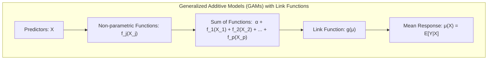
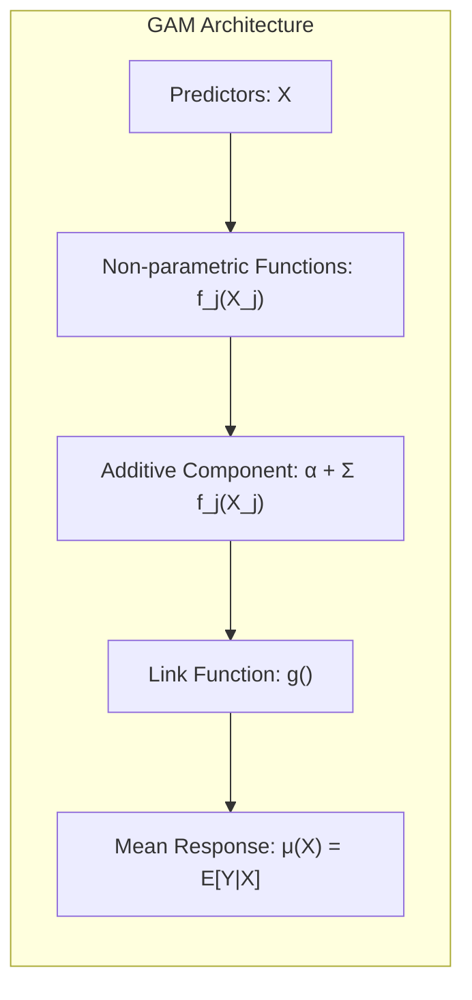
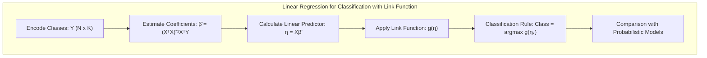
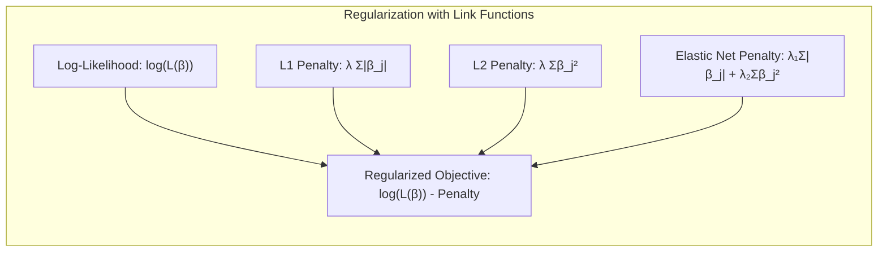
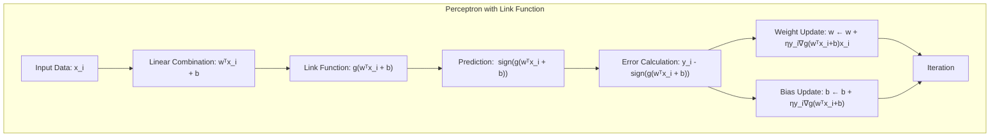
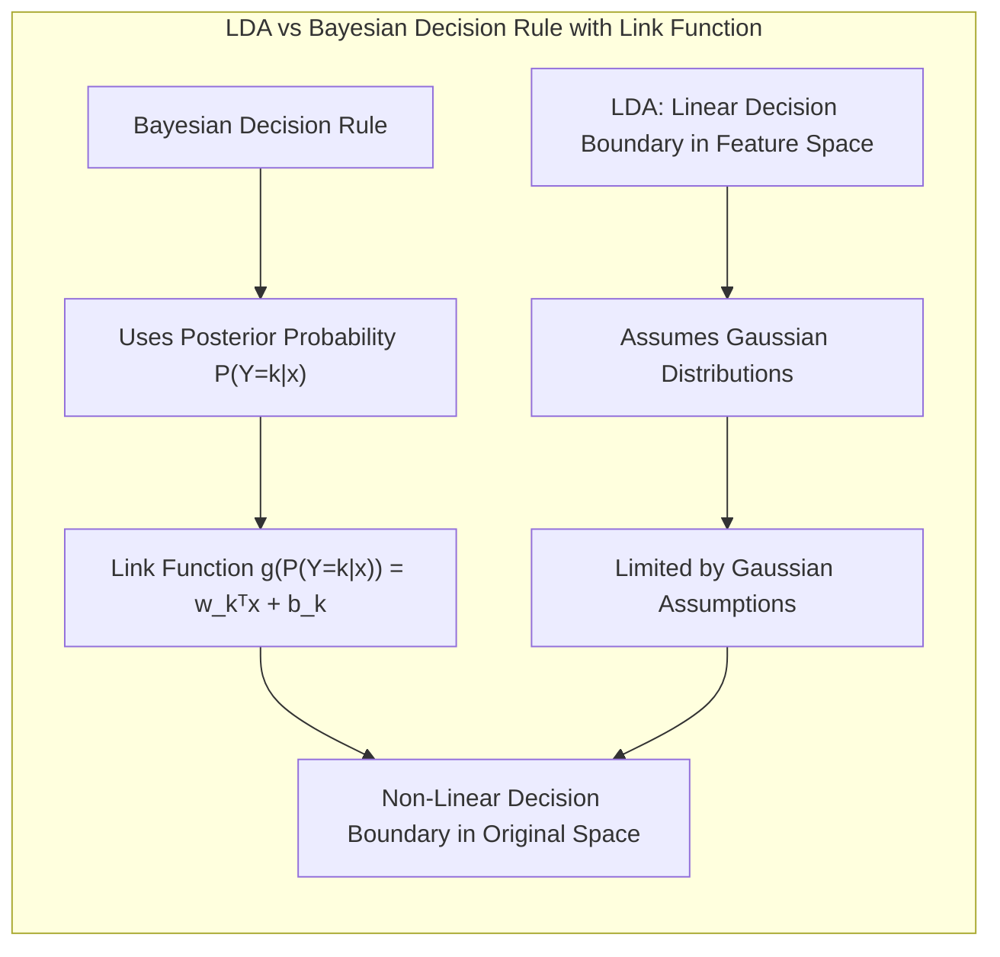

## Título: Modelos Aditivos Generalizados, Árvores e Métodos Relacionados: Funções de Ligação e Formulações Detalhadas

### Introdução

Este capítulo explora modelos para aprendizado supervisionado, abordando a importância das funções de ligação na modelagem de diferentes tipos de dados [^9.1]. A função de ligação desempenha um papel crucial na conexão da média da variável resposta $\mu = E[Y|X]$ com a combinação linear dos preditores $X$, permitindo a extensão de modelos lineares para dados não lineares e de diferentes distribuições [^9.1]. As funções de ligação mais comuns são abordadas, assim como sua utilização em Modelos Aditivos Generalizados (GAMs), árvores de decisão, Multivariate Adaptive Regression Splines (MARS), método de indução de regras de pacientes (PRIM) e misturas hierárquicas de especialistas (HME) [^9.1]. O foco é o desenvolvimento de uma compreensão profunda da formulação matemática de cada método, com ênfase em como as funções de ligação são utilizadas e como diferentes métodos de otimização são aplicados.

### Conceitos Fundamentais

**Conceito 1: O Papel da Função de Ligação em Modelos Estatísticos**

Em modelos estatísticos, a função de ligação $g$ é usada para relacionar a média da variável resposta $\mu = E[Y|X]$ a uma combinação linear dos preditores $X$. Formalmente, temos:

$$
g(\mu) =  \eta = \beta_0 + \beta_1X_1 + \beta_2X_2 + \ldots + \beta_pX_p
$$

onde $\eta$ é o *predictor* linear, e $g$ é a função de ligação. A escolha da função de ligação depende da distribuição da variável resposta.  Em modelos lineares clássicos, a função de ligação é a identidade ($g(\mu) = \mu$), mas esta escolha pode não ser apropriada para outros tipos de dados, como variáveis binárias ou de contagem. O uso de funções de ligação é essencial para transformar a escala da média da resposta de modo a que a combinação linear dos preditores possa modelá-la de forma mais adequada.

**Lemma 1:** *A função de ligação $g$, ao transformar a média da resposta, permite que modelos lineares sejam aplicados a dados com distribuições não gaussianas ou com relações não lineares com os preditores. Ao escolher uma função de ligação adequada para o tipo de dados, a estimativa dos parâmetros do modelo é mais eficiente e o modelo tem maior capacidade de generalização*. Isso demonstra a importância de escolher uma função de ligação apropriada para a modelagem de diferentes tipos de dados, o que é uma consideração central em modelos como os GAMs [^4.3].

**Conceito 2: Funções de Ligação Comuns**

*   **Função Identidade:** $g(\mu) = \mu$. Esta função é utilizada quando a variável resposta é contínua e segue uma distribuição aproximadamente normal. A função de ligação identidade não realiza nenhuma transformação na média da variável resposta. O modelo resultante é o modelo de regressão linear clássico:

    $$
     \mu = \beta_0 + \beta_1X_1 + \beta_2X_2 + \ldots + \beta_pX_p
    $$
    
    > 💡 **Exemplo Numérico:**
    > Suponha que estamos modelando o preço de casas (em milhares de dólares) em função da área (em metros quadrados). Temos os seguintes dados:
    >
    > | Área (m²) ($X_1$) | Preço (milhares de dólares) ($Y$) |
    > |-------------------|----------------------------------|
    > | 100               | 250                              |
    > | 150               | 350                              |
    > | 200               | 450                              |
    > | 250               | 550                              |
    >
    > Usando a função de ligação identidade, o modelo de regressão linear seria:
    >
    > $$
    >  \mu = \beta_0 + \beta_1 X_1
    > $$
    >
    > Após ajustar o modelo (por exemplo, usando mínimos quadrados), poderíamos obter $\hat{\beta}_0 = 50$ e $\hat{\beta}_1 = 2$. Portanto, a previsão para uma casa de 180 m² seria:
    >
    > $$
    > \hat{\mu} = 50 + 2 \times 180 = 410
    > $$
    >
    > Ou seja, o preço estimado seria de \\$ 410,000. Este exemplo ilustra a aplicação direta da função identidade, onde a média da resposta é modelada diretamente como uma combinação linear dos preditores.

*   **Função Logit:** $g(\mu) = \log(\frac{\mu}{1-\mu})$. Utilizada para variáveis binárias, onde $\mu$ representa a probabilidade de sucesso (i.e., $P(Y=1)$). A função *logit* transforma a probabilidade de um intervalo [0,1] para um intervalo $(-\infty, \infty)$. A função de regressão logística com função de ligação *logit* é dada por:

      $$
       \log \left( \frac{\mu}{1-\mu} \right) = \beta_0 + \beta_1 X_1 + \ldots + \beta_p X_p
      $$
      
    > 💡 **Exemplo Numérico:**
    >
    > Considere um estudo para prever se um paciente tem uma doença cardíaca (1 = sim, 0 = não) com base em sua idade ($X_1$). Temos os seguintes dados:
    >
    > | Idade ($X_1$) | Doença Cardíaca ($Y$) |
    > |----------------|----------------------|
    > | 50             | 0                    |
    > | 60             | 1                    |
    > | 70             | 1                    |
    > | 40             | 0                    |
    > | 55             | 1                    |
    >
    > Usando a função de ligação *logit*, o modelo de regressão logística é:
    >
    > $$
    >  \log\left(\frac{\mu}{1-\mu}\right) = \beta_0 + \beta_1 X_1
    > $$
    >
    > Após ajustar o modelo (por exemplo, usando máxima verossimilhança), poderíamos obter $\hat{\beta}_0 = -5$ e $\hat{\beta}_1 = 0.1$. Para um paciente de 65 anos, a probabilidade estimada de ter doença cardíaca seria calculada da seguinte forma:
    >
    > $$
    > \log\left(\frac{\hat{\mu}}{1-\hat{\mu}}\right) = -5 + 0.1 \times 65 = 1.5
    > $$
    >
    > Para obter a probabilidade $\hat{\mu}$, aplicamos a função inversa da logit, que é a função sigmoide:
    >
    > $$
    > \hat{\mu} = \frac{1}{1 + e^{-1.5}} \approx 0.817
    > $$
    >
    > Isso indica que um paciente de 65 anos tem aproximadamente 81.7% de chance de ter uma doença cardíaca. A função logit garante que a probabilidade prevista esteja sempre entre 0 e 1.

*   **Função Probit:** $g(\mu) = \Phi^{-1}(\mu)$, onde $\Phi^{-1}$ é a inversa da função de distribuição cumulativa normal padrão. Similar à função *logit*, é utilizada para variáveis binárias e modela a probabilidade em termos da função de distribuição normal. A função *probit* é utilizada quando se assume uma distribuição normal para os erros.

    $$
     \Phi^{-1}(\mu) = \beta_0 + \beta_1 X_1 + \ldots + \beta_p X_p
    $$
    
     > 💡 **Exemplo Numérico:**
    >
    > Usando os mesmos dados do exemplo anterior de doença cardíaca e idade, mas agora com a função de ligação *probit*, o modelo seria:
    >
    > $$
    >  \Phi^{-1}(\mu) = \beta_0 + \beta_1 X_1
    > $$
    >
    > Após o ajuste do modelo, suponha que obtivemos os parâmetros $\hat{\beta}_0 = -3$ e $\hat{\beta}_1 = 0.06$. Para um paciente de 65 anos, o valor do preditor linear seria:
    >
    > $$
    > \Phi^{-1}(\hat{\mu}) = -3 + 0.06 \times 65 = 0.9
    > $$
    >
    > Para obter a probabilidade estimada $\hat{\mu}$, aplicamos a função de distribuição cumulativa normal padrão $\Phi$:
    >
    > $$
    > \hat{\mu} = \Phi(0.9) \approx 0.8159
    > $$
    >
    > Portanto, a probabilidade estimada de um paciente de 65 anos ter doença cardíaca usando a função *probit* é de aproximadamente 81.59%. A função probit também garante que a probabilidade esteja entre 0 e 1, mas com uma forma ligeiramente diferente da função *logit*.

*  **Função Log:** $g(\mu) = \log(\mu)$. Utilizada para dados de contagem, onde $\mu$ representa a média da variável resposta, que geralmente segue uma distribuição de Poisson ou binomial negativa.

    $$
     \log(\mu) = \beta_0 + \beta_1 X_1 + \ldots + \beta_p X_p
    $$
    
     > 💡 **Exemplo Numérico:**
    >
    > Considere um estudo sobre o número de acidentes de carro ($Y$) em função do número de carros que passam por um cruzamento por hora ($X_1$). Temos os seguintes dados:
    >
    > | Carros por Hora ($X_1$) | Acidentes por Dia ($Y$) |
    > |-----------------------|-------------------------|
    > | 100                   | 2                       |
    > | 200                   | 4                       |
    > | 300                   | 6                       |
    > | 150                   | 3                       |
    > | 250                   | 5                       |
    >
    > Usando a função de ligação log, o modelo seria:
    >
    > $$
    >  \log(\mu) = \beta_0 + \beta_1 X_1
    > $$
    >
    > Após ajustar o modelo, suponha que obtivemos os parâmetros $\hat{\beta}_0 = -1$ e $\hat{\beta}_1 = 0.01$. Para um fluxo de 220 carros por hora, a média estimada de acidentes seria:
    >
    > $$
    > \log(\hat{\mu}) = -1 + 0.01 \times 220 = 1.2
    > $$
    >
    > Para obter a média estimada $\hat{\mu}$, aplicamos a função exponencial:
    >
    > $$
    > \hat{\mu} = e^{1.2} \approx 3.32
    > $$
    >
    > Isso significa que, para um fluxo de 220 carros por hora, esperamos cerca de 3.32 acidentes por dia. A função log garante que a média prevista seja sempre positiva.
    
    A escolha da função de ligação é crucial para modelar a relação entre a resposta e os preditores de maneira adequada para cada tipo de dados.

**Corolário 1:** *A escolha da função de ligação transforma o espaço da variável resposta para um espaço em que a relação com os preditores pode ser modelada linearmente. Esta transformação permite que modelos lineares sejam aplicados a diferentes tipos de dados, e garante que a média da resposta respeite o domínio da distribuição* [^4.3].

**Conceito 3: Modelos Aditivos Generalizados (GAMs) e Funções de Ligação**

Em Modelos Aditivos Generalizados (GAMs), a função de ligação também é crucial para relacionar a média da resposta à soma de funções não paramétricas dos preditores. O modelo geral de um GAM é definido como:

$$
g(\mu(X)) = \alpha + f_1(X_1) + f_2(X_2) + \ldots + f_p(X_p)
$$

onde $g$ é a função de ligação, $\mu(X)$ é a média da resposta condicionada aos preditores $X$, $\alpha$ é o intercepto, e $f_j(X_j)$ são as funções não paramétricas dos preditores $X_j$ [^4.4.3]. Em um GAM, a função de ligação $g$ relaciona o resultado das funções aditivas dos preditores com a média da variável resposta. A flexibilidade dos GAMs reside na sua capacidade de modelar não linearidades, mantendo a interpretabilidade devido à estrutura aditiva dos preditores.

> ⚠️ **Nota Importante:**  A escolha apropriada da função de ligação garante que a modelagem da média da resposta esteja consistente com a distribuição da variável resposta [^4.4.1].

> ❗ **Ponto de Atenção:** É essencial escolher a função de ligação correta para o tipo de variável resposta. Usar a função de ligação identidade para variáveis binárias ou de contagem, por exemplo, pode resultar em modelos com resultados incorretos [^4.4.4], [^4.4.5].

> ✔️ **Destaque:** Os GAMs generalizam os modelos lineares ao permitir o uso de funções não paramétricas e ao incorporar uma função de ligação apropriada para o tipo de dados. Esta flexibilidade permite modelar relações não lineares e, ao mesmo tempo, manter a interpretabilidade dos modelos [^4.3].

### Regressão Linear e Mínimos Quadrados para Classificação com Funções de Ligação: Análise Detalhada

**Explicação:** Este diagrama representa o fluxo do processo de regressão de indicadores, incluindo a aplicação de uma função de ligação g, para modelar diferentes tipos de variáveis respostas, e como ele se relaciona à classificação, conforme descrito nos tópicos [^4.2] e [^4.1].

Na regressão linear para classificação, as classes são codificadas usando uma matriz indicadora $Y$ de dimensão $N \times K$, onde $N$ é o número de observações e $K$ é o número de classes. Os coeficientes $\beta$ são estimados através do método dos mínimos quadrados, de modo que:

$$
\hat{\beta} = (X^T X)^{-1} X^T Y
$$

As estimativas das médias das respostas são obtidas por:
$$
\hat{\mu} = X\hat{\beta}
$$

A função de ligação $g$ é então aplicada nos valores preditos, onde
$$
g(\hat{\mu})
$$
 O objetivo da função de ligação $g$ é transformar os valores preditos de forma que a resposta esteja em uma escala apropriada para a modelagem linear. Por exemplo, para probabilidades binárias, a função *logit* pode ser usada. Após aplicar a função de ligação, a classe de uma observação é definida como:
 $$
\text{classe}(x_i) = \underset{k}{\arg\max} g(\hat{\mu}_{ik})
$$

onde $k$ é a classe que maximiza $g(\hat{\mu}_{ik})$.  O problema do "masking effect" pode surgir devido à complexidade da relação entre os preditores e as classes.

**Lemma 2:** *A escolha de uma função de ligação apropriada na regressão linear para classificação pode mitigar alguns problemas causados por distribuições não Gaussianas. A função de ligação transforma o espaço dos preditores para o espaço apropriado para modelagem linear, de modo que as classes se separem de forma mais adequada* [^4.2].

**Corolário 2:** *A aplicação da função de ligação na regressão de indicadores pode levar a resultados similares aos da LDA quando a função de ligação é apropriada ao tipo de dados e as distribuições podem ser aproximadas por Gaussianas, mas sem a suposição de covariâncias iguais que é imposta pela LDA. A escolha adequada da função de ligação pode melhorar a robustez do modelo e a sua capacidade de generalização* [^4.3].

Comparado com a regressão logística, a regressão linear com função de ligação também busca uma combinação linear de preditores para modelar a resposta. Contudo, a regressão logística utiliza a função *logit* como função de ligação e usa a máxima verossimilhança para estimar os parâmetros, o que pode ser mais adequado para respostas binárias [^4.4].  Em contrapartida, a regressão linear com uma função de ligação usa mínimos quadrados para estimar os parâmetros. A escolha entre esses dois métodos depende das características da variável resposta e dos objetivos do modelo.

### Métodos de Seleção de Variáveis e Regularização em Classificação com Função de Ligação: Abordagem Teórica

A seleção de variáveis e regularização são cruciais para a generalização e interpretabilidade de modelos com funções de ligação. A regularização, em particular, adiciona um termo de penalidade à função de custo ou *log-likelihood*, de modo que:

$$
\log(L(\beta)) - \text{Penalidade}(\beta)
$$

Para a penalização L1 (LASSO):

$$
\text{Penalidade}(\beta) = \lambda \sum_{j=1}^p |\beta_j|
$$

A penalização L1 promove a esparsidade, fazendo com que vários parâmetros sejam estimados como zero [^4.5.1]. A penalização L2 (Ridge) é dada por:

$$
\text{Penalidade}(\beta) = \lambda \sum_{j=1}^p \beta_j^2
$$

A penalização L2 reduz a magnitude dos coeficientes, aumentando a estabilidade do modelo [^4.5.2]. A penalização Elastic Net, uma combinação das duas:

$$
\text{Penalidade}(\beta) = \lambda_1 \sum_{j=1}^p |\beta_j| + \lambda_2 \sum_{j=1}^p \beta_j^2
$$

onde $\lambda_1$ e $\lambda_2$ são os parâmetros de regularização.  A função de ligação pode influenciar o efeito da penalidade, já que esta é aplicada aos parâmetros da combinação linear dos preditores.

**Lemma 3:** *A penalização L1 na função de log-verossimilhança induz a esparsidade dos parâmetros, promovendo a seleção de variáveis e reduzindo a complexidade do modelo. A não diferenciabilidade da função de valor absoluto na origem tende a levar os coeficientes menos relevantes para zero, facilitando a interpretação do modelo.* [^4.4.4]

**Prova do Lemma 3:**  A função de custo para modelos com função de ligação com penalização L1 pode ser escrita como:
$$
C(\beta) = - \sum_{i=1}^N [y_i \log(p(x_i)) + (1-y_i) \log(1-p(x_i))] + \lambda \sum_{j=1}^p |\beta_j|
$$
onde $p(x_i)$ é a probabilidade modelada para a observação $x_i$. A minimização desta função leva a algumas das estimativas dos coeficientes $\beta_j$ a serem exatamente zero, já que a função de valor absoluto na origem não é diferenciável. $\blacksquare$

**Corolário 3:** *A esparsidade induzida pela penalização L1 melhora a interpretação do modelo, pois as variáveis mais importantes são identificadas e o modelo se torna mais simples, o que aumenta a sua capacidade de generalização. A penalização L1 pode ser particularmente útil quando há um grande número de preditores, e se busca identificar apenas os mais relevantes para a classificação* [^4.4.5].

> ⚠️ **Ponto Crucial**: A função de ligação influencia a maneira como a penalização atua sobre os coeficientes. Funções de ligação como *logit* e *probit*, por exemplo, limitam os valores da probabilidade, e a penalização afeta os parâmetros que geram essa probabilidade, o que pode levar a resultados mais estáveis [^4.5].

### Separating Hyperplanes e Perceptrons com Funções de Ligação: Generalização e Teoria

Hiperplanos separadores, quando combinados com uma função de ligação, dividem o espaço de características em regiões mais complexas:

$$
g(w^Tx + b) = 0
$$

onde $w$ é o vetor normal ao hiperplano, $x$ é o vetor de preditores, $b$ é o bias e $g$ é a função de ligação que transforma o hiperplano para uma nova escala [^4.5.2].  A margem de separação é definida no espaço da função de ligação e a otimização busca maximizar essa margem. O algoritmo Perceptron com função de ligação atualiza iterativamente os pesos e o bias usando:

$$
w \leftarrow w + \eta y_i \nabla g(w^Tx_i + b)x_i
$$
$$
b \leftarrow b + \eta y_i \nabla g(w^Tx_i + b)
$$

onde $\nabla g$ é o gradiente da função de ligação, e $\eta$ é a taxa de aprendizado.  A função de ligação $g$ transforma o espaço dos dados e permite que o algoritmo do Perceptron encontre um hiperplano que seja adequado para as classes no espaço transformado.

### Pergunta Teórica Avançada: Como a escolha da função de ligação afeta a relação entre LDA e Regra de Decisão Bayesiana para distribuições não Gaussianas e como a função de ligação é incorporada em cada abordagem?

**Resposta:**

A escolha da função de ligação tem um impacto crucial na relação entre LDA e a Regra de Decisão Bayesiana, especialmente quando as distribuições não são gaussianas.

A LDA, em sua forma original, assume distribuições gaussianas com covariâncias iguais. Nesse contexto, a fronteira de decisão linear é dada por:

$$
\delta_k(x) = x^T \Sigma^{-1} \mu_k - \frac{1}{2} \mu_k^T \Sigma^{-1} \mu_k + \log(\pi_k)
$$

onde $\mu_k$ é a média da classe $k$, $\Sigma$ é a matriz de covariância comum e $\pi_k$ é a probabilidade a priori da classe $k$.  Ao introduzir uma função de ligação, a relação entre a classe e os preditores torna-se não linear no espaço original dos preditores, o que pode fazer a LDA inadequada nesse cenário.

Na Regra de Decisão Bayesiana, a função de ligação é determinada pela distribuição das classes.  Em distribuições não gaussianas, a probabilidade a posteriori é dada por:

$$
P(Y=k|x) = \frac{P(x|Y=k) P(Y=k)}{P(x)}
$$

onde $P(x|Y=k)$ é a distribuição da classe $k$ e $P(Y=k)$ é a probabilidade a priori. A função de ligação transforma o espaço dos dados para o espaço onde a relação com os preditores se torna linear ou aditiva, e a decisão é feita atribuindo a observação à classe que maximiza a probabilidade a posteriori. A escolha da função de ligação afeta diretamente como a probabilidade a posteriori é modelada.  Seja $g$ uma função de ligação genérica, um modelo que usa uma função de ligação para aproximar a probabilidade a posteriori pode ser escrito como:

$$
g(P(Y=k|x)) = w_k^T x + b_k
$$

Neste caso, a função de ligação é utilizada para transformar a probabilidade para uma escala em que a modelagem linear ou aditiva seja mais adequada. A relação entre LDA e a Regra de Decisão Bayesiana torna-se mais complexa devido à escolha da função de ligação.  Na LDA, a linearidade é imposta diretamente no espaço dos preditores, enquanto na regra bayesiana com função de ligação, a linearidade é garantida no espaço transformado pela função de ligação.

**Lemma 4:** *Em distribuições não Gaussianas, a relação entre a Regra de Decisão Bayesiana e a LDA depende da escolha da função de ligação. A LDA, em sua formulação original, não incorpora funções de ligação e por isso não é capaz de modelar adequadamente não linearidades. A função de ligação permite que modelos mais flexíveis sejam construídos, com uma melhor adequação a diferentes tipos de dados*.

**Corolário 4:** *A Regra de Decisão Bayesiana, ao incorporar uma função de ligação, permite que a fronteira de decisão seja não linear no espaço original dos preditores, mas linear no espaço transformado pela função de ligação. A LDA não possui essa capacidade de transformação, o que faz dela um método menos flexível para lidar com distribuições não gaussianas*.  A escolha da função de ligação é crucial para garantir que a aproximação da probabilidade a posteriori seja adequada aos dados.

> ⚠️ **Ponto Crucial**: A função de ligação é uma ferramenta chave para modelar dados que não seguem distribuições Gaussianas, e para estender o conceito de linearidade para espaços transformados. A LDA não oferece uma forma simples para a incorporação de funções de ligação, e por isso a Regra de Decisão Bayesiana se torna uma abordagem mais flexível para dados com distribuições não Gaussianas [^4.3.1], [^4.3].

### Conclusão

Este capítulo apresentou uma visão detalhada das funções de ligação, sua importância na modelagem de diferentes tipos de dados e sua utilização em diversos métodos de aprendizado supervisionado. Modelos como GAMs, árvores de decisão, MARS, PRIM e HME, utilizam funções de ligação para modelar a relação entre preditores e resposta. A escolha da função de ligação é crucial para garantir que o modelo seja adequado à natureza dos dados, melhorando a sua capacidade de generalização.

### Footnotes

[^4.1]: "In this chapter we begin our discussion of some specific methods for super-vised learning. These techniques each assume a (different) structured form for the unknown regression function, and by doing so they finesse the curse of dimensionality. Of course, they pay the possible price of misspecifying the model, and so in each case there is a tradeoff that has to be made." *(Trecho de "Additive Models, Trees, and Related Methods")*

[^4.2]: "Regression models play an important role in many data analyses, providing prediction and classification rules, and data analytic tools for understand-ing the importance of different inputs." *(Trecho de "Additive Models, Trees, and Related Methods")*

[^4.3]: "In this section we describe a modular algorithm for fitting additive models and their generalizations. The building block is the scatterplot smoother for fitting nonlinear effects in a flexible way. For concreteness we use as our scatterplot smoother the cubic smoothing spline described in Chapter 5." *(Trecho de "Additive Models, Trees, and Related Methods")*

[^4.3.1]:  "The additive model has the form $Y = \alpha + \sum_{j=1}^p f_j(X_j) + \varepsilon$, where the error term $\varepsilon$ has mean zero." * (Trecho de "Additive Models, Trees, and Related Methods")*

[^4.3.2]:   "Given observations $x_i, y_i$, a criterion like the penalized sum of squares (5.9) of Section 5.4 can be specified for this problem, $PRSS(\alpha, f_1, f_2,..., f_p) = \sum_{i=1}^N (y_i - \alpha - \sum_{j=1}^p f_j(x_{ij}))^2 + \sum_{j=1}^p \lambda_j \int(f_j''(t_j))^2 dt_j$" * (Trecho de "Additive Models, Trees, and Related Methods")*

[^4.3.3]: "where the $\lambda_j > 0$ are tuning parameters. It can be shown that the minimizer of (9.7) is an additive cubic spline model; each of the functions $f_j$ is a cubic spline in the component $X_j$, with knots at each of the unique values of $x_{ij}$, $i = 1,..., N$." *(Trecho de "Additive Models, Trees, and Related Methods")*

[^4.4]: "For two-class classification, recall the logistic regression model for binary data discussed in Section 4.4. We relate the mean of the binary response $\mu(X) = Pr(Y = 1|X)$ to the predictors via a linear regression model and the logit link function:  $\log(\mu(X)/(1 – \mu(X)) = \alpha + \beta_1 X_1 + ... + \beta_pX_p$." * (Trecho de "Additive Models, Trees, and Related Methods")*

[^4.4.1]: "The additive logistic regression model replaces each linear term by a more general functional form: $\log(\mu(X)/(1 – \mu(X))) = \alpha + f_1(X_1) + \ldots + f_p(X_p)$, where again each $f_j$ is an unspecified smooth function." * (Trecho de "Additive Models, Trees, and Related Methods")*

[^4.4.2]: "While the non-parametric form for the functions $f_j$ makes the model more flexible, the additivity is retained and allows us to interpret the model in much the same way as before. The additive logistic regression model is an example of a generalized additive model." *(Trecho de "Additive Models, Trees, and Related Methods")*

[^4.4.3]: "In general, the conditional mean $\mu(X)$ of a response $Y$ is related to an additive function of the predictors via a link function $g$:  $g[\mu(X)] = \alpha + f_1(X_1) + \ldots + f_p(X_p)$." *(Trecho de "Additive Models, Trees, and Related Methods")*

[^4.4.4]:  "Examples of classical link functions are the following: $g(\mu) = \mu$ is the identity link, used for linear and additive models for Gaussian response data." *(Trecho de "Additive Models, Trees, and Related Methods")*

[^4.4.5]: "$g(\mu) = \text{logit}(\mu)$ as above, or $g(\mu) = \text{probit}(\mu)$, the probit link function, for modeling binomial probabilities. The probit function is the inverse Gaussian cumulative distribution function: $\text{probit}(\mu) = \Phi^{-1}(\mu)$." *(Trecho de "Additive Models, Trees, and Related Methods")*

[^4.5]: "All three of these arise from exponential family sampling models, which in addition include the gamma and negative-binomial distributions. These families generate the well-known class of generalized linear models, which are all extended in the same way to generalized additive models." *(Trecho de "Additive Models, Trees, and Related Methods")*

[^4.5.1]: "The functions $f_j$ are estimated in a flexible manner, using an algorithm whose basic building block is a scatterplot smoother. The estimated func-tion $f_j$ can then reveal possible nonlinearities in the effect of $X_j$. Not all of the functions $f_j$ need to be nonlinear." *(Trecho de "Additive Models, Trees, and Related Methods")*

[^4.5.2]: "We can easily mix in linear and other parametric forms with the nonlinear terms, a necessity when some of the inputs are qualitative variables (factors)." *(Trecho de "Additive Models, Trees, and Related Methods")*
