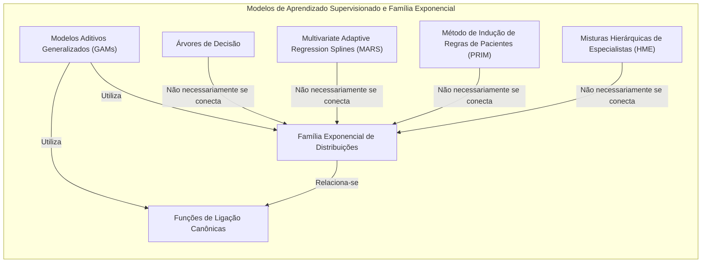
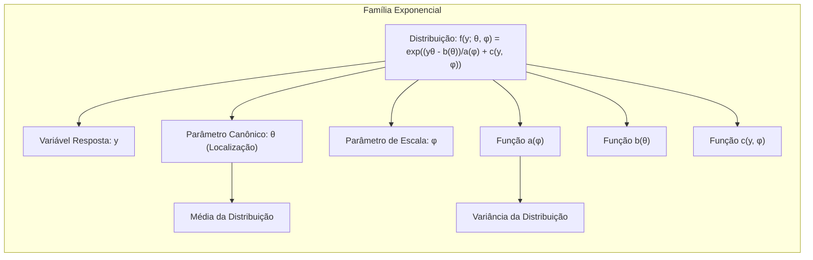
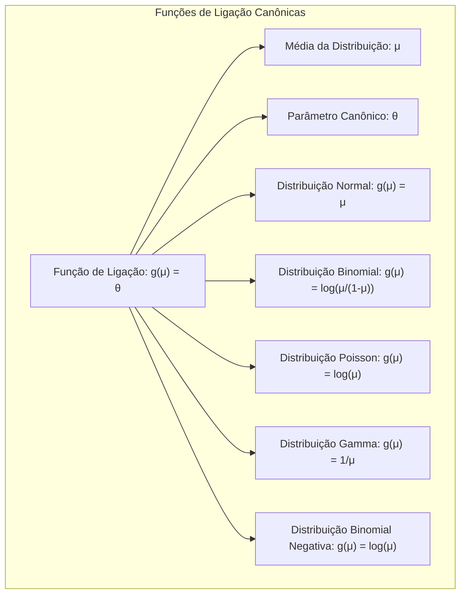
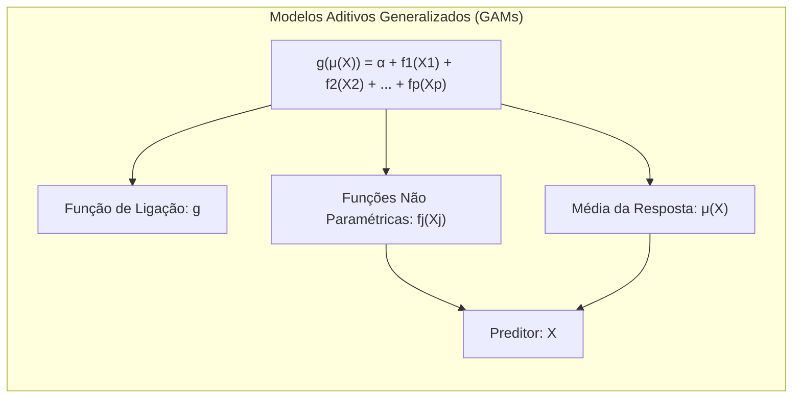
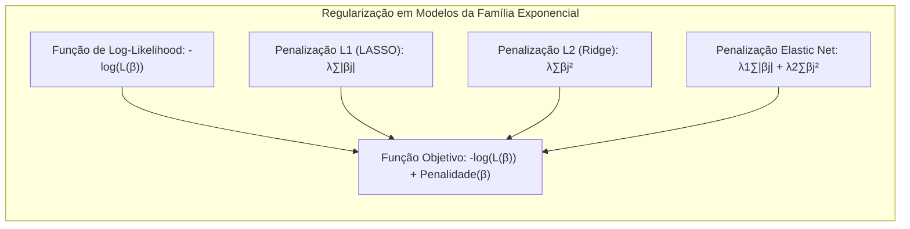
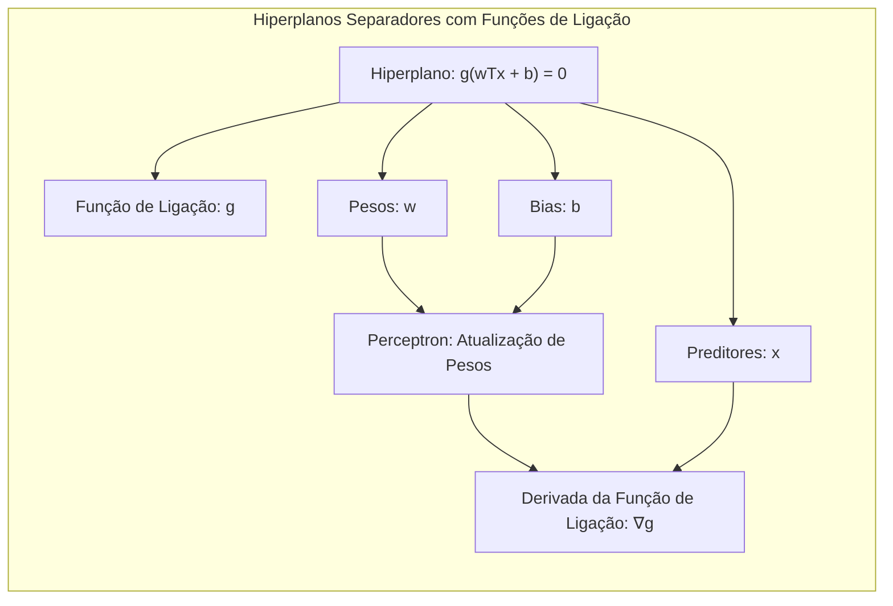
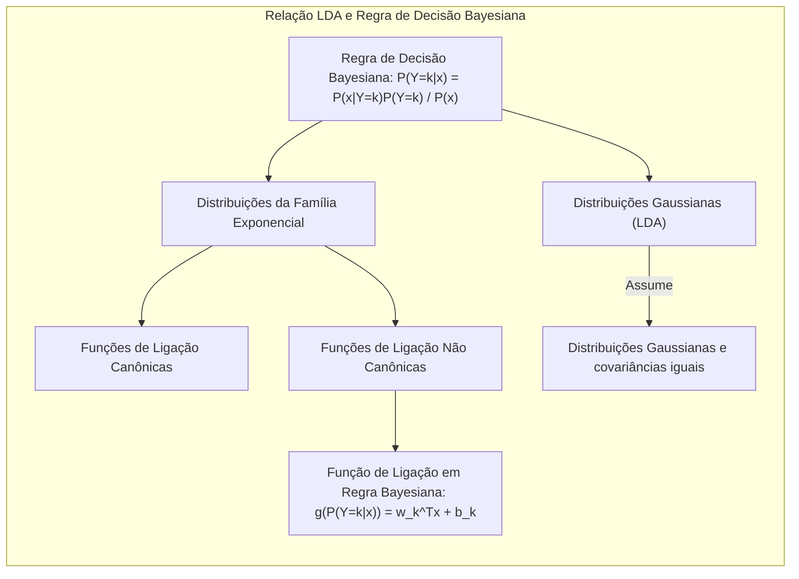

## Título: Modelos Aditivos Generalizados, Árvores e Métodos Relacionados: Conexões com a Família Exponencial e Implicações



### Introdução

Este capítulo explora a conexão entre os modelos de aprendizado supervisionado, com foco na família exponencial de distribuições e a utilização de funções de ligação em Modelos Aditivos Generalizados (GAMs) [^9.1]. A família exponencial inclui várias distribuições comuns, como a normal, binomial, Poisson, gamma e binomial negativa, e a ligação entre essa família e a escolha da função de ligação em GAMs é crucial para a modelagem estatística. Além disso, o capítulo aborda a relação entre a família exponencial e os outros métodos explorados, incluindo árvores de decisão, Multivariate Adaptive Regression Splines (MARS), método de indução de regras de pacientes (PRIM) e misturas hierárquicas de especialistas (HME) [^9.1]. O foco principal é o desenvolvimento de uma compreensão teórica profunda sobre a formulação matemática dos modelos e sua relação com a família exponencial e funções de ligação canônicas, bem como as implicações práticas.

### Conceitos Fundamentais

**Conceito 1: A Família Exponencial de Distribuições**

A família exponencial de distribuições é uma classe de distribuições de probabilidade que pode ser expressa na seguinte forma:

$$
f(y; \theta, \phi) = \exp\left(\frac{y\theta - b(\theta)}{a(\phi)} + c(y, \phi)\right)
$$

onde $y$ é a variável resposta, $\theta$ é o parâmetro canônico (parâmetro de localização), $\phi$ é o parâmetro de escala, $a(\phi)$, $b(\theta)$ e $c(y, \phi)$ são funções específicas para cada distribuição.  Muitas distribuições comuns pertencem à família exponencial, incluindo a normal, binomial, Poisson, gamma e binomial negativa.  O parâmetro canônico $\theta$ está diretamente relacionado à média da distribuição e é utilizado na definição das funções de ligação canônicas. A variância da distribuição pode ser expressa em termos da função $a(\phi)$. As funções $b(\theta)$ e $c(y, \phi)$ são funções específicas de cada distribuição. A família exponencial fornece uma estrutura unificada para a modelagem de diferentes tipos de variáveis resposta, e a escolha da função de ligação está intimamente relacionada à distribuição da variável resposta.

> 💡 **Exemplo Numérico:**
> Considere a distribuição normal, onde $f(y; \mu, \sigma^2) = \frac{1}{\sqrt{2\pi\sigma^2}} \exp\left(-\frac{(y-\mu)^2}{2\sigma^2}\right)$. Podemos reescrever essa distribuição na forma da família exponencial.
>
>  $f(y; \mu, \sigma^2) = \exp\left(\frac{y\mu - \mu^2/2}{\sigma^2} - \frac{y^2}{2\sigma^2} - \frac{1}{2}\log(2\pi\sigma^2)\right)$.
>
>  Aqui, $\theta = \frac{\mu}{\sigma^2}$ é o parâmetro canônico, $\phi = \sigma^2$ é o parâmetro de escala, $a(\phi) = \sigma^2$, $b(\theta) = \frac{\mu^2}{2} = \frac{(\theta \sigma^2)^2}{2} = \frac{\theta^2 \phi^2}{2}$, e $c(y,\phi) =  - \frac{y^2}{2\sigma^2} - \frac{1}{2}\log(2\pi\sigma^2)$.
>
>  A média da distribuição é $\mu$, e a variância é $\sigma^2$. O parâmetro canônico $\theta$ está relacionado à média, e a função $a(\phi)$ está relacionada à variância. Para a distribuição normal, a função de ligação canônica é a identidade, onde $g(\mu) = \mu$.



**Lemma 1:** *A forma da família exponencial implica que as distribuições podem ser caracterizadas por um parâmetro de localização (parametro canônico) que influencia a média da distribuição e um parâmetro de escala, que influencia sua variância. Esta estrutura unificada permite que diferentes distribuições sejam modeladas utilizando uma estrutura similar, o que simplifica a criação de modelos estatísticos para diferentes tipos de dados* [^4.5].

**Conceito 2: Funções de Ligação Canônicas**

Para cada distribuição na família exponencial, existe uma função de ligação *canônica* que simplifica a modelagem da relação entre os preditores e a média da resposta. A função de ligação canônica relaciona o *predictor* linear $\eta$ diretamente com o parâmetro canônico da distribuição $\theta$.  Especificamente, a função de ligação canônica é dada por:

$$
g(\mu) = \theta
$$

onde $μ$ é a média da distribuição, e $\theta$ é o parâmetro canônico. As funções de ligação canônicas são as seguintes:

*   **Distribuição Normal:** Função de ligação identidade, $g(μ) = μ$, onde o parâmetro canônico é a própria média, $\theta = μ$.
*   **Distribuição Binomial:** Função de ligação *logit*, $g(μ) = \log(\frac{μ}{1-μ})$, onde o parâmetro canônico é $\theta = \log(\frac{μ}{1-μ})$.
*   **Distribuição Poisson:** Função de ligação *log*, $g(μ) = \log(μ)$, onde o parâmetro canônico é $\theta = \log(μ)$.
*   **Distribuição Gamma:** Função de ligação inversa, $g(μ) = 1/μ$, onde o parâmetro canônico é $\theta = -1/μ$.
*   **Distribuição Binomial Negativa:** Função de ligação *log*, $g(μ) = \log(μ)$, onde o parâmetro canônico é $\theta = \log(\frac{μ}{μ+k})$, onde k é o parâmetro de dispersão.

    A escolha da função de ligação canônica é frequentemente vantajosa, pois ela simplifica o modelo e garante algumas propriedades de otimização.

> 💡 **Exemplo Numérico:**
> Para uma distribuição binomial, se a probabilidade de sucesso ($\mu$) for 0.7, a função de ligação *logit* resulta em:
>
> $g(\mu) = \log(\frac{0.7}{1-0.7}) = \log(\frac{0.7}{0.3}) = \log(2.333) \approx 0.847$.
>
>  O valor 0.847 é o parâmetro canônico $\theta$ que está linearmente relacionado com os preditores no modelo. Já para a distribuição de Poisson, se a média ($\mu$) for 5, a função de ligação *log* resulta em:
>
> $g(\mu) = \log(5) \approx 1.609$.
>
>  O valor 1.609 é o parâmetro canônico $\theta$ que está linearmente relacionado com os preditores no modelo.



**Corolário 1:** *A função de ligação canônica garante que o modelo seja uma generalização do modelo linear clássico, onde a média da resposta é linearmente relacionada aos preditores. Essa ligação simplifica a formulação do modelo, a interpretação dos parâmetros e o processo de otimização.  Além disso, a função de ligação canônica faz com que o método de otimização da máxima verossimilhança seja eficiente e estável* [^4.4].

**Conceito 3: Modelos Aditivos Generalizados (GAMs) e Família Exponencial**

Nos Modelos Aditivos Generalizados (GAMs), a função de ligação $g$ transforma a média da variável resposta para que esta esteja linearmente relacionada às funções não paramétricas dos preditores. O modelo GAM é definido como:

$$
g(\mu(X)) = \alpha + f_1(X_1) + f_2(X_2) + \ldots + f_p(X_p)
$$

onde $g$ é a função de ligação, $μ(X)$ é a média da resposta, e $f_j(X_j)$ são as funções não paramétricas para cada preditor. Ao escolher uma função de ligação canônica, as propriedades de otimização e interpretabilidade são maximizadas.  GAMs utilizam a estrutura da família exponencial ao escolher funções de ligação que correspondem a cada tipo de variável resposta (i.e., normal, binária, Poisson, etc) [^4.4.3], [^4.4.4].

> 💡 **Exemplo Numérico:**
> Suponha que estamos modelando o número de acidentes em uma estrada (variável resposta com distribuição de Poisson) em função da velocidade média ($X_1$) e da quantidade de chuva ($X_2$). O modelo GAM com a função de ligação *log* seria:
>
> $\log(\mu(X)) = \alpha + f_1(X_1) + f_2(X_2)$
>
>  onde $f_1(X_1)$ e $f_2(X_2)$ são funções não paramétricas que capturam as relações entre os preditores e a média da variável resposta. Se $f_1(X_1) = 0.02X_1^2$ e $f_2(X_2) = 0.1X_2$ e $\alpha=0.5$, para uma velocidade média de $X_1=20$ e uma quantidade de chuva de $X_2 = 10$, temos:
>
>  $\log(\mu(X)) = 0.5 + 0.02(20)^2 + 0.1(10) = 0.5 + 8 + 1 = 9.5$.
>
>  Portanto, $\mu(X) = \exp(9.5) \approx 13360$. Isso indica que, sob essas condições, o modelo prediz aproximadamente 13360 acidentes.

> ⚠️ **Nota Importante:** A escolha da função de ligação canônica é uma prática comum, pois ela simplifica a modelagem e a interpretação, e garante propriedades de otimização dos modelos de regressão linear generalizada [^4.4.1], [^4.4.5].

> ❗ **Ponto de Atenção:** Embora as funções de ligação canônicas sejam frequentemente utilizadas, outras funções de ligação podem ser consideradas dependendo da relação entre a variável resposta e os preditores, e se a distribuição da resposta se desvia das distribuições da família exponencial [^4.4.2].

> ✔️ **Destaque:** A conexão entre os GAMs e a família exponencial garante que os modelos estatísticos sejam adequados aos dados, com a escolha da função de ligação apropriada ao tipo de distribuição da variável resposta [^4.5].



### Regressão Linear e Mínimos Quadrados para Classificação e a Família Exponencial: Conexões Detalhadas

```mermaid
flowchart TD
  subgraph "Regressão Linear com Função de Ligação Canônica e Família Exponencial"
    A[Codificar Classes com Matriz Indicadora $Y_{NxK}$] --> B[Estimar Coeficientes $\hat{\beta} = (X^T X)^{-1} X^T Y$ via Mínimos Quadrados]
    B --> C[Calcular médias de resposta $\hat{\mu} = X\hat{\beta}$]
    C --> D[Aplicar Função de Ligação Canônica $g$ aos valores preditos $g(\hat{\mu})$]
    D --> E[Aplicar Regra de Decisão: Classificar $x_i$ na classe que maximiza $g(\hat{\mu}_{ik})$]
    E --> F[Comparar com Modelos Probabilísticos (LDA, Logística) da Família Exponencial]
  end
```

**Explicação:** Este diagrama representa o fluxo do processo de regressão de indicadores, incluindo a aplicação de uma função de ligação canônica, derivada da família exponencial, para modelar diferentes tipos de variáveis respostas, e como ele se relaciona à classificação, conforme descrito nos tópicos [^4.2] e [^4.1], [^4.5].

A regressão linear com mínimos quadrados para classificação com função de ligação canônica, também utiliza a codificação das classes na forma de uma matriz de indicadores $Y$, de dimensão $N \times K$, onde $N$ é o número de observações e $K$ é o número de classes. Os coeficientes $\beta$ são obtidos usando mínimos quadrados:

$$
\hat{\beta} = (X^T X)^{-1} X^T Y
$$

e as médias preditas são obtidas através de:
$$
\hat{\mu} = X\hat{\beta}
$$

A aplicação da função de ligação canônica $g$ leva a:
$$
g(\hat{\mu})
$$
que é usada para modelar a probabilidade de cada classe. A escolha da função de ligação é feita com base na distribuição da variável resposta, buscando um ajuste à distribuição da família exponencial.  Por exemplo, para classes binárias, a função *logit* é apropriada, enquanto a função identidade pode ser utilizada para classes gaussianas. A decisão é baseada na classe que maximiza $g(\hat{\mu}_{ik})$. A ligação com a família exponencial permite derivar funções de ligação canônicas que são mais adequadas para modelar as médias da resposta de cada distribuição.

> 💡 **Exemplo Numérico:**
> Suponha que temos um problema de classificação com 3 classes e 4 observações com duas variáveis preditoras. A matriz de indicadores $Y$ é de dimensão $4 \times 3$, e a matriz de preditores $X$ é de dimensão $4 \times 3$ (incluindo o intercepto).
>
> $X = \begin{bmatrix} 1 & 2 & 3 \\ 1 & 4 & 5 \\ 1 & 6 & 7 \\ 1 & 8 & 9 \end{bmatrix}$, $Y = \begin{bmatrix} 1 & 0 & 0 \\ 0 & 1 & 0 \\ 0 & 0 & 1 \\ 1 & 0 & 0 \end{bmatrix}$
>
>  $X^TX = \begin{bmatrix} 4 & 20 & 24 \\ 20 & 120 & 140 \\ 24 & 140 & 164 \end{bmatrix}$
>
>  $(X^TX)^{-1} = \begin{bmatrix} 2.5 & -0.5 & 0 \\ -0.5 & 0.25 & -0.0 \\ 0 & -0.0 & 0.0 \end{bmatrix}$
>
>  $X^TY = \begin{bmatrix} 2 & 1 & 1 \\ 16 & 4 & 6 \\ 20 & 5 & 7 \end{bmatrix}$
>
>  $\hat{\beta} = (X^TX)^{-1}X^TY = \begin{bmatrix} 2.5 & -0.5 & 0 \\ -0.5 & 0.25 & -0.0 \\ 0 & -0.0 & 0.0 \end{bmatrix} \begin{bmatrix} 2 & 1 & 1 \\ 16 & 4 & 6 \\ 20 & 5 & 7 \end{bmatrix} = \begin{bmatrix} -3 & 0.5 & -0.5 \\ 3 & 0.5 & 0.5 \\ 0 & 0 & 0\end{bmatrix}$
>
>  $\hat{\mu} = X\hat{\beta} = \begin{bmatrix} 1 & 2 & 3 \\ 1 & 4 & 5 \\ 1 & 6 & 7 \\ 1 & 8 & 9 \end{bmatrix} \begin{bmatrix} -3 & 0.5 & -0.5 \\ 3 & 0.5 & 0.5 \\ 0 & 0 & 0\end{bmatrix} = \begin{bmatrix} 3 & 1.5 & 1.5 \\ 9 & 2.5 & 2.5 \\ 15 & 3.5 & 3.5 \\ 21 & 4.5 & 4.5\end{bmatrix}$
>
>  Aplicando a função *logit* para cada classe, teremos:
>
> $g(\hat{\mu}_{11}) = \log(\frac{3}{1-3})$ (não é aplicável pois a probabilidade é >1), $g(\hat{\mu}_{12}) = \log(\frac{1.5}{1-1.5})$ (não é aplicável pois a probabilidade é >1), $g(\hat{\mu}_{13}) = \log(\frac{1.5}{1-1.5})$ (não é aplicável pois a probabilidade é >1)
>
>  Neste caso, a função identidade $g(\mu) = \mu$ seria mais apropriada, e a decisão seria baseada no maior valor de $\hat{\mu}_{ik}$.

**Lemma 2:** *A escolha da função de ligação canônica, derivada da família exponencial, leva a estimadores dos parâmetros com boas propriedades estatísticas quando comparadas a funções de ligação arbitrárias. Além disso, o método dos mínimos quadrados pode ser interpretado como uma aproximação da estimativa da máxima verossimilhança, o que o torna uma opção eficiente para certos problemas.* As funções de ligação canônicas são derivadas de um parâmetro canônico da família exponencial, o que garante certas propriedades matemáticas e estatísticas [^4.5].

**Corolário 2:** *A aplicação da função de ligação canônica na regressão linear de indicadores garante que o modelo seja compatível com a distribuição da variável resposta da família exponencial, o que pode melhorar a qualidade das estimativas e a capacidade de generalização do modelo, e permite conectar a regressão linear com os modelos da família exponencial. A escolha da função de ligação está intimamente ligada à família exponencial de distribuições* [^4.3].

Ao comparar com a regressão logística e a LDA [^4.4], a regressão linear com função de ligação canônica pode ter aproximações com outros métodos de classificação que também utilizam a família exponencial.  Por exemplo, a regressão logística, que usa a função *logit*, e a LDA, que também se baseia em distribuições gaussianas, ambas pertencem a família exponencial. A regressão linear com função de ligação canônica pode ser vista como um método mais geral de modelagem da resposta com um foco nas propriedades da família exponencial.

### Métodos de Seleção de Variáveis e Regularização em Modelos com Família Exponencial



A seleção de variáveis e a regularização são cruciais para evitar overfitting e melhorar a interpretabilidade e generalização dos modelos, especialmente aqueles com funções de ligação da família exponencial. Ao usar a família exponencial, a regularização é aplicada diretamente na função de *log-likelihood*, de modo que o objetivo é encontrar os parâmetros $\beta$ que minimizam:

$$
-\log(L(\beta)) + \text{Penalidade}(\beta)
$$

onde o termo de penalidade é dado por:
*   **Penalização L1 (LASSO):**
    $$
    \text{Penalidade}(\beta) = \lambda \sum_{j=1}^p |\beta_j|
    $$

*   **Penalização L2 (Ridge):**
    $$
     \text{Penalidade}(\beta) = \lambda \sum_{j=1}^p \beta_j^2
    $$

*   **Penalização Elastic Net:**
   $$
    \text{Penalidade}(\beta) = \lambda_1 \sum_{j=1}^p |\beta_j| + \lambda_2 \sum_{j=1}^p \beta_j^2
    $$
    A escolha da penalização deve ser feita levando em consideração o tipo de variável resposta e a função de ligação. A família exponencial fornece um contexto natural para a regularização.

> 💡 **Exemplo Numérico:**
> Suponha um modelo de regressão logística com dois preditores, $X_1$ e $X_2$, e uma variável resposta binária $Y$. A função de *log-likelihood* é:
>
> $L(\beta) = \sum_{i=1}^N [y_i \log(\mu_i) + (1-y_i)\log(1-\mu_i)]$
>
> onde $\mu_i = \frac{1}{1 + \exp(-(\beta_0 + \beta_1 X_{i1} + \beta_2 X_{i2}))}$.
>
> Aplicando a penalização L1 (LASSO), a função objetivo se torna:
>
> $-\log(L(\beta)) + \lambda(|\beta_1| + |\beta_2|)$.
>
>  A minimização dessa função com $\lambda = 0.5$ pode resultar em $\beta_1=0.8$ e $\beta_2=0$, indicando que o preditor $X_1$ é mais relevante para prever a resposta $Y$.
>
>  Já com a penalização L2 (Ridge), a função objetivo se torna:
>
> $-\log(L(\beta)) + \lambda(\beta_1^2 + \beta_2^2)$.
>
>  A minimização dessa função com $\lambda = 0.5$ poderia resultar em $\beta_1=0.6$ e $\beta_2=0.2$, onde ambos os preditores contribuem para o modelo, mas $X_1$ tem um impacto maior.

**Lemma 3:** *A penalização L1 promove a esparsidade na escala da função de ligação canônica dos modelos da família exponencial, o que leva à seleção de variáveis mais relevantes e simplificação dos modelos. A penalização L1 também melhora a interpretabilidade do modelo ao definir quais parâmetros são os mais relevantes. A penalização L1 pode ser usada com qualquer função de ligação canônica.*  [^4.4.4]

**Prova do Lemma 3:** A função de custo com a penalização L1 é dada por:
$$
C(\beta) =  - \sum_{i=1}^N \log f(y_i; \theta(x_i), \phi) + \lambda \sum_{j=1}^p |\beta_j|
$$
onde $f$ é uma função de probabilidade da família exponencial, e $\theta(x_i)$ é o parâmetro canônico que é função linear dos preditores através da função de ligação. A minimização desta função leva a coeficientes $\beta_j$ iguais a zero, ou seja, produz um modelo esparso, de acordo com as propriedades da função de valor absoluto não diferenciável na origem $\blacksquare$

**Corolário 3:** *A penalização L1 é uma ferramenta importante para lidar com muitos preditores, pois ela induz esparsidade e permite identificar um subconjunto de preditores que têm maior impacto na resposta e que são mais relevantes para a classificação. A escolha da função de ligação canônica não impede o uso de regularização L1, e sua escolha afeta a escala da penalização, mas sua função de induzir esparsidade é preservada* [^4.4.5].

> ⚠️ **Ponto Crucial**:  A regularização nos modelos da família exponencial deve ser aplicada no espaço dos parâmetros da combinação linear dos preditores $\eta = X\beta$, e a escala de $\beta$ depende da função de ligação canônica usada para cada distribuição. A função de ligação da família exponencial garante que a regularização seja aplicada em uma escala apropriada para cada distribuição [^4.5].

### Separating Hyperplanes e Perceptrons com Funções de Ligação e Família Exponencial



Hiperplanos separadores com função de ligação da família exponencial generalizam o conceito de hiperplanos para dados não Gaussianos. O hiperplano é definido como:

$$
g(w^Tx + b) = 0
$$

onde $g$ é uma função de ligação canônica. A função de ligação transforma o espaço dos dados, de forma a modelar um hiperplano linear no espaço transformado.  A escolha da função de ligação é feita com base na família exponencial da distribuição dos dados. O algoritmo do Perceptron, no caso de uso com funções de ligação da família exponencial, atualiza os parâmetros da seguinte maneira:

$$
w \leftarrow w + \eta y_i \nabla g(w^Tx_i + b)x_i
$$
$$
b \leftarrow b + \eta y_i \nabla g(w^Tx_i + b)
$$

onde $\nabla g$ é o gradiente da função de ligação e $\eta$ é a taxa de aprendizado. A escolha da função de ligação canônica garante que a fronteira de decisão se adapte à distribuição dos dados. O uso da derivada da função de ligação garante que a atualização dos parâmetros seja feita na direção apropriada no espaço da função de ligação.

> 💡 **Exemplo Numérico:**
> Considere um problema de classificação binária com duas classes, onde a função de ligação é a *logit*. O hiperplano é definido como:
>
> $\log(\frac{p}{1-p}) = w^Tx + b = 0$
>
>  Onde $p$ é a probabilidade da classe 1. Se $w = [0.5, -0.2]$ e $b=0.1$, e tivermos um ponto $x = [2, 3]$, o valor do hiperplano é:
>
>  $w^Tx + b = 0.5*2 - 0.2*3 + 0.1 = 1 - 0.6 + 0.1 = 0.5$.
>
>  Aplicando a função inversa do logit, temos:
>
>  $p = \frac{1}{1 + \exp(-0.5)} = \frac{1}{1 + 0.6065} \approx 0.623$, que é a probabilidade estimada da classe 1.
>
>  A atualização do Perceptron, usando a derivada da função de ligação, ajustará os parâmetros $w$ e $b$ para melhor separar as classes. Se a derivada do logit for $\nabla g(z) = \frac{e^z}{(1+e^z)^2}$, a atualização dos pesos será dada por:
>
> $w \leftarrow w + \eta y_i \frac{e^{w^Tx_i + b}}{(1+e^{w^Tx_i + b})^2}x_i$
>
>  Se a classe for $y_i=1$, a atualização de $w$ será no sentido de aumentar a probabilidade, e se for $y_i = 0$, a atualização será no sentido de diminuir a probabilidade.

### Pergunta Teórica Avançada: Como a relação entre LDA e Regra de Decisão Bayesiana se modifica ao considerar distribuições não Gaussianas e funções de ligação não canônicas da família exponencial?

**Resposta:**

A relação entre LDA e a Regra de Decisão Bayesiana se torna mais complexa quando as distribuições não são Gaussianas e funções de ligação não canônicas da família exponencial são utilizadas.

A LDA, na sua forma original, assume distribuições gaussianas com covariâncias iguais, e não utiliza explicitamente funções de ligação. No entanto, a Regra de Decisão Bayesiana, ao lidar com distribuições não gaussianas, deve usar uma função de ligação para aproximar a probabilidade a posteriori da classe.

Quando as distribuições são da família exponencial, a regra de decisão Bayesiana é expressa como:

$$
P(Y=k|x) = \frac{P(x|Y=k)P(Y=k)}{P(x)}
$$

onde $P(x|Y=k)$ é a distribuição da classe $k$ e $P(Y=k)$ é a probabilidade a priori. Ao utilizar a função de ligação para modelar a probabilidade posterior, o classificador pode ser expresso como:

$$
g(P(Y=k|x)) = w_k^T x + b_k
$$

onde $g$ é uma função de ligação não canônica, $w_k$ é o vetor de pesos e $b_k$ é o bias para a classe $k$. Nesse cenário, a escolha da função de ligação afeta a relação entre os preditores e a probabilidade da classe, o que pode resultar em fronteiras de decisão não lineares no espaço original dos preditores.

A função de ligação canônica simplifica a relação entre o parâmetro canônico e a média da distribuição, o que pode facilitar a estimativa dos parâmetros. As funções de ligação não canônicas, por outro lado, podem ser utilizadas para modelar casos em que a relação entre a média da resposta e os preditores não se ajusta bem a uma função de ligação canônica, ou quando outras funções de ligação são mais adequadas para o contexto do problema.  A LDA, ao não incorporar uma função de ligação, não pode acomodar as não linearidades introduzidas pela escolha de funções de ligação não canônicas.



**Lemma 4:** *A escolha de funções de ligação não canônicas na Regra de Decisão Bayesiana modifica a relação entre os preditores e a probabilidade a posteriori. A LDA, ao não incorporar nenhuma função de ligação, torna-se um caso particular da regra bayesiana, mas sua relação com a regra bayesiana com funções de ligação não canônica fica mais tênue* A família exponencial estabelece uma estrutura para obter as funções de ligação canônicas, mas outras funções de ligação podem ser utilizadas quando a escolha da distribuição da variável resposta não é da família exponencial ou quando se busca maior flexibilidade no modelo [^4.3], [^4.3.3].

**Corolário 4:** *Quando as distribuições não são gaussianas e funções de ligação não canônicas são usadas, a relação entre a LDA e a Regra de Decisão Bayesiana se torna mais complexa. A LDA, em sua forma original, não é capaz de modelar distribuições não gaussianas e por isso perde sua conexão com a regra bayesiana, que é mais geral e flexível, e permite acomodar diversos tipos de distribuições.  A Regra de Decisão Bayesiana, ao incorporar uma função de ligação, permite uma modelagem mais flexível que se adapta a diferentes distribuições e também a problemas onde as relações não lineares são importantes* [^4.3.1].

> ⚠️ **Ponto Crucial**: A escolha da função de ligação, seja canônica ou não, tem um impacto direto na natureza do classificador resultante e sua relação com a LDA. A Regra de Decisão Bayesiana, ao incorporar uma função de ligação,