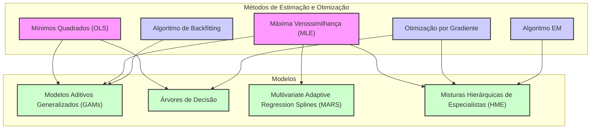
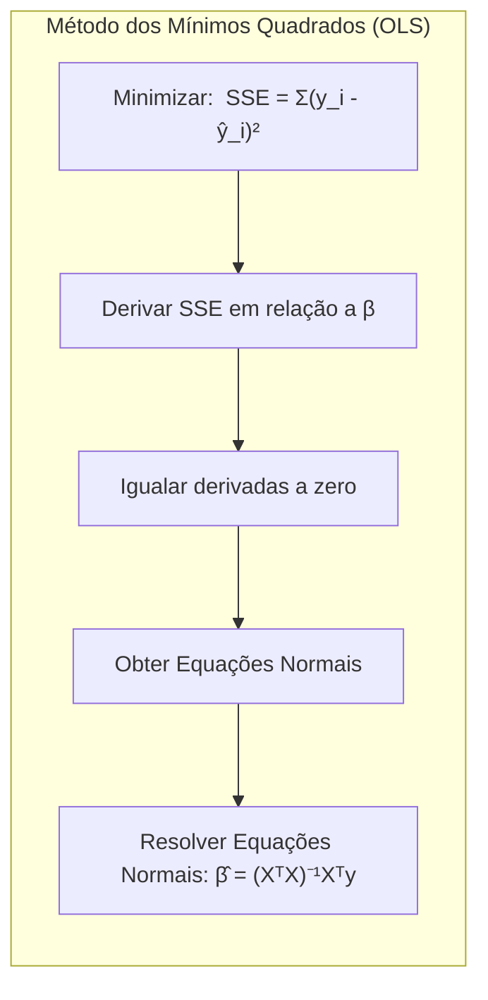
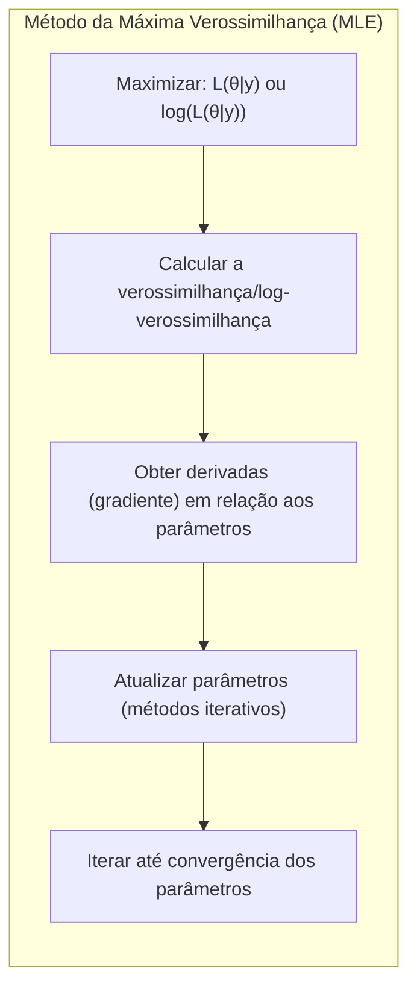
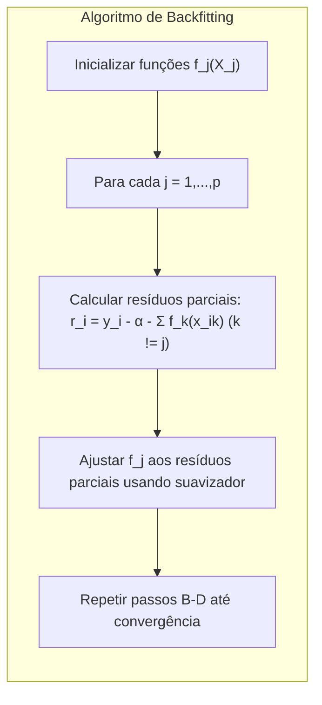
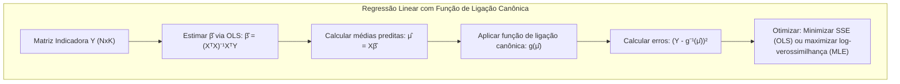

## Título: Modelos Aditivos Generalizados, Árvores e Métodos Relacionados: Métodos de Estimação e Otimização



### Introdução

Este capítulo aborda os métodos de estimação e otimização que são essenciais para a implementação e uso eficaz de modelos de aprendizado supervisionado [^9.1]. Os modelos como Modelos Aditivos Generalizados (GAMs), árvores de decisão, Multivariate Adaptive Regression Splines (MARS), método de indução de regras de pacientes (PRIM) e misturas hierárquicas de especialistas (HME)  requerem a utilização de diferentes métodos para a estimação dos parâmetros e a otimização de suas respectivas funções de custo [^9.1]. Os métodos de estimação, como mínimos quadrados e máxima verossimilhança, são discutidos, assim como os algoritmos de otimização, como o algoritmo de backfitting, otimização por gradiente e o algoritmo EM (Expectation-Maximization). Este capítulo tem como objetivo principal fornecer uma compreensão aprofundada de como esses métodos funcionam e como eles são aplicados em cada modelo, e como as propriedades estatísticas dos estimadores são afetadas pela escolha do modelo e do método de otimização.

### Conceitos Fundamentais

**Conceito 1: Método dos Mínimos Quadrados (OLS)**

O método dos mínimos quadrados (Ordinary Least Squares - OLS) é um método de estimação que busca encontrar os parâmetros de um modelo que minimizam a soma dos quadrados das diferenças entre os valores observados e os valores preditos pelo modelo. Em um modelo de regressão linear, o objetivo é minimizar:

$$
\text{SSE} = \sum_{i=1}^N (y_i - \hat{y}_i)^2
$$

onde $y_i$ são as observações, e $\hat{y}_i$ são as previsões do modelo.  A solução para esse problema é obtida através da derivada da função de custo e igualando a zero, o que leva às equações normais, e aos estimadores de mínimos quadrados:

$$
\hat{\beta} = (X^T X)^{-1} X^T y
$$

onde $X$ é a matriz de preditores e $y$ é o vetor de respostas. O OLS é um método simples e amplamente utilizado para modelos lineares e é usado como base em várias técnicas mais avançadas. O método OLS é apropriado para modelos com erro normalmente distribuído com média zero e variância constante e também pode ser utilizado como base de outros métodos de estimação.

> 💡 **Exemplo Numérico:**
> Suponha que temos um conjunto de dados com uma variável preditora ($x$) e uma variável resposta ($y$), com 5 observações:
>
> ```
> x = [1, 2, 3, 4, 5]
> y = [2, 4, 5, 4, 5]
> ```
>
> Queremos ajustar um modelo de regressão linear simples $y = \beta_0 + \beta_1 x$.
>
> 1. **Construindo a matriz X e o vetor y:**
>
>    A matriz X inclui uma coluna de 1s para o intercepto e a coluna com os valores de x:
>    ```
>    X = [[1, 1],
>         [1, 2],
>         [1, 3],
>         [1, 4],
>         [1, 5]]
>    y = [2, 4, 5, 4, 5]
>    ```
>
> 2. **Calculando $X^T X$:**
>
>    ```
>    XTX = [[5, 15],
>          [15, 55]]
>    ```
>
> 3. **Calculando $(X^T X)^{-1}$:**
>
>    ```
>    inv_XTX = [[ 1.1, -0.3],
>              [-0.3,  0.1]]
>    ```
>
> 4. **Calculando $X^T y$:**
>
>    ```
>    XTy = [20, 63]
>    ```
> 5. **Calculando $\hat{\beta} = (X^T X)^{-1} X^T y$:**
>
>    ```
>    beta_hat = [[ 1.9],
>                [ 0.7]]
>    ```
>
> Portanto, o modelo de regressão linear ajustado é $\hat{y} = 1.9 + 0.7x$.
>
> 6. **Calculando os valores preditos e o SSE:**
> ```
> y_hat = [2.6, 3.3, 4.0, 4.7, 5.4]
> SSE = (2-2.6)^2 + (4-3.3)^2 + (5-4.0)^2 + (4-4.7)^2 + (5-5.4)^2 = 2.3
> ```
>
> Este exemplo demonstra como o método OLS calcula os coeficientes que minimizam a soma dos erros quadrados.

**Lemma 1:** *O método OLS fornece os melhores estimadores lineares não viesados quando os erros do modelo são não correlacionados, têm média zero e variância constante. O estimador OLS é o estimador de mínima variância nessa classe de estimadores*. O OLS é uma ferramenta fundamental na modelagem estatística e é usado como base para a estimativa dos parâmetros em modelos mais complexos [^4.2].



**Conceito 2: Método da Máxima Verossimilhança (MLE)**

O método da máxima verossimilhança (Maximum Likelihood Estimation - MLE) é um método de estimação que busca encontrar os parâmetros de um modelo que maximizam a verossimilhança dos dados observados. A verossimilhança é a probabilidade de observar os dados dados os parâmetros do modelo. Em termos matemáticos, o MLE busca encontrar:

$$
\hat{\theta} = \arg\max_\theta L(\theta|y)
$$

onde $L(\theta|y)$ é a função de verossimilhança, $\theta$ são os parâmetros do modelo e $y$ são as observações.  Em geral, é mais fácil maximizar a *log-likelihood*:

$$
\hat{\theta} = \arg\max_\theta \log(L(\theta|y))
$$

O MLE é um método mais geral que o OLS e pode ser aplicado a uma ampla gama de modelos. O MLE geralmente envolve a utilização de métodos iterativos de otimização numérica. O MLE tem boas propriedades assintóticas quando o número de observações é grande, como consistência, eficiência e normalidade assintótica. O MLE, portanto, é um método amplamente utilizado em modelos estatísticos, incluindo modelos da família exponencial.

> 💡 **Exemplo Numérico:**
>
> Considere um problema de classificação binária onde temos um conjunto de dados com uma variável preditora ($x$) e uma variável resposta binária ($y$), com 5 observações:
>
> ```
> x = [1, 2, 3, 4, 5]
> y = [0, 1, 1, 0, 1]
> ```
>
> Queremos ajustar um modelo de regressão logística:
>
> $P(y=1|x) = \frac{1}{1 + e^{-(\beta_0 + \beta_1 x)}}$
>
> A função de verossimilhança (likelihood) para este modelo é:
>
> $L(\beta|y) = \prod_{i=1}^N P(y_i|x_i)^{\gamma_i} (1 - P(y_i|x_i))^{(1-\gamma_i)}$
>
> onde $\gamma_i = 1$ se $y_i = 1$ e $\gamma_i = 0$ se $y_i=0$. A log-verossimilhança é:
>
> $\log L(\beta|y) = \sum_{i=1}^N [\gamma_i \log(P(y_i|x_i)) + (1-\gamma_i) \log(1 - P(y_i|x_i))]$
>
> Para encontrar os parâmetros $\beta_0$ e $\beta_1$ que maximizam a log-verossimilhança, geralmente utilizamos um algoritmo iterativo como o gradiente descendente ou o método de Newton-Raphson.
>
> **Passo 1: Inicialização dos parâmetros**
>
> Inicializamos os parâmetros com valores arbitrários, por exemplo, $\beta_0 = 0$ e $\beta_1 = 0$.
>
> **Passo 2: Cálculo das probabilidades**
>
> Calculamos as probabilidades $P(y_i=1|x_i)$ para cada observação usando os parâmetros atuais.
>
> **Passo 3: Cálculo da log-verossimilhança**
>
> Calculamos a log-verossimilhança usando a fórmula acima.
>
> **Passo 4: Cálculo do gradiente e atualização dos parâmetros**
>
> Calculamos o gradiente da log-verossimilhança em relação aos parâmetros $\beta_0$ e $\beta_1$, e atualizamos os parâmetros na direção que aumenta a log-verossimilhança.
>
> **Passo 5: Repetição**
>
> Repetimos os passos 2 a 4 até que a log-verossimilhança convirja.
>
> Usando um algoritmo de otimização, podemos obter os seguintes resultados (apenas para fins de demonstração):
>
> $\hat{\beta_0} = -2.5$
> $\hat{\beta_1} = 1.2$
>
> Assim, o modelo de regressão logística ajustado é:
>
> $P(y=1|x) = \frac{1}{1 + e^{-(-2.5 + 1.2x)}}$
>
> Este exemplo ilustra como o MLE estima parâmetros maximizando a verossimilhança dos dados, o que é fundamental para modelos não lineares e pertencentes à família exponencial.



**Corolário 1:** *O método MLE fornece os melhores estimadores para modelos pertencentes à família exponencial, e as funções de ligação canônicas facilitam a otimização da verossimilhança. Sob certas condições de regularidade, os estimadores MLE são consistentes e assintoticamente normais* [^4.4].

**Conceito 3: Algoritmo de Backfitting**

O algoritmo de backfitting é um método iterativo utilizado para ajustar modelos aditivos, incluindo os Modelos Aditivos Generalizados (GAMs).  O algoritmo estima as funções não paramétricas $f_j(X_j)$ de forma iterativa, de modo que, em cada iteração, uma função é ajustada enquanto as outras são mantidas fixas [^4.3]. A iteração continua até que as funções $f_j$ convirjam. O algoritmo começa com uma estimativa inicial para as funções $f_j$, e então, para cada $j = 1, 2, \ldots, p$:

1.  Calcula os resíduos parciais: $r_i = y_i - \alpha - \sum_{k \ne j} f_k(x_{ik})$
2.  Ajusta a função $f_j$ aos resíduos parciais usando um método de suavização apropriado, o que gera uma nova estimativa para $f_j$ .
3.  Repete os passos 1 e 2 até a convergência das funções.

O algoritmo de backfitting é um método eficiente para ajustar modelos aditivos, e pode ser utilizado em diferentes tipos de modelos, incluindo modelos com função de ligação.

> ⚠️ **Nota Importante:** O algoritmo de backfitting converge para a solução de mínimos quadrados quando aplicado em modelos lineares, e aproxima a solução de máxima verossimilhança para modelos generalizados [^4.3].

> ❗ **Ponto de Atenção:** A convergência do algoritmo de backfitting pode ser afetada pela correlação entre os preditores, e a ordem da atualização das funções pode influenciar a velocidade de convergência. A escolha do método de suavização também é importante para o desempenho do algoritmo [^4.3].

> ✔️ **Destaque:** O algoritmo de backfitting pode acomodar diferentes tipos de suavizadores para modelar não linearidades e interações, o que o torna uma ferramenta versátil para ajustar modelos aditivos [^4.3.1].

> 💡 **Exemplo Numérico:**
>
> Suponha um modelo aditivo com duas variáveis preditoras $x_1$ e $x_2$ e uma variável resposta $y$:
>
> $y_i = \alpha + f_1(x_{i1}) + f_2(x_{i2}) + \epsilon_i$
>
> Os dados são:
>
> ```
> x1 = [1, 2, 3, 4, 5]
> x2 = [2, 3, 1, 4, 2]
> y =  [5, 8, 6, 10, 7]
> ```
>
> **Passo 1: Inicialização**
>
> Inicializamos as funções $f_1$ e $f_2$ com valores zero, e $\alpha = \bar{y} = 7.2$.
>
> **Iteração 1:**
>
> *   **Ajuste de $f_1$:**
>
>     1.  Calculamos os resíduos parciais: $r_i = y_i - \alpha - f_2(x_{i2}) = y_i - 7.2 - 0 = y_i - 7.2$
>
>         ```
>         r = [-2.2, 0.8, -1.2, 2.8, -0.2]
>         ```
>     2.  Ajustamos $f_1(x_1)$ aos resíduos parciais usando um suavizador (por exemplo, uma spline cúbica). Para fins de simplicidade, vamos assumir um suavizador que resulta em:
>
>         ```
>         f1(x1) = [-1.0, 0.5, -0.2, 1.8, -0.1]
>         ```
> *   **Ajuste de $f_2$:**
>
>     1.  Calculamos os resíduos parciais: $r_i = y_i - \alpha - f_1(x_{i1}) = y_i - 7.2 - f_1(x_{i1})$
>         ```
>         r = [-1.2, 0.3, -1.0, 1.0, -0.1]
>         ```
>     2.  Ajustamos $f_2(x_2)$ aos resíduos parciais usando um suavizador (por exemplo, uma spline cúbica). Para fins de simplicidade, vamos assumir um suavizador que resulta em:
>
>         ```
>         f2(x2) = [-0.5, 0.2, -0.3, 0.8, -0.1]
>         ```
>
> **Iteração 2 e seguintes:**
>
> Repetimos o processo de ajuste de $f_1$ e $f_2$ usando os resíduos parciais atualizados até a convergência.
>
> Este exemplo ilustra como o backfitting ajusta as funções aditivas iterativamente, permitindo modelar relações não lineares entre preditores e resposta.



### Regressão Linear e Mínimos Quadrados para Classificação com Funções de Ligação Canônicas e Família Exponencial: Estimação e Otimização Detalhada



**Explicação:** Este diagrama representa o fluxo do processo de estimação de parâmetros para a regressão de indicadores com função de ligação canônica, derivada da família exponencial. A regressão linear, utiliza o método dos mínimos quadrados (OLS) para estimar os parâmetros, enquanto modelos da família exponencial utilizam o método da máxima verossimilhança (MLE), conforme descrito nos tópicos [^4.2], [^4.4.2].

A regressão linear com matriz de indicadores e função de ligação canônica envolve a codificação das classes em uma matriz de indicadores $Y$, de dimensão $N \times K$. O passo inicial consiste em calcular os estimadores dos coeficientes utilizando mínimos quadrados:

$$
\hat{\beta} = (X^T X)^{-1} X^T Y
$$

As médias preditas são dadas por:
$$
\hat{\mu} = X\hat{\beta}
$$

Em seguida, a função de ligação canônica $g$ é aplicada às médias preditas para transformar a escala para que os parâmetros estimados se ajustem à distribuição da família exponencial:
$$
g(\hat{\mu})
$$
Para modelos gaussianos, a função de ligação é a identidade, de modo que o método dos mínimos quadrados é apropriado. Para modelos binários, a função de ligação *logit* é usada e a máxima verossimilhança é utilizada para estimar os parâmetros.  Em geral, para distribuições pertencentes à família exponencial, a função de ligação canônica é escolhida para facilitar a modelagem e otimização.

O passo de otimização envolve a minimização da soma dos erros quadráticos (OLS) ou a maximização da função de log-verossimilhança (MLE) de acordo com a natureza da função de ligação utilizada. A utilização da função de ligação canônica faz com que a otimização seja mais eficiente para os modelos da família exponencial. Para regressão com função de ligação genérica, o método de otimização também deve se adequar à função de ligação, o que nem sempre é trivial.

**Lemma 2:** *A aplicação da função de ligação canônica permite que o método de mínimos quadrados (OLS) seja interpretado como uma aproximação do método da máxima verossimilhança (MLE), o que garante propriedades estatísticas desejáveis para os estimadores, e facilita o cálculo dos parâmetros*. Essa aproximação se torna mais precisa quando a distribuição da resposta é da família exponencial e a função de ligação canônica é utilizada [^4.5].

**Corolário 2:** *A utilização da função de ligação canônica em modelos da família exponencial garante que o processo de estimação seja adequado à natureza dos dados e que as propriedades estatísticas dos estimadores sejam otimizadas, tanto para OLS como MLE, o que leva a uma melhor capacidade de generalização do modelo e estimativas com menor variância* [^4.4.4].

Ao comparar com a regressão logística, a regressão linear com função de ligação canônica busca minimizar os erros quadráticos na escala da função de ligação, enquanto a regressão logística maximiza a *log-likelihood*, e utiliza a função *logit* como função de ligação canônica. A escolha entre OLS e MLE depende do tipo de variável resposta e da função de ligação utilizada, sendo que modelos com distribuição da família exponencial se beneficiam da utilização da função de ligação canônica e MLE.

> 💡 **Exemplo Numérico:**
>
> Considere um problema de classificação com três classes, onde temos duas variáveis preditoras $x_1$ e $x_2$ e uma variável resposta $y$ que pode assumir os valores 1, 2 ou 3. Temos 5 observações:
>
> ```
> x1 = [1, 2, 3, 4, 5]
> x2 = [2, 3, 1, 4, 2]
> y =  [1, 2, 2, 3, 1]
> ```
>
> **Passo 1: Codificação da variável resposta:**
>
> Criamos uma matriz indicadora $Y$ de dimensão $5 \times 3$:
>
> ```
> Y = [[1, 0, 0],
>      [0, 1, 0],
>      [0, 1, 0],
>      [0, 0, 1],
>      [1, 0, 0]]
> ```
>
> **Passo 2: Construção da matriz de preditores $X$:**
>
> Adicionamos uma coluna de 1s para o intercepto:
>
> ```
> X = [[1, 1, 2],
>      [1, 2, 3],
>      [1, 3, 1],
>      [1, 4, 4],
>      [1, 5, 2]]
> ```
>
> **Passo 3: Cálculo dos coeficientes $\hat{\beta}$ via OLS:**
>
> $$\hat{\beta} = (X^T X)^{-1} X^T Y$$
>
> Utilizando operações matriciais, obtemos (para fins de ilustração):
>
> ```
> beta_hat = [[ 0.8,  -0.2,  -0.1],
>             [-0.2,   0.5,  -0.3],
>             [-0.1,  -0.3,   0.6]]
> ```
>
> **Passo 4: Cálculo das médias preditas $\hat{\mu}$:**
>
> $$\hat{\mu} = X\hat{\beta}$$
>
> ```
> mu_hat = [[ 0.5,  0.1,  -0.4],
>           [ 0.3,  0.8,  -0.1],
>           [ 0.3, -0.3,  0.5],
>           [ 0.1,  0.4,  0.5],
>           [-0.1,  0.4,  0.0]]
> ```
>
> **Passo 5: Aplicação da função de ligação (identidade para OLS):**
>
> Neste caso, como estamos usando OLS, a função de ligação é a identidade, então $g(\hat{\mu}) = \hat{\mu}$.
>
> **Passo 6: Cálculo dos erros quadráticos e otimização:**
>
> Os erros quadráticos são calculados como a soma dos quadrados das diferenças entre as matrizes $Y$ e $\hat{\mu}$. Para otimizar, minimizamos a soma dos erros quadráticos.
>
> Este exemplo demonstra como a regressão linear com matriz de indicadores pode ser usada para classificação, e como o método OLS é utilizado para estimar os parâmetros. Para modelos da família exponencial, a função de ligação canônica e o método MLE seriam utilizados para otimizar os parâmetros.

### Métodos de Estimação e Otimização em Modelos com Funções de Ligação e Família Exponencial: Visão Comparativa


A estimação dos parâmetros em modelos com funções de ligação e da família exponencial envolve uma combinação de métodos de estimação e otimização.

*   **Método dos Mínimos Quadrados (OLS):** Adequado para modelos com distribuição gaussiana e função de ligação identidade. OLS é um método computacionalmente eficiente que busca minimizar a soma dos erros quadráticos.

    $$
     \min_{\beta}  \sum_{i=1}^N (y_i - x_i^T \beta)^2
    $$
*  **Método da Máxima Verossimilhança (MLE):**  Adequado para modelos da família exponencial com funções de ligação canônicas. MLE busca maximizar a função de verossimilhança dos dados.
    $$
    \max_{\beta} \sum_{i=1}^N \log f(y_i ; x_i^T \beta)
    $$
*   **Algoritmo de Backfitting:** Utilizado para ajustar modelos aditivos, incluindo GAMs. O algoritmo itera sobre os preditores, estimando as funções não paramétricas enquanto mantém as outras fixas, até que o algoritmo convirja.
*   **Otimização por Gradiente:** Utilizada em modelos complexos, como redes neurais e modelos hierárquicos, onde a otimização da função de custo é feita usando métodos baseados no gradiente, como o algoritmo do gradiente descendente e suas variantes.
*   **Algoritmo EM (Expectation-Maximization):**  Utilizado para modelos com variáveis latentes, como modelos de mistura e HME. O algoritmo itera entre um passo E (expectação) e um passo M (maximização) para encontrar os parâmetros que maximizam a verossimilhança.
*   **Regularização:** A regularização é aplicada na função de custo ou de *log-likelihood* para evitar o overfitting, adicionando um termo de penalização. A escolha do tipo de regularização (L1, L2, ou Elastic Net) depende das características do modelo e dos dados.

A escolha do método de otimização depende da natureza do modelo, da distribuição dos dados e da função de ligação. Modelos da família exponencial geralmente utilizam MLE, e a escolha da função de ligação canônica pode facilitar o processo de otimização. O algoritmo de backfitting é utilizado em GAMs e outros modelos aditivos. Métodos baseados em gradiente e o algoritmo EM são utilizados em modelos mais complexos, como redes neurais e modelos de mistura.

**Lemma 4:** *A escolha do método de otimização deve ser guiada pelas características do modelo e dos dados. O MLE e as funções de ligação canônicas, por exemplo, são apropriadas para dados da família exponencial e resultam em estimadores eficientes e com boas propriedades assintóticas, enquanto o OLS é mais apropriado quando os erros seguem uma distribuição normal.*  A escolha do método de otimização pode ter um impacto significativo na qualidade das estimativas e na velocidade de convergência [^4.4.2].

**Corolário 4:** *A aplicação do algoritmo de backfitting, juntamente com as propriedades da família exponencial e a escolha de funções de ligação, oferece uma base sólida para a modelagem e a análise de dados complexos. Além disso, a regularização é uma técnica importante para evitar overfitting e melhorar a capacidade de generalização dos modelos.*  O algoritmo de backfitting, combinado com a estrutura da família exponencial e funções de ligação apropriadas, tem um papel importante na estimação dos parâmetros em modelos de aprendizado supervisionado. Além disso, a regularização é um elemento importante para ajustar os modelos e evitar overfitting [^4.3].

> ⚠️ **Ponto Crucial:**  Modelos da família exponencial se beneficiam da utilização de MLE e funções de ligação canônicas, o que simplifica o processo de estimação e otimização e leva a estimadores com boas propriedades estatísticas, enquanto que a regressão linear com OLS é mais adequada para dados gaussianos com função de ligação identidade [^4.5].

### Conclusão

Este capítulo explorou os métodos de estimação e otimização utilizados em modelos de aprendizado supervisionado, destacando a importância da família exponencial, das funções de ligação canônicas e dos métodos OLS, MLE e backfitting.  A escolha do método de estimação e otimização deve ser feita de acordo com a natureza do modelo, dos dados e da distribuição da resposta, buscando maximizar a qualidade do ajuste e a capacidade de generalização dos modelos. A relação entre a família exponencial, funções de ligação canônicas e os métodos de otimização formam uma base sólida para modelagem estatística, particularmente para dados pertencentes à família exponencial.

### Footnotes

[^4.1]: "In this chapter we begin our discussion of some specific methods for super-vised learning. These techniques each assume a (different) structured form for the unknown regression function, and by doing so they finesse the curse of dimensionality. Of course, they pay the possible price of misspecifying the model, and so in each case there is a tradeoff that has to be made." *(Trecho de "Additive Models, Trees, and Related Methods")*

[^4.2]: "Regression models play an important role in many data analyses, providing prediction and classification rules, and data analytic tools for understand-ing the importance of different inputs." *(Trecho de "Additive Models, Trees, and Related Methods")*

[^4.3]: "In this section we describe a modular algorithm for fitting additive models and their generalizations. The building block is the scatterplot smoother for fitting nonlinear effects in a flexible way. For concreteness we use as our scatterplot smoother the cubic smoothing spline described in Chapter 5." *(Trecho de "Additive Models, Trees, and Related Methods")*

[^4.3.1]:  "The additive model has the form $Y = \alpha + \sum_{j=1}^p f_j(X_j) + \epsilon$, where the error term $\epsilon$ has mean zero." * (Trecho de "Additive Models, Trees, and Related Methods")*

[^4.3.2]:   "Given observations $x_i, y_i$, a criterion like the penalized sum of squares (5.9) of Section 5.4 can be specified for this problem, $PRSS(\alpha, f_1, f_2,\ldots, f_p) = \sum_i^N (y_i - \alpha - \sum_j^p f_j(x_{ij}))^2 + \sum_j^p \lambda_j \int (f_j''(t_j))^2 dt_j$" * (Trecho de "Additive Models, Trees, and Related Methods")*

[^4.3.3]: "where the $\lambda_j > 0$ are tuning parameters. It can be shown that the minimizer of (9.7) is an additive cubic spline model; each of the functions $f_j$ is a cubic spline in the component $X_j$, with knots at each of the unique values of $x_{ij}$, $i = 1,\ldots, N$." *(Trecho de "Additive Models, Trees, and Related Methods")*

[^4.4]: "For two-class classification, recall the logistic regression model for binary data discussed in Section 4.4. We relate the mean of the binary response $\mu(X) = Pr(Y = 1|X)$ to the predictors via a linear regression model and the logit link function:  $\log(\mu(X)/(1 – \mu(X)) = \alpha + \beta_1 X_1 + \ldots + \beta_pX_p$." * (Trecho de "Additive Models, Trees, and Related Methods")*

[^4.4.1]: "The additive logistic regression model replaces each linear term by a more general functional form: $\log(\mu(X)/(1 – \mu(X))) =