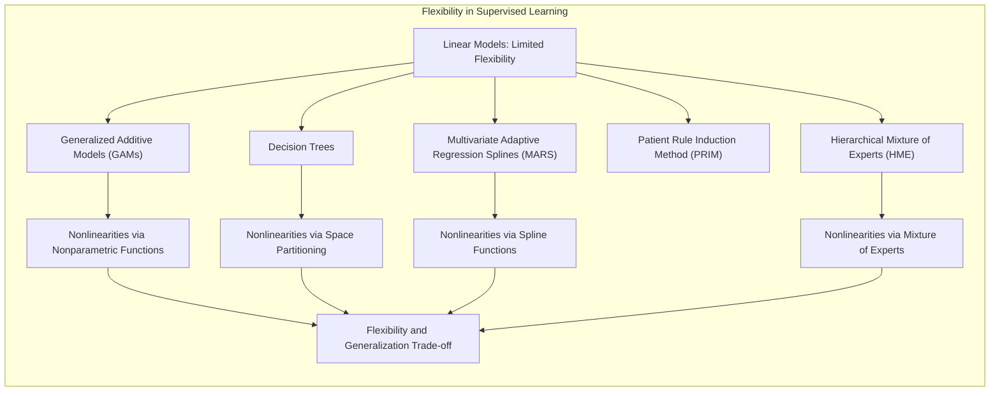
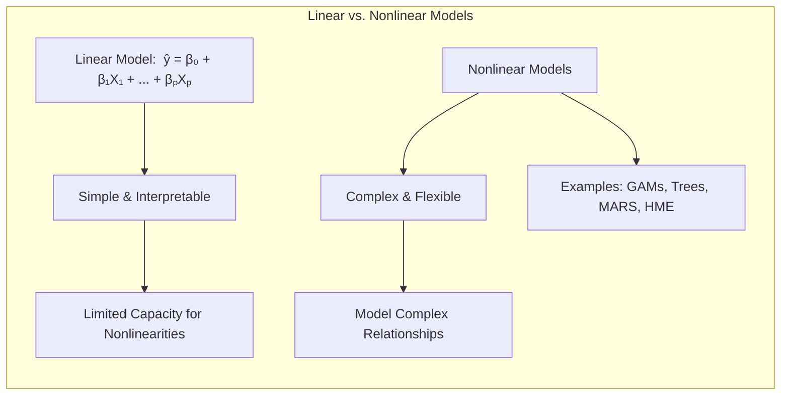
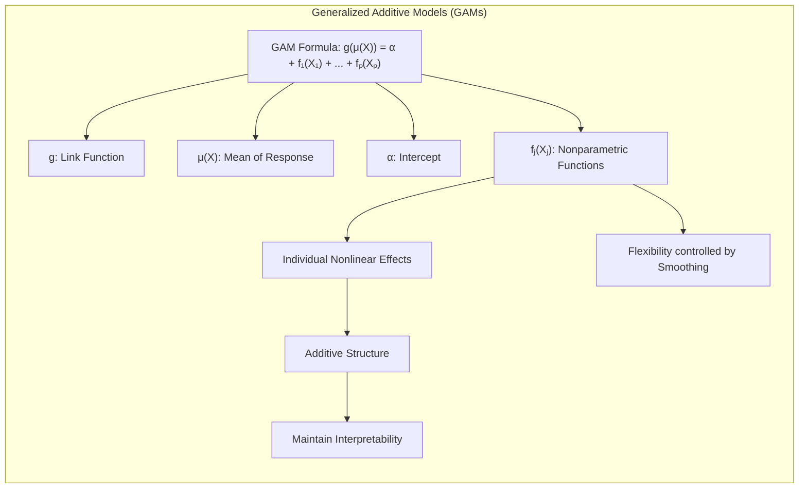
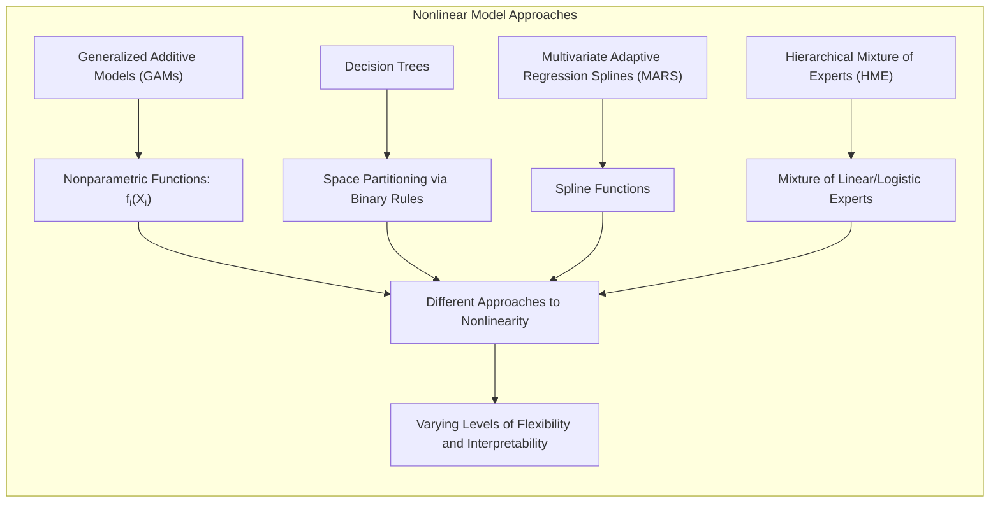
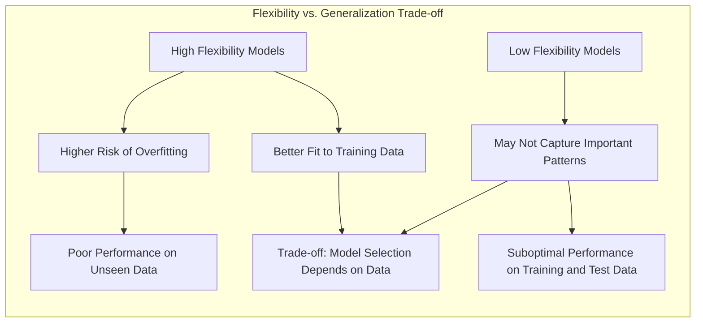
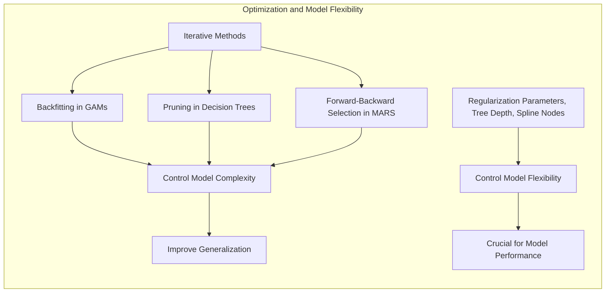

## Título: Modelos Aditivos Generalizados, Árvores e Métodos Relacionados: Flexibilidade e Não Linearidade



### Introdução

Este capítulo explora o conceito de flexibilidade em modelos de aprendizado supervisionado, abordando como diferentes métodos lidam com a não linearidade e a complexidade dos dados [^9.1]. Modelos lineares, embora simples e interpretáveis, podem ser limitados em sua capacidade de modelar relações complexas. Por outro lado, modelos mais flexíveis, como os Modelos Aditivos Generalizados (GAMs), árvores de decisão, Multivariate Adaptive Regression Splines (MARS), o método de indução de regras de pacientes (PRIM) e misturas hierárquicas de especialistas (HME), buscam modelar não linearidades através de diferentes abordagens [^9.1]. O objetivo principal deste capítulo é examinar como cada um desses métodos atinge flexibilidade, como essa flexibilidade afeta a capacidade do modelo de generalizar a partir dos dados e como a interpretabilidade é afetada. O foco está na análise teórica de como diferentes modelos incorporam a não linearidade, e as implicações práticas de cada abordagem.

### Conceitos Fundamentais

**Conceito 1: Flexibilidade em Modelos Estatísticos**

A flexibilidade em um modelo estatístico refere-se à sua capacidade de ajustar-se a uma ampla gama de padrões nos dados, incluindo relações não lineares e interações complexas. Modelos lineares, com suas restrições, podem ser considerados modelos com pouca flexibilidade, o que os torna inadequados quando a relação entre os preditores e a resposta é não linear.  Modelos mais flexíveis, por outro lado, possuem muitos parâmetros e a capacidade de adaptar-se a relações mais complexas, o que pode melhorar o ajuste aos dados de treino, mas pode aumentar o risco de overfitting, resultando em uma generalização ruim para novos dados. A flexibilidade é um conceito chave na escolha do modelo, sendo importante que o modelo tenha flexibilidade suficiente para modelar as relações nos dados, mas sem overfit.

**Lemma 1:** *A flexibilidade de um modelo estatístico é uma propriedade que permite que ele se ajuste a padrões mais complexos e não lineares. No entanto, o aumento da flexibilidade pode levar ao overfitting, o que resulta em modelos com bom ajuste aos dados de treino, mas com baixo desempenho em novos dados. Existe um trade-off entre flexibilidade e a capacidade de generalização* [^9.1].

> 💡 **Exemplo Numérico:**
>
> Imagine que temos um conjunto de dados simulado onde a relação entre a variável preditora ($X$) e a variável resposta ($Y$) é quadrática:
>
> $Y = 2 + 3X - 0.5X^2 + \epsilon$, onde $\epsilon$ é um erro aleatório com média zero.
>
> Podemos ajustar dois modelos: um modelo linear e um modelo quadrático.
>
> **Modelo Linear:** $\hat{Y} = \beta_0 + \beta_1X$
>
> **Modelo Quadrático:** $\hat{Y} = \beta_0 + \beta_1X + \beta_2X^2$
>
> Usando um conjunto de dados de treino, o modelo linear pode fornecer um ajuste pobre, pois não consegue capturar a curvatura da relação. O modelo quadrático, por outro lado, terá um bom ajuste aos dados de treino. No entanto, se o modelo quadrático for muito complexo (por exemplo, um polinômio de grau muito alto), ele pode se ajustar muito bem aos dados de treino, incluindo o ruído, e ter um desempenho ruim em novos dados. Este exemplo ilustra o trade-off entre a flexibilidade do modelo e a generalização.
>
> Vamos simular alguns dados e ajustar os modelos em Python:
> ```python
> import numpy as np
> import matplotlib.pyplot as plt
> from sklearn.linear_model import LinearRegression
> from sklearn.preprocessing import PolynomialFeatures
> from sklearn.metrics import mean_squared_error
>
> # Simulação de dados
> np.random.seed(42)
> X = np.sort(np.random.rand(100) * 10)
> Y = 2 + 3 * X - 0.5 * X**2 + np.random.randn(100) * 2
> X = X.reshape(-1, 1)
>
> # Ajuste do modelo linear
> linear_model = LinearRegression()
> linear_model.fit(X, Y)
> Y_linear_pred = linear_model.predict(X)
>
> # Ajuste do modelo quadrático
> poly_features = PolynomialFeatures(degree=2)
> X_poly = poly_features.fit_transform(X)
> quadratic_model = LinearRegression()
> quadratic_model.fit(X_poly, Y)
> Y_quadratic_pred = quadratic_model.predict(X_poly)
>
> # Cálculo do erro quadrático médio
> mse_linear = mean_squared_error(Y, Y_linear_pred)
> mse_quadratic = mean_squared_error(Y, Y_quadratic_pred)
>
> print(f"MSE do modelo linear: {mse_linear:.2f}")
> print(f"MSE do modelo quadrático: {mse_quadratic:.2f}")
>
> # Visualização
> plt.figure(figsize=(10, 6))
> plt.scatter(X, Y, label='Dados Reais')
> plt.plot(X, Y_linear_pred, color='red', label='Modelo Linear')
> plt.plot(X, Y_quadratic_pred, color='green', label='Modelo Quadrático')
> plt.xlabel('X')
> plt.ylabel('Y')
> plt.legend()
> plt.title('Comparação entre Modelo Linear e Quadrático')
> plt.show()
> ```
>
> Este código gera um gráfico comparando os ajustes do modelo linear e quadrático, juntamente com o MSE para ambos. O modelo quadrático se ajusta melhor aos dados de treino, mas a flexibilidade excessiva pode levar ao overfitting se não for controlada.

**Conceito 2: Modelos Lineares vs. Modelos Não Lineares**

Modelos lineares, como a regressão linear clássica, assumem que a relação entre a variável resposta e os preditores pode ser expressa por uma combinação linear. A forma geral de um modelo linear é:

$$
\hat{y} = \beta_0 + \beta_1X_1 + \beta_2X_2 + \ldots + \beta_pX_p
$$

Esses modelos são simples e interpretáveis, mas limitados em sua capacidade de modelar não linearidades. Em contraste, modelos não lineares permitem que a resposta seja relacionada com os preditores através de funções não lineares, o que os torna mais adequados para modelar dados complexos.



Modelos como os GAMs, árvores de decisão, MARS e HME, apresentam diferentes abordagens para lidar com a não linearidade, o que os torna mais flexíveis do que os modelos lineares. Os GAMs utilizam funções não paramétricas para cada preditor, as árvores de decisão dividem o espaço de características em regiões, MARS usa funções *spline* para aproximar relações não lineares, e HME utiliza uma mistura de especialistas para aproximar diferentes regiões do espaço de características.

**Corolário 1:** *A escolha entre um modelo linear e um não linear depende da natureza da relação entre os preditores e a resposta, e do objetivo da modelagem. Modelos lineares são preferíveis quando a relação é linear ou aproximadamente linear, e modelos não lineares são necessários quando a relação é complexa e não linear.* A escolha entre modelos lineares e não lineares depende do conhecimento prévio sobre os dados e do objetivo do problema [^4.1].

> 💡 **Exemplo Numérico:**
>
> Imagine que estamos modelando o preço de uma casa em função da sua área. Se observarmos que o preço aumenta linearmente com a área, um modelo linear será apropriado. No entanto, se o preço aumentar rapidamente no início e depois se estabilizar, um modelo não linear, como um GAM ou MARS, pode ser mais adequado.
>
> Vamos simular alguns dados:
>
> ```python
> import numpy as np
> import matplotlib.pyplot as plt
> from sklearn.linear_model import LinearRegression
>
> # Simulação de dados lineares
> np.random.seed(42)
> area_linear = np.sort(np.random.rand(100) * 200)
> preco_linear = 50 + 1.5 * area_linear + np.random.randn(100) * 10
> area_linear = area_linear.reshape(-1, 1)
>
> # Simulação de dados não lineares
> area_nonlinear = np.sort(np.random.rand(100) * 200)
> preco_nonlinear = 100 + 50 * np.log(area_nonlinear + 1) + np.random.randn(100) * 10
> area_nonlinear = area_nonlinear.reshape(-1, 1)
>
> # Ajuste de modelo linear aos dados lineares
> linear_model_linear = LinearRegression()
> linear_model_linear.fit(area_linear, preco_linear)
> preco_linear_pred = linear_model_linear.predict(area_linear)
>
> # Ajuste de modelo linear aos dados não lineares
> linear_model_nonlinear = LinearRegression()
> linear_model_nonlinear.fit(area_nonlinear, preco_nonlinear)
> preco_nonlinear_pred = linear_model_nonlinear.predict(area_nonlinear)
>
> # Visualização
> plt.figure(figsize=(12, 6))
>
> plt.subplot(1, 2, 1)
> plt.scatter(area_linear, preco_linear, label='Dados Lineares')
> plt.plot(area_linear, preco_linear_pred, color='red', label='Modelo Linear')
> plt.xlabel('Área (m²)')
> plt.ylabel('Preço (R$)')
> plt.title('Relação Linear')
> plt.legend()
>
> plt.subplot(1, 2, 2)
> plt.scatter(area_nonlinear, preco_nonlinear, label='Dados Não Lineares')
> plt.plot(area_nonlinear, preco_nonlinear_pred, color='red', label='Modelo Linear')
> plt.xlabel('Área (m²)')
> plt.ylabel('Preço (R$)')
> plt.title('Relação Não Linear')
> plt.legend()
>
> plt.tight_layout()
> plt.show()
> ```
>
> O gráfico mostra que o modelo linear ajusta-se bem aos dados lineares, mas não consegue capturar a relação não linear nos dados não lineares.

**Conceito 3: Flexibilidade nos Modelos Aditivos Generalizados (GAMs)**

Os Modelos Aditivos Generalizados (GAMs) alcançam flexibilidade através da modelagem da relação entre a resposta e os preditores através de funções não paramétricas individuais de cada preditor:

$$
g(\mu(X)) = \alpha + f_1(X_1) + f_2(X_2) + \ldots + f_p(X_p)
$$

onde $g$ é a função de ligação, $\mu(X)$ é a média da resposta, $\alpha$ é o intercepto, e $f_j(X_j)$ são as funções não paramétricas que modelam a relação entre a resposta e cada preditor individualmente.  A estrutura aditiva dos GAMs permite que os efeitos de cada preditor sejam modelados de forma não linear, ao mesmo tempo em que a interpretabilidade é mantida devido a estrutura aditiva. A não linearidade é inserida no modelo usando as funções $f_j(X_j)$, e a escolha da função de ligação $g$ garante a modelagem apropriada para cada tipo de dados. A flexibilidade nos GAMs é controlada pelo grau de suavização das funções $f_j$.



> ⚠️ **Nota Importante:** A flexibilidade dos GAMs é alcançada através do uso de funções não paramétricas $f_j$ e funções de ligação $g$, o que os torna mais adequados para modelar dados com relações não lineares que os modelos lineares clássicos [^4.4.3].

> ❗ **Ponto de Atenção:** A suavização das funções $f_j$ é um fator importante na flexibilidade dos GAMs. Modelos pouco suavizados podem se ajustar a padrões complexos nos dados de treinamento, mas também podem sofrer de overfitting, enquanto modelos muito suavizados podem não capturar relações importantes nos dados [^4.3.1].

> ✔️ **Destaque:** GAMs oferecem uma abordagem flexível para modelar não linearidades, enquanto mantêm um nível de interpretabilidade devido à estrutura aditiva. A flexibilidade em GAMs é ajustada através do grau de suavização das funções não paramétricas [^4.5].

> 💡 **Exemplo Numérico:**
>
> Suponha que estamos modelando a satisfação do cliente em função do tempo de espera e da avaliação do produto. Em vez de assumir uma relação linear, podemos usar um GAM para modelar a relação entre a satisfação e cada preditor usando funções não paramétricas.
>
> A função de ligação $g$ pode ser a identidade (para dados contínuos) ou a função logit (para dados binários).
>
> Vamos simular dados e usar um GAM (usando a biblioteca `pygam`):
>
> ```python
> import numpy as np
> import matplotlib.pyplot as plt
> from pygam import LinearGAM, s, f
> from sklearn.metrics import mean_squared_error
>
> # Simulação de dados
> np.random.seed(42)
> tempo_espera = np.sort(np.random.rand(100) * 10)
> avaliacao_produto = np.sort(np.random.rand(100) * 5)
> satisfacao = 5 + 3 * np.sin(tempo_espera) - 0.5 * avaliacao_produto**2 + np.random.randn(100) * 1.5
> X = np.column_stack((tempo_espera, avaliacao_produto))
>
> # Ajuste do GAM
> gam = LinearGAM(s(0) + s(1)).fit(X, satisfacao)
> satisfacao_pred = gam.predict(X)
>
> # Cálculo do MSE
> mse_gam = mean_squared_error(satisfacao, satisfacao_pred)
> print(f"MSE do GAM: {mse_gam:.2f}")
>
> # Visualização
> fig, axs = plt.subplots(1, 2, figsize=(12, 5))
>
> XX = gam.generate_X_grid(term=0)
> axs[0].plot(XX[:, 0], gam.partial_dependence(term=0, X=XX))
> axs[0].scatter(tempo_espera, gam.partial_dependence(term=0, X=X), color='red', marker='o', alpha=0.3)
> axs[0].set_xlabel("Tempo de Espera")
> axs[0].set_ylabel("Contribuição para Satisfação")
>
> XX = gam.generate_X_grid(term=1)
> axs[1].plot(XX[:, 1], gam.partial_dependence(term=1, X=XX))
> axs[1].scatter(avaliacao_produto, gam.partial_dependence(term=1, X=X), color='red', marker='o', alpha=0.3)
> axs[1].set_xlabel("Avaliação do Produto")
> axs[1].set_ylabel("Contribuição para Satisfação")
>
> plt.tight_layout()
> plt.show()
> ```
>
> Este exemplo demonstra como o GAM modela a relação não linear entre a satisfação e cada preditor individualmente. As funções não paramétricas são estimadas usando splines, e o grau de suavização pode ser controlado para evitar overfitting ou underfitting.

### Modelos Não Lineares e o Controle da Flexibilidade: GAMs, Árvores de Decisão, MARS e HME



Para modelar não linearidades de forma flexível e adaptável, diferentes modelos utilizam diferentes abordagens, com diferentes níveis de complexidade e diferentes níveis de interpretabilidade.

*   **Árvores de Decisão:** Árvores de decisão alcançam flexibilidade através da divisão do espaço dos preditores em regiões. Cada divisão é baseada em um único preditor, e o modelo final consiste em uma combinação de regras binárias. A flexibilidade em árvores de decisão é controlada pela profundidade e número de nós da árvore. Árvores mais profundas e complexas se ajustam aos dados de treino com maior precisão, mas também têm maior risco de overfitting. O *pruning* da árvore é uma forma de controlar a flexibilidade. A não linearidade é obtida através de decisões baseadas em regras simples, que levam a diferentes valores de resposta para diferentes regiões do espaço dos preditores.

*   **Multivariate Adaptive Regression Splines (MARS):** MARS utiliza funções *spline* para aproximar relações não lineares. O modelo é construído adicionando termos de *spline* de forma adaptativa, e utiliza um método de *forward-backward selection* para escolher os melhores termos. A flexibilidade de MARS é controlada pelo número de termos *spline* adicionados ao modelo e pela escolha dos nós das *splines*. MARS combina funções *spline* lineares por partes, o que o torna mais flexível que modelos lineares e, ao mesmo tempo, mais interpretável que modelos não paramétricos genéricos. A não linearidade é obtida através da combinação de funções lineares com nós.

*  **Misturas Hierárquicas de Especialistas (HME):** HME combina vários modelos lineares ou logísticos (*especialistas*) através de redes de *gating* que decidem qual *especialista* é mais apropriado para um dado ponto no espaço dos preditores. A flexibilidade do HME é controlada pelo número de *especialistas*, e pela complexidade dos modelos dos *especialistas* e das redes de *gating*. HME busca modelar diferentes regiões do espaço dos preditores com modelos específicos, permitindo modelar dados com diferentes tipos de não linearidades em diferentes regiões. A não linearidade é obtida através de uma combinação linear de diferentes modelos.

> 💡 **Exemplo Numérico:**
>
> Considere um problema de classificação onde temos duas classes (0 e 1) e dois preditores ($X_1$ e $X_2$).
>
> **Árvore de Decisão:** Uma árvore de decisão pode dividir o espaço em regiões, por exemplo:
>
> *   Se $X_1 < 3$, então classificar como 0.
> *   Se $X_1 \geq 3$ e $X_2 < 5$, então classificar como 1.
> *   Se $X_1 \geq 3$ e $X_2 \geq 5$, então classificar como 0.
>
> A complexidade (e flexibilidade) da árvore é controlada pela profundidade da árvore e pelo número de divisões.
>
> **MARS:** MARS usaria funções *spline* para modelar a superfície de decisão:
>
>  $\hat{y} = \beta_0 + \beta_1(X_1 - 3)_+ + \beta_2(5 - X_2)_+$, onde $(x)_+ = max(0, x)$.
>
> A flexibilidade é controlada pelo número de nós nas *splines* e pelo método de seleção dos termos.
>
> **HME:** HME pode usar dois especialistas:
>
> *   Especialista 1: Modelar a região onde $X_1 < 3$.
> *   Especialista 2: Modelar a região onde $X_1 \geq 3$.
>
> A rede de *gating* decidiria qual especialista é mais apropriado para cada ponto no espaço dos preditores.
>
> Vamos ilustrar com um exemplo simplificado usando `sklearn` para árvores de decisão e `py-earth` para MARS:
>
> ```python
> import numpy as np
> import matplotlib.pyplot as plt
> from sklearn.tree import DecisionTreeClassifier
> from sklearn.model_selection import train_test_split
> from sklearn.metrics import accuracy_score
> from pyearth import Earth
>
> # Simulação de dados
> np.random.seed(42)
> X1 = np.random.rand(200) * 10
> X2 = np.random.rand(200) * 10
> y = np.where((X1 < 3) | ((X1 >= 3) & (X2 >= 5)), 0, 1)
> X = np.column_stack((X1, X2))
>
> # Divisão em treino e teste
> X_train, X_test, y_train, y_test = train_test_split(X, y, test_size=0.3, random_state=42)
>
> # Ajuste da árvore de decisão
> tree_model = DecisionTreeClassifier(max_depth=3)
> tree_model.fit(X_train, y_train)
> y_pred_tree = tree_model.predict(X_test)
> acc_tree = accuracy_score(y_test, y_pred_tree)
>
> # Ajuste do MARS
> mars_model = Earth(max_degree=2)
> mars_model.fit(X_train, y_train)
> y_pred_mars = mars_model.predict(X_test)
> y_pred_mars = np.round(y_pred_mars) # Arredondar para 0 ou 1 para comparação
> acc_mars = accuracy_score(y_test, y_pred_mars)
>
> print(f"Acurácia da Árvore de Decisão: {acc_tree:.2f}")
> print(f"Acurácia do MARS: {acc_mars:.2f}")
>
> # Visualização (simplificada)
> plt.figure(figsize=(10, 5))
>
> plt.subplot(1, 2, 1)
> plt.scatter(X_test[:, 0], X_test[:, 1], c=y_test, cmap='RdBu', edgecolors='k')
> plt.title('Dados de Teste (Real)')
>
> plt.subplot(1, 2, 2)
> plt.scatter(X_test[:, 0], X_test[:, 1], c=y_pred_tree, cmap='RdBu', edgecolors='k')
> plt.title('Árvore de Decisão (Predito)')
> plt.tight_layout()
> plt.show()
>
> plt.figure(figsize=(10, 5))
> plt.subplot(1, 2, 1)
> plt.scatter(X_test[:, 0], X_test[:, 1], c=y_test, cmap='RdBu', edgecolors='k')
> plt.title('Dados de Teste (Real)')
>
> plt.subplot(1, 2, 2)
> plt.scatter(X_test[:, 0], X_test[:, 1], c=y_pred_mars, cmap='RdBu', edgecolors='k')
> plt.title('MARS (Predito)')
> plt.tight_layout()
> plt.show()
> ```
>
> Este exemplo ilustra como diferentes modelos não lineares podem modelar a não linearidade, com diferentes níveis de flexibilidade e interpretabilidade. O exemplo mostra a acurácia de cada modelo no conjunto de teste e um gráfico que compara as predições com os dados reais.

Os modelos não lineares discutidos acima utilizam diferentes abordagens para modelar a não linearidade e controlar a flexibilidade. A escolha do modelo mais adequado depende da natureza dos dados, do objetivo do modelo e das necessidades de interpretabilidade. Modelos mais complexos como MARS e HME oferecem maior flexibilidade, mas podem ter um custo computacional e interpretativo maior.

### O *Trade-off* entre Flexibilidade e Generalização: Discussão Teórica e Prática

A flexibilidade nos modelos de aprendizado supervisionado está intrinsecamente ligada ao *trade-off* entre ajuste aos dados de treino e capacidade de generalização para dados não vistos. Modelos mais flexíveis têm maior capacidade de ajuste aos dados de treino, mas também um risco maior de overfitting, o que leva a um desempenho pobre em novos dados.  Por outro lado, modelos com pouca flexibilidade podem não conseguir capturar padrões importantes nos dados, levando a um desempenho subótimo tanto nos dados de treino como nos dados de teste.  A escolha entre modelos com alta flexibilidade e modelos com baixa flexibilidade depende da natureza dos dados, do tamanho do conjunto de treinamento e do conhecimento prévio sobre o problema.



A generalização, ou a capacidade do modelo de ter um bom desempenho em dados não vistos, é crucial em qualquer problema de aprendizado supervisionado. Modelos com alta flexibilidade tendem a ter boa capacidade de generalização, desde que as técnicas de regularização e validação cruzada sejam utilizadas. O *trade-off* entre flexibilidade e generalização deve ser cuidadosamente considerado na seleção do modelo e nos ajustes dos seus parâmetros.

> 💡 **Exemplo Numérico:**
>
> Usando o exemplo dos dados simulados com a relação quadrática entre $X$ e $Y$, podemos dividir os dados em treino e teste, e ajustar um modelo polinomial de diferentes graus.
>
> ```python
> import numpy as np
> import matplotlib.pyplot as plt
> from sklearn.linear_model import LinearRegression
> from sklearn.preprocessing import PolynomialFeatures
> from sklearn.model_selection import train_test_split
> from sklearn.metrics import mean_squared_error
>
> # Simulação de dados
> np.random.seed(42)
> X = np.sort(np.random.rand(150) * 10)
> Y = 2 + 3 * X - 0.5 * X**2 + np.random.randn(150) * 2
> X = X.reshape(-1, 1)
>
> # Divisão em treino e teste
> X_train, X_test, y_train, y_test = train_test_split(X, Y, test_size=0.3, random_state=42)
>
> # Ajuste de modelos polinomiais de diferentes graus
> degrees = [1, 2, 5, 10]
> mse_train = []
> mse_test = []
>
> for degree in degrees:
>    poly_features = PolynomialFeatures(degree=degree)
>    X_train_poly = poly_features.fit_transform(X_train)
>    X_test_poly = poly_features.transform(X_test)
>    model = LinearRegression()
>    model.fit(X_train_poly, y_train)
>    y_train_pred = model.predict(X_train_poly)
>    y_test_pred = model.predict(X_test_poly)
>    mse_train.append(mean_squared_error(y_train, y_train_pred))
>    mse_test.append(mean_squared_error(y_test, y_test_pred))
>
> # Visualização
> plt.figure(figsize=(10, 6))
> plt.plot(degrees, mse_train, marker='o', label='MSE Treino')
> plt.plot(degrees, mse_test, marker='o', label='MSE Teste')
> plt.xlabel('Grau do Polinômio')
> plt.ylabel('MSE')
> plt.title('Trade-off entre Flexibilidade e Generalização')
> plt.legend()
> plt.show()
>
> print("MSE no Treino:", mse_train)
> print("MSE no Teste:", mse_test)
> ```
>
> Este exemplo mostra como o erro no conjunto de treino diminui com o aumento do grau do polinômio (maior flexibilidade), mas o erro no conjunto de teste pode aumentar após um certo ponto, indicando overfitting.

### Métodos de Otimização e sua Relação com a Flexibilidade dos Modelos

A flexibilidade de um modelo está também relacionada com os métodos de otimização que são utilizados para ajustar os seus parâmetros. Métodos iterativos como o algoritmo de backfitting em GAMs, o *pruning* em árvores de decisão e o *forward-backward selection* em MARS, são utilizados para controlar a complexidade do modelo e melhorar a sua capacidade de generalização.  A escolha dos parâmetros de regularização, da profundidade da árvore e do número de nós das *splines*, também desempenham um papel fundamental no controle da flexibilidade dos modelos.



A otimização por gradiente e o algoritmo EM, utilizados em HME, também influenciam a complexidade do modelo final e devem ser utilizados de forma adequada para evitar problemas de overfitting ou falta de ajuste. A escolha dos hiperparâmetros do modelo também é parte crucial do processo de estimação, e métodos de validação cruzada são fundamentais para a escolha dos melhores valores para cada hiperparâmetro e melhoria da capacidade de generalização.

> 💡 **Exemplo Numérico:**
>
> Considere uma árvore de decisão. O *pruning* (poda) é um método de otimização que reduz a complexidade da árvore, evitando overfitting.
>
> Podemos comparar o desempenho de uma árvore sem *pruning* e uma árvore com *pruning*.
>
> ```python
> import numpy as np
> import matplotlib.pyplot as plt
> from sklearn.tree import DecisionTreeClassifier
> from sklearn.model_selection import train_test_split
> from sklearn.metrics import accuracy_score
>
> # Simulação de dados
> np.random.seed(42)
> X1 = np.random.rand(200) * 10
> X2 = np.random.rand(200) * 10
> y = np.where((X1 < 3) | ((X1 >= 3) & (X2 >= 5)), 0, 1)
> X = np.column_stack((X1, X2))
>
> # Divisão em treino e teste
> X_train, X_test, y_train, y_test = train_test_split(X, y, test_size=0.3, random_state=42)
>
> # Árvore de Decisão sem Pruning
> tree_model_no_pruning = DecisionTreeClassifier(max_depth=None, random_state=42)
> tree_model_no_pruning.fit(X_train, y_train)
> y_pred_no_pruning = tree_model_no_pruning.predict(X_test)
> acc_no_pruning = accuracy_score(y_test, y_pred_no_pruning)
>
> # Árvore de Decisão com Pruning (profundidade máxima)
> tree_model_pruning = DecisionTreeClassifier(max_depth=3, random_state=42)
> tree_model_pruning.fit(X_train, y_train)
> y_pred_pruning = tree_model_pruning.predict(X_test)
> acc_pruning = accuracy_score(y_test, y_pred_pruning)
>
> print(f"Acurácia da Árvore sem Pruning: {acc_no_pruning:.2f}")
> print(f"Acurácia da Árvore com Pruning: