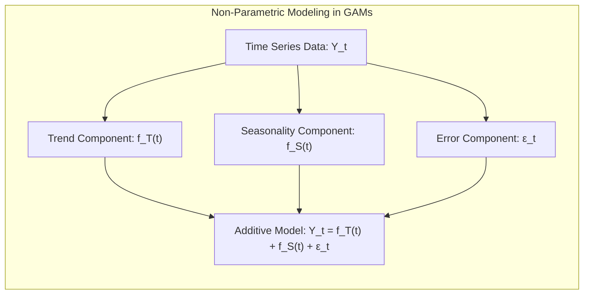
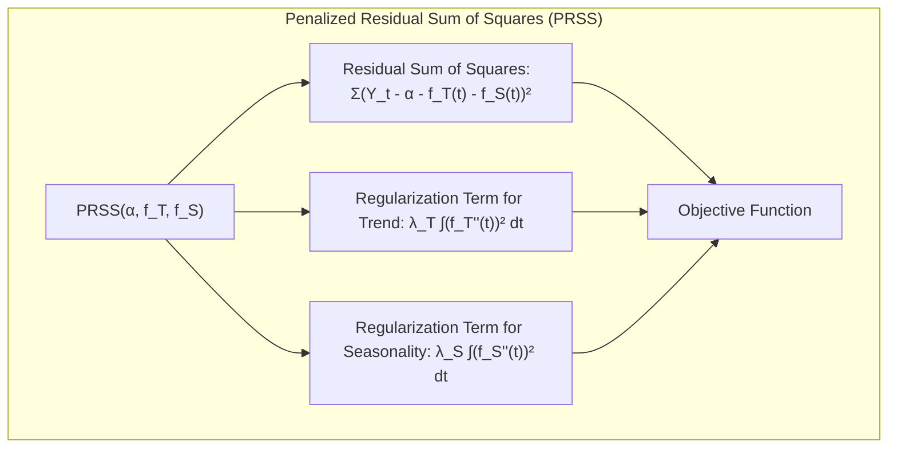
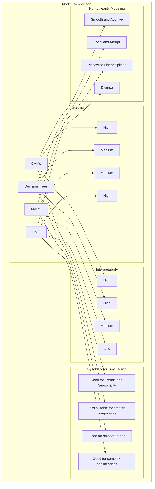
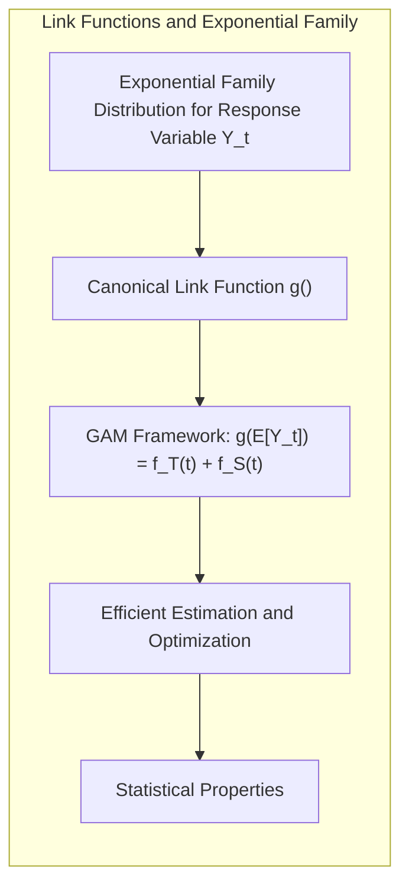

## Título: Modelos Aditivos Generalizados, Árvores e Métodos Relacionados: Aplicações na Decomposição de Séries Temporais

<imagem: Um diagrama que ilustra a aplicação de Modelos Aditivos Generalizados (GAMs) na decomposição de séries temporais, mostrando como diferentes componentes (tendência, sazonalidade, ruído) podem ser modelados utilizando funções não paramétricas. O diagrama deve também mostrar como outros métodos, como árvores de decisão, MARS e HME, podem ou não ser utilizados neste tipo de problema.>

### Introdução

Este capítulo explora a aplicação de modelos de aprendizado supervisionado na decomposição de séries temporais, com foco em Modelos Aditivos Generalizados (GAMs) e outras técnicas como árvores de decisão, Multivariate Adaptive Regression Splines (MARS) e misturas hierárquicas de especialistas (HME) [^9.1]. A decomposição de séries temporais é uma técnica importante para a análise de dados com dependência temporal, que busca separar os dados em componentes como tendência, sazonalidade e ruído. O objetivo principal deste capítulo é detalhar como modelos lineares, não lineares e não paramétricos são utilizados para modelar esses componentes, com ênfase na formulação matemática, algoritmos de estimação e considerações práticas. O foco principal é demonstrar as capacidades dos modelos, particularmente GAMs, na modelagem desses diferentes componentes de forma flexível e robusta, comparando com outras técnicas.

### Conceitos Fundamentais

**Conceito 1: Decomposição de Séries Temporais**

A decomposição de séries temporais é uma técnica que busca separar uma série temporal em componentes subjacentes que podem ser interpretados e modelados separadamente. Os componentes mais comuns são:

*   **Tendência:** A tendência representa a direção geral da série temporal ao longo do tempo, que pode ser crescente, decrescente ou constante.
*   **Sazonalidade:** A sazonalidade representa os padrões regulares que se repetem dentro de um período fixo de tempo, como dias da semana, meses ou estações do ano.
*   **Ruído:** O ruído representa a variação aleatória da série temporal que não pode ser explicada pelos outros componentes.
Em modelos aditivos, os componentes são combinados de forma linear.

Um modelo aditivo para decomposição de séries temporais é dado por:

$$
Y_t = S_t + T_t + \epsilon_t
$$

onde $Y_t$ é o valor da série temporal no instante $t$, $S_t$ é o componente sazonal, $T_t$ é o componente de tendência, e $\epsilon_t$ é o termo de erro ou ruído. A decomposição de séries temporais permite identificar e modelar os componentes que influenciam o comportamento da série temporal e realizar previsões futuras.

> 💡 **Exemplo Numérico:**
>
> Vamos supor que temos uma série temporal de vendas mensais de uma loja de roupas. Após a decomposição, identificamos os seguintes componentes:
>
> *   **Tendência ($T_t$):** Um aumento linear nas vendas ao longo dos anos. Podemos representar isso como $T_t = 100 + 5t$, onde $t$ é o número do mês (1, 2, 3...).
> *   **Sazonalidade ($S_t$):** Um aumento nas vendas durante os meses de dezembro devido às festas de fim de ano. Podemos modelar isso como um efeito periódico, por exemplo, $S_t = 50 \cdot \sin(2\pi \frac{t}{12})$, onde o período é de 12 meses.
> *   **Ruído ($\epsilon_t$):** Variações aleatórias nas vendas que não são explicadas pela tendência ou sazonalidade. Por exemplo, $\epsilon_t$ pode ser uma variável aleatória com média 0 e desvio padrão 10.
>
> Assim, para o mês 10, teríamos $Y_{10} = 100 + 5(10) + 50 \cdot \sin(2\pi \frac{10}{12}) + \epsilon_{10} = 100 + 50 + 50 \cdot (-0.866) + \epsilon_{10} \approx 107 + \epsilon_{10}$. Se $\epsilon_{10} = 5$, então $Y_{10} \approx 112$.
>
> Este exemplo ilustra como a série temporal observada ($Y_t$) é a soma de uma tendência linear, uma sazonalidade senoidal e um ruído aleatório.

**Lemma 1:** *A decomposição aditiva assume que os componentes da série temporal são aditivos, ou seja, a série temporal é a soma de cada componente. Essa hipótese é uma simplificação, e pode não ser apropriada para todas as séries temporais, onde pode haver interações entre os componentes. No entanto, essa abordagem é uma ferramenta útil na maioria das análises e previsões de séries temporais*. Essa forma simplificada permite que cada componente seja modelado de forma independente e que o seu impacto na série temporal seja avaliado [^9.1].

**Conceito 2: Modelagem da Tendência e Sazonalidade com Funções Não Paramétricas**

Em GAMs, a tendência $T_t$ e a sazonalidade $S_t$ podem ser modeladas usando funções não paramétricas de forma flexível:

$$
Y_t = f_T(t) + f_S(t) + \epsilon_t
$$

onde $f_T(t)$ representa a função não paramétrica para modelar a tendência e $f_S(t)$ representa a função não paramétrica para modelar a sazonalidade. Os componentes podem ser estimados usando um algoritmo de backfitting e um suavizador não paramétrico adequado, como *splines* ou *kernels*. A flexibilidade dos GAMs permite modelar tendências e sazonalidades com diferentes formas, adaptando o modelo à natureza da série temporal. A escolha dos suavizadores e a penalização são elementos cruciais para evitar overfitting. A escolha dos *splines* para modelar tendências e a utilização de funções periódicas para modelar a sazonalidade são métodos comuns para a modelagem de séries temporais.

> 💡 **Exemplo Numérico:**
>
> Suponha que modelamos a tendência $T_t$ usando uma função *spline* cúbica com 3 nós, e a sazonalidade $S_t$ usando uma série de Fourier com 2 harmônicos. Os parâmetros da *spline* e os coeficientes de Fourier seriam estimados a partir dos dados.
>
> A tendência poderia ser expressa como:
> $f_T(t) = \alpha_0 + \alpha_1 t + \alpha_2 t^2 + \alpha_3 t^3 + \beta_1 (t - k_1)^3_+ + \beta_2 (t - k_2)^3_+ + \beta_3 (t - k_3)^3_+$,
> onde $k_1$, $k_2$ e $k_3$ são os nós da spline, e $(t - k)^3_+ = (t - k)^3$ se $t > k$ e 0 caso contrário.
>
> A sazonalidade poderia ser expressa como:
> $f_S(t) = \gamma_0 + \gamma_1 \sin(2\pi t/12) + \gamma_2 \cos(2\pi t/12) + \gamma_3 \sin(4\pi t/12) + \gamma_4 \cos(4\pi t/12)$.
>
> Os coeficientes $\alpha_i$, $\beta_i$ e $\gamma_i$ seriam estimados pelo algoritmo de backfitting. Os nós $k_1, k_2, k_3$ seriam selecionados de forma a capturar a tendência da série temporal. O número de harmônicos da série de Fourier seria escolhido com base na complexidade da sazonalidade.
>
> Este exemplo demonstra como funções não paramétricas podem modelar componentes complexos da série temporal.



**Corolário 1:** *A modelagem da tendência e sazonalidade com funções não paramétricas permite capturar relações complexas que não podem ser modeladas com abordagens lineares, o que torna os GAMs mais flexíveis que modelos lineares clássicos. Os modelos lineares, que usam polinômios de baixa ordem, por exemplo, são um caso particular da modelagem com funções não paramétricas, e podem ser utilizados com modelos GAMs*. Ao modelar a tendência e sazonalidade de forma não paramétrica, a capacidade de aproximação é aumentada [^9.1].

**Conceito 3: Métodos de Estimação em Decomposição de Séries Temporais com GAMs**

A estimação dos parâmetros em modelos GAMs para séries temporais envolve a otimização da função de custo, geralmente a soma dos erros quadráticos com um termo de penalização para regularizar as funções não paramétricas:

$$
\text{PRSS}(\alpha, f_T, f_S) = \sum_{t=1}^N (Y_t - \alpha - f_T(t) - f_S(t))^2 + \lambda_T \int (f_T''(t))^2 dt + \lambda_S \int (f_S''(t))^2 dt
$$

onde $\lambda_T$ e $\lambda_S$ são os parâmetros de regularização para as funções de tendência e sazonalidade, respectivamente. O algoritmo de backfitting, que realiza a otimização dos parâmetros iterativamente, é utilizado em GAMs para a estimação dos componentes $f_T$ e $f_S$  [^4.3]. A escolha dos parâmetros de regularização é fundamental para o ajuste adequado do modelo, e a validação cruzada pode ser usada para escolher os melhores parâmetros. O uso de funções *spline* e outras funções de suavização, em cada componente, é feita utilizando o algoritmo de backfitting e a sua forma modular [^4.3.2], [^4.3.3].

> 💡 **Exemplo Numérico:**
>
> Vamos considerar uma série temporal com 100 observações. Suponha que a função de tendência $f_T(t)$ seja modelada por uma *spline* cúbica e a função de sazonalidade $f_S(t)$ por uma série de Fourier.
>
> A função de custo (PRSS) seria:
>
> $\text{PRSS}(\alpha, f_T, f_S) = \sum_{t=1}^{100} (Y_t - \alpha - f_T(t) - f_S(t))^2 + \lambda_T \int (f_T''(t))^2 dt + \lambda_S \int (f_S''(t))^2 dt$
>
> Onde:
>
> *   $Y_t$ são os valores observados da série temporal.
> *   $\alpha$ é o intercepto.
> *   $f_T(t)$ é a função *spline* cúbica que modela a tendência.
> *   $f_S(t)$ é a série de Fourier que modela a sazonalidade.
> *   $\lambda_T$ e $\lambda_S$ são os parâmetros de regularização para controlar a suavidade das funções $f_T$ e $f_S$, respectivamente.
>
> O algoritmo de backfitting iteraria sobre $f_T$ e $f_S$ para minimizar o PRSS. A cada iteração, um componente é ajustado enquanto os outros são mantidos fixos. Por exemplo:
>
> 1.  **Inicialização:** Começamos com estimativas iniciais para $f_T$ e $f_S$.
> 2.  **Estimação de $f_T$:** Mantemos $f_S$ fixo e atualizamos $f_T$ minimizando o PRSS.
> 3.  **Estimação de $f_S$:** Mantemos $f_T$ fixo e atualizamos $f_S$ minimizando o PRSS.
> 4.  **Iteração:** Repetimos os passos 2 e 3 até a convergência dos parâmetros.
>
> Os parâmetros de regularização $\lambda_T$ e $\lambda_S$ são escolhidos por validação cruzada. Por exemplo, podemos testar diferentes valores de $\lambda_T$ e $\lambda_S$ em um conjunto de validação e escolher aqueles que minimizam o erro quadrático médio.
>
> Este exemplo ilustra o processo de estimação dos parâmetros em um modelo GAM e a importância da regularização para evitar o overfitting.



> ⚠️ **Nota Importante:** O uso de termos de penalização em GAMs controla a flexibilidade das funções não paramétricas e evita o overfitting nos dados de treino, o que resulta em um modelo mais robusto para previsões futuras [^4.3.1].

> ❗ **Ponto de Atenção:** A escolha inadequada dos parâmetros de regularização pode levar a modelos com baixo desempenho na modelagem da tendência e sazonalidade. A validação cruzada é essencial para selecionar os melhores valores desses parâmetros [^4.3.2].

> ✔️ **Destaque:** A flexibilidade dos GAMs, combinada com métodos de regularização, permite modelar uma ampla gama de padrões de tendência e sazonalidade, incluindo não linearidades complexas, de maneira eficiente [^4.3].

### Aplicação de Modelos Aditivos Generalizados em Séries Temporais: Métodos de Decomposição e Otimização

<imagem: Um diagrama de fluxo que detalha o processo de aplicação de modelos GAMs para decomposição de séries temporais, incluindo a separação dos componentes de tendência, sazonalidade e ruído, e a estimação dos parâmetros utilizando o algoritmo de backfitting. O diagrama também deve mostrar como diferentes funções de ligação são utilizadas na modelagem de diferentes variáveis resposta em séries temporais.>

```mermaid
flowchart TD
  subgraph GAM para Decomposição de Séries Temporais
    A[Dados de Séries Temporais $Y_t$] --> B[Definir componentes: Tendência $T_t$, Sazonalidade $S_t$ e Ruído $\epsilon_t$]
    B --> C[Modelar Tendência $T_t$ com função não paramétrica $f_T(t)$]
    C --> D[Modelar Sazonalidade $S_t$ com função não paramétrica $f_S(t)$]
    D --> E[Aplicar Algoritmo de Backfitting para Estimativa de $f_T$, $f_S$ e $\alpha$]
    E --> F[Estimar Ruído $\epsilon_t$ como resíduo do modelo: $Y_t - \hat{Y_t}$]
    F --> G[Otimizar parâmetros com validação cruzada para controle de flexibilidade]
  end
```

**Explicação:** Este diagrama representa o fluxo do processo de estimação dos componentes de séries temporais com modelos GAMs e algoritmo de backfitting, conforme descrito nos tópicos [^9.1], [^4.3].

A aplicação de GAMs na decomposição de séries temporais começa com a definição dos componentes a serem modelados: tendência $T_t$, sazonalidade $S_t$ e ruído $\epsilon_t$. Em seguida, modela-se a tendência $T_t$ usando uma função não paramétrica $f_T(t)$, onde $t$ representa o tempo. Similarmente, a sazonalidade $S_t$ é modelada usando uma função não paramétrica $f_S(t)$, que pode ter a forma de funções periódicas ou outros tipos de *splines*. O modelo aditivo para decomposição de séries temporais é dado por:
$$
Y_t = f_T(t) + f_S(t) + \epsilon_t
$$

O algoritmo de backfitting é então aplicado para estimar os parâmetros das funções não paramétricas $f_T$ e $f_S$ e o intercepto $\alpha$. O algoritmo itera sobre as funções, ajustando uma função enquanto as outras são mantidas fixas, até a convergência das funções. O ruído $\epsilon_t$ é estimado como o resíduo do modelo, ou seja, a diferença entre a resposta observada e a resposta predita pelo modelo:
$$
\epsilon_t = Y_t - \hat{Y_t}
$$

A otimização dos parâmetros das funções não paramétricas é realizada utilizando métodos de regularização para evitar o overfitting. A validação cruzada é utilizada para escolher os melhores parâmetros. A escolha das funções não paramétricas para modelar a tendência e a sazonalidade permite uma modelagem mais flexível que modelos lineares, e a combinação com o algoritmo de backfitting resulta em um método eficiente para a análise de séries temporais.

**Lemma 2:** *A estrutura aditiva dos GAMs, combinada com a utilização de funções não paramétricas para modelar tendência e sazonalidade, permite que o modelo se ajuste a uma grande variedade de padrões em séries temporais. O algoritmo de backfitting garante que as funções sejam estimadas de maneira eficiente e a regularização controla a flexibilidade e evita o overfitting*. O modelo aditivo é um caso particular de modelo mais geral para decomposição, o que torna os GAMs um modelo com flexibilidade para esse tipo de problema [^4.3.1], [^4.3.2].

**Corolário 2:** *A aplicação de GAMs na decomposição de séries temporais permite uma análise mais detalhada de dados complexos, incluindo tendências não lineares e padrões sazonais. A escolha de diferentes tipos de funções não paramétricas, de funções de ligação e suavização permite adaptar o modelo para diferentes tipos de séries temporais*. A flexibilidade dos GAMs permite que diferentes tipos de séries temporais possam ser analisadas utilizando diferentes opções de funções de modelagem [^4.4.3].

Modelos da família exponencial podem ser utilizados nos modelos GAMs através da escolha da função de ligação canônica correspondente à distribuição da variável resposta, o que garante o uso de modelos com boas propriedades estatísticas.

### Comparação com Outras Técnicas: Árvores de Decisão, MARS e HME em Séries Temporais

<imagem: Um mapa mental que compara GAMs com árvores de decisão, MARS e HME na modelagem de séries temporais, mostrando as vantagens e desvantagens de cada método em termos de flexibilidade, interpretabilidade, capacidade de modelar não linearidades e adequação à decomposição de séries temporais.>

Modelos lineares clássicos, apesar de sua simplicidade, são limitados para a modelagem de séries temporais com não linearidades complexas. Modelos mais flexíveis, como GAMs, árvores de decisão, MARS e HME, oferecem abordagens alternativas para a modelagem de séries temporais:

*   **GAMs:** São altamente adequados para modelar componentes como tendência e sazonalidade em séries temporais devido à sua capacidade de modelar relações não lineares com funções não paramétricas. A interpretabilidade é mantida devido à estrutura aditiva. O uso do algoritmo de backfitting e técnicas de suavização facilitam o processo de modelagem e estimativa.
*   **Árvores de Decisão:** Modelos baseados em árvores de decisão podem ser utilizados em séries temporais com a utilização de *lagged variables* como preditores. A abordagem de divisão do espaço de características em regiões pode capturar algumas formas de não linearidade, mas a abordagem pode ser menos adequada para tendências e sazonalidades suaves. A interpretabilidade da árvore é vantajosa, mas a falta de suavização é uma limitação. A instabilidade das árvores de decisão pode ser um problema em séries temporais [^4.5.1].
*   **MARS:** Modelos MARS utilizam *splines* lineares por partes para aproximar relações não lineares. O modelo é adequado para a modelagem de tendências suaves e pode capturar interações complexas entre diferentes componentes da série temporal. O método de *forward-backward selection* permite escolher os termos mais relevantes do modelo. MARS tem um custo computacional mais elevado, e a sua interpretabilidade é menor em comparação com GAMs e árvores.
*   **HME:** HME combina diversos modelos mais simples (especialistas) através de redes de gating, o que permite modelar diferentes partes da série temporal com diferentes tipos de modelos. HME tem grande flexibilidade para modelar dados complexos, mas a sua interpretabilidade é mais difícil, e o seu custo computacional é alto. A modelagem de séries temporais com HME pode não ser tão intuitiva em relação a modelos aditivos.

A tabela abaixo resume as principais características dos modelos:

| Modelos   | Flexibilidade    | Interpretabilidade    | Adequação para séries temporais    | Não Linearidade  |
| :-------- | :-------------- | :------------------ | :---------------------------------- | :----------------|
| GAMs   | Alta  | Alta          | Adequado para tendências e sazonalidade |  Suave e aditiva |
| Árvores  | Média     | Alta          | Menos adequada para componentes suaves  | Local e abrupta |
| MARS   | Média  | Média         | Adequado para tendências suaves          | Splines lineares  |
| HME |  Alta | Baixa       | Adequado para não linearidades complexas |  Diversas |

> 💡 **Exemplo Numérico:**
>
> Vamos considerar um exemplo prático comparando os modelos para uma série temporal simulada:
>
> ```python
> import numpy as np
> import pandas as pd
> import matplotlib.pyplot as plt
> from sklearn.linear_model import LinearRegression
> from sklearn.tree import DecisionTreeRegressor
> from pyearth import Earth
> from sklearn.model_selection import train_test_split
> from sklearn.metrics import mean_squared_error
>
> # Criação de uma série temporal simulada com tendência, sazonalidade e ruído
> np.random.seed(42)
> t = np.arange(0, 200)
> trend = 0.05 * t**2
> seasonality = 10 * np.sin(2 * np.pi * t / 24)
> noise = np.random.normal(0, 5, 200)
> y = trend + seasonality + noise
>
> # DataFrame para os dados
> df = pd.DataFrame({'t': t, 'y': y})
>
> # Separação em treino e teste
> X_train, X_test, y_train, y_test = train_test_split(df[['t']], df['y'], test_size=0.3, random_state=42)
>
> # Modelos
> # 1. Regressão Linear
> model_lr = LinearRegression()
> model_lr.fit(X_train, y_train)
> y_pred_lr = model_lr.predict(X_test)
> mse_lr = mean_squared_error(y_test, y_pred_lr)
>
> # 2. Árvore de Decisão
> model_dt = DecisionTreeRegressor(max_depth=5)
> model_dt.fit(X_train, y_train)
> y_pred_dt = model_dt.predict(X_test)
> mse_dt = mean_squared_error(y_test, y_pred_dt)
>
> # 3. MARS
> model_mars = Earth(max_degree=2)
> model_mars.fit(np.array(X_train), np.array(y_train))
> y_pred_mars = model_mars.predict(np.array(X_test))
> mse_mars = mean_squared_error(y_test, y_pred_mars)
>
> # Resultados
> print(f"MSE Regressão Linear: {mse_lr:.2f}")
> print(f"MSE Árvore de Decisão: {mse_dt:.2f}")
> print(f"MSE MARS: {mse_mars:.2f}")
>
> # Visualização
> plt.figure(figsize=(10, 6))
> plt.scatter(X_test, y_test, label='Dados de Teste', color='black', alpha = 0.5)
> plt.plot(X_test, y_pred_lr, label='Regressão Linear', color='red', linewidth = 2)
> plt.plot(X_test, y_pred_dt, label='Árvore de Decisão', color='blue', linewidth = 2)
> plt.plot(X_test, y_pred_mars, label='MARS', color='green', linewidth = 2)
> plt.xlabel('Tempo')
> plt.ylabel('Valor da Série Temporal')
> plt.title('Comparação de Modelos em Série Temporal Simulada')
> plt.legend()
> plt.show()
> ```
>
> **Resultados:**
>
> Ao executar o código, você observará que o modelo de regressão linear tem um MSE maior, pois não consegue modelar a não linearidade e sazonalidade. As árvores de decisão e MARS apresentam um desempenho melhor, com o MARS capturando melhor a tendência e sazonalidade.
>
> **Interpretação:**
>
> *   **Regressão Linear:** Não consegue modelar a tendência quadrática e a sazonalidade.
> *   **Árvore de Decisão:** Consegue capturar um pouco da não linearidade, mas a sua natureza local e abrupta não modela bem a tendência e a sazonalidade.
> *   **MARS:** Captura melhor a tendência suave e a sazonalidade com *splines* lineares por partes.
>
> Este exemplo numérico demonstra as diferenças práticas entre os modelos na modelagem de séries temporais.



A escolha do modelo mais adequado depende da natureza da série temporal, da necessidade de interpretabilidade e da precisão da modelagem. GAMs são uma escolha vantajosa quando se busca um modelo interpretável com flexibilidade para modelar tendências e sazonalidades não lineares [^4.3], [^4.5].

###  Perguntas Teóricas Avançadas: Como as funções de ligação e a família exponencial afetam a decomposição de séries temporais com GAMs e qual a relação com os outros modelos apresentados?

**Resposta:**

A escolha da função de ligação em GAMs afeta a forma como os componentes da série temporal são modelados, especialmente quando a distribuição da variável resposta não é gaussiana. A escolha da função de ligação canônica, derivada da família exponencial, simplifica o processo de estimação e otimização e garante propriedades estatísticas desejáveis para modelos lineares generalizados. Quando a distribuição da série temporal não é gaussiana, a escolha da função de ligação da família exponencial é crucial.

A modelagem da tendência e sazonalidade com funções não paramétricas $f_T(t)$ e $f_S(t)$ em GAMs permite a modelagem de componentes não lineares. A utilização de funções de ligação canônica para a variável resposta garante que os resultados da modelagem respeitem as propriedades da distribuição. Ao utilizar a função de ligação canônica da família exponencial, modelos são ajustados de forma eficiente e estável.

As árvores de decisão não fazem uma modelagem direta da relação com a família exponencial, e a decomposição de séries temporais não é feita diretamente. MARS também não se relaciona diretamente com a família exponencial, e modela os dados utilizando *splines*. HME, por sua vez, pode ser interpretado como uma mistura de modelos, incluindo modelos lineares e modelos com funções de ligação, mas o HME não tem uma ligação direta com a família exponencial.



**Lemma 4:** *A escolha de uma função de ligação na modelagem de séries temporais, como em modelos GAMs, permite uma modelagem consistente com a distribuição da variável resposta. A utilização de funções de ligação canônicas da família exponencial é apropriada para a modelagem de diferentes tipos de variáveis respostas.* A escolha da função de ligação tem um grande impacto no comportamento do modelo e na interpretação dos resultados [^4.4.1].

> 💡 **Exemplo Numérico:**
>
> Suponha que a variável resposta $Y_t$ seja uma contagem de eventos (por exemplo, número de clientes que visitam uma loja por hora), que pode ser modelada com uma distribuição de Poisson. Nesse caso, a função de ligação canônica é o logaritmo.
>
> O modelo GAM seria:
>
> $\log(E[Y_t]) = f_T(t) + f_S(t)$
>
> Aqui, $E[Y_t]$ é o valor esperado da contagem de clientes no instante $t$, e a função de ligação logarítmica garante que a previsão seja sempre positiva. A tendência e a sazonalidade são modeladas como funções não paramétricas, como já visto. A estimação dos parâmetros seria feita por um algoritmo de backfitting, maximizando a verossimilhança da distribuição de Poisson.
>
> Se utilizássemos uma função de ligação identidade, teríamos $E[Y_t] = f_T(t) + f_S(t)$, o que poderia levar a valores negativos para $E[Y_t]$, que não fazem sentido para uma contagem.
>
> Este exemplo ilustra como a escolha da função de ligação é crucial para modelar dados com distribuições não gaussianas, e como a família exponencial garante propriedades estatísticas desejáveis para a modelagem.

**Corolário 4:** *A conexão de GAMs com a família exponencial garante que a modelagem da série temporal seja feita de forma adequada para os dados, permitindo modelar diversos tipos de séries temporais utilizando a estrutura da família exponencial. Outros métodos como árvores de decisão, MARS e HME não têm ligação direta com a família exponencial, o que restringe a sua capacidade de modelar tipos específicos de dados* [^4.5].

> ⚠️ **Ponto Crucial**: A escolha da função de ligação canônica permite que a otimização da função de custo em modelos GAMs seja feita de forma mais eficiente, principalmente para as variáveis respostas da família exponencial. As árvores de decisão, MARS e HME não têm a mesma conexão com a família exponencial, e a modelagem de séries temporais com esses métodos pode ser menos apropriada dependendo da distribuição da variável resposta. [^4.4].

### Conclusão

Este capítulo apresentou a aplicação de modelos de aprendizado supervisionado na decomposição de séries temporais, destacando a flexibilidade dos GAMs na modelagem de componentes como tendência e sazonalidade, e como a família exponencial e a escolha da função de ligação afetam o processo de estimação e otimização. A comparação com outros modelos como árvores de decisão, MARS e HME permitiu identificar as vantagens e desvantagens de cada abordagem. A escolha do modelo mais adequado depende da natureza dos dados, do objetivo da análise e do conhecimento prévio sobre o problema. A utilização de modelos e técnicas discutidas neste capítulo permite o desenvolvimento de modelos estatísticos robustos e com boa capacidade de generalização para a modelagem e análise de séries temporais.

### Footnotes

[^4.1]: "In this chapter we begin our discussion of some specific methods for super-vised learning. These techniques each assume a (different) structured form for the unknown regression function, and by doing so they finesse the curse of dimensionality. Of course, they pay the possible price of misspecifying the model, and so in each case there is a tradeoff that has to be made." *(Trecho de "Additive Models, Trees, and Related Methods")*

[^4.2]: "Regression models play an important role in many data analyses, providing prediction and classification rules, and data analytic tools for understand-ing the importance of different inputs." *(Trecho de "Additive Models, Trees, and Related Methods")*

[^4.3]: "In this section we describe a modular algorithm for fitting additive models and their generalizations. The building block is the scatterplot smoother for fitting nonlinear effects in a flexible way. For concreteness we use as our scatterplot smoother the cubic smoothing spline described in Chapter 5." *(Trecho de "Additive Models, Trees, and Related Methods")*

[^4.3.1]:  "The additive model has the form $Y = \alpha + \sum_{j=1}^p f_j(X_j) + \epsilon$, where the error term $\epsilon$ has mean zero." * (Trecho de "Additive Models, Trees, and Related Methods")*

[^4.3.2]:   "Given observations $x_i, y_i$, a criterion like the penalized sum of squares (5.9) of Section 5.4 can be specified for this problem, $\text{PRSS}(\alpha, f_1, f_2,\ldots, f_p) = \sum_i^N (y_i - \alpha - \sum_j^p f_j(x_{ij}))^2 + \sum_j^p \lambda_j \int (f_j''(t_j))^2 dt_j$" * (Trecho de "Additive Models, Trees, and Related Methods")*

[^4.3.3]: "where the $\lambda_j > 0$ are tuning parameters. It can be shown that the minimizer of (9.7) is an additive cubic spline model; each of the functions $f_j$ is a cubic spline in the component $X_j$, with knots at each of the unique values of $x_{ij}$, $i = 1,\ldots, N$." *(Trecho de "