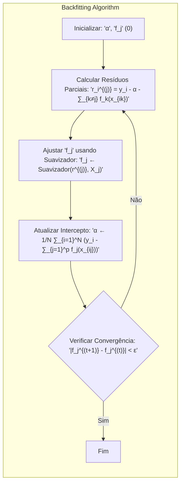
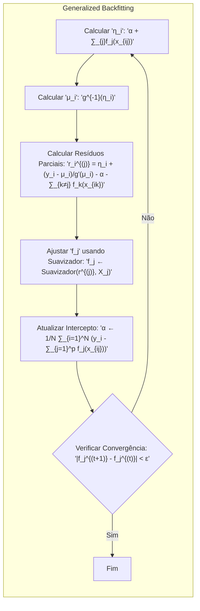
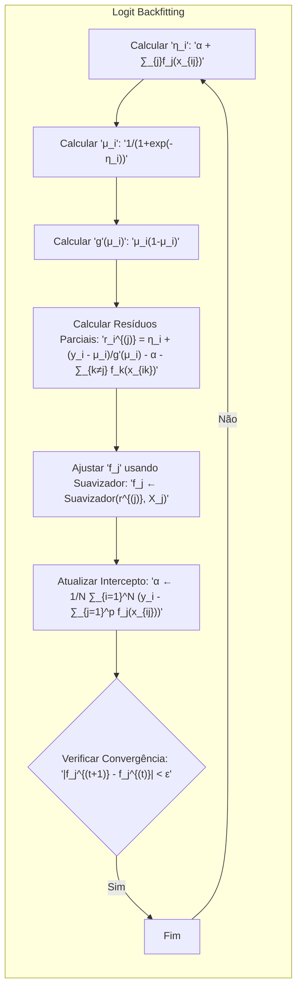
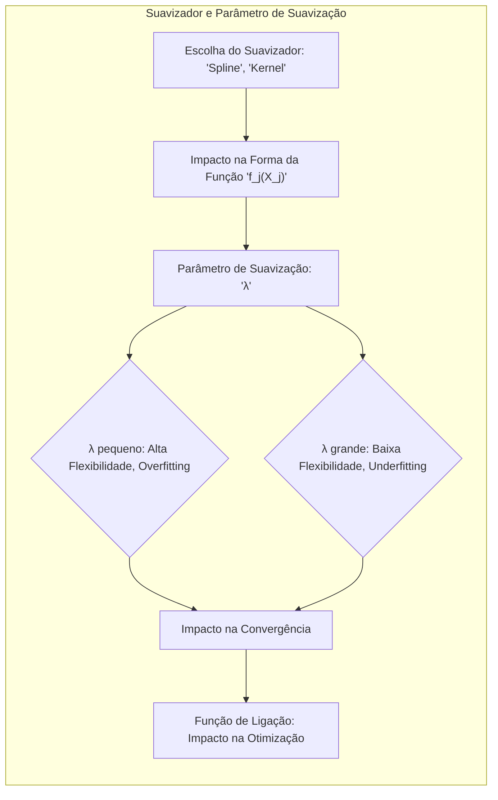

## Título: Modelos Aditivos Generalizados, Árvores e Métodos Relacionados: O Algoritmo de Backfitting em Detalhe



### Introdução

Este capítulo explora em detalhes o algoritmo de backfitting, um método iterativo fundamental para o ajuste de modelos aditivos, particularmente Modelos Aditivos Generalizados (GAMs) [^9.1]. O backfitting é uma técnica modular que permite estimar as funções não paramétricas de cada preditor em um modelo aditivo de forma sequencial e iterativa. O capítulo se aprofunda na formulação matemática do algoritmo, na sua relação com a família exponencial e nas suas implicações práticas. Além disso, o capítulo explora a convergência, a estabilidade e as limitações do algoritmo, assim como a sua aplicação em diferentes tipos de dados. O objetivo principal é oferecer uma compreensão profunda sobre o funcionamento do algoritmo de backfitting e como ele permite o ajuste de modelos aditivos de forma eficiente e eficaz.

### Conceitos Fundamentais

**Conceito 1: A Estrutura Aditiva e a Necessidade de Backfitting**

Modelos aditivos, como os GAMs, modelam a relação entre a variável resposta e os preditores através de uma soma de funções não paramétricas de cada preditor individualmente, de acordo com a equação:

$$
g(\mu(X)) = \alpha + f_1(X_1) + f_2(X_2) + \ldots + f_p(X_p)
$$

onde $g$ é a função de ligação, $\mu(X)$ é a média da resposta, $\alpha$ é o intercepto, e $f_j(X_j)$ são as funções não paramétricas de cada preditor $X_j$. A estrutura aditiva permite que cada preditor seja modelado individualmente e a não linearidade seja incorporada de forma flexível. No entanto, devido à natureza não paramétrica das funções $f_j$, o ajuste simultâneo de todas as funções pode ser difícil ou computacionalmente inviável. O algoritmo de backfitting surge como uma alternativa para estimar iterativamente cada função enquanto mantém as outras fixas. A necessidade de um algoritmo iterativo como o backfitting surge devido a natureza não paramétrica das funções $f_j$ e devido à dependência entre as estimativas das diferentes funções.

**Lemma 1:** *A estrutura aditiva dos modelos GAMs, embora seja vantajosa em termos de interpretabilidade, torna difícil a estimativa simultânea de todas as funções não paramétricas. O backfitting permite estimar cada função individualmente, iterando através de cada preditor até a convergência das funções.* A modularidade do algoritmo de backfitting permite ajustar os modelos GAMs de maneira eficiente e flexível [^4.3].

**Conceito 2: O Algoritmo de Backfitting**

O algoritmo de backfitting é um procedimento iterativo que estima as funções $f_j(X_j)$ de forma sequencial.  O algoritmo começa com estimativas iniciais das funções $f_j$, geralmente iguais a zero. Em cada iteração, o algoritmo executa os seguintes passos:

1.  **Resíduos Parciais:** Para um dado preditor $X_j$, calcula os resíduos parciais:
    $$
    r_i^{(j)} = y_i - \alpha - \sum_{k \ne j} f_k(x_{ik})
    $$
    onde $y_i$ é a observação da variável resposta e $f_k(x_{ik})$ são as estimativas correntes das outras funções não paramétricas.
2.  **Ajuste da Função:** Ajusta a função não paramétrica $f_j$ aos resíduos parciais utilizando um suavizador adequado. A função $f_j$ é então atualizada utilizando:
    $$
     f_j \leftarrow \text{Suavizador}(r^{(j)}, X_j)
    $$
    O suavizador pode ser um *spline*, um *kernel* ou outros métodos de suavização.
3.  **Atualização do Intercepto:** Atualiza o intercepto $\alpha$ de acordo com as novas funções estimadas:
    $$
    \alpha \leftarrow \frac{1}{N} \sum_{i=1}^N (y_i - \sum_{j=1}^p f_j(x_{ij}))
    $$

4.  **Iteração:** Repete os passos 1-3 para cada preditor $X_j$ até que as funções $f_j$ convirjam. A convergência é geralmente definida como a estabilidade das funções $f_j$, ou seja, as alterações entre iterações consecutivas são menores que um limiar especificado.

O algoritmo de backfitting é um método modular e flexível que pode ser adaptado para diferentes tipos de modelos aditivos e diferentes tipos de suavizadores.

> 💡 **Exemplo Numérico:**
>
> Vamos considerar um exemplo simples com dois preditores ($X_1$ e $X_2$) e uma variável resposta $y$. Suponha que temos 5 observações:
>
> | i | $X_{i1}$ | $X_{i2}$ | $y_i$ |
> |---|---|---|---|
> | 1 | 1 | 2 | 5 |
> | 2 | 2 | 3 | 8 |
> | 3 | 3 | 1 | 6 |
> | 4 | 4 | 4 | 12 |
> | 5 | 5 | 2 | 9 |
>
> Inicializamos $\alpha = 0$, $f_1(X_1) = 0$ e $f_2(X_2) = 0$.
>
> **Iteração 1:**
>
> *   **Para $X_1$ (j=1):**
>     *   Resíduos parciais: $r_i^{(1)} = y_i - \alpha - f_2(X_{i2})$. Como $f_2(X_2)$ é 0, $r_i^{(1)} = y_i$.
>         *   $r^{(1)} = [5, 8, 6, 12, 9]$
>     *   Ajustamos $f_1$ usando um suavizador (por simplicidade, vamos supor que o suavizador é uma média local): $f_1(X_1) = [1, 2, 3, 4, 5]$.
> *   **Para $X_2$ (j=2):**
>     *   Resíduos parciais: $r_i^{(2)} = y_i - \alpha - f_1(X_{i1})$.
>         *   $r^{(2)} = [5-1, 8-2, 6-3, 12-4, 9-5] = [4, 6, 3, 8, 4]$
>     *   Ajustamos $f_2$ usando um suavizador (média local): $f_2(X_2) = [2, 3, 1, 4, 2]$.
> *   **Atualização do intercepto:** $\alpha = \frac{1}{5} \sum_{i=1}^5 (y_i - f_1(x_{i1}) - f_2(x_{i2})) = \frac{1}{5} [(5-1-2) + (8-2-3) + (6-3-1) + (12-4-4) + (9-5-2)] = \frac{1}{5} [2+3+2+4+2] = 2.6$
>
> **Iteração 2:**
>
> *   **Para $X_1$ (j=1):**
>     *   Resíduos parciais: $r_i^{(1)} = y_i - \alpha - f_2(X_{i2})$.
>         *   $r^{(1)} = [5-2.6-2, 8-2.6-3, 6-2.6-1, 12-2.6-4, 9-2.6-2] = [0.4, 2.4, 2.4, 5.4, 4.4]$
>    * Ajustamos $f_1$ usando um suavizador (média local): $f_1(X_1) = [0.4, 2.4, 2.4, 5.4, 4.4]$
>
> *   **Para $X_2$ (j=2):**
>     *   Resíduos parciais: $r_i^{(2)} = y_i - \alpha - f_1(X_{i1})$.
>         *   $r^{(2)} = [5-2.6-0.4, 8-2.6-2.4, 6-2.6-2.4, 12-2.6-5.4, 9-2.6-4.4] = [2, 3, 1, 4, 2]$
>    * Ajustamos $f_2$ usando um suavizador (média local): $f_2(X_2) = [2, 3, 1, 4, 2]$
> *   **Atualização do intercepto:** $\alpha = \frac{1}{5} \sum_{i=1}^5 (y_i - f_1(x_{i1}) - f_2(x_{i2})) = \frac{1}{5} [(5-0.4-2) + (8-2.4-3) + (6-2.4-1) + (12-5.4-4) + (9-4.4-2)] =  \frac{1}{5} [2.6 + 2.6 + 2.6 + 2.6 + 2.6] = 2.6$
>
> O algoritmo continua iterando até a convergência, ou seja, quando as funções $f_1$ e $f_2$ e o intercepto $\alpha$ não mudam significativamente entre iterações. Este exemplo simplificado ilustra como o backfitting ajusta iterativamente as funções não paramétricas.

**Corolário 1:** *O algoritmo de backfitting, ao iterar sobre cada função não paramétrica e usar o conceito de resíduos parciais, permite modelar cada preditor de forma individualizada e iterativa, e encontrar os parâmetros que minimizam a função de custo*.  A abordagem iterativa do backfitting é uma solução eficiente para a otimização de modelos aditivos [^4.3.1].

**Conceito 3: A Função de Ligação e o Backfitting em Modelos Generalizados**

Quando a variável resposta não é gaussiana, o algoritmo de backfitting pode ser adaptado para acomodar uma função de ligação $g$.  O modelo generalizado aditivo tem a forma:

$$
g(\mu(X)) = \alpha + f_1(X_1) + f_2(X_2) + \ldots + f_p(X_p)
$$

O algoritmo de backfitting é adaptado através da atualização dos resíduos parciais e do método de suavização. O passo de cálculo dos resíduos parciais é dado por:
$$
r_i^{(j)} = \eta_i + \frac{y_i - \mu_i}{g'(\mu_i)} - \alpha -  \sum_{k \ne j} f_k(x_{ik})
$$

Onde:
$\eta_i = \alpha + \sum_{j}f_j(x_{ij})$ é a estimativa corrente da combinação linear dos preditores, $\mu_i$ é a média da variável resposta e $g'$ é a derivada da função de ligação em relação à média.

O algoritmo de backfitting em modelos generalizados usa os resíduos parciais ajustados pela função de ligação e seus derivadas para estimar as funções $f_j$.



> ⚠️ **Nota Importante:** O uso de funções de ligação no backfitting permite que o algoritmo seja utilizado em modelos generalizados aditivos, onde as respostas podem não ter distribuição normal e a modelagem da resposta utiliza modelos da família exponencial [^4.4.3].

> ❗ **Ponto de Atenção:** A convergência do backfitting pode ser afetada pela escolha da função de ligação e do método de suavização, e modelos muito flexíveis podem ter convergência mais lenta e menor estabilidade dos resultados [^4.3].

> ✔️ **Destaque:** A combinação do algoritmo de backfitting com funções de ligação e métodos de suavização permite um ajuste flexível e eficiente dos Modelos Aditivos Generalizados (GAMs) a diferentes tipos de dados e distribuições [^4.4.1].

### Algoritmo de Backfitting em Detalhe: Passos Iterativos, Formulação e Convergência

```mermaid
flowchart TD
    subgraph "Backfitting Algorithm Steps"
        direction TB
        A[Inicialização: "Inicializar α e f_j(X_j)"] --> B[Cálculo Resíduos Parciais: "r_i^(j) = y_i - α - Σ_{k≠j} f_k(x_{ik})"]
        B --> C[Ajuste de f_j(X_j): "f_j ← Suavizador(r^(j), X_j)"]
         C --> D[Atualização de Intercepto: "α ← 1/N Σ_{i=1}^N (y_i - Σ_{j=1}^p f_j(x_{ij}))"]
        D --> E[Verificação de Convergência: "||f_j^(t+1) - f_j^(t)|| < ε?"]
        E -- "Sim" --> F[Fim]
        E -- "Não" --> B
    end
```

**Explicação:** Este diagrama detalha os passos iterativos do algoritmo de backfitting, conforme descrito nos tópicos [^4.3], [^4.3.1], [^4.3.2].

O algoritmo de backfitting é um processo iterativo que busca estimar as funções não paramétricas de cada preditor de forma sequencial.  O algoritmo começa com a inicialização dos parâmetros, onde cada função é inicializada com zero e um intercepto $\alpha$ inicial. Em cada iteração $t$, o algoritmo executa os seguintes passos para cada preditor $X_j$:

1.  **Cálculo dos resíduos parciais:** Para um dado preditor $X_j$, os resíduos parciais são calculados através da equação:
    $$
    r_i^{(j)} = y_i - \alpha - \sum_{k \ne j} f_k(x_{ik})
    $$

    onde $y_i$ é o valor da variável resposta, $\alpha$ é o intercepto atual e $f_k(x_{ik})$ são os valores da função não paramétrica estimados na iteração anterior para os outros preditores.
2.   **Ajuste da função não paramétrica:** A função $f_j$ é estimada utilizando um suavizador apropriado, como um *spline*, utilizando os resíduos parciais como variável resposta e o preditor $X_j$ como variável preditora. A função $f_j$ é então atualizada:
     $$
    f_j \leftarrow \text{Suavizador}(r^{(j)}, X_j)
     $$
3.  **Atualização do intercepto:** O intercepto $\alpha$ é atualizado utilizando a equação:
    $$
    \alpha \leftarrow \frac{1}{N} \sum_{i=1}^N (y_i - \sum_{j=1}^p f_j(x_{ij}))
    $$

A convergência é verificada comparando a diferença entre as estimativas da função $f_j$ nas iterações consecutivas e um limiar $\epsilon$. O algoritmo é repetido até que todas as funções $f_j$ convirjam. Este processo garante que cada componente seja estimado e que a função de custo seja minimizada. A escolha dos suavizadores é uma parte crucial do algoritmo e depende do tipo de dados e do problema em questão. O algoritmo de backfitting é essencial para estimar os parâmetros dos modelos aditivos de forma modular e eficiente.

> 💡 **Exemplo Numérico:**
>
> Continuando o exemplo anterior, vamos detalhar o uso do suavizador. Suponha que, após a primeira iteração, ao ajustar $f_1$ aos resíduos parciais $r^{(1)} = [5, 8, 6, 12, 9]$, usamos um suavizador spline com um parâmetro de suavização que resulta na seguinte função:
>
> $f_1(X_1) = [1.5, 2.8, 3.5, 4.7, 5.2]$
>
> De forma semelhante, ao ajustar $f_2$ aos resíduos parciais $r^{(2)} = [4, 6, 3, 8, 4]$, o suavizador spline resulta em:
>
> $f_2(X_2) = [2.2, 3.1, 1.8, 4.1, 2.5]$
>
> Após a atualização do intercepto $\alpha = 2.6$, os resíduos parciais para a segunda iteração (para $X_1$) serão:
>
> $r_i^{(1)} = y_i - \alpha - f_2(X_{i2})$
>
> $r^{(1)} = [5 - 2.6 - 2.2, 8 - 2.6 - 3.1, 6 - 2.6 - 1.8, 12 - 2.6 - 4.1, 9 - 2.6 - 2.5] = [0.2, 2.3, 1.6, 5.3, 3.9]$
>
> Estes novos resíduos parciais serão usados para ajustar a função $f_1$ na segunda iteração, e assim por diante, até a convergência. O suavizador spline ajusta a função não paramétrica, considerando a suavidade e o ajuste aos dados, usando o parâmetro de suavização.

**Lemma 3:** *Sob certas condições, o algoritmo de backfitting converge para a solução de mínimos quadrados para modelos lineares, e para um ponto de máxima verossimilhança para modelos da família exponencial, mesmo que esta convergência não seja garantida para todos os tipos de modelos. A convergência depende da estrutura aditiva, da escolha das funções e da escolha dos parâmetros de suavização, bem como da magnitude da correlação entre preditores*. A convergência do algoritmo garante que um ajuste adequado dos modelos aditivos e GAMs seja alcançado [^4.3].

### Estabilidade e Limitações do Algoritmo de Backfitting

A estabilidade do algoritmo de backfitting pode ser afetada pela correlação entre os preditores. Quando os preditores são altamente correlacionados, o ajuste de uma função $f_j$ pode ter um impacto significativo nas estimativas das outras funções, o que pode dificultar a convergência do algoritmo. A escolha do método de suavização também pode influenciar a estabilidade e a convergência do algoritmo. Métodos de suavização mais flexíveis podem levar a resultados mais variáveis e modelos com maior risco de overfitting. A regularização, através de um parâmetro de ajuste do suavizador, é importante para garantir a estabilidade e a convergência do algoritmo e para evitar o sobreajuste dos dados. Outras abordagens podem ser usadas para mitigar as limitações do algoritmo, como utilizar métodos de regularização e suavização mais robustos ou reduzir o número de preditores correlacionados, o que pode melhorar a estabilidade dos resultados.

A principal limitação do algoritmo de backfitting é sua natureza iterativa, o que pode torná-lo mais lento do que métodos diretos para modelos lineares. A natureza iterativa também faz com que o resultado final da estimação possa ser influenciado pela inicialização dos parâmetros e pela ordem em que os preditores são processados. No entanto, o backfitting é um método eficiente e amplamente utilizado para a modelagem de modelos aditivos, o que justifica a sua utilização mesmo nos cenários onde suas limitações são evidentes.

### Otimização em Modelos com Família Exponencial e o Algoritmo de Backfitting

O algoritmo de backfitting pode ser adaptado para acomodar modelos da família exponencial através da utilização de funções de ligação canônicas, e da substituição do método de mínimos quadrados por métodos de otimização da verossimilhança. No caso da regressão logística, a cada passo do algoritmo, é utilizada a função *logit* como função de ligação e uma aproximação iterativa da máxima verossimilhança para estimar as funções $f_j$.  Para outros modelos da família exponencial, o método de suavização e o cálculo dos resíduos parciais são adaptados para cada distribuição. A função de *log-likelihood* é utilizada para avaliar a qualidade do modelo e sua convergência. A utilização das funções de ligação canônicas simplifica o processo de otimização e garante propriedades estatísticas desejáveis para os estimadores, uma vez que as funções de ligação canônicas estão diretamente relacionadas com o parâmetro canônico da família exponencial.

> 💡 **Exemplo Numérico:**
>
> Vamos considerar um exemplo de regressão logística aditiva, onde a variável resposta $y_i$ é binária (0 ou 1), e temos dois preditores $X_1$ e $X_2$. A função de ligação é a logit:
>
> $\text{logit}(\mu_i) = \log\left(\frac{\mu_i}{1-\mu_i}\right) = \alpha + f_1(X_{i1}) + f_2(X_{i2})$
>
> Onde $\mu_i$ é a probabilidade de $y_i = 1$.
>
> Inicializamos $\alpha = 0$, $f_1(X_1) = 0$, e $f_2(X_2) = 0$.
>
> **Iteração 1:**
>
> *   **Para $X_1$ (j=1):**
>     *   Calculamos $\eta_i = \alpha + f_1(X_{i1}) + f_2(X_{i2})$. Inicialmente $\eta_i = 0$.
>     *   Calculamos $\mu_i = \frac{1}{1+e^{-\eta_i}}$. Inicialmente $\mu_i = 0.5$.
>     *   Calculamos os resíduos parciais: $r_i^{(1)} = \eta_i + \frac{y_i - \mu_i}{g'(\mu_i)} - \alpha - \sum_{k \ne j} f_k(x_{ik})$, onde $g'(\mu_i) = \mu_i(1-\mu_i)$.
>     *   Ajustamos $f_1(X_1)$ usando um suavizador aos resíduos parciais.
> *   **Para $X_2$ (j=2):**
>     *   Calculamos $\eta_i$ e $\mu_i$ com as novas estimativas de $f_1$.
>     *   Calculamos os resíduos parciais: $r_i^{(2)} = \eta_i + \frac{y_i - \mu_i}{g'(\mu_i)} - \alpha - \sum_{k \ne j} f_k(x_{ik})$.
>     *   Ajustamos $f_2(X_2)$ usando um suavizador aos resíduos parciais.
>
> *   **Atualização do intercepto:** $\alpha = \frac{1}{N} \sum_{i=1}^N (y_i - \sum_{j=1}^p f_j(x_{ij}))$
>
> Este processo é iterado até a convergência. A diferença principal para o caso gaussiano é o cálculo dos resíduos parciais, que envolve a função de ligação e sua derivada, e a utilização da função de log-verossimilhança para avaliar o ajuste do modelo.



### Pergunta Teórica Avançada: Como a escolha do suavizador e do parâmetro de suavização afetam a convergência e a flexibilidade do algoritmo de backfitting e a relação com a função de ligação?

**Resposta:**

A escolha do suavizador e do parâmetro de suavização afetam significativamente a convergência e a flexibilidade do algoritmo de backfitting. A relação com a função de ligação também é importante, pois esta determina como os parâmetros são estimados e otimizados, assim como a influência do suavizador.

A escolha do suavizador determina a forma das funções não paramétricas $f_j(X_j)$ e a sua capacidade de ajuste. *Splines*, por exemplo, são capazes de modelar não linearidades suaves e contínuas, enquanto *kernels* podem ser mais apropriados para modelar relações locais.  Suavizadores mais flexíveis podem modelar relações mais complexas, mas podem levar a modelos com menor estabilidade e maior risco de overfitting, o que afeta a convergência do algoritmo.

O parâmetro de suavização controla a complexidade das funções $f_j(X_j)$ e, portanto, a flexibilidade do modelo. Um parâmetro de suavização muito pequeno permite que as funções sejam muito flexíveis e se ajustem ao ruído nos dados, enquanto um parâmetro de suavização muito grande leva a modelos com baixo ajuste e alta bias. O parâmetro de suavização deve ser escolhido com cuidado e, geralmente, por métodos de validação cruzada. A escolha inadequada do parâmetro de suavização pode levar a modelos com baixa qualidade e com pouca capacidade de generalização.

A função de ligação canônica também influencia a escolha do parâmetro de suavização. A escolha da função de ligação canônica, quando a variável resposta é da família exponencial, facilita o processo de estimação dos parâmetros e da escolha do suavizador, bem como a otimização do modelo, pois a função de ligação transforma os valores preditos para um espaço adequado à otimização. A utilização da função de ligação canônica também garante a convergência do algoritmo em muitos casos.

> 💡 **Exemplo Numérico:**
>
> Para ilustrar o efeito do parâmetro de suavização, vamos supor que estamos ajustando um GAM com um preditor $X$ e uma resposta $y$. Utilizamos um suavizador spline com dois parâmetros de suavização diferentes: $\lambda_1$ (pequeno) e $\lambda_2$ (grande).
>
> *   **$\lambda_1$ (pequeno):** Com um $\lambda_1$ pequeno, o suavizador spline será muito flexível e se ajustará bem aos dados, incluindo o ruído. Isso pode resultar em overfitting, onde o modelo se ajusta bem aos dados de treinamento, mas tem um desempenho ruim em novos dados. A função $f(X)$ pode apresentar muitas oscilações.
>
> *   **$\lambda_2$ (grande):** Com um $\lambda_2$ grande, o suavizador spline será menos flexível e tenderá a produzir uma função $f(X)$ mais suave e linear. Isso pode resultar em underfitting, onde o modelo não captura a verdadeira relação entre $X$ e $y$.
>
> A escolha ideal do parâmetro de suavização é um balanço entre ajuste e suavidade. Métodos como validação cruzada são usados para encontrar um parâmetro de suavização que minimize o erro de generalização. A escolha também depende da função de ligação utilizada, que afeta como o suavizador se comporta no processo de otimização.



**Lemma 4:** *A escolha do suavizador e do parâmetro de suavização, juntamente com a função de ligação, afeta diretamente a convergência e a flexibilidade do algoritmo de backfitting. A convergência do algoritmo depende do balanço entre a suavidade das funções, a escolha do suavizador e a utilização de funções de ligação apropriadas. Um parâmetro de suavização muito pequeno pode levar a overfit, enquanto um parâmetro muito grande pode levar a modelos muito simples* [^4.3.3].

**Corolário 4:** *A escolha do suavizador e do parâmetro de suavização são componentes cruciais na aplicação do backfitting, e devem ser selecionados com cuidado para balancear a flexibilidade e a estabilidade do modelo. A função de ligação da família exponencial deve ser selecionada considerando a natureza da distribuição da variável resposta, e deve ser combinada com a escolha do suavizador e do parâmetro de suavização para a obter modelos com melhor qualidade* [^4.4.2], [^4.4.4].

> ⚠️ **Ponto Crucial**: A escolha do suavizador, do parâmetro de suavização e da função de ligação devem ser feitas em conjunto e com base na natureza dos dados, no objetivo do modelo e no conhecimento prévio sobre a estrutura dos dados. A utilização de métodos de validação cruzada é importante para a escolha dos melhores parâmetros [^4.3.1].

### Conclusão

Este capítulo apresentou em detalhes o algoritmo de backfitting, um método iterativo utilizado para o ajuste de modelos aditivos, particularmente GAMs. A formulação matemática do algoritmo, suas propriedades de convergência e estabilidade e como ele pode ser utilizado em combinação com diferentes métodos de estimação, incluindo mínimos quadrados e máxima verossimilhança, para diferentes distribuições, foram detalhadas. A relação com a escolha dos suavizadores, da função de ligação e do parâmetro de regularização, foram analisadas e apresentadas. O algoritmo de backfitting é um componente chave em modelos aditivos e modelos mais complexos que generalizam o conceito de modelos lineares. O entendimento do funcionamento do algoritmo de backfitting é crucial para a aplicação e desenvolvimento de modelos estatísticos com flexibilidade e robustez.

### Footnotes

[^4.1]: "In this chapter we begin our discussion of some specific methods for super-vised learning. These techniques each assume a (different) structured form for the unknown regression function, and by doing so they finesse the curse of dimensionality. Of course, they pay the possible price of misspecifying the model, and so in each case there is a tradeoff that has to be made." *(Trecho de "Additive Models, Trees, and Related Methods")*

[^4.2]: "Regression models play an important role in many data analyses, providing prediction and classification rules, and data analytic tools for understand-ing the importance of different inputs." *(Trecho de "Additive Models, Trees, and Related Methods")*

[^4.3]: "In this section we describe a modular algorithm for fitting additive models and their generalizations. The building block is the scatterplot smoother for fitting nonlinear effects in a flexible way. For concreteness we use as our scatterplot smoother the cubic smoothing spline described in Chapter 5." *(Trecho de "Additive Models, Trees, and Related Methods")*

[^4.3.1]:  "The additive model has the form $Y = \alpha + \sum_{j=1}^p f_j(X_j) + \varepsilon$, where the error term $\varepsilon$ has mean zero." * (Trecho de "Additive Models, Trees, and Related Methods")*

[^4.3.2]:   "Given observations $x_i, y_i$, a criterion like the penalized sum of squares (5.9) of Section 5.4 can be specified for this problem, $PRSS(\alpha, f_1, f_2,\ldots, f_p) = \sum_i^N (y_i - \alpha - \sum_j^p f_j(x_{ij}))^2 + \sum_j^p \lambda_j \int(f_j''(t_j))^2 dt_j$" * (Trecho de "Additive Models, Trees, and Related Methods")*

[^4.3.3]: "where the $\lambda_j > 0$ are tuning parameters. It can be shown that the minimizer of (9.7) is an additive cubic spline model; each of the functions $f_j$ is a cubic spline in the component $X_j$, with knots at each of the unique values of $x_{ij}$, $i = 1,\ldots, N$." *(Trecho de "Additive Models, Trees, and Related Methods")*

[^4