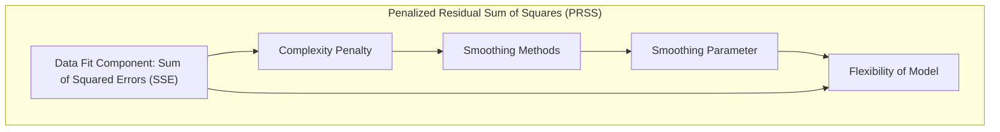
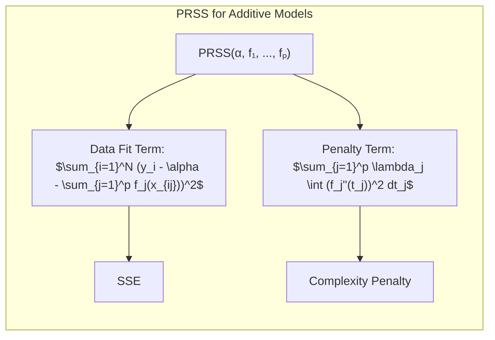
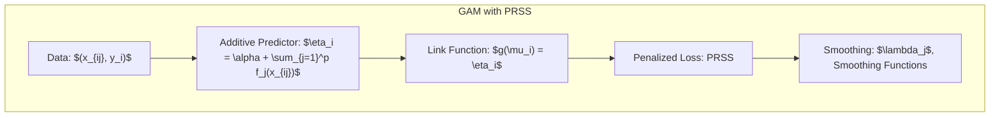
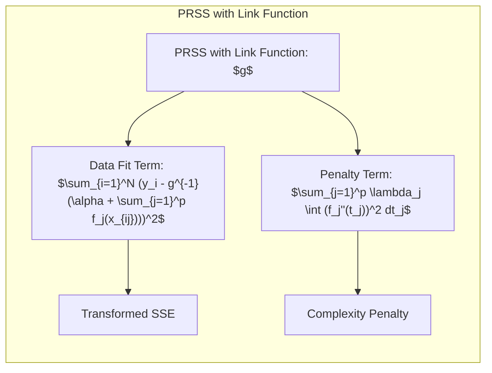
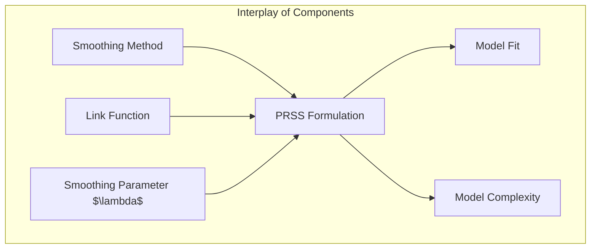

## Título: Modelos Aditivos Generalizados, Árvores e Métodos Relacionados: Abordagem da Soma de Quadrados Penalizada para Critérios de Ajuste em Modelos Aditivos



### Introdução

Este capítulo explora a abordagem da soma de quadrados penalizada (Penalized Residual Sum of Squares - PRSS) como um critério fundamental para o ajuste de modelos aditivos, com especial ênfase em Modelos Aditivos Generalizados (GAMs) [^9.1]. O PRSS é um critério que combina o ajuste aos dados com uma penalização pela complexidade do modelo, o que permite evitar o overfitting e melhorar a capacidade de generalização. O capítulo detalha a formulação matemática do PRSS, sua relação com diferentes métodos de suavização e como o parâmetro de suavização controla a flexibilidade do modelo. Além disso, o capítulo analisa como o PRSS é utilizado em conjunto com o algoritmo de backfitting e a sua relação com modelos da família exponencial. O objetivo principal é oferecer uma compreensão teórica aprofundada sobre a importância do PRSS como um critério de ajuste para a construção de modelos aditivos robustos e confiáveis.

### Conceitos Fundamentais

**Conceito 1: A Soma dos Quadrados dos Resíduos (SSE)**

A soma dos quadrados dos resíduos (Sum of Squared Errors - SSE) é uma métrica utilizada para avaliar o ajuste de um modelo aos dados, e é dada por:

$$
\text{SSE} = \sum_{i=1}^N (y_i - \hat{y}_i)^2
$$

onde $y_i$ são as observações e $\hat{y}_i$ são as predições do modelo. O SSE busca encontrar os parâmetros do modelo que minimizam a soma das diferenças quadráticas entre os valores observados e os valores preditos. Embora o SSE seja uma métrica útil para avaliar a qualidade do ajuste, ele não penaliza modelos complexos, o que pode levar a overfitting, ou seja, um modelo que se ajusta muito bem aos dados de treino, mas tem um desempenho ruim em dados novos. Por essa razão, o SSE é usado como base para a construção de outros critérios de ajuste que incluem termos de penalização. O SSE, no entanto, é uma parte essencial de critérios de ajuste mais robustos.

> 💡 **Exemplo Numérico:**
>
> Suponha que temos um conjunto de dados com 3 observações: $y = [3, 5, 8]$ e um modelo que faz as seguintes predições: $\hat{y} = [2.5, 5.2, 7.8]$. O SSE seria calculado da seguinte forma:
>
> $ \text{SSE} = (3 - 2.5)^2 + (5 - 5.2)^2 + (8 - 7.8)^2 = 0.25 + 0.04 + 0.04 = 0.33 $
>
> Este valor de 0.33 representa a soma dos erros quadráticos entre as predições do modelo e os valores reais. Um valor menor de SSE indica um melhor ajuste do modelo aos dados. No entanto, este valor não leva em conta a complexidade do modelo, e se o modelo fosse mais complexo, o SSE poderia ser ainda menor, mas o modelo poderia ter *overfitting*.

**Lemma 1:** *A soma dos quadrados dos resíduos (SSE) é uma métrica que quantifica a qualidade do ajuste de um modelo aos dados, e é a métrica que é minimizada pelo método dos mínimos quadrados. No entanto, ela não penaliza a complexidade do modelo, o que pode levar a um ajuste inadequado, com o problema do overfitting.* Uma métrica que penaliza a complexidade do modelo, como o PRSS, é uma alternativa mais robusta que o SSE [^4.3.2].

**Conceito 2: A Soma de Quadrados Penalizada (PRSS)**

A soma de quadrados penalizada (Penalized Residual Sum of Squares - PRSS) adiciona um termo de penalidade à soma dos erros quadráticos para controlar a complexidade do modelo:

$$
\text{PRSS} = \sum_{i=1}^N (y_i - \hat{y}_i)^2 + \text{Penalidade}(\hat{f})
$$

onde $\text{Penalidade}(\hat{f})$ é uma função que penaliza modelos mais complexos. No caso de modelos aditivos, a penalidade é geralmente aplicada às funções não paramétricas $f_j$. Para um modelo aditivo como um GAM, o PRSS é definido como:



$$
\text{PRSS}(\alpha, f_1,...,f_p) = \sum_{i=1}^N (y_i - \alpha - \sum_{j=1}^p f_j(x_{ij}))^2 + \sum_{j=1}^p \lambda_j \int (f_j''(t_j))^2 dt_j
$$

onde $\lambda_j$ são parâmetros de regularização, que controlam o *trade-off* entre o ajuste aos dados e a complexidade da função $f_j$. O PRSS, ao contrário do SSE, penaliza modelos mais complexos, que têm um grande número de parâmetros ou apresentam grandes variações nas funções $f_j$. O objetivo do PRSS é encontrar um modelo que equilibre o ajuste aos dados com a sua complexidade, levando a um modelo mais robusto e com melhor capacidade de generalização.

> 💡 **Exemplo Numérico:**
>
> Continuando com o exemplo anterior, vamos supor que o nosso modelo é um modelo aditivo com uma função $f(x)$ e que o termo de penalidade é dado por $\lambda \int (f''(t))^2 dt$.
>
> 1. **SSE:** Já calculamos o SSE como 0.33.
> 2. **Penalidade:** Suponha que a função $f(x)$ seja um spline cúbico e que a integral da segunda derivada ao quadrado seja igual a 0.5 e que o parâmetro de regularização $\lambda$ seja igual a 0.1. Então, a penalidade é:
>    $ \text{Penalidade} = \lambda \int (f''(t))^2 dt = 0.1 \times 0.5 = 0.05 $
> 3. **PRSS:** O PRSS seria:
>    $ \text{PRSS} = \text{SSE} + \text{Penalidade} = 0.33 + 0.05 = 0.38 $
>
> Note que o PRSS é maior que o SSE, pois adicionamos a penalidade. Se tivéssemos um modelo mais complexo, a penalidade seria maior, e o PRSS aumentaria mais. O objetivo é encontrar um valor de $\lambda$ que equilibre o ajuste aos dados (SSE) com a complexidade do modelo (Penalidade).

**Corolário 1:** *A inclusão do termo de penalidade na função de custo (PRSS) controla a complexidade do modelo, evita o overfitting e melhora a capacidade de generalização. O parâmetro de regularização define o balanço entre o ajuste aos dados e a complexidade do modelo*.  A utilização do termo de penalidade permite controlar a flexibilidade do modelo [^4.3.2].

**Conceito 3: A Relação do PRSS com Métodos de Suavização**

O termo de penalidade no PRSS está intimamente relacionado com os métodos de suavização utilizados para modelar as funções não paramétricas $f_j$.  A integral da segunda derivada ao quadrado da função $\int (f_j''(t_j))^2 dt_j$, utilizada no termo de penalidade do PRSS, penaliza funções que têm muitas variações.  Modelos com *splines*, por exemplo, são penalizados pela sua complexidade. A escolha do método de suavização, portanto, afeta o termo de penalidade. O parâmetro de suavização $\lambda_j$ controla a intensidade da penalização e, por consequência, a flexibilidade do modelo. Valores mais altos de $\lambda_j$ resultam em modelos mais suavizados, enquanto valores menores resultam em modelos mais flexíveis, e o valor ótimo deve ser encontrado utilizando validação cruzada ou outras técnicas de escolha de modelos. A utilização do PRSS com a escolha adequada do suavizador e do parâmetro de regularização permite modelar não linearidades e evitar o overfitting.

> ⚠️ **Nota Importante:** O termo de penalidade no PRSS é derivado do conceito de suavização e busca controlar a complexidade das funções não paramétricas $f_j$ e evitar que o modelo se ajuste excessivamente ao ruído dos dados [^4.3.3].

> ❗ **Ponto de Atenção:** A escolha inadequada do parâmetro de suavização $\lambda_j$ pode resultar em um modelo que é muito simples e não captura os padrões nos dados (underfitting), ou muito complexo e com *overfitting*. O parâmetro de suavização controla a flexibilidade do modelo, e deve ser escolhido de maneira adequada. [^4.3.2].

> ✔️ **Destaque:** O PRSS permite um balanço entre o ajuste aos dados e a complexidade do modelo, o que é crucial para obter um modelo que tenha um bom desempenho tanto nos dados de treino quanto em novos dados. O parâmetro de regularização é chave para controlar a flexibilidade e o balanço do ajuste [^4.3.1].

### A Formulação da Soma de Quadrados Penalizada em Modelos Aditivos Generalizados



**Explicação:** Este diagrama representa a formulação da soma de quadrados penalizada (PRSS) para a estimação dos parâmetros em modelos aditivos generalizados (GAMs). O processo de otimização busca um balanço entre ajuste aos dados e a complexidade do modelo, conforme descrito nos tópicos [^4.3], [^4.3.1], [^4.3.2].

A formulação do PRSS em modelos GAMs consiste em dois termos principais: a soma dos erros quadráticos (SSE) e o termo de penalização. O SSE é definido como:

$$
\text{SSE} = \sum_{i=1}^N (y_i - \hat{y}_i)^2 = \sum_{i=1}^N (y_i - \alpha - \sum_{j=1}^p f_j(x_{ij}))^2
$$

que quantifica a diferença entre os valores observados $y_i$ e os valores preditos pelo modelo $\hat{y}_i$, onde $\alpha$ é o intercepto e $f_j(x_{ij})$ são as funções não paramétricas dos preditores. O termo de penalização é dado por:
$$
\text{Penalidade}(\hat{f}) = \sum_{j=1}^p \lambda_j \int (f_j''(t_j))^2 dt_j
$$

onde $\lambda_j$ são os parâmetros de suavização que controlam a complexidade da função $f_j$.  A integral da segunda derivada ao quadrado penaliza as funções que têm muitas variações.  A combinação do SSE e da penalidade forma o critério PRSS:

$$
\text{PRSS}(\alpha, f_1,...,f_p) = \sum_{i=1}^N (y_i - \alpha - \sum_{j=1}^p f_j(x_{ij}))^2 + \sum_{j=1}^p \lambda_j \int (f_j''(t_j))^2 dt_j
$$

O algoritmo de backfitting é utilizado para estimar os parâmetros do modelo GAM, iterativamente ajustando cada função não paramétrica, enquanto os outros parâmetros são mantidos fixos. A escolha do parâmetro de suavização $\lambda_j$ deve ser feita usando validação cruzada ou outros métodos de escolha de modelos para encontrar o balanço ótimo entre ajuste aos dados e complexidade do modelo. A função de ligação, quando utilizada, afeta a forma da função de custo e o processo de otimização.

**Lemma 3:** *O critério PRSS em modelos GAMs combina o ajuste aos dados (SSE) com um termo de penalização que controla a suavidade e a complexidade das funções não paramétricas. A minimização do PRSS leva a modelos que têm um bom ajuste aos dados, mas também são robustos e têm boa capacidade de generalização*. O termo de penalidade penaliza modelos complexos e evita o overfitting [^4.3.2], [^4.3.3].

**Corolário 3:** *A escolha do parâmetro de suavização é crucial para o ajuste adequado do modelo GAM, e pode ser feita através de validação cruzada ou métodos similares. O parâmetro de suavização, ao controlar a flexibilidade das funções não paramétricas, permite uma boa capacidade de generalização do modelo*.  O PRSS fornece um balanço entre a flexibilidade e a capacidade de generalização do modelo [^4.3.1].

A escolha do suavizador e dos parâmetros de suavização afeta a capacidade do modelo de aproximar funções e deve ser feita considerando a natureza dos dados.

### Soma de Quadrados Penalizada, Funções de Ligação e Modelos da Família Exponencial

A soma dos quadrados penalizada (PRSS) é frequentemente utilizada em modelos aditivos com função de ligação para dados não Gaussianos. Nestes casos, a função de custo é alterada para incluir a função de ligação e utilizar a escala apropriada para a família exponencial. Para modelos generalizados aditivos (GAMs) com função de ligação $g$ , a função de custo passa a ser:



$$
\text{PRSS}(\alpha, f_1,...,f_p) = \sum_{i=1}^N (y_i - g^{-1}(\alpha + \sum_{j=1}^p f_j(x_{ij})))^2 + \sum_{j=1}^p \lambda_j \int (f_j''(t_j))^2 dt_j
$$

onde $g^{-1}$ é a inversa da função de ligação.  A função de ligação é utilizada para transformar a escala dos dados, e o objetivo é minimizar o PRSS. O método de estimação utilizado é o método de *Iteratively Reweighted Least Squares (IRLS)*.

> 💡 **Exemplo Numérico:**
>
> Vamos considerar um modelo GAM com uma função de ligação logística, onde a resposta $y_i$ é binária (0 ou 1). A função de ligação é dada por $g(\mu) = \text{logit}(\mu) = \log(\frac{\mu}{1-\mu})$, e sua inversa é $g^{-1}(\eta) = \frac{e^{\eta}}{1 + e^{\eta}}$, onde $\mu$ é a probabilidade de $y_i = 1$.
>
> Suponha que temos um modelo com um único preditor $x$ e que o modelo GAM seja:
>
> $ \text{logit}(\mu_i) = \alpha + f(x_i) $
>
> Onde $f(x)$ é uma função não paramétrica. A função de custo PRSS para este modelo seria:
>
> $$
> \text{PRSS}(\alpha, f) = \sum_{i=1}^N (y_i - \frac{e^{\alpha + f(x_i)}}{1 + e^{\alpha + f(x_i)}})^2 + \lambda \int (f''(t))^2 dt
> $$
>
> Para ilustrar, vamos supor que temos 3 observações:
>
> | $i$ | $x_i$ | $y_i$ |
> |-----|-------|-------|
> | 1   | 1     | 0     |
> | 2   | 2     | 1     |
> | 3   | 3     | 1     |
>
> E que após um passo do algoritmo de *backfitting*, temos $\alpha = -1$ e $f(x_1) = -0.5$, $f(x_2) = 0.5$, $f(x_3) = 1$.  Calculamos as predições $\hat{\mu_i}$:
>
> -  $\hat{\mu_1} = \frac{e^{-1 - 0.5}}{1 + e^{-1 - 0.5}} = \frac{e^{-1.5}}{1 + e^{-1.5}} \approx 0.182$
> -  $\hat{\mu_2} = \frac{e^{-1 + 0.5}}{1 + e^{-1 + 0.5}} = \frac{e^{-0.5}}{1 + e^{-0.5}} \approx 0.378$
> -  $\hat{\mu_3} = \frac{e^{-1 + 1}}{1 + e^{-1 + 1}} = \frac{e^{0}}{1 + e^{0}} = 0.5$
>
> O SSE seria:
>
> $ \text{SSE} = (0 - 0.182)^2 + (1 - 0.378)^2 + (1 - 0.5)^2 = 0.033 + 0.387 + 0.25 = 0.67 $
>
> E se o termo de penalidade for $\lambda \int (f''(t))^2 dt = 0.1$, com $\lambda = 0.1$, então o PRSS seria:
>
> $ \text{PRSS} = 0.67 + 0.1 = 0.77 $
>
> Note que a função de ligação transforma a escala da resposta, e o PRSS é calculado com base nessa escala transformada.

Modelos pertencentes à família exponencial, quando modelados com funções de ligação canônicas, permitem obter estimativas com boas propriedades estatísticas. A escolha da função de ligação, portanto, é importante para garantir que os modelos sejam adequados e que o processo de otimização seja eficiente. A estrutura da família exponencial também influencia na escolha do método de suavização e no termo de penalização.  A utilização de funções de ligação canônica simplifica o processo de otimização e garante propriedades estatísticas desejáveis para o modelo, que é um componente essencial na formulação do PRSS em modelos com dados da família exponencial.

### Considerações Práticas: Implementação do PRSS e Escolha de Parâmetros

Na prática, a escolha dos parâmetros de suavização $\lambda_j$ é crucial para o desempenho do modelo. Métodos de validação cruzada são frequentemente utilizados para encontrar os melhores valores de $\lambda_j$, de modo a obter um modelo com uma boa capacidade de generalização.  O número de *folds* da validação cruzada, bem como a escolha do tipo de validação cruzada, são aspectos importantes a serem considerados na implementação.  A escolha do tipo de suavizador também influencia o desempenho do modelo e a escolha do parâmetro de suavização.  Diferentes tipos de *splines*, *kernels*, entre outros suavizadores, podem ser utilizados. A implementação do PRSS, portanto, requer atenção em diversos aspectos para garantir um bom desempenho e capacidade de generalização do modelo. O uso de bibliotecas estatísticas como `R` e `Python` facilita a implementação e o uso de modelos com PRSS.

> 💡 **Exemplo Numérico:**
>
> Para ilustrar a escolha de $\lambda$ via validação cruzada, vamos utilizar um exemplo com dados simulados e um modelo GAM simples em Python utilizando a biblioteca `pygam`.
>
> ```python
> import numpy as np
> import pandas as pd
> from pygam import LinearGAM, s, f
> from sklearn.model_selection import train_test_split
> from sklearn.metrics import mean_squared_error
> import matplotlib.pyplot as plt
>
> # Gerar dados simulados
> np.random.seed(0)
> X = np.linspace(0, 10, 100)
> y = np.sin(X) + np.random.normal(0, 0.5, 100)
>
> df = pd.DataFrame({'X': X, 'y': y})
>
> # Dividir dados em treino e teste
> X_train, X_test, y_train, y_test = train_test_split(df[['X']], df['y'], test_size=0.2, random_state=42)
>
> # Definir valores de lambda para testar
> lambdas = np.logspace(-3, 3, 7)
>
> mse_values = []
>
> for lam in lambdas:
>     # Criar e ajustar o modelo GAM
>     gam = LinearGAM(s(0, lam=lam)).fit(X_train, y_train)
>
>     # Fazer predições no conjunto de teste
>     y_pred = gam.predict(X_test)
>
>     # Calcular o erro quadrático médio
>     mse = mean_squared_error(y_test, y_pred)
>     mse_values.append(mse)
>
> # Plotar os resultados da validação cruzada
> plt.figure(figsize=(8, 6))
> plt.plot(lambdas, mse_values, marker='o')
> plt.xscale('log')
> plt.xlabel('Lambda (Parâmetro de Suavização)')
> plt.ylabel('Erro Quadrático Médio (MSE)')
> plt.title('Validação Cruzada para Escolha de Lambda')
> plt.grid(True)
> plt.show()
>
> # Encontrar o melhor lambda
> best_lambda_index = np.argmin(mse_values)
> best_lambda = lambdas[best_lambda_index]
> best_mse = mse_values[best_lambda_index]
>
> print(f"Melhor Lambda: {best_lambda:.3f}")
> print(f"Melhor MSE: {best_mse:.3f}")
>
> # Ajustar o modelo com o melhor lambda
> best_gam = LinearGAM(s(0, lam=best_lambda)).fit(X_train, y_train)
>
> # Visualizar a curva ajustada
> plt.figure(figsize=(8, 6))
> plt.scatter(X_train, y_train, label='Dados de Treino')
> plt.plot(X_train, best_gam.predict(X_train), color='red', label='Curva Ajustada')
> plt.xlabel('X')
> plt.ylabel('y')
> plt.title('Modelo GAM Ajustado com Melhor Lambda')
> plt.legend()
> plt.grid(True)
> plt.show()
> ```
>
> Este exemplo mostra como a validação cruzada pode ser usada para encontrar um valor adequado de $\lambda$ que minimize o erro no conjunto de teste. O gráfico mostra como o MSE varia com diferentes valores de $\lambda$, e o melhor valor é aquele que minimiza o MSE. O modelo final ajustado com o melhor $\lambda$ é então visualizado para mostrar o ajuste da curva aos dados.

### Perguntas Teóricas Avançadas: Como as propriedades do suavizador e a escolha da função de ligação interagem com a formulação do PRSS? E como a escolha da função de ligação influencia a interpretação do termo de penalização?



**Resposta:**

As propriedades do suavizador e a escolha da função de ligação afetam significativamente a formulação do PRSS. A função de ligação determina como os dados são transformados antes da aplicação do suavizador e como o termo de penalidade é interpretado, enquanto o suavizador, por sua vez, afeta a forma como o modelo se ajusta aos dados.

A escolha do suavizador, como *splines* ou *kernels*, determina a capacidade do modelo de representar funções não lineares. *Splines* são geralmente utilizados para modelar funções suaves e têm parâmetros de suavização associados, enquanto *kernels* utilizam parâmetros de largura que afetam a sua suavidade. O parâmetro de suavização na integral da derivada ao quadrado $ \int (f_j''(t_j))^2 dt_j$, penaliza funções com muita variação, o que leva a modelos mais suaves. Diferentes suavizadores resultam em termos de penalização distintos, e a escolha do suavizador afeta a interpretação do termo de penalização.

A função de ligação, por sua vez, transforma a escala da resposta e afeta como o modelo é ajustado aos dados. A escolha de uma função de ligação canônica, para modelos da família exponencial, garante que o modelo tenha boas propriedades estatísticas e que o processo de otimização seja mais eficiente. Em modelos GAMs com função de ligação, o termo de penalidade age na escala transformada pela função de ligação. Por exemplo, em modelos logísticos com função *logit*, a penalidade afeta a escala da log-odds, enquanto que, na regressão linear, a penalidade atua diretamente na escala da resposta. A interpretação do termo de penalização depende da escala da função de ligação, e do tipo de suavizador utilizado.

A escolha do parâmetro de suavização $\lambda_j$ controla a força da penalização e o equilíbrio entre o ajuste aos dados e a complexidade do modelo. Valores de $\lambda_j$ maiores resultam em modelos mais suaves, enquanto valores menores permitem que os modelos se ajustem a padrões mais complexos nos dados, mas com risco de *overfitting*. A escolha do parâmetro de suavização também deve levar em consideração a função de ligação utilizada e as propriedades do suavizador.

**Lemma 4:** *As propriedades do suavizador e a escolha da função de ligação, juntamente com o parâmetro de suavização, determinam a qualidade do ajuste, a capacidade de generalização, e a interpretação dos modelos aditivos. O parâmetro de suavização é a ferramenta de controle do trade-off entre flexibilidade e generalização*. O suavizador e o parâmetro de suavização, portanto, devem ser escolhidos com cuidado para que o modelo tenha um bom desempenho [^4.3].

**Corolário 4:** *A interação entre as propriedades do suavizador e a escolha da função de ligação e do parâmetro de suavização afeta a capacidade de modelar as não linearidades de forma adequada. A escolha do suavizador, do parâmetro de suavização e da função de ligação, portanto, deve ser baseada nas propriedades dos dados e no objetivo da modelagem*.  A combinação adequada do suavizador, da função de ligação e do parâmetro de suavização é essencial para a construção de modelos robustos [^4.4.4].

> ⚠️ **Ponto Crucial:** A formulação do PRSS, juntamente com a escolha do suavizador e da função de ligação, permite a modelagem de dados complexos com modelos aditivos, e a escolha adequada dos parâmetros e componentes do modelo garante o desempenho do modelo e a sua capacidade de generalização. A escolha do tipo de suavizador, da função de ligação e do parâmetro de suavização depende da natureza da não linearidade dos dados, da distribuição da variável resposta e do trade-off entre ajuste aos dados e complexidade do modelo [^4.5].

### Conclusão

Este capítulo apresentou a formulação da soma de quadrados penalizada (PRSS), detalhando a sua importância como critério de ajuste em modelos aditivos, particularmente em GAMs. O papel do termo de penalização na regularização da complexidade do modelo e a relação entre a PRSS, os métodos de suavização, funções de ligação e a família exponencial foram explorados.  A escolha do suavizador e do parâmetro de suavização são cruciais para o desempenho dos modelos aditivos. O PRSS, portanto, fornece uma base teórica para a construção de modelos aditivos robustos e com boa capacidade de generalização.

### Footnotes

[^4.1]: "In this chapter we begin our discussion of some specific methods for super-vised learning. These techniques each assume a (different) structured form for the unknown regression function, and by doing so they finesse the curse of dimensionality. Of course, they pay the possible price of misspecifying the model, and so in each case there is a tradeoff that has to be made." *(Trecho de "Additive Models, Trees, and Related Methods")*

[^4.2]: "Regression models play an important role in many data analyses, providing prediction and classification rules, and data analytic tools for understand-ing the importance of different inputs." *(Trecho de "Additive Models, Trees, and Related Methods")*

[^4.3]: "In this section we describe a modular algorithm for fitting additive models and their generalizations. The building block is the scatterplot smoother for fitting nonlinear effects in a flexible way. For concreteness we use as our scatterplot smoother the cubic smoothing spline described in Chapter 5." *(Trecho de "Additive Models, Trees, and Related Methods")*

[^4.3.1]:  "The additive model has the form $Y = \alpha + \sum_{j=1}^p f_j(X_j) + \varepsilon$, where the error term $\varepsilon$ has mean zero." * (Trecho de "Additive Models, Trees, and Related Methods")*

[^4.3.2]:   "Given observations $x_i, y_i$, a criterion like the penalized sum of squares (5.9) of Section 5.4 can be specified for this problem, $\text{PRSS}(\alpha, f_1, f_2,..., f_p) = \sum_i^N (y_i - \alpha - \sum_j^p f_j(x_{ij}))^2 + \sum_j^p \lambda_j \int(f_j''(t_j))^2 dt_j$" * (Trecho de "Additive Models, Trees, and Related Methods")*

[^4.3.3]: "where the $\lambda_j > 0$ are tuning parameters. It can be shown that the minimizer of (9.7) is an additive cubic spline model; each of the functions $f_j$ is a cubic spline in the component $X_j$, with knots at each of the unique values of $x_{ij}$, $i = 1,..., N$." *(Trecho de "Additive Models, Trees, and Related Methods")*

[^4.4]: "For two-class classification, recall the logistic regression model for binary data discussed in Section 4.4. We relate the mean of the binary response $\mu(X) = \text{Pr}(Y = 1|X)$ to the predictors via a linear regression model and the logit link function:  $\log(\mu(X)/(1 – \mu(X)) = \alpha + \beta_1 X_1 + ... + \beta_pX_p$." * (Trecho de "Additive Models, Trees, and Related Methods")*

[^4.4.1]: "The additive logistic regression model replaces each linear term by a more general functional form: $\log(\mu(X)/(1 – \mu(X))) = \alpha + f_1(X_1) + \ldots + f_p(X_p)$, where again each $f_j$ is an unspecified smooth function." * (Trecho de "Additive Models, Trees, and Related Methods")*

[^4.4.2]: "While the non-parametric form for the functions $f_j$ makes the model more flexible, the additivity is retained and allows us to interpret the model in much the same way as before. The additive logistic regression model is an example of a generalized additive model." *(Trecho de "Additive Models, Trees, and Related Methods")*

[^4.4.3]: "In general, the conditional mean $\mu(X)$ of a response $Y$ is related to an additive function of the predictors via a link function $g$:  $g[\mu(X)] = \alpha + f_1(X_1) + \ldots + f_p(X_p)$." *(Trecho de "Additive Models, Trees, and Related Methods")*

[^4.4.4]:  "Examples of classical link functions are the following: $g(\mu) = \mu$ is the identity link, used for linear and additive models for Gaussian response data." *(Trecho de "Additive Models, Trees, and Related Methods")*

[^4.4.5]: "$g(\mu) = \text{logit}(\mu)$ as above, or $g(\mu) = \text{probit}(\mu)$, the probit link function, for modeling binomial probabilities. The probit function is the inverse Gaussian cumulative distribution function: $\text{probit}(\mu) = \Phi^{-1}(\mu)$." *(Trecho de "Additive Models, Trees, and Related Methods")*

[^4.5]: "All three of these arise from exponential family sampling models, which in addition include the gamma and negative-binomial distributions. These families generate the well-known class of generalized linear models, which are all extended in the same way to generalized additive models." *(Trecho de "Additive Models, Trees, and Related Methods")*
