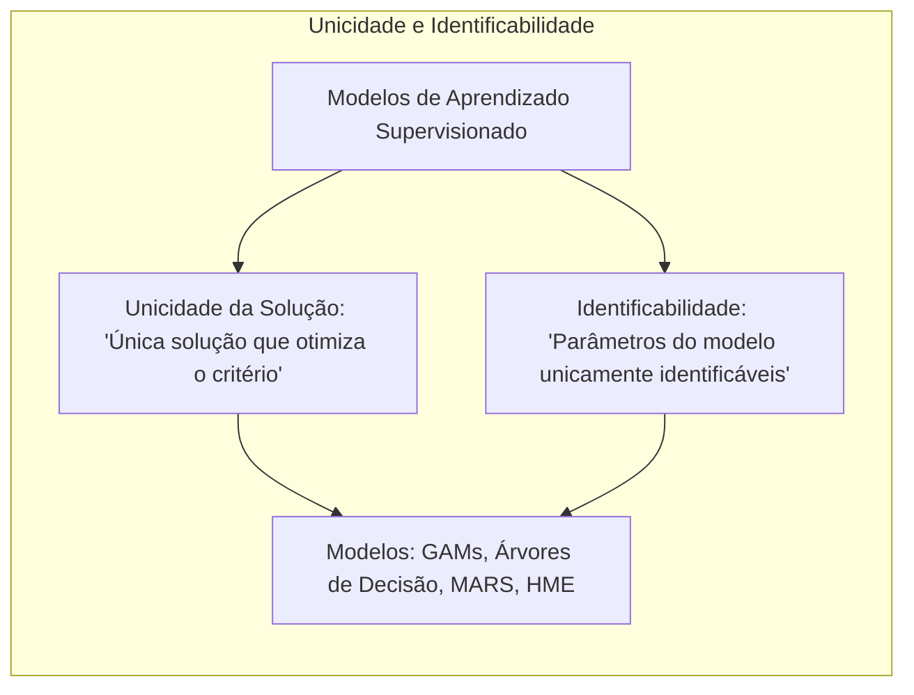
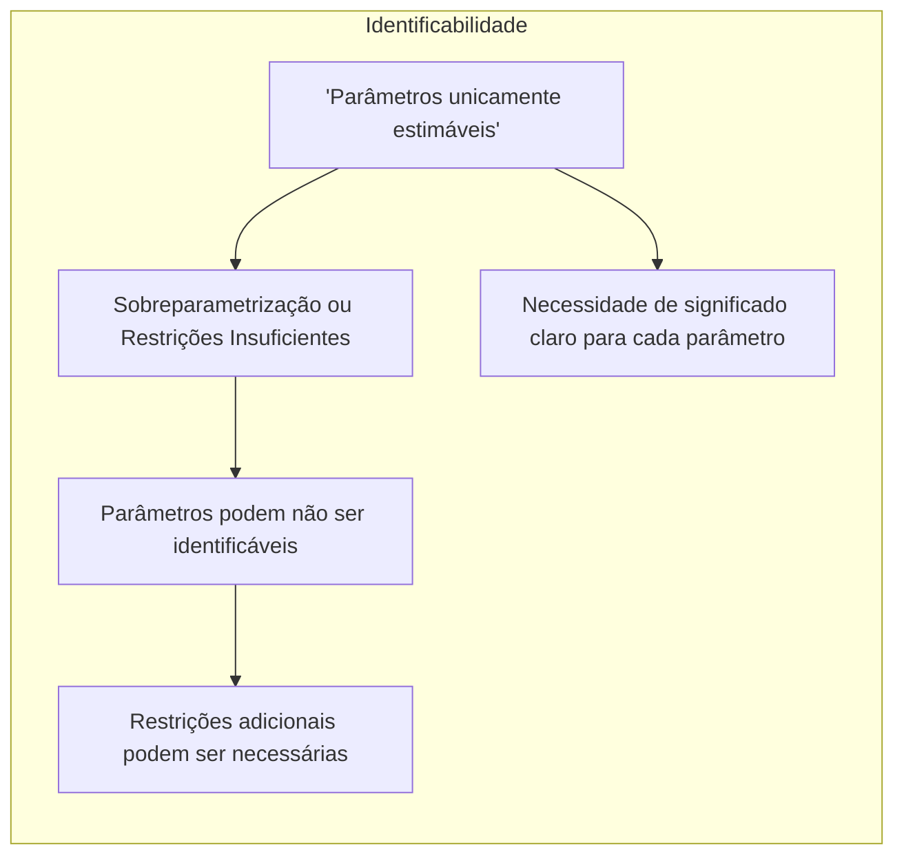
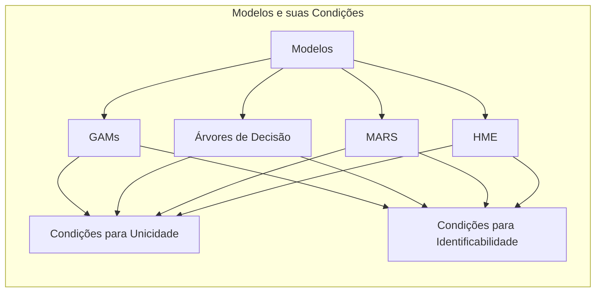
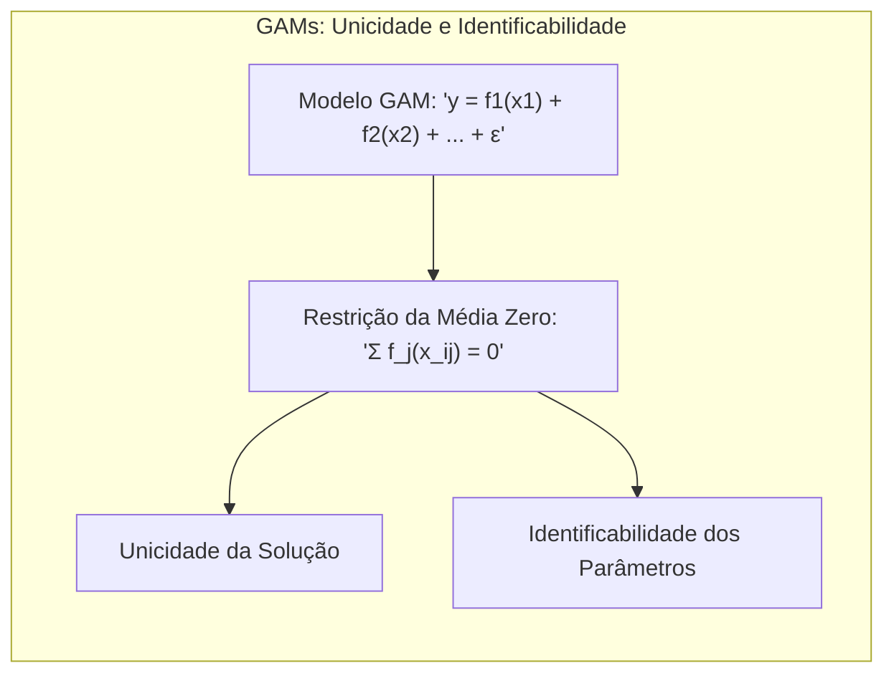
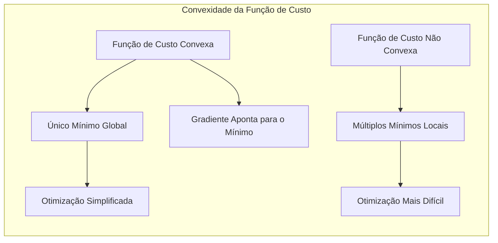

## Título: Modelos Aditivos Generalizados, Árvores e Métodos Relacionados: Unicidade das Soluções e Identificabilidade



### Introdução

Este capítulo explora a questão da unicidade das soluções e identificabilidade em modelos de aprendizado supervisionado, particularmente em Modelos Aditivos Generalizados (GAMs) e outros métodos como árvores de decisão, Multivariate Adaptive Regression Splines (MARS) e misturas hierárquicas de especialistas (HME) [^9.1]. A unicidade da solução refere-se à existência de uma única solução que otimiza o critério de ajuste do modelo, enquanto a identificabilidade refere-se à capacidade de identificar unicamente os parâmetros do modelo a partir dos dados. Em modelos complexos e flexíveis, a questão da unicidade e da identificabilidade podem não ser triviais e devem ser cuidadosamente consideradas para garantir a interpretabilidade e a confiabilidade dos resultados. O objetivo deste capítulo é examinar as condições para a unicidade da solução e como restrições e abordagens de otimização específicas podem garantir a identificabilidade dos modelos. O foco principal está nas abordagens teóricas e nas implicações práticas para a construção de modelos robustos e confiáveis.

### Conceitos Fundamentais

**Conceito 1: Unicidade da Solução**

A unicidade da solução refere-se à existência de apenas um conjunto de parâmetros que minimiza ou maximiza um critério de ajuste específico, como a soma dos erros quadráticos ou a função de verossimilhança. Em modelos lineares com uma base de dados que garante a não singularidade da matriz $X^T X$, por exemplo, a solução dos mínimos quadrados é única. No entanto, em modelos não lineares ou modelos com muitas flexibilidades, a unicidade da solução pode não ser garantida. A falta de unicidade pode levar a diferentes soluções com o mesmo ajuste aos dados, o que pode dificultar a interpretação dos resultados e tornar o modelo instável. Em modelos que utilizam métodos iterativos de otimização, o algoritmo pode convergir para um máximo local, que não é a solução ótima global, caso a função de custo não seja convexa.

> 💡 **Exemplo Numérico:**
> Considere um modelo linear simples $y = \beta_0 + \beta_1 x + \epsilon$. Se tivermos dados com $x = [1, 2, 3]$ e $y = [2, 4, 5]$, podemos calcular os parâmetros $\beta_0$ e $\beta_1$ usando o método dos mínimos quadrados. A solução é única se a matriz $X^TX$ for inversível. Aqui, $X = \begin{bmatrix} 1 & 1 \\ 1 & 2 \\ 1 & 3 \end{bmatrix}$. Calculando $X^TX = \begin{bmatrix} 3 & 6 \\ 6 & 14 \end{bmatrix}$, que é inversível, garantindo a unicidade da solução. A solução para $\beta = (X^TX)^{-1}X^Ty$ é $\beta = \begin{bmatrix} 1.667 \\ 1 \end{bmatrix}$ aproximadamente.
>
> Se, no entanto, tivermos apenas dois pontos (por exemplo, $x = [1, 2]$ e $y = [2, 4]$), a matriz $X^TX$ seria $\begin{bmatrix} 2 & 3 \\ 3 & 5 \end{bmatrix}$, ainda inversível, mas se tivéssemos apenas um ponto, a matriz não seria inversível e a solução não seria única.
>
> ```python
> import numpy as np
>
> # Dados de exemplo
> x = np.array([1, 2, 3])
> y = np.array([2, 4, 5])
>
> # Construindo a matriz X
> X = np.vstack((np.ones(len(x)), x)).T
>
> # Calculando X^T * X
> XtX = X.T @ X
>
> # Verificando se X^T * X é inversível
> try:
>     XtX_inv = np.linalg.inv(XtX)
>     print("X^T * X é inversível. Solução única garantida.")
>     # Calculando os parâmetros beta
>     beta = XtX_inv @ X.T @ y
>     print(f"Parâmetros beta: {beta}")
> except np.linalg.LinAlgError:
>     print("X^T * X não é inversível. Solução não é única.")
> ```

**Lemma 1:** *A unicidade da solução é uma propriedade importante, pois garante que os parâmetros encontrados representem uma solução estável e única. Modelos não lineares podem ter múltiplas soluções, e a escolha da melhor solução depende da estrutura do modelo e do algoritmo de otimização utilizado.* A unicidade da solução também depende do espaço de parâmetros do modelo e de como os parâmetros são restringidos [^4.3.3].

**Conceito 2: Identificabilidade**

A identificabilidade refere-se à capacidade de estimar unicamente os parâmetros do modelo a partir dos dados observados. Em modelos com sobre parametrização ou com restrições insuficientes, os parâmetros podem não ser identificáveis, ou seja, diferentes valores dos parâmetros podem levar a resultados semelhantes. Para que um modelo seja identificável, é necessário que cada parâmetro tenha um significado claro e que possa ser estimado unicamente. Por exemplo, em um modelo linear, se o número de preditores for maior que o número de observações, os parâmetros não são identificáveis sem a imposição de restrições adicionais. A identificabilidade é uma propriedade que garante que o modelo possa ser interpretado e utilizado de forma confiável.

> 💡 **Exemplo Numérico:**
> Considere um modelo linear com dois preditores $y = \beta_0 + \beta_1 x_1 + \beta_2 x_2 + \epsilon$. Se os preditores $x_1$ e $x_2$ forem perfeitamente colineares (por exemplo, $x_2 = 2x_1$), então o modelo não será identificável. Isso ocorre porque podemos alterar os valores de $\beta_1$ e $\beta_2$ de forma que a soma $\beta_1 x_1 + \beta_2 x_2$ permaneça a mesma, levando a infinitas soluções.
>
> Por exemplo, se o verdadeiro modelo for $y = 1 + 2x_1 + 3x_2$, e temos $x_2 = 2x_1$, então $y = 1 + 2x_1 + 3(2x_1) = 1 + 8x_1$. O modelo $y = 1 + 8x_1 + 0x_2$ seria equivalente, e os parâmetros não seriam únicos. Para tornar o modelo identificável, seria necessário remover um dos preditores ou impor restrições adicionais, como uma regularização.



**Corolário 1:** *A identificabilidade garante que os parâmetros estimados em um modelo estatístico tenham um significado único e que possam ser interpretados de forma coerente e confiável. Modelos não identificáveis podem apresentar problemas de interpretação e de estabilidade das estimativas* [^4.3.3].

**Conceito 3: Unicidade e Identificabilidade em Modelos Aditivos Generalizados (GAMs)**

Em GAMs, a unicidade das soluções e a identificabilidade dos parâmetros são influenciadas pela natureza não paramétrica das funções $f_j$. A identificabilidade do modelo GAM é afetada pela necessidade de se definir restrições aos parâmetros, como a média de cada componente ser igual a zero. Como os modelos GAMs são definidos como uma soma de funções não paramétricas, restrições adicionais são necessárias para garantir que os modelos sejam identificáveis. Sem essas restrições, infinitas soluções podem ser obtidas com o mesmo ajuste aos dados. A restrição de que as funções $f_j$ tenham média zero sobre os dados garante que a solução seja única e que os parâmetros tenham um significado bem definido.
Além disso, a escolha do suavizador e do parâmetro de suavização também tem um impacto na estabilidade e unicidade da solução.

> ⚠️ **Nota Importante:** Em modelos aditivos, a imposição da restrição de que cada função $f_j$ tem média zero sobre os dados é uma condição suficiente para a identificabilidade, pois remove a ambiguidade da escala das funções. Essa condição também permite que os modelos sejam ajustados usando o algoritmo de backfitting [^4.3.3].

> ❗ **Ponto de Atenção:** Em GAMs, a escolha do método de suavização e do parâmetro de suavização também influencia a estabilidade e unicidade da solução. Suavizadores mais flexíveis podem levar a modelos menos identificáveis e mais sensíveis aos dados de treino [^4.3.3].

> ✔️ **Destaque:** A unicidade da solução em GAMs é garantida através da utilização de restrições, e os parâmetros são bem definidos, o que permite que modelos sejam interpretados e utilizados de forma confiável [^4.3.3].

### Condições para Unicidade e Identificabilidade em Modelos Aditivos, Árvores de Decisão, MARS e HME



A unicidade e a identificabilidade são afetadas de maneira diferente nos modelos de aprendizado supervisionado.

*   **Modelos Aditivos Generalizados (GAMs):**
    *   **Condição para Unicidade:** Em GAMs, a unicidade da solução é alcançada através da imposição da restrição de que cada função não paramétrica $f_j$ tem média zero sobre os dados, ou seja:
        $$
        \sum_{i=1}^N f_j(x_{ij}) = 0
        $$
        essa condição garante que a modelagem é única e que a escala da função $f_j$ seja bem definida. Além disso, a escolha do suavizador e dos parâmetros de regularização influencia a unicidade da solução.

        > 💡 **Exemplo Numérico:**
        > Considere um GAM com dois preditores: $y = f_1(x_1) + f_2(x_2) + \epsilon$. Se não impusermos a restrição de média zero, podemos ter infinitas soluções. Por exemplo, se $f_1(x_1) = x_1$ e $f_2(x_2) = x_2$, então $y = x_1 + x_2$. No entanto, podemos adicionar uma constante a $f_1$ e subtrair a mesma constante de $f_2$ sem alterar o resultado, por exemplo, $f_1'(x_1) = x_1 + c$ e $f_2'(x_2) = x_2 - c$. Para garantir a unicidade, impomos a restrição de que a média de $f_1$ e $f_2$ sobre os dados seja zero.
        >
        > Suponha que temos os dados para $x_1$ como [1, 2, 3] e para $x_2$ como [4, 5, 6]. Se $f_1(x_1)$ for [1, 2, 3] e $f_2(x_2)$ for [4, 5, 6] inicialmente, a restrição impõe que ajustemos para que a média de cada função seja zero. Calculamos a média de $f_1$ como $\frac{1+2+3}{3} = 2$ e a média de $f_2$ como $\frac{4+5+6}{3} = 5$. Subtraindo as médias, obtemos $f_1'(x_1) = [-1, 0, 1]$ e $f_2'(x_2) = [-1, 0, 1]$. A soma das funções permanece a mesma, mas agora as funções tem média zero.
        
    *   **Condição para Identificabilidade:** A restrição da média das funções não paramétricas garante a identificabilidade dos parâmetros do modelo, e o algoritmo de backfitting permite encontrar os parâmetros que minimizam o critério de ajuste e respeitam a restrição de identificabilidade.

*   **Árvores de Decisão:**
    *   **Condição para Unicidade:** Em árvores de decisão, a unicidade da solução não é garantida pelo algoritmo de construção da árvore. O processo de construção da árvore é um processo guloso que pode levar a diferentes árvores que ajustam os dados de maneira similar. O procedimento de *pruning* também pode levar a diferentes soluções. A escolha do critério de divisão também pode levar a diferentes árvores. O mesmo conjunto de dados pode levar a diferentes árvores, o que é uma limitação das árvores de decisão.
        
         > 💡 **Exemplo Numérico:**
        > Considere um conjunto de dados de classificação simples com duas variáveis preditoras e uma variável de classe binária. Dependendo da ordem em que as variáveis são consideradas e do critério de divisão (por exemplo, impureza de Gini ou entropia), diferentes árvores podem ser construídas.
        >
        > Vamos supor que temos os seguintes dados:
        >
        > | $x_1$ | $x_2$ | Classe |
        > |-------|-------|--------|
        > | 1     | 1     | A      |
        > | 1     | 2     | A      |
        > | 2     | 1     | B      |
        > | 2     | 2     | B      |
        >
        > Uma árvore poderia dividir primeiro por $x_1$, e outra por $x_2$. Se a divisão inicial for por $x_1 < 1.5$, a primeira ramificação separaria as duas classes, e uma segunda divisão por $x_2$ seria desnecessária. Se a divisão inicial fosse por $x_2 < 1.5$, o mesmo aconteceria. Portanto, ambas as árvores seriam equivalentes, mas a estrutura seria diferente. O algoritmo de construção das árvores de decisão é guloso e não garante a unicidade.
    *   **Condição para Identificabilidade:** A interpretabilidade das árvores de decisão é garantida pela forma como as decisões são tomadas, embora a unicidade da solução não seja garantida. Cada nó da árvore representa uma região dos dados que é bem definida, e os nós terminais representam as decisões de classe. Os parâmetros dos modelos, como as variáveis de divisão e os limiares, podem ser identificados a partir da árvore resultante.

*   **Multivariate Adaptive Regression Splines (MARS):**
    *   **Condição para Unicidade:** MARS é construído de forma iterativa com um método *forward-backward selection*, que não garante a unicidade da solução. Diferentes passos na seleção dos termos da função podem levar a diferentes modelos com ajuste similar. Além disso, a escolha dos nós das funções *spline* também influencia a forma final do modelo.
         > 💡 **Exemplo Numérico:**
        > Imagine que estamos modelando uma relação não linear entre uma variável dependente $y$ e uma variável independente $x$. MARS começa com um modelo constante e adiciona termos de spline (funções lineares por partes) iterativamente.
        >
        > Se, em uma iteração, MARS adiciona um termo spline com um nó em $x=2$, e em outra iteração adiciona um termo spline com um nó em $x=3$, a ordem em que esses termos são adicionados pode levar a modelos diferentes, mesmo que ambos tenham um ajuste semelhante aos dados. O processo *forward-backward* pode remover termos adicionados anteriormente, mas não garante que a solução final seja única.
        
    *   **Condição para Identificabilidade:** MARS utiliza termos de *spline* e suas interações, que têm um significado específico, o que permite que os parâmetros sejam interpretados de forma razoável. No entanto, a escolha do número de termos e das interações é guiada por um critério de ajuste, e a ordem em que são adicionados os termos pode não ser única, levando a diferentes soluções.

*   **Misturas Hierárquicas de Especialistas (HME):**
    *   **Condição para Unicidade:** O algoritmo EM, utilizado para otimizar os parâmetros, pode convergir para um ótimo local, o que não garante a unicidade da solução. A inicialização dos parâmetros também influencia o resultado final, e diferentes inicializações podem levar a diferentes soluções.
          > 💡 **Exemplo Numérico:**
        > Em um modelo HME, a função de verossimilhança é não convexa, o que significa que existem múltiplos ótimos locais. O algoritmo EM, que é usado para ajustar os parâmetros do modelo, pode convergir para um desses ótimos locais, dependendo da inicialização dos parâmetros.
        >
        > Por exemplo, se temos um modelo com dois especialistas, e inicializamos os parâmetros dos especialistas de forma a que um especialista se especialize nos dados da primeira metade do espaço de entrada e o outro na segunda metade, o algoritmo EM pode convergir para uma solução. No entanto, se inicializarmos os parâmetros de forma diferente, o algoritmo pode convergir para outra solução diferente, mesmo que ambas sejam boas.
    *   **Condição para Identificabilidade:** HME utiliza uma mistura de modelos lineares (especialistas) ponderados por uma função, o que torna os parâmetros do modelo mais difíceis de interpretar, uma vez que os modelos são modelados por redes complexas. Os parâmetros de HME podem não ser identificáveis em certos casos, e diferentes valores dos parâmetros podem levar a resultados semelhantes.



Em resumo, a unicidade da solução e a identificabilidade são influenciadas pelas características de cada modelo. GAMs impõem restrições para garantir a unicidade e identificabilidade, enquanto árvores de decisão e MARS, não garantem a unicidade, e em HME o problema da não convexidade da função de verossimilhança pode levar a problemas na estimação.

### Implicações Práticas da Falta de Unicidade e Identificabilidade

A falta de unicidade e identificabilidade pode levar a vários problemas práticos:

1.  **Interpretação dos resultados:** Em modelos não identificáveis, os parâmetros não têm um significado único, o que torna difícil a interpretação dos resultados.
2.  **Estabilidade das estimativas:** Modelos com falta de unicidade podem levar a resultados instáveis, onde diferentes conjuntos de parâmetros geram o mesmo resultado, o que pode ser um problema na análise estatística e previsão.
3.  **Validação dos modelos:** A validação de modelos não identificáveis pode ser mais difícil, pois a comparação entre modelos diferentes não garante que um seja superior ao outro.
4.  **Dificuldade em comparar modelos:** Comparar modelos com diferentes soluções pode ser mais difícil, pois pode não haver uma solução ótima que domine as outras.

A aplicação de métodos de regularização, restrições e métodos de otimização apropriados é fundamental para lidar com a falta de unicidade e identificabilidade, pois eles podem melhorar a estabilidade e a confiabilidade dos modelos.

### Perguntas Teóricas Avançadas: Como a convexidade da função de custo afeta a unicidade da solução em modelos de aprendizado supervisionado e quais as alternativas para funções não convexas?

**Resposta:**

A convexidade da função de custo tem um impacto direto na unicidade da solução em modelos de aprendizado supervisionado. Uma função de custo convexa garante que exista um único mínimo global, o que torna a otimização mais simples e garante que o algoritmo de otimização convirja para a solução ótima. Em contraste, uma função de custo não convexa pode ter múltiplos mínimos locais, o que pode dificultar a otimização e levar a resultados subótimos.

Quando a função de custo é convexa, o gradiente da função aponta sempre para o mínimo global. O uso de métodos de otimização baseados no gradiente, como o gradiente descendente, é suficiente para encontrar a solução ótima. Em modelos lineares, quando a função de custo é a soma dos erros quadráticos, a função é convexa e, portanto, o método dos mínimos quadrados garante a unicidade da solução.

> 💡 **Exemplo Numérico:**
> Considere a função de custo $J(\beta) = \sum_{i=1}^N (y_i - (\beta_0 + \beta_1 x_i))^2$ para um modelo de regressão linear. Esta função é convexa em relação aos parâmetros $\beta_0$ e $\beta_1$. Isso significa que existe um único mínimo global para $J(\beta)$, e qualquer algoritmo de otimização que siga o gradiente (como o gradiente descendente) irá convergir para este mínimo.
>
> Por outro lado, considere uma função de custo não convexa como $J(\beta) = \beta^4 - 4\beta^2 + 2$. Esta função tem múltiplos mínimos locais. Se iniciarmos o algoritmo de otimização em um ponto próximo ao mínimo local, o algoritmo pode convergir para este mínimo e não encontrar o mínimo global.



Em funções não convexas, o gradiente pode apontar para mínimos locais, e algoritmos como gradiente descendente podem ficar presos nesses mínimos locais. Métodos de otimização mais avançados, como algoritmos genéticos, otimização por enxame de partículas e algoritmos de Monte Carlo, podem ser mais adequados para encontrar a solução global em funções não convexas. Modelos como as redes neurais, por exemplo, geralmente utilizam funções de custo não convexas, e para a estimação dos parâmetros, algoritmos de otimização mais complexos precisam ser utilizados.

Em resumo, a convexidade da função de custo garante a unicidade da solução e facilita a otimização, enquanto a não convexidade pode levar a múltiplos mínimos locais e requer o uso de algoritmos mais complexos. A escolha do método de otimização deve ser feita levando em consideração a natureza da função de custo e a sua influência na unicidade da solução. Modelos com função de custo convexa têm estimadores com propriedades mais estáveis e robustas.

**Lemma 5:** *A convexidade da função de custo é uma condição suficiente para a unicidade da solução, e garante que o algoritmo de otimização convirja para o mínimo global. No entanto, muitas funções de custo, particularmente em modelos não lineares, são não convexas, o que exige a utilização de métodos de otimização mais complexos*. O conhecimento das propriedades matemáticas da função de custo pode auxiliar na escolha dos algoritmos de otimização mais apropriados para um dado problema [^4.4.2].

**Corolário 5:** *O uso de métodos de otimização para funções não convexas como o gradiente descendente e suas variantes podem convergir para soluções subótimas. Para lidar com funções não convexas, algoritmos mais sofisticados, como algoritmos genéticos e enxame de partículas, podem ser utilizados para obter a solução ótima global, mesmo que isso possa aumentar o custo computacional*. A convexidade da função de custo é, portanto, um aspecto chave na escolha dos métodos de otimização e na garantia da unicidade da solução [^4.4.3].

> ⚠️ **Ponto Crucial:** A convexidade da função de custo é uma propriedade desejável, pois garante a unicidade da solução e facilita o processo de otimização. No entanto, a não convexidade pode ser modelada através de métodos de otimização mais complexos, que podem apresentar maior dificuldade em encontrar a solução ótima global, mas modelos com boa capacidade de aproximação e flexibilidade [^4.5].

### Conclusão

Este capítulo explorou a questão da unicidade da solução e identificabilidade em modelos de aprendizado supervisionado, particularmente em GAMs, árvores de decisão, MARS e HME. As condições para unicidade da solução e identificabilidade dos parâmetros foram detalhadas, assim como as implicações práticas da falta dessas propriedades. A escolha do método de estimação e otimização, assim como a imposição de restrições, são cruciais para garantir a confiabilidade e a interpretabilidade dos modelos. A compreensão das propriedades matemáticas e estatísticas dos modelos é essencial para a construção de modelos que possam ser utilizados de forma adequada e eficiente.

### Footnotes

[^4.1]: "In this chapter we begin our discussion of some specific methods for super-vised learning. These techniques each assume a (different) structured form for the unknown regression function, and by doing so they finesse the curse of dimensionality. Of course, they pay the possible price of misspecifying the model, and so in each case there is a tradeoff that has to be made." *(Trecho de "Additive Models, Trees, and Related Methods")*

[^4.2]: "Regression models play an important role in many data analyses, providing prediction and classification rules, and data analytic tools for understand-ing the importance of different inputs." *(Trecho de "Additive Models, Trees, and Related Methods")*

[^4.3]: "In this section we describe a modular algorithm for fitting additive models and their generalizations. The building block is the scatterplot smoother for fitting nonlinear effects in a flexible way. For concreteness we use as our scatterplot smoother the cubic smoothing spline described in Chapter 5." *(Trecho de "Additive Models, Trees, and Related Methods")*

[^4.3.1]: "The additive model has the form Y = α + Σj=1^p f_j(X_j) + ε, where the error term ε has mean zero." * (Trecho de "Additive Models, Trees, and Related Methods")*

[^4.3.2]: "Given observations x_i, y_i, a criterion like the penalized sum of squares (5.9) of Section 5.4 can be specified for this problem, PRSS(α, f_1, f_2,..., f_p) = Σ_i^N (y_i - α - Σ_j^p f_j(x_ij))^2 + Σ_j^p λ_j ∫(f_j''(t_j))^2 dt_j" * (Trecho de "Additive Models, Trees, and Related Methods")*

[^4.3.3]: "where the λ_j > 0 are tuning parameters. It can be shown that the minimizer of (9.7) is an additive cubic spline model; each of the functions f_j is a cubic spline in the component X_j, with knots at each of the unique values of x_ij, i = 1,..., N." *(Trecho de "Additive Models, Trees, and Related Methods")*

[^4.4]: "For two-class classification, recall the logistic regression model for binary data discussed in Section 4.4. We relate the mean of the binary response μ(X) = Pr(Y = 1|X) to the predictors via a linear regression model and the logit link function: log(μ(X)/(1 – μ(X)) = α + β_1 X_1 + ... + β_pX_p." * (Trecho de "Additive Models, Trees, and Related Methods")*

[^4.4.1]: "The additive logistic regression model replaces each linear term by a more general functional form: log(μ(X)/(1 – μ(X))) = α + f_1(X_1) + ··· + f_p(X_p), where again each f_j is an unspecified smooth function." * (Trecho de "Additive Models, Trees, and Related Methods")*

[^4.4.2]: "While the non-parametric form for the functions f_j makes the model more flexible, the additivity is retained and allows us to interpret the model in much the same way as before. The additive logistic regression model is an example of a generalized additive model." *(Trecho de "Additive Models, Trees, and Related Methods")*

[^4.4.3]: "In general, the conditional mean μ(X) of a response Y is related to an additive function of the predictors via a link function g: g[μ(X)] = α + f_1(X_1) + ··· + f_p(X_p)." *(Trecho de "Additive Models, Trees, and Related Methods")*

[^4.4.4]: "Examples of classical link functions are the following: g(μ) = μ is the identity link, used for linear and additive models for Gaussian response data." *(Trecho de "Additive Models, Trees, and Related Methods")*

[^4.4.5]: "g(μ) = logit(µ) as above, or g(μ) = probit(μ), the probit link function, for modeling binomial probabilities. The probit function is the inverse Gaussian cumulative distribution function: probit(μ) = Φ¯¹(μ)." *(Trecho de "Additive Models, Trees, and Related Methods")*

[^4.5]: "All three of these arise from exponential family sampling models, which in addition include the gamma and negative-binomial distributions. These families generate the well-known class of generalized linear models, which are all extended in the same way to generalized additive models." *(Trecho de "Additive Models, Trees, and Related Methods")*
