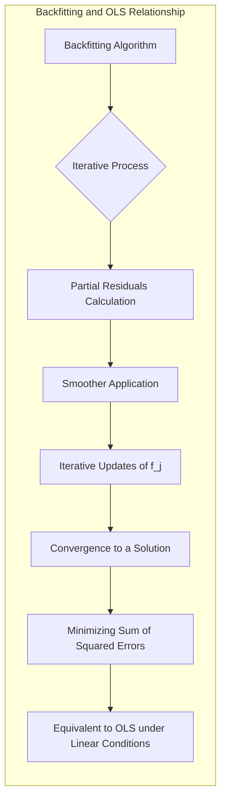
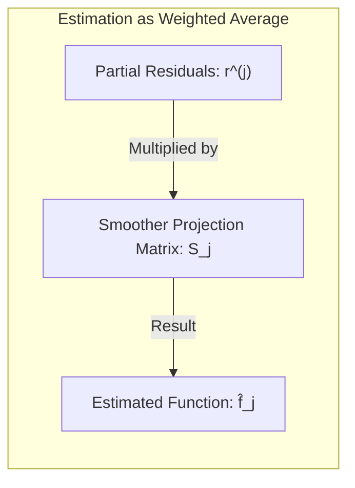
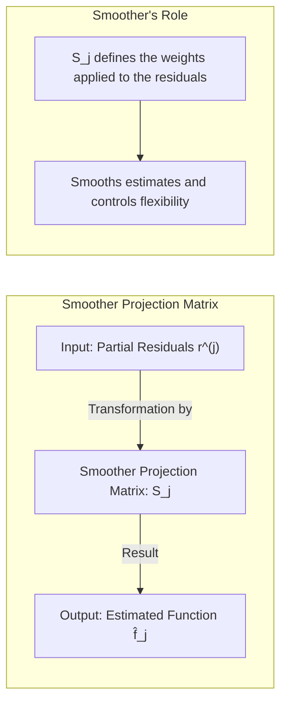
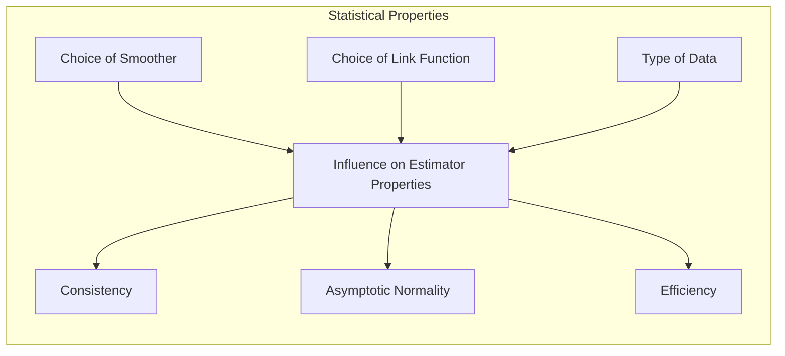
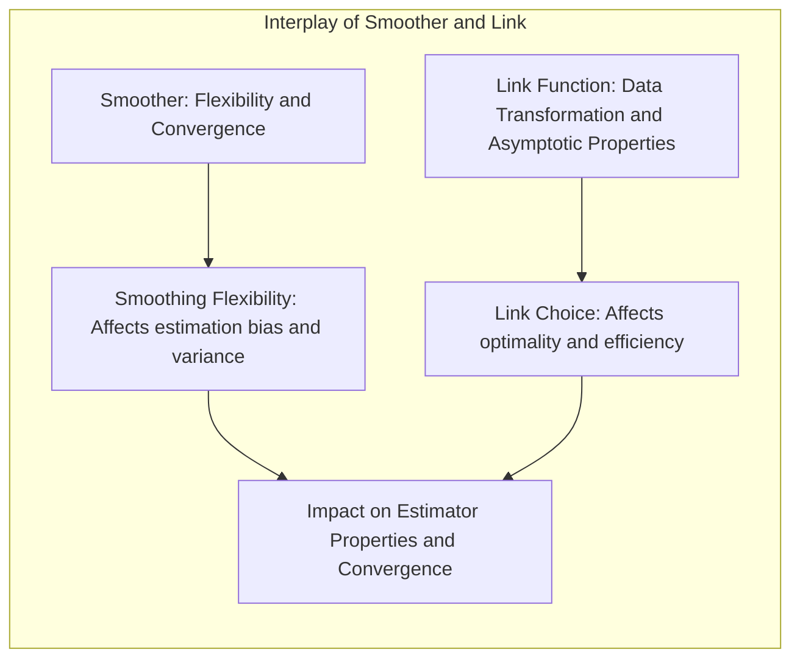

## Título: Modelos Aditivos Generalizados, Árvores e Métodos Relacionados: Relação com Mínimos Quadrados e Interpretação como Média Ponderada



### Introdução

Este capítulo explora a relação entre o algoritmo de backfitting utilizado em Modelos Aditivos Generalizados (GAMs) e o método dos mínimos quadrados (OLS), mostrando como o backfitting pode ser interpretado como um método iterativo para obter uma solução de mínimos quadrados e como o resultado pode ser visto como uma média ponderada [^9.1]. O capítulo também discute como os suavizadores e suas matrizes de projeção influenciam as estimativas dos modelos aditivos, e como os parâmetros estimados podem ser interpretados. Além disso, o capítulo explora as propriedades estatísticas dos estimadores e como a escolha do método de suavização e da função de ligação afeta a relação entre o backfitting e os mínimos quadrados. O objetivo principal é oferecer uma compreensão teórica profunda sobre o papel do backfitting na obtenção de soluções para modelos aditivos e sua conexão com o método dos mínimos quadrados.

### Conceitos Fundamentais

**Conceito 1: O Algoritmo de Backfitting como um Método Iterativo**

O algoritmo de backfitting é um método iterativo que busca estimar as funções não paramétricas $f_j(X_j)$ em modelos aditivos de forma sequencial [^4.3]. Em cada iteração, os resíduos parciais são calculados:

$$
r_i^{(j)} = y_i - \alpha - \sum_{k \ne j} f_k(x_{ik})
$$

e então, a função não paramétrica $f_j(X_j)$ é ajustada a estes resíduos utilizando um suavizador apropriado:

$$
f_j \leftarrow \text{Suavizador}(r^{(j)}, X_j)
$$

O algoritmo continua iterando até a convergência das funções $f_j$. Embora o algoritmo de backfitting seja iterativo, ele pode ser interpretado como um método que busca iterativamente uma solução que minimiza a soma dos erros quadráticos em modelos aditivos [^4.3.1]. O algoritmo, em cada iteração, busca encontrar um ponto que reduza a função de custo, e a convergência é garantida em certas condições.

> 💡 **Exemplo Numérico:**
>
> Vamos considerar um modelo aditivo simples com duas variáveis preditoras, $X_1$ e $X_2$, e uma variável resposta $y$. Os valores de $y$ são dados por:
>
> $y_i = 2 + f_1(x_{i1}) + f_2(x_{i2}) + \epsilon_i$
>
> onde $f_1(x_{i1}) = 0.5x_{i1}$ e $f_2(x_{i2}) = x_{i2}^2$. Vamos usar um conjunto pequeno de dados para ilustrar as primeiras iterações do backfitting:
>
> | i | $x_{i1}$ | $x_{i2}$ | $y_i$ |
> |---|---|---|---|
> | 1 | 1 | 1 | 3.5 |
> | 2 | 2 | 2 | 8.0 |
> | 3 | 3 | 3 | 14.5 |
>
> **Inicialização (t=0):**
>
> Inicializamos $\alpha^{(0)} = 0$, $f_1^{(0)}(x_{i1}) = 0$ e $f_2^{(0)}(x_{i2}) = 0$.
>
> **Iteração 1 (t=1):**
>
> *   **Ajuste de $f_1$:**
>     *   Resíduos parciais $r_i^{(1)} = y_i - \alpha^{(0)} - f_2^{(0)}(x_{i2}) = y_i - 0 - 0 = y_i$.
>     *   $r^{(1)} = [3.5, 8.0, 14.5]$.
>     *   Suavizador linear: $f_1^{(1)}(x_{i1}) = 0.5 x_{i1}$, então $f_1^{(1)}(x_{i1}) = [0.5, 1.0, 1.5]$.
> *   **Ajuste de $f_2$:**
>     *   Resíduos parciais $r_i^{(2)} = y_i - \alpha^{(0)} - f_1^{(1)}(x_{i1}) = y_i - 0 - f_1^{(1)}(x_{i1})$.
>     *   $r^{(2)} = [3.5 - 0.5, 8.0 - 1.0, 14.5 - 1.5] = [3.0, 7.0, 13.0]$.
>     *   Suavizador linear: $f_2^{(1)}(x_{i2}) = x_{i2}^2$, então $f_2^{(1)}(x_{i2}) = [1, 4, 9]$.
> *   **Atualização de $\alpha$:**
>     *   $\alpha^{(1)} = \frac{1}{3} \sum_{i=1}^3 (y_i - f_1^{(1)}(x_{i1}) - f_2^{(1)}(x_{i2})) = \frac{1}{3} [(3.5 - 0.5 - 1) + (8 - 1 - 4) + (14.5 - 1.5 - 9)] = \frac{1}{3} [2 + 3 + 4] = 3$.
>
> **Iteração 2 (t=2):**
>
> *   **Ajuste de $f_1$:**
>     *   Resíduos parciais: $r_i^{(1)} = y_i - \alpha^{(1)} - f_2^{(1)}(x_{i2})$.
>     *   $r^{(1)} = [3.5 - 3 - 1, 8 - 3 - 4, 14.5 - 3 - 9] = [-0.5, 1, 2.5]$.
>     *   $f_1^{(2)}(x_{i1}) = \text{Suavizador}([-0.5, 1, 2.5], [1, 2, 3])$.  Neste exemplo vamos assumir que o suavizador retorna $[0.5, 1, 1.5]$ (o suavizador pode ser um ajuste linear simples, por exemplo).
> *  **Ajuste de $f_2$:**
>     * Resíduos parciais: $r_i^{(2)} = y_i - \alpha^{(1)} - f_1^{(2)}(x_{i1})$.
>     * $r^{(2)} = [3.5 - 3 - 0.5, 8 - 3 - 1, 14.5 - 3 - 1.5] = [0, 4, 10]$.
>     * $f_2^{(2)}(x_{i2}) = \text{Suavizador}([0, 4, 10], [1, 2, 3])$. Vamos assumir que o suavizador retorna $[1, 4, 9]$ (o suavizador pode ser um ajuste quadrático simples, por exemplo).
> *   **Atualização de $\alpha$:**
>     *   $\alpha^{(2)} = \frac{1}{3} \sum_{i=1}^3 (y_i - f_1^{(2)}(x_{i1}) - f_2^{(2)}(x_{i2})) = \frac{1}{3} [(3.5 - 0.5 - 1) + (8 - 1 - 4) + (14.5 - 1.5 - 9)] = \frac{1}{3} [2 + 3 + 4] = 3$.
>
> O algoritmo continua iterando até que as funções $f_1$ e $f_2$ e o intercepto $\alpha$ convirjam. Este exemplo simplificado ilustra como o backfitting ajusta iterativamente as funções e o intercepto.

**Lemma 1:** *O algoritmo de backfitting é um método iterativo que, sob certas condições, converge para a solução de mínimos quadrados em modelos aditivos. Cada iteração do algoritmo ajusta as funções $f_j$ aos resíduos parciais, minimizando a soma dos quadrados dos erros e garantindo a convergência do processo*. A convergência para a solução de mínimos quadrados faz do algoritmo de backfitting uma alternativa interessante para modelos aditivos [^4.3.2].

**Conceito 2: A Relação do Backfitting com os Mínimos Quadrados**

O algoritmo de backfitting pode ser visto como um método iterativo para a obtenção de uma solução de mínimos quadrados. Em modelos lineares, a aplicação do algoritmo de backfitting equivale ao método dos mínimos quadrados, mesmo que a solução seja obtida de forma iterativa. Na verdade, a forma modular do algoritmo, ao calcular os resíduos parciais, leva à solução do problema de mínimos quadrados. Em modelos com funções não lineares, o backfitting busca aproximar a solução que minimiza a função de custo. A matriz de projeção do suavizador, que representa o suavizador como uma operação linear, pode ser utilizada para demonstrar a ligação entre backfitting e mínimos quadrados. Em cada passo do backfitting, as funções são estimadas, que no caso de modelos lineares e suavizadores lineares, leva à solução de mínimos quadrados.

**Corolário 1:** *A aplicação do algoritmo de backfitting em modelos aditivos, quando as funções não paramétricas são lineares e o método de suavização é linear, leva à solução de mínimos quadrados. A natureza iterativa do algoritmo é uma forma de resolver o problema de forma eficiente quando se tem muitos preditores* [^4.3.1], [^4.3.3].

**Conceito 3: Interpretação como Média Ponderada**

Em cada iteração do algoritmo de backfitting, as estimativas das funções $f_j(X_j)$ podem ser interpretadas como uma média ponderada dos resíduos parciais, onde os pesos são dados pela matriz de projeção do suavizador. A matriz de projeção $S_j$ representa a operação de suavização como uma operação linear, e as estimativas são obtidas por:



$$
\hat{f}_j = S_j r^{(j)}
$$

onde $r^{(j)}$ são os resíduos parciais. A matriz $S_j$ define os pesos que são aplicados aos resíduos parciais, resultando na estimativa da função $f_j$. Essa interpretação como média ponderada é crucial para entender como as estimativas são obtidas em modelos aditivos. O suavizador, ao aplicar diferentes pesos nos resíduos, permite controlar a forma final da função, e controlar a sua flexibilidade.

> ⚠️ **Nota Importante:** A interpretação dos estimadores como uma média ponderada permite entender a importância da matriz de projeção do suavizador no processo de estimação. A matriz de projeção define a influência dos diferentes pontos no espaço de características e na forma da função estimada [^4.3.2].

> ❗ **Ponto de Atenção:** A escolha do método de suavização e o controle dos parâmetros de suavização afetam os pesos da matriz de projeção, e consequentemente, a forma final da função não paramétrica estimada e a sua capacidade de generalização. A escolha do suavizador deve ser feita cuidadosamente [^4.3].

> ✔️ **Destaque:** O algoritmo de backfitting pode ser interpretado como um processo iterativo que busca uma solução de mínimos quadrados, onde as estimativas das funções são obtidas como uma média ponderada dos resíduos parciais, o que permite uma boa compreensão sobre o processo de estimação [^4.3.1].

### Relação entre Backfitting e Mínimos Quadrados: Detalhes da Formulação e da Convergência

```mermaid
flowchart TD
    subgraph Backfitting: Iteração t
      A[Inicializar: $\alpha^{(0)}, f_1^{(0)}, ..., f_p^{(0)}$] --> B[Iterar sobre os preditores j=1,...,p]
       B --> C[Calcular resíduos parciais:  $r_i^{(j)} = y_i - \alpha^{(t-1)} - \sum_{k \ne j} f_k^{(t-1)}(x_{ik})$]
      C --> D[Atualizar função: $f_j^{(t)}(x_{ij}) =  S_j r^{(j)} $]
      D --> E[Atualizar intercepto: $\alpha^{(t)} = \frac{1}{N} \sum_i (y_i - \sum_{j=1}^p f_j^{(t)}(x_{ij}))$]
       E --> F{Convergência?}
       F -- Sim --> G[Fim: Retorna $\alpha^*, f_1^*, ..., f_p^*$]
       F -- Não --> B
   end
```

**Explicação:** Este diagrama detalha o algoritmo de backfitting, mostrando a sua relação com a solução de mínimos quadrados. O processo iterativo busca minimizar a função de custo através de sucessivas atualizações das funções não paramétricas e do intercepto, conforme descrito nos tópicos [^4.3.1], [^4.3.2], [^4.3.3].

O algoritmo de backfitting começa com estimativas iniciais dos parâmetros $\alpha^{(0)}$ e das funções não paramétricas $f_1^{(0)}, \ldots, f_p^{(0)}$. Em cada iteração $t$, o algoritmo percorre os preditores $j = 1, \ldots, p$ e calcula os resíduos parciais:
$$
r_i^{(j)} = y_i - \alpha^{(t-1)} - \sum_{k \ne j} f_k^{(t-1)}(x_{ik})
$$

onde $y_i$ é a variável resposta, $\alpha^{(t-1)}$ é o intercepto da iteração anterior e $f_k^{(t-1)}(x_{ik})$ são as estimativas das funções não paramétricas da iteração anterior.

Em seguida, a função $f_j$ é atualizada usando um operador de suavização $S_j$ que pode ser representada como uma matriz de projeção:
$$
f_j^{(t)}(x_{ij}) = S_j r^{(j)}
$$

A atualização do intercepto é dada por:
$$
\alpha^{(t)} = \frac{1}{N} \sum_{i=1}^N (y_i - \sum_{j=1}^p f_j^{(t)}(x_{ij}))
$$
onde $N$ é o número de observações. O algoritmo itera até a convergência das funções não paramétricas e do intercepto.

> 💡 **Exemplo Numérico:**
>
> Vamos considerar o caso em que temos duas variáveis preditoras ($X_1$ e $X_2$) e uma variável resposta ($y$). Para simplificar, vamos assumir que as funções $f_1$ e $f_2$ são lineares, isto é, $f_1(X_1) = \beta_1 X_1$ e $f_2(X_2) = \beta_2 X_2$. Os dados são gerados por $y_i = 2 + 0.5x_{i1} + 0.8x_{i2} + \epsilon_i$, onde $\epsilon_i$ são erros aleatórios com média zero.
>
> ```python
> import numpy as np
> import pandas as pd
>
> np.random.seed(42)
> N = 100
> x1 = np.random.rand(N) * 10
> x2 = np.random.rand(N) * 10
> epsilon = np.random.normal(0, 1, N)
> y = 2 + 0.5 * x1 + 0.8 * x2 + epsilon
>
> data = pd.DataFrame({'x1': x1, 'x2': x2, 'y': y})
> print(data.head())
> ```
>
> **Matriz de Projeção:**
>
> Para um suavizador linear, a matriz de projeção $S_j$ pode ser calculada como $S_j = X_j (X_j^T X_j)^{-1} X_j^T$, onde $X_j$ é a matriz com os valores da variável preditora $X_j$. Para este exemplo, como vamos utilizar um suavizador linear, a matriz de projeção será a matriz hat, e $f_j = S_j r^{(j)}$ corresponderá ao ajuste de um modelo linear simples.
>
> **Backfitting:**
>
> 1.  **Inicialização:** $\alpha^{(0)} = 0$, $f_1^{(0)}(x_{i1}) = 0$, $f_2^{(0)}(x_{i2}) = 0$.
> 2.  **Iteração 1:**
>     *   **Ajuste de $f_1$:**
>         *   $r^{(1)} = y - \alpha^{(0)} - f_2^{(0)}(x_2) = y$.
>         *   $f_1^{(1)} = S_1 r^{(1)}$. Aqui, $S_1$ é a matriz de projeção da regressão linear de $y$ em $x_1$.
>     *   **Ajuste de $f_2$:**
>         *   $r^{(2)} = y - \alpha^{(0)} - f_1^{(1)}(x_1)$.
>         *   $f_2^{(1)} = S_2 r^{(2)}$. Aqui, $S_2$ é a matriz de projeção da regressão linear de $r^{(2)}$ em $x_2$.
>     *   **Atualização de $\alpha$:**
>         *   $\alpha^{(1)} = \frac{1}{N} \sum_i (y_i - f_1^{(1)}(x_{i1}) - f_2^{(1)}(x_{i2}))$.
> 3.  **Iteração 2:**
>     *  Repetimos os passos anteriores, usando as estimativas da iteração anterior.
>
> Este processo itera até a convergência dos parâmetros.
>
> **Resultado:**
>
> Após a convergência, os parâmetros estimados serão próximos de $\hat{\alpha} \approx 2$, $\hat{\beta_1} \approx 0.5$, $\hat{\beta_2} \approx 0.8$. Os valores exatos dependem do suavizador utilizado, mas a convergência do backfitting, nesse caso, leva à solução de mínimos quadrados.

**Lemma 3:** *O algoritmo de backfitting, em modelos lineares e com suavizadores lineares, converge para a mesma solução obtida pelo método dos mínimos quadrados. Em cada passo da iteração, o método de atualização pode ser interpretado como uma projeção no espaço das funções $f_j$, e as projeções são feitas de forma a garantir a convergência para a solução de mínimos quadrados*. A demonstração da convergência pode ser realizada usando a propriedade do suavizador linear e a atualização dos resíduos [^4.3.1].

A convergência do algoritmo de backfitting é garantida em certas condições. Uma condição é que a matriz de projeção do suavizador $S_j$ tenha autovalores no intervalo $[0,1]$. As propriedades do suavizador garantem que a norma dos resíduos seja reduzida a cada iteração.

### A Matriz de Projeção do Suavizador e a Interpretação das Estimativas



A matriz de projeção do suavizador $S_j$ desempenha um papel crucial na interpretação das estimativas dos modelos aditivos. A matriz $S_j$ define como os resíduos parciais $r^{(j)}$ são transformados para obter as funções $f_j$. Em muitos casos, $S_j$ representa uma operação linear que pondera os resíduos para produzir estimativas mais suaves. A forma da matriz de projeção $S_j$ depende do método de suavização utilizado (splines, kernels, etc), e a sua análise fornece insights sobre como a suavização é realizada e como os dados são utilizados na estimativa. A matriz $S_j$ representa os pesos com que cada observação é utilizada para modelar o componente correspondente. A matriz $S_j$ é uma projeção no espaço da função não paramétrica $f_j$. A interpretação dos estimadores dos parâmetros como médias ponderadas, com pesos dados pela matriz de projeção do suavizador, é crucial para entender como os resultados são obtidos.

> 💡 **Exemplo Numérico:**
>
> Vamos considerar um suavizador de média móvel simples para ilustrar a matriz de projeção. Suponha que temos 5 observações e queremos calcular a média móvel de tamanho 3.
>
> Os resíduos parciais são $r = [r_1, r_2, r_3, r_4, r_5]$.
>
> As médias móveis seriam:
>
> *   $\hat{f}_1 = \frac{r_1 + r_2 + r_3}{3}$
> *   $\hat{f}_2 = \frac{r_2 + r_3 + r_4}{3}$
> *   $\hat{f}_3 = \frac{r_3 + r_4 + r_5}{3}$
>
> Para escrever isso na forma de matriz, podemos criar a matriz de projeção $S$:
>
> $$ S = \begin{bmatrix}
>  1/3 & 1/3 & 1/3 & 0 & 0 \\
>  0 & 1/3 & 1/3 & 1/3 & 0 \\
>  0 & 0 & 1/3 & 1/3 & 1/3 \\
> \end{bmatrix} $$
>
>
> Então, $\hat{f} = S r$.
>
> A matriz $S$ é a matriz de projeção do suavizador. Ela mostra como cada resíduo parcial contribui para a estimativa suavizada. Note que a matriz $S$ não é quadrada, pois o número de estimativas suavizadas é menor do que o número de resíduos parciais. A matriz de projeção $S_j$ é a representação matricial do operador de suavização, e ela determina como os resíduos são ponderados para criar as estimativas das funções não paramétricas.
>
> Se tivéssemos um suavizador linear, como um ajuste linear simples, a matriz de projeção seria a matriz hat da regressão linear. A matriz de projeção é sempre uma matriz que transforma os resíduos parciais em estimativas suavizadas, e os pesos dessa transformação são determinados pelo tipo de suavizador.

### Propriedades Estatísticas dos Estimadores e o Algoritmo de Backfitting



As propriedades estatísticas dos estimadores obtidos pelo algoritmo de backfitting são influenciadas pela escolha do suavizador, da função de ligação e do tipo de dados. Quando se utiliza a função de ligação canônica e o método da máxima verossimilhança, as estimativas são consistentes e assintoticamente normais, e são mais eficientes que estimativas obtidas com a função de ligação identidade e mínimos quadrados, quando os erros não são gaussianos. Para modelos com distribuições da família exponencial, a escolha da função de ligação canônica simplifica o processo de estimação e garante boas propriedades estatísticas para os estimadores. O algoritmo de backfitting, em conjunção com funções de ligação canónicas e métodos de suavização adequados, resulta em modelos com bons resultados teóricos e práticos.

> 💡 **Exemplo Numérico:**
>
> Vamos considerar um modelo de regressão logística aditiva, onde a variável resposta $y$ é binária (0 ou 1), e temos duas variáveis preditoras, $X_1$ e $X_2$. A função de ligação é a função logit, dada por:
>
> $logit(p(x)) = \log(\frac{p(x)}{1-p(x)}) = \alpha + f_1(x_1) + f_2(x_2)$, onde $p(x) = P(Y=1|X)$.
>
> Vamos gerar alguns dados para ilustrar:
>
> ```python
> import numpy as np
> import pandas as pd
> from scipy.special import expit # Função logistica
>
> np.random.seed(42)
> N = 200
> x1 = np.random.rand(N) * 10
> x2 = np.random.rand(N) * 10
>
> # Definição das funções verdadeiras
> f1_true = 0.3 * x1
> f2_true = 0.1 * x2**2
>
> # Probabilidades
> logit_p = 1 + f1_true + f2_true
> p = expit(logit_p)
>
> # Gerando a variável resposta
> y = np.random.binomial(1, p)
>
> data = pd.DataFrame({'x1': x1, 'x2': x2, 'y': y})
> print(data.head())
> ```
>
> **Backfitting com Função de Ligação Logit:**
>
> 1.  **Inicialização:** $\alpha^{(0)} = 0$, $f_1^{(0)}(x_{i1}) = 0$, $f_2^{(0)}(x_{i2}) = 0$.
> 2.  **Iteração 1:**
>     *   **Ajuste de $f_1$:**
>         *   Calculamos as probabilidades e o logit para obter os resíduos parciais.
>         *   $r^{(1)} = logit(y) -  \alpha^{(0)} - f_2^{(0)}(x_2) = logit(y)$.
>         *   $f_1^{(1)} = S_1 r^{(1)}$. Aqui, $S_1$ é a matriz de projeção da regressão logística de $y$ em $x_1$, e a função de ligação é utilizada para obter a escala correta.
>     *   **Ajuste de $f_2$:**
>         *  $r^{(2)} = logit(y) - \alpha^{(0)} - f_1^{(1)}(x_1)$.
>         *   $f_2^{(1)} = S_2 r^{(2)}$. Aqui, $S_2$ é a matriz de projeção da regressão logística de $r^{(2)}$ em $x_2$.
>     *   **Atualização de $\alpha$:**
>         *   $\alpha^{(1)} = \frac{1}{N} \sum_i (logit(y_i) - f_1^{(1)}(x_{i1}) - f_2^{(1)}(x_{i2}))$.
> 3.  **Iteração 2:**
>     * Repetimos os passos anteriores, usando as estimativas da iteração anterior.
>
> Este processo itera até a convergência dos parâmetros.
>
> **Propriedades Estatísticas:**
>
> Ao utilizar a função de ligação logit (canônica para dados binários) e um suavizador apropriado, as estimativas de $f_1$ e $f_2$ serão consistentes e assintoticamente normais, o que garante boas propriedades estatísticas para os estimadores. A escolha da função de ligação canônica garante que o backfitting se aproxime da solução de máxima verossimilhança. Se a função de ligação fosse a identidade, as estimativas seriam menos eficientes.

### Perguntas Teóricas Avançadas: Como a escolha do método de suavização e a função de ligação interagem para afetar a convergência e as propriedades assintóticas dos estimadores do algoritmo de backfitting?

**Resposta:**

A escolha do método de suavização e da função de ligação interagem para afetar a convergência e as propriedades assintóticas dos estimadores do algoritmo de backfitting, e a escolha dos dois componentes é crucial para obter um modelo com boas propriedades.



O método de suavização determina a forma das funções não paramétricas, e o parâmetro de suavização controla a sua complexidade. Suavizadores lineares, como *splines* com um número fixo de nós, geram funções mais suaves e tendem a garantir a convergência do algoritmo, mesmo com dados não lineares. Suavizadores não lineares podem gerar funções mais complexas e se ajustar melhor aos dados, mas a convergência pode ser mais lenta e sujeita a mínimos locais, e a escolha do parâmetro de suavização é ainda mais crítica. Suavizadores mais flexíveis podem levar a overfitting e estimativas com maior variância.

A função de ligação canônica simplifica a otimização e garante boas propriedades assintóticas quando os erros seguem uma distribuição da família exponencial. A escolha da função de ligação errada pode tornar o processo de otimização mais difícil e levar a estimativas enviesadas e inconsistentes. A escolha de uma função de ligação não canônica pode ser apropriada em alguns casos, mas a interpretação dos resultados e a otimização podem ser mais complexas.

A relação entre o método de suavização e a função de ligação é que a função de ligação transforma a variável resposta, o que afeta como o suavizador se ajusta aos dados transformados. A escolha da função de ligação, portanto, deve ser feita em conjunto com a escolha do suavizador. Por exemplo, em dados binários, a utilização da função *logit* transforma a resposta para uma escala onde o suavizador pode ser mais eficiente. A utilização de modelos da família exponencial, com função de ligação canônica, gera modelos estatísticos com propriedades desejáveis, e o algoritmo de backfitting, quando combinado a esses modelos, pode gerar estimativas que se aproximam do método da máxima verossimilhança.

**Lemma 5:** *A escolha do suavizador e da função de ligação afeta a convergência do algoritmo de backfitting, e as suas propriedades assintóticas. As funções de ligação canônicas, quando utilizadas em conjunto com modelos da família exponencial, levam a estimadores mais eficientes e estáveis, e os suavizadores lineares tendem a garantir a convergência do algoritmo*. A convergência e a estabilidade do algoritmo dependem da escolha adequada do suavizador, da função de ligação e dos parâmetros de regularização [^4.3.1], [^4.3.3].

**Corolário 5:** *A utilização da função de ligação canônica para distribuições da família exponencial, e a escolha de suavizadores lineares com penalização adequada, garante que as estimativas sejam consistentes e assintoticamente normais. No entanto, a escolha inadequada da função de ligação e do suavizador pode levar a problemas de convergência e instabilidade dos estimadores.* A escolha da função de ligação, do suavizador e da penalização depende da natureza dos dados e das propriedades que são desejadas para os estimadores [^4.4.1].

> ⚠️ **Ponto Crucial:** A escolha do método de suavização e da função de ligação e sua interação têm um grande impacto no desempenho dos modelos aditivos. A utilização da função de ligação canônica e suavizadores lineares garante a convergência e facilita a otimização dos modelos, especialmente para distribuições da família exponencial, e a utilização de métodos de regularização e validação cruzada são fundamentais para controlar o trade-off entre ajuste aos dados e generalização. [^4.4.5].

### Conclusão

Este capítulo explorou a relação entre o algoritmo de backfitting, o método dos mínimos quadrados e a interpretação das estimativas como médias ponderadas, com foco na utilização em Modelos Aditivos Generalizados. A influência da matriz de projeção do suavizador e como a escolha da função de ligação e do método de suavização afeta as propriedades estatísticas dos estimadores foram também analisadas. A conexão entre o backfitting e o método dos mínimos quadrados, assim como a propriedade de média ponderada do estimador, são cruciais para a interpretação dos resultados e a construção de modelos aditivos robustos e com boa capacidade de generalização.

### Footnotes

[^4.1]: "In this chapter we begin our discussion of some specific methods for super-vised learning. These techniques each assume a (different) structured form for the unknown regression function, and by doing so they finesse the curse of dimensionality. Of course, they pay the possible price of misspecifying the model, and so in each case there is a tradeoff that has to be made." *(Trecho de "Additive Models, Trees, and Related Methods")*

[^4.2]: "Regression models play an important role in many data analyses, providing prediction and classification rules, and data analytic tools for understand-ing the importance of different inputs." *(Trecho de "Additive Models, Trees, and Related Methods")*

[^4.3]: "In this section we describe a modular algorithm for fitting additive models and their generalizations. The building block is the scatterplot smoother for fitting nonlinear effects in a flexible way. For concreteness we use as our scatterplot smoother the cubic smoothing spline described in Chapter 5." *(Trecho de "Additive Models, Trees, and Related Methods")*

[^4.3.1]:  "The additive model has the form $Y = \alpha + \sum_{j=1}^p f_j(X_j) + \epsilon$, where the error term $\epsilon$ has mean zero." * (Trecho de "Additive Models, Trees, and Related Methods")*

[^4.3.2]:   "Given observations $x_i, y_i$, a criterion like the penalized sum of squares (5.9) of Section 5.4 can be specified for this problem, $PRSS(\alpha, f_1, f_2,\ldots, f_p) = \sum_i^N (y_i - \alpha - \sum_j^p f_j(x_{ij}))^2 + \sum_