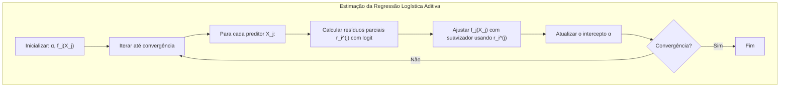
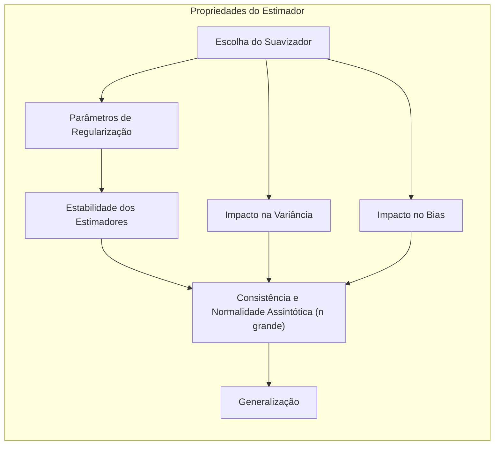
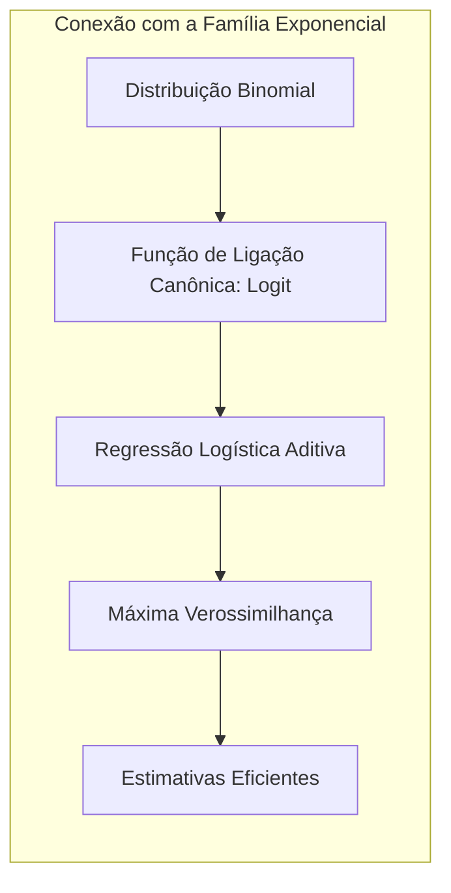
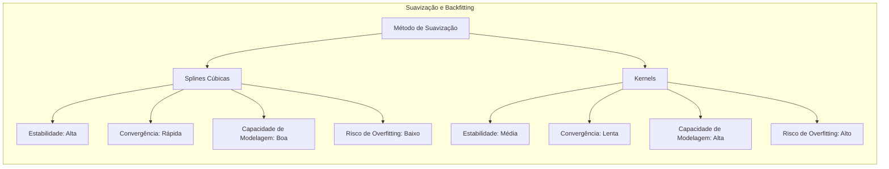

## Título: Modelos Aditivos Generalizados, Árvores e Métodos Relacionados: Aplicação em Regressão Logística Aditiva para Resultados Binários

### Introdução

Este capítulo explora a aplicação de Modelos Aditivos Generalizados (GAMs) em um contexto de regressão logística para modelar resultados binários, que é um problema comum em diversas áreas [^9.1]. Em modelos lineares, a regressão logística utiliza uma combinação linear dos preditores para modelar a probabilidade de um evento binário, mas este modelo pode ser limitado pela sua incapacidade de modelar relações não lineares.  GAMs, ao combinar a flexibilidade de modelos não paramétricos com a estrutura da regressão logística, oferecem uma abordagem alternativa para modelar dados binários quando as relações entre as variáveis e a resposta são não lineares.  O objetivo principal deste capítulo é detalhar a formulação matemática da regressão logística aditiva, a adaptação do algoritmo de backfitting para esse contexto e como a função *logit* e o método da máxima verossimilhança são utilizados no processo de estimação dos parâmetros. O foco está em fornecer uma compreensão profunda de como a modelagem da não linearidade afeta a qualidade do ajuste, a interpretabilidade e a capacidade de generalização dos resultados.

### Conceitos Fundamentais

**Conceito 1: Regressão Logística para Resultados Binários**

A regressão logística é um modelo estatístico utilizado para modelar a probabilidade de um evento binário (ou seja, $Y = 0$ ou $1$). O modelo utiliza a função *logit* como função de ligação para relacionar a probabilidade de sucesso, $p(X) = P(Y=1|X)$, com uma combinação linear dos preditores:

$$
\text{logit}(p(X)) = \log \left( \frac{p(X)}{1-p(X)} \right) = \alpha + \beta_1X_1 + \beta_2X_2 + \ldots + \beta_pX_p
$$

onde $\alpha$ é o intercepto, $\beta_j$ são os coeficientes de regressão e $X_j$ são os preditores.  A probabilidade $p(X)$ é dada por:

$$
p(X) = \frac{1}{1 + e^{-(\alpha + \beta_1X_1 + \ldots + \beta_pX_p)}}
$$

A regressão logística é amplamente utilizada para modelar dados binários devido à sua interpretabilidade e à sua capacidade de produzir probabilidades entre 0 e 1. No entanto, a utilização de uma combinação linear dos preditores limita a capacidade do modelo de capturar relações não lineares. A estimação dos parâmetros é realizada através do método da máxima verossimilhança.

> 💡 **Exemplo Numérico:**
>
> Suponha que estamos modelando a probabilidade de um cliente comprar um produto ($Y=1$) com base em sua idade ($X_1$) e renda ($X_2$). Após ajustar um modelo de regressão logística, obtemos os seguintes coeficientes: $\alpha = -3$, $\beta_1 = 0.05$, e $\beta_2 = 0.001$.
>
> Para um cliente com idade de 40 anos e renda de 50000, a função logit seria:
>
> $\text{logit}(p(X)) = -3 + 0.05 \times 40 + 0.001 \times 50000 = -3 + 2 + 50 = 49$
>
> A probabilidade estimada de compra seria:
>
> $p(X) = \frac{1}{1 + e^{-49}} \approx 1$
>
> Isso sugere uma probabilidade muito alta de compra para este cliente, devido à sua alta renda.
>
> Por outro lado, para um cliente com idade de 20 anos e renda de 20000:
>
> $\text{logit}(p(X)) = -3 + 0.05 \times 20 + 0.001 \times 20000 = -3 + 1 + 20 = 18$
>
> $p(X) = \frac{1}{1 + e^{-18}} \approx 1$
>
> Mesmo com uma idade menor, a alta renda ainda leva a uma alta probabilidade de compra.
>
> Para um cliente com idade de 60 anos e renda de 10000:
>
> $\text{logit}(p(X)) = -3 + 0.05 \times 60 + 0.001 \times 10000 = -3 + 3 + 10 = 10$
>
> $p(X) = \frac{1}{1 + e^{-10}} \approx 1$
>
> Aqui, a idade mais avançada e a renda ainda resultam em uma alta probabilidade de compra. Este exemplo ilustra como a combinação linear dos preditores afeta a probabilidade prevista e como a função logit transforma esses valores em uma probabilidade entre 0 e 1.

**Lemma 1:** *A regressão logística modela a probabilidade de um evento binário utilizando a função *logit* como função de ligação, e busca uma combinação linear de preditores que seja apropriada para a modelagem de dados binários. As estimativas são obtidas utilizando o método da máxima verossimilhança* [^4.4.1], [^4.4.2], [^4.4.3].

**Conceito 2: Regressão Logística Aditiva com GAMs**

A regressão logística aditiva utiliza um modelo GAM para modelar a relação entre a probabilidade de um evento binário e os preditores, de modo a generalizar a regressão logística clássica e adicionar flexibilidade para modelar dados não lineares. O modelo é dado por:

$$
\text{logit}(p(X)) = \log \left( \frac{p(X)}{1-p(X)} \right) = \alpha + f_1(X_1) + f_2(X_2) + \ldots + f_p(X_p)
$$

onde $f_j(X_j)$ são funções não paramétricas de cada preditor $X_j$. A função *logit* é utilizada como função de ligação para garantir que a probabilidade resultante esteja entre 0 e 1.  Os modelos GAMs, ao utilizar funções não paramétricas, permitem uma modelagem flexível de efeitos não lineares que são difíceis de serem capturados por modelos lineares.

> 💡 **Exemplo Numérico:**
>
> Continuando o exemplo anterior, suponha que a relação entre a idade e a probabilidade de compra não seja linear. Em vez de um coeficiente linear $\beta_1X_1$, utilizamos uma função não paramétrica $f_1(X_1)$. Da mesma forma, a relação entre renda e probabilidade de compra também pode não ser linear, então usamos a função $f_2(X_2)$. O modelo aditivo seria:
>
> $\text{logit}(p(X)) = \alpha + f_1(X_1) + f_2(X_2)$
>
> Digamos que após o ajuste do GAM, encontramos que:
>
> $f_1(X_1) = 0.002X_1^2 - 0.08X_1$
>
> $f_2(X_2) = 0.0000001X_2^2 + 0.0005X_2$
>
> e $\alpha = -2$.
>
> Para o mesmo cliente com idade de 40 e renda de 50000, temos:
>
> $f_1(40) = 0.002 * 40^2 - 0.08 * 40 = 3.2 - 3.2 = 0$
>
> $f_2(50000) = 0.0000001 * 50000^2 + 0.0005 * 50000 = 250 + 25 = 275$
>
> $\text{logit}(p(X)) = -2 + 0 + 275 = 273$
>
> $p(X) = \frac{1}{1 + e^{-273}} \approx 1$
>
> Para um cliente com idade de 20 e renda de 20000:
>
> $f_1(20) = 0.002 * 20^2 - 0.08 * 20 = 0.8 - 1.6 = -0.8$
>
> $f_2(20000) = 0.0000001 * 20000^2 + 0.0005 * 20000 = 40 + 10 = 50$
>
> $\text{logit}(p(X)) = -2 - 0.8 + 50 = 47.2$
>
> $p(X) = \frac{1}{1 + e^{-47.2}} \approx 1$
>
> Para um cliente com idade de 60 e renda de 10000:
>
> $f_1(60) = 0.002 * 60^2 - 0.08 * 60 = 7.2 - 4.8 = 2.4$
>
> $f_2(10000) = 0.0000001 * 10000^2 + 0.0005 * 10000 = 10 + 5 = 15$
>
> $\text{logit}(p(X)) = -2 + 2.4 + 15 = 15.4$
>
> $p(X) = \frac{1}{1 + e^{-15.4}} \approx 1$
>
> Este exemplo ilustra como as funções não paramétricas modelam a relação entre preditores e a função logit, permitindo que o modelo capture efeitos não lineares. Note que a forma das funções $f_1$ e $f_2$ foram escolhidas apenas para fins de ilustração. Na prática, elas são estimadas pelo algoritmo de *backfitting* usando suavizadores.

**Corolário 1:** *A regressão logística aditiva, ao combinar a função *logit* e funções não paramétricas em GAMs, oferece um modelo flexível para dados binários, o que permite modelar não linearidades nos dados com maior capacidade de aproximação que modelos lineares.  A flexibilidade dos modelos GAMs permite que modelos que se ajustam a diferentes tipos de não linearidades sejam criados*.  A escolha da função *logit* como função de ligação garante que a resposta esteja no intervalo adequado [0,1] [^4.4.1], [^4.4.2], [^4.4.4].

**Conceito 3: O Algoritmo de Backfitting na Regressão Logística Aditiva**

O algoritmo de backfitting é utilizado para estimar as funções não paramétricas $f_j(X_j)$ em um contexto de regressão logística. O algoritmo busca iterativamente estimar os parâmetros de cada função, usando o conceito de resíduos parciais. Em cada iteração, e para cada função $f_j$, os resíduos parciais são calculados usando a função de ligação:
$$
r_i^{(j)} = \eta_i + \frac{y_i - p_i}{p_i (1 - p_i)} - \alpha - \sum_{k \ne j} f_k(x_{ik})
$$
onde $\eta_i = \alpha + \sum_{j}f_j(x_{ij})$ é a estimativa corrente da combinação linear dos preditores, $p_i$ é a probabilidade estimada da iteração anterior e $y_i$ é a variável resposta.  O suavizador é utilizado para obter uma nova estimativa para $f_j$ baseando-se nos resíduos parciais:
$$
f_j \leftarrow \text{Suavizador}(r^{(j)}, X_j)
$$
O processo é repetido até a convergência das funções. O algoritmo de backfitting na regressão logística aditiva utiliza aproximações iterativas do método da máxima verossimilhança para estimar os parâmetros.  O uso da função *logit* e o algoritmo de backfitting permitem que a regressão logística aditiva utilize modelos com flexibilidade para modelar as não linearidades nos dados.

> 💡 **Exemplo Numérico:**
>
> Vamos ilustrar uma iteração do algoritmo de backfitting. Suponha que temos um conjunto de dados com uma variável resposta binária $y_i$ e dois preditores, $X_1$ (idade) e $X_2$ (renda). Inicializamos $\alpha = -1$, $f_1(X_1) = 0$, e $f_2(X_2) = 0$.
>
> Para a primeira iteração, iteramos sobre os preditores:
>
> **Iteração para $f_1(X_1)$:**
>
> 1.  **Calcular $\eta_i$ e $p_i$:** Para cada observação $i$, calculamos $\eta_i = \alpha + f_1(x_{i1}) + f_2(x_{i2}) = -1 + 0 + 0 = -1$. Então, $p_i = \frac{1}{1 + e^{-(-1)}} = \frac{1}{1 + e} \approx 0.269$.
>
> 2.  **Calcular os resíduos parciais:** Para cada observação $i$, calculamos os resíduos parciais $r_i^{(1)} = \eta_i + \frac{y_i - p_i}{p_i (1 - p_i)} - \alpha - f_2(x_{i2}) = -1 + \frac{y_i - 0.269}{0.269 (1 - 0.269)} - (-1) - 0 =  \frac{y_i - 0.269}{0.197}$.
>
>     Por exemplo, para a observação $i=1$, se $y_1 = 1$, $r_1^{(1)} \approx \frac{1-0.269}{0.197} \approx 3.71$. Se $y_2 = 0$, $r_2^{(1)} \approx \frac{0-0.269}{0.197} \approx -1.37$.
>
> 3.  **Suavizar $r^{(1)}$ em relação a $X_1$:** Aplicamos um suavizador (por exemplo, uma *spline*) aos resíduos parciais $r^{(1)}$ em relação a $X_1$ para obter uma nova estimativa $f_1(X_1)$.
>
> **Iteração para $f_2(X_2)$:**
>
> 1.  **Calcular $\eta_i$ e $p_i$:** Usando a nova estimativa de $f_1(X_1)$ e $f_2(X_2)=0$, recalculamos $\eta_i$ e $p_i$.
>
> 2.  **Calcular os resíduos parciais:** Para cada observação $i$, calculamos os resíduos parciais $r_i^{(2)} = \eta_i + \frac{y_i - p_i}{p_i (1 - p_i)} - \alpha - f_1(x_{i1})$.
>
> 3.  **Suavizar $r^{(2)}$ em relação a $X_2$:** Aplicamos um suavizador aos resíduos parciais $r^{(2)}$ em relação a $X_2$ para obter uma nova estimativa $f_2(X_2)$.
>
> **Atualizar o Intercepto:**
>
> 1.  **Atualizar $\alpha$:** $\alpha \leftarrow \frac{1}{N} \sum_{i=1}^N (y_i - f_1(x_{i1}) - f_2(x_{i2}))$.
>
> Este processo é repetido até a convergência. Note que os valores numéricos apresentados são apenas ilustrativos e os valores reais dependem do conjunto de dados e da implementação do suavizador.

> ⚠️ **Nota Importante:** A adaptação do algoritmo de backfitting para regressão logística aditiva envolve a utilização da função *logit* na formulação dos resíduos parciais, e a estimação iterativa dos parâmetros de máxima verossimilhança.  A utilização do método iterativo garante que os parâmetros sejam estimados eficientemente [^4.4.3].

> ❗ **Ponto de Atenção:** A convergência do backfitting pode ser afetada pela separabilidade dos dados e pelo número de observações. Modelos com muita flexibilidade e poucas observações podem apresentar problemas na convergência [^4.4.2].

> ✔️ **Destaque:** A combinação da regressão logística com a flexibilidade de GAMs permite uma modelagem eficiente de dados binários, utilizando o algoritmo de backfitting com a função *logit* e as funções não paramétricas para cada preditor [^4.4.1].

### Modelagem de Resultados Binários com Regressão Logística Aditiva: Detalhes da Estimação e Otimização

**Explicação:** Este diagrama ilustra os passos do algoritmo de backfitting para regressão logística aditiva, destacando o uso da função *logit* e a estimação iterativa dos parâmetros.  O diagrama detalha os passos de otimização e como eles são integrados em um método iterativo, conforme descrito em [^4.4.1], [^4.4.2], [^4.4.3].

O algoritmo de backfitting para regressão logística aditiva começa com a inicialização dos parâmetros, incluindo o intercepto $\alpha$ e as funções não paramétricas $f_j(X_j)$. Em cada iteração do algoritmo, o seguinte procedimento é executado:

1.  **Cálculo dos resíduos parciais com a função logit:** Para cada preditor $X_j$, os resíduos parciais são calculados utilizando a função de ligação *logit*:
    $$
    r_i^{(j)} = \eta_i + \frac{y_i - p_i}{p_i (1 - p_i)} - \alpha - \sum_{k \ne j} f_k(x_{ik})
    $$
    onde $\eta_i$ é a combinação linear dos preditores, $y_i$ é o valor observado da variável resposta (0 ou 1), e $p_i = \frac{1}{1 + e^{-\eta_i}}$ é a probabilidade estimada. A função *logit* é utilizada para transformar os valores preditos em um espaço onde a modelagem linear é mais adequada.

2.  **Ajuste das Funções Não Paramétricas:** Uma função não paramétrica $f_j$ é ajustada utilizando um suavizador adequado, usando os resíduos parciais como variável resposta e o preditor $X_j$. Os parâmetros do suavizador são estimados para cada preditor de maneira iterativa:
    $$
    f_j \leftarrow \text{Suavizador}(r^{(j)}, X_j)
    $$

3.  **Atualização do Intercepto:** O intercepto $\alpha$ é atualizado utilizando a equação:
        $$
            \alpha \leftarrow \frac{1}{N} \sum_{i=1}^N (y_i - \sum_{j=1}^p f_j(x_{ij}))
        $$

A convergência do algoritmo é verificada pela comparação das mudanças nas estimativas das funções $f_j$ e do intercepto, utilizando uma métrica apropriada e um limiar de convergência.  O processo de estimação busca iterativamente a minimização da função de custo, o que é equivalente a maximização da *log-likelihood* para modelos generalizados.

**Lemma 2:** *A utilização do algoritmo de backfitting em regressão logística aditiva permite a estimativa dos parâmetros e das funções não paramétricas de forma eficiente e iterativa, com uma aproximação do método da máxima verossimilhança. A utilização da função logit como função de ligação garante que o modelo utilize uma escala adequada para dados binários*.  A escolha da função *logit* garante que a modelagem da probabilidade seja consistente com a natureza binária da resposta [^4.4.1].

### Propriedades Estatísticas dos Estimadores e a Influência do Suavizador

As propriedades estatísticas dos estimadores obtidos pelo algoritmo de backfitting em regressão logística aditiva dependem da escolha do suavizador e dos parâmetros de regularização. Para modelos com um número grande de observações, os estimadores são consistentes e assintoticamente normais. A utilização de penalidades no processo de estimação das funções não paramétricas contribui para a estabilidade dos estimadores e evita o overfitting, o que aumenta a capacidade de generalização. A escolha adequada do suavizador e dos parâmetros de regularização é essencial para garantir que o modelo tenha boas propriedades estatísticas.  Modelos com baixa variância e baixo *bias* garantem melhor desempenho em novos dados, e a escolha apropriada do suavizador e do parâmetro de suavização são cruciais para isso. A utilização de métodos de validação cruzada para encontrar os melhores parâmetros de suavização é uma prática recomendada para o ajuste dos modelos [^4.3.1].

> 💡 **Exemplo Numérico:**
>
> Suponha que estamos usando *splines* cúbicas como suavizador. A função $f_j(X_j)$ é representada por uma combinação linear de funções base, e o parâmetro de suavização $\lambda_j$ controla a complexidade da função. Um $\lambda_j$ grande penaliza a complexidade, resultando em uma função mais suave (menos flexível), enquanto um $\lambda_j$ pequeno permite mais flexibilidade, o que pode levar a overfitting.
>
> Vamos supor que, para um dado preditor $X_1$, após a aplicação do algoritmo de backfitting com diferentes valores de $\lambda_1$, obtemos os seguintes resultados em um conjunto de teste:
>
> | $\lambda_1$ | Erro de Classificação | Complexidade |
> |------------|----------------------|--------------|
> | 0.01       | 0.25                 | Alta         |
> | 0.1        | 0.18                 | Média        |
> | 1          | 0.22                 | Baixa        |
> | 10         | 0.30                 | Muito Baixa  |
>
> O erro de classificação é uma métrica que avalia o desempenho do modelo na classificação binária (menor é melhor). A complexidade indica a flexibilidade da função.
>
> Como podemos observar, um valor de $\lambda_1 = 0.1$ resulta no menor erro de classificação, indicando um bom compromisso entre flexibilidade e generalização. Valores muito pequenos (0.01) levam a overfitting (alta complexidade e erro alto em dados não vistos), enquanto valores muito grandes (10) levam a underfitting (baixa complexidade e erro alto em dados não vistos). Este exemplo ilustra a importância da escolha do parâmetro de suavização para obter um bom desempenho do modelo.

### Conexão com a Família Exponencial

A regressão logística aditiva se encaixa no contexto da família exponencial, já que a função *logit* é a função de ligação canônica para a distribuição binomial, que é um dos membros da família exponencial.  A escolha da função de ligação canônica garante que as estimativas sejam eficientes e que o método da máxima verossimilhança seja apropriado para a estimação dos parâmetros.  A utilização da função *logit* como função de ligação garante que o algoritmo de backfitting se ajuste de forma adequada para dados binários, e a utilização de suavizadores e regularização garante que modelos mais flexíveis e com capacidade de generalização sejam gerados.

### Perguntas Teóricas Avançadas: Como a utilização de diferentes métodos de suavização influencia a convergência e a estabilidade do algoritmo de backfitting em regressão logística aditiva e qual o impacto na capacidade de modelagem?

**Resposta:**

A escolha do método de suavização tem um impacto direto na convergência e estabilidade do algoritmo de backfitting em modelos de regressão logística aditiva, e na capacidade do modelo de ajustar os dados de forma adequada.

Métodos de suavização mais simples como *splines* cúbicos, podem levar a uma convergência mais estável, uma vez que o uso das funções *splines* garante que a função resultante seja suave.  A escolha do número de nós da *spline* também tem um papel fundamental, pois um número menor de nós limita a complexidade da função, ao passo que um número muito grande de nós pode levar a instabilidade do modelo e overfitting. O parâmetro de suavização penaliza a complexidade e contribui para a estabilidade do algoritmo.

Outros métodos de suavização, como *kernels*, podem ser utilizados para modelar relações mais complexas, mas podem apresentar maior dificuldade de convergência. O parâmetro de suavização, nesses métodos, também controla o grau de suavização da função, e deve ser cuidadosamente ajustado.  A escolha do método de suavização deve levar em consideração a complexidade do padrão de não linearidade dos dados.

Em geral, suavizadores com baixa flexibilidade podem garantir maior estabilidade e convergência, mas podem perder desempenho na modelagem de relações complexas, enquanto que suavizadores mais flexíveis podem levar a overfitting e instabilidade dos parâmetros, mesmo que se ajustem mais aos dados de treino. A escolha do método de suavização, portanto, afeta diretamente a estabilidade e a capacidade de modelagem do algoritmo de backfitting.

A escolha da função de ligação, particularmente a função *logit*, utilizada na regressão logística, garante que o algoritmo de backfitting seja utilizado com a função de custo apropriada para o modelo de classificação binária. O uso de outras funções de ligação pode levar a resultados inesperados e problemas de convergência. A interação entre suavizador e função de ligação deve ser considerada durante o processo de modelagem, e a escolha da função de ligação apropriada garante a aplicação correta dos métodos de otimização e suavização.

> 💡 **Exemplo Numérico:**
>
> Imagine que estamos modelando a probabilidade de um paciente ter uma certa doença (Y=1) com base em duas variáveis: dose de um medicamento ($X_1$) e idade do paciente ($X_2$). Vamos comparar o uso de *splines* cúbicas e *kernels* como suavizadores.
>
> **Splines Cúbicas:**
>
> *   **Estabilidade:** Usar *splines* cúbicas com um número razoável de nós (por exemplo, 5-10) e um parâmetro de suavização adequado geralmente leva a uma convergência estável do algoritmo de *backfitting*. As funções são suaves e bem comportadas.
> *   **Complexidade:** A complexidade é controlada pelo número de nós e pelo parâmetro de suavização. Um parâmetro de suavização grande resulta em uma função mais linear, enquanto um parâmetro pequeno pode capturar mais não linearidades.
>
> **Kernels:**
>
> *   **Estabilidade:** O uso de *kernels* (por exemplo, gaussiano) pode levar a uma maior flexibilidade, mas também pode tornar o algoritmo de *backfitting* mais instável, especialmente com um parâmetro de largura de banda pequeno (o que permite mais flexibilidade). A convergência pode ser mais lenta ou até mesmo não ocorrer em alguns casos.
> *   **Complexidade:** A complexidade é controlada pelo parâmetro de largura de banda do *kernel*. Um parâmetro pequeno permite que o modelo se ajuste muito bem aos dados de treino, mas pode levar a overfitting, enquanto um parâmetro grande resulta em uma função mais suave.
>
> **Resultados Comparativos:**
>
> | Método de Suavização | Convergência | Estabilidade | Capacidade de Modelagem | Risco de Overfitting |
> |----------------------|-------------|--------------|------------------------|----------------------|
> | Splines Cúbicas      | Rápida       | Alta         | Boa                    | Baixo                |
> | Kernels              | Lenta       | Média        | Alta                   | Alto                 |
>
> No exemplo, *splines* cúbicas podem ser preferíveis se a estabilidade e a convergência forem importantes, enquanto *kernels* podem ser usados se houver fortes indícios de relações não lineares complexas, mas com cautela para evitar overfitting. A escolha do método de suavização deve ser baseada na natureza dos dados e nos objetivos do modelo.

**Lemma 5:** *A escolha do método de suavização influencia a convergência e estabilidade do algoritmo de backfitting. A utilização de *splines* e outros suavizadores com um parâmetro de suavização adequado garante que os parâmetros sejam estimados de forma estável e o método convirja para a solução de otimização. Suavizadores mais complexos devem ser utilizados com cuidado para evitar problemas de convergência e overfitting* [^4.3.1].

**Corolário 5:** *A combinação da função *logit* na regressão logística aditiva com um método de suavização apropriado e um parâmetro de suavização adequado garante que o algoritmo de backfitting convirja para resultados adequados, e que a escolha do suavizador afete a capacidade de modelagem das relações não lineares nos dados, e, portanto, a capacidade de generalização do modelo*. A interação entre função de ligação e método de suavização deve ser cuidadosamente considerada para que o resultado do modelo seja eficiente e confiável [^4.4.1].

> ⚠️ **Ponto Crucial:** A escolha do método de suavização deve ser feita em conjunto com a escolha da função de ligação e do parâmetro de suavização para que o algoritmo de backfitting obtenha resultados estáveis, com um bom compromisso entre flexibilidade e generalização do modelo. Os métodos de suavização e o parâmetro de suavização, portanto, são importantes para garantir a convergência e a qualidade do modelo em regressão logística aditiva [^4.3.2].

### Conclusão

Este capítulo apresentou a aplicação de Modelos Aditivos Generalizados (GAMs) na regressão logística para modelar resultados binários. O algoritmo de backfitting, juntamente com a função *logit* e a utilização de métodos de suavização e regularização, oferece uma abordagem flexível e eficiente para modelar dados binários com relações não lineares. A análise detalhada da formulação matemática, dos métodos de estimação e otimização e da escolha da função de ligação fornece uma compreensão profunda sobre como o modelo de regressão logística aditiva funciona e como ele pode ser aplicado em problemas reais de classificação binária.

### Footnotes

[^4.1]: "In this chapter we begin our discussion of some specific methods for super-vised learning. These techniques each assume a (different) structured form for the unknown regression function, and by doing so they finesse the curse of dimensionality. Of course, they pay the possible price of misspecifying the model, and so in each case there is a tradeoff that has to be made." *(Trecho de "Additive Models, Trees, and Related Methods")*

[^4.2]: "Regression models play an important role in many data analyses, providing prediction and classification rules, and data analytic tools for understand-ing the importance of different inputs." *(Trecho de "Additive Models, Trees, and Related Methods")*

[^4.3]: "In this section we describe a modular algorithm for fitting additive models and their generalizations. The building block is the scatterplot smoother for fitting nonlinear effects in a flexible way. For concreteness we use as our scatterplot smoother the cubic smoothing spline described in Chapter 5." *(Trecho de "Additive Models, Trees, and Related Methods")*

[^4.3.1]:  "The additive model has the form $Y = \alpha + \sum_{j=1}^p f_j(X_j)