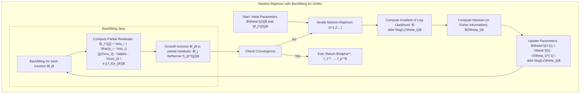
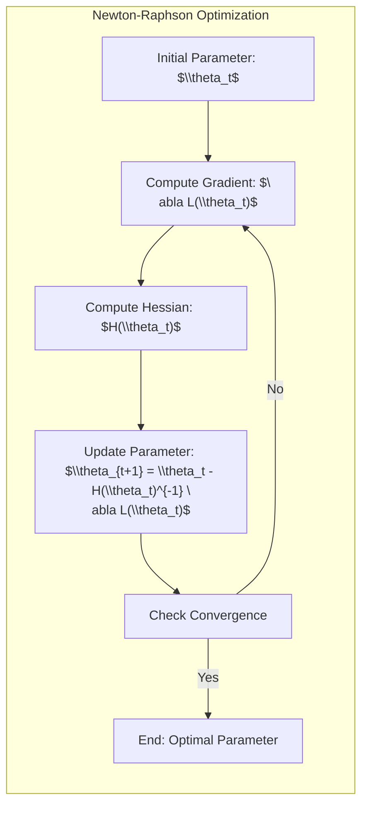
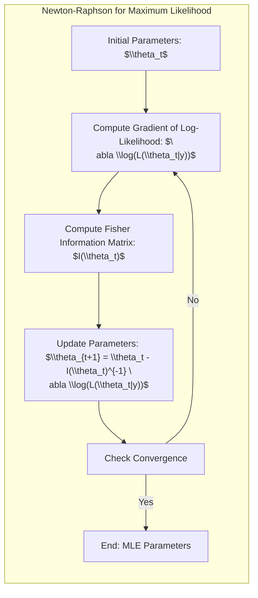
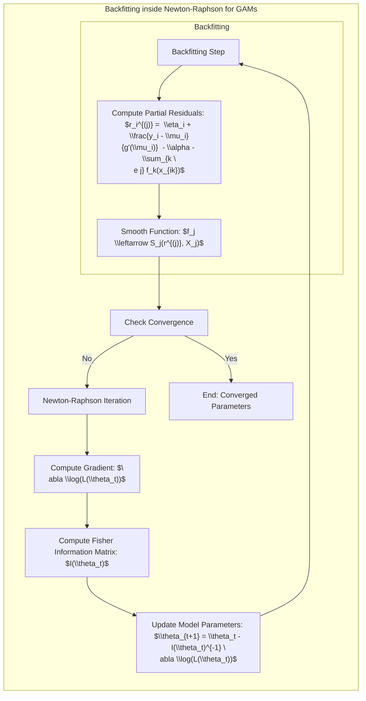

## Título: Modelos Aditivos Generalizados, Árvores e Métodos Relacionados: Algoritmos de Backfitting Aninhados em Procedimentos de Newton-Raphson



### Introdução

Este capítulo explora a combinação do algoritmo de backfitting com o método de Newton-Raphson para a estimação de parâmetros em Modelos Aditivos Generalizados (GAMs) [^9.1]. A combinação desses dois métodos é particularmente útil quando se lida com funções de verossimilhança complexas, que não podem ser otimizadas diretamente. O procedimento de Newton-Raphson é um método iterativo para otimização de funções que se baseia no cálculo do gradiente e do hessiano da função de verossimilhança. Ao aninhar o algoritmo de backfitting no procedimento de Newton-Raphson, GAMs com diferentes funções de ligação e distribuições da família exponencial podem ser ajustados de maneira eficiente. O objetivo principal deste capítulo é detalhar a formulação matemática e os passos de otimização, bem como a relação entre o algoritmo de backfitting, o método de Newton-Raphson e a teoria da família exponencial. O foco principal é apresentar uma visão aprofundada da integração desses métodos para obter estimativas confiáveis e robustas em modelos estatísticos.

### Conceitos Fundamentais

**Conceito 1: O Método de Newton-Raphson para Otimização**

O método de Newton-Raphson é um método iterativo para encontrar os zeros de uma função ou para encontrar o máximo (ou mínimo) de uma função. Em otimização, o método de Newton-Raphson busca encontrar o máximo (ou mínimo) de uma função através da utilização do gradiente e do hessiano da função. Em cada iteração, o método atualiza os parâmetros usando a seguinte equação:
$$
\theta_{t+1} = \theta_t - H(\theta_t)^{-1} \nabla L(\theta_t)
$$
onde $\theta_t$ são os parâmetros na iteração $t$, $H(\theta_t)$ é o hessiano da função $L(\theta)$ avaliado em $\theta_t$, e $\nabla L(\theta_t)$ é o gradiente da função $L(\theta)$ avaliado em $\theta_t$. A iteração continua até a convergência dos parâmetros. O método de Newton-Raphson é um método poderoso para a otimização de funções convexas com derivadas, e a velocidade de convergência é geralmente maior que a do método do gradiente descendente.

> 💡 **Exemplo Numérico:**
>
> Suponha que queremos encontrar o mínimo da função $L(\theta) = \theta^2 - 4\theta + 7$. O gradiente é $\nabla L(\theta) = 2\theta - 4$ e o hessiano é $H(\theta) = 2$.
>
> 1. **Inicialização:** Começamos com um valor inicial para $\theta$, por exemplo, $\theta_0 = 0$.
> 2. **Iteração 1:**
>    - Gradiente: $\nabla L(\theta_0) = 2(0) - 4 = -4$
>    - Hessiano: $H(\theta_0) = 2$
>    - Atualização: $\theta_1 = \theta_0 - H(\theta_0)^{-1} \nabla L(\theta_0) = 0 - (2)^{-1}(-4) = 2$
> 3. **Iteração 2:**
>    - Gradiente: $\nabla L(\theta_1) = 2(2) - 4 = 0$
>    - Hessiano: $H(\theta_1) = 2$
>    - Atualização: $\theta_2 = \theta_1 - H(\theta_1)^{-1} \nabla L(\theta_1) = 2 - (2)^{-1}(0) = 2$
>
> O método convergiu para $\theta=2$ em duas iterações. O valor mínimo da função é $L(2) = 2^2 - 4(2) + 7 = 3$. Observe que em uma função quadrática o método de Newton-Raphson converge em um passo se o ponto inicial for diferente do valor crítico.

**Lemma 1:** *O método de Newton-Raphson utiliza informação da curvatura da função de custo, através do hessiano, para encontrar o máximo (ou mínimo). A convergência do método é mais rápida quando comparada com métodos baseados no gradiente. No entanto, o método de Newton-Raphson pode ter problemas com funções não convexas e, por isso, métodos mais complexos devem ser utilizados*. O método de Newton-Raphson é uma ferramenta valiosa para problemas de otimização com funções diferenciáveis [^4.4.2], [^4.4.3].



**Conceito 2: A Adaptação do Método de Newton-Raphson para Máxima Verossimilhança**

O método de Newton-Raphson pode ser adaptado para a estimação da máxima verossimilhança, onde o objetivo é encontrar os parâmetros que maximizam a *log-likelihood*:

$$
\hat{\theta} = \arg\max_\theta \log(L(\theta|y))
$$

Na adaptação do método de Newton-Raphson para a máxima verossimilhança, o gradiente da função de *log-likelihood* é utilizado no lugar do gradiente da função, e a matriz de informação de Fisher é utilizada no lugar do hessiano. A matriz de informação de Fisher é o negativo da esperança do hessiano da *log-likelihood* e é dada por:
$$
I(\theta) = -E\left[ \frac{\partial^2 \log(L(\theta|y))}{\partial \theta \partial \theta^T} \right]
$$

A matriz de informação de Fisher representa uma aproximação do hessiano. A forma iterativa da atualização dos parâmetros em modelos de máxima verossimilhança é dada por:
$$
\theta_{t+1} = \theta_t - I(\theta_t)^{-1} \nabla \log(L(\theta_t|y))
$$
onde $I(\theta_t)$ é a matriz de informação de Fisher e $\nabla \log(L(\theta_t|y))$ é o gradiente da *log-likelihood* avaliado em $\theta_t$.

> 💡 **Exemplo Numérico:**
>
> Considere um modelo de regressão logística onde a probabilidade de sucesso $p$ é modelada por $logit(p) = \theta_0 + \theta_1 x$. Temos um conjunto de dados com duas observações:
>
> - $y_1 = 1$, $x_1 = 2$
> - $y_2 = 0$, $x_2 = 1$
>
> A função de *log-likelihood* é dada por:
>
> $ \log(L(\theta|y)) = y_1 \log(p_1) + (1-y_1)\log(1-p_1) + y_2 \log(p_2) + (1-y_2)\log(1-p_2) $
>
> onde $p_i = \frac{1}{1 + \exp(-(\theta_0 + \theta_1 x_i))}$.
>
> Para simplificar, vamos calcular o gradiente e a matriz de informação para $\theta_0$ e $\theta_1$ usando a função de *log-likelihood* e a aproximação da matriz de informação de Fisher. Os cálculos completos para o gradiente e o hessiano são complexos, mas podemos usar um algoritmo numérico para encontrar os valores de $\theta_0$ e $\theta_1$.
>
> 1. **Inicialização:** Começamos com $\theta_0 = 0$ e $\theta_1 = 0$.
> 2. **Iteração 1:**
>   - Calcular o gradiente da *log-likelihood* $\nabla \log(L(\theta_t|y))$ avaliado em $\theta_t = [0, 0]$.
>   - Calcular a matriz de informação de Fisher $I(\theta_t)$ avaliada em $\theta_t = [0, 0]$.
>   - Atualizar os parâmetros: $\theta_{t+1} = \theta_t - I(\theta_t)^{-1} \nabla \log(L(\theta_t|y))$.
>
> Usando um software estatístico ou um pacote de otimização numérica em Python (como `scipy.optimize` ou `statsmodels`), encontramos que após algumas iterações, os estimadores de máxima verossimilhança são aproximadamente $\hat{\theta_0} \approx -1.098$ e $\hat{\theta_1} \approx 0.753$.
>
> A matriz de informação de Fisher é a aproximação da curvatura da função de verossimilhança e é utilizada para atualizar os parâmetros em cada iteração do algoritmo de Newton-Raphson. O processo se repete até que os parâmetros convirjam para os valores que maximizam a função de verossimilhança.



**Corolário 1:** *A adaptação do método de Newton-Raphson para a máxima verossimilhança permite encontrar os estimadores de máxima verossimilhança de forma iterativa. O uso da matriz de informação de Fisher, em vez do hessiano, garante que os parâmetros estimados sejam consistentes e assintoticamente eficientes*. A adaptação do método de Newton-Raphson para MLE é uma ferramenta poderosa para modelagem estatística [^4.4.4].

**Conceito 3: Algoritmos de Backfitting Aninhados em Procedimentos de Newton-Raphson**

Em Modelos Aditivos Generalizados (GAMs) com função de ligação, o método de Newton-Raphson pode ser usado em conjunto com o algoritmo de backfitting. Neste caso, o algoritmo de backfitting é utilizado para estimar as funções não paramétricas de forma iterativa, em cada passo do algoritmo de Newton-Raphson. O processo geral é dado por:

1.  **Inicializar:** Inicializa os parâmetros, o intercepto $\alpha$ e as funções $f_j(X_j)$
2.  **Iterar:**
    1.  Em cada iteração do Newton-Raphson, calcula os parâmetros utilizando:
         $$
            \theta_{t+1} = \theta_t - I(\theta_t)^{-1} \nabla \log(L(\theta_t|y))
            $$
         onde $\theta$ representa todos os parâmetros do modelo, incluindo as funções $f_j(X_j)$.
    2.  Para estimar as funções $f_j$, usa o algoritmo de backfitting:
          1.   Calcular os resíduos parciais:
              $$
               r_i^{(j)} =  \eta_i + \frac{y_i - \mu_i}{g'(\mu_i)}  - \alpha - \sum_{k \ne j} f_k(x_{ik})
               $$
             onde  $\eta_i = \alpha + \sum_{j}f_j(x_{ij})$ e $\mu_i = g^{-1}(\eta_i)$.
          2.   Ajustar a função $f_j$ aos resíduos parciais:
              $$
             f_j \leftarrow Suavizador(r^{(j)}, X_j)
             $$

3.  **Verificar Convergência:** Avalia a convergência dos parâmetros e das funções $f_j$, e termina a iteração quando os parâmetros convirgem.

> ⚠️ **Nota Importante:** A combinação do algoritmo de backfitting com o método de Newton-Raphson permite estimar os parâmetros em modelos GAMs com diferentes funções de ligação, através da otimização da função de *log-likelihood*. Essa combinação garante que o modelo tenha boas propriedades estatísticas e seja capaz de modelar dados complexos [^4.4.2].

> ❗ **Ponto de Atenção:** A implementação dessa abordagem é mais complexa e requer a escolha apropriada do algoritmo de otimização, do suavizador e dos parâmetros de regularização. O método pode ser computacionalmente mais intensivo, e a convergência pode ser mais lenta do que em modelos lineares [^4.4.3].

> ✔️ **Destaque:** A combinação do algoritmo de backfitting com o método de Newton-Raphson oferece uma abordagem poderosa para estimar modelos GAMs com diferentes funções de ligação, especialmente em modelos da família exponencial, e leva a resultados mais precisos e com boas propriedades estatísticas [^4.4.1].

### Algoritmos de Backfitting Aninhados no Newton-Raphson: Implementação e Detalhes de Otimização



O processo começa com a inicialização dos parâmetros: o intercepto $\alpha^{(0)}$ e as funções não paramétricas $f_j^{(0)}(X_j)$, o processo de otimização é iterativo, e em cada iteração $t$ do Newton-Raphson, os seguintes passos são executados:

1.  **Cálculo do Gradiente da *Log-Verossimilhança*:** O gradiente da *log-likelihood* $\nabla \log(L(\theta_t|y))$ é calculado para todos os parâmetros do modelo, onde $\theta_t$ representa todos os parâmetros, incluindo os parâmetros das funções $f_j$. O gradiente é utilizado para encontrar a direção de máximo da função de verossimilhança.
2.  **Cálculo do Hessiano (Matriz de Informação de Fisher):** O hessiano, ou uma aproximação do hessiano utilizando a matriz de informação de Fisher $I(\theta_t)$, é calculada, sendo o hessiano da *log-likelihood* com respeito a todos os parâmetros.
3.  **Atualização dos Parâmetros:** Os parâmetros do modelo, incluindo o intercepto e as funções não paramétricas, são atualizados utilizando o método de Newton-Raphson:
    $$
    \theta_{t+1} = \theta_t - I(\theta_t)^{-1} \nabla \log(L(\theta_t|y))
    $$

4.  **Algoritmo de Backfitting (Aninhado):** Para estimar as funções não paramétricas $f_j$, o algoritmo de backfitting é aplicado:
    1.  Os resíduos parciais são calculados:
        $$
         r_i^{(j)} = \eta_i + \frac{y_i - \mu_i}{g'(\mu_i)} - \alpha^{(t-1)} - \sum_{k \ne j} f_k^{(t-1)}(x_{ik})
        $$

        onde $\eta_i =  \alpha + \sum_{j}f_j(x_{ij})$ e $\mu_i = g^{-1}(\eta_i)$. A função de ligação $g$ é utilizada para garantir que os resíduos parciais sejam consistentes com a distribuição da variável resposta.
    2.  As funções não paramétricas $f_j$ são atualizadas utilizando um suavizador:
        $$
         f_j^{(t)}(x_{ij}) = S_j r^{(j)}
        $$

5.  **Verificação da Convergência:** A convergência do algoritmo é verificada monitorando a mudança dos parâmetros estimados, e a otimização é interrompida quando os parâmetros convergem.

O algoritmo de backfitting, aninhado dentro do procedimento de Newton-Raphson, permite que os parâmetros de GAMs com diferentes funções de ligação sejam estimados de forma eficiente. O uso de uma aproximação do hessiano usando a matriz de informação de Fisher simplifica o processo de otimização, e torna-o mais eficiente computacionalmente.

> 💡 **Exemplo Numérico:**
>
> Vamos simular um exemplo simplificado para ilustrar o backfitting dentro do Newton-Raphson. Considere um modelo GAM com duas variáveis preditoras $X_1$ e $X_2$ e uma variável resposta $Y$ com uma função de ligação identidade (modelo aditivo).
>
> $Y = \alpha + f_1(X_1) + f_2(X_2) + \epsilon$
>
> Vamos gerar dados simulados:
>
> ```python
> import numpy as np
> import pandas as pd
> from scipy.interpolate import interp1d
>
> np.random.seed(42)
> n = 100
> x1 = np.linspace(0, 10, n)
> x2 = np.linspace(-5, 5, n)
> f1_true = np.sin(x1)
> f2_true = 0.5 * x2 ** 2
> alpha_true = 2
> epsilon = np.random.normal(0, 0.5, n)
> y = alpha_true + f1_true + f2_true + epsilon
>
> df = pd.DataFrame({'x1': x1, 'x2': x2, 'y': y})
> ```
>
> 1. **Inicialização:**
>    - Inicializamos $\alpha = 0$, $f_1(X_1) = 0$, e $f_2(X_2) = 0$.
>
> 2.  **Iteração Newton-Raphson (t=1):**
>    -  **Cálculo do Gradiente e Hessiano:** Para um modelo aditivo com função de ligação identidade, a função de verossimilhança é a soma dos quadrados dos erros. O gradiente e hessiano são calculados com respeito a $\alpha$ e aos valores de $f_1$ e $f_2$ nos pontos de dados.
>        -  $\nabla \log(L(\theta_t))$ corresponde a $\sum (y_i - \alpha - f_1(x_{i1}) - f_2(x_{i2}))$.
>        -  $I(\theta_t)$ é a matriz de informação de Fisher, que para este caso simplificado, é dada por $-E[\frac{\partial^2 L}{\partial \theta \partial \theta^T}]$.
>    - **Atualização dos Parâmetros:** Atualizamos $\alpha$ usando a iteração de Newton-Raphson.
>
> 3. **Backfitting (Aninhado):**
>    -  **Para $f_1$**:
>         -  Calcular os resíduos parciais $r_i^{(1)} = y_i - \alpha - f_2(x_{i2})$. Como $f_2$ é zero na primeira iteração, $r_i^{(1)} = y_i - \alpha$.
>         - Ajustar $f_1$ aos resíduos usando um suavizador (por exemplo, um *spline*): $f_1(x_{i1}) = S_1 r^{(1)}$.
>    -  **Para $f_2$**:
>         - Calcular os resíduos parciais $r_i^{(2)} = y_i - \alpha - f_1(x_{i1})$.
>         - Ajustar $f_2$ aos resíduos usando um suavizador: $f_2(x_{i2}) = S_2 r^{(2)}$.
>
> 4.  **Iterações:** Repetir os passos 2 e 3 até que os parâmetros e as funções convirjam.
>
> O processo é iterativo e, a cada iteração, as funções $f_1$ e $f_2$ são atualizadas usando os resíduos parciais, e os parâmetros são atualizados usando o método de Newton-Raphson. A convergência é alcançada quando as funções e os parâmetros não mudam significativamente entre as iterações.
>
> ```python
> import matplotlib.pyplot as plt
> from scipy.interpolate import CubicSpline
>
> def backfitting_newton_raphson(df, max_iter=100, tol=1e-5):
>    alpha = 0
>    f1 = np.zeros_like(df['x1'])
>    f2 = np.zeros_like(df['x2'])
>
>    alpha_history = []
>    f1_history = []
>    f2_history = []
>
>    for iteration in range(max_iter):
>        # Newton-Raphson Step (simplified for linear model)
>        alpha_new = np.mean(df['y'] - f1 - f2)
>
>        # Backfitting Step
>        r1 = df['y'] - alpha_new - f2
>        spl_f1 = CubicSpline(df['x1'], r1)
>        f1 = spl_f1(df['x1'])
>
>        r2 = df['y'] - alpha_new - f1
>        spl_f2 = CubicSpline(df['x2'], r2)
>        f2 = spl_f2(df['x2'])
>
>        alpha_history.append(alpha_new)
>        f1_history.append(f1)
>        f2_history.append(f2)
>
>        # Convergence check
>        alpha_diff = np.abs(alpha_new - alpha)
>        if alpha_diff < tol:
>            print(f"Converged at iteration {iteration}")
>            break
>        alpha = alpha_new
>
>    return alpha, f1, f2, alpha_history, f1_history, f2_history
>
> alpha_est, f1_est, f2_est, alpha_hist, f1_hist, f2_hist = backfitting_newton_raphson(df)
>
> # Plotting
> plt.figure(figsize=(12, 6))
>
> plt.subplot(1, 3, 1)
> plt.plot(x1, f1_true, label='True f1')
> plt.plot(x1, f1_est, label='Estimated f1')
> plt.title('f1(x1)')
> plt.legend()
>
> plt.subplot(1, 3, 2)
> plt.plot(x2, f2_true, label='True f2')
> plt.plot(x2, f2_est, label='Estimated f2')
> plt.title('f2(x2)')
> plt.legend()
>
> plt.subplot(1,3,3)
> plt.plot(range(len(alpha_hist)), alpha_hist, label='Alpha History')
> plt.title('Alpha Convergence')
> plt.legend()
>
> plt.tight_layout()
> plt.show()
> ```
>
> Este exemplo ilustra como o backfitting, aninhado dentro de um ciclo simplificado de Newton-Raphson, atualiza iterativamente as funções $f_1$ e $f_2$ e o intercepto $\alpha$ até que a convergência seja alcançada.

**Lemma 3:** *O algoritmo de backfitting, quando aninhado no procedimento de Newton-Raphson, permite que os parâmetros de modelos GAMs sejam estimados através de uma abordagem iterativa, que combina a convergência do Newton-Raphson com a capacidade do backfitting de tratar funções não paramétricas. A convergência do processo depende da convexidade da função e da escolha do suavizador*. A combinação do método de Newton-Raphson e do algoritmo de backfitting é uma abordagem eficiente para modelos não lineares e com funções de ligação [^4.4.2].

### A Matriz de Informação de Fisher e a Convergência do Algoritmo

A utilização da matriz de informação de Fisher no procedimento de Newton-Raphson simplifica o cálculo do Hessiano, e garante que a iteração convirja para uma solução de máximo local da função de verossimilhança. A matriz de informação de Fisher é uma aproximação do Hessiano que garante boas propriedades assintóticas dos estimadores quando o número de observações é grande. No contexto de modelos da família exponencial, a utilização da matriz de informação de Fisher é uma prática comum devido à sua simplicidade e à sua capacidade de gerar estimativas consistentes. A escolha da função de ligação canônica também simplifica a formulação da matriz de informação e garante um processo de otimização eficiente.

### Propriedades Estatísticas dos Estimadores e a Estabilidade da Solução

As propriedades estatísticas dos estimadores obtidos pelo algoritmo de backfitting aninhado em um procedimento de Newton-Raphson dependem da escolha do suavizador, da função de ligação e da distribuição da variável resposta. Quando a função de ligação é canônica e a distribuição pertence à família exponencial, os estimadores são consistentes e assintoticamente normais. A escolha adequada do suavizador e do parâmetro de regularização contribui para a estabilidade da solução e para a capacidade de generalização do modelo. O uso de técnicas de validação cruzada é importante para a escolha dos melhores parâmetros e garantir que o modelo tenha um bom desempenho. A combinação do algoritmo de backfitting com o método de Newton-Raphson permite um ajuste eficiente de modelos complexos, com boas propriedades estatísticas e capacidade de generalização.

### Perguntas Teóricas Avançadas: Como diferentes funções de ligação e métodos de suavização interagem para afetar a convergência e a estabilidade do algoritmo de backfitting aninhado em um Newton Raphson?

**Resposta:**

A escolha da função de ligação e do método de suavização tem um impacto direto na convergência e estabilidade do algoritmo de backfitting aninhado em um procedimento de Newton-Raphson, e a sua combinação é crucial para obter um modelo que tenha um bom desempenho.

Funções de ligação canônicas, derivadas da família exponencial, simplificam a estrutura da função de *log-likelihood*, e facilitam a convergência do método de Newton-Raphson e do backfitting. Funções de ligação não canônicas podem tornar o processo de otimização mais difícil e lento, e aumentar a probabilidade de o algoritmo de backfitting convergir para um mínimo local em vez do mínimo global. A escolha de uma função de ligação inadequada pode dificultar o ajuste da função de custo e a estabilidade das estimativas.

Métodos de suavização mais simples, como *splines* com um número fixo de nós, podem levar a um algoritmo com convergência mais estável, pois restringem a complexidade das funções não paramétricas, evitando problemas de instabilidade. Suavizadores mais complexos, por outro lado, podem levar a modelos com maior flexibilidade e capacidade de modelar não linearidades, mas também podem dificultar a convergência e aumentar o risco de overfitting. A escolha do suavizador adequado deve considerar o *trade-off* entre a capacidade de modelagem e a estabilidade do modelo.

A escolha dos parâmetros de suavização, juntamente com a função de ligação, determina a convexidade da função de custo e o quão fácil é o problema de otimização. Parâmetros de suavização mais altos restringem a flexibilidade do modelo, o que pode levar a uma convergência mais rápida e mais estável. Por outro lado, um parâmetro de suavização baixo permite uma maior flexibilidade, o que pode levar a uma convergência mais lenta e ao risco de overfitting e instabilidade das estimativas. O ajuste desses parâmetros deve ser feito cuidadosamente através de métodos de validação cruzada.

> 💡 **Exemplo Numérico:**
>
> Vamos considerar um exemplo onde a função de ligação influencia a convergência. Suponha que temos dados binários onde a resposta $Y$ é 0 ou 1, e temos uma variável preditora $X$. Vamos comparar o uso da função de ligação logística (canônica) e a função de ligação identidade (não canônica).
>
> 1. **Função de Ligação Logística:**
>    - $g(\mu) = \log(\frac{\mu}{1-\mu}) = \alpha + f(X)$
>    - Usando a função de ligação logística, a função de verossimilhança é convexa, o que facilita a convergência do algoritmo de Newton-Raphson e backfitting.
>
> 2. **Função de Ligação Identidade:**
>    - $g(\mu) = \mu = \alpha + f(X)$
>    - Usando a função de ligação identidade, a função de verossimilhança pode não ser convexa, o que pode tornar a convergência mais difícil e lenta. O risco de convergir para um mínimo local em vez do mínimo global também é maior. Além disso, a função de ligação identidade pode produzir probabilidades fora do intervalo [0,1].
>
> Para ilustrar, podemos gerar dados simulados e ajustar modelos com as duas funções de ligação:
>
> ```python
> import numpy as np
> import pandas as pd
> from scipy.interpolate import CubicSpline
> import statsmodels.api as sm
> import matplotlib.pyplot as plt
>
> np.random.seed(42)
> n = 100
> x = np.linspace(-5, 5, n)
> f_true = 1 / (1 + np.exp(-x))  # Função logística para gerar probabilidades
> p = f_true
> y = np.random.binomial(1, p, n)
>
> df = pd.DataFrame({'x': x, 'y': y})
>
> def fit_gam_identity(df, max_iter=100, tol=1e-5):
>     alpha = 0
>     f = np.zeros_like(df['x'])
>     alpha_history = []
>     f_history = []
>
>     for iteration in range(max_iter):
>         alpha_new = np.mean(df['y'] - f)
>         r = df['y'] - alpha_new
>         spl_f = CubicSpline(df['x'], r)
>         f = spl_f(df['x'])
>
>         alpha_history.append(alpha_new)
>         f_history.append(f)
>
>         if np.abs(alpha_new - alpha) < tol:
>             print(f"Converged at iteration {iteration} with identity link")
>             break
>         alpha = alpha_new
>
>     return alpha, f, alpha_history, f_history
>
>
> def fit_gam_logistic(df, max_iter=100, tol=1e-5):
>    X = sm.add_constant(df['x'])
>    model = sm.Logit(df['y'], X)
>    results = model.fit(disp=False)
>
>    alpha = results.params[0]
>    beta = results.params[1]
>    f_est = beta * df['x']
>    alpha_history = [alpha]
>    f_history = [f_est]
>
>    return alpha, f_est, alpha_history, f_history
>
>
> alpha_identity, f_identity, alpha_hist_identity, f_hist_identity = fit_gam_identity(df)
> alpha_logistic, f_logistic, alpha_hist_logistic, f_hist_logistic = fit_gam_logistic(df)
>
> plt.figure(figsize=(12, 6))
>
> plt.subplot(1, 2, 1)
> plt.plot(x, p, label='True Probability')
> plt.plot(x, 1/(1+np.exp(-(alpha_logistic + f_logistic))), label='Logistic Link')
> plt.plot(x, alpha_identity + f_identity, label='Identity Link')
> plt.title("Estimated Probabilities")
> plt.legend()
>
> plt.subplot(1,2,2)
> plt.plot(range(len(alpha_hist_identity)), alpha_hist_identity, label='Identity Link')
> plt.plot(range(len(alpha_hist_logistic)), alpha_hist_logistic, label='Logistic Link')
> plt.title("Alpha Convergence")
> plt.legend()
>
> plt.tight_layout()
> plt.show()
>