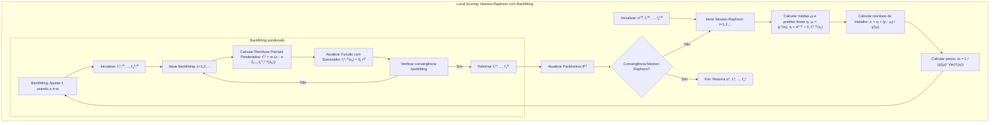
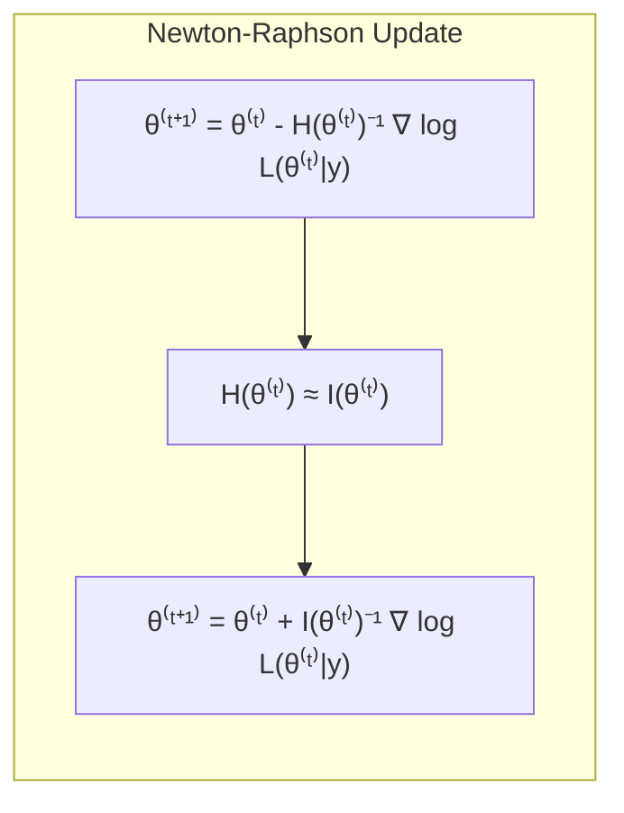
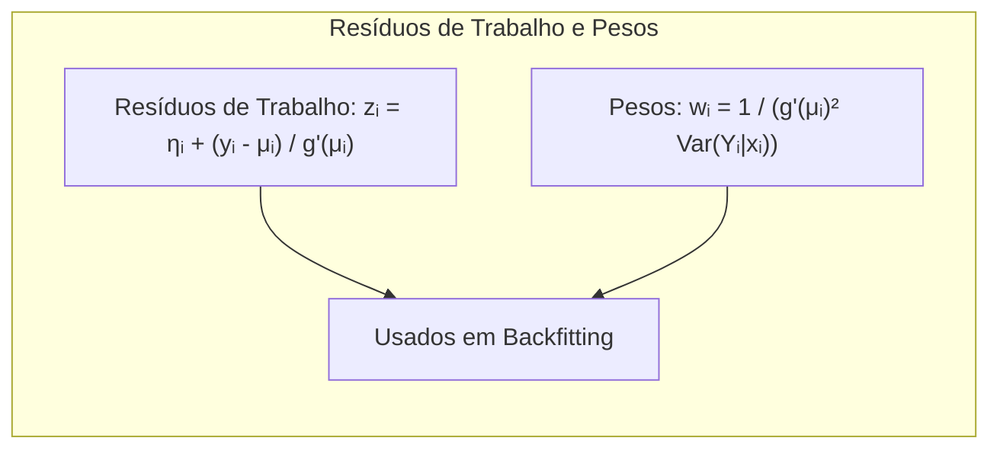
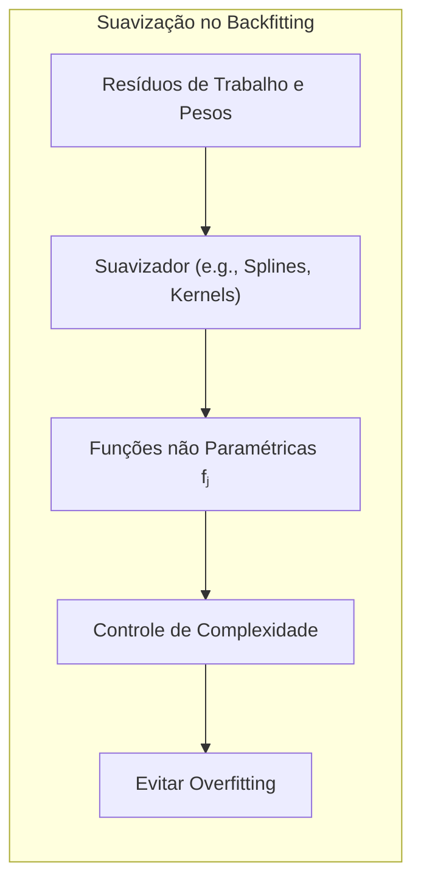
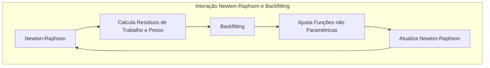
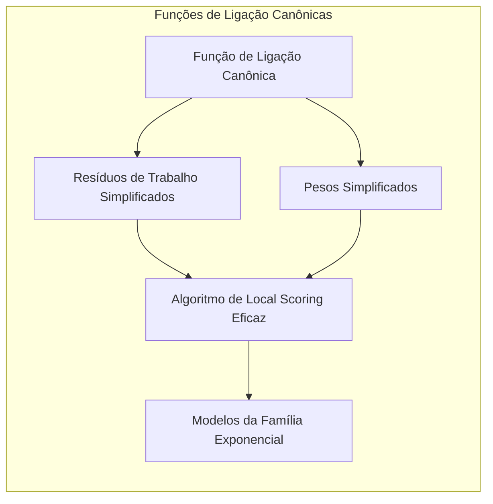
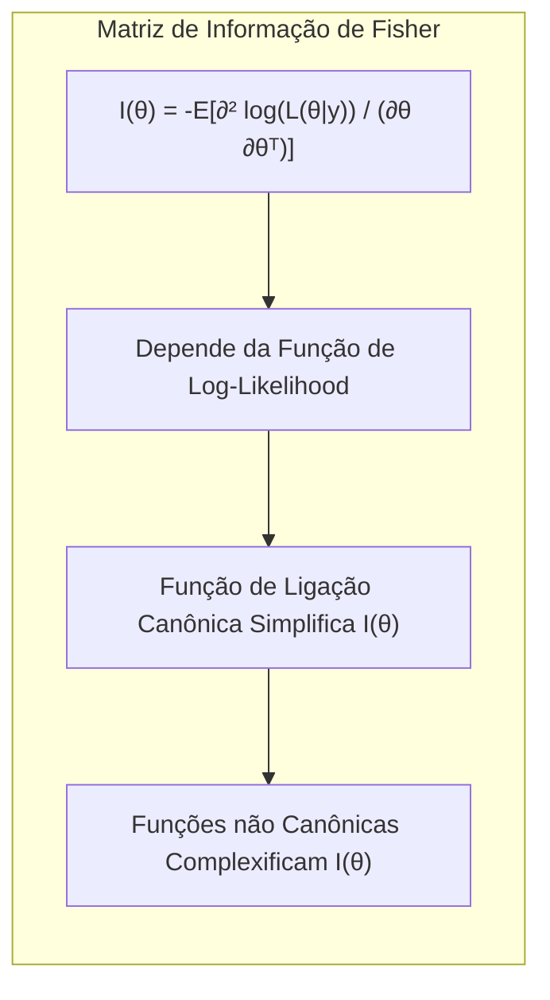
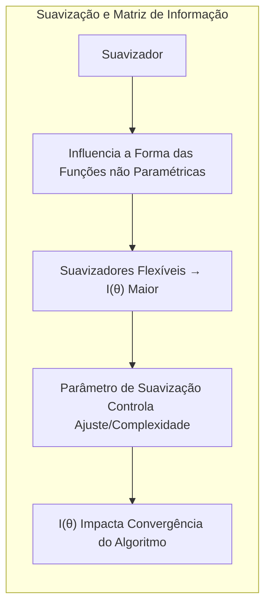
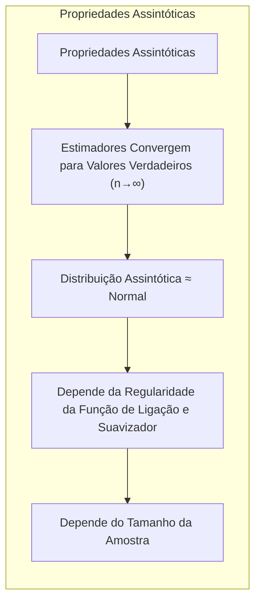

## Título: Modelos Aditivos Generalizados, Árvores e Métodos Relacionados: Algoritmo de Local Scoring com Backfitting Aninhado em Newton-Raphson

<imagem: Um diagrama de fluxo detalhado que ilustra o algoritmo de local scoring para Modelos Aditivos Generalizados (GAMs), mostrando os passos de inicialização, as iterações do Newton-Raphson e o algoritmo de backfitting aninhado, incluindo os detalhes das atualizações dos parâmetros, o cálculo dos resíduos de trabalho e a aplicação de suavizadores. O diagrama deve apresentar cada passo de forma explícita e com as correspondentes fórmulas matemáticas.>

### Introdução

Este capítulo explora o algoritmo de local scoring, que combina o método de Newton-Raphson com o algoritmo de backfitting para a estimação de parâmetros em Modelos Aditivos Generalizados (GAMs), oferecendo uma abordagem detalhada sobre como esses métodos são integrados para a modelagem de resultados complexos, especialmente para modelos da família exponencial com funções de ligação não lineares [^9.1]. O algoritmo de local scoring, também conhecido como *Iteratively Reweighted Least Squares (IRLS)*, utiliza uma aproximação de segunda ordem da função de *log-likelihood* para guiar a otimização. Em cada iteração, um algoritmo de backfitting com suavização é utilizado para ajustar as funções não paramétricas. O capítulo detalha a formulação matemática do algoritmo, os passos de inicialização, as iterações de Newton-Raphson, a atualização dos resíduos de trabalho, a estimação das funções não paramétricas através do backfitting e a verificação da convergência. O objetivo principal é fornecer uma compreensão teórica e prática da implementação do algoritmo de local scoring e como a combinação de Newton-Raphson e backfitting resulta em um método robusto para a estimação de modelos GAMs com diferentes tipos de dados.

### Conceitos Fundamentais

**Conceito 1: O Algoritmo de Local Scoring (IRLS)**

O algoritmo de local scoring, também conhecido como *Iteratively Reweighted Least Squares (IRLS)*, é um método iterativo para maximizar a *log-likelihood* em modelos lineares generalizados (GLMs). O método de Newton-Raphson é usado para realizar a otimização, onde em cada iteração, os parâmetros são atualizados usando:
$$
\theta^{(t+1)} = \theta^{(t)} -  H(\theta^{(t)})^{-1}\nabla \log L(\theta^{(t)}|y)
$$
onde $\theta^{(t)}$ são os parâmetros na iteração $t$, $H(\theta^{(t)})$ é o Hessiano da *log-likelihood* avaliado em $\theta^{(t)}$, e $\nabla \log L(\theta^{(t)}|y)$ é o gradiente da *log-likelihood* avaliado em $\theta^{(t)}$. No entanto, para modelos GLM, o Hessiano é substituído pela matriz de informação de Fisher $I(\theta)$ , e a iteração se torna:
$$
\theta^{(t+1)} = \theta^{(t)} +  I(\theta^{(t)})^{-1} \nabla \log L(\theta^{(t)}|y)
$$

O nome *Iteratively Reweighted Least Squares* surge devido à forma da atualização dos parâmetros, que, em modelos GLM, pode ser vista como a resolução de um problema de mínimos quadrados ponderados, onde os pesos são dados pela matriz de informação de Fisher. O algoritmo IRLS, portanto, é uma aproximação do método de Newton-Raphson, que utiliza a matriz de informação de Fisher. O IRLS é eficiente na otimização de GLMs e garante a convergência quando a função de *log-likelihood* é côncava.

> 💡 **Exemplo Numérico:**
> Suponha que estamos ajustando um modelo de regressão logística (um GLM) e temos um parâmetro $\theta$ que queremos estimar. Inicializamos $\theta^{(0)} = 0.5$. Após calcular o gradiente da *log-likelihood* $\nabla \log L(\theta^{(0)}|y) = 0.2$ e a matriz de informação de Fisher $I(\theta^{(0)}) = 0.8$ na primeira iteração, a atualização do parâmetro seria:
> $$
> \theta^{(1)} = \theta^{(0)} + I(\theta^{(0)})^{-1} \nabla \log L(\theta^{(0)}|y) = 0.5 + (0.8)^{-1} * 0.2 = 0.5 + 1.25 * 0.2 = 0.5 + 0.25 = 0.75
> $$
> Este processo é repetido iterativamente até que o valor de $\theta$ convirja. O ponto chave aqui é que em cada iteração, o parâmetro é atualizado na direção que maximiza a *log-likelihood*, ponderada pela matriz de informação de Fisher.

**Lemma 1:** *O algoritmo de local scoring, ou IRLS, é um método para maximizar a *log-likelihood* em modelos da família exponencial, utilizando uma aproximação de Newton-Raphson com a matriz de informação de Fisher e formulado como um processo iterativo de mínimos quadrados ponderados.  A convergência do método é garantida sob certas condições de regularidade da função de verossimilhança.*  O IRLS é um método fundamental para modelos estatísticos que pertencem à família exponencial [^4.4.2].

**Conceito 2: Integração do Backfitting no Procedimento de Newton-Raphson**

O algoritmo de local scoring, quando aplicado a modelos aditivos generalizados (GAMs), envolve a utilização de um algoritmo de backfitting aninhado dentro de um procedimento de Newton-Raphson. Em cada iteração do algoritmo de Newton-Raphson, os resíduos de trabalho $z_i$ e os pesos $w_i$ são calculados utilizando os parâmetros atuais do modelo e a função de ligação $g$:
$$
z_i = \eta_i + \frac{y_i - \mu_i}{g'(\mu_i)}
$$

e
$$
w_i = \frac{1}{g'(\mu_i)^2 \text{Var}(Y_i|x_i)}
$$

onde $\eta_i = \alpha + \sum_{j}f_j(x_{ij})$ é o *predictor* linear, $\mu_i$ é a média da variável resposta, $g$ é a função de ligação, $y_i$ é a variável resposta e $g'$ é a derivada da função de ligação em relação a média.  Em seguida, um algoritmo de backfitting ponderado é utilizado para estimar as funções não paramétricas $f_j$ utilizando os resíduos de trabalho $z_i$ e os pesos $w_i$. A iteração continua até a convergência dos parâmetros.  Essa integração permite que modelos aditivos sejam estimados com flexibilidade para dados com diferentes distribuições da família exponencial e com funções de ligação canônicas.

> 💡 **Exemplo Numérico:**
> Vamos considerar um modelo GAM com dois preditores, $x_1$ e $x_2$, e uma função de ligação identidade $g(\mu) = \mu$. Suponha que após algumas iterações do Newton-Raphson, temos $\eta_i = 2 + f_1(x_{i1}) + f_2(x_{i2})$, onde $f_1(x_{i1}) = 0.5x_{i1}$ e $f_2(x_{i2}) = 0.2x_{i2}^2$. Para uma observação específica com $y_i = 5$, $x_{i1} = 2$, e $x_{i2} = 3$, temos:
>
> $\eta_i = 2 + 0.5(2) + 0.2(3^2) = 2 + 1 + 1.8 = 4.8$
> $\mu_i = g^{-1}(\eta_i) = \eta_i = 4.8$ (já que a função de ligação é identidade)
> $g'(\mu_i) = 1$
>
> Assumindo que $\text{Var}(Y_i|x_i) = 1$, o resíduo de trabalho e o peso seriam:
>
> $z_i = \eta_i + \frac{y_i - \mu_i}{g'(\mu_i)} = 4.8 + \frac{5 - 4.8}{1} = 4.8 + 0.2 = 5$
> $w_i = \frac{1}{g'(\mu_i)^2 \text{Var}(Y_i|x_i)} = \frac{1}{1^2 * 1} = 1$
>
> O resíduo de trabalho $z_i = 5$ e o peso $w_i = 1$ são então usados no algoritmo de backfitting para atualizar as funções não paramétricas $f_1$ e $f_2$.

**Corolário 1:** *A integração do backfitting no método de Newton-Raphson, como no algoritmo de local scoring, permite que a estimativa dos parâmetros em modelos GAMs seja feita iterativamente, usando uma aproximação do método de Newton-Raphson em modelos da família exponencial e funções de ligação canônicas.  A abordagem iterativa permite encontrar parâmetros que maximizam a função de verossimilhança de forma eficiente*. Essa abordagem garante que o modelo GAM seja otimizado com uma aproximação ao método da máxima verossimilhança e com a flexibilidade de suavizadores [^4.4.3].

**Conceito 3: O Uso de Suavizadores no Algoritmo de Backfitting Aninhado**

Em cada iteração do algoritmo de backfitting aninhado, as funções não paramétricas $f_j$ são estimadas usando um suavizador que utiliza os resíduos de trabalho e os pesos calculados pelo método de Newton-Raphson. O suavizador gera funções suaves que se ajustam aos resíduos de trabalho, controlando a complexidade do modelo e evitando o overfitting.  Diferentes tipos de suavizadores podem ser utilizados, como *splines*, *kernels* ou outros métodos de suavização.  A escolha do suavizador e de seus parâmetros de suavização influencia a flexibilidade das funções $f_j$ e a sua capacidade de modelar relações não lineares entre a resposta e os preditores. O suavizador é um elemento crucial para garantir o bom ajuste e capacidade de generalização dos modelos.

> 💡 **Exemplo Numérico:**
> Suponha que, após o cálculo dos resíduos de trabalho e pesos, o algoritmo de backfitting esteja ajustando a função $f_1(x_1)$. Os resíduos parciais ponderados $r_i^{(1)}$ para um conjunto de observações são:
>
> $r^{(1)} = [1.2, 2.5, -0.8, 3.1, -1.5]$
>
> Se usarmos um suavizador spline com um parâmetro de suavização $\lambda = 0.5$, a função $f_1(x_1)$ será atualizada de tal forma que ela passará perto desses pontos, mas não necessariamente através deles. O parâmetro $\lambda$ controla o quanto a função se curva para se ajustar aos dados: um $\lambda$ grande força a função a ser mais suave, enquanto um $\lambda$ pequeno permite que a função se ajuste mais aos pontos, arriscando overfitting.
>
> Por exemplo, se $x_1 = [1, 2, 3, 4, 5]$, um suavizador spline pode retornar valores para a função $f_1(x_1)$ como $[0.9, 2.2, -0.5, 2.8, -1.2]$, demonstrando que o suavizador não reproduz exatamente os resíduos parciais, mas os aproxima com uma função suave.

> ⚠️ **Nota Importante:** O uso de suavizadores no algoritmo de backfitting, dentro do procedimento de Newton-Raphson, permite a estimativa de funções não paramétricas com controle de flexibilidade. Os suavizadores são, portanto, cruciais para a eficiência e a estabilidade dos modelos aditivos generalizados.  A escolha do suavizador, portanto, deve ser feita considerando o comportamento dos dados e a necessidade de suavizar a resposta [^4.5].

> ❗ **Ponto de Atenção:** A escolha inadequada do suavizador pode levar a modelos com overfitting ou com baixo ajuste, e os parâmetros de suavização devem ser escolhidos com cuidado, e comumente são utilizados métodos de validação cruzada. A estabilidade do algoritmo também pode ser afetada pela escolha do suavizador [^4.5.1].

> ✔️ **Destaque:** A combinação do algoritmo de backfitting, do método de Newton-Raphson e de suavizadores apropriados oferece uma abordagem poderosa para a estimação de parâmetros em modelos aditivos generalizados para dados com diferentes distribuições, que sejam da família exponencial [^4.5.2].

### Algoritmo de Local Scoring com Backfitting Aninhado: Detalhes da Implementação e da Otimização

```mermaid
flowchart TD
    subgraph "Local Scoring: Detalhes da Implementação"
        A["Inicialização: α⁽⁰⁾, fⱼ⁽⁰⁾"] --> B["Iteração Newton-Raphson (t):"]
        B --> C["Calcula μᵢ e ηᵢ: μᵢ = g⁻¹(ηᵢ), ηᵢ = α⁽ᵗ⁻¹⁾ + Σⱼfⱼ⁽ᵗ⁻¹⁾(xᵢⱼ)"]
        C --> D["Calcula zᵢ: zᵢ = ηᵢ + (yᵢ - μᵢ)/g'(μᵢ)"]
        D --> E["Calcula wᵢ: wᵢ = 1/(g'(μᵢ)²Var(Yᵢ|xᵢ))"]
        E --> F["Backfitting Ponderado: Ajusta fⱼ com zᵢ e wᵢ"]
             subgraph "Backfitting"
                F --> G["Inicializa fⱼ⁽ᵗ,⁰⁾"]
                G --> H["Itera Backfitting (s)"]
                 H --> I["Calcula Resíduos Parciais: rᵢ⁽ʲ⁾ = wᵢ(zᵢ - α - Σₖ₋₋ⱼfₖ⁽ᵗ,ˢ⁻¹⁾(xᵢₖ))"]
                 I --> J["Atualiza fⱼ: fⱼ⁽ᵗ,ˢ⁾(xᵢⱼ) = Sⱼ(r⁽ʲ⁾)"]
                 J --> K["Convergência Backfitting?"]
                 K -- "Sim" --> L["Retorna fⱼ⁽ᵗ⁾"]
                  K -- "Não" --> H
             end
        L --> M["Atualiza Parâmetros"]
        M --> N["Convergência Newton-Raphson?"]
        N -- "Sim" --> O["Fim"]
        N -- "Não" --> B
    end
```

<imagem: Um diagrama de fluxo detalhado que ilustra cada passo do algoritmo de local scoring, combinando o Newton-Raphson e o backfitting, mostrando o processo de inicialização, as iterações do Newton-Raphson, a atualização dos parâmetros, o cálculo dos resíduos de trabalho, a aplicação do backfitting com suavizadores e a verificação da convergência. O diagrama deve incluir as equações matemáticas correspondentes para cada etapa e mostrar como o método se relaciona com a teoria da família exponencial.>

**Explicação:** Este diagrama detalha o algoritmo de local scoring, combinando o método de Newton-Raphson e o backfitting, mostrando o processo de otimização iterativo, de acordo com os passos descritos em [^4.4.2], [^4.4.3].

O algoritmo começa com a inicialização dos parâmetros $\alpha^{(0)}$ e as funções $f_j^{(0)}$. Em cada iteração $t$ do Newton-Raphson, os seguintes passos são executados:

1.  **Cálculo da Média e *Predictor* Linear:** As médias $\mu_i$ e os *predictors* lineares $\eta_i$ são calculados utilizando os parâmetros da iteração anterior:
    $$
    \mu_i = g^{-1}(\eta_i)
    $$
    $$
     \eta_i = \alpha^{(t-1)} + \sum_{j=1}^p f_j^{(t-1)}(x_{ij})
    $$
    onde $g^{-1}$ é a inversa da função de ligação.
2.  **Cálculo dos Resíduos de Trabalho:** Os resíduos de trabalho $z_i$ são calculados usando:
    $$
    z_i = \eta_i + \frac{y_i - \mu_i}{g'(\mu_i)}
    $$

3.  **Cálculo dos Pesos:** Os pesos $w_i$ para cada observação são calculados através de:
    $$
     w_i = \frac{1}{g'(\mu_i)^2 \text{Var}(Y_i|x_i)}
    $$
    onde $\text{Var}(Y_i|x_i)$ é a variância da resposta dada a observação $x_i$. Os pesos são derivados da matriz de informação de Fisher e são utilizados para a atualização dos parâmetros.

4.  **Backfitting Ponderado:**  Um algoritmo de backfitting é utilizado para estimar as funções não paramétricas $f_j(X_j)$, onde em cada iteração $s$ do backfitting:
    1.  Os resíduos parciais ponderados são calculados utilizando:
    $$
     r_i^{(j)} = w_i (z_i - \alpha - \sum_{k \ne j} f_k^{(t,s-1)}(x_{ik}))
     $$
    2. As funções $f_j$ são atualizadas utilizando um suavizador e os resíduos parciais ponderados:

        $$
        f_j^{(t,s)}(x_{ij}) = S_j r^{(j)}
        $$

    O processo iterativo do backfitting continua até que as funções $f_j$ convirjam.
5.  **Atualização dos Parâmetros:** Os parâmetros do modelo $\theta^{(t)}$ são atualizados utilizando a informação das funções $f_j$ obtidas no backfitting, e os resultados são utilizados para o passo seguinte de otimização do Newton-Raphson.

O processo iterativo continua até que as estimativas convirjam, tanto o algoritmo de Newton-Raphson quanto o backfitting. O algoritmo de local scoring é uma forma eficiente de utilizar o método de Newton-Raphson, combinado com o backfitting, para modelos aditivos com diferentes tipos de dados, especialmente quando a variável resposta faz parte da família exponencial e a função de ligação canônica é utilizada [^4.4.3].

> 💡 **Exemplo Numérico:**
> Para ilustrar a interação entre Newton-Raphson e Backfitting, vamos simplificar e supor que temos apenas uma função não paramétrica $f(x)$ em um modelo GAM com função de ligação identidade.
>
> 1. **Inicialização:**  Começamos com $\alpha^{(0)} = 0$ e $f^{(0)}(x) = 0$ para todos os valores de $x$.
> 2. **Iteração Newton-Raphson (t=1):**
>    - Calculamos $\eta_i = \alpha^{(0)} + f^{(0)}(x_i) = 0$ e $\mu_i = \eta_i = 0$ para todas as observações.
>    - Calculamos os resíduos de trabalho $z_i = \eta_i + (y_i - \mu_i) / g'(\mu_i) = 0 + y_i - 0 = y_i$.
>    - Calculamos os pesos $w_i = 1$ (assumindo $\text{Var}(Y_i|x_i) = 1$ e $g'(\mu_i) = 1$).
>    - **Backfitting (s=1):**
>       - Calculamos os resíduos parciais ponderados $r_i = w_i (z_i - \alpha^{(0)} ) = 1 * (y_i - 0) = y_i$.
>       - Aplicamos o suavizador $S$ aos resíduos parciais: $f^{(1)}(x_i) = S(r_i)$. Suponha que este suavizador ajuste uma reta aos resíduos, então $f^{(1)}(x) = 0.5x$.
> 3. **Atualização:**
>    - Atualizamos $\alpha^{(1)}$ e $f^{(1)}(x)$.
> 4. **Iteração Newton-Raphson (t=2):**
>    - Calculamos $\eta_i = \alpha^{(1)} + f^{(1)}(x_i)$.
>    - Calculamos novos resíduos de trabalho $z_i$ e pesos $w_i$.
>    - **Backfitting (s=2):**
>       - Calculamos os resíduos parciais ponderados $r_i$ usando os novos $z_i$, $\alpha^{(1)}$, e $f^{(1)}(x_i)$.
>       - Aplicamos o suavizador $S$ aos resíduos parciais: $f^{(2)}(x_i) = S(r_i)$. Suponha que o suavizador ajuste uma curva, então $f^{(2)}(x)$ se ajustará mais aos dados.
> 5. **Repetição:** Repetimos os passos até que $\alpha$ e $f(x)$ convirjam.
>
> Neste exemplo, em cada iteração do Newton-Raphson, o algoritmo de backfitting ajusta a função não paramétrica $f(x)$, e a informação desse ajuste é utilizada na próxima iteração do Newton-Raphson. O suavizador dentro do backfitting controla a complexidade da função $f(x)$, e garante que o modelo não esteja sujeito a overfitting.

**Lemma 3:** *O algoritmo de local scoring, ao combinar Newton-Raphson com backfitting, permite estimar os parâmetros de modelos GAMs com funções de ligação não lineares de forma eficiente, através de uma aproximação iterativa da máxima verossimilhança.  O uso dos resíduos de trabalho e da matriz de informação de Fisher simplificam o processo de otimização*. A combinação dos dois algoritmos garante que modelos não lineares sejam ajustados utilizando a informação da curvatura da função de *log-likelihood* [^4.4.2].

### Relação com a Família Exponencial e Funções de Ligação Canônicas

A utilização de funções de ligação canônicas, derivadas da família exponencial, simplifica a aplicação do algoritmo de local scoring.  Quando a função de ligação é canônica, os resíduos de trabalho e os pesos são obtidos através das derivadas e variâncias da distribuição.  Isso permite que o algoritmo seja utilizado em modelos com distribuições da família exponencial, como a binomial, Poisson e gama, entre outros.  O algoritmo de local scoring, juntamente com a função de ligação canônica, oferece um método eficiente para modelos estatísticos da família exponencial.

> 💡 **Exemplo Numérico:**
> Em um modelo de regressão de Poisson, a função de ligação canônica é $g(\mu) = \log(\mu)$, onde $\mu$ é a média da variável resposta. A derivada da função de ligação é $g'(\mu) = 1/\mu$. A variância da distribuição de Poisson é $\text{Var}(Y_i|x_i) = \mu_i$.
>
> Se o preditor linear for $\eta_i = \alpha + f_1(x_{i1}) + f_2(x_{i2})$, então $\mu_i = \exp(\eta_i)$. O resíduo de trabalho e o peso seriam:
>
> $z_i = \eta_i + \frac{y_i - \mu_i}{1/\mu_i} = \eta_i + \mu_i(y_i - \mu_i)$
> $w_i = \frac{1}{(1/\mu_i)^2 \mu_i} = \frac{1}{\mu_i^{-2} \mu_i} = \mu_i$
>
> Observe que tanto o resíduo de trabalho quanto o peso dependem da média $\mu_i$, que por sua vez depende dos parâmetros do modelo. Isso ilustra como a escolha da função de ligação canônica simplifica os cálculos e permite que o algoritmo de local scoring seja aplicado em modelos com distribuições da família exponencial.

### Estabilidade e Convergência do Algoritmo

A convergência do algoritmo de local scoring depende da convexidade da função de *log-likelihood* e da escolha do suavizador.  Funções de *log-likelihood* convexas garantem a convergência do método para um ótimo global, e o uso da matriz de informação de Fisher simplifica o processo de otimização.  A escolha do suavizador e do parâmetro de suavização também influencia na convergência do backfitting, e a escolha adequada destes parâmetros permite que o algoritmo de local scoring seja eficiente e estável. A estabilidade do algoritmo pode ser afetada pela escolha inadequada da função de ligação e pela presença de outliers nos dados, ou modelos que tenham muita flexibilidade.

### Perguntas Teóricas Avançadas: Como a escolha do suavizador, da função de ligação e dos parâmetros de suavização afetam a matriz de informação de Fisher e as propriedades assintóticas do algoritmo de local scoring?

**Resposta:**

A escolha do suavizador, da função de ligação e dos parâmetros de suavização influencia significativamente a matriz de informação de Fisher e as propriedades assintóticas do algoritmo de local scoring, e cada componente desempenha um papel importante na qualidade do modelo.

A matriz de informação de Fisher, dada por
$$
I(\theta) = -E\left[ \frac{\partial^2 \log(L(\theta|y))}{\partial \theta \partial \theta^T} \right]
$$
depende da função de *log-likelihood* e, portanto, da distribuição da variável resposta e da função de ligação. A escolha da função de ligação canônica, derivada da família exponencial, simplifica a forma da matriz de informação de Fisher, o que leva a um método de otimização mais eficiente.  Funções de ligação não canônicas, por outro lado, podem resultar em matrizes de informação de Fisher mais complexas e mais difíceis de calcular e utilizar na otimização.

O método de suavização, ao determinar a forma das funções não paramétricas, também influencia a matriz de informação de Fisher. Suavizadores mais flexíveis levam a matrizes de informação de Fisher com maior dimensão, o que aumenta a complexidade da otimização. O parâmetro de suavização, por sua vez, controla o balanço entre o ajuste aos dados e a complexidade do modelo, o que se reflete na forma da matriz de informação de Fisher. A matriz de informação de Fisher influencia a convergência do algoritmo de local scoring, pois ela é utilizada para atualizar os parâmetros em cada iteração.

As propriedades assintóticas do algoritmo de local scoring são afetadas pela escolha da função de ligação e do suavizador. Em geral, o algoritmo de local scoring tem boas propriedades assintóticas, ou seja, quando o número de observações tende ao infinito, os estimadores convergem para os valores verdadeiros dos parâmetros, e a distribuição assintótica dos estimadores pode ser aproximada por uma distribuição normal. No entanto, essa convergência e a distribuição assintótica dependem da regularidade das funções utilizadas, incluindo a função de ligação e o suavizador, assim como do tamanho da amostra.

> 💡 **Exemplo Numérico:**
> Para ilustrar como o parâmetro de suavização afeta as propriedades assintóticas, considere um suavizador spline com diferentes valores de $\lambda$. Com um $\lambda$ grande (alta suavização), a função estimada será muito suave, e terá um baixo viés, mas uma alta variância. Com um $\lambda$ pequeno (baixa suavização), a função estimada se ajustará muito aos dados, levando a um baixo viés, mas uma alta variância.
>
> Suponha que temos um modelo simples $y_i = f(x_i) + \epsilon_i$. Se usarmos um $\lambda$ grande no suavizador, a função $f(x)$ estimada será uma linha quase reta, com um viés maior em relação à função verdadeira. No entanto, a variância dos parâmetros será menor, e um aumento no tamanho da amostra não mudará muito o resultado.
>
> Se usarmos um $\lambda$ pequeno, a função $f(x)$ estimada será muito flexível, e se ajustará aos dados, com um viés muito pequeno, mas a variância dos parâmetros será alta. Um aumento no tamanho da amostra levará a um ajuste melhor, com menor variância, mas o modelo será mais sensível aos dados em cada amostra.
>
> Em termos da matriz de informação de Fisher, um $\lambda$ grande levará a uma matriz menor e mais estável, enquanto um $\lambda$ pequeno levará a uma matriz maior e mais instável. Isso demonstra que a escolha do parâmetro de suavização afeta o balanço entre viés e variância dos estimadores, e as propriedades assintóticas do algoritmo.

**Lemma 5:** *A escolha do suavizador, da função de ligação e dos parâmetros de suavização afeta a matriz de informação de Fisher, e as propriedades assintóticas dos estimadores.  As funções de ligação canônicas simplificam o cálculo da matriz de informação e podem garantir melhores propriedades assintóticas. A regularização, através do parâmetro de suavização, também influencia as propriedades dos estimadores, e podem levar a soluções mais estáveis* [^4.4.4].

**Corolário 5:** *A utilização de funções de ligação canônicas para modelos da família exponencial, e de suavizadores com parâmetros apropriados, garantem que o algoritmo de local scoring convirja para uma solução com boas propriedades assintóticas. A escolha inadequada dos componentes do modelo pode levar a problemas de convergência e a estimadores com maior variabilidade*. A interação entre a escolha da função de ligação, do suavizador e da regularização afeta diretamente a qualidade do ajuste do modelo e suas propriedades estatísticas [^4.4.5].

> ⚠️ **Ponto Crucial:** A matriz de informação de Fisher é uma ferramenta para aproximar o hessiano, que é essencial na otimização de modelos com máxima verossimilhança.  A escolha do suavizador, da função de ligação e dos parâmetros de regularização afeta diretamente o comportamento do algoritmo de local scoring, através da sua influência na matriz de informação de Fisher, e no resultado final dos