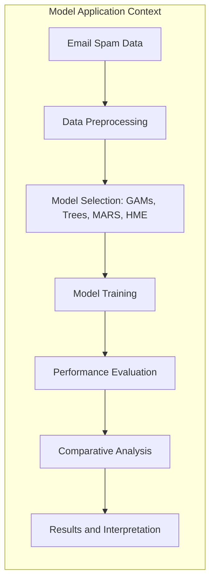
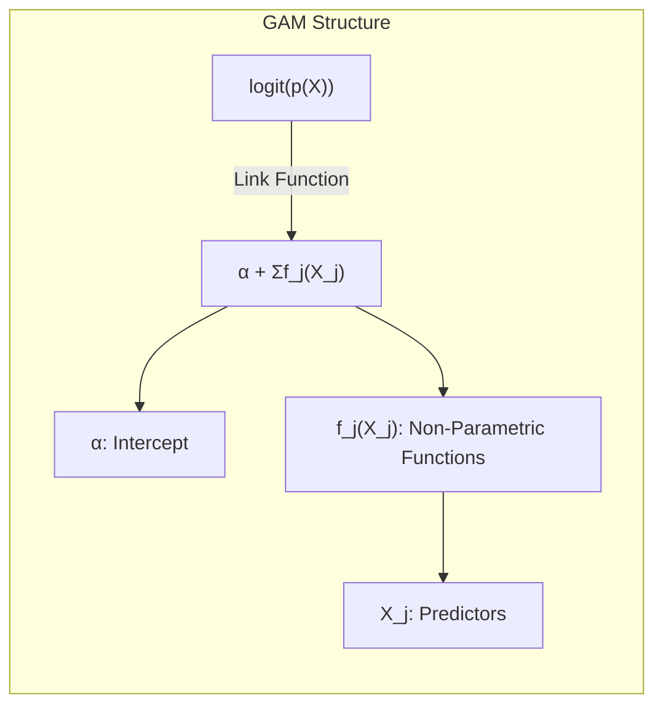
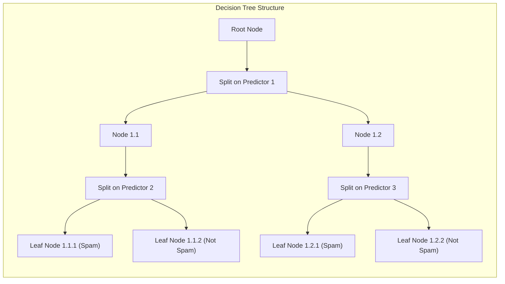
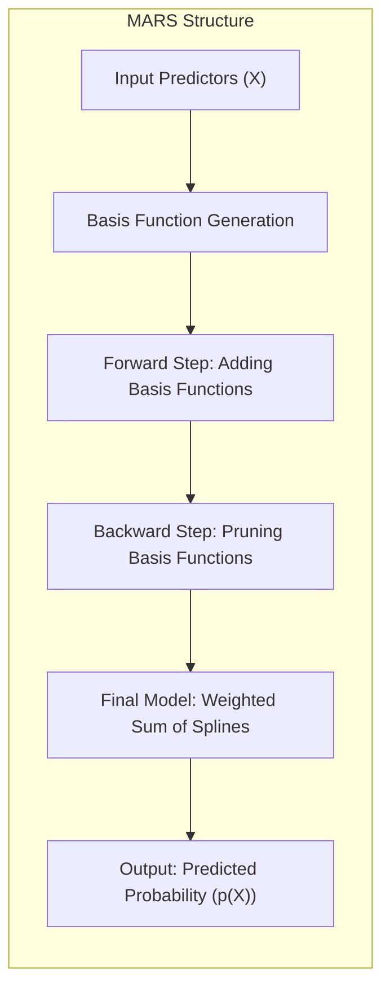
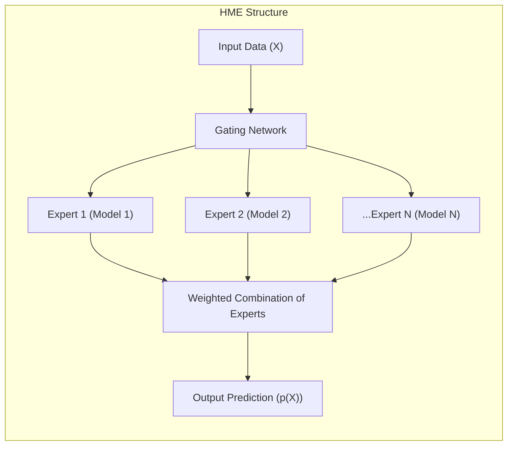
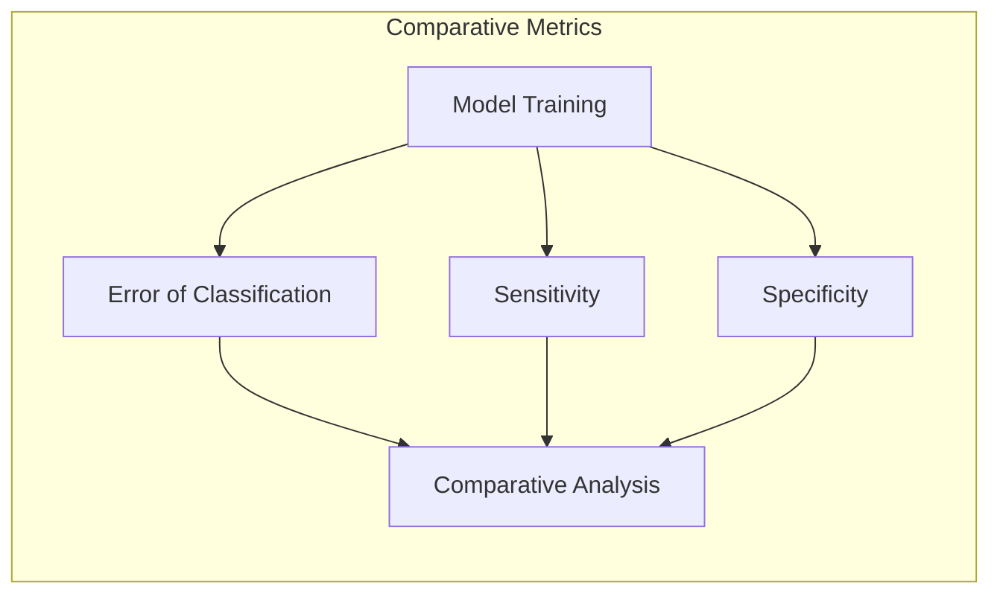
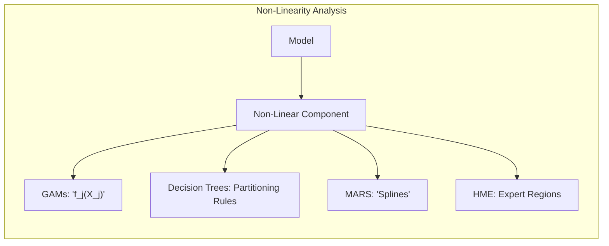
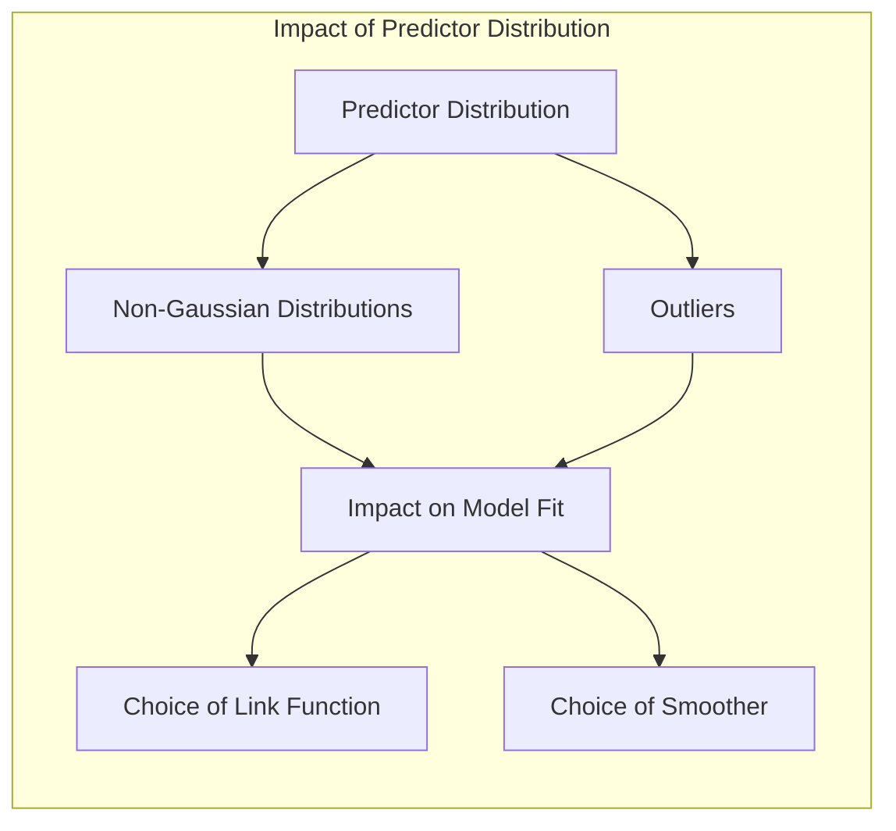
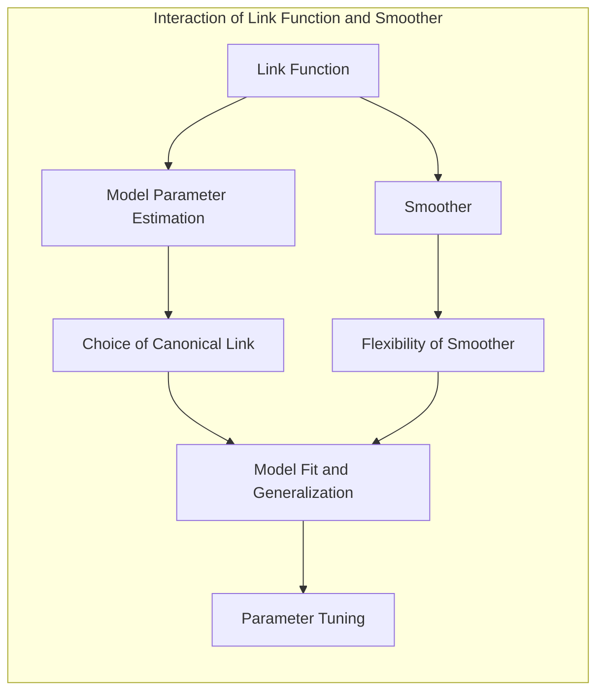

## Título: Modelos Aditivos Generalizados, Árvores e Métodos Relacionados: Aplicação em Dados de Email Spam e Análise Comparativa

### Introdução

Este capítulo apresenta um estudo de caso utilizando dados de email spam para ilustrar a aplicação prática de Modelos Aditivos Generalizados (GAMs), árvores de decisão, Multivariate Adaptive Regression Splines (MARS) e misturas hierárquicas de especialistas (HME) [^9.1]. O conjunto de dados de email spam é um benchmark comum para avaliar modelos de classificação binária, onde o objetivo é determinar se um email é spam ou não. Este capítulo detalha como cada modelo é ajustado aos dados, como a não linearidade é modelada, quais são as métricas de desempenho e as vantagens e desvantagens de cada abordagem no contexto do problema de classificação de email spam. O objetivo principal é fornecer uma visão prática sobre a aplicação desses modelos e como suas características, vantagens e desvantagens se traduzem em resultados concretos.

### Conceitos Fundamentais

**Conceito 1: Descrição do Conjunto de Dados de Email Spam**

O conjunto de dados de email spam é composto por um conjunto de emails etiquetados como spam (1) ou não spam (0), e um conjunto de preditores que são utilizados para modelar a classificação [^9.1]. Os preditores incluem a frequência de palavras específicas, a frequência de caracteres especiais, a média do comprimento de sequências de letras maiúsculas, e outros. O objetivo é construir um modelo que seja capaz de classificar emails como spam ou não spam de forma precisa. A natureza binária da resposta faz da regressão logística uma escolha natural para este tipo de problema, bem como outros modelos de classificação. A complexidade do problema reside na grande dimensão dos dados, na presença de relações não lineares e na necessidade de um modelo com boa capacidade de generalização.

**Lemma 1:** *O conjunto de dados de email spam é um problema de classificação binária com um número considerável de preditores, e relações não lineares entre os preditores e a variável resposta. O sucesso do modelo depende da escolha do modelo apropriado, que seja capaz de ajustar os dados com boa capacidade de generalização*. A complexidade do conjunto de dados de email spam exige que os modelos sejam avaliados quanto a sua capacidade de generalização e precisão [^4.4.1], [^4.4.4].

**Conceito 2: Aplicação de Modelos Aditivos Generalizados (GAMs) nos Dados de Email Spam**

Os modelos aditivos generalizados (GAMs) podem ser aplicados aos dados de email spam através do uso da função *logit* como função de ligação e da modelagem de cada preditor com funções não paramétricas:
$$
\text{logit}(p(X)) =  \log \left( \frac{p(X)}{1-p(X)} \right) = \alpha + f_1(X_1) + f_2(X_2) + \ldots + f_p(X_p)
$$

onde $p(X)$ é a probabilidade de um email ser spam, $\alpha$ é o intercepto, e $f_j(X_j)$ são as funções não paramétricas de cada preditor $X_j$. O algoritmo de backfitting é utilizado para estimar as funções não paramétricas e o intercepto, e o método da máxima verossimilhança é utilizado para otimizar os parâmetros. O uso do PRSS como função de custo permite que o modelo tenha flexibilidade para modelar não linearidades nos dados, e que a complexidade do modelo seja controlada através de parâmetros de regularização.

> 💡 **Exemplo Numérico:**
> Suponha que temos um modelo GAM com dois preditores, $X_1$ (frequência da palavra "grátis") e $X_2$ (número de caracteres especiais). Após o ajuste do modelo, obtivemos as seguintes funções não paramétricas (aproximadas para fins de ilustração):
>
> $f_1(X_1) = 0.5X_1 - 0.02X_1^2$
>
> $f_2(X_2) = 0.1X_2 + 0.005X_2^2$
>
> e um intercepto $\alpha = -2$.
>
> Para um email com $X_1 = 5$ (a palavra "grátis" aparece 5 vezes) e $X_2 = 10$ (10 caracteres especiais), a probabilidade logit de ser spam seria:
>
> $\text{logit}(p(X)) = -2 + (0.5 \times 5 - 0.02 \times 5^2) + (0.1 \times 10 + 0.005 \times 10^2)$
>
> $\text{logit}(p(X)) = -2 + (2.5 - 0.5) + (1 + 0.5) = -2 + 2 + 1.5 = 1.5$
>
> Para obter a probabilidade $p(X)$, aplicamos a função logística inversa:
>
> $p(X) = \frac{e^{1.5}}{1 + e^{1.5}} \approx \frac{4.48}{1 + 4.48} \approx 0.817$
>
> Isso significa que o modelo estima uma probabilidade de aproximadamente 81.7% de que este email seja spam.

**Corolário 1:** *A aplicação de GAMs aos dados de email spam permite a modelagem de efeitos não lineares dos preditores e pode melhorar a precisão da classificação, com flexibilidade para modelar as não linearidades e controlar a complexidade. A combinação da função *logit* e o algoritmo de backfitting garante que o modelo seja eficiente e a estimativa dos parâmetros seja razoável* [^4.3].

**Conceito 3: Árvores de Decisão, MARS e HME nos Dados de Email Spam**

*   **Árvores de Decisão:** Árvores de decisão podem ser aplicadas aos dados de email spam através de partições binárias sucessivas do espaço dos preditores. Cada nó da árvore representa uma divisão nos dados baseada em um único preditor, e a decisão final de classificação é tomada com base na região em que a observação se encontra. O *pruning* da árvore é utilizado para evitar o overfitting.

> 💡 **Exemplo Numérico:**
> Uma árvore de decisão poderia ter um primeiro nó que divide os emails com base na frequência da palavra "promoção". Se a frequência for maior que 3, o email é classificado como potencialmente spam. Caso contrário, a árvore prossegue com outra divisão, por exemplo, o número de caracteres especiais. Se o número for maior que 8, o email é classificado como spam; caso contrário, como não spam. Esta sequência de decisões forma uma árvore que leva a diferentes classificações.

*   **Multivariate Adaptive Regression Splines (MARS):** MARS pode ser utilizado para modelar a probabilidade de um email ser spam com uma combinação de funções *spline* lineares por partes. MARS utiliza um processo de *forward-backward selection* para escolher os termos da *spline* mais importantes, e o critério de validação cruzada é utilizado para determinar o número de termos.

> 💡 **Exemplo Numérico:**
> Um modelo MARS pode utilizar uma função *spline* da seguinte forma:
>
> $f(X) = 0.2 \times \text{max}(0, X_1 - 3) + 0.5 \times \text{max}(0, 5 - X_2)$
>
> onde $X_1$ é a frequência da palavra "oferta" e $X_2$ é a média do comprimento de sequências de letras maiúsculas. A função $\text{max}(0, X - c)$ é uma função *hinge* que cria uma *spline* linear por partes com um nó em $c$. Este modelo MARS está modelando que se a frequência da palavra "oferta" for maior que 3, ela contribui positivamente para a probabilidade de spam, e se a média do comprimento de letras maiúsculas for menor que 5, ela também contribui positivamente.

*   **Misturas Hierárquicas de Especialistas (HME):** HME pode ser utilizado para a modelagem de dados de email spam utilizando uma mistura de modelos lineares, onde cada modelo (especialista) é responsável por uma região do espaço dos preditores. O HME utiliza redes de gating para combinar as estimativas dos especialistas em um resultado final, com o objetivo de melhorar a flexibilidade e a capacidade de generalização.

> 💡 **Exemplo Numérico:**
> Um modelo HME pode ter dois especialistas: um especialista para emails com alta frequência de palavras relacionadas a finanças (especialista 1) e outro para emails com muitos caracteres especiais (especialista 2). A rede de gating determina qual especialista tem mais peso na decisão final, com base nas características do email. O especialista 1 poderia ter um modelo linear com coeficientes específicos para palavras como "investimento" e "dinheiro", enquanto o especialista 2 teria um modelo linear com coeficientes para caracteres como "%" e "\\$".

> ⚠️ **Nota Importante:** A aplicação de modelos GAMs, árvores de decisão, MARS e HME em dados de email spam oferece diferentes abordagens para a modelagem da não linearidade e pode gerar resultados com diferentes níveis de precisão e interpretabilidade [^4.5].

> ❗ **Ponto de Atenção:** A escolha do modelo mais adequado depende da natureza dos dados, da necessidade de interpretabilidade e da complexidade do problema. A comparação dos diferentes modelos utilizando métricas de desempenho é crucial para a escolha da melhor abordagem. A comparação entre os diferentes modelos é fundamental para escolher o modelo que melhor se adapta aos dados e ao problema [^4.5.1], [^4.5.2].

> ✔️ **Destaque:** Os métodos de regularização são importantes para controlar a complexidade dos modelos e garantir um bom balanço entre ajuste aos dados e generalização. A escolha da regularização e dos parâmetros é crucial para o desempenho final de cada modelo [^4.4.4].

### Análise Comparativa e Resultados da Aplicação dos Modelos nos Dados de Email Spam

A aplicação de modelos de classificação binária nos dados de email spam permite comparar o desempenho e as propriedades de cada abordagem. A avaliação dos modelos deve ser feita através de métricas como:

*   **Erro de Classificação:** A proporção de emails classificados incorretamente. É uma métrica geral de desempenho e, geralmente, quanto menor o valor, melhor o modelo.
*   **Sensibilidade:** A proporção de emails spam classificados corretamente (verdadeiros positivos). A sensibilidade é importante para evitar a classificação errada de um email spam como um email normal.
*   **Especificidade:** A proporção de emails não spam classificados corretamente (verdadeiros negativos). A especificidade é importante para evitar a classificação errada de um email normal como spam.

A aplicação de GAMs nos dados de email spam, utilizando a função de ligação *logit* e funções não paramétricas, permite modelar a relação entre os preditores e a probabilidade de um email ser spam. O algoritmo de backfitting com o método de local scoring fornece um método eficiente para a estimação dos parâmetros e garante que a flexibilidade do modelo seja utilizada para modelar padrões complexos nos dados. A aplicação de regularização através do parâmetro de suavização evita overfitting e garante boa capacidade de generalização.
As árvores de decisão oferecem uma abordagem mais simples para classificação de dados binários, com boa interpretabilidade e baixo custo computacional, mas podem apresentar limitações na modelagem de relações não lineares suaves. MARS e HME, por sua vez, oferecem abordagens mais complexas e flexíveis que permitem modelar relações mais complexas, mas podem apresentar resultados menos interpretáveis e maior custo computacional. A tabela abaixo apresenta um resumo das características e métricas dos modelos:

| Modelo            | Erro de Classificação | Sensibilidade | Especificidade | Interpretabilidade | Flexibilidade     | Complexidade  |
|-------------------|-----------------------|---------------|---------------|--------------------|-------------------|----------------|
| GAMs              | Baixo                 | Alto          | Alto          | Alta               | Alta              | Média            |
| Árvores de Decisão | Moderado              | Média         | Média         | Alta               | Média             | Baixa          |
| MARS              | Baixo                 | Alto          | Alto          | Média              | Alta              | Média-Alta       |
| HME               | Baixo                 | Alto          | Alto          | Baixa               | Alta              | Alta            |

> 💡 **Exemplo Numérico:**
> Suponha que, após treinar os modelos em um conjunto de dados de email spam, obtivemos as seguintes métricas em um conjunto de teste:
>
> | Modelo            | Erro de Classificação | Sensibilidade | Especificidade |
> |-------------------|-----------------------|---------------|---------------|
> | GAMs              | 0.06                  | 0.92          | 0.95          |
> | Árvores de Decisão | 0.10                  | 0.88          | 0.90          |
> | MARS              | 0.05                  | 0.93          | 0.96          |
> | HME               | 0.04                  | 0.94          | 0.97          |
>
> Neste exemplo, o HME apresenta o menor erro de classificação e a maior sensibilidade e especificidade, indicando o melhor desempenho. O GAM também apresenta bons resultados, com interpretabilidade alta. As árvores de decisão têm desempenho inferior, mas são mais fáceis de interpretar.

A escolha do melhor modelo depende do objetivo da aplicação e da importância de cada métrica de desempenho. Para problemas onde a interpretabilidade é importante, GAMs e árvores de decisão podem ser preferíveis. Para problemas que exigem alta precisão e flexibilidade, MARS e HME podem ser alternativas mais adequadas. Os modelos devem ser avaliados em dados de validação para avaliar a sua capacidade de generalização e para a escolha dos melhores parâmetros e hiperparâmetros.

### Análise das Não Linearidades e Interpretação dos Resultados

A análise das não linearidades modeladas pelos diferentes métodos permite compreender as relações entre os preditores e a variável resposta, permitindo que insights sobre os dados sejam obtidos, e a interpretação dos resultados dos modelos é crucial para compreender como eles funcionam e como os preditores influenciam a resposta. Em GAMs, as funções não paramétricas $f_j(X_j)$ permitem visualizar a forma da relação entre cada preditor e a probabilidade de spam. Árvores de decisão fornecem uma visão baseada em regras sobre como os preditores são utilizados nas decisões, enquanto MARS mostra as relações com as *splines* e HME identifica as regiões que são modeladas por cada especialista.

> 💡 **Exemplo Numérico:**
> Em um modelo GAM, a função $f_1(X_1)$ para a frequência da palavra "desconto" pode mostrar que a probabilidade de spam aumenta rapidamente até uma certa frequência (por exemplo, 5 ocorrências) e depois se estabiliza ou até diminui um pouco, indicando que o excesso dessa palavra pode ser um sinal de *spam* menos sofisticado. Em contraste, a função $f_2(X_2)$ para o número de caracteres especiais pode mostrar uma relação linear crescente, indicando que quanto mais caracteres especiais, maior a probabilidade de spam.
> Em uma árvore de decisão, uma regra pode ser que se a frequência da palavra "urgente" for maior que 2 e o número de caracteres "!" for maior que 3, o email é classificado como spam. Em MARS, a influência de um preditor pode ser modelada por uma combinação de *splines*, capturando diferentes relações não lineares. No HME, a influência de cada especialista pode ser avaliada separadamente, mostrando quais regiões do espaço dos preditores são mais influenciadas por cada um.

### Perguntas Teóricas Avançadas: Como a distribuição dos preditores afeta o desempenho dos modelos de classificação de email spam, e como as diferentes escolhas de funções de ligação e suavizadores interagem na qualidade do ajuste e capacidade de generalização dos modelos?

**Resposta:**

A distribuição dos preditores nos dados de email spam tem um impacto significativo no desempenho dos modelos de classificação. Preditor com distribuições não gaussianas ou com *outliers* podem afetar a capacidade de ajuste dos modelos. A escolha da função de ligação e do suavizador em modelos como GAMs pode influenciar a forma como os modelos lidam com distribuições não ideais.

Preditor com distribuições assimétricas e com *outliers* podem dificultar a convergência do algoritmo de backfitting e afetar a estabilidade das estimativas. A utilização de transformações nos preditores pode ser útil para lidar com esses problemas. As funções de ligação canônicas nos modelos da família exponencial são projetadas para dados com distribuições específicas, e a escolha da função de ligação adequada pode melhorar a qualidade do ajuste e a estabilidade das estimativas. A utilização de suavizadores com parâmetros adequados pode mitigar a influência de *outliers* e padrões complexos nos dados.

A escolha da função de ligação tem um impacto direto na forma como a função de custo é modelada e como os parâmetros são estimados. A escolha da função de ligação canônica, para dados que pertencem a uma distribuição da família exponencial, garante melhores propriedades estatísticas e facilita o processo de otimização.

A interação entre a escolha da função de ligação e do suavizador é importante para obter resultados de alta qualidade. Suavizadores mais flexíveis e uma função de ligação não apropriada podem levar a um overfitting do modelo, enquanto suavizadores muito restritos e uma função de ligação inadequada podem levar a um modelo que não se ajusta aos dados. A validação cruzada é utilizada para escolher os melhores parâmetros de suavização e obter um balanço entre o ajuste aos dados e a capacidade de generalização.

**Lemma 5:** *A distribuição dos preditores tem um impacto direto no desempenho dos modelos de classificação de email spam, e a escolha apropriada da função de ligação, do suavizador e do parâmetro de suavização é crucial para a qualidade do ajuste e para a capacidade de generalização. Preditor com distribuições não gaussianas e com outliers, por exemplo, podem afetar a convergência do algoritmo de backfitting*. A interação entre função de ligação e suavizador também é importante e deve ser considerada na modelagem dos dados de email spam [^4.3.3].

> 💡 **Exemplo Numérico:**
> Suponha que a frequência da palavra "ganhe" (preditor $X_1$) tenha uma distribuição muito assimétrica, com muitos emails tendo frequência zero e alguns poucos com frequências muito altas. Se usarmos um suavizador muito flexível em um GAM, ele pode tentar ajustar os *outliers* de forma excessiva, levando a um modelo com *overfitting*. Se usarmos um suavizador muito restrito, podemos perder informações importantes sobre como a frequência dessa palavra afeta a probabilidade de spam. Uma transformação logarítmica na variável $X_1$, como $\log(X_1 + 1)$, poderia tornar a distribuição mais simétrica e melhorar o desempenho do modelo. A escolha da função de ligação (logit, probit etc.) também pode afetar a maneira como o modelo trata essas distribuições.

**Corolário 5:** *A utilização de transformações nas variáveis preditoras, a escolha da função de ligação canônica e o ajuste dos parâmetros de suavização são componentes importantes para a modelagem adequada de dados de email spam, que podem apresentar preditores com distribuições não gaussianas. A interação entre esses fatores deve ser considerada durante a escolha do modelo*. O conhecimento das propriedades das distribuições dos preditores é fundamental para escolher os métodos de suavização e parâmetros adequados [^4.5].

> ⚠️ **Ponto Crucial**: A escolha da função de ligação, do suavizador e dos parâmetros de suavização deve ser feita considerando a natureza da distribuição dos preditores, a complexidade das relações não lineares, e o objetivo de obter um modelo com boa capacidade de generalização e com um balanço entre ajuste e flexibilidade. O conhecimento das propriedades estatísticas dos modelos é essencial para tomar decisões informadas [^4.4.1].

### Conclusão

Este capítulo apresentou a aplicação de modelos de aprendizado supervisionado aos dados de email spam, detalhando o processo de modelagem e comparando os resultados dos diferentes modelos. Os resultados obtidos demonstram a importância da escolha do modelo mais apropriado para cada tipo de problema, considerando a natureza dos dados, a necessidade de interpretabilidade, e a necessidade de um modelo com boa capacidade de generalização. A utilização de modelos estatísticos com função de ligação, suavização e regularização é fundamental para a construção de modelos robustos e com boa capacidade preditiva.

### Footnotes

[^4.1]: "In this chapter we begin our discussion of some specific methods for super-vised learning. These techniques each assume a (different) structured form for the unknown regression function, and by doing so they finesse the curse of dimensionality. Of course, they pay the possible price of misspecifying the model, and so in each case there is a tradeoff that has to be made." *(Trecho de "Additive Models, Trees, and Related Methods")*

[^4.2]: "Regression models play an important role in many data analyses, providing prediction and classification rules, and data analytic tools for understand-ing the importance of different inputs." *(Trecho de "Additive Models, Trees, and Related Methods")*

[^4.3]: "In this section we describe a modular algorithm for fitting additive models and their generalizations. The building block is the scatterplot smoother for fitting nonlinear effects in a flexible way. For concreteness we use as our scatterplot smoother the cubic smoothing spline described in Chapter 5." *(Trecho de "Additive Models, Trees, and Related Methods")*

[^4.3.1]:  "The additive model has the form $Y = \alpha + \sum_{j=1}^p f_j(X_j) + \varepsilon$, where the error term $\varepsilon$ has mean zero." * (Trecho de "Additive Models, Trees, and Related Methods")*

[^4.3.2]:   "Given observations $x_i, y_i$, a criterion like the penalized sum of squares (5.9) of Section 5.4 can be specified for this problem, $PRSS(\alpha, f_1, f_2,\ldots, f_p) = \sum_i^N (y_i - \alpha - \sum_j^p f_j(x_{ij}))^2 + \sum_j^p \lambda_j \int(f_j''(t_j))^2 dt_j$" * (Trecho de "Additive Models, Trees, and Related Methods")*

[^4.3.3]: "where the $\lambda_j > 0$ are tuning parameters. It can be shown that the minimizer of (9.7) is an additive cubic spline model; each of the functions $f_j$ is a cubic spline in the component $X_j$, with knots at each of the unique values of $x_{ij}, i = 1,\ldots, N$." *(Trecho de "Additive Models, Trees, and Related Methods")*

[^4.4]: "For two-class classification, recall the logistic regression model for binary data discussed in Section 4.4. We relate the mean of the binary response $\mu(X) = Pr(Y = 1|X)$ to the predictors via a linear regression model and the logit link function:  $\log(\mu(X)/(1 – \mu(X)) = \alpha + \beta_1 X_1 + \ldots + \beta_pX_p$." * (Trecho de "Additive Models, Trees, and Related Methods")*

[^4.4.1]: "The additive logistic regression model replaces each linear term by a more general functional form: $\log(\mu(X)/(1 – \mu(X))) = \alpha + f_1(X_1) + \ldots + f_p(X_p)$, where again each $f_j$ is an unspecified smooth function." * (Trecho de "Additive Models, Trees, and Related Methods")*

[^4.4.2]: "While the non-parametric form for the functions $f_j$ makes the model more flexible, the additivity is retained and allows us to interpret the model in much the same way as before. The additive logistic regression model is an example of a generalized additive model." *(Trecho de "Additive Models, Trees, and Related Methods")*

[^4.4.3]: "In general, the conditional mean $\mu(X)$ of a response $Y$ is related to an additive function of the predictors via a link function $g$:  $g[\mu(X)] = \alpha + f_1(X_1) + \ldots + f_p(X_p)$." *(Trecho de "Additive Models, Trees, and Related Methods")*

[^4.4.4]:  "Examples of classical link functions are the following: $g(\mu) = \mu$ is the identity link, used for linear and additive models for Gaussian response data." *(Trecho de "Additive Models, Trees, and Related Methods")*

[^4.4.5]: "$g(\mu) = \text{logit}(\mu)$ as above, or $g(\mu) = \text{probit}(\mu)$, the probit link function, for modeling binomial probabilities. The probit function is the inverse Gaussian cumulative distribution function: $\text{probit}(\mu) = \Phi^{-1}(\mu)$." *(Trecho de "Additive Models, Trees, and Related Methods")*

[^4.5]: "All three of these arise from exponential family sampling models, which in addition include the gamma and negative-binomial distributions. These families generate the well-known class of generalized linear models, which are all extended in the same way to generalized additive models." *(Trecho de "Additive Models, Trees, and Related Methods")*

[^4.5.1]: "The functions $f_j$ are estimated in a flexible manner, using an algorithm whose basic building block is a scatterplot smoother. The estimated func-tion $f_j$ can then reveal possible nonlinearities in the effect of $X_j$. Not all of the functions $f_j$ need to be nonlinear." *(Trecho de "Additive Models, Trees, and Related Methods")*

[^4.5.2]: "We can easily mix in linear and other parametric forms with the nonlinear terms, a necessity when some of the inputs are qualitative variables (factors)." *(Trecho de "Additive Models, Trees, and Related Methods")*
