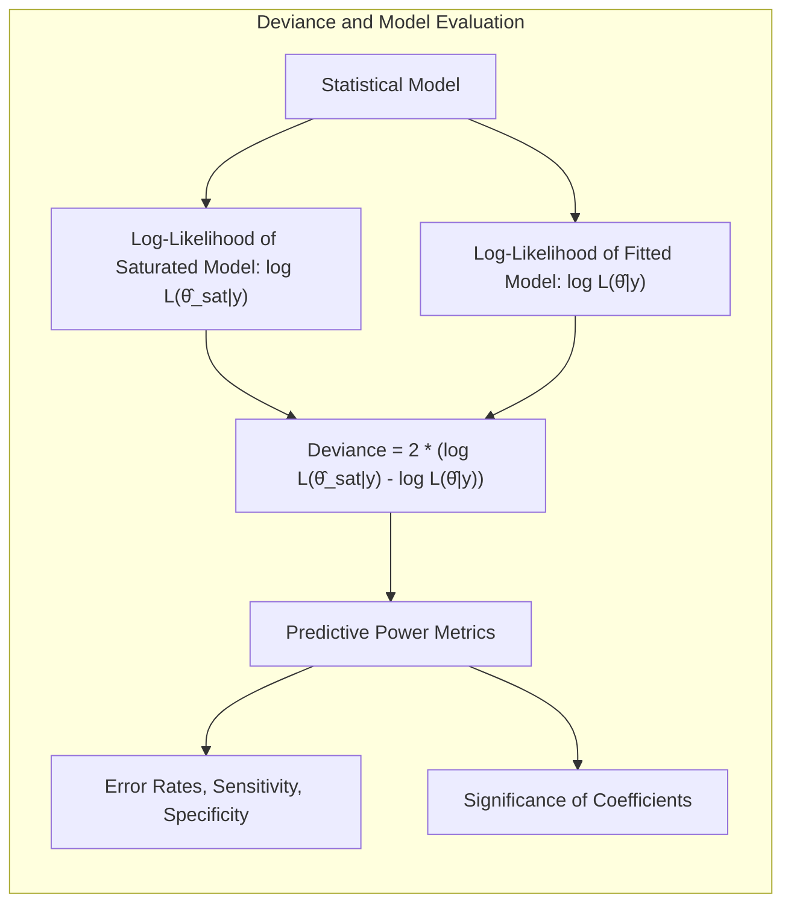
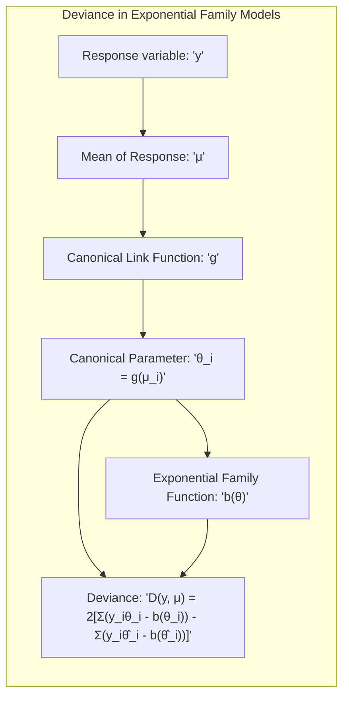
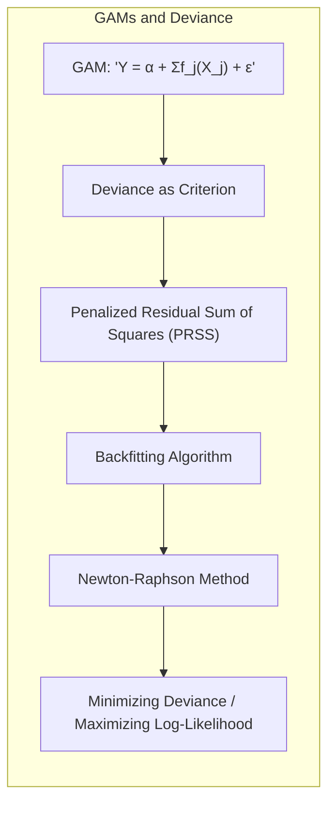
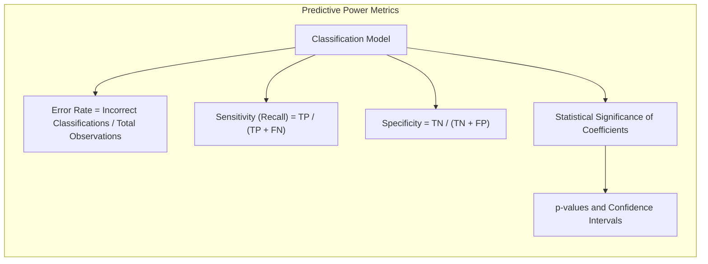
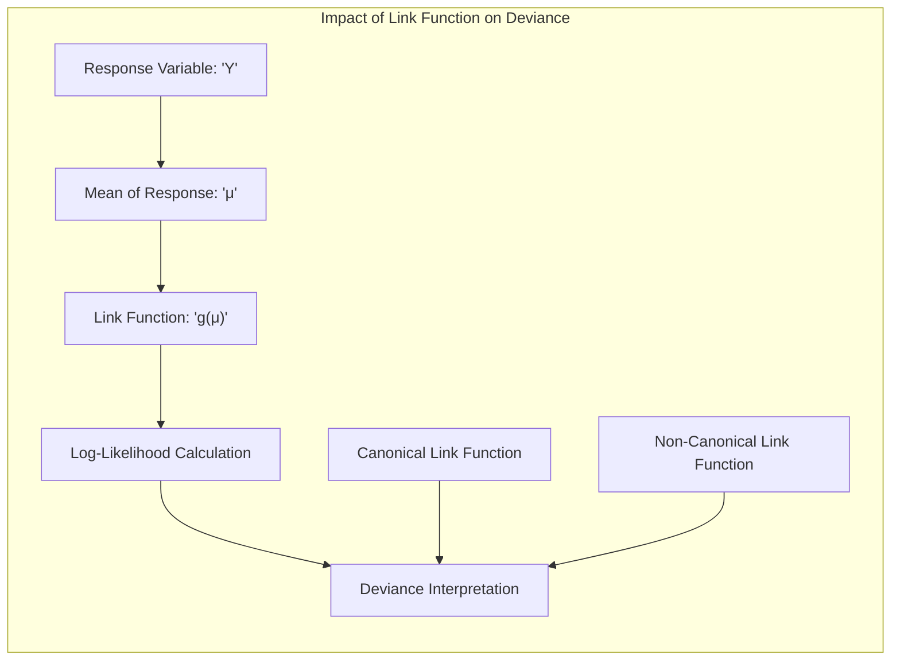

## Título: Modelos Aditivos Generalizados, Árvores e Métodos Relacionados: Avaliação de Ajuste com Deviance e Análise de Poder Preditivo

### Introdução

Este capítulo explora o conceito de deviance como uma métrica para avaliar o ajuste de modelos estatísticos, particularmente Modelos Aditivos Generalizados (GAMs) e outras técnicas relacionadas, como árvores de decisão, Multivariate Adaptive Regression Splines (MARS) e misturas hierárquicas de especialistas (HME) [^9.1]. A deviance, que é baseada na *log-likelihood*, quantifica a diferença entre o modelo ajustado e um modelo saturado. O capítulo detalha como a deviance é utilizada na comparação de modelos, como ela se relaciona com a teoria da família exponencial e como ela é utilizada na análise de poder preditivo, incluindo a análise de taxas de erro, sensibilidade e especificidade e a avaliação da significância dos coeficientes. O objetivo principal é fornecer uma compreensão detalhada de como a deviance é utilizada para avaliar a qualidade do ajuste, o poder preditivo e a capacidade de generalização de diferentes modelos de aprendizado supervisionado.

### Conceitos Fundamentais

**Conceito 1: Deviance como Métrica de Ajuste**

A deviance é uma medida de qualidade do ajuste de um modelo estatístico aos dados, e é definida como duas vezes a diferença entre a *log-likelihood* do modelo saturado (modelo que se ajusta perfeitamente aos dados) e a *log-likelihood* do modelo ajustado:

$$
\text{Deviance} = 2(\log L(\hat{\theta}_{sat}|y) - \log L(\hat{\theta}|y))
$$
onde $\hat{\theta}_{sat}$ são os parâmetros do modelo saturado, e $\hat{\theta}$ são os parâmetros do modelo ajustado, e $L(\theta|y)$ é a função de verossimilhança. Em modelos lineares, o modelo saturado corresponde ao ajuste perfeito para todos os dados. A deviance é utilizada para avaliar a adequação de um modelo aos dados e para comparar modelos com diferentes complexidades, sendo que quanto menor a deviance, melhor o ajuste do modelo. A deviance também possui relação com o conceito de informação e com o critério de Akaike, AIC.

> 💡 **Exemplo Numérico:**
>
> Suponha que temos um conjunto de dados com 5 observações, e ajustamos dois modelos: um modelo linear simples e um modelo quadrático. O modelo saturado teria um ajuste perfeito aos dados, com *log-likelihood* máxima.
>
> Modelo 1 (Linear): $\log L(\hat{\theta}_1|y) = -10.5$
> Modelo 2 (Quadrático): $\log L(\hat{\theta}_2|y) = -8.2$
> Modelo Saturado:  $\log L(\hat{\theta}_{sat}|y) = -5.0$
>
> A deviance para cada modelo é calculada como:
>
> Deviance (Modelo 1) = $2 * (-5.0 - (-10.5)) = 2 * 5.5 = 11.0$
> Deviance (Modelo 2) = $2 * (-5.0 - (-8.2)) = 2 * 3.2 = 6.4$
>
> Neste caso, o Modelo 2 (Quadrático) tem uma deviance menor, indicando um melhor ajuste aos dados do que o Modelo 1 (Linear).
>
> É importante notar que, embora o modelo quadrático tenha uma deviance menor, isso não significa necessariamente que ele generalizará melhor para novos dados. A complexidade do modelo deve ser considerada, e métodos como validação cruzada podem ser utilizados para avaliar o poder preditivo em dados não vistos.

**Lemma 1:** *A deviance é uma métrica baseada na *log-likelihood* que mede a diferença entre o ajuste de um modelo e o ajuste perfeito aos dados. A deviance permite comparar modelos de diferentes complexidades e sua aplicação é ampla em modelos da família exponencial*. A deviance é fundamental para comparar modelos com diferente complexidade [^4.4.2], [^4.4.3].

**Conceito 2: Deviance em Modelos da Família Exponencial**

Em modelos pertencentes à família exponencial, a deviance pode ser expressa de forma mais específica, utilizando a função de ligação canônica. Se $y$ for uma variável resposta e $\mu$ a média da resposta, com função de ligação $g$, a deviance é dada por:
$$
D(y, \mu) = 2\left[ \sum_i y_i\theta_i - b(\theta_i) - \sum_i (y_i\hat{\theta}_i - b(\hat{\theta}_i)) \right]
$$
onde $\theta_i = g(\mu_i)$ é o parâmetro canônico da família exponencial, $b(\theta)$ é uma função específica da família exponencial, e $y_i$ é o valor da resposta da $i$-ésima observação. A diferença entre o modelo saturado e o modelo ajustado é utilizada para calcular a deviance. Em modelos da família exponencial, a deviance pode ser utilizada para avaliar o ajuste e a capacidade preditiva dos modelos. As propriedades da família exponencial e da função de ligação canônica simplificam a interpretação da deviance.

> 💡 **Exemplo Numérico:**
>
> Considere um modelo de regressão logística, onde a variável resposta $y_i$ é binária (0 ou 1) e o modelo assume uma distribuição de Bernoulli. A função de ligação canônica é o logit, e o parâmetro canônico é $\theta_i = \log(\frac{\mu_i}{1-\mu_i})$, onde $\mu_i$ é a probabilidade de $y_i = 1$. A função $b(\theta)$ é dada por $b(\theta) = \log(1+e^\theta)$.
>
> Suponha que temos duas observações:
>
> Observação 1: $y_1 = 1$, $\mu_1 = 0.8$
> Observação 2: $y_2 = 0$, $\mu_2 = 0.3$
>
> Calculando os parâmetros canônicos:
> $\theta_1 = \log(\frac{0.8}{1-0.8}) = \log(4) \approx 1.386$
> $\theta_2 = \log(\frac{0.3}{1-0.3}) = \log(\frac{3}{7}) \approx -0.847$
>
> Calculando $b(\theta)$:
> $b(\theta_1) = \log(1 + e^{1.386}) \approx 1.786$
> $b(\theta_2) = \log(1 + e^{-0.847}) \approx 0.408$
>
> Para o modelo saturado, $\hat{\mu}_i = y_i$, e para o modelo ajustado, temos os valores de $\mu_i$ calculados pelo modelo. A deviance para essas duas observações seria:
>
> $D(y, \mu) = 2 [ (1 * 1.386 - 1.786) + (0 * -0.847 - 0.408) -  (1 * \log(4) - \log(1 + e^{\log(4)}) + 0*\log(3/7) - \log(1 + e^{\log(3/7)}))]  $
> $D(y, \mu) = 2 [ (1.386 - 1.786)  - 0.408 - (1.386 - \log(5) + 0 - \log(10/7))] \approx 2[ -0.4 - 0.408 - (1.386 - 1.609 + 0 - 0.357)] \approx 2[-0.808 - (-0.179)] = 2[-0.629] = -1.258$
>
> Note que este é apenas um exemplo com duas observações, e a deviance total seria a soma sobre todas as observações. A deviance é utilizada para comparar o ajuste do modelo com o modelo saturado, onde cada observação é perfeitamente ajustada.

**Corolário 1:** *A utilização da função de ligação canônica simplifica o cálculo da deviance, e permite estabelecer uma conexão direta com o método da máxima verossimilhança. Modelos da família exponencial podem ser avaliados pela deviance de forma apropriada, uma vez que a sua métrica é baseada na função de verossimilhança* [^4.5].

**Conceito 3: Deviance e Modelos Aditivos Generalizados (GAMs)**

Em modelos aditivos generalizados (GAMs), a deviance pode ser utilizada como critério de ajuste, de modo que os parâmetros do modelo são estimados minimizando a deviance. No caso do uso de métodos de suavização, a minimização é feita utilizando o conceito de soma dos quadrados penalizada (PRSS), onde a soma dos erros quadráticos é combinada com um termo de penalização para controlar a flexibilidade dos modelos. O algoritmo de backfitting, aninhado no método de Newton-Raphson, pode ser utilizado para encontrar a solução que minimiza a deviance ou, de forma equivalente, maximiza a *log-likelihood* em modelos com distribuições da família exponencial e funções de ligação canónicas. A utilização da deviance como critério de ajuste em modelos GAMs permite a modelagem de dados com diferentes distribuições e garante a convergência para estimativas de máxima verossimilhança.

> 💡 **Exemplo Numérico:**
>
> Imagine um GAM com duas variáveis preditoras, $X_1$ e $X_2$, e uma variável resposta $Y$ com distribuição normal. O modelo GAM pode ser expresso como:
>
> $Y = \alpha + f_1(X_1) + f_2(X_2) + \epsilon$
>
> onde $f_1$ e $f_2$ são funções suaves (splines) e $\epsilon$ é o erro.
>
> A deviance para este modelo seria dada pela soma dos quadrados dos erros:
>
> $Deviance = \sum_i (y_i - \hat{y}_i)^2$
>
> Onde $\hat{y}_i = \alpha + f_1(x_{1i}) + f_2(x_{2i})$
>
> O algoritmo de backfitting estima iterativamente as funções $f_1$ e $f_2$. Em cada iteração, o algoritmo mantém uma função fixa e otimiza a outra. Por exemplo, ao otimizar $f_1$, o algoritmo minimiza a deviance (ou PRSS) com $f_2$ fixo. O termo de penalização em PRSS é usado para evitar overfitting, controlando a suavidade das funções.
>
> A otimização é feita utilizando o método de Newton-Raphson, buscando o mínimo da deviance em relação aos parâmetros da função spline. O algoritmo de backfitting itera até a convergência, quando as mudanças na deviance são mínimas.
>
> Por exemplo, vamos supor que em uma iteração do algoritmo, temos:
> $f_1(X_1) = 2X_1 + 0.5X_1^2$
> $f_2(X_2) = 3X_2 - 0.2X_2^3$
> $\alpha = 1$
>
> Para uma observação, se $x_{1i}=2$ e $x_{2i}=1$, então:
> $\hat{y}_i = 1 + (2*2 + 0.5*2^2) + (3*1 - 0.2*1^3) = 1 + 6 + 2.8 = 9.8$
>
> Se o valor real de $y_i$ for 10, o erro para esta observação é $(10-9.8)^2 = 0.04$. A deviance total será a soma desses erros ao quadrado para todas as observações. O algoritmo de otimização ajusta os parâmetros de $f_1$ e $f_2$ para minimizar essa deviance.

> ⚠️ **Nota Importante:** A deviance é uma generalização da soma dos erros quadráticos, que pode ser utilizada para modelos com distribuições da família exponencial, e modelos que usam função de ligação não linear. A deviance quantifica a diferença entre o modelo ajustado e o ajuste perfeito aos dados, e permite a comparação entre modelos com diferentes complexidades [^4.4.1].

> ❗ **Ponto de Atenção:** O valor da deviance é influenciado pela escolha do modelo e pelos parâmetros do modelo, e sua utilização na comparação entre modelos deve considerar que valores menores são preferíveis, mas pode não representar necessariamente o modelo que terá o melhor desempenho em novos dados [^4.4.2].

> ✔️ **Destaque:** A deviance é uma ferramenta poderosa para avaliar o ajuste de modelos estatísticos, e o uso em modelos da família exponencial, em conjunto com métodos de regularização, contribui para melhorar o ajuste, a generalização e a estabilidade do modelo [^4.4.4].

### Avaliação do Poder Preditivo: Taxas de Erro, Sensibilidade, Especificidade e Significância dos Coeficientes

A avaliação do poder preditivo dos modelos de classificação envolve a análise de diferentes métricas e a avaliação da significância estatística dos parâmetros. As métricas mais comuns para avaliar o desempenho dos modelos de classificação binária são:

*   **Erro de Classificação (Error Rate):** A proporção de observações classificadas incorretamente:
    $$
    \text{Erro de Classificação} = \frac{\text{Número de Classificações Incorretas}}{\text{Número Total de Observações}}
    $$
    O erro de classificação é uma métrica simples e geral para avaliar a capacidade do modelo de classificar corretamente as observações.

*   **Sensibilidade (Recall):** A proporção de verdadeiros positivos (TP) entre todas as observações positivas reais:
    $$
     \text{Sensibilidade} = \frac{\text{TP}}{\text{TP + FN}}
    $$
    onde TP são os verdadeiros positivos, e FN são os falsos negativos. A sensibilidade é importante para avaliar o desempenho do modelo na detecção de eventos positivos.

*   **Especificidade:** A proporção de verdadeiros negativos (TN) entre todas as observações negativas reais:
    $$
    \text{Especificidade} = \frac{\text{TN}}{\text{TN + FP}}
    $$
    onde TN são os verdadeiros negativos, e FP são os falsos positivos. A especificidade é importante para avaliar o desempenho do modelo na detecção de eventos negativos.

> 💡 **Exemplo Numérico:**
>
> Suponha que temos um modelo de classificação binária para detecção de fraudes em transações financeiras. Após aplicar o modelo em um conjunto de teste de 1000 transações, obtivemos os seguintes resultados:
>
> *   Verdadeiros Positivos (TP): 80 (transações fraudulentas corretamente identificadas)
> *   Falsos Negativos (FN): 20 (transações fraudulentas não identificadas)
> *   Verdadeiros Negativos (TN): 850 (transações legítimas corretamente identificadas)
> *   Falsos Positivos (FP): 50 (transações legítimas classificadas como fraudulentas)
>
> Calculando as métricas:
>
> *   Erro de Classificação = $\frac{20 + 50}{1000} = \frac{70}{1000} = 0.07$ (7% de erro)
> *   Sensibilidade = $\frac{80}{80 + 20} = \frac{80}{100} = 0.8$ (80% de sensibilidade)
> *   Especificidade = $\frac{850}{850 + 50} = \frac{850}{900} \approx 0.94$ (94% de especificidade)
>
> Neste exemplo, o modelo tem uma boa especificidade (detecta bem as transações legítimas) mas uma sensibilidade razoável (deixa passar 20% das fraudes). O erro de classificação geral é de 7%, mas pode não ser a melhor métrica para avaliar o desempenho em um problema desbalanceado, como a detecção de fraudes (onde as transações fraudulentas são raras).

Além dessas métricas, a significância estatística dos coeficientes do modelo também deve ser avaliada, principalmente nos modelos que utilizam funções lineares, como a regressão logística ou o GAM com funções lineares. A significância dos coeficientes é avaliada através de *p-valores*, que medem a probabilidade de obter um efeito tão grande quanto o observado, sob a hipótese nula que o coeficiente é igual a zero. Intervalos de confiança também são úteis para avaliar a incerteza associada às estimativas dos parâmetros.

> 💡 **Exemplo Numérico:**
>
> Em um modelo de regressão logística, temos o seguinte resultado para um coeficiente $\beta_1$ associado a uma variável preditora $X_1$:
>
> *   Estimativa do Coeficiente ($\hat{\beta}_1$): 0.5
> *   Erro Padrão: 0.2
> *   p-valor: 0.03
> *   Intervalo de Confiança de 95%: [0.1, 0.9]
>
> O p-valor de 0.03 indica que, sob a hipótese nula de que o coeficiente é zero, a probabilidade de observar um efeito tão grande quanto 0.5 é de apenas 3%. Portanto, podemos rejeitar a hipótese nula e concluir que a variável $X_1$ tem um efeito significativo na variável resposta. O intervalo de confiança de 95% [0.1, 0.9] indica que temos 95% de confiança de que o verdadeiro valor do coeficiente está entre 0.1 e 0.9.

A combinação da análise do erro de classificação, sensibilidade e especificidade com a avaliação da significância dos coeficientes, fornece uma avaliação mais completa do poder preditivo de cada modelo. O *trade-off* entre as diferentes métricas de avaliação deve ser considerado dependendo do contexto do problema e do objetivo da análise.

**Lemma 3:** *O poder preditivo de um modelo é avaliado por métricas como erro de classificação, sensibilidade e especificidade, que medem a capacidade do modelo de classificar as observações de forma correta. A significância estatística dos coeficientes auxilia na interpretação do modelo e na identificação das variáveis preditoras mais relevantes*. A combinação das métricas de desempenho com a análise dos coeficientes resulta em uma avaliação mais completa do modelo [^4.5.1].

### A Relação entre Deviance, Funções de Ligação e Poder Preditivo

A deviance, ao medir a diferença entre o modelo saturado e o modelo ajustado, está relacionada com a capacidade do modelo de se ajustar aos dados e, portanto, está indiretamente relacionada com o poder preditivo do modelo. Modelos com menor deviance tendem a ter um melhor ajuste aos dados de treino, mas podem não ter necessariamente o melhor desempenho em dados novos. A escolha da função de ligação influencia diretamente a deviance, e funções de ligação canônicas, por exemplo, levam a modelos com uma deviance bem definida. Modelos com boa capacidade preditiva, idealmente, devem apresentar uma boa capacidade de ajuste (baixa deviance) e boas métricas de desempenho (alta sensibilidade e especificidade). A escolha adequada da função de ligação, suavizador e parâmetro de regularização influencia tanto o ajuste (deviance) quanto o poder preditivo.

A análise das métricas de desempenho e da significância dos parâmetros é essencial para interpretar os resultados e escolher o modelo mais apropriado para cada contexto. Modelos com grande flexibilidade podem ter uma menor deviance (melhor ajuste), mas podem apresentar maior risco de overfitting, enquanto modelos mais simples podem ter uma deviance maior, mas serem mais robustos. O *trade-off* entre complexidade do modelo e capacidade preditiva é um aspecto chave da avaliação de modelos de aprendizado supervisionado [^4.5.2].

### Métodos de Otimização e sua Relação com a Deviance e o Poder Preditivo

Métodos de otimização, como o algoritmo de backfitting e o método de Newton-Raphson, são utilizados para minimizar a deviance, o que leva a um modelo com bom ajuste aos dados de treino. O algoritmo de backfitting, ao iterar sobre cada preditor e suavizador, busca um mínimo para a função de custo, e o método de Newton-Raphson, utilizando o gradiente e o hessiano, busca uma solução mais rápida e precisa para a otimização. A utilização de métodos de regularização e validação cruzada permite escolher parâmetros que maximizam a capacidade de generalização. Modelos mais complexos podem ser utilizados para dados complexos, desde que a otimização seja utilizada corretamente e a regularização seja utilizada para garantir a estabilidade da solução. O algoritmo de local scoring, que combina o algoritmo de backfitting com o método de Newton-Raphson, é uma ferramenta para estimar modelos de forma eficiente, especialmente para modelos da família exponencial.

### Perguntas Teóricas Avançadas: Como a escolha da função de ligação afeta a interpretação da deviance e como essa escolha se relaciona com as propriedades assintóticas dos estimadores?

**Resposta:**

A escolha da função de ligação afeta diretamente a interpretação da deviance e a sua relação com as propriedades assintóticas dos estimadores em modelos generalizados. A deviance é definida como:

$$
\text{Deviance} = 2(\log L(\hat{\theta}_{sat}|y) - \log L(\hat{\theta}|y))
$$
onde $\hat{\theta}_{sat}$ são os parâmetros do modelo saturado e $\hat{\theta}$ são os parâmetros do modelo ajustado, e $L(\theta|y)$ é a função de verossimilhança. A função de verossimilhança é definida de acordo com a função de distribuição da família exponencial e a função de ligação.

The link function transforms the mean of the response variable, and therefore influences how the log-likelihood is calculated and how the deviance is interpreted. When the link function is canonical, the deviance has a direct interpretation because it is related to the canonical parameter of the distribution. The choice of the canonical link function also ensures that the distribution of the response variable is compatible with the model, which simplifies the optimization process and leads to estimators with better statistical properties.

> 💡 **Exemplo Numérico:**
>
> Considere um modelo com variável resposta $Y$ com distribuição de Poisson, onde a média é $\mu$.
>
> *   **Função de Ligação Canônica (Log):** $g(\mu) = \log(\mu)$
> *   **Função de Ligação Não Canônica (Identidade):** $g(\mu) = \mu$
>
> Se usarmos a função de ligação canônica, a deviance terá uma interpretação direta em termos da diferença entre o modelo ajustado e o modelo saturado. Se usarmos a função de ligação identidade, a deviance não terá uma interpretação tão clara, e a otimização pode ser mais difícil.
>
> No caso da função de ligação log, o parâmetro canônico é $\theta = \log(\mu)$, e a deviance é dada por:
>
> $D(y, \mu) = 2 \sum_i [y_i \log(\frac{y_i}{\mu_i}) - (y_i - \mu_i)]$
>
> Note que a deviance com a função de ligação canônica tem uma forma específica relacionada à distribuição de Poisson. Com a função de ligação identidade, a deviance não teria essa forma direta. Além disso, a função de ligação log garante que $\mu$ seja sempre positivo, o que é consistente com a distribuição de Poisson.

A escolha de uma função de ligação não canônica pode tornar a interpretação da deviance mais complexa. Funções de ligação não canônicas podem levar a modelos com melhor ajuste aos dados, mas a interpretação da deviance torna-se mais difícil devido à transformação dos parâmetros e da escala da resposta. A escolha da função de ligação afeta também a forma da matriz de informação de Fisher, o que influencia a convergência do algoritmo de Newton-Raphson e as propriedades assintóticas dos estimadores. A escolha da função de ligação, portanto, afeta o resultado da modelagem e a interpretação da deviance.

**Lemma 5:** *A função de ligação tem um papel importante na interpretação da deviance e nas propriedades assintóticas dos estimadores, e a escolha da função de ligação canônica garante uma melhor interpretação e melhores propriedades estatísticas para a estimação dos parâmetros. A deviance, como uma medida de qualidade do ajuste, deve ser interpretada levando em consideração a função de ligação utilizada*. A escolha da função de ligação tem um impacto direto nas propriedades assintóticas dos estimadores [^4.4.5].

**Corolário 5:** *A utilização da função de ligação canônica, quando aplicável, facilita a interpretação da deviance e garante boas propriedades estatísticas para a estimação dos parâmetros em modelos da família exponencial. A escolha de funções de ligação não canônicas torna a interpretação da deviance mais complexa e as propriedades assintóticas dos estimadores podem ser afetadas*. A escolha da função de ligação é um aspecto crucial na modelagem estatística [^4.4.1], [^4.4.4].

> ⚠️ **Ponto Crucial**: A escolha da função de ligação influencia diretamente na interpretação da deviance e na relação entre a função de custo e os parâmetros do modelo, e modelos da família exponencial se beneficiam da utilização de funções de ligação canônicas, que garantem um processo de otimização mais eficiente e estimativas com boas propriedades assintóticas [^4.4.3].

### Conclusão

Este capítulo abordou a utilização da deviance como uma métrica para avaliar o ajuste de modelos estatísticos, com foco em modelos aditivos generalizados, árvores de decisão, MARS e HME. A relação da deviance com a família exponencial, e como ela se relaciona com o poder preditivo, a significância dos coeficientes e com o método de otimização foram explorados em detalhe. A compreensão da deviance e das métricas de desempenho é essencial para a avaliação de modelos e para a escolha da abordagem mais adequada para cada tipo de problema.

### Footnotes

[^4.1]: "In this chapter we begin our discussion of some specific methods for super-vised learning. These techniques each assume a (different) structured form for the unknown regression function, and by doing so they finesse the curse of dimensionality. Of course, they pay the possible price of misspecifying the model, and so in each case there is a tradeoff that has to be made." *(Trecho de "Additive Models, Trees, and Related Methods")*

[^4.2]: "Regression models play an important role in many data analyses, providing prediction and classification rules, and data analytic tools for understand-ing the importance of different inputs." *(Trecho de "Additive Models, Trees, and Related Methods")*

[^4.3]: "In this section we describe a modular algorithm for fitting additive models and their generalizations. The building block is the scatterplot smoother for fitting nonlinear effects in a flexible way. For concreteness we use as our scatterplot smoother the cubic smoothing spline described in Chapter 5." *(Trecho de "Additive Models, Trees, and Related Methods")*

[^4.3.1]:  "The additive model has the form $Y = \alpha + \sum_{j=1}^p f_j(X_j) + \epsilon$, where the error term $\epsilon$ has mean zero." * (Trecho de "Additive Models, Trees, and Related Methods")*

[^4.3.2]:   "Given observations $x_i, y_i$, a criterion like the penalized sum of squares (5.9) of Section 5.4 can be specified for this problem, $PRSS(\alpha, f_1, f_2,\ldots, f_p) = \sum_i^N (y_i - \alpha - \sum_j^p f_j(x_{ij}))^2 + \sum_j^p \lambda_j \int(f_j''(t_j))^2 dt_j$" * (Trecho de "Additive Models, Trees, and Related Methods")*

[^4.3.3]: "where the $\lambda_j > 0$ are tuning parameters. It can be shown that the minimizer of (9.7) is an additive cubic spline model; each of the functions $f_j$ is a cubic spline in the component $X_j$, with knots at each of the unique values of $x_{ij}, i = 1,\ldots, N$." *(Trecho de "Additive Models, Trees, and Related Methods")*

[^4.4]: "For two-class classification, recall the logistic regression model for binary data discussed in Section 4.4. We relate the mean of the binary response $\mu(X) = Pr(Y = 1|X)$ to the predictors via a linear regression model and the logit link function:  $\log(\mu(X)/(1 – \mu(X)) = \alpha + \beta_1 X_1 + \ldots + \beta_pX_p$." * (Trecho de "Additive Models, Trees, and Related Methods")*

[^4.4.1]: "The additive logistic regression model replaces each linear term by a more general functional form: $\log(\mu(X)/(1 – \mu(X))) = \alpha + f_1(X_1) + \cdots + f_p(X_p)$, where again each $f_j$ is an unspecified smooth function." * (Trecho de "Additive Models, Trees, and Related Methods")*

[^4.4.2]: "While the non-parametric form for the functions $f_j$ makes the model more flexible, the additivity is retained and allows us to interpret the model in much the same way as before. The additive logistic regression model is an example of a generalized additive model." *(Trecho de "Additive Models, Trees, and Related Methods")*

[^4.4.3]: "In general, the conditional mean $\mu(X)$ of a response $Y$ is related to an additive function of the predictors via a link function $g$:  $g[\mu(X)] = \alpha + f_1(X_1) + \cdots + f_p(X_p)$." *(Trecho de "Additive Models, Trees, and Related Methods")*

[^4.4.4]:  "Examples of classical link functions are the following: $g(\mu) = \mu$ is the identity link, used for linear and additive models for Gaussian response data." *(Trecho de "Additive Models, Trees, and Related Methods")*

[^4.4.5]: "$g(\mu) = \text{logit}(\mu)$ as above, or $g(\mu) = \text{probit}(\mu)$, the probit link function, for modeling binomial probabilities. The probit function is the inverse Gaussian cumulative distribution function: $\text{probit}(\mu) = \Phi^{-1}(\mu)$." *(Trecho de "Additive Models, Trees, and Related Methods")*

[^4.5]: "All three of these arise from exponential family sampling models, which in addition include the gamma and negative-binomial distributions. These families generate the well-known class of generalized linear models, which are all extended in the same way to generalized additive models." *(Trecho de "Additive Models, Trees, and Related Methods")*

[^4.5.1]: "The functions $f_j$ are estimated in a flexible manner, using an algorithm whose basic building block is a scatterplot smoother. The estimated func-tion $f_j$ can then reveal possible nonlinearities in the effect of $X_j$. Not all of the functions $f_j$ need to be nonlinear." *(Trecho de "Additive Models, Trees, and Related Methods")*

[^4.5.2]: "We can easily mix in linear and other parametric forms with the nonlinear terms, a necessity when some of the inputs are qualitative variables (factors)." *(Trecho de "Additive Models, Trees, and Related Methods")*
