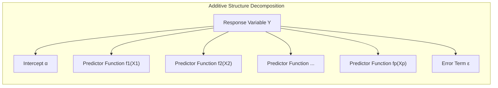
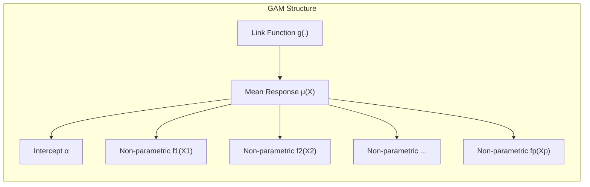
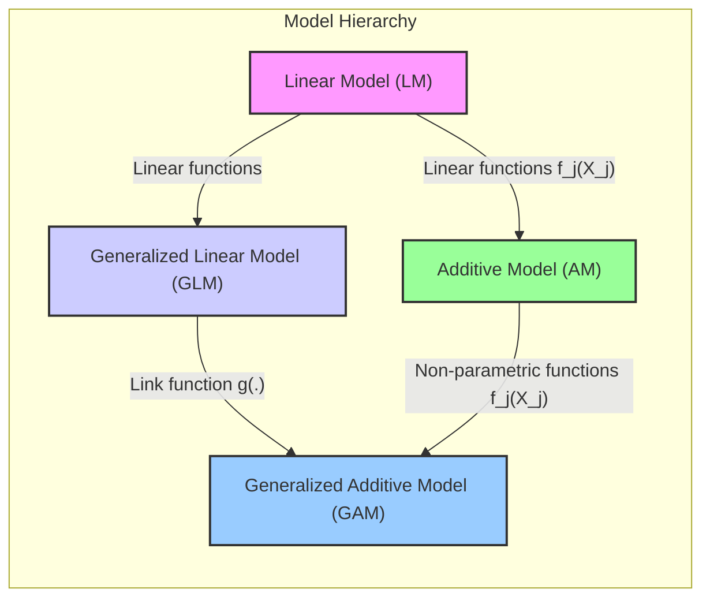
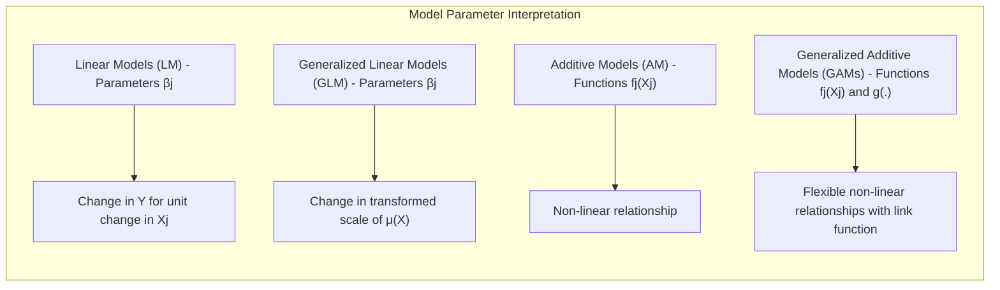
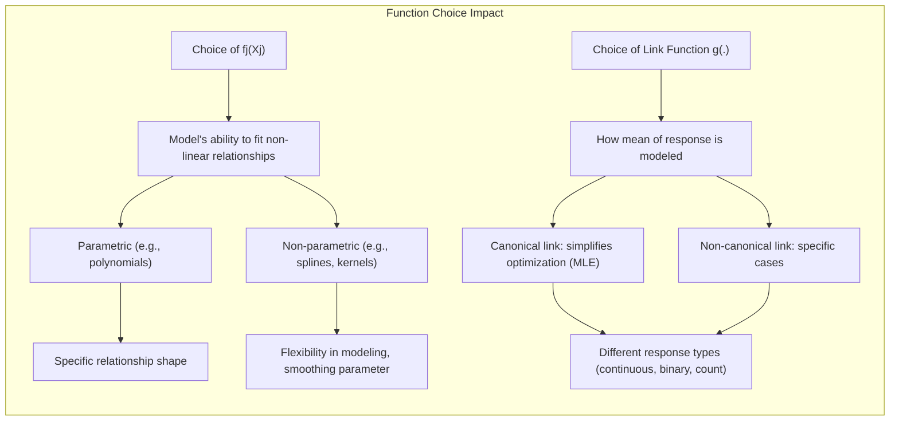

## Título: Modelos Aditivos: Fundamentos, Aplicações e Relações com Modelos Lineares e Generalizados

```mermaid
graph LR
    subgraph "Additive Model Structure"
        direction TB
        A["Linear Models (LM)"]
        B["Generalized Linear Models (GLM)"]
        C["Additive Models (AM)"]
        D["Generalized Additive Models (GAMs)"]
        A -->|Linear functions f_j(X_j)| C
        B -->|Linear functions and link function g(.)| D
        C -->|Non-parametric functions f_j(X_j)| D
    end
    style A fill:#f9f,stroke:#333,stroke-width:2px
    style B fill:#ccf,stroke:#333,stroke-width:2px
    style C fill:#9f9,stroke:#333,stroke-width:2px
    style D fill:#9cf,stroke:#333,stroke-width:2px
```

### Introdução

Este capítulo explora em profundidade os Modelos Aditivos, uma classe de modelos estatísticos que generaliza os modelos lineares ao permitir que a relação entre a variável resposta e os preditores seja modelada através de funções não paramétricas ou semi-paramétricas, mantendo a estrutura aditiva. Modelos aditivos, como os Modelos Aditivos Generalizados (GAMs), oferecem uma abordagem flexível e interpretável para modelar dados complexos, onde relações não lineares entre preditores e respostas são frequentes [^9.1]. O capítulo detalha a formulação matemática de modelos aditivos, a sua relação com modelos lineares e modelos lineares generalizados (GLMs), e como os modelos MARS (Multivariate Adaptive Regression Splines) e HME (Hierarchical Mixtures of Experts) se encaixam ou se relacionam com os modelos aditivos. O objetivo principal é fornecer uma compreensão abrangente sobre os fundamentos, as aplicações, e como a estrutura aditiva se conecta com a modelagem de diferentes tipos de dados.

### Conceitos Fundamentais

**Conceito 1: A Estrutura Aditiva em Modelos Estatísticos**

A estrutura aditiva em modelos estatísticos refere-se à combinação linear das funções de cada preditor para modelar a resposta. Em um modelo aditivo genérico, a variável resposta $Y$ é modelada como:

$$
Y = \alpha + f_1(X_1) + f_2(X_2) + \ldots + f_p(X_p) + \epsilon
$$
onde $\alpha$ é o intercepto, $f_j(X_j)$ são as funções de cada preditor $X_j$ e $\epsilon$ é o termo de erro. Em um modelo linear clássico, as funções $f_j(X_j)$ são funções lineares dos preditores, ou seja, $f_j(X_j) = \beta_j X_j$. Em modelos aditivos, as funções $f_j(X_j)$ podem ser não lineares, o que aumenta a capacidade do modelo de capturar relações complexas entre os preditores e a resposta. A estrutura aditiva, por si só, não especifica qual o tipo de função utilizada. Em geral, a estrutura aditiva permite que cada preditor seja modelado separadamente, e a relação total seja uma combinação linear de cada componente.

> 💡 **Exemplo Numérico:**
> Imagine que estamos modelando o preço de casas ($Y$) com base em duas variáveis: área em metros quadrados ($X_1$) e número de quartos ($X_2$). Em um modelo aditivo, poderíamos ter:
>
> $Y = 100 + f_1(X_1) + f_2(X_2) + \epsilon$
>
> Onde $f_1(X_1)$ poderia ser uma função que representa o aumento do preço com o aumento da área, e $f_2(X_2)$ representa o aumento do preço com o número de quartos. Se $f_1(X_1) = 200 * \sqrt{X_1}$ e $f_2(X_2) = 5000 * X_2$, então, para uma casa de 100 $m^2$ e 3 quartos, o preço seria estimado como:
>
> $Y = 100 + 200 * \sqrt{100} + 5000 * 3 + \epsilon = 100 + 2000 + 15000 + \epsilon = 17100 + \epsilon$.
>
> Note que as funções $f_1$ e $f_2$ podem ser não lineares e que a resposta é obtida pela soma dos efeitos de cada preditor.

**Lemma 1:** *A estrutura aditiva permite modelar os efeitos de cada preditor de forma independente, o que simplifica a interpretação dos modelos. A independência dos efeitos dos preditores simplifica a análise dos resultados e a compreensão da influência de cada preditor na resposta*. A estrutura aditiva, embora simplificadora, é uma ferramenta importante na modelagem estatística [^4.3.1].



**Conceito 2: Modelos Lineares e a Estrutura Aditiva**

Os modelos lineares são um caso especial de modelos aditivos, onde as funções $f_j(X_j)$ são lineares, como por exemplo:

$$
Y = \alpha + \beta_1X_1 + \beta_2X_2 + \ldots + \beta_pX_p + \epsilon
$$

Modelos lineares são fáceis de interpretar e ajustar, mas sua capacidade de modelar relações não lineares é limitada. Os modelos lineares assumem que o efeito de cada preditor na resposta é constante e linear, independentemente dos valores dos outros preditores. Em muitas situações, essa simplificação pode ser insuficiente para modelar a complexidade dos dados, o que leva a modelos com *bias* e um menor poder preditivo. Os modelos lineares servem como base para muitos outros modelos e sua simplicidade e interpretabilidade são qualidades desejáveis em muitas análises.

> 💡 **Exemplo Numérico:**
> Usando o mesmo exemplo de preço de casas, um modelo linear poderia ser:
>
> $Y = 50000 + 1500*X_1 + 10000*X_2 + \epsilon$
>
> Onde o preço aumenta linearmente com a área ($X_1$) e o número de quartos ($X_2$). Para uma casa de 100 $m^2$ e 3 quartos, o preço seria:
>
> $Y = 50000 + 1500*100 + 10000*3 + \epsilon = 50000 + 150000 + 30000 + \epsilon = 230000 + \epsilon$
>
> Neste caso, o efeito de cada metro quadrado adicional e de cada quarto adicional é constante, o que pode não ser realista em muitos casos.

**Corolário 1:** *Modelos lineares são um caso especial de modelos aditivos, onde a função de cada preditor é uma função linear. A estrutura aditiva permite comparar modelos lineares e não lineares em uma mesma estrutura geral. A diferença entre um modelo linear e um modelo não linear reside na natureza da função utilizada em cada componente* [^4.1], [^4.2].

**Conceito 3: Modelos Aditivos Generalizados (GAMs) e a Não Linearidade**

Os Modelos Aditivos Generalizados (GAMs) extendem os modelos aditivos lineares através da utilização de funções não paramétricas para modelar a relação entre cada preditor e a resposta. O modelo GAM é dado por:

$$
g(\mu(X)) = \alpha + f_1(X_1) + f_2(X_2) + \ldots + f_p(X_p)
$$
onde $g$ é a função de ligação, $\mu(X)$ é a média da resposta e as funções $f_j(X_j)$ são funções não paramétricas que capturam relações não lineares. GAMs utilizam a flexibilidade de métodos não paramétricos, como *splines* e *kernels*, para modelar as funções $f_j$. A utilização de uma função de ligação $g$ permite estender os modelos aditivos para diferentes tipos de variáveis resposta, como variáveis binárias (com a função *logit*) e dados de contagem (com a função *log*). O uso da família exponencial também permite que o modelo seja generalizado para diferentes tipos de variáveis resposta, e que as propriedades de máxima verossimilhança sejam utilizadas para estimar os parâmetros.

> ⚠️ **Nota Importante:** Os GAMs generalizam os modelos aditivos lineares, e permitem a modelagem de relações não lineares com cada preditor. A combinação de funções não paramétricas, estrutura aditiva e função de ligação permite que GAMs sejam mais flexíveis que modelos lineares e, ao mesmo tempo, mantêm a interpretabilidade [^4.4.3], [^4.4.4].

> ❗ **Ponto de Atenção:** A flexibilidade dos GAMs é controlada pela escolha dos suavizadores, e pelos parâmetros de regularização. O uso de suavizadores muito flexíveis pode levar a overfitting, e o uso de suavizadores muito restritivos pode não conseguir capturar não linearidades importantes nos dados [^4.3.1].

> ✔️ **Destaque:** GAMs representam uma extensão da modelagem linear, e combinam a estrutura aditiva com a utilização de funções não paramétricas, o que aumenta a capacidade de modelar não linearidades. A escolha da função de ligação permite que o modelo seja utilizado para modelar diferentes tipos de variáveis resposta [^4.5].

> 💡 **Exemplo Numérico:**
> Suponha que queremos modelar a probabilidade de um cliente comprar um produto ($Y$), com base na sua idade ($X_1$) e no tempo gasto no site ($X_2$). Usando um GAM com função de ligação logit, temos:
>
> $logit(P(Y=1|X)) = \alpha + f_1(X_1) + f_2(X_2)$
>
> Onde $logit(p) = log(p/(1-p))$. As funções $f_1$ e $f_2$ poderiam ser modeladas com *splines*. Por exemplo, $f_1(X_1)$ poderia mostrar que a probabilidade de compra aumenta com a idade até um certo ponto, e depois diminui, enquanto $f_2(X_2)$ poderia mostrar que a probabilidade de compra aumenta com o tempo gasto no site, mas com retornos decrescentes. A função de ligação *logit* transforma a soma das funções em uma probabilidade entre 0 e 1.



### Formulações Matemáticas de Modelos Aditivos e Relações com Modelos Lineares e Generalizados



A formulação matemática de modelos aditivos e a sua relação com modelos lineares e modelos generalizados é dada abaixo:

*   **Modelos Lineares (LM):** Em modelos lineares, a variável resposta $Y$ é modelada como uma função linear dos preditores $X$:
    $$
    Y = \alpha + \beta_1X_1 + \beta_2X_2 + \ldots + \beta_pX_p + \epsilon
    $$
     onde $\alpha$ é o intercepto, $\beta_j$ são os coeficientes dos preditores, $X_j$ são os preditores e $\epsilon$ é o erro. Modelos lineares assumem que a relação entre a resposta e os preditores é linear, e que o erro segue uma distribuição normal com média zero e variância constante.
*   **Modelos Lineares Generalizados (GLM):** Os modelos lineares generalizados utilizam uma função de ligação $g$ para relacionar a média da variável resposta $\mu$ com uma combinação linear dos preditores:
     $$
     g(\mu(X)) = \alpha + \beta_1X_1 + \beta_2X_2 + \ldots + \beta_pX_p
     $$
    onde $g$ é a função de ligação, $\mu(X) = E(Y|X)$ e os parâmetros são obtidos utilizando métodos como a máxima verossimilhança (MLE). Os GLMs permitem modelar diferentes tipos de respostas, incluindo respostas binárias, com a utilização da função de ligação *logit* ou *probit*. Os GLMs mantêm a estrutura linear dos preditores e utilizam a função de ligação para modelar os dados.

*  **Modelos Aditivos (AM):** Modelos aditivos estendem modelos lineares através da modelagem de cada preditor com uma função não paramétrica:
    $$
     Y = \alpha + f_1(X_1) + f_2(X_2) + \ldots + f_p(X_p) + \epsilon
     $$

   onde $f_j(X_j)$ representam funções não paramétricas que modelam a relação da variável resposta e preditores. Modelos aditivos permitem que a relação entre a resposta e cada preditor seja não linear, mas mantém a estrutura aditiva. A estimação dos parâmetros, neste caso, é feita utilizando o algoritmo de backfitting e métodos de suavização.
*   **Modelos Aditivos Generalizados (GAMs):** Os modelos GAMs generalizam modelos aditivos ao incorporar uma função de ligação $g$ para modelar a média da resposta, o que é particularmente útil quando a variável resposta não segue uma distribuição normal, e adiciona a possibilidade de usar modelos da família exponencial:

   $$
   g(\mu(X)) = \alpha + f_1(X_1) + f_2(X_2) + \ldots + f_p(X_p)
   $$
   onde $g$ é a função de ligação e $\mu(X)$ é a média da resposta. GAMs permitem a modelagem flexível de diferentes tipos de dados, incluindo dados binários, dados de contagem, e outros.

A estrutura dos modelos é dada pela tabela abaixo:
| Modelo  | Função de Ligação | Componente dos preditores |
|---------|--------------------|----------------------------|
| LM      | Identidade         | Linear                     |
| GLM      | Genérica            | Linear                     |
| AM      | Identidade          |  Função não paramétrica     |
| GAMs     | Genérica           | Função não paramétrica     |

A escolha do modelo adequado depende da natureza da relação entre os preditores e a resposta, do tipo de dados da variável resposta, e da necessidade de interpretabilidade.

### A Interpretação dos Parâmetros e a Flexibilidade dos Modelos

A interpretação dos parâmetros e a flexibilidade dos modelos são componentes importantes em cada abordagem de modelagem.

*   Em modelos lineares, os parâmetros $\beta_j$ representam a mudança média na variável resposta por um aumento unitário no preditor $X_j$, mantendo as outras variáveis constantes. Os modelos lineares têm baixa flexibilidade.
*   Em modelos GLM, os parâmetros $\beta_j$ representam a mudança na escala transformada da média da variável resposta, o que é mais difícil de interpretar, mas modelos GLM oferecem maior flexibilidade que modelos lineares através da escolha da função de ligação.
*   Em modelos AM, as funções $f_j(X_j)$ representam a forma não linear da relação entre a variável resposta e os preditores. A interpretabilidade das funções depende da forma do suavizador, e modelos AM oferecem maior flexibilidade que os modelos lineares.
*  Em modelos GAMs, a combinação da função de ligação $g$ com as funções não paramétricas $f_j(X_j)$ oferece um modelo altamente flexível. Os parâmetros são representados pela função $f_j$ e pelos parâmetros do suavizador. A interpretabilidade do modelo é menor que em modelos lineares, mas a sua capacidade de modelar dados complexos é muito maior.

A escolha do modelo, portanto, depende do balanço entre flexibilidade e interpretabilidade.

> 💡 **Exemplo Numérico:**
> Para um modelo AM com dois preditores, onde $Y = \alpha + f_1(X_1) + f_2(X_2) + \epsilon$, a interpretação de $f_1(X_1)$ é dada pela forma da função. Se $f_1(X_1)$ for uma curva ascendente, isso indica que o aumento de $X_1$ está associado a um aumento de $Y$. Se $f_2(X_2)$ for uma função que aumenta até um certo valor de $X_2$ e depois diminui, isso indica que existe um efeito não linear de $X_2$ em $Y$. A interpretação da magnitude e forma das funções é muito mais complexa do que a interpretação dos parâmetros $\beta_j$ em modelos lineares.



###  Modelos MARS (Multivariate Adaptive Regression Splines) e a sua Relação com Modelos Aditivos

Modelos MARS (Multivariate Adaptive Regression Splines) utilizam funções *spline* para modelar a relação entre preditores e resposta, de forma similar a como GAMs utilizam funções não paramétricas. No entanto, em MARS as funções são geradas de forma mais adaptativa utilizando um processo *forward-backward*, com uma base de funções *spline* lineares por partes. Embora MARS não tenha uma estrutura aditiva pura, ele utiliza funções de base que são aditivas e também podem gerar interações entre os preditores. A relação com modelos aditivos não é direta, mas pode ser utilizada como uma base para modelar a relação entre preditores e variável resposta em modelos complexos.

###  Modelos HME (Hierarchical Mixtures of Experts) e a sua Relação com Modelos Aditivos

Modelos HME (Hierarchical Mixtures of Experts) modelam a resposta utilizando uma combinação hierárquica de diferentes modelos (especialistas), que são combinados através de *gating networks*. HME busca modelar diferentes regiões do espaço de características utilizando diferentes modelos, o que é uma abordagem similar ao particionamento de espaço dos modelos baseados em árvores. HME não possui uma estrutura aditiva como GAMs e AMs, mas modela a não linearidade através da combinação de diferentes modelos, e a conexão com modelos aditivos não é direta.

### Perguntas Teóricas Avançadas: Como a escolha das funções $f_j$ e da função de ligação $g$ afeta as propriedades estatísticas dos estimadores e a capacidade de modelagem de modelos aditivos?

**Resposta:**

A escolha das funções $f_j$ e da função de ligação $g$ tem um impacto profundo nas propriedades estatísticas dos estimadores e na capacidade de modelagem de modelos aditivos, o que exige que suas propriedades e limitações sejam bem conhecidas para se obter modelos com boa qualidade.

A escolha das funções $f_j$ determina a capacidade do modelo de ajustar relações não lineares. Funções paramétricas, como polinômios, impõem uma forma específica para a relação entre o preditor e a resposta, enquanto funções não paramétricas, como *splines* e *kernels*, permitem uma modelagem mais flexível, e a capacidade de ajuste depende da escolha do parâmetro de suavização. Funções *spline* lineares por partes permitem modelar relações locais com maior precisão, enquanto outras funções podem gerar estimativas mais suaves. A escolha do método de suavização é crucial para a qualidade do modelo, sua capacidade de generalização e sua interpretabilidade.

A função de ligação $g$ define a forma como a média da resposta é modelada, e a escolha da função de ligação canônica simplifica o processo de otimização, especialmente para modelos da família exponencial. Funções de ligação não canônicas podem ser utilizadas para modelar casos específicos, onde as funções de ligação canônicas não são apropriadas. A escolha da função de ligação adequada permite modelar diferentes tipos de variáveis resposta, como dados contínuos, binários e de contagem.

A combinação das funções $f_j$ e da função de ligação $g$ define a flexibilidade do modelo, e a sua capacidade de modelar a não linearidade e obter estimadores com boas propriedades estatísticas. Uma escolha inadequada das funções $f_j$ e $g$ pode levar a modelos com baixa capacidade preditiva, a parâmetros enviesados, a convergência instável do algoritmo de estimação, e com sobreajuste.



**Lemma 5:** *A escolha das funções $f_j$ e da função de ligação $g$ afeta a flexibilidade do modelo, a capacidade de ajuste e as propriedades estatísticas dos estimadores. A escolha apropriada dessas funções permite um equilíbrio entre a capacidade de ajuste e generalização, resultando em modelos robustos e eficientes. A função de ligação canônica, quando utilizada em conjunto com funções não paramétricas, simplifica o processo de otimização e garante boas propriedades para os estimadores*. A escolha dessas funções, portanto, deve ser feita considerando a natureza dos dados, os objetivos do problema e o conhecimento prévio sobre a relação entre as variáveis [^4.4.1], [^4.4.4].

**Corolário 5:** *A utilização de modelos aditivos com funções não paramétricas e funções de ligação adequadas permite modelar a complexidade de dados reais, oferecendo uma alternativa flexível a modelos lineares. A escolha adequada da função de ligação, dos suavizadores e dos seus parâmetros garante que o modelo seja eficiente e com boa capacidade de generalização. A interpretação das estimativas deve levar em consideração as propriedades dos suavizadores e da função de ligação utilizada*. A escolha dos componentes dos modelos deve ser feita cuidadosamente [^4.3].

> ⚠️ **Ponto Crucial**: A interação entre a escolha das funções $f_j$ e da função de ligação $g$ determina a natureza do modelo e o seu desempenho, e a utilização de modelos aditivos com diferentes tipos de funções $f_j$ e funções de ligação oferece um leque amplo de alternativas para a modelagem de dados complexos [^4.5].

### Conclusão

Este capítulo explorou os fundamentos dos modelos aditivos, a sua relação com modelos lineares e modelos lineares generalizados, e a forma como modelos como GAMs, MARS e HME se encaixam neste contexto. A utilização de funções não paramétricas e funções de ligação, em modelos aditivos, oferece uma abordagem flexível e robusta para modelar dados com relações não lineares. A compreensão da estrutura aditiva e da capacidade de modelar diferentes tipos de respostas, permite o desenvolvimento de modelos estatísticos adequados para os diversos tipos de problemas de aprendizado supervisionado.

### Footnotes

[^4.1]: "In this chapter we begin our discussion of some specific methods for super-vised learning. These techniques each assume a (different) structured form for the unknown regression function, and by doing so they finesse the curse of dimensionality. Of course, they pay the possible price of misspecifying the model, and so in each case there is a tradeoff that has to be made." *(Trecho de "Additive Models, Trees, and Related Methods")*

[^4.2]: "Regression models play an important role in many data analyses, providing prediction and classification rules, and data analytic tools for understand-ing the importance of different inputs." *(Trecho de "Additive Models, Trees, and Related Methods")*

[^4.3]: "In this section we describe a modular algorithm for fitting additive models and their generalizations. The building block is the scatterplot smoother for fitting nonlinear effects in a flexible way. For concreteness we use as our scatterplot smoother the cubic smoothing spline described in Chapter 5." *(Trecho de "Additive Models, Trees, and Related Methods")*

[^4.3.1]:  "The additive model has the form $Y = \alpha + \sum_{j=1}^p f_j(X_j) + \epsilon$, where the error term $\epsilon$ has mean zero." * (Trecho de "Additive Models, Trees, and Related Methods")*

[^4.3.2]:   "Given observations $x_i, y_i$, a criterion like the penalized sum of squares (5.9) of Section 5.4 can be specified for this problem, $PRSS(\alpha, f_1, f_2,\ldots, f_p) = \sum_{i=1}^N (y_i - \alpha - \sum_{j=1}^p f_j(x_{ij}))^2 + \sum_{j=1}^p \lambda_j \int(f_j''(t_j))^2 dt_j$" * (Trecho de "Additive Models, Trees, and Related Methods")*

[^4.3.3]: "where the $\lambda_j > 0$ are tuning parameters. It can be shown that the minimizer of (9.7) is an additive cubic spline model; each of the functions $f_j$ is a cubic spline in the component $X_j$, with knots at each of the unique values of $x_{ij}$, $i = 1,\ldots, N$." *(Trecho de "Additive Models, Trees, and Related Methods")*

[^4.4]: "For two-class classification, recall the logistic regression model for binary data discussed in Section 4.4. We relate the mean of the binary response $\mu(X) = Pr(Y = 1|X)$ to the predictors via a linear regression model and the logit link function:  $log(\mu(X)/(1 – \mu(X)) = \alpha + \beta_1 X_1 + \ldots + \beta_pX_p$." * (Trecho de "Additive Models, Trees, and Related Methods")*

[^4.4.1]: "The additive logistic regression model replaces each linear term by a more general functional form: $log(\mu(X)/(1 – \mu(X))) = \alpha + f_1(X_1) + \cdots + f_p(X_p)$, where again each $f_j$ is an unspecified smooth function." * (Trecho de "Additive Models, Trees, and Related Methods")*

[^4.4.2]: "While the non-parametric form for the functions $f_j$ makes the model more flexible, the additivity is retained and allows us to interpret the model in much the same way as before. The additive logistic regression model is an example of a generalized additive model." *(Trecho de "Additive Models, Trees, and Related Methods")*

[^4.4.3]: "In general, the conditional mean $\mu(X)$ of a response $Y$ is related to an additive function of the predictors via a link function $g$:  $g[\mu(X)] = \alpha + f_1(X_1) + \cdots + f_p(X_p)$." *(Trecho de "Additive Models, Trees, and Related Methods")*

[^4.4.4]:  "Examples of classical link functions are the following: $g(\mu) = \mu$ is the identity link, used for linear and additive models for Gaussian response data." *(Trecho de "Additive Models, Trees, and Related Methods")*

[^4.4.5]: "$g(\mu) = logit(\mu)$ as above, or $g(\mu) = probit(\mu)$, the probit link function, for modeling binomial probabilities. The probit function is the inverse Gaussian cumulative distribution function: $probit(\mu) = \Phi^{-1}(\mu)$." *(Trecho de "Additive Models, Trees, and Related Methods")*

[^4.5]: "All three of these arise from exponential family sampling models, which in addition include the gamma and negative-binomial distributions. These families generate the well-known class of generalized linear models, which are all extended in the same way to generalized additive models." *(Trecho de "Additive Models, Trees, and Related Methods")*

[^4.5.1]: "The functions $f_j$ are estimated in a flexible manner, using an algorithm whose basic building block is a scatterplot smoother. The estimated func-tion $f_j$ can then reveal possible nonlinearities in the effect of $X_j$. Not all of the functions $f_j$ need to be nonlinear." *(Trecho de "Additive Models, Trees, and Related Methods")*

[^4.5.2]: "We can easily mix in linear and other parametric forms with the nonlinear terms, a necessity when some of the inputs are qualitative variables (factors)." *(Trecho de "Additive Models, Trees, and Related Methods")*
