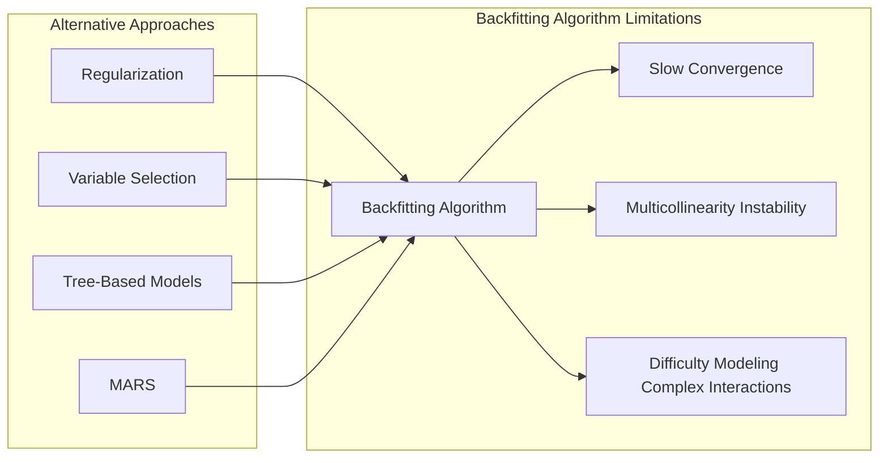
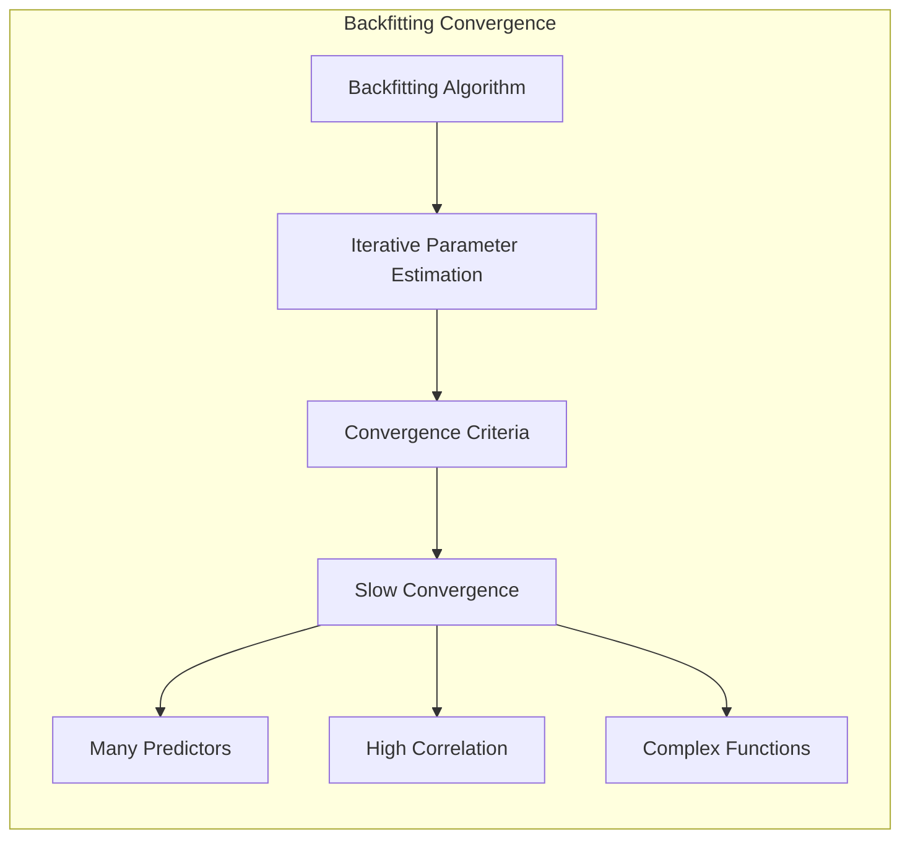
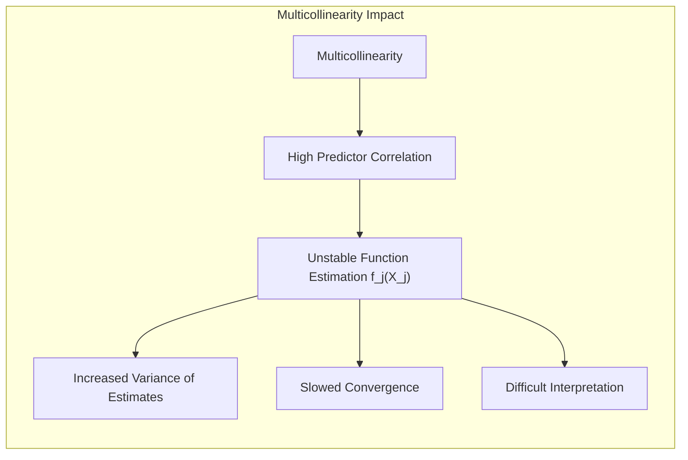
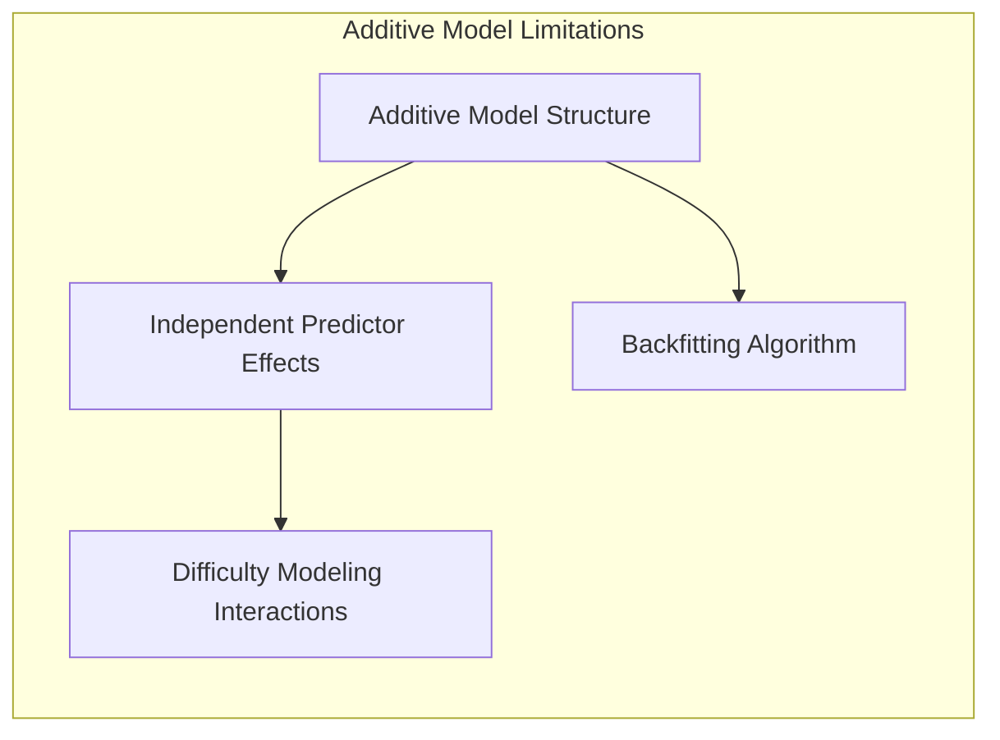
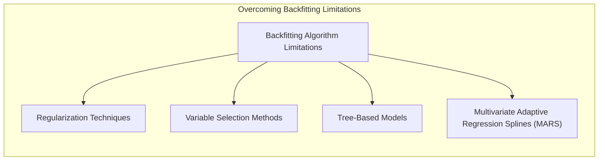
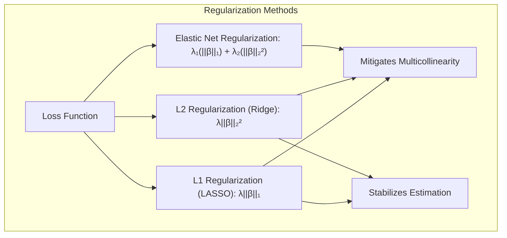
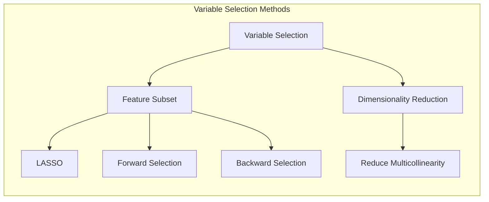

## Título: Modelos Aditivos Generalizados, Árvores e Métodos Relacionados: Limitações do Algoritmo de Backfitting e Abordagens Alternativas



### Introdução

Este capítulo explora as limitações do algoritmo de backfitting, um método iterativo utilizado para a estimação de parâmetros em Modelos Aditivos Generalizados (GAMs), e discute abordagens alternativas que podem ser utilizadas para mitigar essas limitações [^9.1]. O algoritmo de backfitting, embora eficiente em muitos casos, apresenta desafios em situações onde há forte correlação entre preditores, não linearidades complexas ou interações entre as variáveis.  O capítulo detalha as principais limitações do algoritmo de backfitting, e como estas limitações afetam a convergência, estabilidade e capacidade de modelagem dos resultados. Além disso, o capítulo apresenta diferentes alternativas, como métodos de regularização mais robustos, métodos de seleção de variáveis, modelos baseados em árvores, e Multivariate Adaptive Regression Splines (MARS).  O objetivo principal é oferecer uma visão crítica sobre as limitações do backfitting e a discussão de métodos alternativos para melhorar a modelagem de dados complexos.

### Conceitos Fundamentais

**Conceito 1: Convergência Lenta do Algoritmo de Backfitting**

Uma das limitações do algoritmo de backfitting é sua convergência lenta em algumas situações. O algoritmo, que estima os parâmetros das funções não paramétricas de forma iterativa, pode levar um número elevado de iterações para convergir, especialmente em modelos com muitos preditores ou quando há forte correlação entre os preditores. A velocidade de convergência também é afetada pela escolha do método de suavização e dos parâmetros de regularização.  Modelos com parâmetros que geram funções muito flexíveis, e baixa penalização para complexidade, podem demorar mais para convergir. A convergência lenta pode levar a um alto custo computacional, o que pode ser um problema na modelagem de grandes conjuntos de dados, ou para modelos com muita complexidade.

> 💡 **Exemplo Numérico:**
>
> Imagine um GAM com 10 preditores, onde cada função não paramétrica $f_j(X_j)$ é modelada usando *splines* cúbicos com muitos nós. Se utilizarmos o algoritmo de backfitting sem regularização, ou com um parâmetro de suavização muito pequeno (permitindo muita flexibilidade nas *splines*), o algoritmo pode levar centenas ou milhares de iterações para convergir. Em cada iteração, o algoritmo atualiza cada função $f_j$ mantendo as outras fixas, e este processo repete-se até que as funções não se alterem significativamente. Este processo pode ser muito lento quando há muitos preditores e interdependências entre eles. Por exemplo, se definirmos um critério de convergência onde a diferença absoluta entre as estimativas de $f_j$ em iterações sucessivas deve ser menor que 0.001, o algoritmo pode levar 1500 iterações para atingir este critério. Em contraste, um modelo com um parâmetro de regularização maior, ou um número menor de nós nas *splines*, pode convergir em apenas 200 iterações. Este exemplo demonstra como a complexidade do modelo e a falta de regularização pode afetar a convergência.
>
> ```python
> import numpy as np
> import matplotlib.pyplot as plt
>
> # Simulação de convergência lenta vs. rápida
> iterations_slow = np.arange(1, 1501)
> error_slow = np.exp(-iterations_slow/500) # Simula uma convergência lenta
>
> iterations_fast = np.arange(1, 201)
> error_fast = np.exp(-iterations_fast/50) # Simula uma convergência rápida
>
> plt.figure(figsize=(10, 5))
> plt.plot(iterations_slow, error_slow, label='Convergência Lenta')
> plt.plot(iterations_fast, error_fast, label='Convergência Rápida')
> plt.xlabel('Número de Iterações')
> plt.ylabel('Erro de Convergência')
> plt.title('Comparação da Convergência do Algoritmo de Backfitting')
> plt.legend()
> plt.grid(True)
> plt.show()
> ```
>
> Este gráfico ilustra como a convergência lenta (linha azul) pode levar muito mais iterações para atingir um erro de convergência baixo em comparação com a convergência rápida (linha laranja).



**Lemma 1:** *O algoritmo de backfitting, embora convergente sob certas condições, pode apresentar convergência lenta, especialmente em modelos complexos e com muitos preditores correlacionados. A taxa de convergência depende da escolha do suavizador e dos parâmetros de regularização. A convergência lenta é uma limitação importante a ser considerada na utilização do backfitting* [^4.3.1], [^4.3.2].

**Conceito 2: Multicolinearidade e Instabilidade do Algoritmo de Backfitting**

A multicolinearidade, ou alta correlação entre os preditores, é um problema que afeta a estabilidade do algoritmo de backfitting. Quando os preditores são altamente correlacionados, a estimativa das funções não paramétricas $f_j(X_j)$ pode se tornar instável, pois as mudanças em uma função pode ter um impacto significativo nas estimativas das outras funções.  A multicolinearidade também pode levar a uma convergência mais lenta do algoritmo e a um aumento na variância das estimativas dos parâmetros. A estabilidade das estimativas é fundamental para a confiabilidade do modelo, e a multicolinearidade pode levar a problemas de interpretação dos resultados. A presença de multicolinearidade pode influenciar a qualidade das estimativas e a estabilidade do modelo.

> 💡 **Exemplo Numérico:**
>
> Considere um modelo aditivo com dois preditores, $X_1$ e $X_2$, onde $X_2 = 0.95 X_1 + \epsilon$, onde $\epsilon$ é um ruído aleatório. Isto indica uma forte multicolinearidade. Ao aplicar o algoritmo de backfitting, pequenas variações nos dados podem levar a grandes alterações nas funções estimadas $f_1(X_1)$ e $f_2(X_2)$. Se a função $f_1(X_1)$ for ligeiramente alterada, a função $f_2(X_2)$ vai ter que se ajustar para compensar a variação, o que pode levar a estimativas instáveis. Em termos práticos, se tivermos duas amostras de dados semelhantes, mas com pequenas diferenças, os modelos resultantes podem ter funções $f_1$ e $f_2$ muito diferentes, mostrando a instabilidade do algoritmo. Para quantificar essa instabilidade, podemos calcular a variância das estimativas de $f_1$ e $f_2$ em múltiplas amostras de dados. Se a variância for alta, o modelo é instável.
>
>
> ```python
> import numpy as np
> import matplotlib.pyplot as plt
> from statsmodels.nonparametric.smoothers_lowess import lowess
>
> # Simulação de dados com multicolinearidade
> np.random.seed(42)
> n_samples = 100
> X1 = np.linspace(0, 10, n_samples)
> X2 = 0.95 * X1 + np.random.normal(0, 1, n_samples)
> y = 2*np.sin(X1) + 0.5*X2 + np.random.normal(0, 0.5, n_samples)
>
> # LOWESS smoother para estimar as funções f1 e f2
> def estimate_functions(X1, X2, y):
>    f1_est = lowess(y, X1, frac=0.3, return_sorted=False)[:, 1] - np.mean(y)
>    f2_est = lowess(y - f1_est, X2, frac=0.3, return_sorted=False)[:, 1]
>    return f1_est, f2_est
>
> # Simulação de múltiplas amostras e estimativa das funções
> n_simulations = 20
> f1_simulations = np.zeros((n_simulations, n_samples))
> f2_simulations = np.zeros((n_simulations, n_samples))
>
> for i in range(n_simulations):
>    X2_sim = 0.95 * X1 + np.random.normal(0, 1, n_samples) # Variação de X2
>    y_sim = 2*np.sin(X1) + 0.5*X2_sim + np.random.normal(0, 0.5, n_samples)
>    f1_sim, f2_sim = estimate_functions(X1, X2_sim, y_sim)
>    f1_simulations[i] = f1_sim
>    f2_simulations[i] = f2_sim
>
> # Cálculo da variância das estimativas
> f1_variance = np.var(f1_simulations, axis=0)
> f2_variance = np.var(f2_simulations, axis=0)
>
> # Plot das estimativas e variância
> plt.figure(figsize=(12, 6))
> plt.subplot(1, 2, 1)
> plt.plot(X1, f1_simulations.T, alpha=0.3, color="blue")
> plt.plot(X1, np.mean(f1_simulations, axis=0), color="black", linewidth=2)
> plt.plot(X1, np.mean(f1_simulations, axis=0) + np.sqrt(f1_variance), color="red", linestyle="--", label="Desvio Padrão")
> plt.plot(X1, np.mean(f1_simulations, axis=0) - np.sqrt(f1_variance), color="red", linestyle="--")
> plt.xlabel('X1')
> plt.ylabel('f1(X1)')
> plt.title('Estimativas e Variância de f1(X1)')
> plt.legend()
>
> plt.subplot(1, 2, 2)
> plt.plot(X2, f2_simulations.T, alpha=0.3, color="green")
> plt.plot(X2, np.mean(f2_simulations, axis=0), color="black", linewidth=2)
> plt.plot(X2, np.mean(f2_simulations, axis=0) + np.sqrt(f2_variance), color="red", linestyle="--", label="Desvio Padrão")
> plt.plot(X2, np.mean(f2_simulations, axis=0) - np.sqrt(f2_variance), color="red", linestyle="--")
> plt.xlabel('X2')
> plt.ylabel('f2(X2)')
> plt.title('Estimativas e Variância de f2(X2)')
> plt.legend()
>
> plt.tight_layout()
> plt.show()
> ```
>
> Este código simula um conjunto de dados com multicolinearidade e estima as funções $f_1$ e $f_2$ usando o *smoother* LOWESS. Ao repetir a simulação várias vezes e calcular a variância das estimativas, podemos observar a instabilidade causada pela multicolinearidade. Os gráficos mostram as estimativas das funções em cada simulação e a sua variabilidade. A área vermelha indica o desvio padrão das estimativas, mostrando a instabilidade causada pela multicolinearidade.



**Corolário 1:** *A multicolinearidade entre os preditores pode levar à instabilidade do algoritmo de backfitting, com maior variância das estimativas dos parâmetros, o que dificulta a interpretação dos resultados. A estabilidade do algoritmo é afetada pela correlação entre os preditores* [^4.3.3].

**Conceito 3: Dificuldade em Modelar Interações Complexas**

O algoritmo de backfitting, em sua forma original, estima os efeitos de cada preditor de forma aditiva, e tem dificuldade em modelar interações complexas entre preditores. O algoritmo, por sua natureza, adiciona as funções não paramétricas de forma individual e iterativa, o que não permite a modelagem de interações não lineares de forma eficiente. Embora seja possível incluir interações de baixa ordem através da inclusão de termos produto nos modelos, a modelagem de interações de alta ordem é difícil de ser realizada utilizando o algoritmo de backfitting tradicional, o que limita a capacidade do modelo de capturar relações complexas nos dados. A estrutura aditiva, por si só, não permite modelar interações entre os componentes de forma direta.

> 💡 **Exemplo Numérico:**
>
> Suponha que temos dois preditores, $X_1$ (temperatura) e $X_2$ (umidade), e a variável resposta $Y$ (crescimento de uma planta). Um modelo aditivo assumiria que o efeito da temperatura e da umidade são independentes e aditivos: $Y = f_1(X_1) + f_2(X_2)$. No entanto, o crescimento da planta pode depender de uma interação entre temperatura e umidade, por exemplo, o crescimento pode ser ótimo apenas quando ambos estão em níveis médios. Um modelo aditivo puro não consegue capturar essa interação, pois ele não modela o efeito conjunto de $X_1$ e $X_2$ em conjunto. Para modelar essa interação, seria necessário um termo como $f_3(X_1, X_2)$, que o backfitting padrão não consegue modelar de forma direta.
>
> Para ilustrar, vamos gerar um conjunto de dados onde existe uma interação entre $X_1$ e $X_2$.
> ```python
> import numpy as np
> import matplotlib.pyplot as plt
> from mpl_toolkits.mplot3d import Axes3D
> from statsmodels.nonparametric.smoothers_lowess import lowess
>
> # Simulação de dados com interação
> np.random.seed(42)
> n_samples = 100
> X1 = np.linspace(0, 10, n_samples)
> X2 = np.linspace(0, 10, n_samples)
> X1_grid, X2_grid = np.meshgrid(X1, X2)
> interaction_term = np.sin(X1_grid/2) * np.cos(X2_grid/2)
> y = 2*np.sin(X1_grid) + 0.5*X2_grid + interaction_term + np.random.normal(0, 0.5, X1_grid.shape)
>
>
> # Modelo aditivo com backfitting (LOWESS)
> def additive_model(X1, X2, y):
>    f1_est = lowess(y.flatten(), X1_grid.flatten(), frac=0.3, return_sorted=False)[:, 1] - np.mean(y)
>    f2_est = lowess(y.flatten() - f1_est, X2_grid.flatten(), frac=0.3, return_sorted=False)[:, 1]
>    y_pred_additive = f1_est + f2_est
>    return y_pred_additive
>
>
> y_pred_additive = additive_model(X1, X2, y)
>
> # Plot da interação real e da predição do modelo aditivo
> fig = plt.figure(figsize=(12, 6))
>
> ax1 = fig.add_subplot(1, 2, 1, projection='3d')
> surf1 = ax1.plot_surface(X1_grid, X2_grid, y, cmap='viridis', alpha=0.7)
> ax1.set_xlabel('X1')
> ax1.set_ylabel('X2')
>ax1.set_zlabel('Y (Real)')
>ax1.set_title('Superfície Real com Interação')
>
>
>ax2 = fig.add_subplot(1, 2, 2, projection='3d')
>surf2 = ax2.plot_surface(X1_grid, X2_grid, y_pred_additive.reshape(X1_grid.shape), cmap='viridis', alpha=0.7)
>ax2.set_xlabel('X1')
>ax2.set_ylabel('X2')
>ax2.set_zlabel('Y (Predito)')
>ax2.set_title('Superfície Predita pelo Modelo Aditivo')
>
> plt.tight_layout()
> plt.show()
> ```
>
> O gráfico à esquerda mostra a superfície real com a interação entre X1 e X2, e o gráfico à direita mostra a superfície predita pelo modelo aditivo, que não consegue capturar a interação. Este exemplo demonstra a limitação do modelo aditivo em modelar interações complexas.
>
> O modelo aditivo tenta ajustar a superfície predita apenas como a soma de efeitos individuais de $X_1$ e $X_2$, sem modelar a interação entre elas, o que resulta numa predição menos precisa.



> ⚠️ **Nota Importante:** A estrutura aditiva do modelo e a utilização do algoritmo de backfitting dificulta a modelagem de interações complexas, e esta é uma limitação importante do método. Para modelar interações complexas, outras abordagens podem ser necessárias [^9.1].

> ❗ **Ponto de Atenção:**  Modelos aditivos, como GAMs com backfitting, podem ser menos adequados em situações onde há interações complexas entre os preditores, e outras abordagens devem ser consideradas para modelar relações complexas nos dados [^4.5.1].

> ✔️ **Destaque:** A dificuldade de modelar interações complexas é uma limitação importante do algoritmo de backfitting e dos modelos aditivos.  Embora a estrutura aditiva simplifique a modelagem, ela também pode levar a um modelo menos preciso quando interações são importantes [^4.5.2].

### Abordagens Alternativas para Superar as Limitações do Backfitting: Regularização, Seleção de Variáveis e Outras Técnicas



Para superar as limitações do algoritmo de backfitting, várias abordagens alternativas podem ser utilizadas:

*   **Regularização mais Robusta:** A utilização de métodos de regularização mais robustos, como a penalização L1 (LASSO) ou a penalização L2 (Ridge), pode mitigar os problemas de multicolinearidade e estabilizar o processo de estimação. A penalização L1 promove a esparsidade do modelo, o que pode facilitar a seleção de variáveis e reduzir a complexidade, enquanto que a penalização L2 reduz a magnitude dos coeficientes, o que diminui o efeito da multicolinearidade. A combinação dessas penalidades (Elastic Net) também pode ser uma alternativa interessante para lidar com esse problema. A regularização atua diretamente na função de custo, e também no processo de suavização.

> 💡 **Exemplo Numérico:**
>
> Considere um modelo aditivo com 5 preditores, $X_1, X_2, X_3, X_4, X_5$, onde $X_3$, $X_4$, e $X_5$ são altamente correlacionados. Sem regularização, o algoritmo de backfitting pode levar a estimativas instáveis das funções $f_3(X_3)$, $f_4(X_4)$ e $f_5(X_5)$. Ao aplicar a regularização L2 (Ridge), adicionamos um termo de penalidade à função de custo que é proporcional ao quadrado da magnitude dos coeficientes das funções $f_j$. Isso obriga os coeficientes a serem menores, o que estabiliza o processo de estimação e reduz o efeito da multicolinearidade. Se usarmos a regularização L1 (LASSO), o modelo pode até mesmo estimar alguns coeficientes como zero, o que leva à seleção de variáveis e reduz a complexidade do modelo.
>
> Para demonstrar, vamos simular um modelo com multicolinearidade e aplicar regularização L1 e L2:
>
> ```python
> import numpy as np
> import matplotlib.pyplot as plt
> from sklearn.linear_model import Ridge, Lasso
> from sklearn.preprocessing import PolynomialFeatures
> from sklearn.pipeline import make_pipeline
> from sklearn.metrics import mean_squared_error
>
> # Simulação de dados com multicolinearidade
> np.random.seed(42)
> n_samples = 100
> X = np.random.rand(n_samples, 5)
> X[:, 2] = 0.8 * X[:, 0] + 0.2 * np.random.rand(n_samples)  # X3 correlacionado com X1
> X[:, 3] = 0.7 * X[:, 1] + 0.3 * np.random.rand(n_samples) # X4 correlacionado com X2
> X[:, 4] = 0.9 * X[:, 0] + 0.1 * np.random.rand(n_samples) # X5 correlacionado com X1
>
> # Função resposta com interação (para mostrar que a regularização ajuda na estabilidade)
> y = 2*X[:, 0] + 1.5*X[:, 1] - 0.5*X[:, 0]*X[:, 1] + np.random.normal(0, 0.5, n_samples)
>
> # Modelo polinomial com regularização
> def fit_and_evaluate(X, y, alpha, model_type='ridge'):
>    if model_type == 'ridge':
>        model = make_pipeline(PolynomialFeatures(degree=2), Ridge(alpha=alpha))
>    elif model_type == 'lasso':
>        model = make_pipeline(PolynomialFeatures(degree=2), Lasso(alpha=alpha))
>    model.fit(X, y)
>    y_pred = model.predict(X)
>    mse = mean_squared_error(y, y_pred)
>    return model, mse
>
> # Ajuste dos modelos com diferentes valores de alpha
> alpha_values = [0.001, 0.1, 1, 10]
> models_ridge = {}
> models_lasso = {}
> mse_ridge = []
> mse_lasso = []
>
> for alpha in alpha_values:
>    model_ridge, mse_r = fit_and_evaluate(X, y, alpha, 'ridge')
>    model_lasso, mse_l = fit_and_evaluate(X, y, alpha, 'lasso')
>    models_ridge[alpha] = model_ridge
>    models_lasso[alpha] = model_lasso
>    mse_ridge.append(mse_r)
>    mse_lasso.append(mse_l)
>
>
> # Comparação dos MSEs
> plt.figure(figsize=(10, 5))
> plt.plot(alpha_values, mse_ridge, marker='o', label='Ridge')
> plt.plot(alpha_values, mse_lasso, marker='x', label='Lasso')
> plt.xlabel('Alpha (Parâmetro de Regularização)')
> plt.ylabel('Erro Quadrático Médio (MSE)')
> plt.title('Comparação do MSE para Ridge e Lasso com Diferentes Alphas')
> plt.xscale('log')
> plt.legend()
> plt.grid(True)
> plt.show()
>
> # Exemplo da magnitude dos coeficientes com diferentes valores de alpha
> for alpha in [0.001, 10]:
>    ridge_coefs = models_ridge[alpha].named_steps['ridge'].coef_
>    lasso_coefs = models_lasso[alpha].named_steps['lasso'].coef_
>    print(f"\nCoeficientes Ridge (alpha={alpha}): {ridge_coefs}")
>    print(f"Coeficientes Lasso (alpha={alpha}): {lasso_coefs}")
> ```
>
> Este código simula um conjunto de dados com multicolinearidade e aplica modelos de regressão polinomial com regularização L1 (Lasso) e L2 (Ridge). Os gráficos mostram o erro quadrático médio (MSE) para diferentes valores de $\alpha$, e como o MSE muda com o aumento da regularização. Podemos observar que valores maiores de $\alpha$ levam a um MSE maior. Os coeficientes do modelo também são apresentados, mostrando que a regularização L1 (Lasso) leva a coeficientes mais esparsos que a regularização L2 (Ridge).



*   **Seleção de Variáveis:** Métodos de seleção de variáveis podem ser utilizados para escolher um subconjunto de preditores mais relevantes e reduzir a multicolinearidade. A escolha de um subconjunto de preditores mais relevantes diminui a dimensionalidade dos dados, e também a complexidade dos modelos, e diminui os problemas de instabilidade causados por multicolinearidade.  A seleção de variáveis pode ser feita através de métodos como o LASSO, *forward selection* ou *backward selection*.

> 💡 **Exemplo Numérico:**
>
> Usando o mesmo conjunto de dados simulado no exemplo anterior, podemos aplicar o método LASSO para selecionar as variáveis mais relevantes. O LASSO irá forçar os coeficientes das variáveis menos importantes a serem zero, efetivamente removendo-as do modelo. Por exemplo, se $X_3$, $X_4$ e $X_5$ forem redundantes devido à multicolinearidade, o LASSO pode selecionar apenas $X_1$ e $X_2$ como preditores relevantes.
>
> ```python
> import numpy as np
> from sklearn.linear_model import Lasso
> from sklearn.preprocessing import PolynomialFeatures
> from sklearn.pipeline import make_pipeline
>
> # Simulação de dados com multicolinearidade (reutilizando do exemplo anterior)
> np.random.seed(42)
> n_samples = 100
> X = np.random.rand(n_samples, 5)
> X[:, 2] = 0.8 * X[:, 0] + 0.2 * np.random.rand(n_samples)  # X3 correlacionado com X1
> X[:, 3] = 0.7 * X[:, 1] + 0.3 * np.random.rand(n_samples) # X4 correlacionado com X2
> X[:, 4] = 0.9 * X[:, 0] + 0.1 * np.random.rand(n_samples) # X5 correlacionado com X1
> y = 2*X[:, 0] + 1.5*X[:, 1] - 0.5*X[:, 0]*X[:, 1] + np.random.normal(0, 0.5, n_samples)
>
> # Aplicação do LASSO para seleção de variáveis
> alpha_lasso = 0.1 # Parâmetro de regularização
> model_lasso = make_pipeline(PolynomialFeatures(degree=2), Lasso(alpha=alpha_lasso))
> model_lasso.fit(X, y)
>
> # Coeficientes do modelo LASSO
> lasso_coefs = model_lasso.named_steps['lasso'].coef_
>
> # Identificação das variáveis selecionadas (coeficientes não nulos)
> selected_features = np.where(np.abs(lasso_coefs) > 1e-5)[0]
> print(f"Coeficientes do modelo LASSO: {lasso_coefs}")
> print(f"Variáveis selecionadas pelo LASSO (índices): {selected_features}")
>
> # Criação de tabela de coeficientes
> import pandas as pd
> coef_table = pd.DataFrame({'Coeficientes': lasso_coefs})
> print("\nTabela de coeficientes:")
> print(coef_table)
> ```
>
> Este código aplica o método LASSO, e identifica quais variáveis foram selecionadas (coeficientes não nulos). A tabela de coeficientes mostra os valores dos coeficientes, e como o LASSO leva alguns coeficientes a zero.



*   **Modelos Baseados em Árvores de Decisão:**  Modelos baseados em árvores de decisão podem capturar não linearidades complexas e interações entre preditores de forma natural. Embora árvores de decisão tenham limitações na modelagem de funções suaves, elas podem ser mais adequadas para modelar interações complexas entre os preditores. O *pruning* da árvore também pode ajudar a evitar o overfitting e melhorar a estabilidade da árvore, embora a sua convergência não seja garantida.

> 💡 **Exemplo Numérico:**
>
> Considere um modelo onde a resposta $Y$ depende de uma interação não linear entre $X_1$ e $X_2$. Um modelo aditivo teria dificuldade em capturar essa interação, mas uma árvore de decisão pode dividir o espaço de características de forma a capturar essa relação. Por exemplo, a árvore pode primeiro dividir os dados com base em $X_1$ (se $X_1$ > 5), e depois dividir os dados novamente com base em $X_2$ (se $X_2$ < 3), criando regiões no espaço de características onde a resposta $Y$ tem comportamentos diferentes.
>
> ```python
> import numpy as np
> import matplotlib.pyplot as plt
> from sklearn.tree import DecisionTreeRegressor, plot_tree
>
> # Simulação de dados com interação não linear
> np.random.seed(42)
> n_samples = 100
> X = np.random.rand(n_samples, 2) * 10 # X1 e X2 entre 0 e 10
> y = np.sin(X[:, 0] / 2) * np.cos(X[:, 1] / 2) + X[:, 0] + X[:, 1] + np.random.normal(0, 0.2, n_samples)
>
> # Ajuste de uma árvore de decisão
> tree_model = DecisionTreeRegressor(max_depth=3) # Profundidade máxima da árvore
> tree_model.fit(X, y)
>
> # Visualização da árvore de decisão
> plt.figure(figsize=(12, 8))
> plot_tree(tree_model, feature_names=['X1', 'X2'], filled=True)
> plt.title('Árvore de Decisão para Modelar Interação Não Linear')
> plt.show()
>
> # Geração de uma grid para plotar a superfície predita
> X1_grid = np.linspace(0, 10, 50)
> X2_grid = np.linspace(0, 10, 50)
> X1_mesh, X2_mesh = np.meshgrid(X1_grid, X2_grid)
> X_grid = np.c_[X1_mesh.flatten(), X2_mesh.flatten()]
>
> # Predição da árvore de decisão na grid
> y_pred_tree = tree_model.predict(X_grid)
>
> # Plot da superfície predita pela árvore de decisão
> fig = plt.figure(figsize=(10, 6))
> ax = fig.add_subplot(111, projection='3d')
> surf = ax.plot_surface(X1_mesh, X2_mesh, y_pred_tree.reshape(X1_mesh.shape), cmap='viridis', alpha=0.7)
> ax.set_xlabel('X1')
> ax.set_ylabel('X2')
> ax.set_zlabel('Y (Predito)')
> ax.set_title('Superfície Predita pela Árvore de Decisão')
> plt.show()
> ```
>
> Este código simula um conjunto de dados com interação não linear e ajusta uma árvore de decisão. A visualização da árvore mostra como o espaço de características é dividido, e o gráfico 3D mostra a superfície predita pela árvore, que consegue capturar a interação não linear.

```mermaid
graph LR
    subgraph "Tree-Based Models"
        direction TB
        A["Decision Tree Models"]
        B["Capture Non-linearities"]
        C["Model Interactions"]
        D["Data