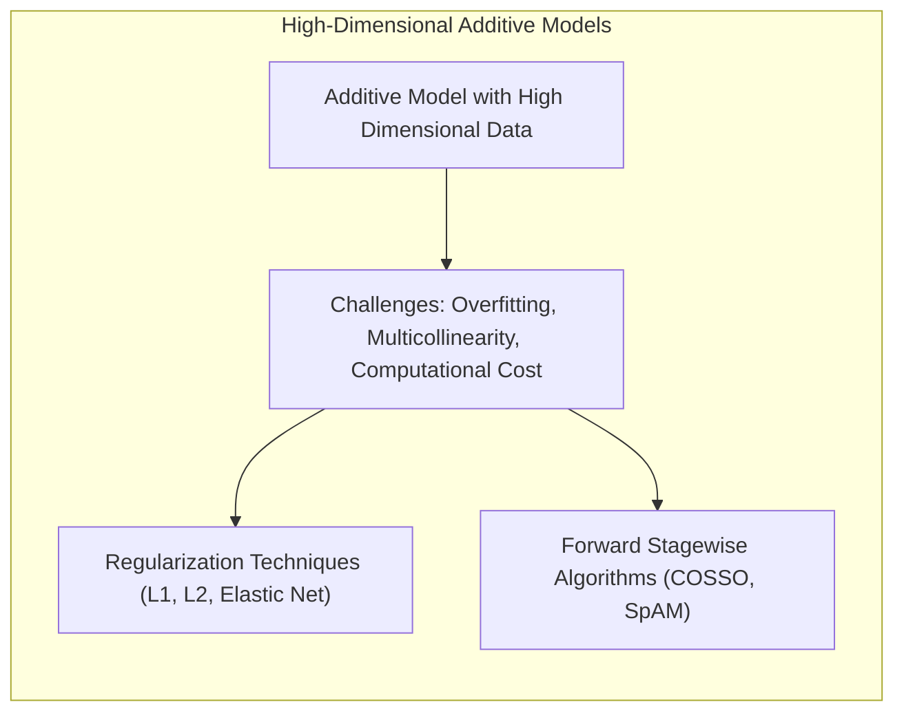
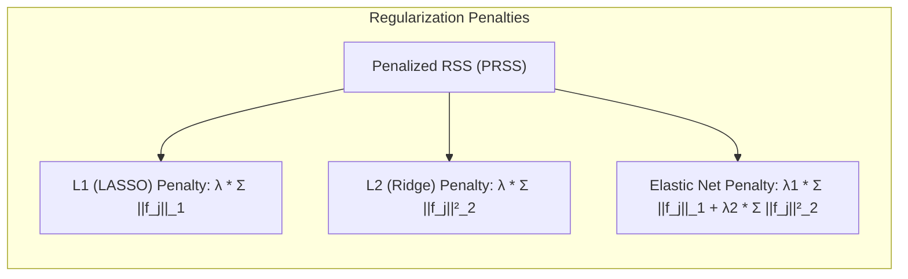
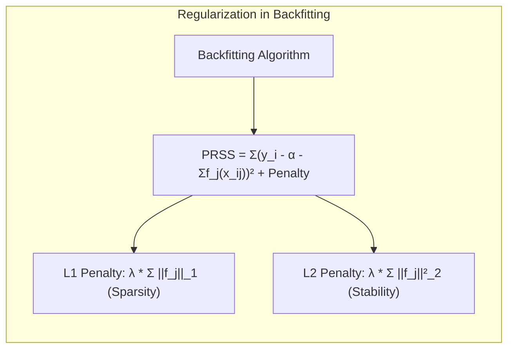
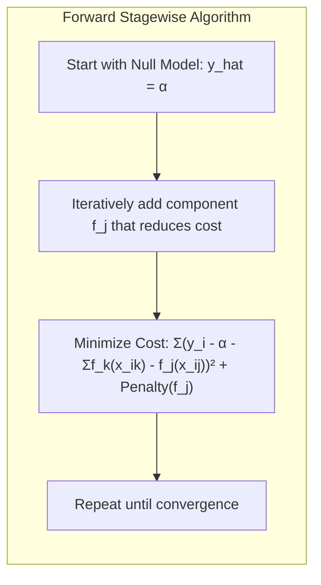
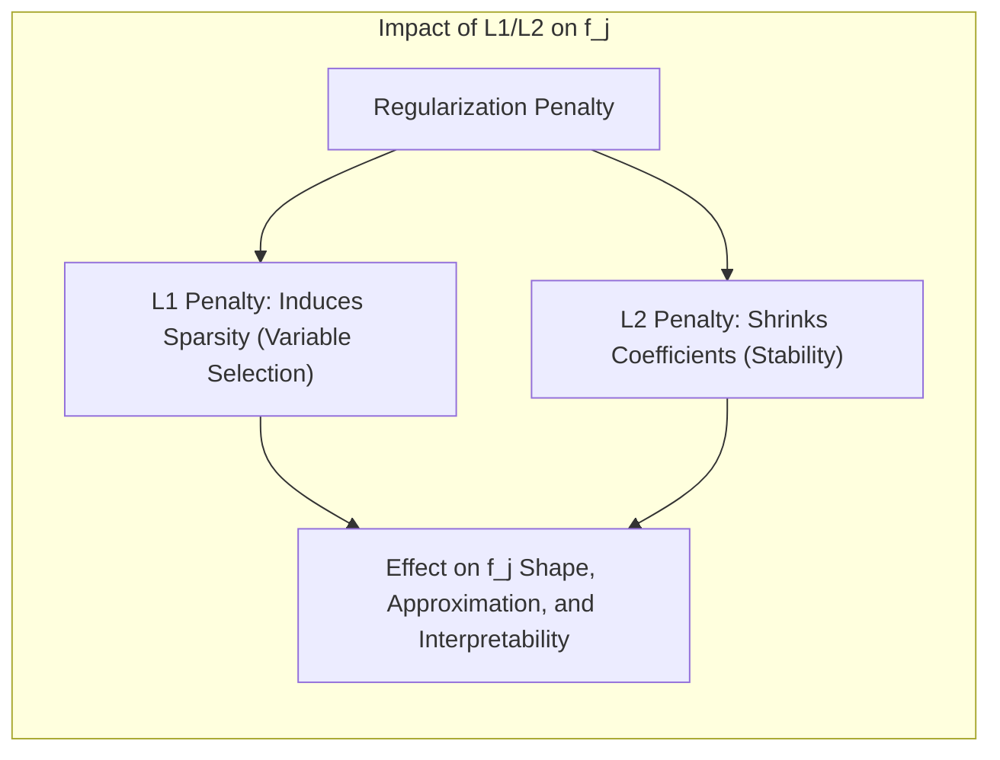

## Título: Modelos Aditivos Generalizados, Árvores e Métodos Relacionados: Regularização, Seleção de Variáveis e Métodos *Forward Stagewise* para Dados de Alta Dimensão

### Introdução

Este capítulo explora como técnicas de regularização, seleção de variáveis e algoritmos *forward stagewise* podem ser utilizados para lidar com a complexidade e a dimensionalidade elevada dos dados em modelos aditivos, especialmente em Modelos Aditivos Generalizados (GAMs) [^9.1]. Em conjuntos de dados de alta dimensão, a modelagem aditiva tradicional pode ser limitada pela presença de muitos preditores, pela multicolinearidade e pelo risco de *overfitting*. O capítulo detalha como as penalizações L1 (LASSO), L2 (Ridge) e Elastic Net, bem como os algoritmos *forward stagewise* como COSSO (Component Selection and Smoothing Operator) e SpAM (Sparse Additive Model), abordam esses desafios e como eles se relacionam com o algoritmo de backfitting e a estrutura de modelos aditivos. O objetivo principal é apresentar uma visão aprofundada de como essas abordagens permitem construir modelos aditivos mais robustos e eficientes em situações de alta dimensionalidade.

### Conceitos Fundamentais

**Conceito 1: O Problema da Alta Dimensionalidade em Modelos Aditivos**

Em modelos aditivos, a presença de um grande número de preditores pode levar a vários problemas:
*   **Overfitting:** Modelos com muitos parâmetros podem se ajustar ao ruído nos dados de treino e ter um desempenho ruim em dados não vistos, perdendo a capacidade de generalização.
*   **Multicolinearidade:** A alta correlação entre preditores pode levar a problemas de instabilidade na estimação dos parâmetros, com dificuldade de interpretação.
*   **Custo Computacional:** O custo computacional do algoritmo de backfitting aumenta com o número de preditores.
*  **Interpretabilidade:** Modelos com muitos parâmetros podem ser difíceis de interpretar e de usar de forma eficiente na prática.

A alta dimensionalidade, portanto, representa um desafio para a aplicação de modelos aditivos, e a utilização de métodos de regularização e seleção de variáveis é crucial para lidar com esses problemas.

**Lemma 1:** *A alta dimensionalidade nos dados, com um grande número de preditores, pode levar ao overfitting, multicolinearidade e instabilidade na estimação dos modelos aditivos. Técnicas de regularização e seleção de variáveis são importantes para lidar com problemas de alta dimensão*.  Em problemas de alta dimensão, a escolha de modelos e métodos de estimação apropriados é fundamental [^4.5], [^4.5.1], [^4.5.2].

**Conceito 2: Regularização L1 (LASSO), L2 (Ridge) e Elastic Net em Modelos Aditivos**

A regularização é uma abordagem para controlar a complexidade dos modelos, e pode ser utilizada para evitar o overfitting. A regularização é implementada através da adição de um termo de penalidade à função de custo, que no caso dos modelos aditivos é dada por:

$$
\text{PRSS} = \sum_{i=1}^N (y_i - \alpha - \sum_{j=1}^p f_j(x_{ij}))^2 + \text{Penalidade}
$$
*   **Penalização L1 (LASSO):** O termo de penalidade é dado por:
$$
\text{Penalidade} = \lambda \sum_{j=1}^p ||f_j||_1
$$

onde $\lambda$ é o parâmetro de regularização, e $||f_j||_1$ é a norma L1 das funções $f_j$, que pode ser definida como a soma do valor absoluto de seus coeficientes. A penalização L1 induz a esparsidade, o que leva à seleção de variáveis, e muitos dos coeficientes podem se tornar iguais a zero.

*   **Penalização L2 (Ridge):** O termo de penalidade é dado por:
$$
\text{Penalidade} = \lambda \sum_{j=1}^p ||f_j||^2_2
$$
onde  $||f_j||^2_2$ é a norma L2 das funções, o que implica na soma do quadrado de seus coeficientes. A penalização L2 reduz a magnitude dos coeficientes e melhora a estabilidade do modelo, e não induz a esparsidade como a L1.

*  **Penalização Elastic Net:** O termo de penalidade é dado por:
    $$
     \text{Penalidade} = \lambda_1 \sum_{j=1}^p ||f_j||_1 + \lambda_2 \sum_{j=1}^p ||f_j||^2_2
    $$
onde  $\lambda_1$ e $\lambda_2$ são os parâmetros de regularização para L1 e L2. O Elastic Net combina as propriedades das penalizações L1 e L2, o que permite a seleção de variáveis e estabilidade do modelo.

> 💡 **Exemplo Numérico:**
>
> Considere um modelo aditivo com três preditores, onde as funções $f_j$ são lineares:
>
> $y = \alpha + f_1(x_1) + f_2(x_2) + f_3(x_3) + \epsilon$
>
>  Suponha que, após o ajuste por mínimos quadrados, os coeficientes estimados sejam:
>
>  $f_1(x_1) = 2x_1$, $f_2(x_2) = -3x_2$, $f_3(x_3) = 5x_3$
>
>  Agora, vamos aplicar as penalidades:
>
>  *   **L1 (LASSO) com $\lambda = 0.5$:**
>     $$
>     \text{Penalidade} = 0.5 * (|2| + |-3| + |5|) = 0.5 * 10 = 5
>     $$
>    A penalização L1 adiciona 5 à função de custo. Otimizar o modelo com essa penalidade pode levar a coeficientes menores, e até mesmo zerados, dependendo de $\lambda$.
>
> *   **L2 (Ridge) com $\lambda = 0.5$:**
>     $$
>     \text{Penalidade} = 0.5 * (2^2 + (-3)^2 + 5^2) = 0.5 * (4 + 9 + 25) = 0.5 * 38 = 19
>     $$
>    A penalização L2 adiciona 19 à função de custo. Otimizar o modelo com essa penalidade leva a coeficientes menores, mas sem zerá-los.
>
> *   **Elastic Net com $\lambda_1 = 0.3$ e $\lambda_2 = 0.2$:**
>     $$
>     \text{Penalidade} = 0.3 * (|2| + |-3| + |5|) + 0.2 * (2^2 + (-3)^2 + 5^2) = 0.3*10 + 0.2*38 = 3 + 7.6 = 10.6
>     $$
>  A penalização Elastic Net adiciona 10.6 à função de custo. Essa penalidade combina as propriedades das penalidades L1 e L2, resultando em esparsidade e estabilidade.

**Corolário 1:** *A regularização L1, L2 e Elastic Net são ferramentas para controlar a complexidade dos modelos aditivos e para lidar com a multicolinearidade e o overfitting. A escolha do tipo de penalização deve considerar o objetivo da modelagem e a natureza dos dados.  A combinação das três penalizações pode ser utilizada para obter os melhores resultados*. As penalidades L1 e L2 induzem a esparsidade e a estabilidade, e o Elastic Net é um balanço entre as duas abordagens [^4.5].

**Conceito 3: Algoritmos *Forward Stagewise* em Modelos Aditivos**

Algoritmos *forward stagewise* são métodos iterativos para construção de modelos que adicionam um componente ou um conjunto de componentes ao modelo a cada iteração, com base na redução da função de custo. Em modelos aditivos, o algoritmo *forward stagewise* pode ser utilizado para selecionar os preditores mais relevantes a cada passo, e para controlar a complexidade do modelo.  O algoritmo começa com um modelo simples e vai adicionando as funções $f_j$ que mais reduzem a função de custo até que um critério de parada seja atingido.  Algoritmos *forward stagewise* podem ser mais eficientes computacionalmente que o algoritmo de backfitting quando o número de preditores é muito elevado.

> ⚠️ **Nota Importante:** A utilização de algoritmos *forward stagewise* em modelos aditivos permite um controle mais direto da complexidade e a seleção das variáveis mais relevantes, com foco em uma otimização iterativa que adiciona variáveis ou componentes em cada iteração [^4.5.1].

> ❗ **Ponto de Atenção:** Métodos *forward stagewise* também podem apresentar limitações, como a dificuldade em modelar interações de alta ordem e em identificar o conjunto ótimo de preditores. Métodos *forward stagewise* são aproximações gulosas que podem levar a soluções subótimas [^4.5.2].

> ✔️ **Destaque:** Métodos *forward stagewise* oferecem uma alternativa para controlar a complexidade dos modelos aditivos e a seleção de variáveis, o que pode resultar em modelos mais parcimoniosos e com melhor capacidade de generalização, e podem ser utilizados como alternativas ao algoritmo de backfitting. A escolha do algoritmo adequado depende do contexto e objetivo do problema [^4.5].

### Métodos de Regularização L1 e L2 em Modelos Aditivos: Formulações, Aplicações e Conexão com Backfitting

A aplicação da regularização L1 e L2 em modelos aditivos envolve a adição de um termo de penalidade à função de custo, que é geralmente uma soma de quadrados penalizada (PRSS):
$$
\text{PRSS} = \sum_{i=1}^N (y_i - \alpha - \sum_{j=1}^p f_j(x_{ij}))^2 + \text{Penalidade}(\beta)
$$

*   **Penalização L1 (LASSO):** A penalização L1 é dada por:
$$
\text{Penalidade}(\beta) = \lambda \sum_{j=1}^p ||f_j||_1
$$

onde $||f_j||_1$ é a norma L1 da função $f_j$, que pode ser aproximada como a soma dos valores absolutos dos coeficientes da função $f_j$ em uma base apropriada.  Essa penalização induz a esparsidade no modelo, o que significa que algumas das funções $f_j$ serão nulas, o que equivale a selecionar um subconjunto dos preditores mais relevantes, e os coeficientes da função são levados a zero. O parâmetro $\lambda$ controla a intensidade da regularização.

*   **Penalização L2 (Ridge):** A penalização L2 é dada por:

$$
\text{Penalidade}(\beta) = \lambda \sum_{j=1}^p ||f_j||^2_2
$$

onde $||f_j||^2_2$ é a norma L2 da função $f_j$, que pode ser aproximada como a soma dos quadrados dos coeficientes. Essa penalização reduz a magnitude dos coeficientes e estabiliza o modelo.

O algoritmo de backfitting pode ser adaptado para incluir regularização através da modificação do método de suavização. Em vez de simplesmente ajustar uma função não paramétrica aos resíduos parciais, o algoritmo de backfitting minimiza a função de custo penalizada:
$$
f_j \leftarrow \arg \min_{f_j} (\sum_{i=1}^N (r_i^{(j)} - f_j(x_{ij}))^2 + \text{Penalidade}(f_j))
$$
onde a penalidade é definida de acordo com a regularização L1 ou L2, e $\lambda$ controla o balanço entre ajuste e complexidade. A escolha dos parâmetros de regularização deve ser feita utilizando validação cruzada ou outros métodos de escolha de modelos. A utilização de penalidades na função de custo é uma forma de controlar a complexidade e garantir a capacidade de generalização dos modelos aditivos. O algoritmo de backfitting, quando utilizado com regularização, é uma ferramenta para modelos aditivos.

> 💡 **Exemplo Numérico:**
>
> Considere um modelo aditivo com dois preditores ($x_1$ e $x_2$) e 5 observações. Suponha que, após uma iteração do algoritmo de backfitting sem regularização, os resíduos parciais para $f_1$ sejam $r^{(1)} = [1, -1, 2, -2, 1]$, e os valores de $x_1$ sejam $x_1 = [0.1, 0.2, 0.3, 0.4, 0.5]$.
>
> Agora, vamos aplicar a regularização L2 para estimar $f_1$, supondo que $f_1$ seja uma função linear, ou seja, $f_1(x_1) = \beta_1 x_1$. A função de custo penalizada é:
>
> $$
> \text{Custo} = \sum_{i=1}^5 (r_i^{(1)} - \beta_1 x_{1i})^2 + \lambda \beta_1^2
> $$
>
> *   **Sem regularização ($\lambda = 0$):** O valor de $\beta_1$ que minimiza a soma de quadrados pode ser calculado usando a fórmula da regressão linear simples.
>
> *   **Com regularização L2 ($\lambda = 0.5$):**
>
>  $	ext{Step 1: } \text{Calculando} \sum x_{1i}^2 = 0.55$
>
>  $	ext{Step 2: } \text{Calculando} \sum x_{1i} r_i^{(1)} = -0.1$
>
>  $	ext{Step 3: } \text{Calculando} \beta_1 = \frac{\sum x_{1i} r_i^{(1)}}{\sum x_{1i}^2 + \lambda} = \frac{-0.1}{0.55 + 0.5} = -0.095$
>
> Ao introduzir a penalidade, o valor de $\beta_1$ é reduzido em comparação com o caso sem regularização. Este efeito é maior quando $\lambda$ aumenta.
>
> Vamos calcular o valor de $\beta_1$ sem regularização:
>
> $	ext{Step 1: } \beta_1 = \frac{\sum x_{1i} r_i^{(1)}}{\sum x_{1i}^2} = \frac{-0.1}{0.55} = -0.182$
>
> A regularização L2 reduz o valor de $\beta_1$ de -0.182 para -0.095. O parâmetro $\lambda$ controla o quanto os coeficientes são reduzidos.

**Lemma 2:** *A regularização L1 e L2 pode ser combinada com o algoritmo de backfitting, e o termo de penalidade adicionado à função de custo permite controlar a complexidade do modelo e reduzir o problema de overfitting. A penalização L1 induz esparsidade, enquanto que a penalização L2 reduz a magnitude dos parâmetros e estabiliza o processo de otimização. A escolha da regularização influencia a estabilidade e a capacidade de generalização do modelo*.  A utilização de regularização é uma técnica importante para a modelagem de dados complexos [^4.5.2].

### Algoritmos Forward Stagewise e sua Relação com Modelos Aditivos

Os algoritmos *forward stagewise* são uma alternativa ao algoritmo de backfitting, e constroem o modelo adicionando componentes de forma sequencial, com base no impacto na redução da função de custo. Em modelos aditivos, o algoritmo *forward stagewise* inicia com um modelo simples, e a cada iteração, adiciona a função $f_j$ que mais reduz a soma dos erros quadráticos ou a deviance, com ou sem a aplicação de uma penalização:
$$
f_j \leftarrow \arg \min_{f_j}  \sum_{i=1}^N (y_i - \alpha - \sum_{k} f_k(x_{ik}) - f_j(x_{ij}))^2 + \text{Penalidade}(f_j)
$$
A iteração é repetida até que um critério de parada seja atingido.  Em comparação com o backfitting, os métodos *forward stagewise* podem ser mais eficientes computacionalmente, principalmente quando o número de preditores é muito elevado, e a escolha do componente a ser adicionado na próxima iteração é feita de forma gulosa, o que pode resultar em modelos subótimos. O algoritmo de backfitting ajusta as funções e a otimização é realizada usando a informação de todos os preditores, enquanto o algoritmo forward adiciona uma variável e ajusta as funções, e repete o processo até que não haja ganhos.

> 💡 **Exemplo Numérico:**
>
> Considere um modelo aditivo com três preditores, $x_1$, $x_2$ e $x_3$. O algoritmo *forward stagewise* inicia com um modelo nulo, onde $\hat{y} = \alpha$.
>
> **Iteração 1:**
>
> *   Ajusta modelos com cada um dos preditores separadamente: $\hat{y} = \alpha + f_1(x_1)$, $\hat{y} = \alpha + f_2(x_2)$ e $\hat{y} = \alpha + f_3(x_3)$.
> *   Calcula a soma dos erros quadrados (SSE) para cada modelo.
> *   Suponha que o modelo com $x_2$ tenha o menor SSE. O modelo é atualizado para $\hat{y} = \alpha + f_2(x_2)$.
>
> **Iteração 2:**
>
> *   Ajusta modelos adicionando $x_1$ e $x_3$ ao modelo atual: $\hat{y} = \alpha + f_2(x_2) + f_1(x_1)$ e $\hat{y} = \alpha + f_2(x_2) + f_3(x_3)$.
> *   Calcula a SSE para cada modelo.
> *   Suponha que o modelo com $x_1$ resulte na menor SSE. O modelo é atualizado para $\hat{y} = \alpha + f_2(x_2) + f_1(x_1)$.
>
> O processo continua até que um critério de parada seja atingido, por exemplo, quando a redução no SSE se torna pequena. Este é um exemplo de como os algoritmos *forward stagewise* funcionam, adicionando preditores de forma sequencial.

### Exemplos: COSSO e SpAM

*   **COSSO (Component Selection and Smoothing Operator):** COSSO é um exemplo de algoritmo que combina seleção de variáveis com suavização em modelos aditivos. O algoritmo utiliza uma penalidade L1 na função de custo, o que leva à seleção de um subconjunto de preditores. Em cada iteração do algoritmo, os preditores são adicionados de forma sequencial, e a função é estimada com um suavizador adequado. COSSO busca modelar dados de alta dimensão, utilizando a esparsidade e modelos aditivos.
*  **SpAM (Sparse Additive Model):** SpAM também combina seleção de variáveis com modelos aditivos. SpAM utiliza um algoritmo *forward stagewise* para escolher os preditores e suas funções não paramétricas, e os parâmetros são estimados utilizando métodos de suavização apropriados.  SpAM busca obter modelos aditivos esparsos que sejam adequados para dados de alta dimensão.

Ambos, COSSO e SpAM utilizam penalidades, modelos aditivos e seleção de variáveis de forma a lidar com problemas de alta dimensão e evitar overfitting.

### Perguntas Teóricas Avançadas: Como a penalização L1 e L2 afeta a forma funcional das funções $f_j$ em modelos aditivos, e como essa influência se relaciona com a capacidade de aproximação e a interpretabilidade dos modelos?

**Resposta:**

A penalização L1 (LASSO) e L2 (Ridge) afetam a forma funcional das funções $f_j$ em modelos aditivos de maneira diferente, e essas diferenças têm implicações na capacidade de aproximação e interpretabilidade dos modelos.

A penalização L1, ao utilizar a norma L1 das funções $f_j$, induz a esparsidade na base das funções, ou seja, algumas funções são estimadas como iguais a zero, o que implica na remoção do preditor do modelo. A penalização L1 força os coeficientes das funções a serem exatamente zero, e por isso, a escolha da base utilizada para representar as funções é fundamental. No caso das funções *spline*, um parâmetro de regularização é utilizado para controlar a suavidade. No entanto, em geral, a penalização L1 promove a seleção de variáveis, e modelos mais interpretáveis, pois apenas os preditores mais importantes fazem parte do modelo final.

A penalização L2, ao utilizar a norma L2 das funções, reduz a magnitude dos coeficientes, tornando-os menores, mas sem levá-los a exatamente zero. Ao reduzir a magnitude dos coeficientes, a penalização L2 torna o modelo mais estável e mitiga os efeitos da multicolinearidade, e pode afetar a capacidade do modelo de modelar relações complexas. Em modelos aditivos, a penalização L2 também age no espaço das funções, o que diminui a sua variância.

Em modelos aditivos, a regularização pode ser feita sobre a própria função, ou sobre os coeficientes de uma base utilizada para representar a função. A penalização L1 pode levar a soluções mais esparsas, ou seja, um menor número de funções diferentes de zero, enquanto a penalização L2 pode levar a estimativas mais estáveis dos parâmetros.  O efeito dessas penalidades na forma funcional das funções $f_j$ também depende da escolha do suavizador, e a sua interação deve ser considerada no momento da modelagem.

A capacidade de aproximação dos modelos também é afetada pela escolha da penalização. A penalização L1 pode levar a modelos mais simples, onde apenas as variáveis mais importantes são selecionadas, enquanto que a penalização L2 pode gerar modelos mais estáveis, mas onde todos os preditores fazem parte do modelo final. A interpretabilidade também é afetada, pois modelos com penalização L1 são mais interpretáveis, devido à esparsidade, enquanto modelos com penalização L2 podem ser mais difíceis de interpretar, mas podem ter uma precisão superior em alguns casos.

**Lemma 5:** *A penalização L1 induz esparsidade, e leva a modelos mais interpretáveis, enquanto a penalização L2 reduz a magnitude dos parâmetros e estabiliza os modelos. A escolha da penalização L1 ou L2 influencia na forma funcional das funções $f_j$ em modelos aditivos, a capacidade de aproximação, a interpretabilidade e a seleção dos preditores*. A escolha do tipo de regularização depende da natureza dos dados e do objetivo da modelagem [^4.4.5].

> 💡 **Exemplo Numérico:**
>
> Suponha que temos um modelo aditivo com uma função $f(x)$ representada por uma base de *splines* cúbicos com coeficientes $\beta = [\beta_1, \beta_2, \beta_3, \beta_4, \beta_5]$.
>
> *   **Sem regularização:** Os coeficientes podem assumir qualquer valor que minimize a função de custo.
>
> *   **Com regularização L1 ($\lambda = 0.5$):** A penalidade adicionada à função de custo é:
>   $0.5 \sum_{j=1}^5 |\beta_j|$. A otimização com essa penalidade pode levar alguns coeficientes a serem exatamente zero, resultando em uma função mais simples e esparsa. Por exemplo, $\beta = [0, 2, 0, -1, 0]$
>
> *   **Com regularização L2 ($\lambda = 0.5$):** A penalidade adicionada à função de custo é:
>  $0.5 \sum_{j=1}^5 \beta_j^2$. A otimização com essa penalidade reduz a magnitude dos coeficientes, mas dificilmente os leva a zero. Por exemplo, $\beta = [0.5, 1.5, -0.8, 0.7, 0.2]$.
>
> A penalização L1 leva a um modelo mais esparso e mais fácil de interpretar, enquanto a penalização L2 leva a um modelo mais estável, mas potencialmente mais complexo.

**Corolário 5:** *A escolha da penalização L1 ou L2, ou uma combinação das duas (Elastic Net), deve ser feita considerando o trade-off entre a complexidade do modelo, a sua interpretabilidade, a estabilidade das estimativas e a necessidade de seleção de variáveis*. A utilização da regularização, em conjunto com a estrutura aditiva, é uma forma poderosa de construir modelos com maior flexibilidade, estabilidade e interpretabilidade [^4.5].

> ⚠️ **Ponto Crucial**:  A escolha da penalização (L1, L2 ou Elastic Net), em modelos aditivos, tem um impacto direto na forma funcional das funções $f_j$ e na capacidade do modelo de aproximar diferentes tipos de não linearidades. A penalização L1 promove esparsidade e a penalização L2 estabiliza o modelo. A escolha da penalidade influencia a capacidade de generalização, interpretabilidade e estabilidade do modelo [^4.4.4].

### Conclusão

Este capítulo explorou as limitações do algoritmo de backfitting em modelos aditivos, e como a regularização, seleção de variáveis e métodos *forward stagewise* podem ser utilizados para lidar com dados de alta dimensão. A formulação matemática e os aspectos teóricos das penalizações L1 e L2 foram apresentados, assim como a utilização de algoritmos como COSSO e SpAM.  A compreensão dessas abordagens alternativas para lidar com a complexidade dos dados e suas limitações é essencial para construir modelos robustos e com boa capacidade de generalização.

### Footnotes

[^4.1]: "In this chapter we begin our discussion of some specific methods for super-vised learning. These techniques each assume a (different) structured form for the unknown regression function, and by doing so they finesse the curse of dimensionality. Of course, they pay the possible price of misspecifying the model, and so in each case there is a tradeoff that has to be made." *(Trecho de "Additive Models, Trees, and Related Methods")*

[^4.2]: "Regression models play an important role in many data analyses, providing prediction and classification rules, and data analytic tools for understand-ing the importance of different inputs." *(Trecho de "Additive Models, Trees, and Related Methods")*

[^4.3]: "In this section we describe a modular algorithm for fitting additive models and their generalizations. The building block is the scatterplot smoother for fitting nonlinear effects in a flexible way. For concreteness we use as our scatterplot smoother the cubic smoothing spline described in Chapter 5." *(Trecho de "Additive Models, Trees, and Related Methods")*

[^4.3.1]:  "The additive model has the form $Y = \alpha + \sum_{j=1}^p f_j(X_j) + \varepsilon$, where the error term $\varepsilon$ has mean zero." * (Trecho de "Additive Models, Trees, and Related Methods")*

[^4.3.2]:   "Given observations $x_i$, $y_i$, a criterion like the penalized sum of squares (5.9) of Section 5.4 can be specified for this problem, $\text{PRSS}(\alpha, f_1, f_2,\ldots, f_p) = \sum_i^N (y_i - \alpha - \sum_j^p f_j(x_{ij}))^2 + \sum_j^p \lambda_j \int(f_j''(t_j))^2 dt_j$" * (Trecho de "Additive Models, Trees, and Related Methods")*

[^4.3.3]: "where the $\lambda_j > 0$ are tuning parameters. It can be shown that the minimizer of (9.7) is an additive cubic spline model; each of the functions $f_j$ is a cubic spline in the component $X_j$, with knots at each of the unique values of $x_{ij}$, $i = 1, \ldots, N$." *(Trecho de "Additive Models, Trees, and Related Methods")*

[^4.4]: "For two-class classification, recall the logistic regression model for binary data discussed in Section 4.4. We relate the mean of the binary response $\mu(X) = \Pr(Y = 1|X)$ to the predictors via a linear regression model and the logit link function:  $\log(\mu(X)/(1 – \mu(X)) = \alpha + \beta_1 X_1 + \ldots + \beta_pX_p$." * (Trecho de "Additive Models, Trees, and Related Methods")*

[^4.4.1]: "The additive logistic regression model replaces each linear term by a more general functional form: $\log(\mu(X)/(1 – \mu(X))) = \alpha + f_1(X_1) + \cdots + f_p(X_p)$, where again each $f_j$ is an unspecified smooth function." * (Trecho de "Additive Models, Trees, and Related Methods")*

[^4.4.2]: "While the non-parametric form for the functions $f_j$ makes the model more flexible, the additivity is retained and allows us to interpret the model in much the same way as before. The additive logistic regression model is an example of a generalized additive model." *(Trecho de "Additive Models, Trees, and Related Methods")*

[^4.4.3]: "In general, the conditional mean $\mu(X)$ of a response $Y$ is related to an additive function of the predictors via a link function $g$:  $g[\mu(X)] = \alpha + f_1(X_1) + \cdots + f_p(X_p)$." *(Trecho de "Additive Models, Trees, and Related Methods")*

[^4.4.4]:  "Examples of classical link functions are the following: $g(\mu) = \mu$ is the identity link, used for linear and additive models for Gaussian response data." *(Trecho de "Additive Models, Trees, and Related Methods")*

[^4.4.5]: "$g(\mu) = \text{logit}(\mu)$ as above, or $g(\mu) = \text{probit}(\mu)$, the probit link function, for modeling binomial probabilities. The probit function is the inverse Gaussian cumulative distribution function: $\text{probit}(\mu) = \Phi^{-1}(\mu)$." *(Trecho de "Additive Models, Trees, and Related Methods")*

[^4.5]: "All three of these arise from exponential family sampling models, which in addition include the gamma and negative-binomial distributions. These families generate the well-known class of generalized linear models, which are all extended in the same way to generalized additive models." *(Trecho de "Additive Models, Trees, and Related Methods")*

[^4.5.1]: "The functions $f_j$ are estimated in a flexible manner, using an algorithm whose basic building block is a scatterplot smoother. The estimated func-tion $f_j$ can then reveal possible nonlinearities in the effect of $X_j$. Not all of the functions $f_j$ need to be nonlinear." *(Trecho de "Additive Models, Trees, and Related Methods")*

[^4.5.2]: "We can easily mix in linear and other parametric forms with the nonlinear terms, a necessity when some of the inputs are qualitative variables (factors)." *(Trecho de "Additive Models, Trees, and Related Methods")*
