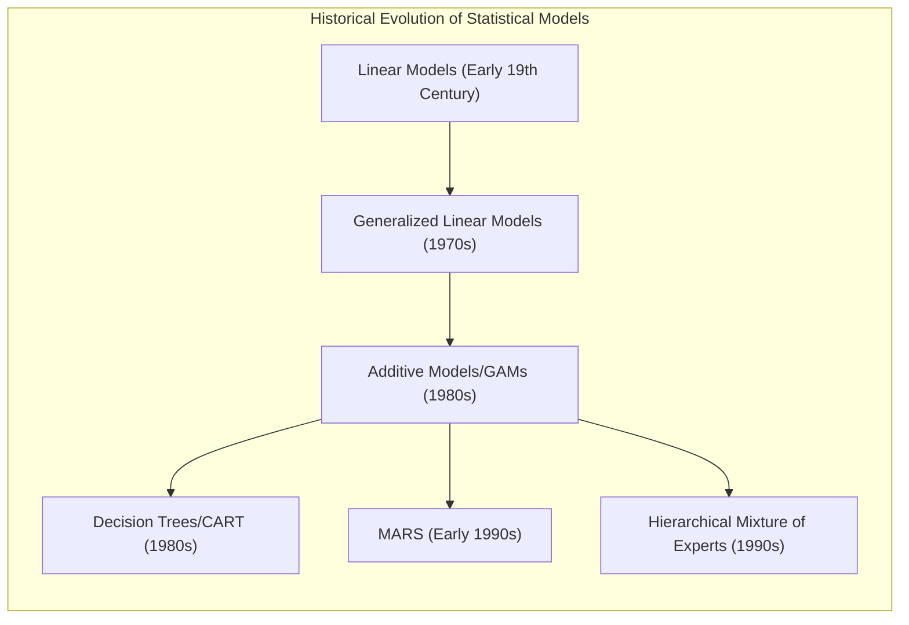
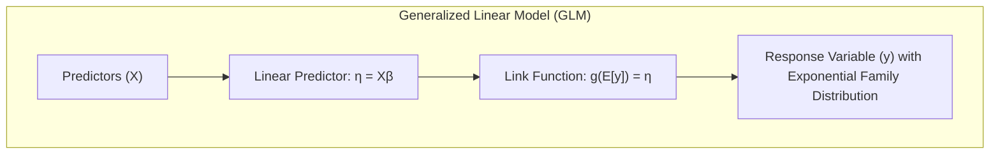
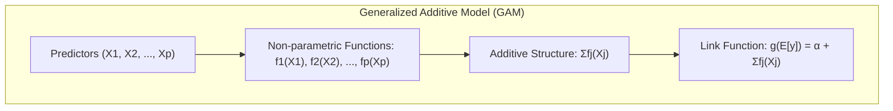
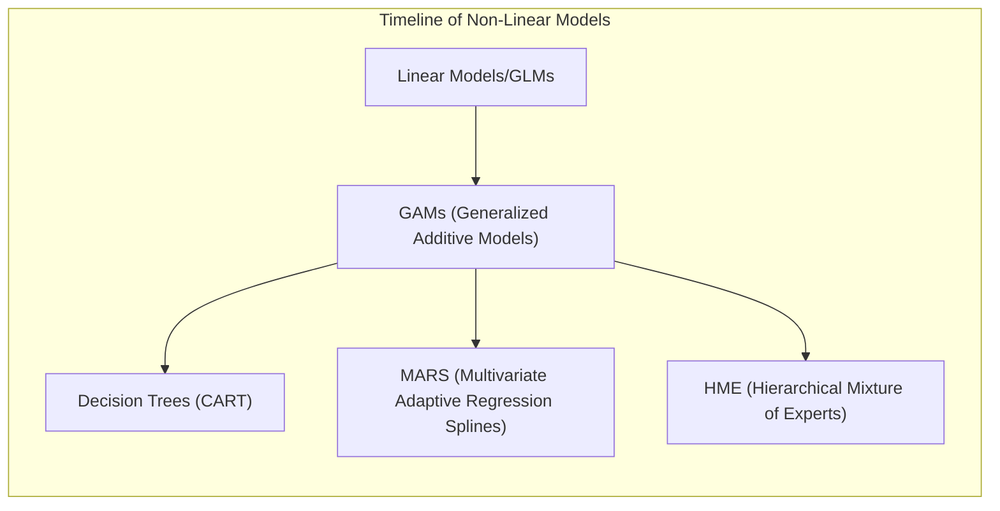
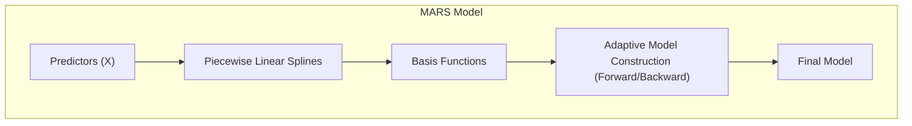
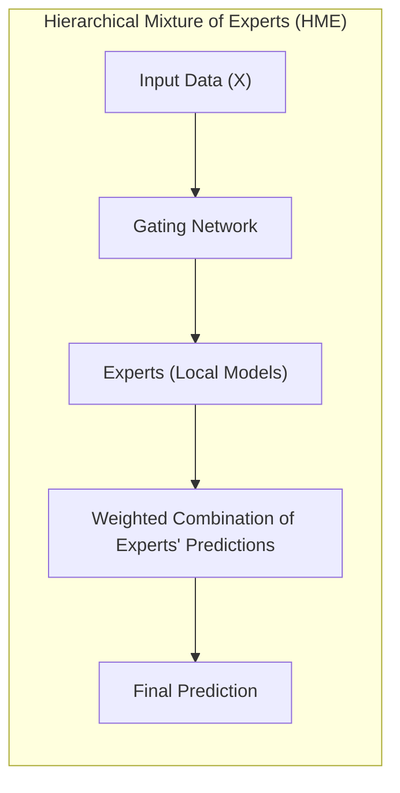
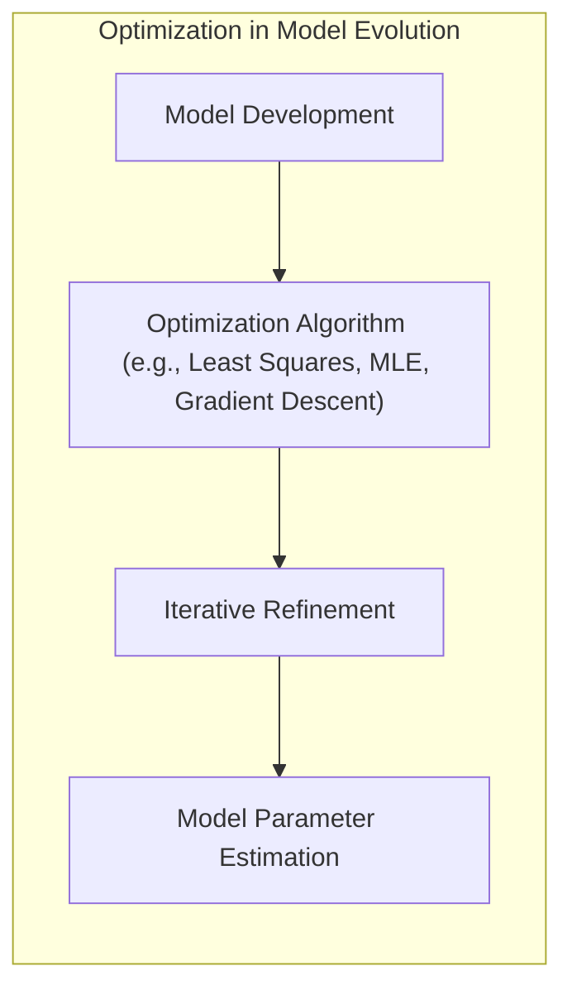
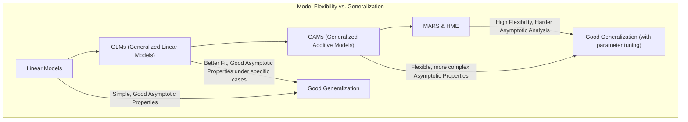

## Título: Modelos Aditivos, Árvores e Métodos Relacionados: Fundamentos e Contexto Histórico



### Introdução

Este capítulo oferece uma visão geral do contexto histórico e da evolução dos modelos estatísticos que são abordados ao longo deste documento, incluindo modelos lineares, modelos lineares generalizados, modelos aditivos, modelos aditivos generalizados (GAMs), árvores de decisão, Multivariate Adaptive Regression Splines (MARS) e misturas hierárquicas de especialistas (HME). [^9.1] A compreensão do contexto histórico e dos desenvolvimentos que levaram à criação desses modelos é fundamental para uma apreciação completa de suas capacidades, limitações e interconexões. O objetivo deste capítulo é apresentar uma linha do tempo dos principais desenvolvimentos, autores e conceitos que contribuíram para o estado atual dos modelos de aprendizado supervisionado.

### Conceitos Fundamentais

**Conceito 1: Modelos Lineares: Fundamentos e História**

Os modelos lineares são um dos modelos estatísticos mais antigos e mais utilizados, e os seus fundamentos podem ser traçados até o início do século XIX, com o desenvolvimento do método dos mínimos quadrados por Carl Friedrich Gauss e Adrien-Marie Legendre. A regressão linear simples e múltipla, que assume uma relação linear entre a variável resposta e os preditores, é a base para muitos outros modelos estatísticos. Os modelos lineares são fáceis de interpretar e computacionalmente eficientes, e ainda hoje são utilizados como modelos base para muitas aplicações. A simplicidade e interpretabilidade dos modelos lineares tornaram eles uma escolha popular durante décadas.

**Lemma 1:** *Os modelos lineares representam uma etapa fundamental na evolução da modelagem estatística, com uma história que remonta ao século XIX, com o desenvolvimento do método dos mínimos quadrados, que fundamenta a modelagem linear*. A simplicidade e interpretabilidade dos modelos lineares ainda os tornam relevantes para muitas aplicações [^4.2].

> 💡 **Exemplo Numérico:**
>
> Suponha que temos um conjunto de dados com uma variável resposta $y$ e um único preditor $x$. Os dados são:
>
> | x   | y   |
> |-----|-----|
> | 1   | 2   |
> | 2   | 4   |
> | 3   | 5   |
> | 4   | 4   |
> | 5   | 5   |
>
> Um modelo linear simples pode ser ajustado para esses dados, assumindo a forma $y = \beta_0 + \beta_1 x + \epsilon$. Usando o método dos mínimos quadrados, podemos encontrar os valores de $\beta_0$ e $\beta_1$ que minimizam a soma dos quadrados dos erros.
>
> Em Python, podemos usar `sklearn` para fazer isso:
>
> ```python
> import numpy as np
> from sklearn.linear_model import LinearRegression
>
> x = np.array([1, 2, 3, 4, 5]).reshape((-1, 1))
> y = np.array([2, 4, 5, 4, 5])
>
> model = LinearRegression()
> model.fit(x, y)
>
> beta_0 = model.intercept_
> beta_1 = model.coef_[0]
>
> print(f"Beta_0: {beta_0:.2f}")
> print(f"Beta_1: {beta_1:.2f}")
> ```
>
> Isso nos dá $\beta_0 \approx 2.2$ e $\beta_1 \approx 0.6$, então o modelo linear ajustado é aproximadamente $y = 2.2 + 0.6x$. Este modelo linear fornece uma aproximação da relação entre $x$ e $y$.

**Conceito 2: Modelos Lineares Generalizados (GLMs): Flexibilidade e Extensão da Modelagem Linear**

Os Modelos Lineares Generalizados (GLMs), introduzidos por John Nelder e Robert Wedderburn na década de 1970, generalizaram os modelos lineares ao permitir que a variável resposta tivesse diferentes distribuições, através da utilização de uma função de ligação que conecta a média da resposta a uma combinação linear dos preditores. A introdução da família exponencial e da função de ligação canônica revolucionou o campo da modelagem estatística, permitindo a modelagem de dados não Gaussianos, como dados binários (com a função *logit*) e dados de contagem (com a função *log*). O GLM foi a ponte entre o modelo linear clássico e as abordagens não paramétricas.



**Corolário 1:** *Os Modelos Lineares Generalizados representaram uma extensão importante da modelagem linear, permitindo modelar diferentes tipos de dados com a utilização de funções de ligação, e expandiram a aplicabilidade dos modelos lineares para uma gama de novos problemas.* O desenvolvimento dos GLMs abriu caminho para modelos mais flexíveis e para a modelagem de diferentes tipos de variáveis resposta [^4.4].

> 💡 **Exemplo Numérico:**
>
> Considere um problema de classificação binária onde temos uma variável resposta $y$ que pode ser 0 ou 1, e um preditor $x$.
>
> | x   | y   |
> |-----|-----|
> | 1   | 0   |
> | 2   | 0   |
> | 3   | 1   |
> | 4   | 1   |
> | 5   | 1   |
>
> Um modelo linear não seria apropriado aqui, pois a resposta é binária. Em vez disso, podemos usar um GLM com uma função de ligação logística (logit):
>
> $log(\frac{p}{1-p}) = \beta_0 + \beta_1 x$, onde $p = P(y=1|x)$.
>
> Em Python, usando `sklearn`, podemos ajustar um modelo de regressão logística:
>
> ```python
> import numpy as np
> from sklearn.linear_model import LogisticRegression
>
> x = np.array([1, 2, 3, 4, 5]).reshape((-1, 1))
> y = np.array([0, 0, 1, 1, 1])
>
> model = LogisticRegression()
> model.fit(x, y)
>
> beta_0 = model.intercept_[0]
> beta_1 = model.coef_[0][0]
>
> print(f"Beta_0: {beta_0:.2f}")
> print(f"Beta_1: {beta_1:.2f}")
> ```
>
> Isso nos dá, por exemplo, $\beta_0 \approx -4.07$ e $\beta_1 \approx 1.42$. Podemos usar esses valores para prever a probabilidade de $y=1$ para um dado $x$. Por exemplo, para $x=3$, temos:
>
> $log(\frac{p}{1-p}) = -4.07 + 1.42 * 3 = 0.19$
>
> $\frac{p}{1-p} = e^{0.19} \approx 1.21$
>
> $p = \frac{1.21}{1 + 1.21} \approx 0.55$
>
> Assim, para $x=3$, o modelo prediz uma probabilidade de aproximadamente 55% de $y=1$. Isso demonstra a capacidade do GLM de lidar com respostas binárias através da função de ligação logística.

**Conceito 3: Modelos Aditivos: A Introdução da Não Linearidade**

Modelos aditivos, como os GAMs (Modelos Aditivos Generalizados), surgiram como uma extensão dos modelos lineares, com a introdução de funções não paramétricas para modelar a relação entre a resposta e os preditores. O desenvolvimento de algoritmos eficientes para estimar modelos não paramétricos, como *splines* e *kernels*, permitiu a construção de modelos mais flexíveis e com maior capacidade de capturar não linearidades nos dados. GAMs foram desenvolvidos por Trevor Hastie e Robert Tibshirani na década de 1980, e a combinação da estrutura aditiva com métodos de suavização, permitiu que os modelos estatísticos pudessem se adaptar a dados mais complexos e que não se ajustavam bem a modelos lineares clássicos. A estrutura aditiva também permite que cada preditor seja modelado individualmente, o que facilita a interpretação dos resultados.

> ⚠️ **Nota Importante:** Os modelos aditivos, e os GAMs, representam uma mudança de paradigma na modelagem estatística, pois introduzem a capacidade de modelar relações não lineares, sem a necessidade de funções paramétricas para representar as relações entre preditores e variável resposta [^4.3].

> ❗ **Ponto de Atenção:** A escolha do método de suavização e a parametrização do modelo é um componente importante na modelagem de dados com modelos aditivos. O controle da complexidade e a utilização de métodos de regularização também são importantes na construção de modelos robustos [^4.3.1], [^4.3.2], [^4.3.3].

> ✔️ **Destaque:** Os Modelos Aditivos Generalizados (GAMs) representam a combinação da estrutura aditiva com funções não paramétricas e funções de ligação, o que resulta em modelos com grande flexibilidade e, ao mesmo tempo, com boa capacidade de interpretação [^4.4.4], [^4.4.5].



> 💡 **Exemplo Numérico:**
>
> Suponha que temos dados onde a relação entre a variável resposta $y$ e um preditor $x$ é não linear. Os dados podem ser gerados através de uma função seno, por exemplo:
>
> ```python
> import numpy as np
> import matplotlib.pyplot as plt
>
> np.random.seed(0)
> x = np.linspace(0, 10, 100)
> y = 2 * np.sin(x) + np.random.normal(0, 0.5, 100)
>
> plt.scatter(x, y, label="Dados")
> plt.xlabel("x")
> plt.ylabel("y")
> plt.title("Dados com Relação Não Linear")
> plt.legend()
> plt.show()
> ```
>
> Um modelo linear simples não seria capaz de capturar essa relação. Um modelo aditivo, como um GAM, pode usar *splines* para ajustar a relação não linear.
>
> ```python
> from pygam import LinearGAM, s
>
> gam = LinearGAM(s(0)).fit(x, y)
>
> x_grid = np.linspace(0, 10, 500)
> y_pred = gam.predict(x_grid)
>
> plt.scatter(x, y, label="Dados")
> plt.plot(x_grid, y_pred, color='red', label="GAM")
> plt.xlabel("x")
> plt.ylabel("y")
> plt.title("GAM Ajustado aos Dados Não Lineares")
> plt.legend()
> plt.show()
> ```
>
> O código acima usa a biblioteca `pygam` para ajustar um modelo GAM. O modelo ajustado, representado pela linha vermelha, captura a relação não linear entre $x$ e $y$ de forma muito mais precisa do que um modelo linear. Este exemplo ilustra como modelos aditivos podem lidar com não linearidades que modelos lineares não conseguem.

### Modelos baseados em Árvores de Decisão, MARS e HME: Abordagens Diferentes para a Modelagem de Não Linearidades



Após a introdução dos modelos lineares, modelos lineares generalizados e modelos aditivos, outros métodos como árvores de decisão, Multivariate Adaptive Regression Splines (MARS), e misturas hierárquicas de especialistas (HME) foram desenvolvidos com o objetivo de oferecer alternativas para a modelagem de dados complexos e com relações não lineares.

*   **Árvores de Decisão:** Os modelos baseados em árvores de decisão, como o CART (Classification and Regression Trees), foram desenvolvidos por Leo Breiman e seus colaboradores na década de 1980. Árvores de decisão utilizam partições binárias do espaço de características para construir um classificador ou regressor não paramétrico e oferecem uma abordagem interpretável, mas com limitações para relações suaves e complexas. O desenvolvimento de algoritmos de *pruning* para evitar overfitting também foi um passo importante na evolução das árvores de decisão.

> 💡 **Exemplo Numérico:**
>
> Considere um conjunto de dados com duas variáveis preditoras, $x_1$ e $x_2$, e uma variável resposta binária $y$.
>
> | x1  | x2  | y   |
> |-----|-----|-----|
> | 1   | 1   | 0   |
> | 1   | 2   | 0   |
> | 2   | 1   | 0   |
> | 2   | 2   | 1   |
> | 3   | 1   | 1   |
> | 3   | 2   | 1   |
>
> Uma árvore de decisão pode dividir o espaço de características de forma hierárquica. Por exemplo, a primeira divisão pode ser baseada em $x_1$, separando valores menores ou iguais a 2 dos maiores que 2. Uma segunda divisão pode ser baseada em $x_2$. Visualmente, a árvore de decisão pode ser representada assim:
>
> ```mermaid
> graph LR
>     A["x1 <= 2"] -->|Sim| B["y=0"]
>     A -->|Não| C["x2 <= 1.5"]
>     C -->|Sim| D["y=1"]
>     C -->|Não| E["y=1"]
> ```
>
> Em Python, podemos usar `sklearn` para ajustar uma árvore de decisão:
> ```python
> import numpy as np
> from sklearn.tree import DecisionTreeClassifier
> from sklearn.tree import plot_tree
> import matplotlib.pyplot as plt
>
> X = np.array([[1, 1], [1, 2], [2, 1], [2, 2], [3, 1], [3, 2]])
> y = np.array([0, 0, 0, 1, 1, 1])
>
> tree = DecisionTreeClassifier()
> tree.fit(X, y)
>
> plt.figure(figsize=(8,6))
> plot_tree(tree, filled=True)
> plt.show()
> ```
> Este código gera uma visualização da árvore de decisão ajustada aos dados. A árvore de decisão particiona o espaço de características de acordo com as condições de cada nó, permitindo a classificação dos dados.

*   **Multivariate Adaptive Regression Splines (MARS):** MARS foi desenvolvido por Jerome Friedman no início da década de 1990 como uma alternativa para modelos aditivos. O modelo MARS utiliza uma combinação de funções *spline* lineares por partes para modelar relações não lineares e interações entre preditores de forma adaptativa, e com um processo de *forward-backward selection* para escolher o modelo final. MARS oferece um modelo flexível, que pode se adaptar a diferentes padrões nos dados, com um balanço entre a complexidade e a interpretabilidade.



*   **Misturas Hierárquicas de Especialistas (HME):** Modelos HME foram propostos por Michael Jordan e Robert Jacobs na década de 1990 como uma combinação hierárquica de vários modelos de especialistas, onde cada especialista modela uma região diferente do espaço de características. Os modelos são combinados através de redes de *gating* que determinam a contribuição de cada especialista para a predição final. Os HME oferecem uma abordagem flexível para a modelagem de dados complexos, com a capacidade de combinar modelos mais simples em um modelo global mais sofisticado.



A evolução dos modelos estatísticos, desde os modelos lineares clássicos até as abordagens mais flexíveis e sofisticadas, como GAMs, árvores de decisão, MARS e HME, reflete a necessidade de lidar com dados cada vez mais complexos e com a procura por modelos com boa capacidade de modelagem e interpretabilidade.

### Modelagem Semiparamétrica e a Flexibilidade de Modelos Estatísticos

A introdução de modelos semiparamétricos, como os GAMs, trouxe uma nova abordagem para a modelagem estatística, que combina a estrutura paramétrica com a flexibilidade de funções não paramétricas. A modelagem semiparamétrica permite que algumas partes do modelo sejam especificadas usando parâmetros, enquanto outras partes são modeladas de forma não paramétrica. A modelagem semiparamétrica é uma abordagem intermediária entre os modelos paramétricos, que impõem uma estrutura fixa aos dados, e modelos não paramétricos, que podem ter uma flexibilidade excessiva. A escolha do modelo mais adequado depende da natureza dos dados, do objetivo da modelagem e da necessidade de interpretabilidade. Modelos lineares, não lineares, semiparamétricos e não paramétricos oferecem diferentes abordagens para a modelagem de dados, e o conhecimento das suas vantagens e limitações é essencial para uma análise estatística eficaz.

### Algoritmos e Métodos de Otimização e sua Relação com a Evolução dos Modelos

A evolução dos modelos estatísticos também está intrinsecamente ligada ao desenvolvimento de algoritmos de otimização eficientes. Métodos como mínimos quadrados, máxima verossimilhança e gradiente descendente evoluíram ao longo dos anos e foram adaptados para lidar com a complexidade dos modelos. Algoritmos iterativos como o algoritmo de backfitting, utilizado nos GAMs, são importantes para a modelagem de dados complexos. A otimização de modelos é uma parte crucial do processo de modelagem, e o desenvolvimento de algoritmos eficientes é fundamental para a aplicação dos modelos na prática. A combinação de modelos estatísticos com métodos de otimização apropriados permite obter resultados mais precisos e confiáveis.



### Perguntas Teóricas Avançadas: Como os desenvolvimentos em modelos lineares, GLMs e GAMs se relacionam com as propriedades assintóticas e a capacidade de generalização dos modelos e como os modelos mais flexíveis como MARS e HME se encaixam neste contexto?

**Resposta:**

Os desenvolvimentos em modelos lineares, GLMs e GAMs estão intrinsecamente ligados às propriedades assintóticas e à capacidade de generalização dos modelos. Modelos lineares, com a sua simplicidade, têm boas propriedades assintóticas sob as condições apropriadas, como a distribuição dos erros e a independência dos dados. No entanto, a limitação na modelagem de não linearidades limita a capacidade de generalização para dados complexos.

Os Modelos Lineares Generalizados (GLMs), ao introduzir funções de ligação e a família exponencial, permitem a modelagem de dados com diferentes distribuições e melhoram as propriedades estatísticas dos estimadores, quando a função de ligação canônica é utilizada. A convergência para estimadores consistentes e eficientes, e a distribuição assintótica dos estimadores pode ser obtida sob condições de regularidade da função de verossimilhança. GLMs, portanto, melhoram a capacidade de modelagem e a capacidade de generalização, mas ainda impõem restrições sobre a relação entre os preditores e a resposta, com a linearidade na escala da função de ligação.

GAMs, ao introduzir funções não paramétricas, oferecem ainda maior flexibilidade na modelagem da relação entre os preditores e a resposta, e, ao mesmo tempo, utilizam uma estrutura aditiva que aumenta a interpretabilidade. No entanto, a complexidade dos modelos GAMs dificulta a obtenção de resultados teóricos, e a sua capacidade de generalização é controlada pela escolha do suavizador e dos parâmetros de regularização, que devem ser escolhidos com cuidado. As propriedades assintóticas de estimadores de GAMs dependem da escolha dos suavizadores e da complexidade do modelo, mas os modelos GAMs oferecem melhor capacidade de modelar não linearidades.

Modelos mais flexíveis, como MARS e HME, buscam modelos ainda mais complexos, mas geralmente sacrificam a interpretação das estimativas. As propriedades assintóticas dos modelos MARS e HME são mais complexas de analisar, e a sua capacidade de generalização deve ser avaliada com métodos de validação cruzada e outros critérios de escolha de modelos, pois em modelos mais complexos, a garantia da convergência do algoritmo de otimização e das propriedades assintóticas é mais difícil. Modelos mais complexos são capazes de modelar diferentes tipos de não linearidades e relações complexas entre os preditores, mas requerem mais atenção durante o processo de modelagem e escolha de parâmetros.



**Lemma 5:** *Os desenvolvimentos em modelos estatísticos, desde os modelos lineares aos modelos mais complexos como GAMs, MARS e HME, estão relacionados com a busca por maior flexibilidade e melhor capacidade de modelar diferentes tipos de dados. A cada passo da evolução, novos métodos foram desenvolvidos, que melhoram a capacidade de generalização e mantêm as propriedades estatísticas dos estimadores, mesmo que ao custo de maior complexidade*. A evolução dos modelos buscou, em cada passo, equilibrar a flexibilidade com a capacidade de generalização, e a interpretação dos resultados [^4.5.1].

**Corolário 5:** *A escolha do modelo adequado deve considerar a complexidade dos dados, a necessidade de flexibilidade e a importância das propriedades estatísticas dos estimadores. Modelos mais complexos, embora mais capazes de modelar diferentes padrões nos dados, podem ter propriedades assintóticas mais difíceis de analisar e generalização mais difícil de garantir, ao passo que modelos mais simples podem ter mais *bias* mas são mais fáceis de entender e mais estáveis*. A escolha do modelo adequado depende do conhecimento das propriedades dos modelos e do contexto da análise [^4.5.2].

> ⚠️ **Ponto Crucial:** Os desenvolvimentos em modelos estatísticos buscaram conciliar a capacidade de ajustar diferentes padrões nos dados com a garantia de boas propriedades estatísticas e com a capacidade de generalização, que é um dos objetivos principais da modelagem estatística. Modelos mais complexos têm melhor capacidade de ajuste e aproximação, mas também requerem mais atenção durante o processo de modelagem e escolha de parâmetros [^4.3].

### Conclusão

Este capítulo forneceu uma visão geral do contexto histórico e da evolução dos modelos estatísticos que são abordados neste documento. O desenvolvimento de modelos lineares, GLMs, GAMs, árvores de decisão, MARS e HME representa uma busca constante por modelos mais flexíveis, interpretáveis e com boa capacidade de generalização. A compreensão da evolução desses modelos permite entender como cada um se relaciona com os outros, e como cada um contribuiu para o estado da arte da modelagem estatística.

### Footnotes

[^4.1]: "In this chapter we begin our discussion of some specific methods for super-vised learning. These techniques each assume a (different) structured form for the unknown regression function, and by doing so they finesse the curse of dimensionality. Of course, they pay the possible price of misspecifying the model, and so in each case there is a tradeoff that has to be made." *(Trecho de "Additive Models, Trees, and Related Methods")*

[^4.2]: "Regression models play an important role in many data analyses, providing prediction and classification rules, and data analytic tools for understand-ing the importance of different inputs." *(Trecho de "Additive Models, Trees, and Related Methods")*

[^4.3]: "In this section we describe a modular algorithm for fitting additive models and their generalizations. The building block is the scatterplot smoother for fitting nonlinear effects in a flexible way. For concreteness we use as our scatterplot smoother the cubic smoothing spline described in Chapter 5." *(Trecho de "Additive Models, Trees, and Related Methods")*

[^4.3.1]:  "The additive model has the form $Y = \alpha + \sum_{j=1}^p f_j(X_j) + \epsilon$, where the error term $\epsilon$ has mean zero." * (Trecho de "Additive Models, Trees, and Related Methods")*

[^4.3.2]:   "Given observations $x_i, y_i$, a criterion like the penalized sum of squares (5.9) of Section 5.4 can be specified for this problem, $PRSS(\alpha, f_1, f_2,..., f_p) = \sum_{i=1}^N (y_i - \alpha - \sum_{j=1}^p f_j(x_{ij}))^2 + \sum_{j=1}^p \lambda_j \int(f_j''(t_j))^2 dt_j$" * (Trecho de "Additive Models, Trees, and Related Methods")*

[^4.3.3]: "where the $\lambda_j > 0$ are tuning parameters. It can be shown that the minimizer of (9.7) is an additive cubic spline model; each of the functions $f_j$ is a cubic spline in the component $X_j$, with knots at each of the unique values of $x_{ij}$, $i = 1,..., N$." *(Trecho de "Additive Models, Trees, and Related Methods")*

[^4.4]: "For two-class classification, recall the logistic regression model for binary data discussed in Section 4.4. We relate the mean of the binary response $\mu(X) = Pr(Y = 1|X)$ to the predictors via a linear regression model and the logit link function:  $log(\mu(X)/(1 – \mu(X)) = \alpha + \beta_1 X_1 + ... + \beta_pX_p$." * (Trecho de "Additive Models, Trees, and Related Methods")*

[^4.4.1]: "The additive logistic regression model replaces each linear term by a more general functional form: $log(\mu(X)/(1 – \mu(X))) = \alpha + f_1(X_1) + \ldots + f_p(X_p)$, where again each $f_j$ is an unspecified smooth function." * (Trecho de "Additive Models, Trees, and Related Methods")*

[^4.4.2]: "While the non-parametric form for the functions $f_j$ makes the model more flexible, the additivity is retained and allows us to interpret the model in much the same way as before. The additive logistic regression model is an example of a generalized additive model." *(Trecho de "Additive Models, Trees, and Related Methods")*

[^4.4.3]: "In general, the conditional mean $\mu(X)$ of a response $Y$ is related to an additive function of the predictors via a link function $g$:  $g[\mu(X)] = \alpha + f_1(X_1) + \ldots + f_p(X_p)$." *(Trecho de "Additive Models, Trees, and Related Methods")*

[^4.4.4]:  "Examples of classical link functions are the following: $g(\mu) = \mu$ is the identity link, used for linear and additive models for Gaussian response data." *(Trecho de "Additive Models, Trees, and Related Methods")*

[^4.4.5]: "$g(\mu) = logit(\mu)$ as above, or $g(\mu) = probit(\mu)$, the probit link function, for modeling binomial probabilities. The probit function is the inverse Gaussian cumulative distribution function: $probit(\mu) = \Phi^{-1}(\mu)$." *(Trecho de "Additive Models, Trees, and Related Methods")*

[^4.5]: "All three of these arise from exponential family sampling models, which in addition include the gamma and negative-binomial distributions. These families generate the well-known class of generalized linear models, which are all extended in the same way to generalized additive models." *(Trecho de "Additive Models, Trees, and Related Methods")*

[^4.5.1]: "The functions $f_j$ are estimated in a flexible manner, using an algorithm whose basic building block is a scatterplot smoother. The estimated func-tion $f_j$ can then reveal possible nonlinearities in the effect of $X_j$. Not all of the functions $f_j$ need to be nonlinear." *(Trecho de "Additive Models, Trees, and Related Methods")*

[^4.5.2]: "We can easily mix in linear and other parametric forms with the nonlinear terms, a necessity when some of the inputs are qualitative variables (factors)." *(Trecho de "Additive Models, Trees, and Related Methods")*
