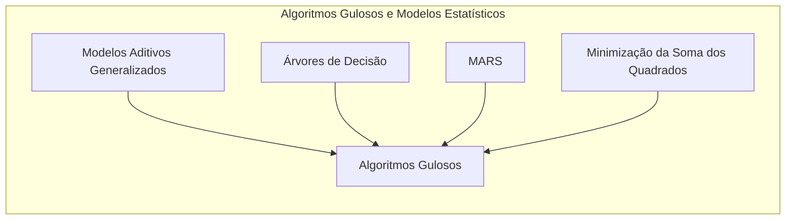
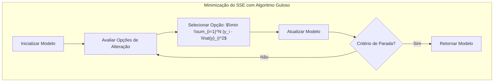
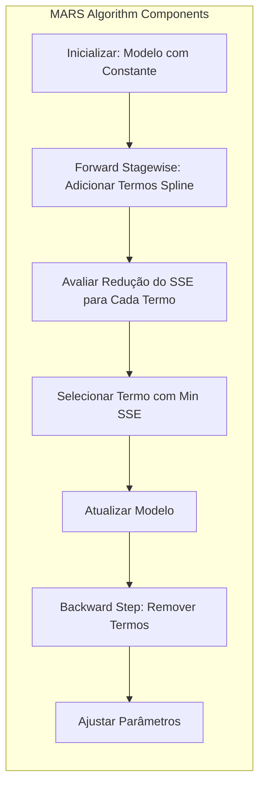
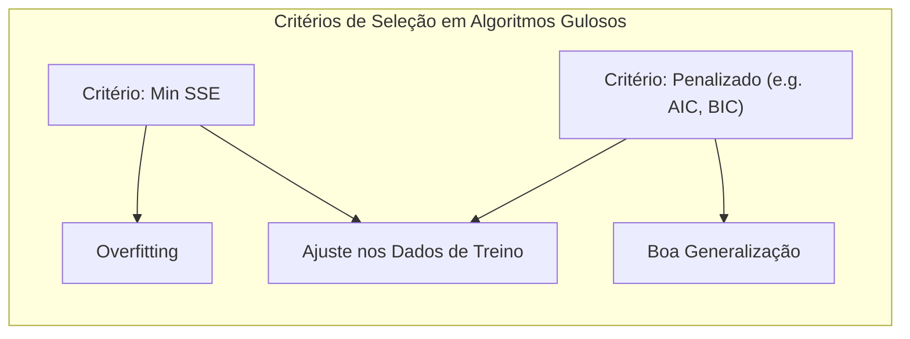
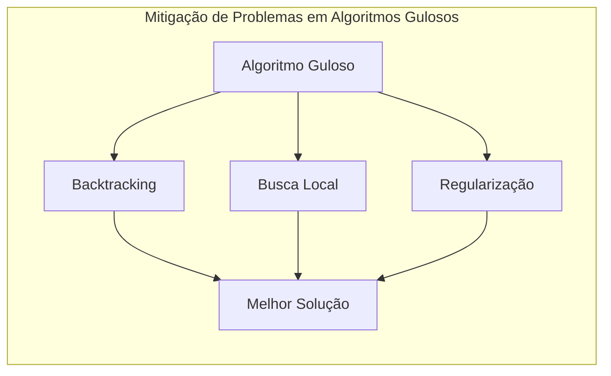

## Título: Modelos Aditivos Generalizados, Árvores e Métodos Relacionados: Algoritmos Gulosos e Otimização Iterativa da Soma dos Quadrados

### Introdução

Este capítulo explora o uso de algoritmos gulosos para a minimização da soma dos quadrados dos resíduos (SSE) em modelos estatísticos, especialmente no contexto de modelos aditivos e técnicas relacionadas, como árvores de decisão e Multivariate Adaptive Regression Splines (MARS) [^9.1]. Algoritmos gulosos são métodos iterativos que, em cada passo, selecionam a opção que parece mais promissora no momento, sem considerar as consequências futuras. O capítulo detalha a aplicação de algoritmos gulosos na construção de modelos, na seleção de variáveis e na escolha dos parâmetros, enfatizando como esses algoritmos são utilizados em problemas de otimização onde encontrar o mínimo global é computacionalmente inviável. O objetivo principal é apresentar uma compreensão sobre a aplicação de algoritmos gulosos na modelagem estatística, suas vantagens, limitações, e como as decisões gulosas afetam a qualidade das soluções e a capacidade de generalização dos modelos.

### Conceitos Fundamentais

**Conceito 1: Algoritmos Gulosos em Otimização**

Algoritmos gulosos são uma classe de algoritmos que resolvem problemas de otimização através de decisões locais que buscam a melhor opção em cada passo, sem considerar a solução global. Um algoritmo guloso geralmente começa com um estado inicial e itera através de uma sequência de passos, em cada passo, o algoritmo escolhe uma opção que parece ser a melhor no momento, utilizando um critério específico. Em geral, algoritmos gulosos não garantem a solução ótima global, mas são eficientes em termos computacionais e podem produzir resultados razoáveis, especialmente quando encontrar a solução ótima global é computacionalmente difícil. O uso de algoritmos gulosos é comum em situações onde o espaço de soluções é muito grande e a busca exaustiva é inviável. A escolha do critério de decisão em cada passo é fundamental para a qualidade da solução final.

> 💡 **Exemplo Numérico:**
> Imagine que você está tentando encontrar o caminho mais curto de uma cidade A para uma cidade Z em um mapa. Um algoritmo guloso pode, a cada cruzamento, escolher a estrada que parece levar mais diretamente à cidade Z, sem considerar que essa estrada pode ser parte de um caminho mais longo no geral. Por exemplo, no primeiro cruzamento, ele pode escolher a estrada que aponta mais diretamente para Z, mesmo que no futuro essa escolha leve a um desvio maior. Esse processo é repetido em cada cruzamento, sempre escolhendo a opção que parece melhor localmente. Um algoritmo guloso pode encontrar um caminho razoável, mas não necessariamente o mais curto.

**Lemma 1:** *Algoritmos gulosos são uma abordagem eficiente para problemas de otimização, mas não garantem a solução ótima global. Em cada passo, o algoritmo toma a decisão que parece ser a melhor localmente, sem considerar as consequências futuras. A escolha do critério de decisão em cada passo é crucial para a qualidade da solução final*. A simplicidade e eficiência dos algoritmos gulosos os tornam uma ferramenta útil para problemas complexos de otimização [^4.3.1].

**Conceito 2: Minimização da Soma dos Quadrados dos Resíduos (SSE)**

A soma dos quadrados dos resíduos (SSE) é uma métrica utilizada para avaliar o ajuste de um modelo aos dados, e é definida como:

$$
\text{SSE} = \sum_{i=1}^N (y_i - \hat{y}_i)^2
$$

onde $y_i$ são as observações, e $\hat{y}_i$ são as predições do modelo. O objetivo da otimização, em geral, é encontrar os parâmetros do modelo que minimizam o SSE, ou alguma forma penalizada do SSE, de modo que a função de custo seja minimizada e os modelos se ajustem aos dados. Algoritmos gulosos podem ser utilizados para minimizar a soma dos quadrados dos resíduos através da seleção de passos que mais diminuem o SSE em cada iteração. A utilização de algoritmos gulosos para minimizar o SSE é comum em problemas de otimização em modelos estatísticos.

> 💡 **Exemplo Numérico:**
> Suponha que temos um modelo linear simples $\hat{y}_i = \beta_0 + \beta_1 x_i$ e os seguintes dados:
>
> | $x_i$ | $y_i$ |
> |-------|-------|
> | 1     | 2     |
> | 2     | 3     |
> | 3     | 5     |
>
> Inicialmente, vamos supor que $\beta_0 = 0$ e $\beta_1 = 1$. As predições seriam:
>
> | $x_i$ | $y_i$ | $\hat{y}_i$ | $y_i - \hat{y}_i$ | $(y_i - \hat{y}_i)^2$ |
> |-------|-------|--------------|-------------------|--------------------|
> | 1     | 2     | 1            | 1                 | 1                  |
> | 2     | 3     | 2            | 1                 | 1                  |
> | 3     | 5     | 3            | 2                 | 4                  |
>
> O SSE inicial seria $1 + 1 + 4 = 6$. Um algoritmo guloso ajustaria os parâmetros $\beta_0$ e $\beta_1$ iterativamente, escolhendo os valores que reduzem o SSE em cada passo. Por exemplo, ajustando $\beta_1$ para 1.5, o SSE diminuiria. O algoritmo continuaria iterando até que o SSE não pudesse mais ser reduzido significativamente.

**Corolário 1:** *A minimização da soma dos quadrados dos resíduos (SSE) é um objetivo comum na construção de modelos estatísticos, e o SSE é utilizado para quantificar a qualidade do ajuste do modelo aos dados. Algoritmos gulosos podem ser utilizados para minimizar o SSE através da escolha iterativa de parâmetros ou componentes que diminuem o SSE em cada passo*. A busca pelo mínimo do SSE é um objetivo comum na modelagem estatística [^4.3.2], [^4.3.3].

**Conceito 3: Algoritmos Gulosos na Construção de Modelos Estatísticos**

Algoritmos gulosos são utilizados na construção de modelos estatísticos de diversas formas. Por exemplo:

*   **Árvores de Decisão:** A construção de árvores de decisão é um processo guloso, onde a divisão do espaço de características é feita de forma iterativa, escolhendo o preditor e o ponto de corte que mais diminui a impureza dos nós da árvore.
*   **Multivariate Adaptive Regression Splines (MARS):** MARS utiliza um algoritmo guloso *forward stagewise* para selecionar os termos das *splines*, adicionando um termo que mais diminui a soma dos erros quadráticos em cada iteração. O método de seleção das variáveis também é guloso.
*   **Algoritmos de Backfitting:** Embora o algoritmo de backfitting seja iterativo, ele utiliza o conceito de resíduos parciais, onde a função $f_j$ é estimada com base nos resíduos, de forma gulosa e local.
*   **Algoritmos de Seleção de Variáveis:** Em muitos métodos de seleção de variáveis, como *forward selection* ou *backward selection*, a escolha da variável a ser incluída ou removida do modelo é feita de forma gulosa, buscando o modelo com o menor erro em cada iteração.

> ⚠️ **Nota Importante:** A utilização de algoritmos gulosos na construção de modelos estatísticos permite simplificar o problema da otimização, o que resulta em modelos que podem ser construídos de forma eficiente. No entanto, a natureza gulosa desses algoritmos significa que a solução ótima global não é garantida [^4.5.1].

> ❗ **Ponto de Atenção:** Algoritmos gulosos podem convergir para mínimos locais e não globais, o que resulta em modelos que não representam a melhor solução para o problema de modelagem. O uso desses algoritmos requer a utilização de métodos para mitigar os efeitos do gulosismo [^4.5.2].

> ✔️ **Destaque:** A utilização de algoritmos gulosos, embora tenha limitações, é uma ferramenta útil na modelagem estatística, especialmente em problemas de alta dimensionalidade ou em problemas onde a otimização global é computacionalmente inviável [^4.5].

### Algoritmos Gulosos e a Minimização da Soma dos Quadrados dos Resíduos: Detalhes e Aplicações em Modelos Estatísticos

**Explicação:** Este diagrama ilustra o funcionamento geral de um algoritmo guloso para minimizar a soma dos quadrados dos resíduos (SSE), mostrando como o algoritmo toma decisões locais para atingir um mínimo local.

O algoritmo guloso para minimizar o SSE começa com a inicialização de um modelo com parâmetros iniciais. Em cada iteração $t$, o algoritmo executa os seguintes passos:

1.  **Avaliação de Opções:** Todas as opções de alteração do modelo são avaliadas. Por exemplo, em árvores de decisão, todas as possíveis divisões dos nós são avaliadas. Em modelos MARS, todas as possíveis adições ou remoções de termos *spline* são avaliadas.
2.  **Seleção da Melhor Opção:** A opção que mais reduz o SSE é escolhida de forma gulosa:

    $$
    \text{Selecionar opção: } \arg \min \sum_{i=1}^N (y_i - \hat{y}_i)^2
    $$
    A decisão é feita apenas com base no resultado local e na redução imediata do SSE.

3.  **Atualização do Modelo:** O modelo é atualizado com base na opção escolhida no passo anterior. Por exemplo, um nó é dividido em árvores de decisão, ou um termo *spline* é adicionado ou removido em MARS.
4.  **Verificação do Critério de Parada:** O algoritmo continua iterando até que um critério de parada seja atingido, como a redução do SSE ser inferior a um limiar, ou quando um número máximo de iterações for atingido.

O algoritmo guloso, portanto, busca reduzir o SSE em cada passo, mas a solução ótima global não é garantida. A escolha do critério de decisão é fundamental para a qualidade da solução final, e este deve ser escolhido de forma cuidadosa. A eficiência computacional dos algoritmos gulosos faz com que sejam bastante utilizados para modelos complexos.

**Lemma 2:** *Os algoritmos gulosos são utilizados para minimizar a soma dos erros quadráticos (SSE) através de uma abordagem iterativa, em que cada passo seleciona a opção que parece ser a melhor localmente, de modo a reduzir o SSE. O método, apesar de não garantir a solução global, gera resultados razoáveis em modelos complexos e é eficiente em termos computacionais.* A busca gulosa por uma solução ótima é uma ferramenta para modelos complexos com espaço de busca muito grande [^4.5].

### A Aplicação de Algoritmos Gulosos em Árvores de Decisão e MARS

*   **Árvores de Decisão:** Em árvores de decisão, um algoritmo guloso é usado para escolher o preditor e o ponto de corte que maximizam a pureza dos nós e minimizam o erro de classificação. Cada divisão da árvore é feita de forma a minimizar o SSE em cada nó da árvore. A escolha do preditor e do ponto de corte é feita de forma local, sem considerar o impacto nas divisões abaixo do nó, que é uma característica de um algoritmo guloso. O *pruning* da árvore é utilizado como um processo de regularização para controlar o overfitting.

> 💡 **Exemplo Numérico:**
> Suponha que estamos construindo uma árvore de decisão para prever se um cliente vai comprar um produto (1 = sim, 0 = não) com base em duas variáveis: idade (X1) e renda (X2). Temos os seguintes dados:
>
> | Cliente | X1 (Idade) | X2 (Renda) | Y (Compra) |
> |---------|------------|------------|------------|
> | 1       | 25         | 3000       | 0          |
> | 2       | 30         | 5000       | 1          |
> | 3       | 35         | 7000       | 1          |
> | 4       | 40         | 4000       | 0          |
> | 5       | 45         | 6000       | 1          |
>
> Um algoritmo guloso avaliaria todas as possíveis divisões, digamos, em X1 (idade <= 32) e X2 (renda <= 5500), e escolheria aquela que minimiza o SSE. Inicialmente, todas as observações estão em um único nó. O algoritmo avalia, por exemplo, dividir o nó em idade <= 32 e idade > 32. Calcula o SSE para cada nó resultante. Em seguida, avalia dividir o nó em renda <= 5500 e renda > 5500. O algoritmo guloso escolhe a divisão que resulta no menor SSE. Este processo é repetido recursivamente para cada nó até que um critério de parada seja atingido.

*   **Multivariate Adaptive Regression Splines (MARS):** MARS utiliza um algoritmo *forward stagewise* para construir o modelo. Em cada passo do algoritmo, um termo *spline* é adicionado ao modelo, e o termo que mais reduz o erro quadrático é escolhido. O algoritmo também utiliza um processo *backward* para remover termos que não contribuem para a redução do erro. A escolha dos termos e dos parâmetros de cada *spline* é feita de forma gulosa e iterativa. O algoritmo MARS busca encontrar um modelo com bom ajuste aos dados através de um processo de construção incremental.

> 💡 **Exemplo Numérico:**
> Suponha que estamos modelando uma variável resposta Y com base em uma variável preditora X, usando MARS. Inicialmente, o modelo MARS pode começar com apenas uma constante (intercepto). O algoritmo *forward stagewise* adicionaria termos *spline* de forma iterativa. Por exemplo, no primeiro passo, ele avalia várias funções base (splines) da forma $max(0, x - c)$ e $max(0, c - x)$ para diferentes valores de c. O algoritmo escolhe o termo que mais reduz o SSE. Digamos que o termo selecionado seja $max(0, x - 3)$. O modelo agora é $Y = \beta_0 + \beta_1 max(0, x - 3)$. No próximo passo, o algoritmo avalia todos os possíveis termos splines adicionais, como $max(0, x - 5)$, $max(0, 5 - x)$, etc., e seleciona o que mais reduz o SSE. Esse processo continua até que um critério de parada seja atingido.

Em ambos os modelos, a escolha do critério para guiar as decisões gulosas é um aspecto fundamental que influencia a complexidade do modelo, sua interpretabilidade, e seu desempenho final.

### Propriedades dos Algoritmos Gulosos em Modelos Estatísticos e a Relação com a Soma dos Quadrados dos Resíduos

As propriedades dos algoritmos gulosos em modelos estatísticos são caracterizadas pela sua simplicidade, eficiência computacional e pela falta de garantia da solução ótima global. A escolha dos critérios para guiar o processo guloso influencia diretamente os resultados. Em modelos que utilizam a soma dos erros quadráticos (SSE) como função de custo, os algoritmos gulosos buscam minimizar o SSE em cada etapa, o que pode levar a um modelo com bom ajuste aos dados de treino, mas também com *overfitting* e baixa capacidade de generalização. A utilização de métodos de regularização e validação cruzada é crucial para mitigar esses problemas.

### Perguntas Teóricas Avançadas: Como a escolha do critério de seleção em cada passo em algoritmos gulosos afeta a solução final e as propriedades estatísticas dos estimadores e quais as alternativas para mitigar os problemas dos algoritmos gulosos?

**Resposta:**

A escolha do critério de seleção em cada passo em algoritmos gulosos tem um impacto significativo na solução final e nas propriedades estatísticas dos estimadores. A natureza gulosa do algoritmo, onde a decisão local é tomada sem considerar as consequências globais, faz com que a solução final não seja necessariamente ótima.

Um critério de seleção que busca a minimização do erro em cada passo, por exemplo, pode levar a modelos com *overfitting*, que se ajustam perfeitamente aos dados de treino mas têm um desempenho ruim em novos dados. O uso de um critério de seleção que também penaliza a complexidade do modelo, como a soma de erros quadráticos penalizada (PRSS), pode levar a soluções mais estáveis e com maior capacidade de generalização. A escolha do critério de seleção, portanto, influencia o *trade-off* entre ajuste aos dados e capacidade de generalização.

> 💡 **Exemplo Numérico:**
> Considere a seleção de variáveis em um modelo de regressão linear. Um critério guloso que busca apenas a redução do SSE pode incluir variáveis que são correlacionadas com outras já presentes no modelo, levando a *overfitting*. Um critério mais sofisticado, como o AIC (Critério de Informação de Akaike) ou BIC (Critério de Informação Bayesiano), que penalizam a complexidade do modelo (número de variáveis), pode levar a um modelo mais estável e com melhor capacidade de generalização.
>
> Por exemplo, se temos um modelo com 5 variáveis e um SSE de 10, e adicionamos uma sexta variável que reduz o SSE para 9, um algoritmo guloso que só olha para o SSE aceitaria esta variável. No entanto, se o AIC ou BIC penalizassem essa complexidade adicional, o modelo com 5 variáveis poderia ser considerado melhor.

A escolha do critério de seleção também pode influenciar as propriedades estatísticas dos estimadores. Algoritmos gulosos, em geral, não garantem que os estimadores sejam consistentes, eficientes ou não viesados. Métodos de otimização mais complexos podem ser utilizados para obter estimadores com melhores propriedades estatísticas, mas o custo computacional também é maior.

Para mitigar os problemas dos algoritmos gulosos, algumas alternativas podem ser consideradas:
*   **Utilização de *backtracking*:** Reavaliar as decisões tomadas anteriormente, e alterar essas decisões caso seja necessário.
*   **Utilização de Busca Local:** Buscar soluções vizinhas ao redor da solução atual e alterar o modelo se uma solução melhor for encontrada.
*   **Utilização de Métodos de Regularização:** Penalizar a complexidade do modelo durante o processo de escolha, o que evita a inclusão de muitos parâmetros.

A escolha da melhor abordagem depende da natureza do problema e da necessidade de encontrar a solução ótima global ou apenas uma solução razoável, e qual o custo computacional tolerável. A escolha do método de otimização deve ser feita considerando as suas propriedades e limitações.

**Lemma 5:** *A escolha do critério de seleção em cada passo afeta a solução final e as propriedades estatísticas dos estimadores. Métodos que utilizam medidas locais de desempenho podem levar a soluções subótimas, enquanto que a utilização de métodos de regularização e técnicas como backtracking podem melhorar a qualidade da solução final* [^4.5.1], [^4.5.2].

**Corolário 5:** *O uso de algoritmos gulosos em modelos estatísticos requer uma análise cuidadosa do critério de seleção e das suas limitações. A utilização de outras abordagens para complementar a busca gulosa pode levar a soluções mais robustas e com maior capacidade de generalização*. A escolha do algoritmo deve considerar as suas propriedades e o problema de modelagem [^4.3.3].

> ⚠️ **Ponto Crucial**: A escolha do critério de seleção, juntamente com as abordagens alternativas para a otimização dos modelos, determina a qualidade da solução final e a capacidade de generalização do modelo. A utilização de algoritmos gulosos de forma isolada pode não ser a melhor escolha, e a utilização de outros métodos de otimização e regularização deve ser considerada [^4.4.4].

### Conclusão

Este capítulo explorou o uso de algoritmos gulosos na minimização da soma dos quadrados dos resíduos (SSE) em modelos estatísticos, com foco em árvores de decisão e MARS. As vantagens e limitações desses algoritmos foram discutidas, assim como a importância da escolha do critério de seleção. A utilização de métodos de regularização e técnicas alternativas é essencial para mitigar as limitações dos algoritmos gulosos e construir modelos robustos. A compreensão do funcionamento dos algoritmos gulosos é importante para a construção e aplicação de modelos estatísticos eficientes, e entender a sua relação com métodos mais sofisticados.

### Footnotes

[^4.1]: "In this chapter we begin our discussion of some specific methods for super-vised learning. These techniques each assume a (different) structured form for the unknown regression function, and by doing so they finesse the curse of dimensionality. Of course, they pay the possible price of misspecifying the model, and so in each case there is a tradeoff that has to be made." *(Trecho de "Additive Models, Trees, and Related Methods")*

[^4.2]: "Regression models play an important role in many data analyses, providing prediction and classification rules, and data analytic tools for understand-ing the importance of different inputs." *(Trecho de "Additive Models, Trees, and Related Methods")*

[^4.3]: "In this section we describe a modular algorithm for fitting additive models and their generalizations. The building block is the scatterplot smoother for fitting nonlinear effects in a flexible way. For concreteness we use as our scatterplot smoother the cubic smoothing spline described in Chapter 5." *(Trecho de "Additive Models, Trees, and Related Methods")*

[^4.3.1]: "The additive model has the form $Y = \alpha + \sum_{j=1}^p f_j(X_j) + \varepsilon$, where the error term $\varepsilon$ has mean zero." * (Trecho de "Additive Models, Trees, and Related Methods")*

[^4.3.2]: "Given observations $x_i, y_i$, a criterion like the penalized sum of squares (5.9) of Section 5.4 can be specified for this problem, $PRSS(\alpha, f_1, f_2,\ldots, f_p) = \sum_i^N (y_i - \alpha - \sum_j^p f_j(x_{ij}))^2 + \sum_j^p \lambda_j \int(f_j''(t_j))^2 dt_j$" * (Trecho de "Additive Models, Trees, and Related Methods")*

[^4.3.3]: "where the $\lambda_j > 0$ are tuning parameters. It can be shown that the minimizer of (9.7) is an additive cubic spline model; each of the functions $f_j$ is a cubic spline in the component $X_j$, with knots at each of the unique values of $x_{ij}, i = 1,\ldots, N$." *(Trecho de "Additive Models, Trees, and Related Methods")*

[^4.4]: "For two-class classification, recall the logistic regression model for binary data discussed in Section 4.4. We relate the mean of the binary response $\mu(X) = Pr(Y = 1|X)$ to the predictors via a linear regression model and the logit link function: $\log(\mu(X)/(1 – \mu(X)) = \alpha + \beta_1 X_1 + \ldots + \beta_pX_p$." * (Trecho de "Additive Models, Trees, and Related Methods")*

[^4.4.1]: "The additive logistic regression model replaces each linear term by a more general functional form: $\log(\mu(X)/(1 – \mu(X))) = \alpha + f_1(X_1) + \ldots + f_p(X_p)$, where again each $f_j$ is an unspecified smooth function." * (Trecho de "Additive Models, Trees, and Related Methods")*

[^4.4.2]: "While the non-parametric form for the functions $f_j$ makes the model more flexible, the additivity is retained and allows us to interpret the model in much the same way as before. The additive logistic regression model is an example of a generalized additive model." *(Trecho de "Additive Models, Trees, and Related Methods")*

[^4.4.3]: "In general, the conditional mean $\mu(X)$ of a response $Y$ is related to an additive function of the predictors via a link function $g$: $g[\mu(X)] = \alpha + f_1(X_1) + \ldots + f_p(X_p)$." *(Trecho de "Additive Models, Trees, and Related Methods")*

[^4.4.4]: "Examples of classical link functions are the following: $g(\mu) = \mu$ is the identity link, used for linear and additive models for Gaussian response data." *(Trecho de "Additive Models, Trees, and Related Methods")*

[^4.4.5]: "$g(\mu) = logit(\mu)$ as above, or $g(\mu) = probit(\mu)$, the probit link function, for modeling binomial probabilities. The probit function is the inverse Gaussian cumulative distribution function: $probit(\mu) = \Phi^{-1}(\mu)$." *(Trecho de "Additive Models, Trees, and Related Methods")*

[^4.5]: "All three of these arise from exponential family sampling models, which in addition include the gamma and negative-binomial distributions. These families generate the well-known class of generalized linear models, which are all extended in the same way to generalized additive models." *(Trecho de "Additive Models, Trees, and Related Methods")*

[^4.5.1]: "The functions $f_j$ are estimated in a flexible manner, using an algorithm whose basic building block is a scatterplot smoother. The estimated func-tion $f_j$ can then reveal possible nonlinearities in the effect of $X_j$. Not all of the functions $f_j$ need to be nonlinear." *(Trecho de "Additive Models, Trees, and Related Methods")*

[^4.5.2]: "We can easily mix in linear and other parametric forms with the nonlinear terms, a necessity when some of the inputs are qualitative variables (factors)." *(Trecho de "Additive Models, Trees, and Related Methods")*
