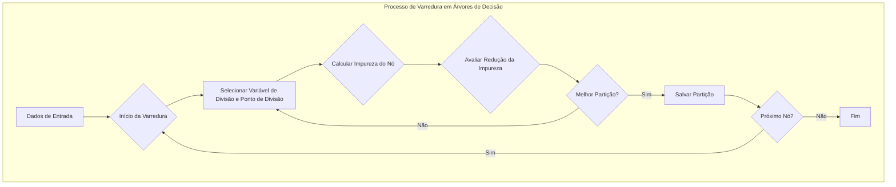
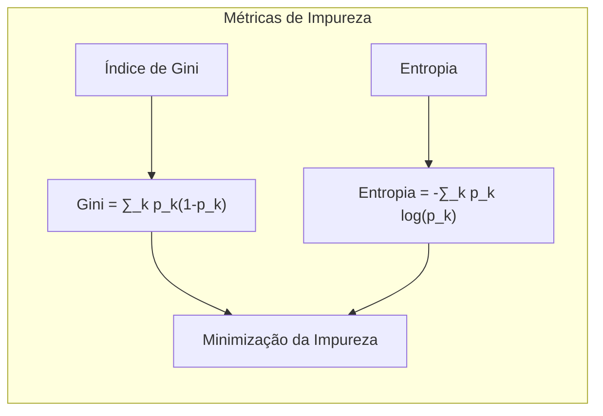
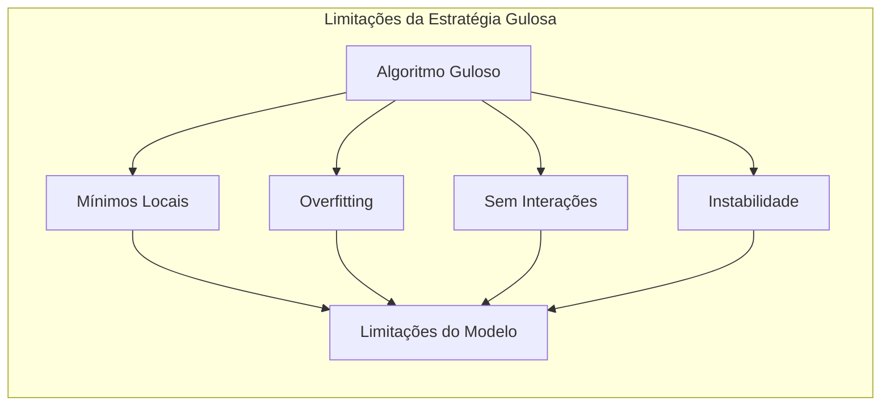
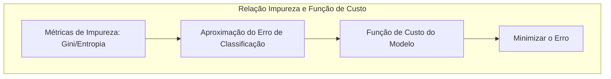

## Título: Modelos Aditivos, Árvores e Métodos Relacionados: Estratégias de Varredura para Partição de Nódulos e Minimização da Impureza



### Introdução

Este capítulo explora as estratégias de varredura utilizadas para encontrar as melhores variáveis de divisão e pontos de divisão em modelos baseados em árvores de decisão, com foco na minimização da impureza do nó [^9.1]. A construção de árvores de decisão envolve a divisão recursiva do espaço de características, e a escolha das variáveis de divisão e dos pontos de divisão em cada nó é crucial para o desempenho do modelo. Este capítulo detalha como a impureza do nó é calculada e utilizada para guiar a escolha das melhores partições, e como diferentes métricas, como Gini e entropia, afetam o processo de otimização, e como o algoritmo realiza uma varredura exaustiva para encontrar as melhores opções de partição. O objetivo principal é oferecer uma visão aprofundada dos algoritmos utilizados na construção de árvores de decisão e como as decisões de partição são tomadas utilizando uma abordagem gulosa que busca a minimização local da impureza.

### Conceitos Fundamentais

**Conceito 1: Impureza do Nó em Árvores de Decisão**

A impureza do nó é uma métrica utilizada para avaliar a qualidade de uma partição em árvores de decisão. A impureza quantifica a homogeneidade das classes dentro de um nó, de forma que, quanto menor a impureza, mais homogêneo será o nó.  Um nó com impureza zero contém todas as observações da mesma classe, enquanto um nó com alta impureza contém uma mistura de observações de classes diferentes. A minimização da impureza do nó é o objetivo da construção de árvores de decisão, que busca dividir os dados em partições com alta homogeneidade.  A escolha da métrica para calcular a impureza do nó é uma decisão importante na construção de árvores de decisão.

**Lemma 1:** *A impureza do nó é uma métrica que quantifica a heterogeneidade de um nó em árvores de decisão. O objetivo na construção da árvore é encontrar partições que minimizem a impureza do nó, ou seja, que criem partições com alta homogeneidade de classe*. A minimização da impureza do nó é a base da construção das árvores de decisão [^4.5].

**Conceito 2: Métricas de Impureza: Gini e Entropia**

Existem diferentes métricas utilizadas para calcular a impureza do nó. As duas métricas mais comuns são o índice de Gini e a entropia.

*   **Índice de Gini:** O índice de Gini é dado por:
$$
\text{Gini} = \sum_{k \ne k'} p_k p_{k'} =  \sum_{k} p_k(1-p_k)
$$

onde $p_k$ é a proporção de observações da classe $k$ no nó, e a soma é feita sobre todas as classes. O índice de Gini mede a probabilidade de classificar incorretamente uma observação escolhida aleatoriamente do nó, e é zero quando o nó é puro.
*   **Entropia:** A entropia é dada por:
$$
\text{Entropia} = -\sum_k p_k \log p_k
$$
onde $p_k$ é a proporção de observações da classe $k$ no nó. A entropia mede a incerteza ou a aleatoriedade da distribuição das classes, e é zero quando o nó é puro e maximizada quando as classes são igualmente distribuídas.



Ambas as métricas de impureza são similares e tendem a gerar resultados semelhantes na construção de árvores de decisão. A escolha da métrica é uma decisão que geralmente não tem impacto significativo no resultado final.

> 💡 **Exemplo Numérico:**
> Suponha que temos um nó com 10 observações, sendo 6 da classe A e 4 da classe B. Vamos calcular o índice de Gini e a entropia para este nó:
>
> *   **Índice de Gini:**
>     $p_A = \frac{6}{10} = 0.6$ e $p_B = \frac{4}{10} = 0.4$
>     $\text{Gini} = p_A(1-p_A) + p_B(1-p_B) = 0.6(1-0.6) + 0.4(1-0.4) = 0.6(0.4) + 0.4(0.6) = 0.24 + 0.24 = 0.48$
>
> *   **Entropia:**
>     $\text{Entropia} = - (p_A \log_2 p_A + p_B \log_2 p_B) = - (0.6 \log_2 0.6 + 0.4 \log_2 0.4) \approx - (0.6 * -0.737 + 0.4 * -1.322) \approx 0.4422 + 0.5288 \approx 0.971$
>
> Agora, suponha que dividimos esse nó em dois: um com 5 observações da classe A e outro com 4 observações da classe B e 1 da classe A.
>
> *   **Nó 1 (5 A):** $p_A = 1.0, p_B = 0.0$
>     $\text{Gini}_1 = 1.0(1-1.0) + 0.0(1-0.0) = 0$
>     $\text{Entropia}_1 = - (1.0 \log_2 1.0 + 0.0 \log_2 0.0) = 0$ (considerando $0*log(0)=0$)
>
> *   **Nó 2 (1 A, 4 B):** $p_A = \frac{1}{5} = 0.2$, $p_B = \frac{4}{5} = 0.8$
>     $\text{Gini}_2 = 0.2(1-0.2) + 0.8(1-0.8) = 0.16 + 0.16 = 0.32$
>      $\text{Entropia}_2 = - (0.2 \log_2 0.2 + 0.8 \log_2 0.8) \approx - (0.2 * -2.322 + 0.8 * -0.322) \approx 0.4644 + 0.2576 \approx 0.722$
>
>   A impureza ponderada da divisão é calculada como:
>   $\text{Gini}_\text{ponderado} = \frac{5}{10} * 0 + \frac{5}{10} * 0.32 = 0.16$
>   $\text{Entropia}_\text{ponderada} = \frac{5}{10} * 0 + \frac{5}{10} * 0.722 = 0.361$
>
> A redução na impureza, comparada ao nó original, é:
>   $\text{Redução Gini} = 0.48 - 0.16 = 0.32$
>   $\text{Redução Entropia} = 0.971 - 0.361 = 0.61$
>
> Este exemplo demonstra que a divisão reduz a impureza, e o objetivo da árvore de decisão é encontrar a divisão que maximiza essa redução, utilizando o índice de Gini ou a Entropia como critério.

**Corolário 1:** *O índice de Gini e a entropia são métricas similares para medir a impureza de um nó, e são utilizadas para guiar a escolha das partições em árvores de decisão. Embora sejam métricas similares, suas propriedades matemáticas são diferentes, e podem gerar resultados levemente diferentes, o que geralmente não é significativo na prática* [^4.5].

**Conceito 3: Estratégia de Varredura para Encontrar a Melhor Partição**

Para encontrar a melhor partição em um nó, as árvores de decisão utilizam uma estratégia de varredura. O processo de varredura envolve avaliar todos os preditores e todos os possíveis pontos de divisão para cada preditor, de forma exaustiva. Para cada preditor e ponto de divisão, a impureza do nó é calculada, e a divisão que resulta na menor impureza é selecionada para ser utilizada na construção da árvore.  A varredura é um processo guloso, onde a melhor divisão é escolhida localmente, sem considerar o impacto das decisões de divisão em níveis inferiores da árvore.

> ⚠️ **Nota Importante:**  A estratégia de varredura utilizada em árvores de decisão busca encontrar a melhor partição de forma gulosa, utilizando uma métrica de impureza que avalia a qualidade da divisão de forma local. A natureza gulosa da varredura não garante que a solução encontrada seja a melhor solução global, e outras abordagens podem ser utilizadas para lidar com essa limitação.  A varredura é computacionalmente eficiente, mas não garante o ótimo global [^4.5.1], [^4.5.2].

> ❗ **Ponto de Atenção:**  A escolha do preditor e do ponto de divisão é feita de forma local, com base na redução da impureza do nó atual, sem considerar as futuras decisões na árvore, o que pode levar a um modelo subótimo.  A abordagem gulosa pode não ser apropriada para dados que têm relações mais complexas, e em particular, quando as interações entre os preditores são relevantes.

> ✔️ **Destaque:** A estratégia de varredura é utilizada na construção de árvores de decisão para encontrar os melhores preditores e pontos de divisão, e os resultados são obtidos através de um processo guloso, com base na minimização da impureza do nó [^4.5].

### Detalhes do Processo de Varredura: Métricas de Impureza, Avaliação de Partições e Decisões Gulosas

```mermaid
flowchart TD
    subgraph "Processo de Varredura Detalhado"
        A[Inicializar: "Nó atual"] --> B[Para cada "Variável de divisão $X_j$"]
        B --> C[Para cada "Ponto de divisão $s$"]
        C --> D[Dividir: "$R_1 = \{X|X_j < s\}$ e $R_2 = \{X|X_j \geq s\}$"]
        D --> E[Calcular: "Impureza $Q(R_1)$ e $Q(R_2)$"]
        E --> F[Calcular: "Impureza Ponderada"]
        F --> G[Avaliar: "Redução da Impureza"]
        G --> H[Salvar: "Melhor Partição (local)"]
        H --> I[Próxima: "Variável ou Ponto de Divisão?"]
        I -- "Sim" --> B
        I -- "Não" --> J[Retornar: "Melhor Divisão Local"]
    end
```

**Explicação:** Este diagrama detalha o processo de varredura utilizado para a escolha da melhor partição em árvores de decisão, mostrando a avaliação dos pontos de corte, a utilização das métricas de impureza e a seleção da melhor partição de forma gulosa [^4.5.1], [^4.5.2].

O processo de varredura começa com a escolha de uma variável de divisão $X_j$ para a avaliação. Em seguida, o algoritmo itera sobre todos os possíveis pontos de divisão $s$ da variável $X_j$. Para cada ponto de divisão, os seguintes passos são realizados:

1.  **Divisão do Nó:** O nó atual é dividido em dois nós filhos com base no ponto de divisão $s$:
    $$
    R_1(j,s) = \{X|X_j < s\}
    $$
    $$
     R_2(j,s) = \{X|X_j \geq s\}
    $$
    A divisão é feita de modo que todas as observações com valor de $X_j$ menor que $s$ são enviadas para o nó $R_1$, e as outras para o nó $R_2$.
2.  **Cálculo da Impureza dos Nós Filhos:** A impureza de cada nó filho é calculada usando uma métrica apropriada, como o índice de Gini ou a entropia:
    $$
        Q(R_1) = \sum_k p_{1k}(1 - p_{1k}) \text{ ou }  Q(R_1) = - \sum_k p_{1k} \log(p_{1k})
    $$
    $$
         Q(R_2) = \sum_k p_{2k}(1 - p_{2k}) \text{ ou }  Q(R_2) = - \sum_k p_{2k} \log(p_{2k})
    $$

    onde $p_{1k}$ e $p_{2k}$ são as proporções de observações da classe $k$ nos nós $R_1$ e $R_2$, respectivamente.
3.  **Cálculo da Impureza Ponderada:** A impureza ponderada dos nós filhos é calculada como:
$$
    \text{Impureza Ponderada} = \frac{N_1}{N}Q(R_1) + \frac{N_2}{N}Q(R_2)
$$
onde $N_1$ e $N_2$ são o número de observações nos nós $R_1$ e $R_2$, respectivamente, e $N$ é o número total de observações no nó pai.
4.  **Escolha da Melhor Partição:** A melhor partição para a variável $X_j$ é aquela que minimiza a impureza ponderada. A melhor partição entre todos os preditores é escolhida, e a árvore é construída.

> 💡 **Exemplo Numérico:**
> Considere um nó com 20 observações, sendo 12 da classe A e 8 da classe B. Temos um preditor $X_1$ com valores que variam de 1 a 10.
>
> Vamos avaliar dois possíveis pontos de divisão: $s_1 = 5$ e $s_2 = 7$.
>
> *   **Divisão com $s_1 = 5$:**
>     *   **Nó $R_1$ ($X_1 < 5$):** 8 observações, 6 da classe A e 2 da classe B.
>         $p_{1A} = \frac{6}{8} = 0.75$, $p_{1B} = \frac{2}{8} = 0.25$
>         $\text{Gini}(R_1) = 0.75(1-0.75) + 0.25(1-0.25) = 0.1875 + 0.1875 = 0.375$
>     *   **Nó $R_2$ ($X_1 \ge 5$):** 12 observações, 6 da classe A e 6 da classe B.
>         $p_{2A} = \frac{6}{12} = 0.5$, $p_{2B} = \frac{6}{12} = 0.5$
>         $\text{Gini}(R_2) = 0.5(1-0.5) + 0.5(1-0.5) = 0.25 + 0.25 = 0.5$
>     *   **Impureza Ponderada:** $\frac{8}{20} * 0.375 + \frac{12}{20} * 0.5 = 0.15 + 0.3 = 0.45$
>
> *   **Divisão com $s_2 = 7$:**
>     *   **Nó $R_1$ ($X_1 < 7$):** 14 observações, 10 da classe A e 4 da classe B.
>          $p_{1A} = \frac{10}{14} \approx 0.714$, $p_{1B} = \frac{4}{14} \approx 0.286$
>         $\text{Gini}(R_1) = 0.714(1-0.714) + 0.286(1-0.286) \approx 0.204 + 0.204 \approx 0.408$
>     *   **Nó $R_2$ ($X_1 \ge 7$):** 6 observações, 2 da classe A e 4 da classe B.
>          $p_{2A} = \frac{2}{6} \approx 0.333$, $p_{2B} = \frac{4}{6} \approx 0.667$
>         $\text{Gini}(R_2) = 0.333(1-0.333) + 0.667(1-0.667) \approx 0.222 + 0.222 \approx 0.444$
>     *   **Impureza Ponderada:** $\frac{14}{20} * 0.408 + \frac{6}{20} * 0.444 \approx 0.286 + 0.133 \approx 0.419$
>
> Neste caso, a divisão com $s_2 = 7$ resulta em menor impureza ponderada (0.419) em comparação com a divisão com $s_1=5$ (0.45). O algoritmo escolherá o ponto de divisão $s_2=7$ para este preditor, e continuará a varredura com outros preditores e pontos de divisão.

A escolha da variável de divisão e do ponto de divisão é feita de forma gulosa, buscando minimizar a impureza local do nó. A escolha do critério de impureza (Gini ou Entropia) geralmente não tem grande impacto no resultado final, já que ambas as métricas são similares e tendem a escolher partições similares.

**Lemma 3:** *A estratégia de varredura busca escolher o melhor ponto de corte para cada preditor de forma a minimizar a impureza do nó. A escolha da métrica de impureza (Gini ou entropia) influencia a forma como as partições são avaliadas, mas em geral não altera muito o resultado final, já que as métricas são similares e seus mínimos são similares. O algoritmo guloso busca reduzir a impureza local, sem garantir o mínimo global* [^4.5.1].

### Propriedades do Algoritmo Guloso e Limitações da Estratégia de Varredura



A estratégia de varredura utilizada na construção de árvores de decisão é uma abordagem eficiente e amplamente utilizada. No entanto, a natureza gulosa do algoritmo, e a avaliação de um preditor de cada vez, podem levar a limitações importantes, como:
*   **Mínimos Locais:** O algoritmo pode ficar preso em mínimos locais, sem encontrar o ótimo global.
*   **Overfitting:** A escolha de divisões que minimizam o erro nos dados de treino podem levar ao overfitting, e as árvores podem ter um desempenho ruim em dados não vistos.
*   **Interações:** A avaliação de cada preditor separadamente não permite modelar interações entre os preditores.
*   **Instabilidade:**  Pequenas mudanças nos dados de treino podem levar a grandes mudanças na estrutura da árvore.

O *pruning* da árvore é utilizado para reduzir o efeito do overfitting e simplificar o modelo. A utilização de *ensemble methods*, como Random Forests ou Gradient Boosting, também busca mitigar os problemas das árvores de decisão utilizando métodos que combinam as estimativas de diferentes árvores.

### Alternativas para a Estratégia de Varredura e Modelos Mais Flexíveis

Alternativas para a estratégia de varredura podem ser consideradas para a construção de modelos mais flexíveis, como:
*  **Utilização de Métodos de Regularização:** Impor penalidades à complexidade da árvore para evitar o overfitting.
*  **Utilização de métodos de *ensemble*:** Utilizar combinações de árvores de decisão para melhorar a capacidade de generalização e reduzir a instabilidade.
*  **Utilização de modelos mais flexíveis:** Utilizar métodos de modelagem que podem representar relações complexas de forma mais eficiente, como modelos aditivos, MARS e HME, que foram apresentados neste capítulo e que também podem fazer uso de algoritmos gulosos em suas construções.

A escolha da melhor abordagem depende da natureza dos dados e do objetivo da análise.

### Perguntas Teóricas Avançadas: Como as métricas de impureza (Gini e Entropia) se relacionam com a função de custo do modelo e como a escolha da função de custo influencia a capacidade de modelagem do algoritmo de construção de árvores?

**Resposta:**

As métricas de impureza, como Gini e Entropia, são utilizadas como critérios para a seleção das partições nas árvores de decisão e se relacionam com a função de custo do modelo. A impureza é uma aproximação do erro de classificação, e servem como um guia para o algoritmo escolher a melhor divisão dos nós. A escolha da métrica de impureza afeta diretamente como a árvore é construída, e consequentemente, a sua capacidade de modelar os dados.

O índice de Gini e a entropia são utilizados para modelar o erro de classificação, e eles medem a heterogeneidade dos dados nos nós, sendo a entropia uma medida de incerteza e o índice de Gini uma medida de probabilidade de classificação incorreta.  Ambas métricas, em geral, levam a modelos com bom desempenho, pois utilizam informação sobre a composição das classes, e o critério de seleção do nó é tal que os nós filhos sejam mais puros que o nó pai, o que leva a uma diminuição da impureza em cada passo do algoritmo guloso.

A relação entre as métricas de impureza e a função de custo do modelo é que as métricas são utilizadas para aproximar o erro de classificação do modelo.  O objetivo da construção da árvore é minimizar o erro de classificação, e as métricas de impureza oferecem uma forma de guiar a construção da árvore para este objetivo. No entanto, é importante notar que o processo de construção de árvores de decisão é guloso, e por isso o modelo final pode não ser ótimo globalmente, mesmo quando as métricas de impureza são usadas. A escolha da métrica de impureza, portanto, deve ser feita considerando a sua relação com a função de custo, e com a forma como ela influencia a construção da árvore.



Modelos mais flexíveis, como modelos aditivos, não usam o conceito de impureza do nó, e utilizam funções de custo baseadas na soma dos erros quadráticos ou na função de verossimilhança. Modelos mais complexos podem ter um processo de otimização mais complexo e não utilizam métricas de impureza. A escolha da função de custo tem um grande impacto na capacidade de modelagem e na forma como o modelo se ajusta aos dados. Modelos lineares, por exemplo, usam a soma dos quadrados dos resíduos, modelos logísticos usam a função de verossimilhança e modelos da família exponencial utilizam funções de custo que são consistentes com sua família de distribuição.

**Lemma 5:** *As métricas de impureza (Gini e Entropia) são utilizadas em árvores de decisão para aproximar o erro de classificação, e guiam o algoritmo na escolha das partições. A escolha da métrica influencia o resultado da construção da árvore, mas as métricas geralmente levam a resultados similares*. A escolha da métrica de impureza, e sua relação com a função de custo, é importante para entender o comportamento da árvore de decisão e avaliar o seu desempenho [^4.5.1], [^4.5.2].

**Corolário 5:** *A métrica de impureza, utilizada na construção de árvores de decisão, aproxima a função de custo utilizada no modelo, e modelos mais complexos utilizam outras abordagens para estimar os parâmetros. Modelos aditivos generalizados, por exemplo, minimizam a deviance, que é baseada na log-verossimilhança, e MARS utiliza aproximações baseadas em splines. A escolha da métrica de impureza ou da função de custo depende do tipo de problema e do objetivo da modelagem*. A escolha do método de modelagem depende das propriedades dos dados, e dos objetivos da análise [^4.3.1].

> ⚠️ **Ponto Crucial**:  A relação entre a métrica de impureza, e outras funções de custo utilizadas em modelos de aprendizado supervisionado, garante que os modelos sejam capazes de modelar os dados de forma adequada, e a escolha adequada da métrica, da função de custo, e das abordagens de otimização é crucial para o desempenho do modelo.  A escolha dos componentes do modelo deve considerar as suas propriedades e a natureza dos dados [^4.4.4].

### Conclusão

Este capítulo explorou as estratégias de varredura para a partição de nós e a minimização da impureza em árvores de decisão, detalhando o uso de métricas como Gini e Entropia, e como os algoritmos gulosos operam nesse contexto.  A relação entre a impureza dos nós e a função de custo do modelo, e como a estratégia de varredura é aplicada para escolher as melhores divisões também foi detalhada. A compreensão das propriedades desses algoritmos é essencial para a construção de modelos estatísticos que sejam robustos, eficientes e com boa capacidade de generalização.

### Footnotes

[^4.1]: "In this chapter we begin our discussion of some specific methods for super-vised learning. These techniques each assume a (different) structured form for the unknown regression function, and by doing so they finesse the curse of dimensionality. Of course, they pay the possible price of misspecifying the model, and so in each case there is a tradeoff that has to be made." *(Trecho de "Additive Models, Trees, and Related Methods")*

[^4.2]: "Regression models play an important role in many data analyses, providing prediction and classification rules, and data analytic tools for understand-ing the importance of different inputs." *(Trecho de "Additive Models, Trees, and Related Methods")*

[^4.3]: "In this section we describe a modular algorithm for fitting additive models and their generalizations. The building block is the scatterplot smoother for fitting nonlinear effects in a flexible way. For concreteness we use as our scatterplot smoother the cubic smoothing spline described in Chapter 5." *(Trecho de "Additive Models, Trees, and Related Methods")*

[^4.3.1]:  "The additive model has the form $Y = \alpha + \sum_{j=1}^p f_j(X_j) + \varepsilon$, where the error term $\varepsilon$ has mean zero." * (Trecho de "Additive Models, Trees, and Related Methods")*

[^4.3.2]:   "Given observations $x_i, y_i$, a criterion like the penalized sum of squares (5.9) of Section 5.4 can be specified for this problem, $PRSS(\alpha, f_1, f_2,..., f_p) = \sum_i^N (y_i - \alpha - \sum_j^p f_j(x_{ij}))^2 + \sum_j^p \lambda_j \int(f_j''(t_j))^2 dt_j$" * (Trecho de "Additive Models, Trees, and Related Methods")*

[^4.3.3]: "where the $\lambda_j > 0$ are tuning parameters. It can be shown that the minimizer of (9.7) is an additive cubic spline model; each of the functions $f_j$ is a cubic spline in the component $X_j$, with knots at each of the unique values of $x_{ij}$, $i = 1,..., N$." *(Trecho de "Additive Models, Trees, and Related Methods")*

[^4.4]: "For two-class classification, recall the logistic regression model for binary data discussed in Section 4.4. We relate the mean of the binary response $\mu(X) = Pr(Y = 1|X)$ to the predictors via a linear regression model and the logit link function:  $\log(\mu(X)/(1 – \mu(X)) = \alpha + \beta_1 X_1 + ... + \beta_pX_p$." * (Trecho de "Additive Models, Trees, and Related Methods")*

[^4.4.1]: "The additive logistic regression model replaces each linear term by a more general functional form: $\log(\mu(X)/(1 – \mu(X))) = \alpha + f_1(X_1) + \ldots + f_p(X_p)$, where again each $f_j$ is an unspecified smooth function." * (Trecho de "Additive Models, Trees, and Related Methods")*

[^4.4.2]: "While the non-parametric form for the functions $f_j$ makes the model more flexible, the additivity is retained and allows us to interpret the model in much the same way as before. The additive logistic regression model is an example of a generalized additive model." *(Trecho de "Additive Models, Trees, and Related Methods")*

[^4.4.3]: "In general, the conditional mean $\mu(X)$ of a response $Y$ is related to an additive function of the predictors via a link function $g$:  $g[\mu(X)] = \alpha + f_1(X_1) + \ldots + f_p(X_p)$." *(Trecho de "Additive Models, Trees, and Related Methods")*

[^4.4.4]:  "Examples of classical link functions are the following: $g(\mu) = \mu$ is the identity link, used for linear and additive models for Gaussian response data." *(Trecho de "Additive Models, Trees, and Related Methods")*

[^4.4.5]: "$g(\mu) = \text{logit}(\mu)$ as above, or $g(\mu) = \text{probit}(\mu)$, the probit link function, for modeling binomial probabilities. The probit function is the inverse Gaussian cumulative distribution function: $\text{probit}(\mu) = \Phi^{-1}(\mu)$." *(Trecho de "Additive Models, Trees, and Related Methods")*

[^4.5]: "All three of these arise from exponential family sampling models, which in addition include the gamma and negative-binomial distributions. These families generate the well-known class of generalized linear models, which are all extended in the same way to generalized additive models." *(Trecho de "Additive Models, Trees, and Related Methods")*

[^4.5.1]: "The functions $f_j$ are estimated in a flexible manner, using an algorithm whose basic building block is a scatterplot smoother. The estimated func-tion $f_j$ can then reveal possible nonlinearities in the effect of $X_j$. Not all of the functions $f_j$ need to be nonlinear." *(Trecho de "Additive Models, Trees, and Related Methods")*

[^4.5.2]: "We can easily mix in linear and other parametric forms with the nonlinear terms, a necessity when some of the inputs are qualitative variables (factors)." *(Trecho de "Additive Models, Trees, and Related Methods")*
