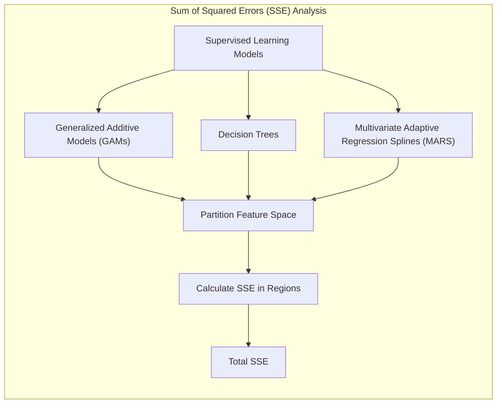
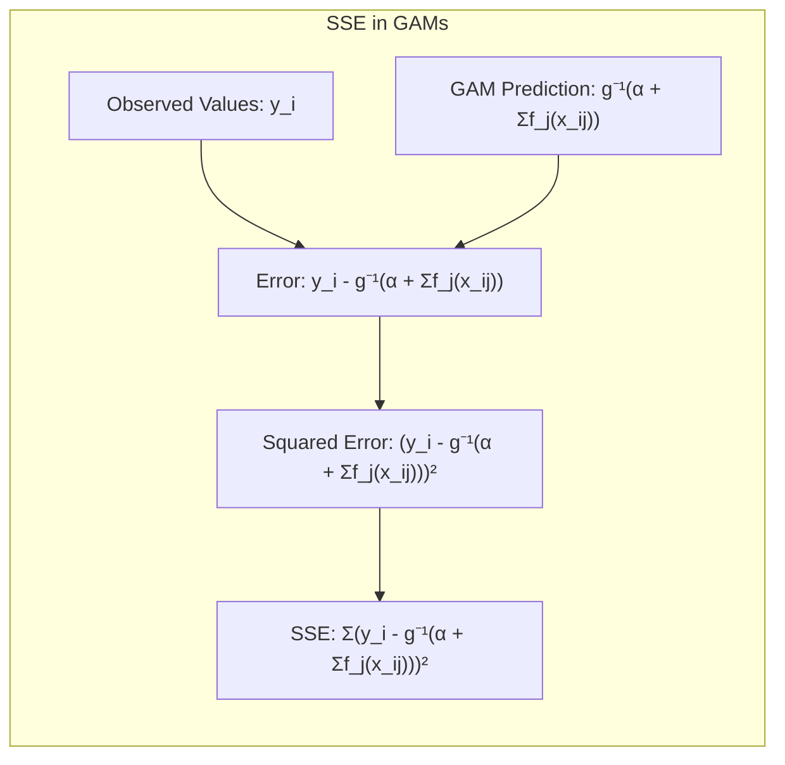
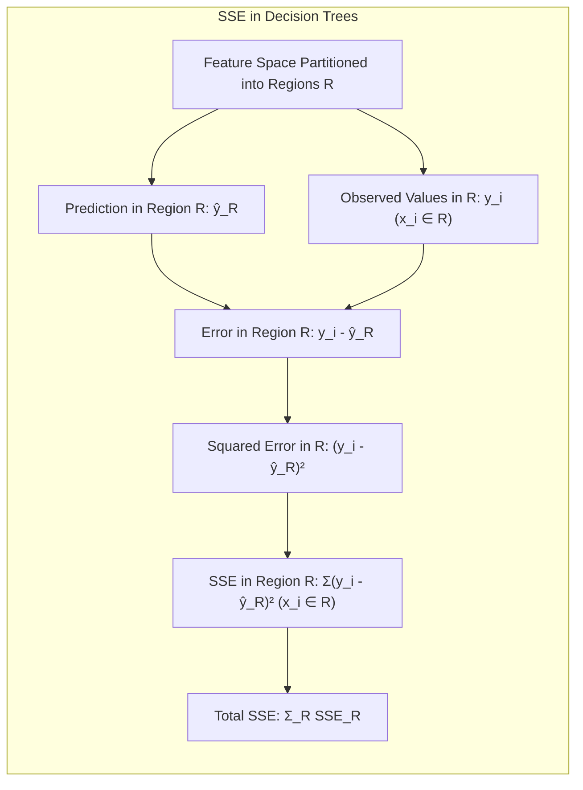
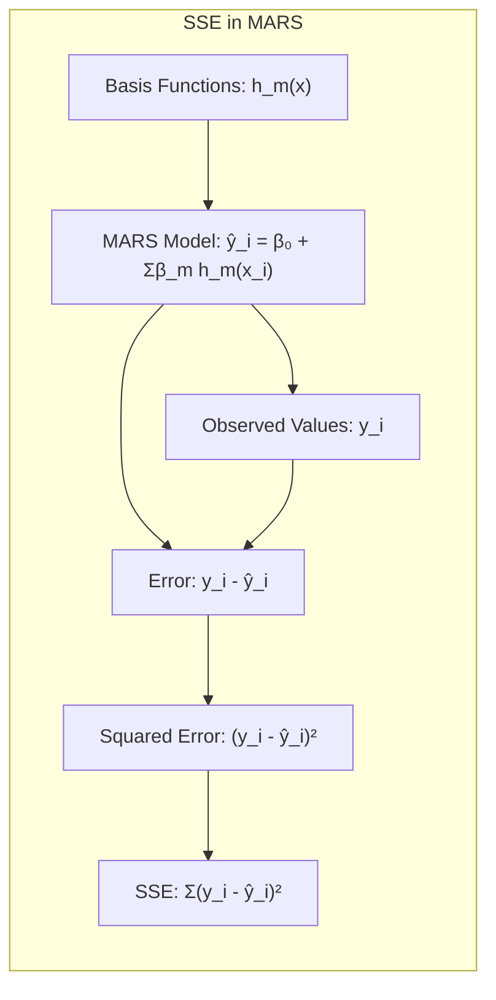
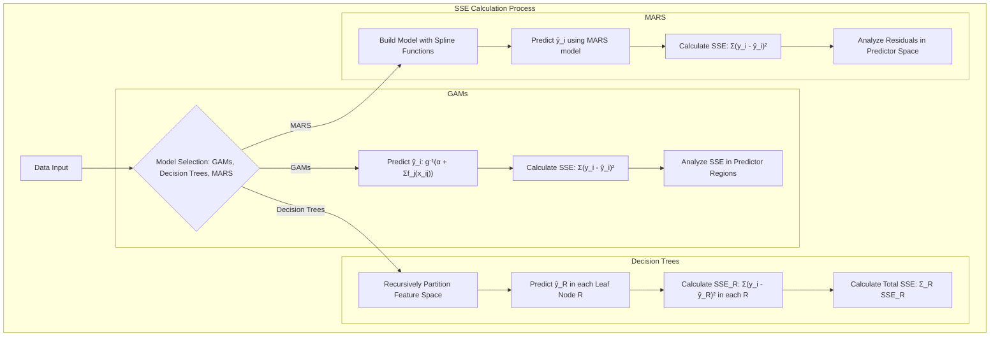
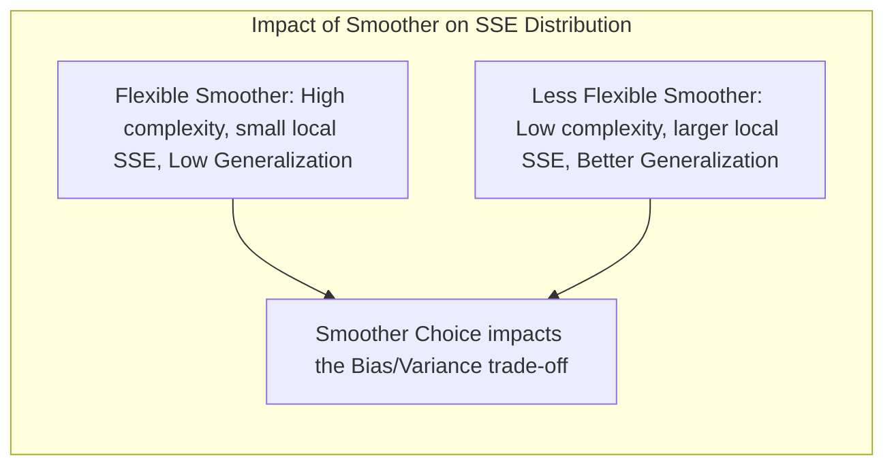
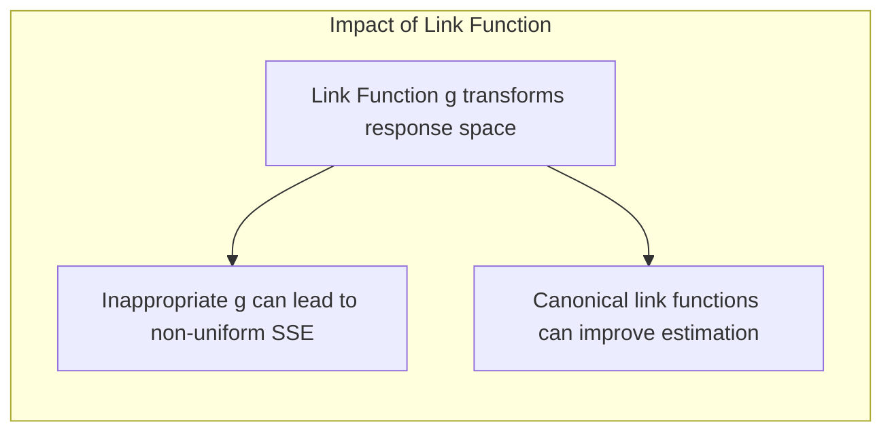

## Título: Modelos Aditivos, Árvores e Métodos Relacionados: Análise da Soma dos Quadrados dos Resíduos nas Regiões Resultantes

### Introdução

Este capítulo explora o conceito da soma dos quadrados dos resíduos (SSE) em modelos de aprendizado supervisionado, com foco em como o SSE é calculado e distribuído nas regiões resultantes da aplicação de Modelos Aditivos Generalizados (GAMs), árvores de decisão e Multivariate Adaptive Regression Splines (MARS) [^9.1]. A avaliação do SSE nas regiões resultantes permite uma compreensão mais detalhada sobre como o modelo se ajusta aos dados em diferentes partes do espaço de características. O objetivo principal deste capítulo é detalhar o processo de cálculo do SSE em diferentes modelos, como a estrutura de modelagem afeta a distribuição do SSE nas regiões e como a análise dos resíduos pode ser utilizada para melhorar a qualidade do ajuste. O foco principal está em apresentar as bases teóricas e práticas para uma avaliação mais completa do ajuste dos modelos de aprendizado supervisionado e as suas propriedades.

### Conceitos Fundamentais

**Conceito 1: A Soma dos Quadrados dos Resíduos (SSE)**

A soma dos quadrados dos resíduos (Sum of Squared Errors - SSE) é uma métrica que quantifica o erro de um modelo, e é dada pela soma dos quadrados das diferenças entre os valores observados e os valores preditos:
$$
\text{SSE} = \sum_{i=1}^N (y_i - \hat{y}_i)^2
$$
onde $y_i$ são os valores observados da variável resposta, $\hat{y}_i$ são os valores preditos pelo modelo, e $N$ é o número de observações. O SSE representa o erro total do modelo, e a sua minimização é o objetivo de muitos algoritmos de otimização. O SSE fornece uma medida geral de ajuste, e a sua decomposição em diferentes regiões permite analisar o ajuste do modelo em diferentes partes do espaço de características. O SSE pode ser utilizado para avaliar diferentes modelos, e comparar as suas capacidades de ajuste.

> 💡 **Exemplo Numérico:**
> Suponha que temos um conjunto de dados com 5 observações, onde os valores observados de $y_i$ são [3, 5, 7, 8, 10] e os valores preditos $\hat{y}_i$ pelo modelo são [2.5, 5.2, 6.8, 9, 9.5]. O cálculo do SSE seria:
>
> $\text{SSE} = (3-2.5)^2 + (5-5.2)^2 + (7-6.8)^2 + (8-9)^2 + (10-9.5)^2$
>
> $\text{SSE} = 0.25 + 0.04 + 0.04 + 1 + 0.25$
>
> $\text{SSE} = 1.58$
>
> Este valor de SSE representa o erro total do modelo para este conjunto de dados. Um valor menor de SSE indicaria um melhor ajuste do modelo.

**Lemma 1:** *A soma dos quadrados dos resíduos (SSE) quantifica a diferença entre os valores observados e os valores preditos por um modelo, e a sua minimização é um objetivo comum na modelagem estatística. A decomposição do SSE em diferentes regiões permite analisar o ajuste do modelo em diferentes partes do espaço de características*. O SSE é a base de muitos modelos lineares, e a sua análise é importante para avaliar o desempenho de modelos estatísticos [^4.3.2].

**Conceito 2: SSE em Modelos Aditivos Generalizados (GAMs)**

Em modelos aditivos generalizados (GAMs), a soma dos quadrados dos resíduos (SSE) é calculada utilizando a função de ligação $g$, o intercepto $\alpha$ e as funções não paramétricas $f_j(X_j)$:
$$
\text{SSE} = \sum_{i=1}^N (y_i - g^{-1}(\alpha + \sum_{j=1}^p f_j(x_{ij})))^2
$$
onde $y_i$ são os valores observados, e $g^{-1}(\alpha + \sum_{j=1}^p f_j(x_{ij}))$ são as predições do modelo, onde a função inversa $g^{-1}$ transforma o *predictor* linear em valores de resposta. A escolha da função de ligação e a forma das funções $f_j$ influenciam o SSE total do modelo e a forma como o erro é distribuído no espaço de características. O SSE pode ser analisado como a soma do erro local dentro de diferentes regiões do espaço dos preditores e, em modelos aditivos, é possível avaliar o impacto de cada preditor no SSE total. A distribuição do SSE nas regiões do espaço dos preditores é um indicador de como o modelo captura as não linearidades, e como o modelo lida com diferentes tipos de dados e padrões nos preditores.

> 💡 **Exemplo Numérico:**
>
> Considere um GAM com um preditor $X$ e uma função de ligação identidade $g(y) = y$. O modelo é dado por $\hat{y}_i = \alpha + f(x_i)$, onde $\alpha$ é o intercepto e $f(x)$ é uma função não paramétrica. Suponha que $\alpha = 1$ e que a função $f(x)$ seja estimada por um spline cúbico.
>
> **Dados:**
>
> | $x_i$ | $y_i$ |
> |-------|-------|
> | 1     | 2     |
> | 2     | 4     |
> | 3     | 6     |
> | 4     | 5     |
> | 5     | 7     |
>
> **Estimativa do modelo:**
> Suponha que após ajustar o modelo, obtivemos as seguintes predições:
>
> | $x_i$ | $\hat{y}_i$ |
> |-------|------------|
> | 1     | 2.1        |
> | 2     | 3.8        |
> | 3     | 5.9        |
> | 4     | 5.2        |
> | 5     | 7.1        |
>
> **Cálculo do SSE:**
>
> $\text{SSE} = (2-2.1)^2 + (4-3.8)^2 + (6-5.9)^2 + (5-5.2)^2 + (7-7.1)^2$
>
> $\text{SSE} = 0.01 + 0.04 + 0.01 + 0.04 + 0.01 = 0.11$
>
> O valor do SSE indica o erro total do modelo. A análise dos resíduos $y_i - \hat{y}_i$ pode revelar se o ajuste é bom em toda a faixa de valores de $x$.

**Corolário 1:** *A análise do SSE em modelos GAMs permite avaliar a qualidade do ajuste do modelo e como as funções não paramétricas são utilizadas para modelar a relação entre os preditores e a resposta. A escolha da função de ligação e dos suavizadores influencia a distribuição do SSE no espaço de características, e a forma como o modelo se adapta aos dados*. A interpretação da distribuição do SSE e da sua relação com as funções $f_j$ é importante para a avaliação da qualidade do modelo [^4.3.3].

**Conceito 3: SSE em Árvores de Decisão e MARS**

*   **Árvores de Decisão:** Em árvores de decisão, o SSE é calculado em cada nó da árvore e a escolha do preditor e ponto de corte que minimizam a soma dos SSE dos nós filhos. As árvores de decisão dividem o espaço de características em regiões, e o SSE em cada região é dado por:
     $$
        \text{SSE}_R =  \sum_{x_i \in R} (y_i - \hat{y}_R)^2
    $$
    onde $R$ representa uma região da árvore, $y_i$ são as respostas e $\hat{y}_R$ são as predições do modelo naquela região. O SSE total é a soma do SSE em cada nó folha da árvore. A análise do SSE nas regiões permite entender o comportamento do modelo em diferentes partes do espaço de características.

> 💡 **Exemplo Numérico:**
>
> Considere uma árvore de decisão com uma divisão no preditor $X$ em um ponto de corte $c$. Temos duas regiões: $R_1$ onde $X \leq c$ e $R_2$ onde $X > c$.
>
> **Dados:**
>
> | $x_i$ | $y_i$ |
> |-------|-------|
> | 1     | 2     |
> | 2     | 3     |
> | 3     | 5     |
> | 4     | 6     |
> | 5     | 8     |
>
> Suponha que a árvore dividiu os dados em $R_1$ com $x \leq 3$ e $R_2$ com $x > 3$.
>
> **Região 1 ($R_1$):**
>  Dados: $x_i$ = [1, 2, 3], $y_i$ = [2, 3, 5]
>  Predição: $\hat{y}_{R_1} = (2+3+5)/3 = 3.33$
>  $\text{SSE}_{R_1} = (2-3.33)^2 + (3-3.33)^2 + (5-3.33)^2 = 1.78 + 0.11 + 2.78 = 4.67$
>
> **Região 2 ($R_2$):**
>  Dados: $x_i$ = [4, 5], $y_i$ = [6, 8]
>  Predição: $\hat{y}_{R_2} = (6+8)/2 = 7$
>  $\text{SSE}_{R_2} = (6-7)^2 + (8-7)^2 = 1 + 1 = 2$
>
> **SSE Total:**
> $\text{SSE} = \text{SSE}_{R_1} + \text{SSE}_{R_2} = 4.67 + 2 = 6.67$
>
> A análise do SSE em cada região ajuda a entender o ajuste da árvore em diferentes partes do espaço de características.

*   **Multivariate Adaptive Regression Splines (MARS):** Em MARS, o SSE é utilizado na escolha dos termos da *spline*. MARS utiliza um método *forward stagewise* e o SSE é utilizado como critério para escolher os termos que mais diminuem a soma dos erros quadráticos. O SSE é calculado para todo o espaço de características, mas as decisões de escolha dos termos *spline* são guiadas pela análise do efeito local desses termos na redução do SSE.

> 💡 **Exemplo Numérico:**
>
> Em MARS, considere um modelo com duas funções de base (basis functions): $h_1(x) = \max(0, x-c_1)$ e $h_2(x) = \max(0, c_2 - x)$, onde $c_1$ e $c_2$ são nós. O modelo é dado por:
>
> $\hat{y}_i = \beta_0 + \beta_1 h_1(x_i) + \beta_2 h_2(x_i)$
>
> **Dados:**
>
> | $x_i$ | $y_i$ |
> |-------|-------|
> | 1     | 2     |
> | 2     | 4     |
> | 3     | 6     |
> | 4     | 5     |
> | 5     | 7     |
>
> Suponha que $c_1 = 2$ e $c_2 = 4$, e que após a estimação, os coeficientes sejam: $\beta_0 = 1$, $\beta_1 = 1.5$, $\beta_2 = -0.5$.
>
> **Cálculo das predições e do SSE:**
>
> | $x_i$ | $h_1(x_i)$ | $h_2(x_i)$ | $\hat{y}_i$ | $y_i - \hat{y}_i$ |
> |-------|------------|------------|------------|-----------------|
> | 1     | 0          | 3          | 1 - 1.5 = -0.5          | 2.5 |
> | 2     | 0          | 2          | 1 - 1 = 0         | 4 |
> | 3     | 1          | 1          | 1 + 1.5 - 0.5 = 2         | 4 |
> | 4     | 2          | 0          | 1 + 3 = 4        | 1 |
> | 5     | 3          | 0          | 1 + 4.5 = 5.5         | 1.5 |
>
> $\text{SSE} = 2.5^2 + 4^2 + 4^2 + 1^2 + 1.5^2 = 6.25 + 16 + 16 + 1 + 2.25 = 41.5$
>
> A análise do SSE é utilizada para guiar a seleção das funções de base e seus coeficientes, buscando minimizar o erro total do modelo.

> ⚠️ **Nota Importante:** A análise do SSE em diferentes regiões do espaço de características permite avaliar a qualidade do ajuste do modelo localmente, e identificar regiões com mau ajuste. A análise dos resíduos, é crucial para uma avaliação mais detalhada da capacidade dos modelos [^4.5].

> ❗ **Ponto de Atenção:**  O SSE, por si só, não é suficiente para avaliar a capacidade de generalização de um modelo, e outras métricas, como a validação cruzada e a análise de resíduos, são importantes para uma avaliação mais completa do desempenho do modelo.  A análise do SSE deve ser combinada com outras medidas de qualidade do modelo [^4.5.1], [^4.5.2].

> ✔️ **Destaque:**  A distribuição da soma dos erros quadráticos nos modelos GAMs, árvores de decisão e MARS é um componente fundamental da análise da qualidade do ajuste e da capacidade de generalização dos modelos. A decomposição do SSE em diferentes regiões é uma ferramenta útil na análise de dados e na escolha do modelo adequado para um determinado problema [^4.3.3].

### Detalhes do Cálculo do SSE em Modelos Aditivos Generalizados e Técnicas Relacionadas

**Explicação:** Este diagrama detalha o processo de cálculo da soma dos quadrados dos resíduos (SSE) em diferentes modelos, e como cada modelo divide o espaço de características para calcular o SSE, conforme os tópicos [^4.3.1], [^4.3.2], [^4.5].

O cálculo do SSE em diferentes modelos de aprendizado supervisionado é apresentado a seguir:

1.  **Modelos Aditivos Generalizados (GAMs):** Em modelos GAMs, o SSE é calculado através dos seguintes passos:
    *   As predições para cada observação são obtidas utilizando a função de ligação $g$ e as funções não paramétricas $f_j$:
    $$
    \hat{y}_i = g^{-1}(\alpha + \sum_{j=1}^p f_j(x_{ij}))
    $$

    * O SSE total é calculado através da soma dos erros quadráticos:
     $$
    \text{SSE} = \sum_{i=1}^N (y_i - \hat{y}_i)^2
    $$
    * A análise do SSE em diferentes regiões do espaço dos preditores pode ser feita através da avaliação dos resíduos localmente.
2.   **Árvores de Decisão:** Em árvores de decisão, o SSE é calculado através da seguinte abordagem:
     * O espaço de características é dividido recursivamente em regiões.
     * Em cada região, a predição do modelo é a média das respostas na região:
     $$
     \hat{y}_R = \frac{1}{N_R} \sum_{x_i \in R} y_i
     $$
      onde $N_R$ é o número de observações na região $R$.
      *   O SSE total é calculado através da soma dos SSEs em cada região:
    $$
        \text{SSE} = \sum_{R} \sum_{x_i \in R} (y_i - \hat{y}_R)^2
      $$
     Onde a primeira soma é feita sobre todas as regiões ou nós folhas da árvore.

3.  **Multivariate Adaptive Regression Splines (MARS):** Em MARS, o SSE é calculado utilizando o modelo resultante da combinação de funções *spline*, e a soma dos erros quadráticos é calculada de maneira similar aos modelos GAMs.
      * As predições do modelo MARS são calculadas para cada observação utilizando a combinação das funções *spline* e seus coeficientes:
      $$
      \hat{y}_i = \hat{\beta}_0 +  \sum_{m=1}^M \hat{\beta}_m h_m(x_i)
      $$

       * O SSE total é calculado através da soma dos erros quadráticos:

    $$
     \text{SSE} = \sum_{i=1}^N (y_i - \hat{y}_i)^2
     $$

A escolha do modelo, e da sua forma de particionar os dados e gerar os valores preditos, influencia na distribuição do SSE nos dados. O uso da função de ligação em GAMs também transforma a escala da variável resposta e como o SSE é medido.

**Lemma 4:** *A soma dos quadrados dos resíduos (SSE) é calculada como a soma dos erros quadráticos entre os valores preditos e os valores observados, e sua decomposição em diferentes regiões permite avaliar a capacidade de ajuste dos modelos localmente. O cálculo do SSE depende do modelo, do tipo de variável resposta e da escolha do suavizador em cada método.* [^4.3.1].

###  A Distribuição do SSE e a Relação com a Qualidade do Modelo

A distribuição da soma dos quadrados dos resíduos (SSE) nas diferentes regiões do espaço de características pode fornecer *insights* importantes sobre a qualidade do ajuste do modelo. A presença de grandes valores do SSE em certas regiões indica que o modelo tem dificuldade em modelar as características dos dados naquela região. A distribuição dos resíduos pode ser analisada para verificar se o modelo está enviesado ou se há falta de ajuste em determinadas áreas do espaço de características.

Modelos que têm um SSE distribuído de forma mais uniforme no espaço de características tendem a ter um melhor desempenho em novos dados, pois indica que o modelo consegue capturar os padrões nos dados de forma mais geral.  Modelos que têm um SSE concentrado em poucas regiões podem ter um desempenho ruim em novos dados, pois podem ter ajustado o ruído presente nos dados de treino, com overfitting, e uma baixa capacidade de generalização.

### Limitações da Avaliação Baseada no SSE

A avaliação do modelo baseada no SSE, por si só, pode ser insuficiente para garantir a qualidade e capacidade de generalização do modelo. A avaliação deve ser combinada com outras métricas, como a sensibilidade, especificidade, *cross-validation* e a análise dos resíduos. O SSE é uma métrica importante, mas outros componentes como o viés e a variância também devem ser considerados na escolha do modelo adequado. O uso do conceito de deviance também fornece uma forma de analisar a qualidade do modelo quando a distribuição da variável resposta não é Gaussiana, e utiliza a função de *log-likelihood* e uma comparação com o modelo saturado.

### Perguntas Teóricas Avançadas: Como a escolha do suavizador e da função de ligação afeta a distribuição do SSE nas regiões resultantes em modelos aditivos generalizados e quais as implicações nas propriedades estatísticas dos estimadores e na capacidade de generalização dos modelos?

**Resposta:**

A escolha do suavizador e da função de ligação tem um impacto significativo na distribuição do SSE nas regiões resultantes em modelos aditivos generalizados (GAMs), e como essa distribuição se relaciona com as propriedades estatísticas dos estimadores e a capacidade de generalização dos modelos.

O suavizador controla a forma como a função $f_j(X_j)$ se ajusta aos dados, e a escolha do suavizador influencia a distribuição do SSE no espaço de características. Suavizadores mais flexíveis, como *kernels* com parâmetros de largura menores ou *splines* com mais nós, permitem que a função $f_j(X_j)$ se ajuste aos dados de treino com maior precisão, o que resulta em menor SSE local, mas pode levar a um modelo com menor capacidade de generalização. Suavizadores menos flexíveis, como *splines* com poucos nós ou *kernels* com parâmetros de largura maiores, resultam em funções mais suaves, que podem ter maior bias, e a sua capacidade de modelar não linearidades é reduzida, mas, podem levar a um modelo com melhor capacidade de generalização. A escolha do suavizador, portanto, afeta o *trade-off* entre bias e variância do modelo.

A escolha da função de ligação $g$ afeta a escala da variável resposta e, consequentemente, como o SSE é distribuído. Funções de ligação não lineares, como a função *logit* na regressão logística, transformam o espaço da variável resposta, e o SSE é medido nesse espaço transformado. A utilização de uma função de ligação inadequada pode levar a uma distribuição não uniforme do SSE nas regiões do espaço de características, o que afeta o ajuste do modelo. Funções de ligação canônicas, derivadas da família exponencial, simplificam o processo de estimação e levam a estimadores com boas propriedades estatísticas, e que podem gerar distribuições do SSE mais adequadas aos dados.

A escolha da função de ligação e do suavizador afeta as propriedades estatísticas dos estimadores. A escolha adequada da função de ligação, juntamente com o suavizador e com seus parâmetros de regularização, garante que o modelo tenha um bom desempenho, baixa variância e baixo *bias*.  O uso de métodos de validação cruzada é uma abordagem fundamental para a escolha adequada dos parâmetros de suavização e das funções de ligação.

**Lemma 5:** *A distribuição do SSE nas regiões resultantes é afetada pela escolha do suavizador e da função de ligação. A escolha adequada desses componentes permite que os modelos GAMs se adaptem aos dados, e tenham um bom balanço entre a flexibilidade e a capacidade de generalização, onde a escolha do parâmetro de suavização e da função de ligação impactam diretamente a capacidade de modelagem do modelo*. As propriedades do suavizador e da função de ligação afetam a distribuição dos resíduos e a capacidade do modelo de capturar os padrões nos dados [^4.3.3].

**Corolário 5:** *A escolha adequada do suavizador e da função de ligação é crucial para que o modelo tenha um bom ajuste e também para que tenha uma boa capacidade de generalização. A distribuição do SSE nas diferentes regiões pode ser utilizada para analisar a adequação do modelo e as decisões tomadas durante a construção do modelo*.  A escolha do suavizador, da função de ligação e do parâmetro de suavização afeta a capacidade de modelagem dos dados e de obter um balanço entre *bias* e variância [^4.4].

> ⚠️ **Ponto Crucial**: A escolha do suavizador, da função de ligação, e dos parâmetros de regularização afeta diretamente o desempenho do modelo, e a sua distribuição do SSE nas diferentes regiões do espaço de características. O conhecimento das propriedades desses componentes é essencial para a construção de modelos robustos e eficazes e o uso de validação cruzada e outras abordagens pode auxiliar na escolha desses componentes [^4.5.2].

### Conclusão

Este capítulo explorou o cálculo da soma dos quadrados dos resíduos (SSE) em modelos de aprendizado supervisionado, e como o SSE é distribuído em regiões do espaço de características em GAMs, árvores de decisão e MARS.  A análise da distribuição do SSE permite compreender melhor o comportamento dos modelos, e como as escolhas de suavizadores, funções de ligação, e métodos de regularização afetam o ajuste do modelo.  O capítulo enfatizou como a análise do SSE e de seus componentes pode levar à construção de modelos mais precisos e com maior capacidade de generalização.

### Footnotes

[^4.1]: "In this chapter we begin our discussion of some specific methods for super-vised learning. These techniques each assume a (different) structured form for the unknown regression function, and by doing so they finesse the curse of dimensionality. Of course, they pay the possible price of misspecifying the model, and so in each case there is a tradeoff that has to be made." *(Trecho de "Additive Models, Trees, and Related Methods")*

[^4.2]: "Regression models play an important role in many data analyses, providing prediction and classification rules, and data analytic tools for understand-ing the importance of different inputs." *(Trecho de "Additive Models, Trees, and Related Methods")*

[^4.3]: "In this section we describe a modular algorithm for fitting additive models and their generalizations. The building block is the scatterplot smoother for fitting nonlinear effects in a flexible way. For concreteness we use as our scatterplot smoother the cubic smoothing spline described in Chapter 5." *(Trecho de "Additive Models, Trees, and Related Methods")*

[^4.3.1]:  "The additive model has the form $Y = \alpha + \sum_{j=1}^p f_j(X_j) + \varepsilon$, where the error term $\varepsilon$ has mean zero." * (Trecho de "Additive Models, Trees, and Related Methods")*

[^4.3.2]:   "Given observations $x_i, y_i$, a criterion like the penalized sum of squares (5.9) of Section 5.4 can be specified for this problem, $PRSS(\alpha, f_1, f_2,..., f_p) = \sum_i^N (y_i - \alpha - \sum_j^p f_j(x_{ij}))^2 + \sum_j^p \lambda_j \int(f_j''(t_j))^2 dt_j$" * (Trecho de "Additive Models, Trees, and Related Methods")*

[^4.3.3]: "where the $\lambda_j > 0$ are tuning parameters. It can be shown that the minimizer of (9.7) is an additive cubic spline model; each of the functions $f_j$ is a cubic spline in the component $X_j$, with knots at each of the unique values of $x_{ij}$, $i = 1,..., N$." *(Trecho de "Additive Models, Trees, and Related Methods")*

[^4.4]: "For two-class classification, recall the logistic regression model for binary data discussed in Section 4.4. We relate the mean of the binary response $\mu(X) = Pr(Y = 1|X)$ to the predictors via a linear regression model and the logit link function:  $log(\mu(X)/(1 – \mu(X)) = \alpha + \beta_1 X_1 + \ldots + \beta_pX_p$." * (Trecho de "Additive Models, Trees, and Related Methods")*

[^4.4.1]: "The additive logistic regression model replaces each linear term by a more general functional form: $log(\mu(X)/(1 – \mu(X))) = \alpha + f_1(X_1) + \cdots + f_p(X_p)$, where again each $f_j$ is an unspecified smooth function." * (Trecho de "Additive Models, Trees, and Related Methods")*

[^4.4.2]: "While the non-parametric form for the functions $f_j$ makes the model more flexible, the additivity is retained and allows us to interpret the model in much the same way as before. The additive logistic regression model is an example of a generalized additive model." *(Trecho de "Additive Models, Trees, and Related Methods")*

[^4.4.3]: "In general, the conditional mean $\mu(X)$ of a response $Y$ is related to an additive function of the predictors via a link function $g$:  $g[\mu(X)] = \alpha + f_1(X_1) + \cdots + f_p(X_p)$." *(Trecho de "Additive Models, Trees, and Related Methods")*

[^4.4.4]:  "Examples of classical link functions are the following: $g(\mu) = \mu$ is the identity link, used for linear and additive models for Gaussian response data." *(Trecho de "Additive Models, Trees, and Related Methods")*

[^4.4.5]: "$g(\mu) = logit(\mu)$ as above, or $g(\mu) = probit(\mu)$, the probit link function, for modeling binomial probabilities. The probit function is the inverse Gaussian cumulative distribution function: $probit(\mu) = \Phi^{-1}(\mu)$." *(Trecho de "Additive Models, Trees, and Related Methods")*

[^4.5]: "All three of these arise from exponential family sampling models, which in addition include the gamma and negative-binomial distributions. These families generate the well-known class of generalized linear models, which are all extended in the same way to generalized additive models." *(Trecho de "Additive Models, Trees, and Related Methods")*

[^4.5.1]: "The functions $f_j$ are estimated in a flexible manner, using an algorithm whose basic building block is a scatterplot smoother. The estimated func-tion $f_j$ can then reveal possible nonlinearities in the effect of $X_j$. Not all of the functions $f_j$ need to be nonlinear." *(Trecho de "Additive Models, Trees, and Related Methods")*

[^4.5.2]: "We can easily mix in linear and other parametric forms with the nonlinear terms, a necessity when some of the inputs are qualitative variables (factors)." *(Trecho de "Additive Models, Trees, and Related Methods")*
