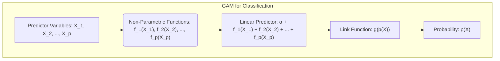
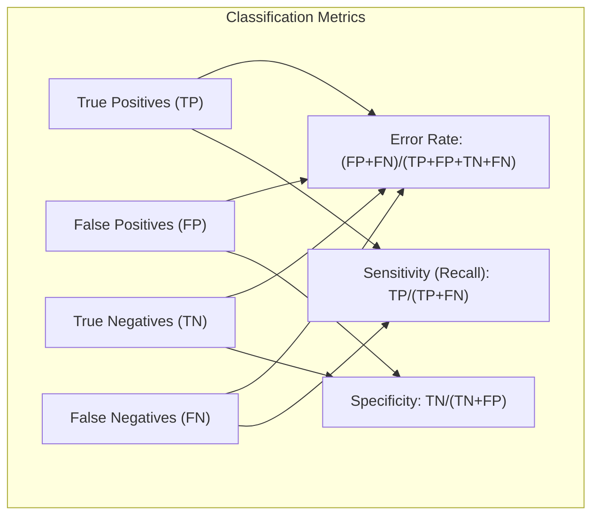

## Título: Modelos Aditivos Generalizados, Árvores e Métodos Relacionados: Extensão para Classificação com Métricas de Impureza e Modelagem Probabilística

```mermaid
flowchart TD
    subgraph "Supervised Learning Extension for Classification"
       A["Input Data: Features (X), Categorical Response (Y)"] --> B{Model Selection: "GAMs", "Decision Trees", "MARS"}
       subgraph "Decision Trees"
        B -- "Decision Trees" --> C["Impurity Metrics: 'Error', 'Gini', 'Entropy'"]
        C --> D["Recursive Partitioning: Feature space using Impurity Measures"]
        D --> E["Node Optimization: Reduce Impurity"]
       end
        subgraph "Generalized Additive Models (GAMs)"
        B -- "GAMs" --> F["Probabilistic Modeling: Link Function (e.g., logit, softmax)"]
        F --> G["Non-Parametric Functions: f_1(X_1) + ... + f_p(X_p)"]
        G --> H["Parameter Estimation: Maximum Likelihood"]
        end
        H --> I["Model Evaluation: Classification Error, Sensitivity, Specificity"]
        E --> I
    end
```

### Introdução

Este capítulo explora a extensão de modelos de aprendizado supervisionado para problemas de classificação, abordando o uso de métricas de impureza, como o erro de classificação, o índice de Gini e a entropia, para avaliar e guiar o processo de otimização em modelos como árvores de decisão e Multivariate Adaptive Regression Splines (MARS). O capítulo também descreve como Modelos Aditivos Generalizados (GAMs) são adaptados para problemas de classificação binária ou multiclasse através da modelagem de probabilidades com função de ligação. O objetivo principal deste capítulo é apresentar as bases teóricas e práticas sobre como esses modelos podem ser utilizados para problemas de classificação, como as métricas de impureza e modelagem de probabilidades são utilizadas, como a capacidade preditiva é avaliada, e como essas abordagens se relacionam com o problema de classificação supervisionada.

### Conceitos Fundamentais

**Conceito 1: Métrica de Impureza para Classificação**

Em problemas de classificação, a métrica de impureza de um nó em árvores de decisão ou a função de custo em outros modelos de classificação são utilizadas para avaliar a homogeneidade das classes dentro do nó ou o quão bem o modelo se ajusta às classes. Um nó com impureza zero contém apenas observações de uma única classe, enquanto que nós com alta impureza contém uma mistura de observações de classes diferentes. Métricas de impureza são utilizadas para guiar a construção da árvore de decisão e para otimizar o modelo de classificação, sendo o objetivo principal a minimização da impureza ou do custo em cada passo da modelagem.

**Lemma 1:** *Métricas de impureza, como o erro de classificação, índice de Gini, e entropia, são utilizadas para quantificar a heterogeneidade de um nó em árvores de decisão e outros modelos. A minimização da impureza dos nós é um objetivo comum na modelagem de problemas de classificação* [^4.5].

**Conceito 2: Métricas de Impureza para Classificação Binária e Multiclasse**

As métricas de impureza mais comuns utilizadas em problemas de classificação incluem:

*   **Erro de Classificação:** Para um nó $m$, a métrica é dada por:
    $$
    \text{Erro de Classificação}_m = 1 - \hat{p}_{mk(m)}
    $$
   onde $\hat{p}_{mk(m)}$ é a proporção da classe majoritária $k(m)$ no nó $m$. O erro de classificação mede a proporção de observações classificadas incorretamente no nó.

> 💡 **Exemplo Numérico:** Considere um nó em uma árvore de decisão com 100 observações, onde 60 pertencem à classe A e 40 à classe B. A classe majoritária é A, com $\hat{p}_{mA} = 60/100 = 0.6$. Portanto, o erro de classificação para este nó é $1 - 0.6 = 0.4$, indicando que 40% das observações estão classificadas incorretamente se atribuirmos todas as observações à classe majoritária.

*   **Índice de Gini:** Para um nó $m$ e múltiplas classes, o índice de Gini é dado por:
$$
\text{Gini}_m = \sum_{k \neq k'} \hat{p}_{mk} \hat{p}_{mk'} =  \sum_{k=1}^K  \hat{p}_{mk} (1-\hat{p}_{mk})
$$
onde $\hat{p}_{mk}$ é a proporção da classe $k$ no nó $m$. O índice de Gini mede a probabilidade de classificar incorretamente uma observação escolhida aleatoriamente do nó.

> 💡 **Exemplo Numérico:**  Usando o mesmo nó com 60 observações da classe A e 40 da classe B, o índice de Gini é calculado como:
> $\text{Gini}_m = \hat{p}_{mA}(1-\hat{p}_{mA}) + \hat{p}_{mB}(1-\hat{p}_{mB}) = 0.6(1-0.6) + 0.4(1-0.4) = 0.24 + 0.24 = 0.48$.
> Um Gini de 0 indica que todas as observações pertencem a mesma classe (nó puro), enquanto um Gini de 0.5 indica máxima impureza em problemas binários.

*   **Entropia (Cross-Entropia ou Deviance):** Para um nó $m$ e múltiplas classes, a entropia é dada por:
 $$
 \text{Entropia}_m = -\sum_{k=1}^K \hat{p}_{mk} \log(\hat{p}_{mk})
 $$
onde $\hat{p}_{mk}$ é a proporção da classe $k$ no nó $m$. A entropia mede a incerteza ou aleatoriedade da distribuição de classes.

> 💡 **Exemplo Numérico:**  Para o mesmo nó, a entropia é calculada como:
> $\text{Entropia}_m = - (0.6 \log(0.6) + 0.4 \log(0.4)) \approx - (0.6 \times -0.51 + 0.4 \times -0.92) \approx 0.306 + 0.368 \approx 0.674$.
> A entropia é 0 quando todas as observações pertencem à mesma classe e é máxima quando as classes são igualmente distribuídas.

A escolha da métrica de impureza influencia o processo de construção da árvore de decisão ou a otimização de outros modelos, embora as métricas de Gini e entropia geralmente levem a resultados similares na prática.

**Corolário 1:** *O erro de classificação, o índice de Gini e a entropia são métricas que buscam quantificar a heterogeneidade das classes em um nó, e cada métrica tem a sua forma específica de quantificar a impureza, mas todas buscam minimizar a impureza e criar partições com alta homogeneidade*. A escolha da métrica de impureza é importante para o processo de construção da árvore, mesmo que as métricas levem a resultados similares [^4.5.1].

**Conceito 3: Modelos Aditivos Generalizados (GAMs) para Classificação**

GAMs podem ser utilizados para modelar a probabilidade de uma observação pertencer a uma classe através da utilização da função de ligação $g$ e funções não paramétricas para cada preditor:



$$
g(p(X)) = \alpha + f_1(X_1) + f_2(X_2) + \ldots + f_p(X_p)
$$

onde $p(X)$ é a probabilidade de uma observação pertencer a uma classe específica, e $g$ é a função de ligação. Para modelos de classificação binária, a função *logit* ou *probit* são comumente utilizadas como funções de ligação. Para problemas multiclasse, a função *softmax* ou modelos *multilogit* podem ser utilizados. GAMs para classificação utilizam o método da máxima verossimilhança para estimar os parâmetros, e as estimativas das funções não paramétricas são obtidas utilizando o algoritmo de backfitting com suavização. O uso da função de ligação, e o método da máxima verossimilhança, permite que modelos com distribuições da família exponencial sejam utilizados em problemas de classificação.

> ⚠️ **Nota Importante:** Modelos GAMs, quando adaptados para classificação, modelam a probabilidade da resposta utilizando funções de ligação, e podem ser utilizados em problemas de classificação binária e multiclasse. O uso da função de ligação é um componente fundamental para lidar com problemas de classificação. A escolha da função de ligação deve considerar a natureza da variável resposta [^4.4.1], [^4.4.2], [^4.4.3].

> ❗ **Ponto de Atenção:** A aplicação de modelos GAMs a problemas de classificação requer atenção especial com a escolha da função de ligação, a utilização de métodos de suavização adequados e com métodos de regularização, para obter modelos com boa capacidade de generalização e que evitem overfitting [^4.4.4], [^4.4.5].

> ✔️ **Destaque:** Modelos GAMs, quando utilizados em problemas de classificação, combinam a flexibilidade de funções não paramétricas, a modelagem de probabilidades e a utilização da função de ligação, e oferecem modelos robustos e interpretáveis para problemas de classificação [^4.5].

### Modelagem de Respostas Categóricas com Modelos de Classificação: Detalhes da Formulação e Otimização

```mermaid
flowchart TB
    subgraph "Modeling Categorical Responses"
        direction TB
        A["Input Data: (X, Y_categorical)"] --> B{Model Choice: "Decision Tree" or "GAM"}
        subgraph "Decision Tree Approach"
            B -- "Decision Tree" --> C["Recursive Partitioning: using Impurity Metric"]
             C --> D["Impurity Calculation: Gini or Entropy"]
               D --> E["Split Optimization: Reduce impurity in child nodes"]
             E --> F["Tree Pruning: to avoid overfitting"]
        end
        subgraph "GAM Approach"
              B -- "GAM" --> G["Link Function: g(p(X)) for probability modeling"]
             G --> H["Optimization: Maximum Likelihood or Backfitting"]
              H --> I["Model Evaluation: Using classification metrics"]
        end
       I --> J["Final Model: Selection Based on Performance"]
       F --> J
    end
```

**Explicação:** Este diagrama detalha o processo de modelagem de respostas categóricas usando modelos de classificação, com foco em árvores de decisão e GAMs, e mostra como os algoritmos de otimização e avaliação de desempenho são utilizados, conforme os tópicos [^4.5.1], [^4.5.2], [^4.4.1].

A modelagem de respostas categóricas envolve a escolha de um modelo apropriado, a sua formulação matemática e a utilização de métricas de desempenho.

1.  **Árvores de Decisão:** Em árvores de decisão, a modelagem de respostas categóricas é feita da seguinte forma:
    *   O espaço de características é dividido recursivamente utilizando um critério de impureza, como Gini ou entropia. A cada nó, o algoritmo de varredura busca o preditor e o ponto de corte que minimizem a impureza nos nós filhos.
    *   A impureza em cada nó é calculada utilizando o índice de Gini ou a entropia para modelar a heterogeneidade dos nós:
        $$
           \text{Gini}_m = \sum_{k=1}^K \hat{p}_{mk} (1-\hat{p}_{mk}) \text{ ou } \text{Entropia}_m = -\sum_{k=1}^K \hat{p}_{mk} \log(\hat{p}_{mk})
        $$
    *   A escolha do melhor preditor e ponto de corte é feita de forma gulosa, buscando a redução máxima da impureza do nó.
    *   O processo de *pruning* é utilizado para evitar o overfitting e para obter uma árvore com boa capacidade de generalização.

> 💡 **Exemplo Numérico:** Suponha que em um nó da árvore, temos dois preditores $X_1$ e $X_2$ e duas classes A e B. Para o preditor $X_1$, o algoritmo avalia um ponto de corte, digamos $c_1$, que divide as observações em dois nós filhos. No primeiro nó filho, temos 30 observações da classe A e 10 da classe B. No segundo nó filho, temos 10 observações da classe A e 50 da classe B. A impureza de cada nó filho é calculada usando Gini ou Entropia. Por exemplo, se usarmos Gini, o nó 1 terá um Gini de $2*(30/40)*(10/40) = 0.375$ e o nó 2 terá um Gini de $2*(10/60)*(50/60) \approx 0.278$. O algoritmo repetirá esse processo para outros pontos de corte e outros preditores e escolherá a divisão que resulta na menor impureza ponderada dos nós filhos.

2. **Modelos Aditivos Generalizados (GAMs) para Classificação:** Em GAMs, a modelagem de respostas categóricas é feita através de:
     *   A modelagem da probabilidade de cada classe utilizando uma função de ligação apropriada. A função *logit* é utilizada em problemas de classificação binária e a função *softmax* é utilizada em problemas de classificação multiclasse.

       $$
        \text{logit}(p_k(X)) = \log\frac{p_k(X)}{1-p_k(X)} = \alpha_k + f_{1k}(X_1) + f_{2k}(X_2) + \ldots + f_{pk}(X_p)
        $$

        onde $p_k(X)$ é a probabilidade da observação pertencer à classe k, e $f_{jk}$ são as funções não paramétricas específicas da classe $k$.
     *   A estimação dos parâmetros do modelo é feita através da maximização da *log-likelihood* e do algoritmo de backfitting para estimar as funções $f_{jk}$.
     * A avaliação da capacidade preditiva do modelo é feita utilizando métricas de classificação apropriadas, como o erro de classificação, a sensibilidade e a especificidade.

> 💡 **Exemplo Numérico:** Suponha um problema de classificação binária com um preditor $X_1$. O modelo GAM pode usar a função de ligação logit:
>  $ \text{logit}(p(X_1)) = \log\frac{p(X_1)}{1-p(X_1)} = \alpha + f_1(X_1) $.
>  Aqui, $f_1(X_1)$ pode ser uma função spline que modela a relação não linear entre $X_1$ e a probabilidade log-odds de pertencer à classe positiva. O algoritmo de backfitting estima $\alpha$ e a função $f_1(X_1)$ iterativamente até que a verossimilhança do modelo seja maximizada.

A escolha do modelo e da abordagem de otimização depende da natureza dos dados, do objetivo da modelagem e da necessidade de interpretabilidade. A escolha das métricas de impureza, das funções de ligação, suavizadores e métodos de regularização influenciam o modelo final e o seu desempenho.

**Lemma 4:** *Em modelos de classificação, a escolha da métrica de impureza em árvores de decisão e a escolha da função de ligação em modelos como GAMs determinam como a capacidade de classificação é avaliada. A escolha do método de otimização e dos parâmetros de regularização influencia o resultado final da modelagem*. A escolha do modelo e das ferramentas de otimização é um aspecto crucial na construção de modelos de classificação [^4.5.1].

### Métricas de Desempenho para Modelos de Classificação

A escolha das métricas de desempenho para modelos de classificação é crucial para avaliar a sua capacidade de generalização. As métricas mais comuns são:

*   **Erro de Classificação:** Proporção de observações classificadas incorretamente. É uma métrica geral que deve ser minimizada.
*   **Sensibilidade (Recall):** Proporção de observações positivas classificadas corretamente (verdadeiros positivos).
*   **Especificidade:** Proporção de observações negativas classificadas corretamente (verdadeiros negativos).



> 💡 **Exemplo Numérico:** Considere um modelo que classifica 100 observações. A matriz de confusão é:
> |                | Predito Positivo | Predito Negativo |
> |----------------|-----------------|-----------------|
> | Real Positivo  | 40 (TP)         | 10 (FN)         |
> | Real Negativo  | 5 (FP)          | 45 (TN)         |
>
> O Erro de classificação é $(10+5)/100 = 0.15$ ou 15%. A Sensibilidade é $40/(40+10) = 0.8$ ou 80%. A Especificidade é $45/(45+5) = 0.9$ ou 90%.

A escolha das métricas depende do contexto e do objetivo da modelagem, e métricas como precisão, F1-score, *area under the curve* (AUC) e outras também podem ser consideradas.

### A Relação entre as Métricas de Impureza e as Funções de Ligação

As métricas de impureza, utilizadas para construir árvores de decisão, buscam modelos que minimizem o erro de classificação. A sua relação com a função de ligação em modelos GAMs é que, ambas abordagens procuram modelar e estimar as probabilidades, mesmo que utilizando abordagens diferentes. Métricas como a entropia, por exemplo, estão relacionadas com a função de *log-likelihood*, que é utilizada na estimação dos parâmetros dos GAMs. A conexão entre as métricas de impureza e as funções de ligação é que ambos buscam modelos que permitam a classificação correta das observações, ou seja, a minimização da classificação errada e uma boa capacidade preditiva.

### Perguntas Teóricas Avançadas: Como a escolha das funções não paramétricas e métodos de suavização em GAMs para problemas de classificação multiclasse afeta o processo de otimização e a capacidade de modelagem das probabilidades?

**Resposta:**

A escolha das funções não paramétricas e métodos de suavização em GAMs para problemas de classificação multiclasse tem um impacto direto no processo de otimização e na capacidade de modelagem das probabilidades das classes, que deve ser cuidadosamente considerada.

Em GAMs multiclasse, a probabilidade de cada classe $k$, dado um vetor de preditores $X$, é modelada utilizando uma função de ligação e uma combinação de funções não paramétricas:

$$
g_k(p_k(X)) = \alpha_k + f_{1k}(X_1) + f_{2k}(X_2) + \ldots + f_{pk}(X_p)
$$

onde $g_k$ é a função de ligação para a classe $k$, $p_k(X)$ é a probabilidade da classe $k$, $\alpha_k$ é o intercepto para a classe $k$, e $f_{jk}(X_j)$ são as funções não paramétricas específicas para cada classe. Funções de ligação como a *softmax* ou *multilogit* garantem que as probabilidades fiquem no intervalo [0,1] e que a soma das probabilidades sobre as classes seja igual a 1. A escolha da função de ligação e das funções não paramétricas deve ser feita de forma adequada para garantir a modelagem apropriada das probabilidades de cada classe.

As funções não paramétricas $f_{jk}(X_j)$ modelam a relação entre cada preditor e a probabilidade de cada classe. A escolha do tipo de função não paramétrica (splines, kernels) e do suavizador influenciam a forma como o modelo captura as não linearidades nas relações entre preditores e as probabilidades de classe. Suavizadores mais flexíveis podem ajustar melhor os dados de treino, mas podem levar ao overfitting, enquanto suavizadores menos flexíveis podem não capturar padrões importantes nos dados. O parâmetro de suavização controla a flexibilidade das funções, o que deve ser cuidadosamente escolhido com métodos de validação cruzada.

A escolha dos parâmetros de suavização também afeta o processo de otimização, e modelos muito flexíveis podem levar a problemas de convergência. O uso de métodos de regularização em conjunto com o algoritmo de backfitting, também deve ser avaliado para estabilizar o processo de otimização, e garantir que o modelo seja capaz de generalizar e com um bom ajuste aos dados.

> 💡 **Exemplo Numérico:** Em um problema com 3 classes e 2 preditores, um modelo GAM poderia usar a função softmax:
> $$
> p_k(X) = \frac{e^{\eta_k(X)}}{\sum_{j=1}^3 e^{\eta_j(X)}}
> $$
> onde $\eta_k(X) = \alpha_k + f_{1k}(X_1) + f_{2k}(X_2)$. As funções $f_{1k}$ e $f_{2k}$ podem ser splines com diferentes graus de suavização para cada classe, permitindo modelar relações não lineares entre os preditores e as probabilidades de cada classe. A escolha dos graus de suavização (por exemplo, usando validação cruzada) impacta diretamente o ajuste do modelo e sua capacidade de generalização.

**Lemma 5:** *A escolha das funções não paramétricas, dos métodos de suavização e da função de ligação afeta a capacidade do modelo de aproximar as probabilidades de cada classe, e a interação entre esses componentes deve ser considerada durante o processo de modelagem. A função de ligação *softmax* ou *multilogit* garantem que as probabilidades sejam válidas e que o modelo capture a relação entre os preditores e as probabilidades de classe*. A escolha da função de ligação e das funções de suavização afeta diretamente a qualidade das estimativas e a capacidade de modelagem das probabilidades [^4.4.3].

**Corolário 5:** *O ajuste de modelos GAMs para classificação multiclasse requer uma análise cuidadosa da escolha das funções não paramétricas, dos suavizadores e da função de ligação. A escolha dos componentes deve considerar a natureza dos dados e o objetivo da modelagem, buscando o balanceamento entre a flexibilidade do modelo, o ajuste aos dados e a capacidade de generalização*. A escolha apropriada dos componentes do modelo e de seus parâmetros é essencial para a modelagem de dados multiclasse [^4.4.4].

> ⚠️ **Ponto Crucial:** Em modelos GAMs para classificação multiclasse, a combinação da função de ligação, da escolha dos suavizadores e de seus parâmetros, determina a capacidade do modelo de aproximar as probabilidades de cada classe e também o seu poder preditivo. Modelos mais complexos e flexíveis podem apresentar problemas de convergência e overfitting, e a escolha adequada dos componentes do modelo é fundamental para obter resultados consistentes e com boas capacidades de generalização [^4.5].

### Conclusão

Este capítulo apresentou a extensão de modelos de aprendizado supervisionado para problemas de classificação, explorando o uso de métricas de impureza, funções de ligação e abordagens de otimização apropriadas. O uso do erro de classificação, do índice de Gini, da entropia e das funções de ligação nos modelos GAMs, foram discutidos, assim como o impacto dos parâmetros de suavização no processo de otimização. A compreensão desses conceitos é fundamental para a construção de modelos de classificação eficazes e com boa capacidade de generalização.

### Footnotes

[^4.1]: "In this chapter we begin our discussion of some specific methods for super-vised learning. These techniques each assume a (different) structured form for the unknown regression function, and by doing so they finesse the curse of dimensionality. Of course, they pay the possible price of misspecifying the model, and so in each case there is a tradeoff that has to be made." *(Trecho de "Additive Models, Trees, and Related Methods")*

[^4.2]: "Regression models play an important role in many data analyses, providing prediction and classification rules, and data analytic tools for understand-ing the importance of different inputs." *(Trecho de "Additive Models, Trees, and Related Methods")*

[^4.3]: "In this section we describe a modular algorithm for fitting additive models and their generalizations. The building block is the scatterplot smoother for fitting nonlinear effects in a flexible way. For concreteness we use as our scatterplot smoother the cubic smoothing spline described in Chapter 5." *(Trecho de "Additive Models, Trees, and Related Methods")*

[^4.3.1]:  "The additive model has the form $Y = \alpha + \sum_{j=1}^p f_j(X_j) + \varepsilon$, where the error term $\varepsilon$ has mean zero." * (Trecho de "Additive Models, Trees, and Related Methods")*

[^4.3.2]:   "Given observations $x_i, y_i$, a criterion like the penalized sum of squares (5.9) of Section 5.4 can be specified for this problem, $PRSS(\alpha, f_1, f_2,\ldots, f_p) = \sum_i^N (y_i - \alpha - \sum_j^p f_j(x_{ij}))^2 + \sum_j^p \lambda_j \int(f_j''(t_j))^2 dt_j$" * (Trecho de "Additive Models, Trees, and Related Methods")*

[^4.3.3]: "where the $\lambda_j > 0$ are tuning parameters. It can be shown that the minimizer of (9.7) is an additive cubic spline model; each of the functions $f_j$ is a cubic spline in the component $X_j$, with knots at each of the unique values of $x_{ij}$, $i = 1,\ldots, N$." *(Trecho de "Additive Models, Trees, and Related Methods")*

[^4.4]: "For two-class classification, recall the logistic regression model for binary data discussed in Section 4.4. We relate the mean of the binary response $\mu(X) = Pr(Y = 1|X)$ to the predictors via a linear regression model and the logit link function:  $\log(\mu(X)/(1 – \mu(X)) = \alpha + \beta_1 X_1 + \ldots + \beta_pX_p$." * (Trecho de "Additive Models, Trees, and Related Methods")*

[^4.4.1]: "The additive logistic regression model replaces each linear term by a more general functional form: $\log(\mu(X)/(1 – \mu(X))) = \alpha + f_1(X_1) + \ldots + f_p(X_p)$, where again each $f_j$ is an unspecified smooth function." * (Trecho de "Additive Models, Trees, and Related Methods")*

[^4.4.2]: "While the non-parametric form for the functions $f_j$ makes the model more flexible, the additivity is retained and allows us to interpret the model in much the same way as before. The additive logistic regression model is an example of a generalized additive model." *(Trecho de "Additive Models, Trees, and Related Methods")*

[^4.4.3]: "In general, the conditional mean $\mu(X)$ of a response $Y$ is related to an additive function of the predictors via a link function $g$:  $g[\mu(X)] = \alpha + f_1(X_1) + \ldots + f_p(X_p)$." *(Trecho de "Additive Models, Trees, and Related Methods")*

[^4.4.4]:  "Examples of classical link functions are the following: $g(\mu) = \mu$ is the identity link, used for linear and additive models for Gaussian response data." *(Trecho de "Additive Models, Trees, and Related Methods")*

[^4.4.5]: "$g(\mu) = logit(\mu)$ as above, or $g(\mu) = probit(\mu)$, the probit link function, for modeling binomial probabilities. The probit function is the inverse Gaussian cumulative distribution function: $probit(\mu) = \Phi^{-1}(\mu)$." *(Trecho de "Additive Models, Trees, and Related Methods")*

[^4.5]: "All three of these arise from exponential family sampling models, which in addition include the gamma and negative-binomial distributions. These families generate the well-known class of generalized linear models, which are all extended in the same way to generalized additive models." *(Trecho de "Additive Models, Trees, and Related Methods")*

[^4.5.1]: "The functions $f_j$ are estimated in a flexible manner, using an algorithm whose basic building block is a scatterplot smoother. The estimated func-tion $f_j$ can then reveal possible nonlinearities in the effect of $X_j$. Not all of the functions $f_j$ need to be nonlinear." *(Trecho de "Additive Models, Trees, and Related Methods")*

[^4.5.2]: "We can easily mix in linear and other parametric forms with the nonlinear terms, a necessity when some of the inputs are qualitative variables (factors)." *(Trecho de "Additive Models, Trees, and Related Methods")*
