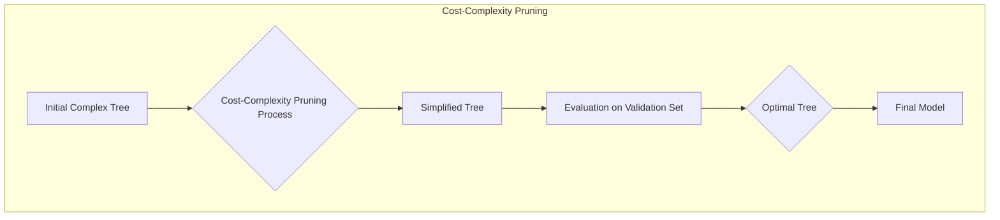
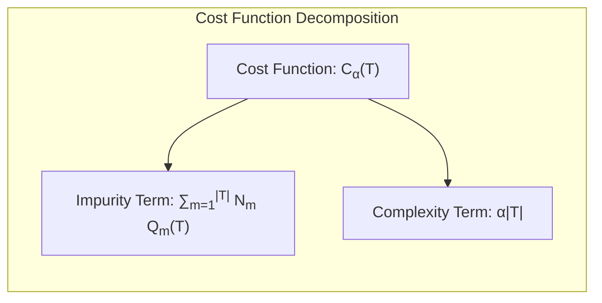
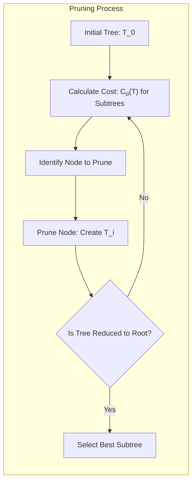
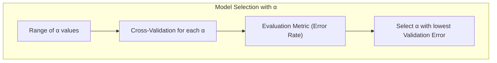
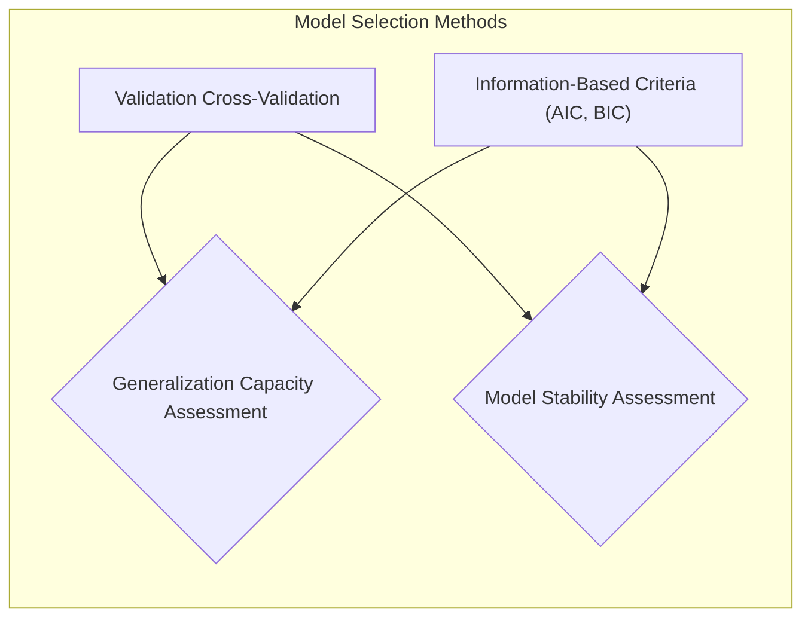

## Título: Modelos Aditivos, Árvores e Métodos Relacionados: Utilização do Erro de Classificação no Poda por Complexidade de Custo

### Introdução

Este capítulo explora a técnica de poda por complexidade de custo (cost-complexity pruning), com foco em como o erro de classificação é utilizado para guiar o processo de poda em árvores de decisão, e como esta estratégia busca um bom balanceamento entre o ajuste aos dados de treino e a capacidade de generalização [^9.1]. A poda por complexidade de custo é uma abordagem para simplificar as árvores de decisão, reduzindo o *overfitting* e melhorando a sua capacidade de generalização. O capítulo detalha como o erro de classificação é utilizado para avaliar a qualidade da poda, como o parâmetro de complexidade controla o tamanho da árvore e como a poda por complexidade de custo é utilizada na construção de modelos mais robustos e interpretáveis. O objetivo principal é apresentar uma visão aprofundada da aplicação do erro de classificação para guiar a poda de árvores de decisão e suas implicações no desempenho final do modelo.

### Conceitos Fundamentais

**Conceito 1: O Erro de Classificação em Árvores de Decisão**

O erro de classificação em árvores de decisão é uma métrica que mede a proporção de observações que são classificadas incorretamente pelo modelo, e pode ser utilizado para avaliar a qualidade de um nó ou de toda a árvore. O erro de classificação para um nó $m$ é dado por:

$$
\text{Erro de Classificação}_m = 1 - \hat{p}_{mk(m)}
$$

onde $\hat{p}_{mk(m)}$ é a proporção da classe majoritária $k(m)$ no nó $m$. O erro de classificação mede a proporção de observações que não pertencem à classe majoritária, e o erro de classificação da árvore é a soma ponderada do erro de classificação de cada nó folha. Embora o erro de classificação seja uma métrica simples e intuitiva, ele não é tão sensível a mudanças nos nós como a entropia ou o índice de Gini, e o uso de outras métricas é mais comum durante o processo de construção da árvore, mas o erro de classificação é importante no processo de poda, pois ele representa diretamente a taxa de classificação errada do modelo.

> 💡 **Exemplo Numérico:**
> Considere um nó $m$ em uma árvore de decisão onde temos 100 observações. Dessas, 60 pertencem à classe A (a classe majoritária) e 40 pertencem à classe B. A proporção da classe majoritária $\hat{p}_{mA}$ é 60/100 = 0.6. Portanto, o erro de classificação para este nó é:
> $$
> \text{Erro de Classificação}_m = 1 - 0.6 = 0.4
> $$
> Isso significa que 40% das observações neste nó são classificadas incorretamente se usarmos a classe majoritária como previsão para todas as observações nesse nó.

**Lemma 1:** *O erro de classificação quantifica a proporção de observações classificadas incorretamente por um modelo de classificação. O erro de classificação é uma métrica intuitiva e fácil de interpretar, e é utilizado para avaliar o desempenho da classificação do modelo.* O erro de classificação é uma métrica essencial na avaliação de modelos de classificação [^4.5].

**Conceito 2: Poda por Complexidade de Custo (Cost-Complexity Pruning)**

A poda por complexidade de custo (cost-complexity pruning) é um método utilizado para simplificar as árvores de decisão e evitar o *overfitting*. O método envolve a poda de nós da árvore que não contribuem significativamente para a redução do erro de classificação, utilizando um parâmetro de complexidade que controla o *trade-off* entre o tamanho da árvore e o ajuste aos dados. O processo de poda começa com a árvore completa, e utiliza um critério de custo para definir qual nó deve ser removido.  Em cada passo da poda, a árvore com menor custo é escolhida. O custo de cada subárvore $T$ é dado por:

$$
C_\alpha(T) = \sum_{m=1}^{|T|} N_m Q_m(T) + \alpha |T|
$$
onde $N_m$ é o número de observações no nó $m$, $Q_m(T)$ é a impureza do nó, $|T|$ é o número de nós terminais, e $\alpha$ é o parâmetro de complexidade, onde, quanto maior, maior será o custo por nó. O objetivo do método é escolher o valor de $\alpha$ que minimize o custo do modelo.

> 💡 **Exemplo Numérico:**
> Considere uma subárvore $T$ com três nós terminais.
> - Nó 1: $N_1 = 50$, $Q_1(T) = 0.2$
> - Nó 2: $N_2 = 30$, $Q_2(T) = 0.3$
> - Nó 3: $N_3 = 20$, $Q_3(T) = 0.1$
>
> O número de nós terminais é $|T| = 3$. Se o parâmetro de complexidade $\alpha = 0.05$, o custo da subárvore $T$ é:
>
> $$
> C_{0.05}(T) = (50 \times 0.2) + (30 \times 0.3) + (20 \times 0.1) + 0.05 \times 3
> $$
> $$
> C_{0.05}(T) = 10 + 9 + 2 + 0.15 = 21.15
> $$
> Se o $\alpha$ fosse 0.1, o custo seria:
> $$
> C_{0.1}(T) = 10 + 9 + 2 + 0.1 \times 3 = 21.3
> $$
> Este exemplo demonstra como o parâmetro $\alpha$ afeta o custo da árvore. Um $\alpha$ maior aumenta o custo, incentivando a poda de nós, enquanto um $\alpha$ menor permite árvores mais complexas.

**Corolário 1:** *A poda por complexidade de custo busca simplificar a árvore de decisão, e o parâmetro de complexidade controla o balanço entre o ajuste e a complexidade da árvore*. O parâmetro de complexidade é crucial para controlar a capacidade de generalização da árvore de decisão [^4.5.2].

**Conceito 3: Utilização do Erro de Classificação na Poda por Complexidade de Custo**

O erro de classificação é utilizado como critério para escolher qual nó deve ser removido na poda por complexidade de custo. Em cada passo, o algoritmo de poda avalia o aumento do erro de classificação causado pela remoção de um determinado nó, e o nó que causa o menor aumento no erro de classificação, juntamente com o termo de penalização, é removido. O parâmetro de complexidade $\alpha$ controla o *trade-off* entre a diminuição do erro de classificação e a complexidade da árvore. A escolha adequada do parâmetro de complexidade, que pode ser feita utilizando validação cruzada, resulta em um modelo com boa capacidade de generalização. A validação cruzada é utilizada para avaliar o desempenho da árvore podada e o nível de complexidade, que é utilizado para escolher a melhor árvore final.

> ⚠️ **Nota Importante:** O erro de classificação é utilizado para guiar o processo de poda por complexidade de custo, e a avaliação do impacto de cada poda no erro de classificação é essencial para evitar o overfitting do modelo e melhorar a sua capacidade de generalização [^4.5].

> ❗ **Ponto de Atenção:** O parâmetro de complexidade $\alpha$ controla o *trade-off* entre o tamanho da árvore e o erro de classificação, e a sua escolha deve ser feita utilizando validação cruzada ou métodos similares. Valores pequenos do parâmetro de complexidade levam a árvores muito complexas com risco de overfitting e valores muito altos do parâmetro de complexidade levam a modelos muito simples e com pouco ajuste aos dados [^4.5.1].

> ✔️ **Destaque:** A poda por complexidade de custo utiliza o erro de classificação, juntamente com o parâmetro de complexidade, para balancear o ajuste e a complexidade da árvore de decisão, o que resulta em modelos mais robustos e com melhor capacidade preditiva [^4.5.2].

### Processo de Poda por Complexidade de Custo: Utilização do Erro de Classificação e do Parâmetro de Complexidade

**Explicação:** Este diagrama ilustra o processo de poda por complexidade de custo, mostrando como o erro de classificação e o parâmetro de complexidade são utilizados para simplificar a árvore de decisão. O processo iterativo busca o melhor *trade-off* entre ajuste aos dados e complexidade do modelo [^4.5.2].

O algoritmo de poda por complexidade de custo começa com a árvore completa $T_0$ (a árvore que se ajusta perfeitamente aos dados de treino).  Em seguida, o algoritmo itera sobre as sub-árvores, removendo um nó a cada passo, de acordo com o seguinte procedimento:

1.  **Cálculo do Custo:** Para cada nó interno da árvore, calcula o custo de remover o nó. O custo é dado pela soma ponderada do erro de classificação nos nós terminais da subárvore $T$ e o termo de penalização com o parâmetro de complexidade $\alpha$:
   $$
C_\alpha(T) = \sum_{m=1}^{|T|} N_m Q_m(T) + \alpha |T|
$$
     onde $N_m$ é o número de observações no nó $m$, $Q_m(T)$ é uma medida de impureza do nó (como o erro de classificação), e $|T|$ é o número de nós terminais da subárvore $T$.
2.  **Remoção do Nó:** O nó interno que resulta na menor mudança no custo é removido da árvore, gerando uma nova árvore podada $T_i$. A escolha do nó a ser removido é baseada no valor do parâmetro de complexidade, onde, um valor maior de $\alpha$ leva a árvores menores.
3.  **Iteração:** O processo de cálculo do custo e remoção de nós é repetido até que a árvore se reduza a um único nó. Em cada passo, a árvore com menor custo é escolhida.

A avaliação do desempenho de cada árvore podada é feita através da validação cruzada, onde o erro de classificação é utilizado como critério de escolha. A sequência de árvores obtidas no processo de poda representa um conjunto de modelos de diferentes complexidades.

> 💡 **Exemplo Numérico:**
> Suponha que temos uma árvore com um nó interno que, quando removido, resulta em duas subárvores.
> - Subárvore 1: $|T_1| = 3$,  $\sum_{m=1}^{3} N_m Q_m(T_1) = 15$
> - Subárvore 2: $|T_2| = 2$, $\sum_{m=1}^{2} N_m Q_m(T_2) = 10$
>
> Se removermos o nó interno, obtemos uma nova árvore com $|T'| = 5$ e um custo total de impureza de $15+10=25$.
>
> Se $\alpha = 1$, o custo da árvore original é $C_\alpha(T_1 \cup T_2) = 15 + 10 + 1 * 5 = 30$.
>
> Se não removermos, o custo da árvore anterior (com o nó interno) é $C_\alpha(T) = \sum_{m=1}^{|T|} N_m Q_m(T) + \alpha |T|$. Suponha que $\sum_{m=1}^{|T|} N_m Q_m(T) = 20$ e $|T| = 4$, então $C_\alpha(T) = 20+1*4 = 24$.
>
> Portanto, se $\alpha = 1$, é mais vantajoso manter o nó interno (custo 24) do que removê-lo (custo 30).
>
> Se $\alpha = 5$, o custo da árvore sem remover o nó interno seria $C_\alpha(T) = 20 + 5*4 = 40$. O custo da árvore com o nó removido seria $C_\alpha(T_1 \cup T_2) = 15 + 10 + 5 * 5 = 50$. Portanto, é mais vantajoso não remover o nó interno.
>
> Se aumentarmos $\alpha$ para 10, o custo da árvore sem remover o nó interno seria $C_\alpha(T) = 20 + 10 * 4 = 60$. O custo da árvore com o nó removido seria $C_\alpha(T_1 \cup T_2) = 15 + 10 + 10 * 5 = 75$. É mais vantajoso manter o nó interno.
>
> O ponto crucial é que a remoção do nó interno, só será vantajosa se o custo da árvore com o nó interno for maior do que o custo da árvore sem o nó interno.
>
> Este exemplo mostra como o parâmetro $\alpha$ influencia a decisão de remover ou não um nó interno durante a poda.

**Lemma 3:** *O algoritmo de poda por complexidade de custo busca um balanceamento entre ajuste aos dados e complexidade da árvore, e a escolha do parâmetro de complexidade é fundamental para obter um modelo com boa capacidade de generalização. O erro de classificação é utilizado como critério para guiar a poda e a avaliação do desempenho da árvore podada.*  O uso do parâmetro de complexidade e do erro de classificação é fundamental para evitar o overfitting e obter uma boa capacidade de generalização [^4.5.2].

### A Escolha do Parâmetro de Complexidade e a Avaliação do Desempenho da Árvore

A escolha do parâmetro de complexidade $\alpha$ é feita utilizando validação cruzada ou outros métodos de escolha de modelos. O valor de $\alpha$ que resulta em um menor erro de classificação em um conjunto de validação é escolhido para a poda final da árvore.  A utilização de métricas como sensibilidade e especificidade também podem ser consideradas para a escolha do valor de $\alpha$.  A avaliação do desempenho de cada árvore podada permite escolher o modelo mais adequado para o problema em questão.  A escolha do parâmetro $\alpha$ representa um equilíbrio entre a complexidade e o ajuste do modelo e permite controlar a capacidade de generalização da árvore.

> 💡 **Exemplo Numérico:**
> Suponha que realizamos uma validação cruzada com 5 folds para avaliar o desempenho de diferentes valores de $\alpha$. Obtemos os seguintes resultados de erro de classificação médio:
>
> | α     | Erro de Classificação (Validação Cruzada) |
> |-------|----------------------------------------|
> | 0.001 | 0.18                                    |
> | 0.01  | 0.15                                    |
> | 0.05  | 0.12                                    |
> | 0.1   | 0.13                                    |
> | 0.2   | 0.16                                    |
> | 0.5   | 0.20                                    |
>
> Baseado nesses resultados, o valor de $\alpha$ que minimiza o erro de classificação na validação cruzada é 0.05. Este valor seria escolhido para a poda final da árvore. Note que $\alpha = 0.001$ leva a um erro maior, o que sugere *overfitting*. Da mesma forma, $\alpha = 0.5$ leva a um erro maior, o que sugere *underfitting*.

###  A Relação da Poda com a Minimização da Impureza

A poda por complexidade de custo é uma abordagem alternativa para o processo de divisão gulosa da árvore. Enquanto a construção da árvore busca reduzir a impureza localmente, a poda busca remover as divisões que não contribuem para a capacidade de generalização. Ambos os processos são gulosos, mas o primeiro busca o máximo da redução da impureza, enquanto que o segundo busca um modelo que maximize a capacidade de generalização. A escolha entre essas abordagens é baseada no objetivo da modelagem.

### Perguntas Teóricas Avançadas: Como diferentes abordagens para a escolha do parâmetro de complexidade α (validação cruzada, métodos baseados em informação) afetam a capacidade de generalização e a estabilidade dos modelos de árvores de decisão?

**Resposta:**

Diferentes abordagens para a escolha do parâmetro de complexidade α na poda por complexidade de custo, como validação cruzada e métodos baseados em informação, têm um impacto significativo na capacidade de generalização e na estabilidade dos modelos de árvores de decisão.

A validação cruzada é um método empírico que estima o desempenho do modelo em dados não vistos, através da divisão dos dados em diferentes partes (folds) e a utilização de uma parte para treino e outra para validação. O parâmetro de complexidade α que resulta no menor erro de classificação médio sobre as diferentes partes é selecionado. A validação cruzada é uma abordagem geral, que pode ser aplicada a diferentes tipos de dados e modelos, e gera uma avaliação mais precisa do desempenho do modelo em dados não vistos.

Métodos baseados em informação, como o critério de informação de Akaike (AIC) e o critério de informação Bayesiano (BIC), utilizam uma penalidade baseada no número de parâmetros do modelo, e utilizam a função de *log-likelihood* como base para a avaliação do modelo. Esses critérios buscam selecionar um modelo que minimize o viés e a variância, e oferecem uma avaliação mais teórica do desempenho do modelo. Os métodos baseados em informação utilizam um balanço entre a qualidade do ajuste e a complexidade do modelo, com a inclusão de penalidades para modelos mais complexos.

Em geral, a escolha do parâmetro de complexidade α utilizando validação cruzada leva a modelos com boa capacidade de generalização, pois a avaliação é feita diretamente no poder preditivo do modelo.  Métodos baseados em informação podem levar a modelos mais simples, que têm maior interpretabilidade, mas, em alguns casos, podem sacrificar um pouco da capacidade de predição. A escolha do método depende dos objetivos da modelagem e da natureza dos dados, e ambos os métodos são utilizados na prática.

A estabilidade dos modelos também é afetada pela escolha do parâmetro α. Modelos muito complexos (com α baixo) tendem a ser instáveis e sensíveis aos dados de treino. Modelos mais simples (com α alto) tendem a ser mais estáveis e menos sensíveis aos dados de treino, mas podem perder a capacidade de capturar padrões importantes nos dados. A escolha de α que equilibre a capacidade preditiva e a estabilidade do modelo é fundamental para a modelagem estatística.

**Lemma 5:** *A escolha do parâmetro de complexidade α é fundamental para a capacidade de generalização de árvores de decisão. Métodos baseados em validação cruzada estimam o desempenho do modelo em dados não vistos, enquanto métodos baseados em informação oferecem uma avaliação mais teórica do ajuste do modelo, e uma penalização para a complexidade. A estabilidade do modelo também depende da escolha do parâmetro α*. A escolha do parâmetro de complexidade é um componente fundamental do processo de poda e da construção de modelos com árvores de decisão [^4.5.1], [^4.5.2].

**Corolário 5:** *A utilização de validação cruzada e métodos baseados em informação para a escolha do parâmetro de complexidade α permite obter modelos com boa capacidade de generalização e com estabilidade das estimativas. A combinação dos dois métodos pode ser utilizada para obter o melhor balanço entre precisão, estabilidade e interpretabilidade do modelo*.  A escolha do método adequado depende das propriedades dos dados e do objetivo do modelo [^4.3.3].

> ⚠️ **Ponto Crucial**: A escolha do parâmetro de complexidade α é um componente chave na construção de modelos baseados em árvores de decisão, e a escolha apropriada do método (validação cruzada ou métodos baseados em informação) garante que os modelos tenham uma boa capacidade de generalização, o que é crucial para o bom desempenho em dados não vistos.  O balanceamento entre a capacidade de ajuste aos dados de treino e a capacidade de generalização é controlado por meio do parâmetro de complexidade [^4.4.2].

### Conclusão

Este capítulo explorou a utilização do erro de classificação para guiar a poda por complexidade de custo em árvores de decisão, detalhando os passos da poda, o impacto do parâmetro de complexidade e como essas abordagens impactam a qualidade e capacidade preditiva dos modelos.  A compreensão da relação entre o erro de classificação e o parâmetro de complexidade é fundamental para a construção de modelos robustos e com boa capacidade de generalização.

### Footnotes

[^4.1]: "In this chapter we begin our discussion of some specific methods for super-vised learning. These techniques each assume a (different) structured form for the unknown regression function, and by doing so they finesse the curse of dimensionality. Of course, they pay the possible price of misspecifying the model, and so in each case there is a tradeoff that has to be made." *(Trecho de "Additive Models, Trees, and Related Methods")*

[^4.2]: "Regression models play an important role in many data analyses, providing prediction and classification rules, and data analytic tools for understand-ing the importance of different inputs." *(Trecho de "Additive Models, Trees, and Related Methods")*

[^4.3]: "In this section we describe a modular algorithm for fitting additive models and their generalizations. The building block is the scatterplot smoother for fitting nonlinear effects in a flexible way. For concreteness we use as our scatterplot smoother the cubic smoothing spline described in Chapter 5." *(Trecho de "Additive Models, Trees, and Related Methods")*

[^4.3.1]:  "The additive model has the form $Y = \alpha + \sum_{j=1}^p f_j(X_j) + \varepsilon$, where the error term $\varepsilon$ has mean zero." * (Trecho de "Additive Models, Trees, and Related Methods")*

[^4.3.2]:   "Given observations $x_i, y_i$, a criterion like the penalized sum of squares (5.9) of Section 5.4 can be specified for this problem, $PRSS(\alpha, f_1, f_2,..., f_p) = \sum_i^N (y_i - \alpha - \sum_j^p f_j(x_{ij}))^2 + \sum_j^p \lambda_j \int(f_j''(t_j))^2 dt_j$" * (Trecho de "Additive Models, Trees, and Related Methods")*

[^4.3.3]: "where the $\lambda_j > 0$ are tuning parameters. It can be shown that the minimizer of (9.7) is an additive cubic spline model; each of the functions $f_j$ is a cubic spline in the component $X_j$, with knots at each of the unique values of $x_{ij}$, $i = 1,..., N$." *(Trecho de "Additive Models, Trees, and Related Methods")*

[^4.4]: "For two-class classification, recall the logistic regression model for binary data discussed in Section 4.4. We relate the mean of the binary response $\mu(X) = Pr(Y = 1|X)$ to the predictors via a linear regression model and the logit link function:  $log(\mu(X)/(1 – \mu(X)) = \alpha + \beta_1 X_1 + \ldots + \beta_pX_p$." * (Trecho de "Additive Models, Trees, and Related Methods")*

[^4.4.1]: "The additive logistic regression model replaces each linear term by a more general functional form: $log(\mu(X)/(1 – \mu(X))) = \alpha + f_1(X_1) + \ldots + f_p(X_p)$, where again each $f_j$ is an unspecified smooth function." * (Trecho de "Additive Models, Trees, and Related Methods")*

[^4.4.2]: "While the non-parametric form for the functions $f_j$ makes the model more flexible, the additivity is retained and allows us to interpret the model in much the same way as before. The additive logistic regression model is an example of a generalized additive model." *(Trecho de "Additive Models, Trees, and Related Methods")*

[^4.4.3]: "In general, the conditional mean $\mu(X)$ of a response $Y$ is related to an additive function of the predictors via a link function $g$:  $g[\mu(X)] = \alpha + f_1(X_1) + \ldots + f_p(X_p)$." *(Trecho de "Additive Models, Trees, and Related Methods")*

[^4.4.4]:  "Examples of classical link functions are the following: $g(\mu) = \mu$ is the identity link, used for linear and additive models for Gaussian response data." *(Trecho de "Additive Models, Trees, and Related Methods")*

[^4.4.5]: "$g(\mu) = logit(\mu)$ as above, or $g(\mu) = probit(\mu)$, the probit link function, for modeling binomial probabilities. The probit function is the inverse Gaussian cumulative distribution function: $probit(\mu) = \Phi^{-1}(\mu)$." *(Trecho de "Additive Models, Trees, and Related Methods")*

[^4.5]: "All three of these arise from exponential family sampling models, which in addition include the gamma and negative-binomial distributions. These families generate the well-known class of generalized linear models, which are all extended in the same way to generalized additive models." *(Trecho de "Additive Models, Trees, and Related Methods")*

[^4.5.1]: "The functions $f_j$ are estimated in a flexible manner, using an algorithm whose basic building block is a scatterplot smoother. The estimated func-tion $f_j$ can then reveal possible nonlinearities in the effect of $X_j$. Not all of the functions $f_j$ need to be nonlinear." *(Trecho de "Additive Models, Trees, and Related Methods")*

[^4.5.2]: "We can easily mix in linear and other parametric forms with the nonlinear terms, a necessity when some of the inputs are qualitative variables (factors)." *(Trecho de "Additive Models, Trees, and Related Methods")*
