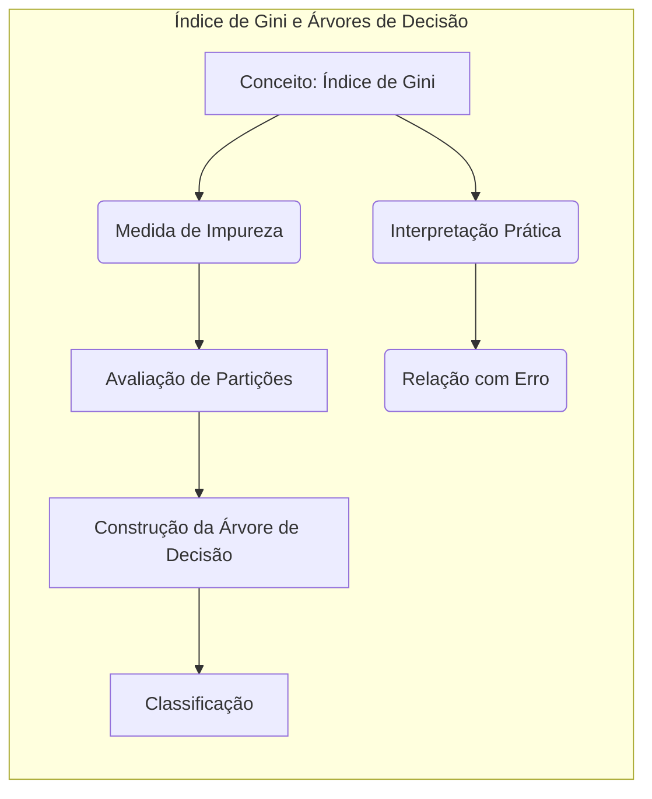
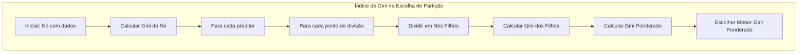
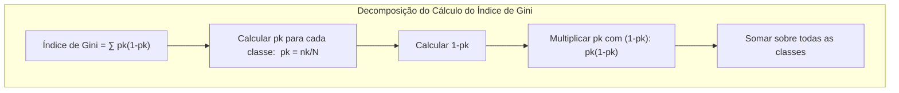
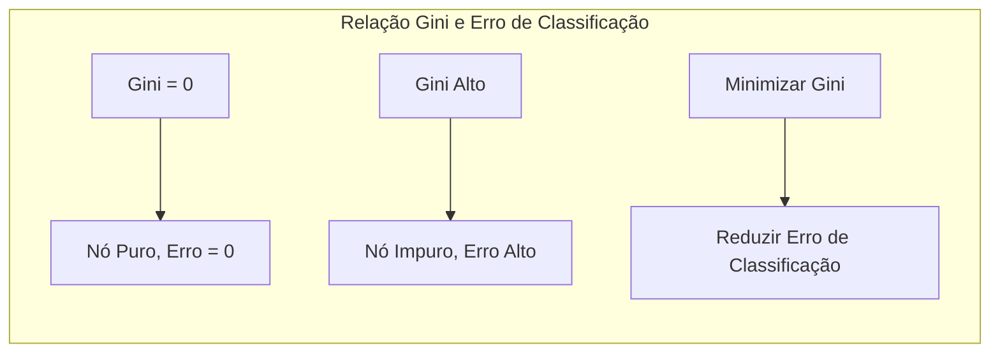
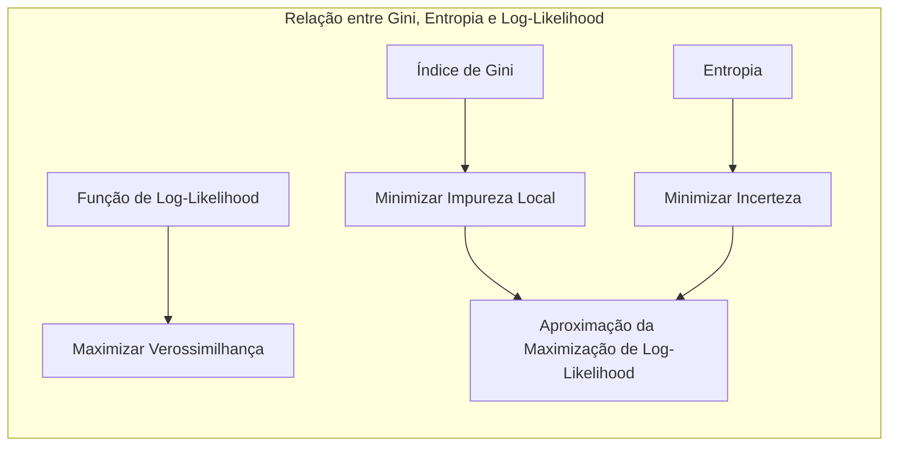

## Título: Modelos Aditivos, Árvores e Métodos Relacionados: Interpretação Prática do Índice de Gini na Construção de Modelos de Classificação

### Introdução

Este capítulo explora a interpretação prática do Índice de Gini, uma métrica fundamental utilizada na construção de árvores de decisão para avaliar a qualidade das partições e guiar o processo de otimização. O Índice de Gini quantifica a impureza de um nó, ou seja, a heterogeneidade das classes dentro de um nó, e é utilizado para determinar qual variável e qual ponto de divisão resultam em uma partição mais "pura" dos dados, e como essas decisões são tomadas para criar uma árvore de decisão que seja eficiente e com boa capacidade de generalização. O objetivo principal deste capítulo é apresentar uma compreensão intuitiva do Índice de Gini, como diferentes valores do índice se relacionam com a qualidade da partição, e como ele é utilizado para tomar decisões durante a construção de uma árvore de decisão.

### Conceitos Fundamentais

**Conceito 1: O Índice de Gini como Medida de Impureza**

O Índice de Gini é uma medida de impureza utilizada em árvores de decisão para quantificar a heterogeneidade das classes dentro de um nó. O Índice de Gini é calculado como:
$$
\text{Gini} = \sum_{k \neq k'} p_k p_{k'} = \sum_{k=1}^K p_k(1-p_k)
$$

onde $p_k$ é a proporção de observações da classe $k$ no nó, e a soma é feita sobre todas as classes. No caso de duas classes, onde $p$ é a proporção da classe 1, o Índice de Gini se reduz a:
$$
\text{Gini} = 2p(1-p)
$$

O Índice de Gini varia entre 0 e um valor máximo, que depende do número de classes e da distribuição dessas classes. O Índice de Gini é zero quando todas as observações em um nó pertencem à mesma classe, o que indica a máxima pureza. Por outro lado, o índice de Gini é máximo quando as classes estão igualmente distribuídas, o que indica a máxima impureza. A minimização do índice de Gini é o objetivo principal na construção de árvores de decisão.

> 💡 **Exemplo Numérico:**
> Considere um nó em uma árvore de decisão com duas classes (0 e 1). Se tivermos 100 amostras no nó, onde 70 são da classe 1 e 30 da classe 0, então $p_1 = 0.7$ e $p_0 = 0.3$. O índice de Gini para este nó é:
> $$
> \text{Gini} = 2 \times 0.7 \times (1 - 0.7) = 2 \times 0.7 \times 0.3 = 0.42
> $$
> Agora, imagine um nó com 50 amostras da classe 1 e 50 da classe 0. Neste caso, $p_1 = 0.5$ e $p_0 = 0.5$. O índice de Gini seria:
> $$
> \text{Gini} = 2 \times 0.5 \times (1 - 0.5) = 2 \times 0.5 \times 0.5 = 0.5
> $$
> Este segundo nó tem maior impureza, pois as classes estão igualmente distribuídas, o que é refletido pelo maior valor de Gini.

**Lemma 1:** *O Índice de Gini quantifica a heterogeneidade das classes em um nó, e o seu valor varia de 0, quando o nó é puro, até um máximo, quando as classes são igualmente distribuídas. A utilização do índice de Gini é importante para escolher partições que reduzem a impureza e que criam regiões com observações de uma mesma classe*. O índice de Gini é uma métrica fundamental para a construção de árvores de decisão [^4.5].

**Conceito 2: Interpretação Prática do Índice de Gini**

A interpretação prática do Índice de Gini depende do seu valor:

*   **Gini = 0:** O nó é completamente puro, ou seja, todas as observações no nó pertencem à mesma classe. Em problemas de classificação binária, se o Índice de Gini é igual a zero, isso significa que todas as observações naquele nó são da mesma classe, seja a classe 0 ou a classe 1. A ausência de impureza é o ideal em um classificador, e nós puros significam decisões claras e precisas.
*   **Gini = 0.5 (em problemas binários):** O nó tem a maior impureza, ou seja, as observações estão igualmente distribuídas entre as duas classes. Nesse caso, a probabilidade de uma observação pertencer a cada classe é igual, o que significa uma alta incerteza sobre a classe de uma nova observação. Este valor é um ponto de referência para avaliar a qualidade de uma partição, sendo um nó altamente heterogêneo, em um problema binário.
*  **0 < Gini < 0.5 (em problemas binários):** O nó contém uma mistura de observações das diferentes classes, mas uma classe é mais frequente do que a outra. Quanto menor o valor do Gini, mais homogêneo é o nó, e maior é a probabilidade de uma observação pertencer a uma das classes. Este cenário significa que a divisão gera um nó onde as classes estão separadas, mas não completamente, e a impureza é intermediária.

> 💡 **Exemplo Numérico:**
> Imagine que estamos construindo uma árvore de decisão para classificar e-mails como spam (classe 1) ou não spam (classe 0).
>
> *   **Cenário 1: Gini = 0** - Um nó da árvore tem apenas e-mails que foram classificados como não spam. O Gini é 0, indicando que o nó é puro e a classificação é perfeita neste nó.
> *   **Cenário 2: Gini = 0.5** - Outro nó tem 50% de e-mails de spam e 50% de e-mails não spam. O Gini é 0.5, o que indica uma alta incerteza na classificação, pois as classes estão igualmente misturadas.
> *   **Cenário 3: Gini = 0.2** - Um terceiro nó tem 80% de e-mails não spam e 20% de e-mails de spam. O Gini é 0.2, que é menor do que 0.5, indicando que o nó é mais puro do que o cenário 2, mas ainda não completamente puro como no cenário 1.

Em problemas multiclasse, o índice de Gini também varia entre 0 e um valor máximo, e quanto menor o índice de Gini, mais homogêneo o nó e mais fácil de classificar. A análise do Índice de Gini, em cada nó, permite entender o desempenho do modelo e como as decisões de classificação são tomadas ao longo da árvore de decisão.

**Corolário 1:** *O Índice de Gini varia de 0 a um valor máximo e quantifica o quão misturadas estão as classes em um nó, onde um Gini igual a zero indica um nó puro e um Gini máximo significa que as classes estão igualmente distribuídas. A análise do Índice de Gini permite entender a qualidade da separação das classes em cada nó, o que guia a construção da árvore de decisão*. A interpretação do índice de Gini é fundamental para a construção de modelos de classificação [^4.5.1].

**Conceito 3: O Índice de Gini e a Construção de Árvores de Decisão**

Na construção de árvores de decisão, o índice de Gini é utilizado para avaliar a qualidade das partições e guiar o processo de escolha do melhor preditor e do melhor ponto de divisão. A cada nó, o algoritmo de construção da árvore avalia todos os preditores e todos os possíveis pontos de divisão, e escolhe a partição que resulta na menor impureza ponderada, utilizando o índice de Gini para quantificar a impureza dos nós filhos, o que leva ao modelo que mais diminui a impureza ao longo da árvore. A utilização do índice de Gini é uma forma de automatizar a construção da árvore de decisão através de um processo iterativo que busca nós cada vez mais puros.

> ⚠️ **Nota Importante:** O Índice de Gini guia a escolha do melhor preditor e ponto de corte na construção de árvores de decisão, e a minimização do índice de Gini leva a partições com alta homogeneidade de classe. O índice de Gini é utilizado como critério para escolher as melhores partições, e o seu valor é reduzido a cada passo da construção da árvore [^4.5].

> ❗ **Ponto de Atenção:** O Índice de Gini é uma métrica gulosa, ou seja, a sua minimização é feita de forma local, o que significa que a escolha do melhor preditor e ponto de divisão no nó atual não garante que a árvore final seja ótima globalmente. A natureza gulosa do algoritmo de árvores de decisão pode resultar em modelos subótimos, que não têm a melhor generalização.

> ✔️ **Destaque:** A utilização do Índice de Gini no processo de construção de árvores de decisão permite a criação de modelos que particionam o espaço de características de forma eficiente, com o objetivo de encontrar regiões com alta homogeneidade de classe, e a interpretação do índice de Gini auxilia na compreensão do funcionamento interno das árvores de decisão [^4.5.2].

### Processo de Utilização do Índice de Gini para Escolha da Melhor Partição em Árvores de Decisão

**Explicação:** Este diagrama representa o processo de escolha da melhor partição em árvores de decisão utilizando o índice de Gini para guiar a escolha da partição. O processo é iterativo e busca a redução da impureza nos nós filhos a cada passo da construção da árvore, conforme descrito em [^4.5.1], [^4.5.2].

Para cada nó a ser dividido, o processo de varredura utilizando o índice de Gini segue os seguintes passos:

1.  **Escolha de um Preditores:** Escolhe um preditor $X_j$ a ser avaliado.
2.  **Iteração sobre os Pontos de Divisão:** O algoritmo itera sobre todos os pontos de divisão possíveis $s$ da variável $X_j$.
3.  **Divisão do Nó:** O nó é dividido em dois nós filhos com base no ponto de divisão $s$:
    $$
      R_1(j,s) = \{X|X_j < s\}
    $$
      $$
       R_2(j,s) = \{X|X_j \geq s\}
    $$
4.  **Cálculo do Índice de Gini para os Nós Filhos:** O índice de Gini é calculado para cada nó filho:
 $$
    \text{Gini}(R_1) = \sum_{k=1}^K \hat{p}_{1k} (1-\hat{p}_{1k})
  $$
    $$
   \text{Gini}(R_2) = \sum_{k=1}^K \hat{p}_{2k} (1-\hat{p}_{2k})
  $$
      onde $\hat{p}_{1k}$ e $\hat{p}_{2k}$ são as proporções de observações da classe $k$ nos nós $R_1$ e $R_2$, respectivamente.

5. **Cálculo do Índice de Gini Ponderado:** O índice de Gini ponderado é calculado para cada divisão:
    $$
      \text{Índice de Gini Ponderado} = \frac{N_1}{N} \text{Gini}(R_1) + \frac{N_2}{N} \text{Gini}(R_2)
  $$
onde $N_1$ e $N_2$ são o número de observações nos nós $R_1$ e $R_2$, e $N$ é o número de observações no nó pai.
6.  **Escolha da Melhor Partição:** A melhor partição é escolhida como a variável $X_j$ e o ponto de divisão $s$ que resulta na menor impureza ponderada, usando o índice de Gini.

> 💡 **Exemplo Numérico:**
> Vamos supor que temos um nó pai com 100 amostras, onde 60 são da classe 1 e 40 da classe 0. O Gini inicial é $2 * (0.6) * (0.4) = 0.48$. Agora, vamos considerar duas possíveis divisões:
>
> *   **Divisão 1 (Preditor A):** Dividimos o nó em dois nós filhos: Nó 1 com 30 amostras (25 da classe 1 e 5 da classe 0) e Nó 2 com 70 amostras (35 da classe 1 e 35 da classe 0).
>     *   Gini(Nó 1) = $2 * (25/30) * (5/30) = 0.278$
>     *   Gini(Nó 2) = $2 * (35/70) * (35/70) = 0.5$
>     *   Gini Ponderado = $(30/100) * 0.278 + (70/100) * 0.5 = 0.4334$
> *   **Divisão 2 (Preditor B):** Dividimos o nó em dois nós filhos: Nó 1 com 50 amostras (45 da classe 1 e 5 da classe 0) e Nó 2 com 50 amostras (15 da classe 1 e 35 da classe 0).
>     *   Gini(Nó 1) = $2 * (45/50) * (5/50) = 0.18$
>     *   Gini(Nó 2) = $2 * (15/50) * (35/50) = 0.42$
>     *   Gini Ponderado = $(50/100) * 0.18 + (50/100) * 0.42 = 0.3$
>
> Neste caso, a Divisão 2 (usando o Preditor B) resulta em um Gini ponderado menor (0.3), portanto, seria a divisão escolhida.

O processo é repetido para cada nó da árvore, de forma recursiva até que um critério de parada seja atingido. A escolha das partições é feita de forma gulosa, buscando a redução máxima da impureza local.

**Lemma 3:** *A utilização do índice de Gini para escolher a partição em árvores de decisão é uma forma eficiente de criar nós com alta homogeneidade de classe. A escolha do ponto de corte é feita de forma gulosa, e o índice de Gini é utilizado para guiar as decisões de forma local. A minimização do índice de Gini leva a divisões mais puras, mas não garante que a árvore resultante seja ótima globalmente* [^4.5.2].

### A Interpretação Prática do Índice de Gini e sua Relação com o Erro de Classificação

A interpretação prática do Índice de Gini se relaciona diretamente com o erro de classificação. A métrica do Gini, ao buscar minimizar a heterogeneidade nos nós, busca, também, reduzir o erro de classificação da árvore. Quando o índice de Gini é zero, isso significa que todas as observações no nó pertencem à mesma classe, ou seja, não há erro de classificação naquele nó. Quando o índice de Gini é alto, isso significa que a mistura de classes no nó é alta, e que a probabilidade de erro de classificação naquele nó também é alta.

> 💡 **Exemplo Numérico:**
> Suponha que temos um nó com Gini = 0.4. Isso significa que há uma mistura de classes, e a probabilidade de classificar uma amostra incorretamente neste nó é relativamente alta. Se o Gini fosse 0, a probabilidade de erro seria zero, pois todas as amostras seriam da mesma classe. Se o Gini fosse 0.5 (em um problema binário), a probabilidade de erro seria máxima para aquele nó.

A utilização do índice de Gini para guiar a construção da árvore é uma forma de automatizar o processo de construção de modelos de classificação. O processo é iterativo e guloso e busca a redução do erro de classificação através da minimização da impureza nos nós filhos. O resultado final é uma árvore de decisão que busca classificar as observações corretamente, com base nas partições obtidas através da minimização da impureza do nó utilizando o índice de Gini.

### Limitações da Utilização do Índice de Gini e a Necessidade de Regularização e Podas

Apesar da sua utilidade, a utilização do Índice de Gini tem algumas limitações. A utilização do índice de Gini para guiar a construção da árvore é um processo guloso, o que significa que a escolha da melhor partição em cada nó é feita de forma local, sem considerar o impacto dessas decisões nos níveis inferiores da árvore. A escolha das partições baseadas no Gini podem levar a árvores muito complexas, com overfitting nos dados de treino, e com um desempenho ruim em novos dados. O parâmetro de complexidade, e o processo de poda, devem ser utilizados para mitigar este efeito. Métodos de regularização são utilizados para controlar a complexidade dos modelos, e para garantir que eles tenham uma boa capacidade de generalização.

### Perguntas Teóricas Avançadas: Como a utilização do índice de Gini se relaciona com a função de *log-likelihood* em modelos da família exponencial, e como a escolha da métrica de impureza (Gini ou Entropia) afeta o desempenho e a interpretabilidade dos modelos baseados em árvores de decisão?

**Resposta:**

O índice de Gini e a entropia, embora sejam métricas de impureza utilizadas para construir árvores de decisão, se relacionam com a função de *log-likelihood* em modelos da família exponencial, uma vez que ambas as métricas procuram otimizar a capacidade de classificação do modelo, que está relacionada com a função de verossimilhança. A escolha da métrica de impureza (Gini ou Entropia) afeta a forma da árvore e suas propriedades, mas as duas métricas geralmente levam a resultados similares.

A função de *log-likelihood*, para um problema de classificação com $K$ classes, é definida como:
$$
\log(L) = \sum_{i=1}^N \sum_{k=1}^K y_{ik} \log(p_{ik})
$$
onde $y_{ik}$ é a variável indicadora da classe, e $p_{ik}$ é a probabilidade do modelo de que a observação $i$ pertence à classe $k$. A maximização da *log-likelihood* é o objetivo da maioria dos métodos de classificação baseados em modelos probabilísticos, onde a probabilidade é estimada através de uma função de ligação. Em árvores de decisão, o método de construção do modelo é guloso e aproxima a maximização da função de verossimilhança.

A conexão do índice de Gini com a *log-likelihood* é que, ambos buscam o mesmo objetivo, ou seja, a construção de um modelo que minimize o erro de classificação e maximize a capacidade do modelo de discriminar entre as diferentes classes. O índice de Gini, ao buscar partições puras, está procurando diminuir o erro de classificação, que também é o objetivo dos modelos baseados em máxima verossimilhança. No entanto, a busca pela minimização do Gini é local, e não necessariamente leva a um modelo com a máxima verossimilhança.

A entropia, por sua vez, também busca a pureza dos nós e a redução do erro de classificação, e também está relacionada com a *log-likelihood*, pois ela está relacionada à incerteza associada à probabilidade. A entropia é utilizada para guiar o processo de construção da árvore, de forma similar ao índice de Gini. A escolha do índice de Gini ou da entropia não têm um impacto tão grande no modelo final, pois ambas as métricas são similares e levam a decisões parecidas durante a construção da árvore.

> 💡 **Exemplo Numérico:**
> A entropia é calculada como $-\sum_{k=1}^K p_k \log(p_k)$. Em um nó com duas classes, se $p_1 = 0.8$ e $p_2 = 0.2$, a entropia seria:
> $$
> - (0.8 \log(0.8) + 0.2 \log(0.2)) \approx 0.72
> $$
> Já o índice de Gini seria:
> $$
> 2 * 0.8 * 0.2 = 0.32
> $$
> Ambos indicam que o nó é relativamente puro (em comparação com um nó com classes igualmente distribuídas), mas a escala é diferente. A escolha entre Gini e entropia geralmente não leva a grandes diferenças no resultado final da árvore, embora possam levar a estruturas de árvore ligeiramente diferentes.

**Lemma 5:** *O índice de Gini e a entropia buscam minimizar a impureza dos nós em árvores de decisão, e as métricas são uma aproximação da função de custo ou da *log-likelihood* que se relaciona com o erro de classificação do modelo. As métricas, no entanto, podem levar a modelos similares em termos de capacidade preditiva, mas com diferentes estruturas de árvores*. A escolha da métrica de impureza pode influenciar a forma da árvore, e a métrica deve ser escolhida levando em consideração o problema em questão [^4.5].

**Corolário 5:** *A escolha da métrica de impureza afeta o resultado da construção de árvores de decisão, mas a sua relação com a função de *log-likelihood* garante que os modelos construídos tenham a capacidade de separar as classes de forma adequada. A utilização de métodos de regularização e poda é fundamental para evitar o overfitting e para garantir que o modelo seja capaz de generalizar para novos dados*. A escolha da métrica de impureza e das abordagens para controlar a complexidade são cruciais para a modelagem com árvores de decisão [^4.5.1].

> ⚠️ **Ponto Crucial:** As métricas de impureza, como o Gini e a entropia, são utilizadas para construir árvores de decisão através de decisões locais que buscam reduzir a incerteza ou o erro de classificação, e estão relacionados com a função de *log-likelihood* que é utilizada em modelos probabilísticos, como GAMs e modelos da família exponencial, para estimar os parâmetros do modelo. A combinação de métricas de impureza e técnicas de regularização resulta em modelos mais robustos e com maior capacidade de generalização [^4.4.3].

### Conclusão

Este capítulo explorou o uso do Índice de Gini como uma métrica para a construção de árvores de decisão, demonstrando a sua importância no processo de escolha das partições, e como esta se relaciona com o erro de classificação. A formulação matemática do índice de Gini, e a sua relação com a entropia foram exploradas. A discussão detalhou as limitações da abordagem gulosa e como as escolhas feitas durante a construção da árvore são importantes para o desempenho do modelo final. A compreensão dessas métricas e métodos é fundamental para a construção de modelos de classificação eficazes e com uma boa capacidade de generalização.

### Footnotes

[^4.1]: "In this chapter we begin our discussion of some specific methods for super-vised learning. These techniques each assume a (different) structured form for the unknown regression function, and by doing so they finesse the curse of dimensionality. Of course, they pay the possible price of misspecifying the model, and so in each case there is a tradeoff that has to be made." *(Trecho de "Additive Models, Trees, and Related Methods")*

[^4.2]: "Regression models play an important role in many data analyses, providing prediction and classification rules, and data analytic tools for understand-ing the importance of different inputs." *(Trecho de "Additive Models, Trees, and Related Methods")*

[^4.3]: "In this section we describe a modular algorithm for fitting additive models and their generalizations. The building block is the scatterplot smoother for fitting nonlinear effects in a flexible way. For concreteness we use as our scatterplot smoother the cubic smoothing spline described in Chapter 5." *(Trecho de "Additive Models, Trees, and Related Methods")*

[^4.3.1]:  "The additive model has the form $Y = \alpha + \sum_{j=1}^p f_j(X_j) + \varepsilon$, where the error term $\varepsilon$ has mean zero." * (Trecho de "Additive Models, Trees, and Related Methods")*

[^4.3.2]:   "Given observations $x_i, y_i$, a criterion like the penalized sum of squares (5.9) of Section 5.4 can be specified for this problem, $PRSS(\alpha, f_1, f_2,..., f_p) = \sum_i^N (y_i - \alpha - \sum_j^p f_j(x_{ij}))^2 + \sum_j^p \lambda_j \int(f_j''(t_j))^2 dt_j$" * (Trecho de "Additive Models, Trees, and Related Methods")*

[^4.3.3]: "where the $\lambda_j > 0$ are tuning parameters. It can be shown that the minimizer of (9.7) is an additive cubic spline model; each of the functions $f_j$ is a cubic spline in the component $X_j$, with knots at each of the unique values of $x_{ij}$, $i = 1,..., N$." *(Trecho de "Additive Models, Trees, and Related Methods")*

[^4.4]: "For two-class classification, recall the logistic regression model for binary data discussed in Section 4.4. We relate the mean of the binary response $\mu(X) = Pr(Y = 1|X)$ to the predictors via a linear regression model and the logit link function:  $\log(\mu(X)/(1 – \mu(X)) = \alpha + \beta_1 X_1 + \ldots + \beta_pX_p$." * (Trecho de "Additive Models, Trees, and Related Methods")*

[^4.4.1]: "The additive logistic regression model replaces each linear term by a more general functional form: $\log(\mu(X)/(1 – \mu(X))) = \alpha + f_1(X_1) + \cdots + f_p(X_p)$, where again each $f_j$ is an unspecified smooth function." * (Trecho de "Additive Models, Trees, and Related Methods")*

[^4.4.2]: "While the non-parametric form for the functions $f_j$ makes the model more flexible, the additivity is retained and allows us to interpret the model in much the same way as before. The additive logistic regression model is an example of a generalized additive model." *(Trecho de "Additive Models, Trees, and Related Methods")*

[^4.4.3]: "In general, the conditional mean $\mu(X)$ of a response $Y$ is related to an additive function of the predictors via a link function $g$:  $g[\mu(X)] = \alpha + f_1(X_1) + \cdots + f_p(X_p)$." *(Trecho de "Additive Models, Trees, and Related Methods")*

[^4.4.4]:  "Examples of classical link functions are the following: $g(\mu) = \mu$ is the identity link, used for linear and additive models for Gaussian response data." *(Trecho de "Additive Models, Trees, and Related Methods")*

[^4.4.5]: "$g(\mu) = \text{logit}(\mu)$ as above, or $g(\mu) = \text{probit}(\mu)$, the probit link function, for modeling binomial probabilities. The probit function is the inverse Gaussian cumulative distribution function: $\text{probit}(\mu) = \Phi^{-1}(\mu)$." *(Trecho de "Additive Models, Trees, and Related Methods")*

[^4.5]: "All three of these arise from exponential family sampling models, which in addition include the gamma and negative-binomial distributions. These families generate the well-known class of generalized linear models, which are all extended in the same way to generalized additive models." *(Trecho de "Additive Models, Trees, and Related Methods")*

[^4.5.1]: "The functions $f_j$ are estimated in a flexible manner, using an algorithm whose basic building block is a scatterplot smoother. The estimated func-tion $f_j$ can then reveal possible nonlinearities in the effect of $X_j$. Not all of the functions $f_j$ need to be nonlinear." *(Trecho de "Additive Models, Trees, and Related Methods")*

[^4.5.2]: "We can easily mix in linear and other parametric forms with the nonlinear terms, a necessity when some of the inputs are qualitative variables (factors)." *(Trecho de "Additive Models, Trees, and Related Methods")*
