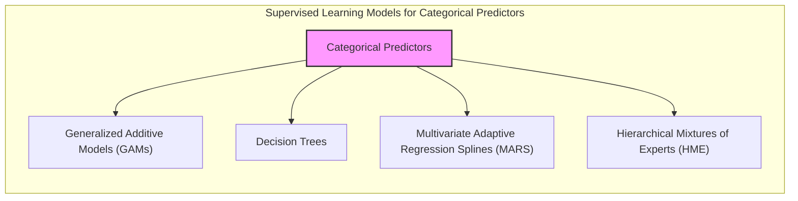
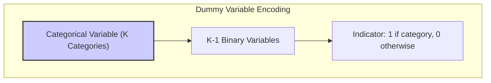
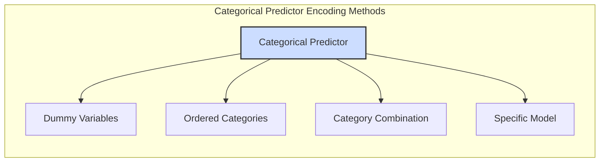
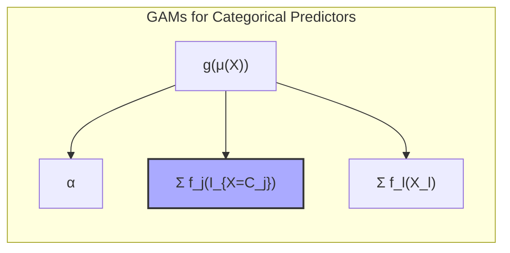
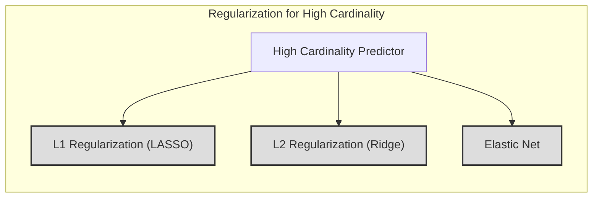

## Título: Modelos Aditivos, Árvores e Métodos Relacionados: Lidar com Preditores Categóricos e Sua Influência na Modelagem



### Introdução

Este capítulo explora como diferentes modelos de aprendizado supervisionado lidam com preditores categóricos, com foco em Modelos Aditivos Generalizados (GAMs), árvores de decisão, Multivariate Adaptive Regression Splines (MARS) e misturas hierárquicas de especialistas (HME) [^9.1]. Preditores categóricos representam variáveis com um número finito de categorias, e a forma como esses preditores são modelados é crucial para o desempenho e a interpretabilidade do modelo. O capítulo detalha como cada modelo lida com preditores categóricos, como a codificação de *dummy variables*, a ordenação de categorias, a criação de interações e como a escolha da abordagem influencia a forma como as variáveis são utilizadas na modelagem. O objetivo principal é apresentar uma visão aprofundada sobre o tratamento de preditores categóricos em modelos de aprendizado supervisionado e como os diferentes métodos abordam os desafios impostos por variáveis categóricas.

### Conceitos Fundamentais

**Conceito 1: Preditores Categóricos em Modelos Estatísticos**

Preditores categóricos representam variáveis com um número finito de categorias distintas. Ao contrário de preditores numéricos, preditores categóricos não possuem uma ordem ou magnitude inerente, e a sua modelagem requer a utilização de abordagens específicas. As categorias podem representar grupos, tipos, ou qualquer outra classificação não numérica. A modelagem de preditores categóricos em modelos lineares e não lineares requer atenção especial e uma escolha cuidadosa da abordagem de codificação e da modelagem adequada. A escolha da codificação dos preditores categóricos, portanto, deve ser feita considerando o tipo de modelo e os seus objetivos, pois esta escolha impacta diretamente como a variável categórica é utilizada na modelagem.

**Lemma 1:** *Preditores categóricos são variáveis não numéricas que representam grupos ou categorias. A modelagem dessas variáveis requer abordagens específicas para garantir que a sua natureza discreta seja adequadamente representada no modelo, e que as decisões de classificação sejam feitas com base em cada grupo e não em uma escala linear. O uso de codificação apropriada é fundamental em modelos estatísticos* [^4.5].

> 💡 **Exemplo Numérico:**
> Considere um conjunto de dados de imóveis onde uma das variáveis é o tipo de imóvel, com as categorias "Apartamento", "Casa" e "Sobrado". Esta é uma variável categórica. Em vez de usar os nomes diretamente em um modelo, precisamos codificá-la.
>  Se quisermos modelar o preço do imóvel usando um modelo linear, não podemos usar diretamente as categorias "Apartamento", "Casa" e "Sobrado". Precisamos transformar essa variável em variáveis numéricas.

**Conceito 2: Codificação de Preditores Categóricos: *Dummy Variables***

Uma abordagem comum para lidar com preditores categóricos é a utilização de *dummy variables*, ou variáveis indicadoras. Em vez de utilizar diretamente os nomes das categorias, cada categoria é transformada em uma variável binária. Por exemplo, para um preditor categórico com $K$ categorias, são criadas $K-1$ variáveis indicadoras, onde cada variável representa a presença (1) ou ausência (0) de uma determinada categoria. A omissão de uma categoria evita multicolinearidade, e a categoria omitida serve como referência. Essa abordagem permite que a variável categórica seja utilizada em modelos lineares, através da representação das categorias com números binários.



**Corolário 1:** *A codificação de preditores categóricos usando *dummy variables* permite representar as categorias como variáveis numéricas, o que as torna adequadas para modelagem em modelos lineares e não lineares. A escolha da categoria de referência e do número de variáveis é um detalhe importante na codificação* [^4.5.1].

> 💡 **Exemplo Numérico:**
> Usando o exemplo do tipo de imóvel, podemos criar *dummy variables*:
>
> | Tipo de Imóvel | Dummy_Casa | Dummy_Sobrado |
> |---------------|------------|--------------|
> | Apartamento   |      0     |       0      |
> | Casa          |      1     |       0      |
> | Sobrado       |      0     |       1      |
>
> Aqui, "Apartamento" é a categoria de referência. Se o imóvel for um Apartamento, ambas as *dummy variables* são 0. Se for uma Casa, `Dummy_Casa` é 1 e `Dummy_Sobrado` é 0, e vice-versa para Sobrado. O modelo linear usará esses valores numéricos para modelar o preço do imóvel.
>
> A criação das *dummy variables* pode ser feita usando Python e a biblioteca Pandas:
> ```python
> import pandas as pd
>
> data = {'Tipo_Imovel': ['Apartamento', 'Casa', 'Sobrado', 'Apartamento']}
> df = pd.DataFrame(data)
> df_dummies = pd.get_dummies(df, columns=['Tipo_Imovel'], drop_first=True)
> print(df_dummies)
> ```
> Este código produzirá uma saída similar a:
> ```
>    Tipo_Imovel_Casa  Tipo_Imovel_Sobrado
> 0                 0                   0
> 1                 1                   0
> 2                 0                   1
> 3                 0                   0
> ```
> O argumento `drop_first=True` remove a primeira categoria, evitando a multicolinearidade.

**Conceito 3: Abordagens para Preditores Categóricos em Modelos de Aprendizado Supervisionado**

*   **Modelos Aditivos Generalizados (GAMs):** Em GAMs, preditores categóricos são geralmente modelados utilizando funções indicadoras, e cada categoria é tratada como um preditor separado, com sua própria função não paramétrica.  A utilização de funções não paramétricas, para cada categoria, permite que o modelo seja flexível para modelar relações não lineares entre a resposta e cada categoria. Para preditores com muitas categorias, a utilização de técnicas de suavização é útil para evitar problemas de overfitting. A ordenação das categorias, ou algum tipo de similaridade entre categorias, também pode ser usada para agregar as categorias em grupos com comportamentos similares.
*   **Árvores de Decisão:** Em árvores de decisão, os preditores categóricos podem ser utilizados diretamente para a divisão dos nós. O algoritmo de árvores de decisão busca a melhor partição de categorias, sem a necessidade de codificação em *dummy variables*.  Para preditores categóricos com muitas categorias, a divisão dos nós pode ser feita ordenando as categorias com base em sua relação com a variável resposta e dividindo o preditor como se fosse numérico, através do critério de impureza.
*   **Multivariate Adaptive Regression Splines (MARS):** MARS lida com preditores categóricos criando um conjunto de funções base para cada categoria, utilizando funções indicadoras.  MARS permite a modelagem de não linearidades e interações entre as categorias e os outros preditores.
*   **Misturas Hierárquicas de Especialistas (HME):** HME modela a resposta utilizando modelos locais, onde cada especialista pode ter um comportamento específico em relação a cada categoria. HME pode lidar com preditores categóricos de forma flexível através da atribuição de diferentes modelos para diferentes grupos e regiões dos dados.

> ⚠️ **Nota Importante:** Modelos como GAMs, árvores de decisão, MARS e HME, oferecem abordagens diferentes para lidar com preditores categóricos, e a escolha da melhor abordagem depende da natureza dos dados, da necessidade de interpretabilidade e do objetivo da modelagem [^4.5.2].

> ❗ **Ponto de Atenção:** Preditores categóricos com muitas categorias podem levar a problemas de overfitting, e a utilização de métodos de regularização ou de redução da dimensionalidade podem ser necessários. A escolha do método de codificação também influencia na qualidade da modelagem [^4.4.4].

> ✔️ **Destaque:** A modelagem de preditores categóricos requer a utilização de técnicas específicas, e a escolha da abordagem adequada permite que esses preditores sejam utilizados de forma eficaz em modelos de aprendizado supervisionado [^4.4.5].

### Codificação de Preditores Categóricos: Dummy Variables, Ordenação de Categorias, e suas Implicações em Diferentes Modelos



A modelagem de preditores categóricos requer abordagens específicas para lidar com a natureza não numérica dessas variáveis. As principais abordagens de codificação e modelagem incluem:

1. **Dummy Variables:** A abordagem mais comum envolve a criação de *dummy variables* ou variáveis indicadoras. Para um preditor categórico com $K$ categorias, são criadas $K-1$ variáveis indicadoras binárias.  Cada variável indica a presença (1) ou ausência (0) de uma categoria específica, onde uma categoria serve como referência. Por exemplo, para a variável cor com categorias "vermelho", "azul" e "verde", seriam criadas duas variáveis: "azul" e "verde", onde "vermelho" serviria como categoria de referência.  Essa abordagem permite a utilização de preditores categóricos em modelos lineares, mas aumenta a dimensionalidade do problema. Em modelos aditivos, os preditores podem ser usados como funções não paramétricas individuais, ou modelos mais complexos como o HME podem ter diferentes modelos para cada categoria.
2. **Ordenação de Categorias:** Em alguns casos, as categorias podem ter uma ordem natural ou hierárquica. Nesses casos, as categorias podem ser ordenadas, e cada categoria pode ser representada por um valor numérico seguindo a ordem.  A ordenação das categorias permite que modelos como árvores de decisão tratem o preditor como uma variável ordinal, e a divisão dos nós pode ser feita utilizando essa ordenação. A ordenação é uma forma de utilizar uma escala para a variável categórica, o que pode aumentar a sua interpretabilidade.

> 💡 **Exemplo Numérico:**
> Considere um preditor categórico "Nível de Educação" com as categorias "Ensino Fundamental", "Ensino Médio", "Graduação" e "Pós-Graduação". Há uma ordem natural aqui, onde "Ensino Fundamental" < "Ensino Médio" < "Graduação" < "Pós-Graduação". Podemos codificar isso como 1, 2, 3 e 4, respectivamente. Em uma árvore de decisão, o algoritmo pode usar essa ordenação para dividir os nós. Por exemplo, um nó pode ser dividido em "Educação <= Ensino Médio" e "Educação > Ensino Médio".
>
> ```python
> education_mapping = {"Ensino Fundamental": 1, "Ensino Médio": 2, "Graduação": 3, "Pós-Graduação": 4}
> data = {'Nivel_Educacao': ["Ensino Fundamental", "Ensino Médio", "Graduação", "Pós-Graduação"]}
> df = pd.DataFrame(data)
> df['Nivel_Educacao_Ordinal'] = df['Nivel_Educacao'].map(education_mapping)
> print(df)
> ```
> Este código produzirá uma saída similar a:
> ```
>      Nivel_Educacao  Nivel_Educacao_Ordinal
> 0  Ensino Fundamental                     1
> 1       Ensino Médio                     2
> 2         Graduação                     3
> 3    Pós-Graduação                     4
> ```

3. **Combinação de Categorias:** Em preditores categóricos com muitas categorias, a combinação de algumas categorias em grupos pode simplificar o modelo e reduzir o problema da alta dimensionalidade.  A combinação de categorias pode ser feita através de métodos como análise de similaridade ou conhecimento prévio sobre os dados.  A criação de novas categorias também pode ser feita usando abordagens específicas, o que gera modelos mais parcimoniosos e com uma melhor capacidade de generalização.
4. **Modelagem Específica:** Em modelos mais complexos como HME, cada categoria pode ser modelada com um modelo específico, que pode variar dependendo da natureza do modelo. A utilização de diferentes modelos para diferentes categorias pode gerar modelos com maior capacidade de captura de não linearidades, e os resultados podem ser mais precisos. A escolha do tipo de modelagem deve considerar o balanço entre a capacidade de ajuste e a interpretabilidade do modelo.

A escolha da abordagem de codificação depende do modelo que será utilizado e da natureza do preditor categórico. Em GAMs, a utilização de funções indicadoras permite a modelagem de relações não lineares para cada categoria, e a escolha da função não paramétrica pode depender da natureza do preditor e do tipo de modelagem que se pretende. As árvores de decisão são mais flexíveis, e podem lidar com preditores categóricos de forma direta, utilizando abordagens baseadas em impureza. Em MARS, as categorias podem ser modeladas utilizando *splines*, e no HME, cada categoria pode utilizar modelos diferentes.

**Lemma 3:** *A codificação de preditores categóricos é fundamental para a sua modelagem em modelos estatísticos. As abordagens como *dummy variables*, ordenação de categorias e suas combinações permitem que os modelos utilizem as variáveis categóricas de forma eficiente. A escolha da abordagem adequada depende do tipo de modelo e da natureza dos dados* [^4.5.1].

### A Utilização de Preditores Categóricos em GAMs, Árvores de Decisão e MARS

*   **GAMs:** Em GAMs, preditores categóricos são modelados através da criação de funções indicadoras para cada categoria e modelagem de cada categoria com uma função não paramétrica, como em:
    $$
      g(\mu(X)) = \alpha + \sum_{j=1}^K f_j(I_{X=C_j}) +  \sum_{l=1}^p f_l(X_l)
     $$

    onde  $I_{X=C_j}$ é a função indicadora para categoria $C_j$, e $f_{j}$ é uma função não paramétrica associada à categoria, e $f_l$ são as funções para preditores contínuos, e $g$ é uma função de ligação. Os preditores categóricos são modelados com suas funções não lineares específicas, com um parâmetro de suavização associado a cada função não paramétrica, o que aumenta a flexibilidade dos modelos GAMs para preditores categóricos.



> 💡 **Exemplo Numérico:**
> Suponha que estamos modelando o salário de uma pessoa ($Y$) com base em seu nível de educação (categórico, com as categorias "Ensino Fundamental", "Ensino Médio", "Graduação" e "Pós-Graduação") e anos de experiência (contínuo, $X_1$). Um modelo GAM poderia ser:
>
> $g(\mu(X)) = \alpha + f_{EF}(I_{Educação = "Ensino Fundamental"}) + f_{EM}(I_{Educação = "Ensino Médio"}) + f_{G}(I_{Educação = "Graduação"}) + f_{PG}(I_{Educação = "Pós-Graduação"}) + f_1(X_1)$
>
> Aqui, $g$ poderia ser a função identidade (para regressão linear) ou a função logit (para regressão logística). As funções $f_{EF}, f_{EM}, f_{G}, f_{PG}$ são funções não paramétricas (splines, por exemplo) que modelam o efeito de cada nível de educação no salário. $f_1$ é a função não paramétrica para anos de experiência. O modelo permite que cada nível de educação tenha um efeito diferente e não linear no salário, ao invés de impor uma relação linear e única.

*   **Árvores de Decisão:** Árvores de decisão podem lidar com preditores categóricos de forma direta, utilizando os valores das categorias para criar as divisões dos nós. O processo de escolha da melhor divisão é feito com base na métrica de impureza, como o índice de Gini ou entropia, e as categorias são utilizadas para a partição do espaço de características, o que é feito de forma iterativa. Para muitas categorias, a árvore utiliza uma ordenação para a divisão dos nós, e a decisão é guiada pelo critério de impureza.

> 💡 **Exemplo Numérico:**
>  Considere uma árvore de decisão para prever se um cliente vai comprar um produto. Um dos preditores é a "Cor do Produto", com categorias "Vermelho", "Azul", e "Verde". A árvore pode dividir o nó inicial em três ramos, um para cada cor, usando o critério de impureza (e.g., Gini) para determinar qual divisão maximiza a pureza dos nós filhos.
>
> ```mermaid
> graph LR
>     A[Início] -->|Cor = Vermelho| B(Nó Vermelho)
>     A -->|Cor = Azul| C(Nó Azul)
>     A -->|Cor = Verde| D(Nó Verde)
> ```
>
> Se a variável categórica tiver muitas categorias, a árvore pode usar um critério de ordenação. Por exemplo, se a variável fosse "Cidade" com muitas opções, a árvore poderia ordenar as cidades com base na taxa de conversão de compra e criar divisões com base nessa ordenação, como "Taxa de Conversão <= 0.2" e "Taxa de Conversão > 0.2".

*   **MARS:** Em MARS, os preditores categóricos são utilizados para construir funções *spline* lineares por partes com base em suas categorias. Cada categoria pode ter uma função de *spline* diferente e as interações com preditores contínuos também são modeladas utilizando combinações dos termos *spline* e dos preditores categóricos. MARS oferece uma abordagem flexível para modelar as relações entre preditores categóricos e a resposta.

> 💡 **Exemplo Numérico:**
> Suponha que estamos modelando a satisfação do cliente ($Y$) com base em seu tipo de produto (categórico, com categorias "Eletrônicos", "Livros", "Roupas") e preço (contínuo, $X_1$). MARS pode criar funções base para cada categoria, como:
>
> $Y = \alpha + \beta_1 h_1(X_1) + \beta_2 h_2(X_1)I_{Produto = "Eletrônicos"} + \beta_3 h_3(X_1)I_{Produto = "Livros"} + \beta_4 h_4(X_1)I_{Produto = "Roupas"}$
>
> Aqui, $h_1(X_1), h_2(X_1), h_3(X_1), h_4(X_1)$ são funções *spline* lineares por partes. Cada categoria de produto pode ter um efeito diferente sobre a satisfação do cliente, e esse efeito pode variar com o preço.

###  A Escolha da Codificação e sua Influência na Interpretabilidade dos Resultados

A escolha da codificação dos preditores categóricos afeta a interpretação dos resultados do modelo.  Com *dummy variables*, a interpretação dos coeficientes é feita em relação à categoria de referência. Em árvores de decisão, as variáveis categóricas definem as decisões de divisão dos nós.  Em modelos MARS e HME, a interpretação dos coeficientes é mais complexa, pois os preditores categóricos podem interagir com outros preditores. A escolha da forma de modelar as variáveis categóricas, portanto, influencia na sua capacidade de interpretação e de obter informações relevantes sobre o processo de modelagem.

### Perguntas Teóricas Avançadas: Como a cardinalidade (número de categorias) de um preditor categórico afeta a estabilidade, a convergência e a interpretabilidade dos modelos aditivos, e como diferentes métodos de regularização ou seleção de variáveis podem mitigar os problemas causados por preditores com alta cardinalidade?

**Resposta:**

A cardinalidade de um preditor categórico, ou seja, o número de categorias que a variável possui, tem um impacto significativo na estabilidade, convergência e interpretabilidade dos modelos aditivos, especialmente em Modelos Aditivos Generalizados (GAMs).

Preditores categóricos com alta cardinalidade podem levar a vários problemas:
*   **Overfitting:** Modelos podem se ajustar muito aos dados de treinamento e apresentar um desempenho ruim para dados novos. A modelagem separada de cada categoria pode resultar em modelos com muitos parâmetros e levar ao overfitting.
*   **Instabilidade:** Os parâmetros dos modelos podem ser muito variáveis e com pouca estabilidade, devido ao pequeno número de observações em algumas categorias, o que leva a modelos com problemas de convergência.
*   **Dificuldade de Interpretação:** Modelos com muitos parâmetros podem ser difíceis de interpretar, e é difícil entender o impacto de cada categoria na resposta, mesmo que o modelo seja preciso.

Para mitigar esses problemas, diferentes abordagens podem ser utilizadas:

*   **Regularização:**  A aplicação de métodos de regularização como L1 (LASSO) ou L2 (Ridge) pode controlar a complexidade do modelo e reduzir a variabilidade dos estimadores. A regularização L1 promove a esparsidade e leva a modelos mais simples.  A regularização L2 reduz a magnitude dos parâmetros e estabiliza o modelo. A utilização de Elastic Net permite combinar as duas abordagens.



> 💡 **Exemplo Numérico:**
> Suponha que temos um modelo GAM para prever o preço de um carro ($Y$) com base na marca do carro (categórico, com muitas categorias) e anos de uso (contínuo, $X_1$).
>
> $g(\mu(X)) = \alpha + \sum_{j=1}^K f_j(I_{Marca = C_j}) + f_1(X_1)$
>
> Se houver muitas marcas de carro, o modelo pode ter muitos parâmetros (um $f_j$ para cada marca). Para regularizar o modelo, podemos usar a regularização L2, adicionando um termo de penalidade à função de custo:
>
> $PRSS = \sum_i (y_i - \hat{y}_i)^2 + \lambda \sum_{j=1}^K \int (f_j''(t_j))^2 dt_j$
>
> Onde $\lambda$ é o parâmetro de regularização que controla a complexidade dos parâmetros, evitando o overfitting.
>
> Alternativamente, podemos usar a regularização L1, que pode zerar os coeficientes de algumas marcas, realizando uma seleção de variáveis e criando um modelo mais parcimonioso.

*  **Seleção de Variáveis:** Métodos de seleção de variáveis podem ser usados para escolher os preditores mais relevantes e remover preditores com baixa capacidade preditiva ou com multicolinearidade. A seleção de variáveis reduz a dimensionalidade do problema e facilita a interpretação dos resultados. Métodos como LASSO, *forward selection* e *backward selection* podem ser utilizados para esse propósito.
*   **Combinação de Categorias:** Categorias com comportamentos similares podem ser combinadas para formar novas categorias, o que reduz o número de parâmetros e melhora a estabilidade e interpretabilidade do modelo. A combinação pode ser feita com base no conhecimento prévio dos dados ou através de métodos como análise de similaridade.

> 💡 **Exemplo Numérico:**
> Se na variável "Marca do Carro" tivermos marcas como "Toyota Corolla", "Toyota Camry", "Honda Civic" e "Honda Accord", podemos agrupá-las nas categorias "Toyota" e "Honda", reduzindo o número de categorias e a complexidade do modelo. Isso é feito se as marcas dentro de cada grupo tiverem comportamentos similares em relação ao preço.

*   **Utilização de Hierarquias:** Quando as categorias podem ser agrupadas em níveis hierárquicos, a modelagem pode ser feita considerando essa hierarquia, o que pode simplificar o modelo e reduzir a dimensionalidade do problema.
*   **Suavização:** A utilização de suavizadores adequados para preditores categóricos pode reduzir o ruído nos dados e garantir a estabilidade da modelagem.

A escolha da melhor abordagem depende da natureza dos dados e do objetivo da modelagem.  A utilização combinada desses métodos pode gerar modelos mais robustos, estáveis e com boa capacidade de generalização. A cardinalidade dos preditores categóricos é um aspecto importante na construção dos modelos de aprendizado supervisionado, e deve ser considerada durante o processo de modelagem.

**Lemma 5:** *A cardinalidade de um preditor categórico afeta a estabilidade, a convergência e a interpretabilidade dos modelos aditivos.  A utilização de técnicas de regularização e seleção de variáveis é importante para lidar com preditores com alta cardinalidade*. A escolha do método de regularização e da modelagem deve considerar a cardinalidade dos preditores [^4.5].

**Corolário 5:** *A utilização de regularização e seleção de variáveis, em conjunto com o conhecimento sobre a hierarquia das categorias, e com outras técnicas como a combinação de categorias e métodos de suavização, permite criar modelos com boa capacidade de generalização e com interpretabilidade mesmo em presença de preditores categóricos com alta cardinalidade*. A escolha das ferramentas de modelagem deve ser feita cuidadosamente para que os modelos se adaptem bem aos dados [^4.4.5].

> ⚠️ **Ponto Crucial:**  Preditores categóricos com alta cardinalidade podem gerar modelos com muitos parâmetros, com baixo desempenho e com baixa interpretabilidade.  A utilização de regularização, seleção de variáveis e a combinação de categorias é fundamental para obter modelos robustos e com um bom balanço entre a complexidade e a capacidade de generalização. A cardinalidade dos preditores é um componente importante do processo de modelagem estatística [^4.4.1].

### Conclusão

Este capítulo explorou como modelos de aprendizado supervisionado lidam com preditores categóricos, com foco em GAMs, árvores de decisão, MARS e HME.  A codificação de *dummy variables*, a ordenação de categorias, e as suas implicações em diferentes modelos, e como a escolha da modelagem influencia a interpretabilidade, estabilidade e desempenho dos modelos foi abordada em detalhes. A compreensão das abordagens para lidar com preditores categóricos é fundamental para a construção de modelos precisos, robustos e com boa capacidade de generalização, e como essas escolhas são realizadas em modelos estatísticos.

### Footnotes

[^4.1]: "In this chapter we begin our discussion of some specific methods for super-vised learning. These techniques each assume a (different) structured form for the unknown regression function, and by doing so they finesse the curse of dimensionality. Of course, they pay the possible price of misspecifying the model, and so in each case there is a tradeoff that has to be made." *(Trecho de "Additive Models, Trees, and Related Methods")*

[^4.2]: "Regression models play an important role in many data analyses, providing prediction and classification rules, and data analytic tools for understand-ing the importance of different inputs." *(Trecho de "Additive Models, Trees, and Related Methods")*

[^4.3]: "In this section we describe a modular algorithm for fitting additive models and their generalizations. The building block is the scatterplot smoother for fitting nonlinear effects in a flexible way. For concreteness we use as our scatterplot smoother the cubic smoothing spline described in Chapter 5." *(Trecho de "Additive Models, Trees, and Related Methods")*

[^4.3.1]:  "The additive model has the form $Y = \alpha + \sum_{j=1}^p f_j(X_j) + \varepsilon$, where the error term $\varepsilon$ has mean zero." * (Trecho de "Additive Models, Trees, and Related Methods")*

[^4.3.2]:   "Given observations $x_i, y_i$, a criterion like the penalized sum of squares (5.9) of Section 5.4 can be specified for this problem, $PRSS(\alpha, f_1, f_2,\ldots, f_p) = \sum_{i=1}^N (y_i - \alpha - \sum_{j=1}^p f_j(x_{ij}))^2 + \sum_{j=1}^p \lambda_j \int(f_j''(t_j))^2 dt_j$" * (Trecho de "Additive Models, Trees, and Related Methods")*

[^4.3.3]: "where the $\lambda_j > 0$ are tuning parameters. It can be shown that the minimizer of (9.7) is an additive cubic spline model; each of the functions $f_j$ is a cubic spline in the component $X_j$, with knots at each of the unique values of $x_{ij}, i = 1,\ldots, N$." *(Trecho de "Additive Models, Trees, and Related Methods")*

[^4.4]: "For two-class classification, recall the logistic regression model for binary data discussed in Section 4.4. We relate the mean of the binary response $\mu(X) = Pr(Y = 1|X)$ to the predictors via a linear regression model and the logit link function:  $log(\mu(X)/(1 – \mu(X)) = \alpha + \beta_1 X_1 + \ldots + \beta_pX_p$." * (Trecho de "Additive Models, Trees, and Related Methods")*

[^4.4.1]: "The additive logistic regression model replaces each linear term by a more general functional form: $log(\mu(X)/(1 – \mu(X))) = \alpha + f_1(X_1) + \cdots + f_p(X_p)$, where again each $f_j$ is an unspecified smooth function." * (Trecho de "Additive Models, Trees, and Related Methods")*

[^4.4.2]: "While the non-parametric form for the functions $f_j$ makes the model more flexible, the additivity is retained and allows us to interpret the model in much the same way as before. The additive logistic regression model is an example of a generalized additive model." *(Trecho de "Additive Models, Trees, and Related Methods")*

[^4.4.3]: "In general, the conditional mean $\mu(X)$ of a response Y is related to an additive function of the predictors via a link function g:  $g[\mu(X)] = \alpha + f_1(X_1) + \cdots + f_p(X_p)$." *(Trecho de "Additive Models, Trees, and Related Methods")*

[^4.4.4]:  "Examples of classical link functions are the following: $g(\mu) = \mu$ is the identity link, used for linear and additive models for Gaussian response data." *(Trecho de "Additive Models, Trees, and Related Methods")*

[^4.4.5]: "$g(\mu) = logit(\mu)$ as above, or $g(\mu) = probit(\mu)$, the probit link function, for modeling binomial probabilities. The probit function is the inverse Gaussian cumulative distribution function: $probit(\mu) = \Phi^{-1}(\mu)$." *(Trecho de "Additive Models, Trees, and Related Methods")*

[^4.5]: "All three of these arise from exponential family sampling models, which in addition include the gamma and negative-binomial distributions. These families generate the well-known class of generalized linear models, which are all extended in the same way to generalized additive models." *(Trecho de "Additive Models, Trees, and Related Methods")*

[^4.5.1]: "The functions $f_j$ are estimated in a flexible manner, using an algorithm whose basic building block is a scatterplot smoother. The estimated func-tion $f_j$ can then reveal possible nonlinearities in the effect of $X_j$. Not all of the functions $f_j$ need to be nonlinear." *(Trecho de "Additive Models, Trees, and Related Methods")*

[^4.5.2]: "We can easily mix in linear and other parametric forms with the nonlinear terms, a necessity when some of the inputs are qualitative variables (factors)." *(Trecho de "Additive Models, Trees, and Related Methods")*
