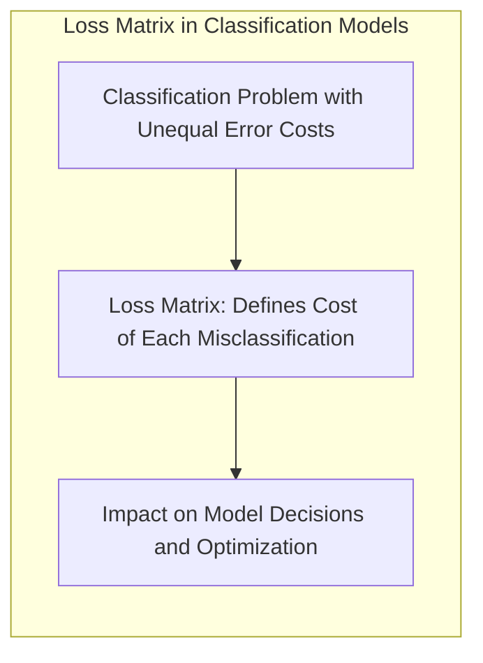
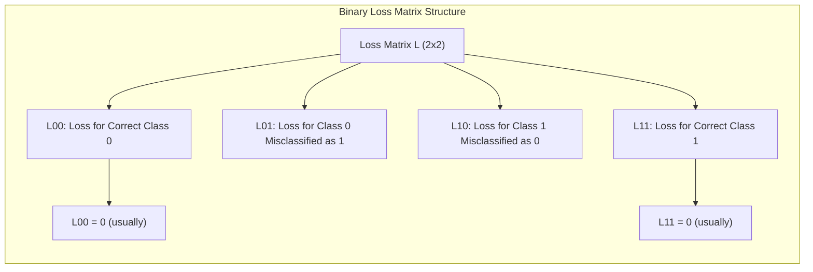
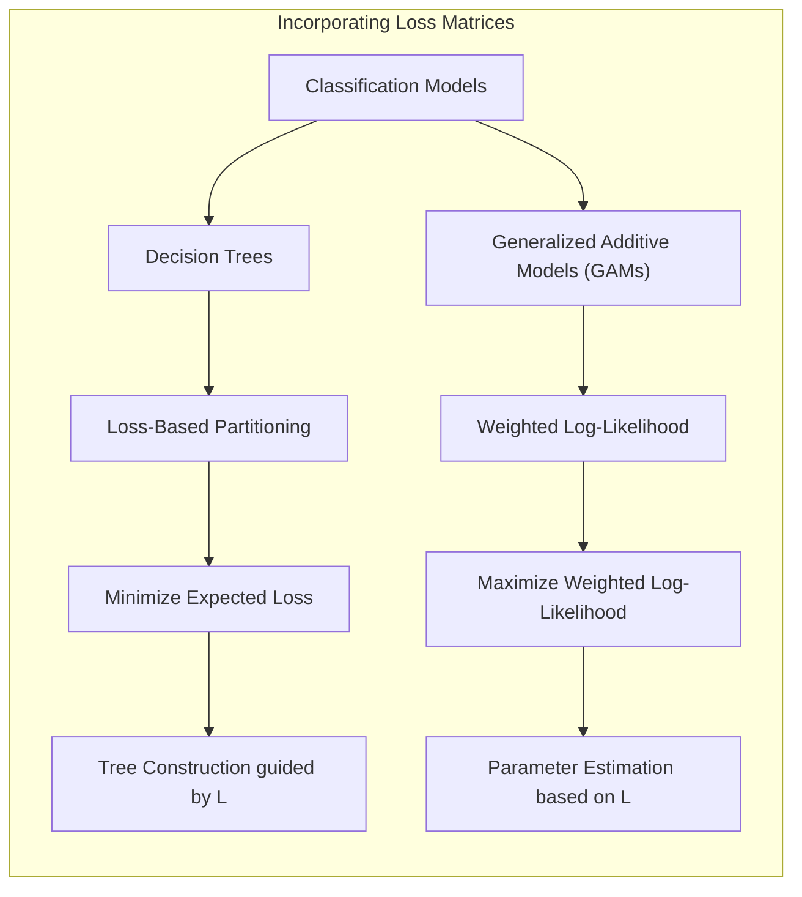
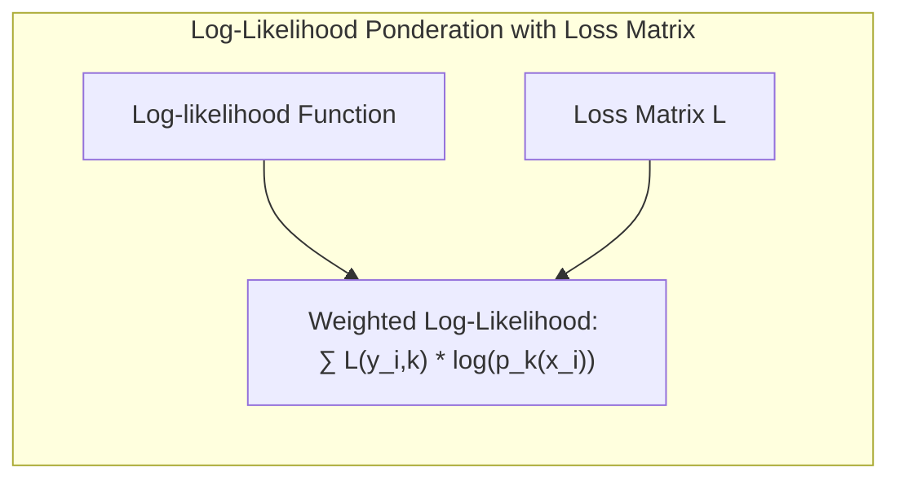
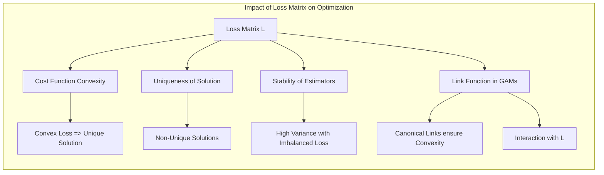

## Título: Modelos Aditivos, Árvores e Métodos Relacionados: Uso de Matrizes de Perdas e Consequências da Classificação Errada

### Introdução

Este capítulo explora a utilização de matrizes de perdas em modelos de classificação, detalhando como diferentes perdas podem ser atribuídas a diferentes tipos de erros de classificação e como essas matrizes influenciam as decisões do modelo e a sua otimização [^9.1]. Em muitos problemas de classificação, os erros de classificação não têm o mesmo impacto, e algumas classificações incorretas são mais sérias do que outras. A utilização de uma matriz de perdas permite que o modelo leve em consideração a importância relativa de diferentes tipos de erros. O capítulo detalha como as matrizes de perdas podem ser incorporadas em modelos baseados em árvores de decisão, modelos aditivos generalizados (GAMs) e como essas matrizes são utilizadas para tomar decisões de classificação e guiar o processo de otimização dos modelos. O objetivo principal é apresentar uma visão aprofundada sobre a utilização de matrizes de perdas em modelos de aprendizado supervisionado, e como elas podem levar a modelos mais robustos e adequados a cada problema de classificação.

### Conceitos Fundamentais

**Conceito 1: A Necessidade de Matrizes de Perdas em Classificação**

Em muitos problemas de classificação, os erros de classificação não têm o mesmo impacto prático. Por exemplo, em um problema de diagnóstico médico, classificar um paciente doente como saudável (falso negativo) pode ter consequências mais sérias do que classificar um paciente saudável como doente (falso positivo). Em problemas de detecção de fraudes, classificar uma transação fraudulenta como legítima pode ter um impacto financeiro maior que classificar uma transação legítima como fraudulenta. A utilização de uma matriz de perdas permite que o modelo leve em consideração a importância relativa de diferentes tipos de erros de classificação e que o processo de otimização seja guiado para minimizar o custo total da classificação. Modelos que não levam em consideração os diferentes tipos de erro podem ter um desempenho ruim em aplicações reais, e a utilização de matrizes de perdas é fundamental quando há diferentes custos associados à classificação errada.

> 💡 **Exemplo Numérico:**
> Imagine um sistema de detecção de spam. Classificar um e-mail legítimo como spam (falso positivo) pode causar inconveniência ao usuário, mas classificar um e-mail de spam como legítimo (falso negativo) pode levar a golpes e perdas financeiras. Uma matriz de perdas poderia atribuir um custo de 1 ao falso positivo e um custo de 10 ao falso negativo. Isso forçaria o modelo a priorizar a redução de falsos negativos.
>
> |            | Predito: Legítimo | Predito: Spam |
> |------------|-------------------|--------------|
> | Real: Legítimo | 0               | 1            |
> | Real: Spam   | 10              | 0            |

**Lemma 1:** *A utilização de matrizes de perdas permite que modelos de classificação levem em consideração a importância relativa de diferentes tipos de erros. Em problemas onde os erros têm diferentes custos, a matriz de perdas é crucial para obter modelos com um bom desempenho*. A matriz de perdas é uma ferramenta essencial na modelagem de problemas de classificação [^4.5].

**Conceito 2: Matriz de Perdas e seus Componentes**

Uma matriz de perdas $L$ é uma matriz $K \times K$, onde $K$ é o número de classes, onde $L_{kk'}$ representa a perda incorrida ao classificar uma observação da classe $k$ como classe $k'$. Na diagonal, $L_{kk} = 0$ representa a classificação correta, o que não gera nenhuma perda. Para um problema de classificação binária, a matriz de perdas é uma matriz $2 \times 2$:
$$
L = \begin{bmatrix}
L_{00} & L_{01} \\
L_{10} & L_{11}
\end{bmatrix}
=
\begin{bmatrix}
0 & L_{01} \\
L_{10} & 0
\end{bmatrix}
$$

onde $L_{01}$ representa a perda por classificar uma observação da classe 0 como classe 1, e $L_{10}$ representa a perda por classificar uma observação da classe 1 como classe 0. Geralmente, $L_{00}=L_{11} = 0$, pois não há custo quando a classificação é correta. A definição dos valores das perdas, e sua utilização na modelagem, depende do contexto do problema e da importância relativa de cada tipo de erro. A escolha dos valores da matriz de perdas é fundamental para o bom desempenho do modelo e para que o modelo seja apropriado para o contexto de cada problema.

> 💡 **Exemplo Numérico:**
> Em um problema de classificação binária, como detecção de doenças, a matriz de perdas pode ser definida como:
> $$
> L = \begin{bmatrix}
> 0 & 5 \\
> 10 & 0
> \end{bmatrix}
> $$
> Aqui, $L_{01} = 5$ representa o custo de classificar um paciente saudável como doente (falso positivo), enquanto $L_{10} = 10$ representa o custo de classificar um paciente doente como saudável (falso negativo), que é considerado mais grave.

**Corolário 1:** *A matriz de perdas quantifica o custo de diferentes tipos de erros em problemas de classificação, e a escolha dos valores da matriz é feita com base no conhecimento do problema e no impacto de cada tipo de erro. A utilização de matrizes de perdas é importante para modelos mais adequados a aplicações reais* [^4.5].

**Conceito 3: Incorporação de Matrizes de Perdas em Modelos de Classificação**

*   **Árvores de Decisão:** Em árvores de decisão, a matriz de perdas pode ser utilizada para definir qual partição é melhor para a construção da árvore. O objetivo, neste caso, é encontrar divisões que minimizem a perda total, e o critério de impureza pode ser modificado para levar em consideração a matriz de perdas, ou o processo de *pruning* pode ser guiado pela matriz de perdas, de modo a criar uma árvore mais adequada para a necessidade do problema.
*   **Modelos Aditivos Generalizados (GAMs):** Em GAMs, a matriz de perdas pode ser incorporada na função de *log-likelihood*, de modo que o modelo maximize a *log-likelihood* ponderada pelos custos da matriz. O uso da função de *log-likelihood* ponderada pela matriz de perdas leva a modelos que consideram a importância de cada tipo de erro. Uma outra opção é a utilização de pesos nas observações, de modo que observações que representam um erro mais custoso tenham um peso maior no processo de otimização.

> ⚠️ **Nota Importante:** A utilização de matrizes de perdas permite que os modelos levem em consideração a importância relativa dos diferentes tipos de erro, o que pode melhorar o desempenho do modelo em aplicações práticas [^4.5.2].

> ❗ **Ponto de Atenção:** A escolha adequada dos valores da matriz de perdas é fundamental para o sucesso do modelo. Uma matriz de perdas inadequada pode levar a modelos que priorizam um tipo de erro, com resultados indesejados, o que significa que a matriz deve refletir as prioridades do problema em questão.

> ✔️ **Destaque:** A utilização de matrizes de perdas oferece uma abordagem para modelar cenários onde diferentes erros de classificação têm diferentes custos, e são uma ferramenta fundamental para construir modelos de classificação mais robustos e adequados para cada aplicação [^4.5.1].

### Métodos de Incorporação da Matriz de Perdas em Modelos de Classificação: Exemplos e Análise Matemática

A incorporação de matrizes de perdas em modelos de classificação altera a forma como as decisões são tomadas e a otimização dos parâmetros é realizada. Em árvores de decisão, a matriz de perdas pode ser utilizada para guiar a escolha da melhor partição:

1.  **Árvores de Decisão:** Em cada nó, o objetivo é escolher o preditor e o ponto de corte que minimizem a perda esperada, que é dada por:
    $$
    \text{Perda Esperada} = \sum_{k=1}^K \sum_{k'=1}^K  L_{kk'} p_k p_{k'|R}
    $$

    onde $p_k$ é a probabilidade a priori da classe $k$, e $p_{k'|R}$ é a probabilidade condicional da classe $k'$ dada a região $R$ definida pelo nó, onde $L_{kk'}$ é o elemento da matriz de perdas. O algoritmo busca minimizar a perda esperada, que considera o custo dos diferentes tipos de erro. A matriz de perdas é utilizada para modelar diferentes custos de classificação errada, e isso leva a árvores com decisões mais adequadas para cada tipo de problema.

    > 💡 **Exemplo Numérico:**
    > Suponha que temos um problema de classificação binária com duas classes (0 e 1) e uma matriz de perdas:
    > $$
    > L = \begin{bmatrix}
    > 0 & 2 \\
    > 5 & 0
    > \end{bmatrix}
    > $$
    > No processo de construção da árvore, em um nó específico, temos as seguintes probabilidades:
    > - $p_0 = 0.6$ (probabilidade a priori da classe 0)
    > - $p_1 = 0.4$ (probabilidade a priori da classe 1)
    >
    > Considere duas possíveis partições (R1 e R2) e suas probabilidades condicionais:
    >
    > **Partição R1:**
    > - $p_{0|R1} = 0.8$ (probabilidade de classe 0 em R1)
    > - $p_{1|R1} = 0.2$ (probabilidade de classe 1 em R1)
    >
    > **Partição R2:**
    > - $p_{0|R2} = 0.3$ (probabilidade de classe 0 em R2)
    > - $p_{1|R2} = 0.7$ (probabilidade de classe 1 em R2)
    >
    > **Cálculo da Perda Esperada para R1:**
    > $PE_{R1} = (0 * 0.6 * 0.8) + (2 * 0.6 * 0.2) + (5 * 0.4 * 0.8) + (0 * 0.4 * 0.2) = 0 + 0.24 + 1.6 + 0 = 1.84$
    >
    > **Cálculo da Perda Esperada para R2:**
    > $PE_{R2} = (0 * 0.6 * 0.3) + (2 * 0.6 * 0.7) + (5 * 0.4 * 0.3) + (0 * 0.4 * 0.7) = 0 + 0.84 + 0.6 + 0 = 1.44$
    >
    > A partição R2, com uma perda esperada menor (1.44), seria preferida pela árvore de decisão.

2.  **Modelos Aditivos Generalizados (GAMs):** Em GAMs, a matriz de perdas é utilizada para ponderar a *log-likelihood*:

    $$
    \text{log-likelihood ponderada} = \sum_{i=1}^N  \sum_{k=1}^K  L_{y_i,k} \log(p_k(x_i))
    $$

    onde $y_i$ é a classe verdadeira da observação $i$, $p_k(x_i)$ é a probabilidade do modelo da observação pertencer à classe $k$, e $L_{y_i,k}$ é o valor da perda quando uma observação da classe $y_i$ é classificada como classe $k$. A maximização da *log-likelihood* ponderada leva a modelos que levam em consideração o custo dos diferentes tipos de erro.

    > 💡 **Exemplo Numérico:**
    > Suponha um modelo GAM para classificação binária com duas classes (0 e 1), e a seguinte matriz de perdas:
    > $$
    > L = \begin{bmatrix}
    > 0 & 3 \\
    > 7 & 0
    > \end{bmatrix}
    > $$
    > Para uma observação $i$, se a classe verdadeira for $y_i = 1$ e o modelo GAM fornecer as probabilidades $p_0(x_i) = 0.2$ e $p_1(x_i) = 0.8$, a *log-likelihood* ponderada para esta observação seria:
    >
    > $\text{log-likelihood ponderada}_i = L_{10} * \log(p_0(x_i)) + L_{11} * \log(p_1(x_i)) = 7 * \log(0.2) + 0 * \log(0.8) = 7 * (-1.609) + 0 = -11.263$
    >
    > Se a classe verdadeira fosse $y_i = 0$, e as probabilidades fossem as mesmas, a *log-likelihood* ponderada seria:
    >
    > $\text{log-likelihood ponderada}_i = L_{00} * \log(p_0(x_i)) + L_{01} * \log(p_1(x_i)) = 0 * \log(0.2) + 3 * \log(0.8) = 0 + 3 * (-0.223) = -0.669$
    >
    > O modelo GAM ajustaria seus parâmetros para maximizar a soma dessas *log-likelihoods* ponderadas, dando mais peso aos erros mais custosos (falsos negativos, neste exemplo).

Uma alternativa, utilizada frequentemente com modelos de classificação binária, é ponderar as observações pela perda, de modo que observações com custo maior têm um peso maior durante o processo de otimização. A função de custo neste caso é dada por:

   $$
  \text{PRSS} =  \sum_{i=1}^N  w_i(y_i - \hat{y}_i)^2
  $$
onde o peso $w_i$ pode ser baseado na matriz de perdas e depende da classe da observação. Em modelos de máxima verossimilhança, o ajuste dos parâmetros é realizado maximizando a *log-likelihood* ponderada com a matriz de perdas.

**Lemma 4:** *A matriz de perdas é incorporada nos modelos de classificação de forma a levar em consideração o custo dos erros de classificação, e a sua utilização modifica a função de custo e o critério de escolha das partições ou parâmetros dos modelos. O processo de otimização, portanto, busca minimizar o custo total e não apenas o erro de classificação, o que leva a modelos mais adequados para cada aplicação* [^4.5.2].

### Modelos Lineares Generalizados e a Incorporação de Matrizes de Perdas

Em modelos lineares generalizados (GLMs), a matriz de perdas é utilizada para ponderar a função de verossimilhança, de forma similar aos GAMs, e a otimização é feita maximizando a verossimilhança ponderada. Para modelos lineares, com um número limitado de parâmetros, o impacto da matriz de perdas é mais direto. Para modelos lineares com penalização, a penalização é feita em relação ao termo da combinação linear dos preditores, e os parâmetros de regularização também podem ser ajustados com base na matriz de perdas. Modelos da família exponencial, com funções de ligação canônicas, permitem que as matrizes de perda sejam usadas de forma mais eficiente, devido à conexão direta entre a função de ligação e a distribuição dos dados.

### Implicações da Matriz de Perdas nas Decisões de Classificação e no Desempenho dos Modelos

A utilização de matrizes de perdas afeta as decisões de classificação dos modelos, e também a sua capacidade de generalização. O uso de matrizes de perdas adequadas para cada problema pode levar a resultados mais precisos e a modelos mais alinhados com os objetivos da modelagem. A escolha das perdas, portanto, deve considerar o contexto do problema, e as consequências dos diferentes tipos de erros. A utilização de matrizes de perdas pode aumentar a complexidade da otimização, mas pode levar a modelos mais adequados e que levam em consideração os custos das decisões.

### Perguntas Teóricas Avançadas: Como a matriz de perdas influencia a convexidade da função de custo, a unicidade da solução, e a estabilidade dos estimadores em modelos de classificação, e qual a relação com a função de ligação em Modelos Aditivos Generalizados (GAMs)?

**Resposta:**

A matriz de perdas tem um impacto significativo na convexidade da função de custo, na unicidade da solução e na estabilidade dos estimadores em modelos de classificação, especialmente em modelos como GAMs.

A utilização de uma matriz de perdas na modelagem de modelos de classificação altera a forma da função de custo, e a convexidade, ou não, da função de custo afeta a unicidade da solução e a estabilidade dos algoritmos de otimização. Funções de custo convexas garantem que a solução seja única e que os métodos de otimização encontrem o mínimo global. No entanto, a introdução de uma matriz de perdas pode tornar a função de custo não convexa. As funções de custo, quando ponderadas por matrizes de perda, têm o objetivo de minimizar o erro total e considerar o impacto diferente de cada erro de classificação.

A escolha dos valores da matriz de perdas influencia diretamente como a função de custo é modelada, e a convexidade da função, que também é dependente da função de ligação. A escolha de uma função de ligação canônica, para distribuições da família exponencial, geralmente garante que a função de custo seja côncava, mas a escolha de matrizes de perda que representam custos muito desbalanceados podem tornar a função de custo não convexa.

A unicidade da solução também é afetada pela matriz de perdas. A escolha de valores específicos na matriz pode fazer com que diferentes soluções gerem o mesmo valor da função de custo, e a escolha da matriz pode levar a modelos com parâmetros não identificáveis. A utilização de métodos de regularização e outras técnicas de escolha de modelos, podem ser usadas para mitigar esse problema.

A estabilidade dos estimadores também é influenciada pela matriz de perdas. Modelos com matrizes de perdas muito extremas podem levar a resultados com alta variância, ou seja, modelos menos estáveis e mais sensíveis aos dados de treinamento. Uma matriz de perdas balanceada permite que o modelo tenha um bom equilíbrio entre bias e variância. A escolha da matriz de perdas, portanto, deve considerar o objetivo da modelagem, o problema específico, e o *trade-off* entre o ajuste aos dados e a capacidade de generalização.

Em Modelos Aditivos Generalizados (GAMs), a matriz de perdas é utilizada em conjunto com a função de ligação, o que também afeta a convexidade da função de custo. A escolha da função de ligação canônica, derivada da família exponencial, garante que a função de custo seja razoavelmente bem comportada e que os estimadores tenham boas propriedades assintóticas. A interação entre a escolha da função de ligação, da matriz de perdas e dos suavizadores influencia as propriedades estatísticas do modelo.

**Lemma 5:** *A matriz de perdas influencia a convexidade da função de custo e a estabilidade da solução e dos estimadores. A escolha de matrizes de perdas com valores mais extremos pode levar a problemas de otimização. A interação da matriz de perdas com a escolha da função de ligação também tem um impacto nas propriedades estatísticas do modelo. A matriz de perdas deve ser utilizada com cuidado e considerando o seu efeito no modelo*. A convexidade da função de custo é um aspecto importante a ser considerado na construção de modelos estatísticos [^4.4.3].

**Corolário 5:** *A escolha da matriz de perdas afeta a forma da função de custo, e como o algoritmo de otimização encontra a melhor solução. A matriz de perdas influencia a convexidade da função de custo, a unicidade da solução, a estabilidade e as propriedades estatísticas dos estimadores. Em modelos aditivos, a matriz de perda interage com a função de ligação, o que afeta as propriedades do modelo final e sua capacidade de generalização*. A escolha adequada da matriz de perdas é crucial para a modelagem de dados com diferentes custos de classificação [^4.4.4].

> ⚠️ **Ponto Crucial**: A matriz de perdas é uma ferramenta poderosa para modelar diferentes custos de classificação, mas a sua utilização requer um entendimento sobre como ela influencia a convexidade da função de custo, a unicidade da solução, e a estabilidade dos estimadores. A utilização da matriz de perda também interage com a escolha da função de ligação, e a escolha apropriada desses componentes é fundamental para o modelo e para a obtenção dos resultados desejados [^4.4.5].

### Conclusão

Este capítulo explorou o conceito de matrizes de perdas em modelos de classificação, detalhando como elas quantificam os custos de diferentes tipos de erros e como elas influenciam a formulação de modelos e o processo de otimização. A discussão destacou a importância das matrizes de perdas para lidar com problemas de classificação onde os erros têm diferentes impactos, e a forma como a sua utilização afeta as decisões de classificação e o desempenho do modelo. A compreensão das matrizes de perdas e seu impacto nos modelos de classificação permite a construção de modelos mais adequados para aplicações reais.

### Footnotes

[^4.1]: "In this chapter we begin our discussion of some specific methods for super-vised learning. These techniques each assume a (different) structured form for the unknown regression function, and by doing so they finesse the curse of dimensionality. Of course, they pay the possible price of misspecifying the model, and so in each case there is a tradeoff that has to be made." *(Trecho de "Additive Models, Trees, and Related Methods")*

[^4.2]: "Regression models play an important role in many data analyses, providing prediction and classification rules, and data analytic tools for understand-ing the importance of different inputs." *(Trecho de "Additive Models, Trees, and Related Methods")*

[^4.3]: "In this section we describe a modular algorithm for fitting additive models and their generalizations. The building block is the scatterplot smoother for fitting nonlinear effects in a flexible way. For concreteness we use as our scatterplot smoother the cubic smoothing spline described in Chapter 5." *(Trecho de "Additive Models, Trees, and Related Methods")*

[^4.3.1]:  "The additive model has the form $Y = \alpha + \sum_{j=1}^p f_j(X_j) + \varepsilon$, where the error term $\varepsilon$ has mean zero." * (Trecho de "Additive Models, Trees, and Related Methods")*

[^4.3.2]:   "Given observations $x_i, y_i$, a criterion like the penalized sum of squares (5.9) of Section 5.4 can be specified for this problem, $\text{PRSS}(\alpha, f_1, f_2,..., f_p) = \sum_i^N (y_i - \alpha - \sum_j^p f_j(x_{ij}))^2 + \sum_j^p \lambda_j \int(f_j''(t_j))^2 dt_j$" * (Trecho de "Additive Models, Trees, and Related Methods")*

[^4.3.3]: "where the $\lambda_j > 0$ are tuning parameters. It can be shown that the minimizer of (9.7) is an additive cubic spline model; each of the functions $f_j$ is a cubic spline in the component $X_j$, with knots at each of the unique values of $x_{ij}, i = 1,..., N$." *(Trecho de "Additive Models, Trees, and Related Methods")*

[^4.4]: "For two-class classification, recall the logistic regression model for binary data discussed in Section 4.4. We relate the mean of the binary response $\mu(X) = \text{Pr}(Y = 1|X)$ to the predictors via a linear regression model and the logit link function:  $\log(\mu(X)/(1 – \mu(X)) = \alpha + \beta_1 X_1 + \ldots + \beta_pX_p$." * (Trecho de "Additive Models, Trees, and Related Methods")*

[^4.4.1]: "The additive logistic regression model replaces each linear term by a more general functional form: $\log(\mu(X)/(1 – \mu(X))) = \alpha + f_1(X_1) + \ldots + f_p(X_p)$, where again each $f_j$ is an unspecified smooth function." * (Trecho de "Additive Models, Trees, and Related Methods")*

[^4.4.2]: "While the non-parametric form for the functions $f_j$ makes the model more flexible, the additivity is retained and allows us to interpret the model in much the same way as before. The additive logistic regression model is an example of a generalized additive model." *(Trecho de "Additive Models, Trees, and Related Methods")*

[^4.4.3]: "In general, the conditional mean $\mu(X)$ of a response $Y$ is related to an additive function of the predictors via a link function $g$:  $g[\mu(X)] = \alpha + f_1(X_1) + \ldots + f_p(X_p)$." *(Trecho de "Additive Models, Trees, and Related Methods")*

[^4.4.4]:  "Examples of classical link functions are the following: $g(\mu) = \mu$ is the identity link, used for linear and additive models for Gaussian response data." *(Trecho de "Additive Models, Trees, and Related Methods")*

[^4.4.5]: "$g(\mu) = \text{logit}(\mu)$ as above, or $g(\mu) = \text{probit}(\mu)$, the probit link function, for modeling binomial probabilities. The probit function is the inverse Gaussian cumulative distribution function: $\text{probit}(\mu) = \Phi^{-1}(\mu)$." *(Trecho de "Additive Models, Trees, and Related Methods")*

[^4.5]: "All three of these arise from exponential family sampling models, which in addition include the gamma and negative-binomial distributions. These families generate the well-known class of generalized linear models, which are all extended in the same way to generalized additive models." *(Trecho de "Additive Models, Trees, and Related Methods")*

[^4.5.1]: "The functions $f_j$ are estimated in a flexible manner, using an algorithm whose basic building block is a scatterplot smoother. The estimated func-tion $f_j$ can then reveal possible nonlinearities in the effect of $X_j$. Not all of the functions $f_j$ need to be nonlinear." *(Trecho de "Additive Models, Trees, and Related Methods")*

[^4.5.2]: "We can easily mix in linear and other parametric forms with the nonlinear terms, a necessity when some of the inputs are qualitative variables (factors)." *(Trecho de "Additive Models, Trees, and Related Methods")*
