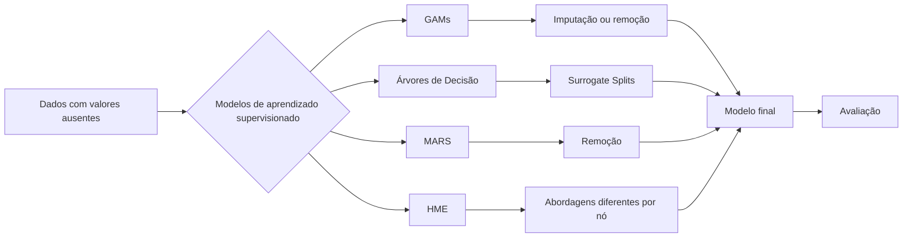
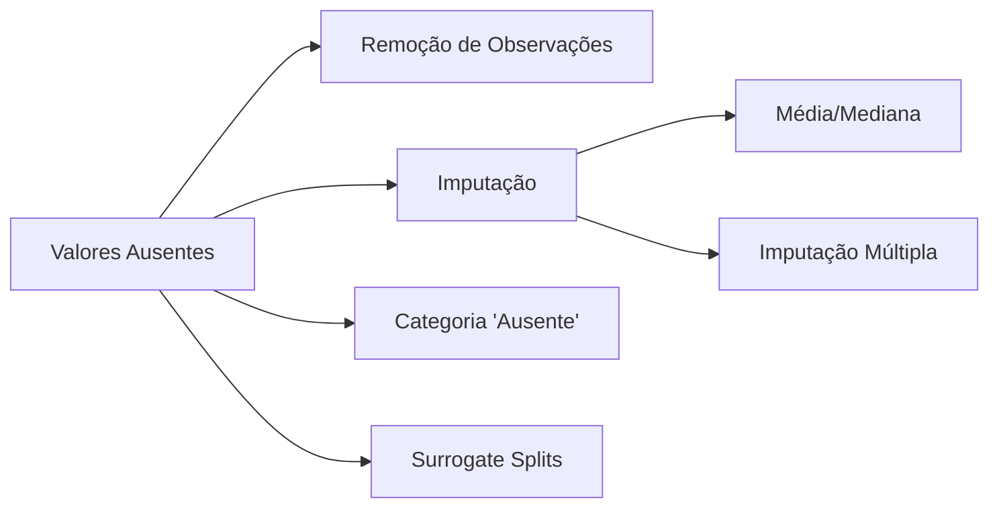
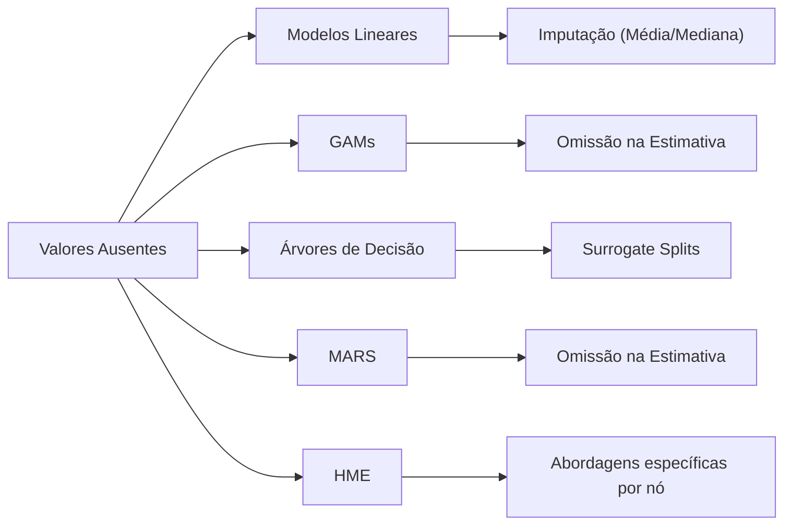
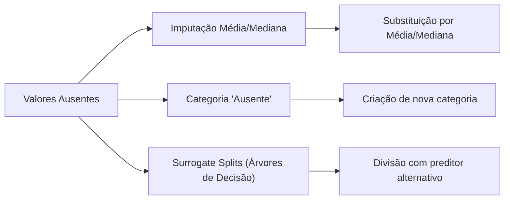
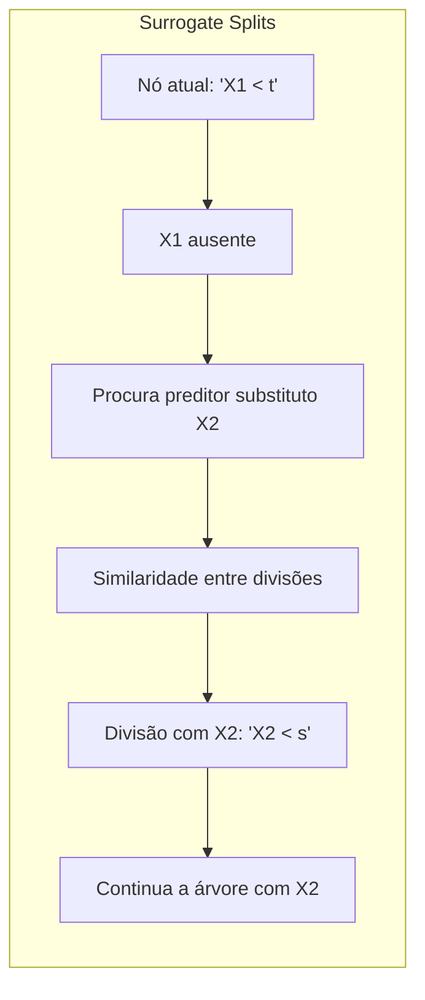
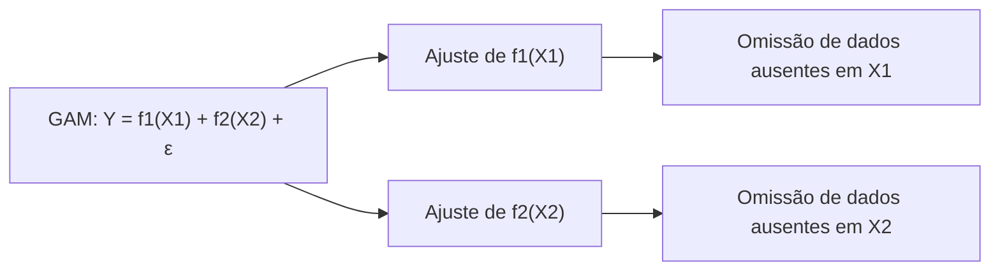
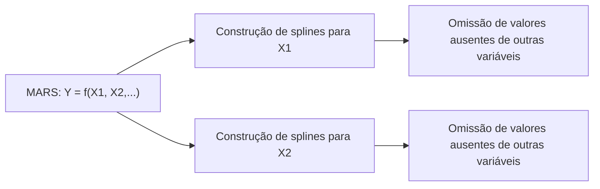
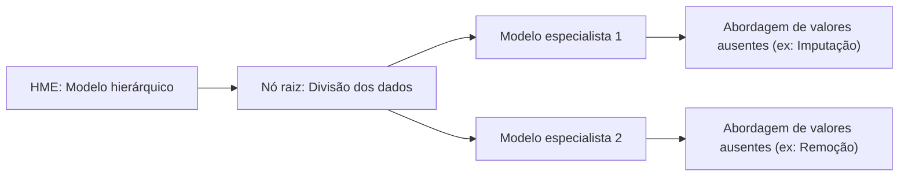
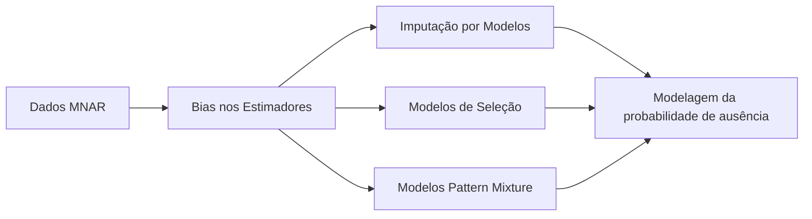

## Título: Modelos Aditivos, Árvores e Métodos Relacionados: Lidando com Valores Ausentes em Preditores



### Introdução

Este capítulo explora a questão dos valores ausentes em preditores e como diferentes modelos de aprendizado supervisionado lidam com este problema, incluindo Modelos Aditivos Generalizados (GAMs), árvores de decisão, Multivariate Adaptive Regression Splines (MARS) e misturas hierárquicas de especialistas (HME) [^9.1]. Valores ausentes são comuns em conjuntos de dados reais, e a forma como eles são tratados pode ter um impacto significativo no desempenho e na interpretabilidade dos modelos. O capítulo detalha abordagens como a imputação de dados faltantes, a criação de categorias para valores ausentes e a utilização de *surrogate splits* em árvores de decisão, e como cada um desses métodos interagem com as diferentes abordagens de modelagem. O objetivo principal é fornecer uma visão detalhada das abordagens mais utilizadas para lidar com valores ausentes e como estas escolhas afetam os resultados dos modelos.

### Conceitos Fundamentais

**Conceito 1: O Problema de Valores Ausentes em Preditores**

Valores ausentes em preditores são um problema comum em conjuntos de dados reais, e podem surgir por diferentes razões, como erros de coleta de dados, falta de informação ou indisponibilidade de medidas. A presença de valores ausentes pode introduzir *bias* nos modelos, reduzir a sua capacidade de generalização e dificultar a sua interpretação. A omissão de observações com valores ausentes pode levar à perda de informações importantes, especialmente em dados de alta dimensão. A utilização de abordagens adequadas para lidar com valores ausentes é fundamental para a construção de modelos robustos. A forma como os valores ausentes são tratados, portanto, influencia o desempenho e a interpretabilidade dos modelos de aprendizado.

**Lemma 1:** *Valores ausentes em preditores são comuns em conjuntos de dados reais, e podem levar a modelos com *bias*, menor capacidade de generalização e a perda de informações importantes. A escolha da abordagem apropriada para lidar com valores ausentes é crucial para a construção de modelos robustos e confiáveis*. Ignorar os valores ausentes ou usar métodos inadequados podem levar a resultados subótimos [^4.5].

**Conceito 2: Abordagens para Lidar com Valores Ausentes**

Existem diferentes abordagens para lidar com valores ausentes em preditores:

*   **Remoção de Observações:** A remoção de todas as observações que têm valores ausentes em algum preditor é a abordagem mais simples. No entanto, esta abordagem leva à perda de informação e pode reduzir significativamente o tamanho do conjunto de dados, especialmente em dados de alta dimensão.
*   **Imputação:** A imputação envolve substituir os valores ausentes por valores estimados. A imputação pode ser feita utilizando a média, a mediana, ou outros valores baseados nos dados disponíveis, o que pode evitar a perda de observações, mas pode introduzir *bias* no modelo. Métodos mais complexos, como a imputação múltipla, podem ser utilizados para criar múltiplos conjuntos de dados imputados, e a incerteza da imputação é incorporada na análise.
*   **Categoria "Ausente":** Para preditores categóricos, uma nova categoria "ausente" pode ser criada para as observações com valores faltantes. A modelagem da categoria "ausente" pode revelar um padrão específico relacionado à ausência dos dados, e pode, inclusive, ser utilizado como um preditor.
*  **Surrogate Splits (em árvores de decisão):** Em árvores de decisão, o conceito de *surrogate splits* é utilizado para lidar com valores ausentes. Ao escolher uma partição que minimize a impureza, a árvore também avalia outros preditores para serem usados no caso de uma observação ter valor ausente no preditor utilizado para a divisão.



A escolha da abordagem mais adequada depende do tipo de dados, do modelo utilizado e da quantidade de valores ausentes. A utilização de métodos mais sofisticados pode gerar modelos mais robustos e com melhor capacidade de generalização, mas pode aumentar a complexidade do modelo e do processo de modelagem.

> 💡 **Exemplo Numérico:**
>
> Considere um conjunto de dados com informações de clientes de um banco, onde uma das variáveis é a renda mensal (em reais) e outra é o estado civil (solteiro, casado, divorciado, ausente). Vamos supor que temos os seguintes dados:
>
> | Cliente ID | Renda Mensal | Estado Civil |
> |------------|--------------|--------------|
> | 1          | 2500         | Solteiro     |
> | 2          | 5000         | Casado       |
> | 3          | 10000        | Divorciado   |
> | 4          | NaN          | Casado       |
> | 5          | 3000         | Solteiro     |
> | 6          | NaN          | NaN          |
>
> *   **Remoção:** Se removermos as observações com valores ausentes, perderíamos os clientes 4 e 6, reduzindo o conjunto de dados em 33%.
> *   **Imputação (Média):** A renda média dos clientes com renda conhecida é (2500 + 5000 + 10000 + 3000) / 4 = 5125.  Substituiríamos os valores ausentes de renda por 5125.
> *   **Imputação (Mediana):** A mediana da renda conhecida é 4000. Substituiríamos os valores ausentes de renda por 4000.
> *   **Categoria "Ausente":**  Para o estado civil, criaríamos uma nova categoria "Ausente", e os clientes 4 e 6 teriam essa categoria.
>
> A escolha entre esses métodos dependerá do modelo que se pretende construir e das características específicas dos dados.

**Corolário 1:** *Existem diferentes abordagens para lidar com valores ausentes em preditores, e a escolha da abordagem mais apropriada depende do tipo de modelo, da quantidade de dados ausentes e da complexidade do problema de modelagem. A escolha da abordagem utilizada pode ter um impacto direto nos resultados dos modelos* [^4.5].

**Conceito 3: Impacto dos Valores Ausentes em Modelos de Aprendizado Supervisionado**

A presença de valores ausentes pode afetar os modelos de aprendizado supervisionado de diferentes maneiras:
*   Em modelos lineares, a imputação utilizando a média ou a mediana é uma abordagem comum, mas pode introduzir *bias* se os dados ausentes não forem aleatórios.
*   Em Modelos Aditivos Generalizados (GAMs), o algoritmo de backfitting pode lidar com dados ausentes omitindo os dados na estimativa de cada função, mas é importante avaliar o impacto das observações removidas e o efeito na convergência do modelo.
*   Em árvores de decisão, o uso de *surrogate splits* permite modelar dados ausentes sem a necessidade de imputação, mas a escolha dos preditores *surrogate* é baseada em critérios de similaridade da divisão, e pode não ser adequada em todos os casos.
* Em MARS, os valores ausentes são tratados de forma similar aos GAMs, com a remoção das observações para cada componente, e a utilização da base de splines para modelar os dados.
*  Em HME, os dados ausentes podem ser modelados considerando os modelos específicos de cada nó, onde cada modelo pode ter uma abordagem diferente sobre como tratar os valores ausentes.



A escolha do método adequado para lidar com valores ausentes deve ser feita considerando a natureza do modelo e as propriedades dos dados, de modo a obter modelos com um bom desempenho e boa capacidade de generalização.

> ⚠️ **Nota Importante:** A presença de valores ausentes é uma questão a ser considerada em qualquer problema de modelagem, e a escolha da abordagem de tratamento dos dados ausentes pode afetar significativamente os resultados dos modelos de aprendizado supervisionado. A avaliação do impacto da abordagem utilizada é um passo importante na construção de modelos robustos [^9.6].

> ❗ **Ponto de Atenção:** Ignorar os dados ausentes pode levar a modelos com *bias*, e a imputação com a média ou mediana pode levar a estimativas imprecisas, especialmente quando a quantidade de dados ausentes é alta ou quando a falta dos dados não é aleatória. A escolha do método de tratamento de dados ausentes deve ser feita considerando as limitações de cada abordagem [^9.6].

> ✔️ **Destaque:** Abordagens como a criação de uma categoria "ausente" ou o uso de *surrogate splits* em árvores de decisão são alternativas que permitem lidar com valores ausentes sem a necessidade de imputação, o que pode preservar mais informação nos dados e gerar modelos mais robustos [^9.6].

### Imputação de Valores Ausentes e Métodos Alternativos em Modelos de Aprendizado Supervisionado: Detalhes da Implementação



A modelagem de dados com valores ausentes pode ser feita utilizando as seguintes abordagens:

1.  **Imputação com Média ou Mediana:** Na imputação com média ou mediana, os valores ausentes são substituídos pela média ou mediana dos valores não ausentes, por cada preditor. Este método é simples de implementar e evita a perda de observações, mas pode introduzir *bias* nos modelos se os dados ausentes não forem aleatórios. Em geral, dados ausentes não são aleatórios, e o uso de imputação simples pode levar a modelos com menor qualidade de ajuste e menor capacidade de generalização. O método de imputação é dado por:
$$
    x_{ij} = \begin{cases}
    x_{ij} & \text{se } x_{ij} \text{ não é ausente}\\
    \bar{x}_j \text{ ou } \tilde{x}_j & \text{se } x_{ij} \text{ é ausente}
    \end{cases}
$$
onde $\bar{x}_j$ é a média da variável $X_j$ e $\tilde{x}_j$ é a mediana da variável $X_j$.

> 💡 **Exemplo Numérico:**
>
> Suponha que temos uma variável "Idade" com alguns valores ausentes. Os valores observados são: 25, 30, 35, NaN, 40, 45, NaN.
>
> *   **Imputação com Média:** A média dos valores observados é (25 + 30 + 35 + 40 + 45) / 5 = 35. Substituímos os valores NaN por 35.
> *   **Imputação com Mediana:** A mediana dos valores observados é 35. Substituímos os valores NaN por 35.
>
> Observe que, neste caso, a média e a mediana são iguais, mas isso nem sempre ocorre. Se os valores fossem 25, 30, 35, NaN, 40, 45, 100, NaN, a média seria 52.5 e a mediana 37.5. A imputação com a mediana seria mais robusta à presença de outliers.

2.  **Criação da Categoria "Ausente":** Em preditores categóricos, uma categoria adicional "ausente" pode ser criada para os casos onde a informação está faltando, o que garante que a informação da ausência seja utilizada no modelo. Essa abordagem é especialmente útil quando a ausência da variável tem um significado específico. A categoria "ausente" é modelada como qualquer outra categoria da variável, e o modelo pode aprender um padrão específico a partir da ausência dos dados.

> 💡 **Exemplo Numérico:**
>
> Suponha que temos uma variável "Profissão" com as categorias "Engenheiro", "Médico", "Professor", e alguns valores ausentes.
>
> | ID | Profissão   |
> |----|-------------|
> | 1  | Engenheiro  |
> | 2  | Médico      |
> | 3  | NaN         |
> | 4  | Professor   |
> | 5  | NaN         |
>
> Criamos uma nova categoria "Ausente", e as entradas 3 e 5 teriam essa categoria. O modelo pode aprender que a ausência da profissão está relacionada com algum padrão específico nos dados.

3.  **Surrogate Splits em Árvores de Decisão:** O conceito de *surrogate splits* permite que árvores de decisão lidem com valores ausentes sem a necessidade de imputação. Ao escolher o preditor e o ponto de corte para dividir um nó, a árvore também avalia outros preditores como alternativas no caso de a observação ter um valor ausente para o preditor principal da divisão. A lista de preditores substitutos são calculadas com base na similaridade das divisões.

> 💡 **Exemplo Numérico:**
>
> Considere uma árvore de decisão para prever o risco de crédito de um cliente. O primeiro nó da árvore divide os clientes com base na "Renda Mensal".
>
> ```mermaid
> graph LR
>     A[Renda Mensal < 5000] --> B(Risco Alto)
>     A --> C[Renda Mensal >= 5000]
>     C --> D(Risco Baixo)
> ```
>
> Se um cliente tem um valor ausente para "Renda Mensal", a árvore usa um *surrogate split*. Suponha que a árvore também tenha a variável "Tempo de Emprego" e que a divisão "Tempo de Emprego < 2 anos" seja similar à divisão "Renda Mensal < 5000". O cliente com renda ausente seria então avaliado com base no "Tempo de Emprego".
>
> ```mermaid
> graph LR
>     A[Renda Mensal < 5000] --> B(Risco Alto)
>     A --> C[Renda Mensal >= 5000]
>     C --> D(Risco Baixo)
>     A -.-> E[Tempo de Emprego < 2 anos]
>     E --> B
>     E -.-> F[Tempo de Emprego >= 2 anos]
>     F --> D
> ```
>
> Os *surrogate splits* permitem lidar com valores ausentes sem perda de informação.



As abordagens para lidar com valores ausentes podem ser combinadas para lidar com a complexidade do problema e garantir o melhor resultado possível. A escolha da melhor abordagem depende da natureza dos dados e do objetivo da análise.

**Lemma 3:** *A escolha de como lidar com valores ausentes depende do modelo, da quantidade de dados ausentes e da natureza da ausência (aleatória ou não). A imputação simples pode levar a modelos com bias, enquanto a criação da categoria "ausente" e o uso de *surrogate splits* oferece alternativas para preservar as informações dos dados ausentes*. Cada abordagem tem vantagens e desvantagens, e a sua escolha deve ser feita com cuidado [^9.6].

### Modelos Aditivos Generalizados (GAMs) e a Imputação de Valores Ausentes

Em Modelos Aditivos Generalizados (GAMs), o tratamento de valores ausentes é feito geralmente removendo as observações para o preditor em questão durante o ajuste da função não paramétrica $f_j$. Essa abordagem implica que os valores preditos para esses pontos são considerados iguais a zero, uma vez que a média da função $f_j$ é igual a zero. Outras abordagens como a imputação com a média, mediana, ou modelos de imputação podem ser utilizadas, mas a remoção dos valores durante o processo de suavização é uma abordagem comum em GAMs. A omissão dos valores ausentes é uma forma de lidar com a ausência, mas ela não utiliza a informação da ausência de forma direta.



> 💡 **Exemplo Numérico:**
>
> Considere um GAM com dois preditores: $Y = f_1(X_1) + f_2(X_2) + \epsilon$. Suponha que temos os seguintes dados:
>
> | ID | $X_1$ | $X_2$ | Y   |
> |----|-------|-------|-----|
> | 1  | 10    | 20    | 30  |
> | 2  | 15    | NaN   | 40  |
> | 3  | NaN   | 25    | 50  |
> | 4  | 20    | 30    | 60  |
>
> Ao ajustar $f_1(X_1)$, a observação 3 será omitida. Ao ajustar $f_2(X_2)$, a observação 2 será omitida. Os valores preditos para os casos com valores ausentes serão baseados apenas no efeito do outro preditor.

### Multivariate Adaptive Regression Splines (MARS) e Valores Ausentes

Em MARS, a presença de valores ausentes também é tratada removendo a observação durante o cálculo da redução do erro e as funções *spline*. As funções *spline* são construídas utilizando apenas os dados não ausentes. A natureza adaptativa de MARS permite que o modelo escolha as melhores partições e os nós de *spline* sem a necessidade de imputação, ou o uso de valores ausentes. A utilização de *surrogate splits* não faz parte do algoritmo de MARS, e a sua escolha é similar a outros modelos aditivos, onde os valores são omitidos durante o processo de otimização.



> 💡 **Exemplo Numérico:**
>
> Suponha que em MARS temos duas variáveis, $X_1$ e $X_2$, e a variável $X_2$ tem valores ausentes. O MARS irá construir as funções *spline* para cada variável. Durante a construção das funções *spline* para $X_1$, os valores ausentes de $X_2$ são ignorados, e vice-versa. Os nós e as partições são escolhidos com base nos dados completos disponíveis para cada variável.

### Misturas Hierárquicas de Especialistas (HME) e Valores Ausentes

Modelos HME podem utilizar diferentes abordagens para lidar com valores ausentes. Cada modelo especialista pode ter um método diferente de tratamento de valores ausentes. Alguns modelos podem usar imputação com a média, outros podem remover as observações com dados ausentes. A abordagem hierárquica do HME permite que diferentes modelos lidem com valores ausentes de forma independente. A complexidade de HME, no entanto, torna a modelagem e tratamento de valores ausentes mais difícil.



> 💡 **Exemplo Numérico:**
>
> Em um modelo HME, temos um nó raiz que divide os dados em dois grupos, cada grupo com um modelo especialista diferente. Suponha que o primeiro modelo especialista usa imputação com a média, e o segundo modelo especialista remove as observações com valores ausentes. Os dados são divididos, e cada modelo lida com os valores ausentes de forma diferente. A flexibilidade do HME permite que diferentes abordagens sejam combinadas.

### Perguntas Teóricas Avançadas: Como a presença de dados faltantes (Missing Not at Random - MNAR) afeta a consistência e o *bias* dos estimadores e como diferentes abordagens de imputação e modelagem lidam com esse problema?

**Resposta:**

A presença de dados faltantes que são *Missing Not at Random (MNAR)* afeta a consistência e o *bias* dos estimadores em modelos de aprendizado supervisionado, e métodos de imputação e modelagem apropriados devem ser utilizados para lidar com esse tipo de dados faltantes.

Dados faltantes são considerados MNAR quando a probabilidade de um valor ser ausente depende do valor que está ausente. Por exemplo, em dados de saúde, uma pessoa doente pode ser menos propensa a reportar seus sintomas do que uma pessoa saudável. A presença de dados MNAR introduz um *bias* na amostra, o que leva a estimadores enviesados. Neste caso, dados ausentes não podem ser simplesmente ignorados, e imputação simples baseada na média ou mediana também pode levar a resultados enviesados.

A imputação de dados faltantes em modelos MNAR requer a utilização de modelos mais sofisticados para modelar a dependência entre a probabilidade de estar ausente e o valor faltante. Alguns métodos para lidar com MNAR são:
*  **Imputação por modelos:** Utilizar um modelo para predizer o valor faltante com base em outras variáveis, e, ao mesmo tempo, levar em consideração o fato da observação estar ausente. Esse processo pode envolver modelos de mistura e modelos bayesianos.
*   **Modelos de seleção:** Modelar a probabilidade de um valor ser ausente usando modelos específicos, o que permite modelar as características dos dados ausentes, e seu efeito no modelo principal.
*   **Modelos de *pattern mixture*:** Modelar a distribuição das variáveis, condicionado a um padrão de dados faltantes, o que requer a criação de modelos distintos para cada padrão de dados ausentes, com grande aumento na complexidade do modelo.



A escolha da abordagem apropriada para lidar com dados MNAR depende da natureza dos dados e do conhecimento prévio sobre o problema. Ignorar a presença de dados MNAR pode levar a modelos com estimadores enviesados e resultados pouco confiáveis. A modelagem da probabilidade de um dado ser ausente pode ser usada para mitigar o efeito de dados MNAR na estimação dos modelos.

> 💡 **Exemplo Numérico:**
>
> Imagine uma pesquisa sobre renda, onde pessoas com rendas muito altas são menos propensas a responder à pesquisa. Isso é um caso de MNAR, pois a probabilidade de um valor de renda estar ausente depende do valor da renda (que está ausente). Se imputarmos a renda ausente usando a média das rendas respondidas, estaremos subestimando a renda média da população, pois as rendas mais altas estão sub-representadas na amostra.
>
> Para lidar com isso, podemos construir um modelo que estime a probabilidade de uma pessoa responder à pesquisa com base em outras características. Esse modelo nos permite ajustar a média da renda para levar em conta a não-resposta.

**Lemma 5:** *A presença de dados faltantes que não são aleatórios (MNAR) afeta a consistência e o *bias* dos estimadores, e métodos de imputação e modelagem apropriados devem ser utilizados. Ignorar dados MNAR pode levar a resultados enviesados e pouco confiáveis*. A escolha da abordagem de imputação e modelagem de dados MNAR deve considerar as suas propriedades e limitações [^9.6].

**Corolário 5:** *A modelagem adequada de dados MNAR requer abordagens mais complexas, que consideram a dependência entre a probabilidade de um valor ser ausente e o valor que está ausente. A utilização de modelos de seleção, modelos de imputação e outros métodos pode mitigar o efeito dos dados MNAR na estimação dos parâmetros*. A escolha do método adequado depende da natureza dos dados, da hipótese sobre a origem da ausência dos dados, e do objetivo da modelagem [^4.5].

> ⚠️ **Ponto Crucial**: A presença de dados faltantes que não são aleatórios (MNAR) requer uma atenção especial, pois os métodos de imputação simples e a remoção das observações podem levar a modelos enviesados e com pouca capacidade de generalização. A modelagem explícita da probabilidade dos dados estarem ausentes pode ser necessária para mitigar os problemas causados pela presença de dados MNAR. O tipo de dado faltante deve ser analisado com cuidado para que o modelo seja adequado [^4.4.2].

### Conclusão

Este capítulo explorou como modelos de aprendizado supervisionado lidam com valores ausentes em preditores, detalhando o uso de técnicas como imputação por média/mediana, criação de categoria "ausente" e a utilização de *surrogate splits*. As abordagens para o tratamento de valores ausentes em GAMs, árvores de decisão, MARS e HME foram também detalhadas, assim como a influência de dados *Missing Not at Random (MNAR)* na qualidade dos modelos. A compreensão das abordagens para lidar com dados ausentes é fundamental para a construção de modelos estatísticos robustos e confiáveis.

### Footnotes

[^4.1]: "In this chapter we begin our discussion of some specific methods for super-vised learning. These techniques each assume a (different) structured form for the unknown regression function, and by doing so they finesse the curse of dimensionality. Of course, they pay the possible price of misspecifying the model, and so in each case there is a tradeoff that has to be made." *(Trecho de "Additive Models, Trees, and Related Methods")*

[^4.2]: "Regression models play an important role in many data analyses, providing prediction and classification rules, and data analytic tools for understand-ing the importance of different inputs." *(Trecho de "Additive Models, Trees, and Related Methods")*

[^4.3]: "In this section we describe a modular algorithm for fitting additive models and their generalizations. The building block is the scatterplot smoother for fitting nonlinear effects in a flexible way. For concreteness we use as our scatterplot smoother the cubic smoothing spline described in Chapter 5." *(Trecho de "Additive Models, Trees, and Related Methods")*

[^4.3.1]:  "The additive model has the form $Y = \alpha + \sum_{j=1}^p f_j(X_j) + \epsilon$, where the error term $\epsilon$ has mean zero." * (Trecho de "Additive Models, Trees, and Related Methods")*

[^4.3.2]:   "Given observations $x_i, y_i$, a criterion like the penalized sum of squares (5.9) of Section 5.4 can be specified for this problem, $PRSS(\alpha, f_1, f_2,\ldots, f_p) = \sum_i^N (y_i - \alpha - \sum_j^p f_j(x_{ij}))^2 + \sum_j^p \lambda_j \int(f_j''(t_j))^2 dt_j$" * (Trecho de "Additive Models, Trees, and Related Methods")*

[^4.3.3]: "where the $\lambda_j > 0$ are tuning parameters. It can be shown that the minimizer of (9.7) is an additive cubic spline model; each of the functions $f_j$ is a cubic spline in the component $X_j$, with knots at each of the unique values of $x_{ij}$, $i = 1,\ldots, N$." *(Trecho de "Additive Models, Trees, and Related Methods")*

[^4.4]: "For two-class classification, recall the logistic regression model for binary data discussed in Section 4.4. We relate the mean of the binary response $\mu(X) = Pr(Y = 1|X)$ to the predictors via a linear regression model and the logit link function:  $log(\mu(X)/(1 – \mu(X)) = \alpha + \beta_1 X_1 + \ldots + \beta_pX_p$." * (Trecho de "Additive Models, Trees, and Related Methods")*

[^4.4.1]: "The additive logistic regression model replaces each linear term by a more general functional form: $log(\mu(X)/(1 – \mu(X))) = \alpha + f_1(X_1) + \ldots + f_p(X_p)$, where again each $f_j$ is an unspecified smooth function." * (Trecho de "Additive Models, Trees, and Related Methods")*

[^4.4.2]: "While the non-parametric form for the functions $f_j$ makes the model more flexible, the additivity is retained and allows us to interpret the model in much the same way as before. The additive logistic regression model is an example of a generalized additive model." *(Trecho de "Additive Models, Trees, and Related Methods")*

[^4.4.3]: "In general, the conditional mean $\mu(X)$ of a response $Y$ is related to an additive function of the predictors via a link function $g$:  $g[\mu(X)] = \alpha + f_1(X_1) + \ldots + f_p(X_p)$." *(Trecho de "Additive Models, Trees, and Related Methods")*

[^4.4.4]:  "Examples of classical link functions are the following: $g(\mu) = \mu$ is the identity link, used for linear and additive models for Gaussian response data." *(Trecho de "Additive Models, Trees, and Related Methods")*

[^4.4.5]: "$g(\mu) = logit(\mu)$ as above, or $g(\mu) = probit(\mu)$, the probit link function, for modeling binomial probabilities. The probit function is the inverse Gaussian cumulative distribution function: $probit(\mu) = \Phi^{-1}(\mu)$." *(Trecho de "Additive Models, Trees, and Related Methods")*

[^4.5]: "All three of these arise from exponential family sampling models, which in addition include the gamma and negative-binomial distributions. These families generate the well-known class of generalized linear models, which are all extended in the same way to generalized additive models." *(Trecho de "Additive Models, Trees, and Related Methods")*

[^4.5.1]: "The functions $f_j$ are estimated in a flexible manner, using an algorithm whose basic building block is a scatterplot smoother. The estimated func-tion $f_j$ can then reveal possible nonlinearities in the effect of $X_j$. Not all of the functions $f_j$ need to be nonlinear." *(Trecho de "Additive Models, Trees, and Related Methods")*

[^4.5.2]: "We can easily mix in linear and other parametric forms with the nonlinear terms, a necessity when some of the inputs are qualitative variables (factors)." *(Trecho de "Additive Models, Trees, and Related Methods")*

[^9.1]: "In this chapter we begin our discussion of some specific methods for super-vised learning. These techniques each assume a (different) structured form for the unknown regression function, and by doing so they finesse the curse of dimensionality. Of course, they pay the possible price of misspecifying the model, and so in each case there is a tradeoff that has to be made. We describe five related techniques: generalized additive models, trees, multivariate adaptive regression splines, the patient rule induction method, and hierarchical mixtures of experts." *(Trecho de "Additive Models, Trees, and Related Methods")*

[^9.6]:  "Suppose our data has some missing predictor values in some or all of the variables. We might discard any observation with some missing values, but this could lead to serious depletion of the training set. Alternatively we might try to fill in (impute) the missing values, with say the mean of that predictor over the nonmissing observations." *(Trecho de "Additive Models, Trees, and Related Methods")*
