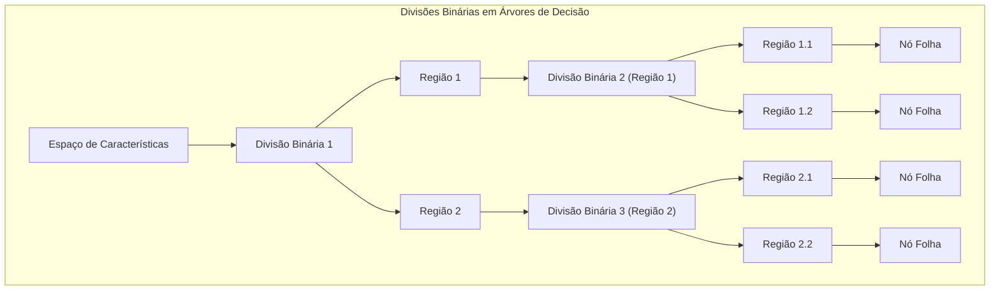
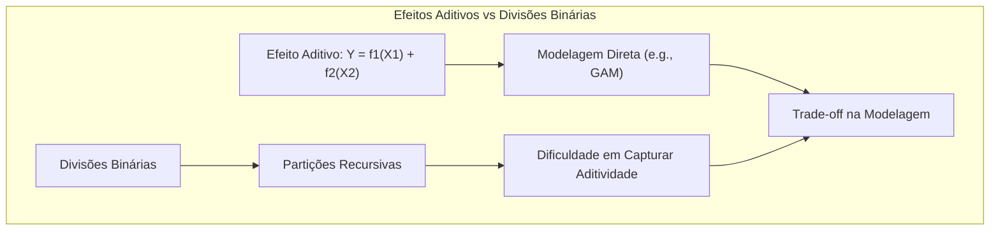
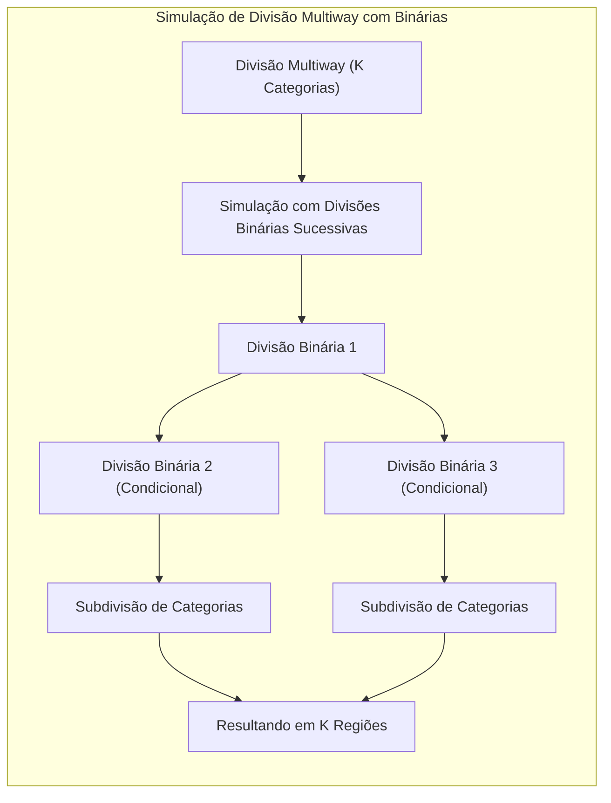
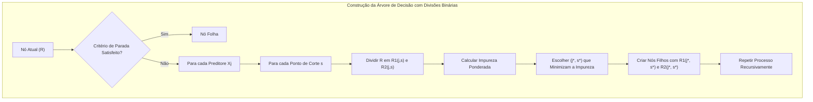
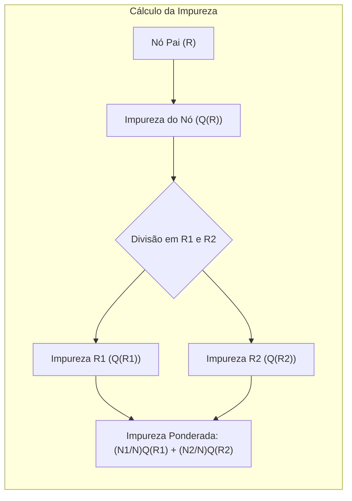
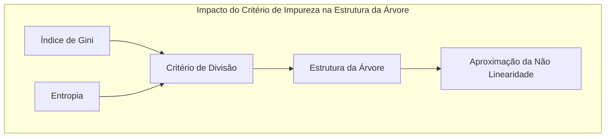
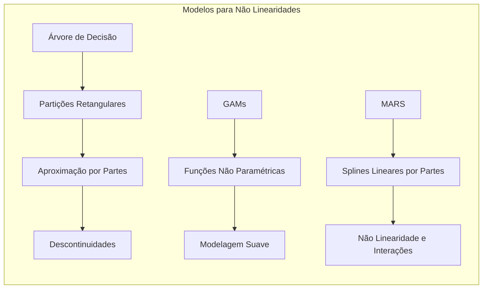

## Título: Modelos Aditivos, Árvores e Métodos Relacionados: A Importância das Divisões Binárias e suas Implicações na Construção de Modelos

### Introdução

Este capítulo explora a importância das divisões binárias na construção de modelos de aprendizado supervisionado, particularmente em árvores de decisão, e como essas divisões influenciam a estrutura e o desempenho desses modelos [^9.1]. A decisão de utilizar divisões binárias, que particionam o espaço de características em apenas duas regiões a cada passo da construção da árvore, tem implicações significativas na complexidade, estabilidade e interpretabilidade do modelo. O capítulo detalha as vantagens e desvantagens das divisões binárias, como elas são utilizadas para modelar relações complexas entre os preditores e a resposta, e como divisões *multiway* podem ser implementadas através da composição de divisões binárias sucessivas. O objetivo principal é fornecer uma compreensão aprofundada sobre o papel das divisões binárias na construção de modelos baseados em árvores de decisão e como as suas características afetam o desempenho final do modelo.

### Conceitos Fundamentais

**Conceito 1: Divisões Binárias em Árvores de Decisão**

Em árvores de decisão, as divisões binárias são utilizadas para particionar o espaço de características de forma recursiva. A cada nó da árvore, uma decisão binária é tomada com base no valor de um único preditor, dividindo as observações em duas regiões filhas. Uma divisão binária divide o espaço de características em dois subespaços, por exemplo, $\{X| X_j < s\}$ e $\{X| X_j \geq s\}$, onde $X_j$ é um preditor, e $s$ é o ponto de corte. As decisões de divisão são tomadas para criar nós mais puros, onde a maioria das observações pertencem à mesma classe. O processo de divisão binária é repetido até que os nós tenham pureza suficiente, o que implica em uma estrutura hierárquica, com um caminho binário que leva a diferentes regiões do espaço de características. A escolha do preditor e do ponto de divisão é feita de forma gulosa, com base na minimização da impureza do nó.

> 💡 **Exemplo Numérico:**
>
> Imagine um conjunto de dados com duas variáveis preditoras, $X_1$ (idade) e $X_2$ (renda), e uma variável de resposta binária $Y$ (comprou o produto: sim/não).
>
> 1.  **Nó Raiz:** Inicialmente, todas as observações estão no nó raiz.
> 2.  **Primeira Divisão:** O algoritmo avalia todas as possíveis divisões binárias, por exemplo:
>     *   Divisão em $X_1$: "idade < 30" e "idade >= 30"
>     *   Divisão em $X_2$: "renda < 5000" e "renda >= 5000"
> 3.  **Escolha da Divisão:** Suponha que a divisão "idade < 30" minimize a impureza (calculada usando Gini ou entropia). O nó raiz é dividido em dois nós filhos.
> 4.  **Nós Filhos:** O primeiro nó filho contém observações com idade < 30 e o segundo com idade >= 30.
> 5.  **Divisões Recursivas:** O processo se repete em cada nó filho, utilizando as mesmas ou outras variáveis (e.g., renda) para subdividir o espaço de características até que os critérios de parada sejam atingidos.
>
> Este processo cria uma estrutura hierárquica onde cada divisão binária refina a partição do espaço de características.

**Lemma 1:** *As divisões binárias em árvores de decisão particionam o espaço de características em duas regiões a cada passo, o que cria uma estrutura hierárquica que pode aproximar relações complexas entre os preditores e a resposta, mesmo que a cada passo a divisão seja feita com apenas um preditor.* A escolha das decisões de partição é uma decisão importante na construção da árvore de decisão [^4.5].

**Conceito 2: Vantagens e Desvantagens das Divisões Binárias**

As divisões binárias oferecem várias vantagens na construção de árvores de decisão:

*   **Simplicidade:** As divisões binárias são simples de implementar e interpretar, e levam a árvores com uma estrutura fácil de entender.
*   **Interpretabilidade:** A estrutura da árvore, com nós binários, permite uma interpretação mais direta das decisões de classificação.
*   **Eficiência Computacional:** A avaliação de partições binárias é computacionalmente eficiente e permite a construção de modelos de forma mais rápida.

No entanto, as divisões binárias também apresentam algumas desvantagens:

*   **Dificuldade em Modelar Efeitos Aditivos:** As divisões binárias, ao particionarem o espaço de forma recursiva com um único preditor a cada passo, podem ter dificuldade em modelar efeitos aditivos, onde o efeito de dois ou mais preditores é aditivo na escala da variável resposta.
*   **Fragmentação:** A divisão do espaço em apenas duas regiões a cada passo pode fragmentar rapidamente o conjunto de dados e levar à criação de muitos nós terminais, o que aumenta o risco de *overfitting*.
*   **Pouca Flexibilidade:** A escolha de divisões binárias pode levar a modelos menos flexíveis do que modelos com partições *multiway*, que podem levar a árvores menos profundas e com boa capacidade de generalização.

> 💡 **Exemplo Numérico (Dificuldade em Modelar Efeitos Aditivos):**
>
> Considere um modelo onde a variável resposta $Y$ é dada por $Y = 2X_1 + 3X_2 + \epsilon$. Uma árvore de decisão com divisões binárias pode ter dificuldade em capturar essa relação aditiva. A árvore pode primeiro dividir com base em $X_1$ e depois em $X_2$, mas a relação linear entre $X_1$ e $X_2$ e $Y$ pode não ser modelada diretamente. Uma abordagem de modelos aditivos, como GAMs, poderia modelar esses efeitos aditivos de forma mais direta, utilizando funções não paramétricas para modelar cada preditor.

**Corolário 1:** *As divisões binárias simplificam o processo de construção de árvores de decisão, permitindo uma implementação eficiente e uma maior interpretabilidade. No entanto, elas podem levar a modelos com dificuldade em modelar relações mais complexas e interações entre preditores e também podem ser mais propensas a overfitting*. O uso de árvores binárias é um compromisso entre complexidade, interpretabilidade, e capacidade de aproximação [^4.5].

**Conceito 3: Simulação de Divisões *Multiway* com Divisões Binárias**

Divisões *multiway* dividem o espaço de características em mais de duas regiões, e oferecem mais flexibilidade na modelagem da relação entre os preditores e a resposta. Em árvores de decisão, modelos de divisão *multiway* são mais complexos para implementar. Em geral, qualquer divisão *multiway* pode ser simulada através de uma sequência de divisões binárias sucessivas. Por exemplo, uma divisão com $K$ categorias pode ser simulada utilizando uma sequência de divisões binárias que dividem as categorias em grupos menores. As divisões binárias permitem que modelos baseados em árvores possam lidar com diferentes tipos de preditores, mesmo quando o número de categorias é muito grande. O uso de divisões binárias, com o uso de algoritmos de *pruning*, oferece um balanço entre a complexidade e a capacidade de aproximação do modelo.

> 💡 **Exemplo Numérico (Simulação de Divisão Multiway):**
>
> Suponha que temos uma variável preditora $X_3$ com quatro categorias: A, B, C, e D. Uma divisão multiway dividiria diretamente em quatro grupos. Usando divisões binárias, podemos simular isso:
>
> 1.  **Primeira Divisão:** $X_3$ está em {A,B} ou {C,D}?
> 2.  **Segunda Divisão (se $X_3$ está em {A,B}):** $X_3$ é A ou B?
> 3.  **Terceira Divisão (se $X_3$ está em {C,D}):** $X_3$ é C ou D?
>
> Essas divisões binárias sucessivas simulam uma divisão multiway, embora aumentem a profundidade da árvore.

> ⚠️ **Nota Importante:** As divisões binárias em árvores de decisão, embora sejam limitadas, podem simular divisões mais complexas através da construção de uma sequência de partições binárias, e podem levar a modelos mais simples e estáveis do que divisões multiway. A utilização de divisões binárias é uma forma de simplificar a modelagem [^4.5].

> ❗ **Ponto de Atenção:** Embora qualquer divisão *multiway* possa ser simulada por divisões binárias, pode haver um aumento na profundidade da árvore, e na sua complexidade, o que exige o uso de métodos de *pruning* para evitar o *overfitting*, e o aumento da árvore pode diminuir a sua interpretabilidade. A escolha do tipo de divisão deve considerar o *trade-off* entre complexidade e interpretabilidade [^4.5.1].

> ✔️ **Destaque:** As divisões binárias são a base da construção de árvores de decisão, oferecendo uma abordagem simples e eficiente para modelar relações entre preditores e resposta, com um balanço entre interpretabilidade e capacidade de modelagem da não linearidade, e podem ser utilizadas para modelar qualquer tipo de partição através de divisões binárias sucessivas [^4.5.2].

### Detalhes da Implementação de Divisões Binárias e sua Relação com a Construção da Árvore de Decisão

**Explicação:** Este diagrama ilustra o processo iterativo de construção de uma árvore de decisão com divisões binárias. Cada passo é detalhado, desde a inicialização até a escolha do ponto de corte e a criação dos nós filhos, conforme os tópicos [^4.5.1], [^4.5.2].

O algoritmo para construção de uma árvore de decisão com divisões binárias começa com a criação do nó raiz, que contém todos os dados do conjunto de treinamento. O processo é iterativo e recursivo, e em cada nó, os seguintes passos são realizados:

1.  **Verificação do Critério de Parada:** O algoritmo verifica se o nó satisfaz o critério de parada, o que geralmente inclui:
    *   O nó é puro, ou seja, todas as observações são da mesma classe.
    *   O número de observações no nó é menor do que um limiar pré-definido.
    *   A profundidade da árvore atingiu um limiar.
Se um dos critérios for satisfeito, o algoritmo termina o processo nesse nó, transformando-o em um nó folha, e atribui a ele a classe majoritária das observações naquele nó.
2.  **Escolha do Melhor Preditore Ponto de Corte:** Caso o critério de parada não seja satisfeito, o algoritmo itera sobre todos os preditores $X_j$ e todos os possíveis pontos de divisão $s$.
3.  **Divisão do Nó:** O nó é dividido em dois nós filhos utilizando o preditor $X_j$ e o ponto de divisão $s$:
    $$
      R_1(j,s) = \{X|X_j < s\}
    $$
      $$
       R_2(j,s) = \{X|X_j \geq s\}
    $$
4.  **Cálculo da Impureza Ponderada:** A impureza ponderada dos nós filhos é calculada utilizando o índice de Gini ou a entropia:
    $$
    \text{Impureza Ponderada} = \frac{N_1}{N} Q(R_1) + \frac{N_2}{N} Q(R_2)
    $$
     onde $N_1$ e $N_2$ são o número de observações nos nós $R_1$ e $R_2$, e $Q(R_1)$ e $Q(R_2)$ são as impurezas dos nós filhos, calculadas utilizando o índice de Gini ou a entropia.
5.  **Seleção da Melhor Divisão:** A variável e o ponto de corte que resultam na menor impureza ponderada são escolhidos para a divisão do nó.
6. **Criação dos nós filhos**: O nó atual é substituído pelos dois nós filhos criados a partir da divisão escolhida, e o processo de divisão continua recursivamente até que todos os nós se tornem nós folhas.

> 💡 **Exemplo Numérico (Cálculo da Impureza):**
>
> Suponha que em um nó temos 10 observações, 6 da classe A e 4 da classe B.
>
> *   **Impureza Gini:**
>     $Q = 1 - (\frac{6}{10})^2 - (\frac{4}{10})^2 = 1 - 0.36 - 0.16 = 0.48$
> *   **Impureza Entropia:**
>     $Q = -(\frac{6}{10} \log_2(\frac{6}{10}) + \frac{4}{10} \log_2(\frac{4}{10})) \approx - (0.6 * -0.737 + 0.4 * -1.322) \approx 0.971$
>
> Agora, suponha que dividimos o nó em dois nós filhos:
>
> *   **Nó 1:** 4 observações da classe A e 1 da classe B ($N_1 = 5$). Impureza Gini = $1 - (\frac{4}{5})^2 - (\frac{1}{5})^2 = 0.32$
> *  **Nó 2:** 2 observações da classe A e 3 da classe B ($N_2 = 5$). Impureza Gini = $1 - (\frac{2}{5})^2 - (\frac{3}{5})^2 = 0.48$
>
> **Impureza Ponderada (Gini):** $\frac{5}{10} * 0.32 + \frac{5}{10} * 0.48 = 0.16 + 0.24 = 0.40$
>
> O objetivo é escolher a divisão que minimize a impureza ponderada. Se outra divisão resultasse em uma impureza ponderada menor que 0.40, ela seria escolhida.

O processo de divisão binária é repetido recursivamente até que todas as folhas da árvore tenham pureza suficiente. A utilização de divisões binárias torna a construção das árvores de decisão mais eficiente.

**Lemma 4:** *O processo iterativo de criação da árvore com divisões binárias, com o uso de um critério para minimizar a impureza do nó, leva à construção de árvores de decisão que podem modelar relações não lineares entre os preditores e a resposta. O algoritmo, apesar de ser guloso, é eficiente para modelar dados com diferentes tipos de estruturas e classes.* A utilização de divisões binárias simplifica a construção da árvore e permite obter modelos com um balanço entre flexibilidade e interpretabilidade [^4.5.1].

### O Uso de Surrogate Splits em Árvores de Decisão

Em modelos baseados em árvores de decisão, quando uma variável tem valores ausentes, é utilizada uma estratégia de *surrogate splits*. Quando um preditor com dados faltantes é escolhido para a divisão do nó, a árvore avalia outros preditores para serem utilizados quando a observação tem o valor ausente da variável de divisão. Os *surrogate splits* são escolhidos com base na sua capacidade de separar os dados de forma similar à divisão original. O *surrogate splits* permite que o algoritmo de árvore de decisão lide com valores ausentes de forma adequada, e sem a necessidade de imputação prévia dos valores ausentes. A lista de *surrogate splits* é ordenada pela sua capacidade de gerar resultados similares à divisão original. O uso de *surrogate splits* é um mecanismo para lidar com a falta de informação, e é utilizado para aumentar a robustez do modelo.

> 💡 **Exemplo Numérico (Surrogate Splits):**
>
> Suponha que a melhor divisão em um nó seja em $X_1$ (idade), mas algumas observações têm valores ausentes para $X_1$. O algoritmo procura *surrogate splits*, como $X_2$ (renda). Se a divisão "renda < 6000" separar as observações de forma similar à divisão original, ela é utilizada como um *surrogate split*. Se uma observação tiver o valor de $X_1$ ausente, ela será avaliada usando $X_2$ para direcioná-la para o nó filho apropriado. Outros *surrogate splits* podem ser avaliados, e ordenados pela sua similaridade com a divisão original.

### Propriedades e Limitações das Divisões Binárias

Apesar de sua eficiência e interpretabilidade, as divisões binárias podem apresentar limitações na modelagem de relações mais complexas. A escolha de um único preditor para cada divisão pode dificultar a modelagem de interações entre preditores, e o processo de decisão binária recursiva pode levar a árvores muito profundas e com overfitting. A utilização do processo de poda e outras abordagens é importante para controlar a complexidade da árvore e melhorar a sua capacidade de generalização. A escolha de um único preditor por vez, também dificulta a modelagem de relações aditivas.

### Perguntas Teóricas Avançadas: Como a estrutura de árvore binária, influenciada pela escolha do critério de impureza, afeta a complexidade do modelo e a sua capacidade de aproximar funções não lineares e qual a relação com outros modelos como GAMs e MARS?

**Resposta:**

A estrutura de árvore binária, influenciada pela escolha do critério de impureza, afeta a complexidade do modelo e sua capacidade de aproximar funções não lineares de forma significativa.

A utilização de partições binárias, a cada nó da árvore, simplifica a construção do modelo e torna o algoritmo computacionalmente eficiente. Entretanto, a divisão binária, mesmo que recursiva, é uma forma de modelar não linearidades, mas com limitações na capacidade de modelar relações complexas e suaves, o que se manifesta em modelos que podem ter descontinuidades e alta variância. A escolha do critério de impureza, como o índice de Gini ou entropia, afeta a escolha do preditor e do ponto de corte em cada nó, e, consequentemente, a forma e a profundidade da árvore.

O índice de Gini e a entropia, embora sejam similares na prática, podem levar a árvores com estruturas diferentes, especialmente em dados com alta dimensionalidade ou quando as classes não são bem separadas. Ambos os critérios buscam minimizar a impureza dos nós filhos, e a escolha entre as duas abordagens nem sempre tem um impacto significativo no resultado final. A utilização de um critério para a escolha das divisões impacta a forma com que a não linearidade é aproximada.

A capacidade de aproximação de funções não lineares com árvores de decisão é limitada pela sua natureza de dividir o espaço de características em regiões retangulares. Para relações não lineares suaves, outros modelos, como GAMs, podem oferecer uma capacidade de aproximação superior, dado que eles utilizam funções não paramétricas para modelar as relações. Modelos MARS, ao usar *splines* lineares por partes, combinam a capacidade de modelar a não linearidade, e também, tem uma estrutura aditiva.

Modelos GAMs, ao utilizar funções não paramétricas, modelam relações não lineares de forma mais eficiente, e a sua estrutura aditiva permite uma interpretação mais simples e flexível do modelo. MARS também possui maior flexibilidade que as árvores de decisão na modelagem de relações não lineares e interações entre preditores. A escolha da estrutura binária, utilizada pelas árvores, embora gere modelos interpretáveis e eficientes, pode não ser apropriada para todas as situações. A escolha da melhor abordagem depende do tipo de dados e da complexidade da relação entre preditores e resposta.

> 💡 **Exemplo Numérico (Comparação com GAMs e MARS):**
>
> Considere a função não linear $Y = sin(2\pi X_1) + X_2^2 + \epsilon$.
>
> *   **Árvore de Decisão:** Uma árvore de decisão pode aproximar essa função dividindo o espaço em regiões retangulares, mas a aproximação será por partes, com descontinuidades, e pode requerer uma árvore profunda.
> *   **GAM:** Um modelo GAM poderia modelar $f_1(X_1) = sin(2\pi X_1)$ e $f_2(X_2) = X_2^2$ com funções não paramétricas, resultando em uma aproximação mais suave e flexível.
> *   **MARS:** Um modelo MARS poderia usar *splines* lineares por partes para modelar ambas as funções, com capacidade de modelar não linearidades e interações, caso existam.
>
> A árvore de decisão pode ter dificuldade em modelar a função seno de forma suave, enquanto GAMs e MARS modelam essa não linearidade de forma mais precisa.

**Lemma 5:** *A estrutura de árvore binária, embora eficiente, limita a capacidade de modelar relações não lineares suaves e interações complexas. A escolha do critério de impureza (Gini ou entropia) influencia a forma da árvore, e a sua capacidade de aproximação de funções não lineares, mas modelos mais flexíveis como GAMs e MARS podem ser mais adequados para relações mais complexas*. A escolha do tipo de modelo, incluindo a escolha de divisões binárias, depende do *trade-off* entre a complexidade, interpretabilidade e capacidade de aproximação [^4.5.1], [^4.5.2].

**Corolário 5:** *A estrutura de árvore binária, com seu processo iterativo de divisão dos dados, tem uma limitação na capacidade de aproximar certas não linearidades. Modelos como GAMs e MARS, ao utilizar modelos com aproximações mais flexíveis, oferecem maior capacidade de aproximar funções não lineares e modelar relações complexas entre os preditores e a resposta. A combinação da modelagem não linear com a utilização de partições binárias é feita através da utilização de vários modelos em conjunto, como nas Misturas Hierárquicas de Especialistas (HME)* [^4.4.3], [^4.4.4].

> ⚠️ **Ponto Crucial:** A estrutura binária das árvores de decisão tem um impacto na sua capacidade de modelagem, e a escolha da métrica de impureza e de outros métodos de regularização (como o *pruning* da árvore), podem melhorar o modelo final, mas modelos mais flexíveis, como GAMs e MARS, oferecem alternativas para a modelagem de relações complexas. A escolha do modelo deve ser guiada pela natureza dos dados e pelo objetivo da análise [^4.5].

### Conclusão

Este capítulo explorou a importância das divisões binárias em árvores de decisão, detalhando a sua implementação, as suas vantagens e limitações, e como elas podem ser utilizadas para modelar relações complexas entre preditores e respostas. A relação entre as divisões binárias e outras abordagens de modelagem, como Modelos Aditivos Generalizados (GAMs) e Multivariate Adaptive Regression Splines (MARS), foi discutida. A compreensão dos fundamentos e das implicações da estrutura binária é essencial para a construção e aplicação de modelos baseados em árvores de decisão em problemas de aprendizado supervisionado, que são largamente utilizados em diversas áreas de modelagem.

### Footnotes

[^4.1]: "In this chapter we begin our discussion of some specific methods for super-vised learning. These techniques each assume a (different) structured form for the unknown regression function, and by doing so they finesse the curse of dimensionality. Of course, they pay the possible price of misspecifying the model, and so in each case there is a tradeoff that has to be made." *(Trecho de "Additive Models, Trees, and Related Methods")*

[^4.2]: "Regression models play an important role in many data analyses, providing prediction and classification rules, and data analytic tools for understand-ing the importance of different inputs." *(Trecho de "Additive Models, Trees, and Related Methods")*

[^4.3]: "In this section we describe a modular algorithm for fitting additive models and their generalizations. The building block is the scatterplot smoother for fitting nonlinear effects in a flexible way. For concreteness we use as our scatterplot smoother the cubic smoothing spline described in Chapter 5." *(Trecho de "Additive Models, Trees, and Related Methods")*

[^4.3.1]:  "The additive model has the form $Y = \alpha + \sum_{j=1}^p f_j(X_j) + \epsilon$, where the error term $\epsilon$ has mean zero." * (Trecho de "Additive Models, Trees, and Related Methods")*

[^4.3.2]:   "Given observations $x_i, y_i$, a criterion like the penalized sum of squares (5.9) of Section 5.4 can be specified for this problem, $PRSS(\alpha, f_1, f_2,..., f_p) = \sum_i^N (y_i - \alpha - \sum_j^p f_j(x_{ij}))^2 + \sum_j^p \lambda_j \int (f_j''(t_j))^2 dt_j$" * (Trecho de "Additive Models, Trees, and Related Methods")*

[^4.3.3]: "where the $\lambda_j > 0$ are tuning parameters. It can be shown that the minimizer of (9.7) is an additive cubic spline model; each of the functions $f_j$ is a cubic spline in the component $X_j$, with knots at each of the unique values of $x_{ij}, i = 1,..., N$." *(Trecho de "Additive Models, Trees, and Related Methods")*

[^4.4]: "For two-class classification, recall the logistic regression model for binary data discussed in Section 4.4. We relate the mean of the binary response $\mu(X) = Pr(Y = 1|X)$ to the predictors via a linear regression model and the logit link function:  $log(\mu(X)/(1 – \mu(X)) = \alpha + \beta_1 X_1 + \ldots + \beta_pX_p$." * (Trecho de "Additive Models, Trees, and Related Methods")*

[^4.4.1]: "The additive logistic regression model replaces each linear term by a more general functional form: $log(\mu(X)/(1 – \mu(X))) = \alpha + f_1(X_1) + \cdots + f_p(X_p)$, where again each $f_j$ is an unspecified smooth function." * (Trecho de "Additive Models, Trees, and Related Methods")*

[^4.4.2]: "While the non-parametric form for the functions $f_j$ makes the model more flexible, the additivity is retained and allows us to interpret the model in much the same way as before. The additive logistic regression model is an example of a generalized additive model." *(Trecho de "Additive Models, Trees, and Related Methods")*

[^4.4.3]: "In general, the conditional mean $\mu(X)$ of a response $Y$ is related to an additive function of the predictors via a link function $g$:  $g[\mu(X)] = \alpha + f_1(X_1) + \cdots + f_p(X_p)$." *(Trecho de "Additive Models, Trees, and Related Methods")*

[^4.4.4]:  "Examples of classical link functions are the following: $g(\mu) = \mu$ is the identity link, used for linear and additive models for Gaussian response data." *(Trecho de "Additive Models, Trees, and Related Methods")*

[^4.4.5]: "$g(\mu) = logit(\mu)$ as above, or $g(\mu) = probit(\mu)$, the probit link function, for modeling binomial probabilities. The probit function is the inverse Gaussian cumulative distribution function: $probit(\mu) = \Phi^{-1}(\mu)$." *(Trecho de "Additive Models, Trees, and Related Methods")*

[^4.5]: "All three of these arise from exponential family sampling models, which in addition include the gamma and negative-binomial distributions. These families generate the well-known class of generalized linear models, which are all extended in the same way to generalized additive models." *(Trecho de "Additive Models, Trees, and Related Methods")*

[^4.5.1]: "The functions $f_j$ are estimated in a flexible manner, using an algorithm whose basic building block is a scatterplot smoother. The estimated func-tion $f_j$ can then reveal possible nonlinearities in the effect of $X_j$. Not all of the functions $f_j$ need to be nonlinear." *(Trecho de "Additive Models, Trees, and Related Methods")*

[^4.5.2]: "We can easily mix in linear and other parametric forms with the nonlinear terms, a necessity when some of the inputs are qualitative variables (factors)." *(Trecho de "Additive Models, Trees, and Related Methods")*
