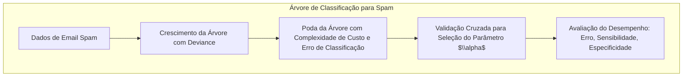
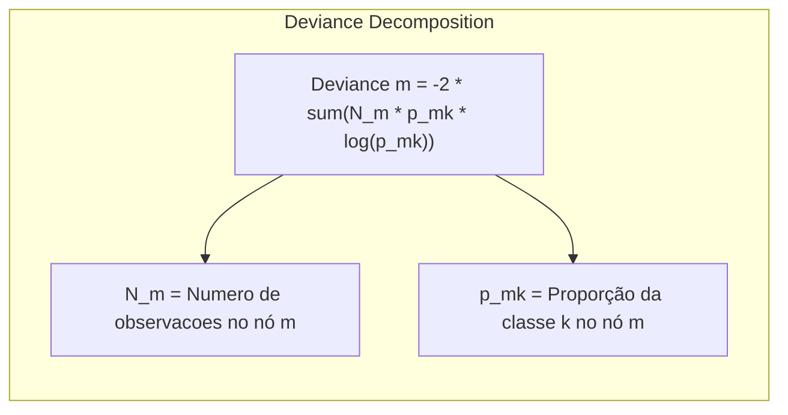
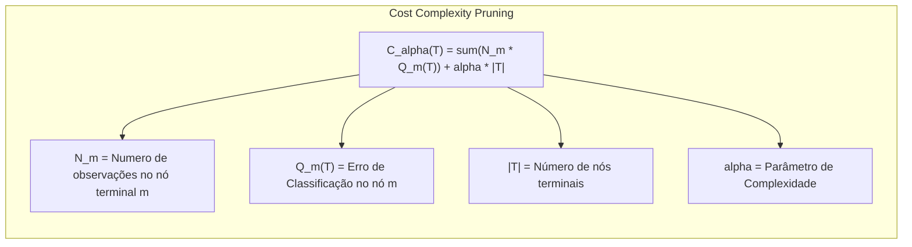
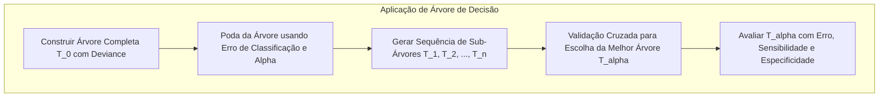
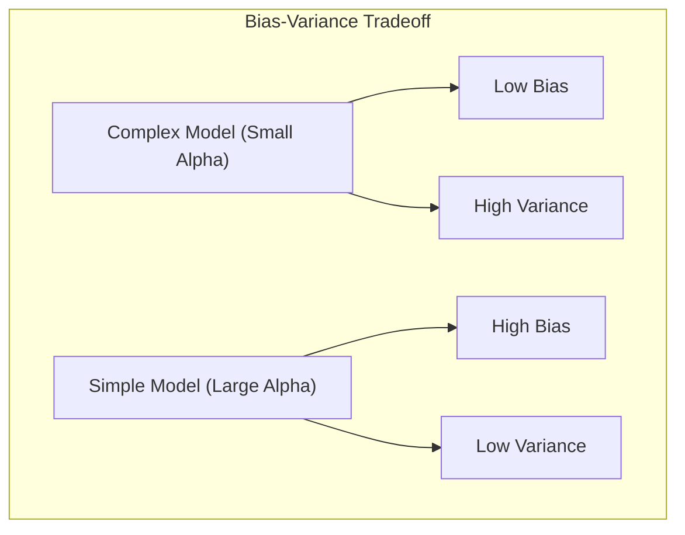

## Título: Modelos Aditivos, Árvores e Métodos Relacionados: Aplicação de Árvores de Classificação aos Dados de Spam com Deviance e Erro de Classificação

### Introdução

Este capítulo apresenta um estudo de caso detalhado sobre a aplicação de árvores de classificação ao conjunto de dados de email spam, explorando o uso da deviance para guiar o crescimento da árvore e como o erro de classificação é utilizado para a poda por complexidade de custo [^9.1]. O conjunto de dados de email spam é um *benchmark* comum para modelos de classificação binária, e a construção de árvores de decisão com as métricas corretas pode oferecer uma abordagem eficaz para o problema. O capítulo detalha como a deviance é utilizada para escolher as melhores divisões, como o parâmetro de complexidade de custo é utilizado para obter a melhor árvore podada e como o erro de classificação é utilizado para avaliar o seu desempenho. O objetivo principal é fornecer uma visão prática sobre a aplicação de árvores de decisão a um problema real de classificação, e mostrar como a escolha das métricas, métodos de otimização e poda impactam o desempenho do modelo.

### Conceitos Fundamentais

**Conceito 1: O Uso da Deviance no Crescimento de Árvores de Classificação**

Em árvores de classificação, a deviance é utilizada como uma métrica para guiar o processo de crescimento da árvore, buscando partições que minimizem a diferença entre o modelo e os dados. Em um nó $m$, a deviance é dada por:
$$
\text{Deviance}_m = -2\sum_{k=1}^K N_m p_{mk} \log p_{mk}
$$
onde $N_m$ é o número de observações no nó $m$ e $p_{mk}$ é a proporção de observações da classe $k$ no nó. A deviance mede a heterogeneidade das classes em um nó, e a escolha do preditor e do ponto de corte é feita para reduzir a deviance nos nós filhos.  A redução da deviance é utilizada como critério para escolher a melhor partição em cada nó, buscando dividir as observações em regiões mais homogêneas e com alta capacidade de classificação. A escolha da métrica de impureza, como a deviance, influencia a forma da árvore final e as suas propriedades estatísticas.

> 💡 **Exemplo Numérico:**
>
> Considere um nó $m$ com 100 observações ($N_m = 100$). Suponha que temos duas classes (spam e não spam), e neste nó, 60 emails são spam (classe 1) e 40 emails não são spam (classe 0). Então, $p_{m1} = 60/100 = 0.6$ e $p_{m0} = 40/100 = 0.4$. A deviance deste nó é calculada como:
>
> $$
> \text{Deviance}_m = -2 \times (100 \times (0.6 \times \log(0.6) + 0.4 \times \log(0.4)))
> $$
>
> $$
> \text{Deviance}_m = -2 \times 100 \times (0.6 \times (-0.51) + 0.4 \times (-0.92))
> $$
>
> $$
> \text{Deviance}_m = -200 \times (-0.306 - 0.368)
> $$
>
> $$
> \text{Deviance}_m = -200 \times (-0.674)
> $$
>
> $$
> \text{Deviance}_m = 134.8
> $$
>
> Agora, suponha que dividimos este nó em dois nós filhos, o nó da esquerda com 40 observações, todas da classe 0 (não spam) e o nó da direita com 60 observações, todas da classe 1 (spam). Para o nó da esquerda, $p_{esquerda,0} = 1$ e $p_{esquerda,1} = 0$. Para o nó da direita, $p_{direita,0} = 0$ e $p_{direita,1} = 1$.
>
> A deviance do nó da esquerda é:
> $$
> \text{Deviance}_{esquerda} = -2 \times 40 \times (1 \times \log(1) + 0 \times \log(0)) = 0
> $$
> Note que $\log(0)$ é indefinido, mas o termo $0 \times \log(0)$ é considerado como 0.
>
> A deviance do nó da direita é:
> $$
> \text{Deviance}_{direita} = -2 \times 60 \times (0 \times \log(0) + 1 \times \log(1)) = 0
> $$
>
> A deviance total dos nós filhos é $0 + 0 = 0$. A redução da deviance é $134.8 - 0 = 134.8$. Isto mostra como a divisão reduziu a deviance, indicando uma melhoria na pureza dos nós. O algoritmo de árvores de decisão procura divisões que maximizem esta redução.

**Lemma 1:** *A deviance é utilizada como uma medida de impureza em árvores de decisão, e a sua utilização guia o processo de construção da árvore, buscando a minimização da deviance nos nós filhos. A utilização da deviance permite guiar a construção da árvore utilizando o conceito de máxima verossimilhança*. A deviance também se relaciona com a entropia, e outras métricas de impureza [^4.5].

**Conceito 2: Poda por Complexidade de Custo Utilizando o Erro de Classificação**

A poda por complexidade de custo é um método utilizado para evitar o *overfitting* e para simplificar as árvores de decisão. O processo de poda envolve a avaliação de diferentes subárvores com base na complexidade e na capacidade de ajuste aos dados, sendo que a avaliação é feita através de um critério de custo que é dado por:
$$
C_\alpha(T) = \sum_{m=1}^{|T|} N_m Q_m(T) + \alpha|T|
$$
onde $N_m$ é o número de observações em um nó terminal, $Q_m(T)$ é uma medida de impureza como o erro de classificação,  $|T|$ é o número de nós terminais da árvore, e $\alpha$ é o parâmetro de complexidade, que controla o *trade-off* entre o ajuste aos dados e a complexidade da árvore. O erro de classificação é utilizada como métrica para avaliar a impureza dos nós terminais, e para guiar a escolha do melhor modelo.  A escolha do parâmetro de complexidade controla a capacidade de generalização da árvore, e a poda é uma abordagem para garantir que os modelos tenham melhor desempenho em dados não vistos.

> 💡 **Exemplo Numérico:**
>
> Suponha uma árvore de decisão com 5 nós terminais ($|T| = 5$). As observações e erros de classificação em cada nó são:
>
> | Nó Terminal (m) | $N_m$ | Erro de Classificação $Q_m(T)$ |
> |-----------------|-------|-----------------------------|
> | 1               | 50    | 0.1                         |
> | 2               | 30    | 0.2                         |
> | 3               | 20    | 0.05                        |
> | 4               | 40    | 0.15                        |
> | 5               | 60    | 0.08                        |
>
> Vamos calcular o custo da árvore para diferentes valores de $\alpha$.
>
> Para $\alpha = 0.01$:
>
> $$
> C_{0.01}(T) = (50 \times 0.1 + 30 \times 0.2 + 20 \times 0.05 + 40 \times 0.15 + 60 \times 0.08) + 0.01 \times 5
> $$
> $$
> C_{0.01}(T) = (5 + 6 + 1 + 6 + 4.8) + 0.05
> $$
> $$
> C_{0.01}(T) = 22.8 + 0.05 = 22.85
> $$
>
> Para $\alpha = 0.1$:
>
> $$
> C_{0.1}(T) = (50 \times 0.1 + 30 \times 0.2 + 20 \times 0.05 + 40 \times 0.15 + 60 \times 0.08) + 0.1 \times 5
> $$
> $$
> C_{0.1}(T) = 22.8 + 0.5 = 23.3
> $$
>
> Agora, suponha que podamos a árvore e ela tenha agora 3 nós terminais com os seguintes dados:
>
>  | Nó Terminal (m) | $N_m$ | Erro de Classificação $Q_m(T)$ |
> |-----------------|-------|-----------------------------|
> | 1               | 80    | 0.12                         |
> | 2               | 70    | 0.10                         |
> | 3               | 50    | 0.11                        |
>
> Para $\alpha = 0.1$:
> $$
> C_{0.1}(T_{podada}) = (80 \times 0.12 + 70 \times 0.10 + 50 \times 0.11) + 0.1 \times 3
> $$
> $$
> C_{0.1}(T_{podada}) = (9.6 + 7 + 5.5) + 0.3
> $$
> $$
> C_{0.1}(T_{podada}) = 22.1 + 0.3 = 22.4
> $$
>
> Neste exemplo, a árvore podada tem um custo menor com $\alpha = 0.1$ (22.4 < 23.3), indicando que a poda foi benéfica para este valor de $\alpha$. A escolha de $\alpha$ via validação cruzada ajudaria a determinar qual árvore (a original ou a podada) e qual valor de $\alpha$ oferece o melhor desempenho em dados não vistos.

**Corolário 1:** *A poda por complexidade de custo utiliza o erro de classificação e o parâmetro de complexidade α para simplificar a árvore, buscando o melhor balanço entre o ajuste aos dados e a sua capacidade de generalização*.  O parâmetro de complexidade controla o número de nós e, portanto, a complexidade da árvore [^4.5.2].

**Conceito 3: Avaliação do Desempenho da Árvore com Erro de Classificação, Sensibilidade e Especificidade**

Após a poda por complexidade de custo, o desempenho da árvore de decisão é avaliado utilizando métricas de classificação, como o erro de classificação, sensibilidade e especificidade, que são definidas como:
*   **Erro de Classificação:**
    $$
    \text{Erro de Classificação} = \frac{\text{Número de Classificações Incorretas}}{\text{Número Total de Observações}}
    $$

*   **Sensibilidade:**
  $$
     \text{Sensibilidade} = \frac{\text{TP}}{\text{TP + FN}}
    $$

*  **Especificidade:**
  $$
  \text{Especificidade} = \frac{\text{TN}}{\text{TN + FP}}
  $$
onde TP é o número de verdadeiros positivos, TN é o número de verdadeiros negativos, FP é o número de falsos positivos e FN é o número de falsos negativos.  Essas métricas permitem avaliar o desempenho da árvore em diferentes aspectos, como a sua precisão geral, sua capacidade de detectar verdadeiros positivos (sensibilidade), e sua capacidade de detectar verdadeiros negativos (especificidade). A escolha das métricas depende do problema e dos objetivos da modelagem, e um balanço entre sensibilidade e especificidade pode ser desejável para algumas aplicações.

> 💡 **Exemplo Numérico:**
>
> Considere uma matriz de confusão para um modelo de classificação de spam:
>
> |             | Previsto Spam | Previsto Não Spam |
> |-------------|--------------|-------------------|
> | Real Spam    | 120 (TP)     | 30 (FN)          |
> | Real Não Spam | 20 (FP)      | 230 (TN)         |
>
> * **Erro de Classificação:**
>
> $$
> \text{Erro de Classificação} = \frac{30 + 20}{120 + 30 + 20 + 230} = \frac{50}{400} = 0.125
> $$
>
> O erro de classificação é 12.5%, o que significa que o modelo classificou incorretamente 12.5% dos emails.
>
> * **Sensibilidade:**
>
> $$
> \text{Sensibilidade} = \frac{120}{120 + 30} = \frac{120}{150} = 0.8
> $$
>
> A sensibilidade é 80%, o que significa que o modelo detecta 80% dos emails que são realmente spam.
>
> * **Especificidade:**
>
> $$
> \text{Especificidade} = \frac{230}{230 + 20} = \frac{230}{250} = 0.92
> $$
>
> A especificidade é 92%, o que significa que o modelo corretamente classifica 92% dos emails que não são spam.
>
> Este exemplo mostra como as três métricas oferecem diferentes perspectivas sobre o desempenho do modelo. Um modelo pode ter baixo erro de classificação mas ter baixa sensibilidade ou especificidade, dependendo do contexto.

> ⚠️ **Nota Importante:** A utilização do erro de classificação e outras métricas de desempenho, como sensibilidade e especificidade, é crucial para avaliar a capacidade preditiva dos modelos baseados em árvores de decisão, e para a escolha do melhor modelo final, que deve ter um bom desempenho para dados não vistos e apresentar a melhor capacidade de generalização [^4.5].

> ❗ **Ponto de Atenção:** Modelos com baixo erro de classificação podem não ter necessariamente um bom balanço entre sensibilidade e especificidade.  A escolha do modelo, portanto, deve considerar todas as métricas de desempenho e o objetivo do problema de classificação [^4.5.1].

> ✔️ **Destaque:** A utilização do erro de classificação para guiar a poda e a avaliação do desempenho permite a construção de modelos baseados em árvores de decisão que sejam eficientes, interpretáveis e com um bom poder preditivo [^4.5.2].

### Aplicação de Árvores de Classificação aos Dados de Email Spam: Escolha da Partição, Poda e Avaliação

**Explicação:** Este diagrama descreve o processo de construção, poda e avaliação de árvores de classificação para dados de spam, destacando o papel da deviance e do erro de classificação, conforme descrito em [^4.5], [^4.5.1], [^4.5.2].

A aplicação de árvores de classificação aos dados de email spam envolve os seguintes passos:

1.  **Construção da Árvore Completa:** Uma árvore completa $T_0$ é construída utilizando uma estratégia de varredura em cada nó, e a escolha do preditor e ponto de divisão são feitos para maximizar a redução da deviance dos nós filhos.
2.  **Poda por Complexidade de Custo:** A poda é realizada utilizando o método de poda por complexidade de custo. O erro de classificação e o parâmetro de complexidade $\alpha$ são utilizados para definir quais nós são removidos. O custo de cada subárvore $T$ é definido como:
     $$
    C_\alpha(T) = \sum_{m=1}^{|T|} N_m Q_m(T) + \alpha |T|
    $$
   onde o parâmetro de complexidade $\alpha$ controla o *trade-off* entre o erro de classificação e a complexidade da árvore.
3.  **Geração da Sequência de Sub-Árvores:** O processo de poda gera uma sequência de sub-árvores $T_1, T_2, ..., T_n$ que representam diferentes balanços entre o erro de classificação e complexidade.
4. **Escolha da Melhor Sub-Árvore:** A validação cruzada é utilizada para escolher a subárvore $T_\alpha$ que apresenta o melhor desempenho em dados não vistos. Em cada iteração da validação cruzada, um conjunto de dados é utilizado para treinar o modelo e outro conjunto de dados é utilizado para avaliar o seu desempenho. O parâmetro de complexidade $\alpha$ é escolhido para que a árvore tenha um desempenho adequado.
5.  **Avaliação da Árvore Final:**  A árvore final $T_\alpha$ é avaliada utilizando o erro de classificação, a sensibilidade e a especificidade no conjunto de teste.  O resultado final do processo de modelagem é uma árvore de decisão que equilibra a capacidade de ajuste e a sua capacidade de generalização, e com boa interpretabilidade.

**Lemma 3:** *A utilização da deviance para guiar o crescimento da árvore e do erro de classificação para guiar a poda permite construir modelos de classificação para dados de spam que sejam eficientes e robustos. A escolha do parâmetro de complexidade α através de validação cruzada contribui para uma melhor capacidade de generalização*. A combinação das métricas de deviance e erro de classificação, juntamente com o processo de validação cruzada, garante a escolha de modelos adequados [^4.5.1].

### Análise do Desempenho e Interpretabilidade da Árvore Podada

A avaliação do desempenho da árvore de decisão é feita através do cálculo do erro de classificação, sensibilidade e especificidade. Uma tabela de confusão pode ser utilizada para analisar os diferentes tipos de erros de classificação, incluindo verdadeiros positivos, verdadeiros negativos, falsos positivos e falsos negativos. A análise da árvore podada também é importante para entender a sua estrutura e as decisões que levam à classificação dos emails como spam ou não spam. A interpretabilidade da árvore pode ser avaliada analisando o tamanho da árvore e os preditores que foram utilizados para guiar as decisões de divisão.  Em geral, árvores mais simples são mais fáceis de interpretar do que árvores mais complexas.

###  Comparação com Outros Modelos: Modelos Aditivos e MARS

Em comparação com modelos aditivos generalizados (GAMs) e MARS, as árvores de decisão oferecem uma abordagem diferente para o problema de classificação de email spam.  GAMs utilizam funções não paramétricas para cada preditor, e oferecem um alto grau de flexibilidade e interpretabilidade, enquanto MARS utiliza uma combinação de *splines* lineares por partes para modelar as relações entre preditores e resposta, e também oferece flexibilidade para modelar relações não lineares.  As árvores de decisão são uma abordagem alternativa, que utiliza partições binárias e tem como foco a construção de uma árvore interpretável e com um bom desempenho. A escolha do melhor modelo depende da natureza dos dados e do objetivo da modelagem, e cada um dos modelos tem suas vantagens e desvantagens.

### Perguntas Teóricas Avançadas: Como a escolha do parâmetro de complexidade α e das diferentes métricas de impureza (Gini vs. Entropia) impacta a estrutura da árvore de decisão resultante e o seu desempenho em termos de *bias* e variância?

**Resposta:**

A escolha do parâmetro de complexidade $\alpha$ e das métricas de impureza (Gini ou entropia) tem um impacto significativo na estrutura da árvore de decisão resultante e em seu desempenho em termos de *bias* e variância. O parâmetro de complexidade $\alpha$ controla o *trade-off* entre ajuste aos dados e a complexidade da árvore, enquanto que a escolha da métrica de impureza afeta as decisões locais durante a construção da árvore.

Um parâmetro de complexidade α pequeno leva a árvores mais complexas e com muitos nós, o que tende a ter um baixo *bias* (ou seja, a árvore se ajusta aos dados de treino com precisão), mas pode ter alta variância (ou seja, a árvore se torna instável e muito sensível aos dados específicos de treino). Um parâmetro de complexidade grande leva a árvores mais simples com poucos nós, o que tende a ter um alto *bias* (ou seja, a árvore é muito restrita para se ajustar aos dados) e baixa variância (ou seja, a árvore é mais estável). A escolha do parâmetro α, portanto, afeta o *trade-off* entre *bias* e variância.

A escolha da métrica de impureza (Gini ou Entropia) também influencia a estrutura da árvore, mesmo que de forma mais sutil. O índice de Gini e a entropia são métricas similares que buscam diminuir a heterogeneidade dos nós, mas a forma de cálculo dessas métricas pode afetar a escolha do preditor e ponto de corte a cada divisão do nó. Em geral, o índice de Gini e a entropia levam a resultados similares, mas a sua escolha pode afetar a profundidade da árvore e a forma como os dados são particionados. Métodos baseados em validação cruzada são mais importantes que a escolha da métrica de impureza, e um ajuste cuidadoso dos parâmetros da árvore pode minimizar a diferença entre elas.

As propriedades estatísticas de modelos de aprendizado supervisionado são afetadas pela escolha do parâmetro de complexidade e pela métrica de impureza, e, em geral, modelos mais flexíveis têm menor *bias* e maior variância e modelos mais simples têm maior *bias* e menor variância. A escolha dos modelos, portanto, depende do *trade-off* entre as duas propriedades, e o objetivo da modelagem. A utilização de validação cruzada é importante para encontrar o melhor balanço entre essas duas propriedades.

**Lemma 5:** *A escolha do parâmetro de complexidade α e da métrica de impureza (Gini ou Entropia) afeta a estrutura da árvore, e o seu desempenho em termos de *bias* e variância. Modelos mais complexos têm menor *bias* e maior variância, enquanto modelos mais simples têm maior *bias* e menor variância*. A escolha desses parâmetros deve ser feita considerando o problema de modelagem e o objetivo do modelo [^4.5.1].

**Corolário 5:** *O parâmetro de complexidade e a escolha da métrica de impureza são componentes importantes na construção de árvores de decisão, e eles devem ser cuidadosamente escolhidos para que o modelo tenha um bom desempenho e uma capacidade de generalização adequada, e que o *trade-off* entre *bias* e variância seja considerado*. A escolha do modelo, portanto, deve considerar as características dos dados e os objetivos do problema [^4.5.2].

> ⚠️ **Ponto Crucial**: A escolha do parâmetro de complexidade e da métrica de impureza (Gini ou Entropia) influencia diretamente a complexidade da árvore, o seu *bias* e variância, e consequentemente a sua capacidade de generalização. A utilização de métodos de validação cruzada para a escolha dos parâmetros é essencial para a construção de modelos robustos e com boas propriedades estatísticas [^4.3.3].

### Conclusão

Este capítulo apresentou a aplicação de árvores de classificação aos dados de email spam, demonstrando o uso da deviance e do erro de classificação no processo de modelagem. A discussão detalhou a construção, a poda e a avaliação dos modelos, destacando a importância das decisões tomadas durante o processo de modelagem. A compreensão das métricas de desempenho, da poda por complexidade de custo e como a escolha de modelos influencia a sua capacidade preditiva, é fundamental para a aplicação de árvores de decisão na prática.

### Footnotes

[^4.1]: "In this chapter we begin our discussion of some specific methods for super-vised learning. These techniques each assume a (different) structured form for the unknown regression function, and by doing so they finesse the curse of dimensionality. Of course, they pay the possible price of misspecifying the model, and so in each case there is a tradeoff that has to be made." *(Trecho de "Additive Models, Trees, and Related Methods")*

[^4.2]: "Regression models play an important role in many data analyses, providing prediction and classification rules, and data analytic tools for understand-ing the importance of different inputs." *(Trecho de "Additive Models, Trees, and Related Methods")*

[^4.3]: "In this section we describe a modular algorithm for fitting additive models and their generalizations. The building block is the scatterplot smoother for fitting nonlinear effects in a flexible way. For concreteness we use as our scatterplot smoother the cubic smoothing spline described in Chapter 5." *(Trecho de "Additive Models, Trees, and Related Methods")*

[^4.3.1]:  "The additive model has the form $Y = \alpha + \sum_{j=1}^p f_j(X_j) + \varepsilon$, where the error term $\varepsilon$ has mean zero." * (Trecho de "Additive Models, Trees, and Related Methods")*

[^4.3.2]:   "Given observations $x_i, y_i$, a criterion like the penalized sum of squares (5.9) of Section 5.4 can be specified for this problem, $PRSS(\alpha, f_1, f_2,..., f_p) = \sum_i^N (y_i - \alpha - \sum_j^p f_j(x_{ij}))^2 + \sum_j^p \lambda_j \int(f_j''(t_j))^2 dt_j$" * (Trecho de "Additive Models, Trees, and Related Methods")*

[^4.3.3]: "where the $\lambda_j > 0$ are tuning parameters. It can be shown that the minimizer of (9.7) is an additive cubic spline model; each of the functions $f_j$ is a cubic spline in the component $X_j$, with knots at each of the unique values of $x_{ij}$, $i = 1,..., N$." *(Trecho de "Additive Models, Trees, and Related Methods")*

[^4.4]: "For two-class classification, recall the logistic regression model for binary data discussed in Section 4.4. We relate the mean of the binary response $\mu(X) = Pr(Y = 1|X)$ to the predictors via a linear regression model and the logit link function:  $\log(\mu(X)/(1 – \mu(X)) = \alpha + \beta_1 X_1 + ... + \beta_pX_p$." * (Trecho de "Additive Models, Trees, and Related Methods")*

[^4.4.1]: "The additive logistic regression model replaces each linear term by a more general functional form: $\log(\mu(X)/(1 – \mu(X))) = \alpha + f_1(X_1) + \ldots + f_p(X_p)$, where again each $f_j$ is an unspecified smooth function." * (Trecho de "Additive Models, Trees, and Related Methods")*

[^4.4.2]: "While the non-parametric form for the functions $f_j$ makes the model more flexible, the additivity is retained and allows us to interpret the model in much the same way as before. The additive logistic regression model is an example of a generalized additive model." *(Trecho de "Additive Models, Trees, and Related Methods")*

[^4.4.3]: "In general, the conditional mean $\mu(X)$ of a response $Y$ is related to an additive function of the predictors via a link function $g$:  $g[\mu(X)] = \alpha + f_1(X_1) + \ldots + f_p(X_p)$." *(Trecho de "Additive Models, Trees, and Related Methods")*

[^4.4.4]:  "Examples of classical link functions are the following: $g(\mu) = \mu$ is the identity link, used for linear and additive models for Gaussian response data." *(Trecho de "Additive Models, Trees, and Related Methods")*

[^4.4.5]: "$g(\mu) = \text{logit}(\mu)$ as above, or $g(\mu) = \text{probit}(\mu)$, the probit link function, for modeling binomial probabilities. The probit function is the inverse Gaussian cumulative distribution function: $\text{probit}(\mu) = \Phi^{-1}(\mu)$." *(Trecho de "Additive Models, Trees, and Related Methods")*

[^4.5]: "All three of these arise from exponential family sampling models, which in addition include the gamma and negative-binomial distributions. These families generate the well-known class of generalized linear models, which are all extended in the same way to generalized additive models." *(Trecho de "Additive Models, Trees, and Related Methods")*

[^4.5.1]: "The functions $f_j$ are estimated in a flexible manner, using an algorithm whose basic building block is a scatterplot smoother. The estimated func-tion $f_j$ can then reveal possible nonlinearities in the effect of $X_j$. Not all of the functions $f_j$ need to be nonlinear." *(Trecho de "Additive Models, Trees, and Related Methods")*

[^4.5.2]: "We can easily mix in linear and other parametric forms with the nonlinear terms, a necessity when some of the inputs are qualitative variables (factors)." *(Trecho de "Additive Models, Trees, and Related Methods")*
