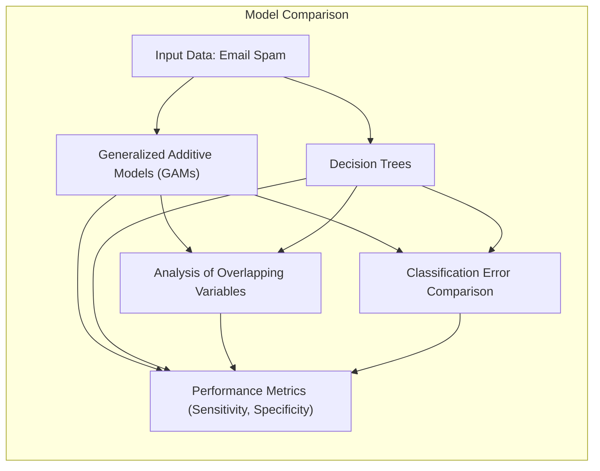
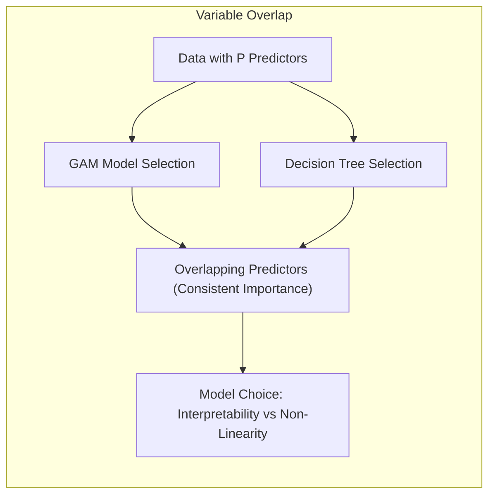
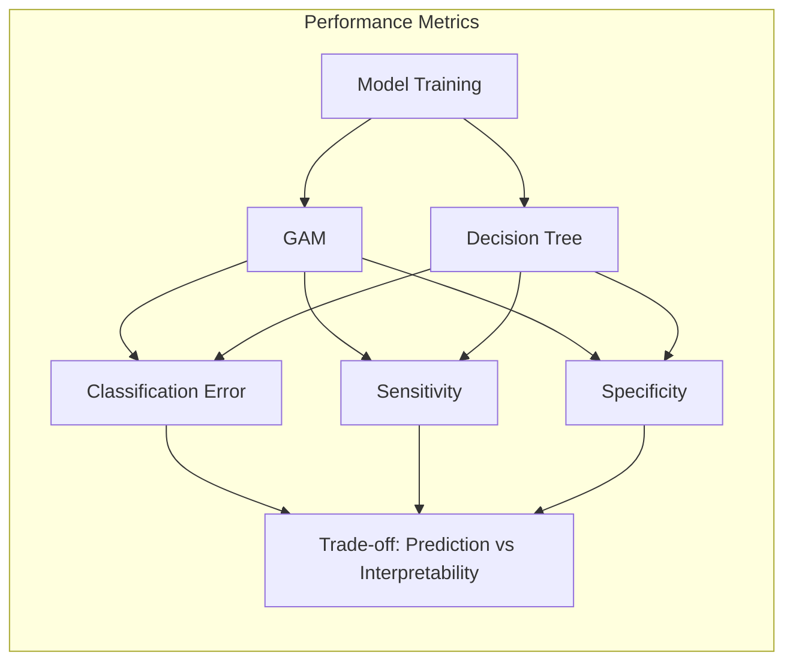
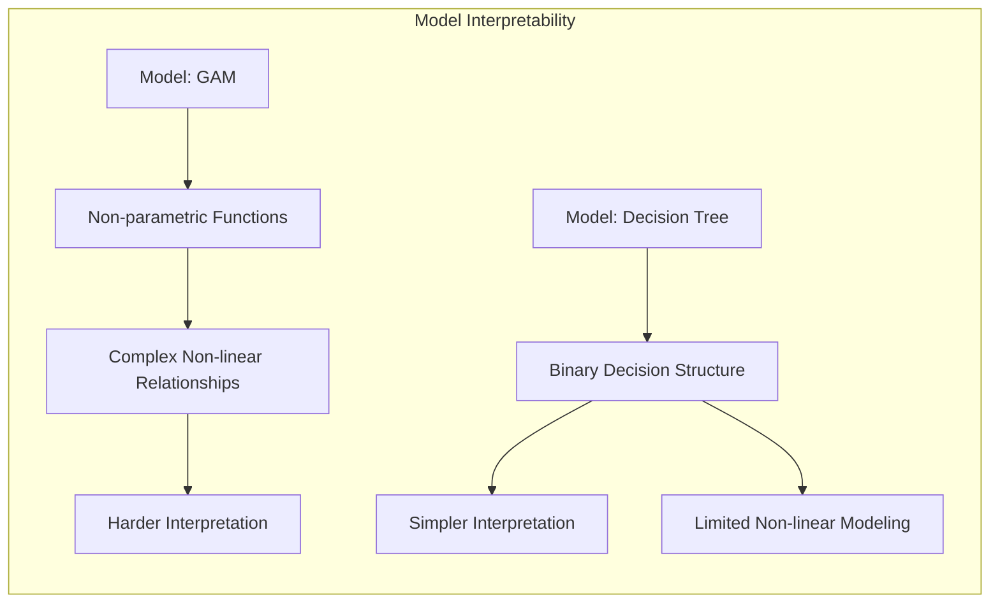
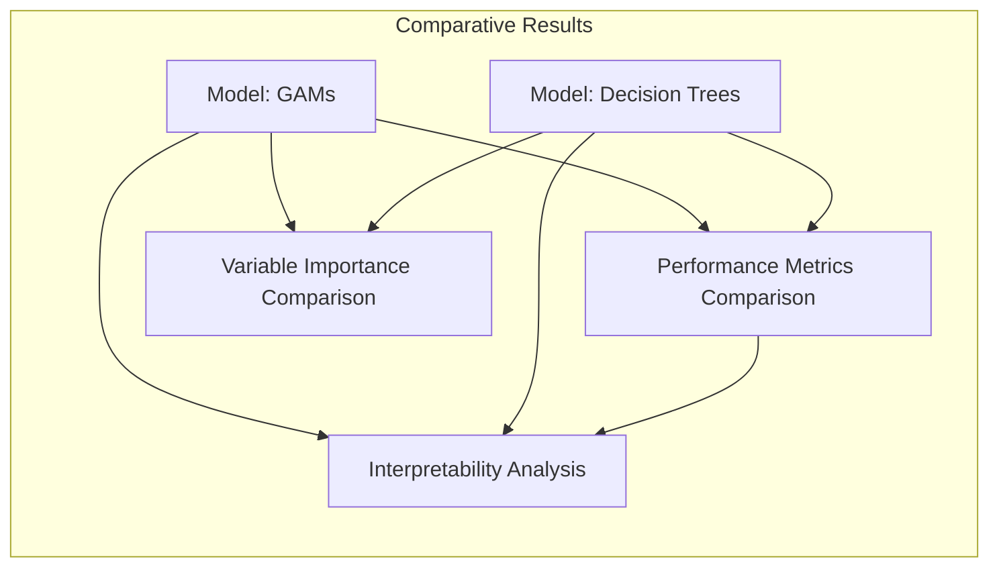
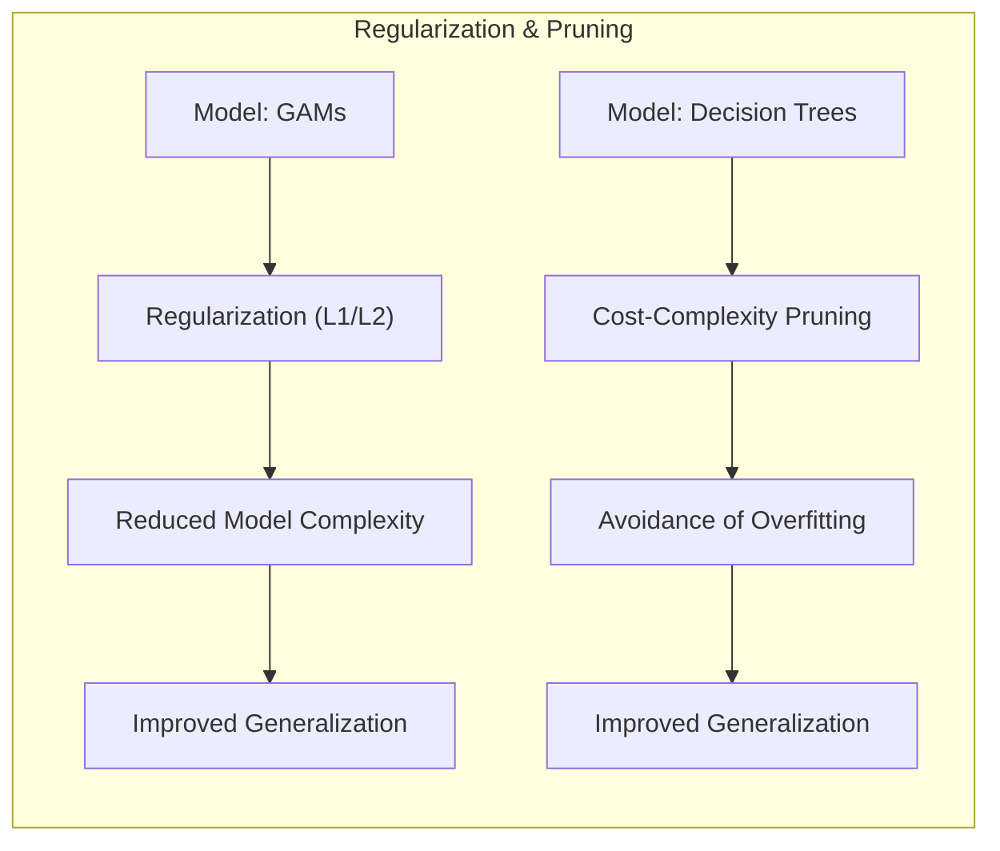
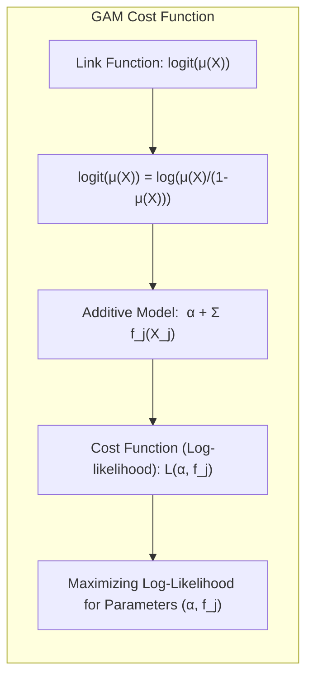
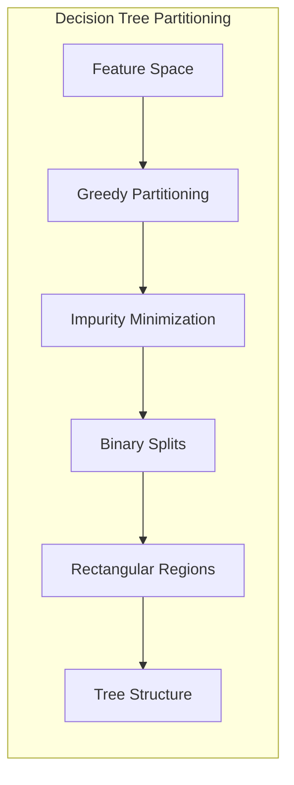
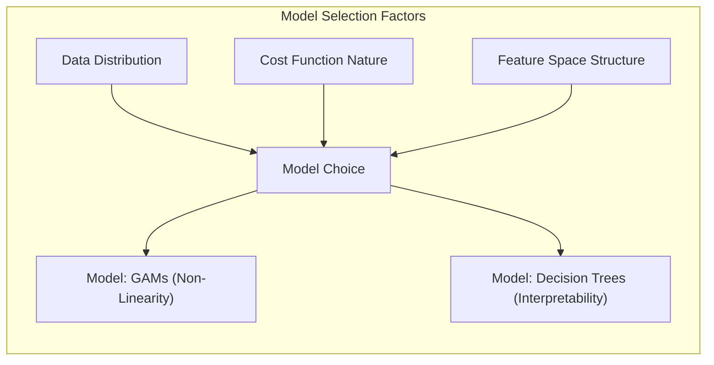

## Título: Modelos Aditivos, Árvores e Métodos Relacionados: Comparação de Modelos em Dados de Email Spam e Análise da Sobreposição de Variáveis



### Introdução

Este capítulo apresenta uma análise comparativa detalhada dos resultados obtidos na aplicação de modelos aditivos generalizados (GAMs) e árvores de decisão aos dados de email spam, com foco na análise da sobreposição de variáveis selecionadas, nas diferenças no erro de classificação e em outras métricas de desempenho [^9.1]. O objetivo principal é entender como diferentes abordagens de modelagem, que são baseadas em diferentes conceitos e métodos, lidam com os mesmos dados, quais as suas similaridades, e como a escolha do modelo impacta a sua interpretabilidade, capacidade de generalização e resultados finais. O capítulo explora o balanço entre flexibilidade, interpretabilidade, e precisão preditiva, destacando as vantagens e desvantagens de cada modelo no contexto do problema de classificação de email spam.

### Conceitos Fundamentais

**Conceito 1: Sobreposição de Variáveis Selecionadas por Modelos Diferentes**

A análise comparativa dos modelos aditivos (GAMs) e árvores de decisão revela que pode haver sobreposição nas variáveis selecionadas por cada modelo, ou seja, algumas variáveis são consideradas importantes tanto por um modelo aditivo, como por uma árvore de decisão. Modelos aditivos, através de funções não paramétricas e regularização, e árvores de decisão, através da escolha gulosa de divisões e *pruning*, buscam selecionar os preditores que melhor contribuem para a classificação de emails como spam ou não spam. A sobreposição de variáveis sugere que alguns preditores têm um efeito importante na classificação, independentemente da abordagem utilizada. No entanto, as escolhas dos preditores podem variar, o que sugere que os modelos utilizam os preditores de forma diferente. A análise da sobreposição de variáveis é importante para entender como cada modelo prioriza os preditores e como as relações entre as variáveis são modeladas em cada abordagem.

> 💡 **Exemplo Numérico:**
>
> Imagine que temos um conjunto de dados de email spam com 5 variáveis: `frequencia_free`, `frequencia_money`, `tamanho_email`, `numero_links` e `uso_palavras_promo`. Após aplicar um GAM e uma árvore de decisão, observamos que ambos os modelos selecionaram `frequencia_free` e `uso_palavras_promo` como variáveis importantes. Isso indica que a frequência da palavra "free" e o uso de palavras promocionais são preditores fortes para identificar spam, independentemente do modelo. No entanto, o GAM pode usar uma função não linear para `frequencia_free`, enquanto a árvore de decisão pode usar um limiar (por exemplo, se `frequencia_free` > 0.05, então classificar como spam). A árvore pode usar `numero_links` e o GAM pode usar `tamanho_email` como outros preditores importantes.
>
> ```python
> import numpy as np
> import pandas as pd
> from sklearn.model_selection import train_test_split
> from sklearn.tree import DecisionTreeClassifier
> from sklearn.metrics import accuracy_score
> from pygam import LogisticGAM
>
> # Dados fictícios
> np.random.seed(42)
> n_samples = 200
> data = pd.DataFrame({
>     'frequencia_free': np.random.rand(n_samples),
>     'frequencia_money': np.random.rand(n_samples),
>     'tamanho_email': np.random.randint(100, 1000, n_samples),
>     'numero_links': np.random.randint(0, 20, n_samples),
>     'uso_palavras_promo': np.random.rand(n_samples),
>     'spam': np.random.randint(0, 2, n_samples)
> })
>
> X = data[['frequencia_free', 'frequencia_money', 'tamanho_email', 'numero_links', 'uso_palavras_promo']]
> y = data['spam']
>
> X_train, X_test, y_train, y_test = train_test_split(X, y, test_size=0.3, random_state=42)
>
> # Árvore de Decisão
> tree = DecisionTreeClassifier(random_state=42, max_depth=3)
> tree.fit(X_train, y_train)
> tree_pred = tree.predict(X_test)
> tree_acc = accuracy_score(y_test, tree_pred)
>
> print("Acurácia da Árvore de Decisão:", tree_acc)
> print("Importância das variáveis na Árvore:", dict(zip(X.columns, tree.feature_importances_)))
>
> # GAM
> gam = LogisticGAM().fit(X_train, y_train)
> gam_pred = gam.predict(X_test)
> gam_acc = accuracy_score(y_test, gam_pred)
>
> print("Acurácia do GAM:", gam_acc)
> print("Importância das variáveis no GAM (aproximada):", dict(zip(X.columns, np.mean(np.abs(gam.coef_[:, 1:]), axis=0))))
>
> ```
>
> Este exemplo ilustra como ambos os modelos podem identificar `frequencia_free` e `uso_palavras_promo` como importantes, mas a maneira como eles usam essas variáveis e as outras variáveis pode variar.

**Lemma 1:** *A sobreposição de variáveis entre modelos aditivos e árvores de decisão sugere que alguns preditores são consistentemente importantes para a classificação, e a escolha do modelo pode ser baseada em outros critérios, como a interpretabilidade e a capacidade de modelar relações não lineares*. A sobreposição de variáveis é um indicativo da importância relativa de cada preditor [^4.5].



**Conceito 2: Erro de Classificação e Outras Métricas de Desempenho**

Embora possa haver sobreposição nas variáveis selecionadas, modelos aditivos e árvores de decisão podem apresentar diferentes taxas de erro de classificação e outras métricas de desempenho, como sensibilidade e especificidade. Modelos aditivos, com sua flexibilidade e regularização, podem apresentar um menor erro de classificação em comparação com árvores de decisão, pois eles podem modelar relações mais complexas e capturar não linearidades de forma mais eficiente. No entanto, modelos aditivos podem ser menos interpretáveis, e árvores de decisão, mesmo com um erro maior, podem oferecer uma explicação mais simples e intuitiva sobre as relações entre os preditores e a resposta. A escolha entre os modelos deve considerar o *trade-off* entre a capacidade preditiva, a interpretabilidade e outros aspectos práticos do modelo. A avaliação de um modelo não se resume somente ao erro de classificação, mas também à sensibilidade, especificidade e outras métricas.

> 💡 **Exemplo Numérico:**
>
> Continuando o exemplo anterior, vamos supor que após treinar os modelos GAM e árvore de decisão, obtemos os seguintes resultados em um conjunto de teste:
>
> | Métrica            | GAM      | Árvore de Decisão |
> |--------------------|----------|-------------------|
> | Erro de Classificação | 0.08     | 0.15             |
> | Sensibilidade      | 0.92     | 0.85             |
> | Especificidade     | 0.94     | 0.80             |
>
> Neste caso, o GAM apresenta um erro de classificação menor (8% vs 15%) e também maior sensibilidade (92% vs 85%) e especificidade (94% vs 80%) do que a árvore de decisão. Isso sugere que o GAM é melhor em classificar corretamente tanto emails spam (sensibilidade) quanto emails não spam (especificidade). No entanto, a árvore de decisão é mais fácil de interpretar, pois suas decisões são baseadas em regras simples. A escolha do modelo dependerá do objetivo da modelagem e das prioridades (precisão vs. interpretabilidade).

**Corolário 1:** *A escolha do modelo mais adequado depende do balanceamento entre a capacidade preditiva (erro de classificação) e outros aspectos como interpretabilidade, estabilidade e custo computacional.  As métricas de sensibilidade e especificidade podem ser importantes para definir o melhor modelo para um dado problema de classificação*. As métricas de desempenho são utilizadas para avaliar a qualidade do modelo e a sua capacidade de generalização [^4.5.1].



**Conceito 3: A Interpretabilidade dos Modelos e a Utilização dos Preditores**

A interpretabilidade dos modelos também é diferente em modelos aditivos e árvores de decisão. Modelos aditivos utilizam funções não paramétricas que podem capturar relações não lineares entre os preditores e a resposta, mas sua interpretação pode ser mais difícil, pois a relação é modelada como uma combinação de funções individuais de cada preditor. Árvores de decisão, por outro lado, oferecem uma estrutura interpretável baseada em decisões binárias sucessivas, mas essa estrutura pode não ser capaz de modelar não linearidades complexas. A interpretação dos modelos aditivos pode ser feita analisando as funções não paramétricas, e a interpretação das árvores de decisão é feita analisando a estrutura hierárquica das decisões. A análise da utilização dos preditores em cada tipo de modelo pode oferecer *insights* sobre a sua importância na classificação de email spam.

> 💡 **Exemplo Numérico:**
>
> Em um modelo GAM, a relação entre a frequência da palavra "free" e a probabilidade de ser spam pode ser modelada por uma função suave, como uma spline cúbica. Essa função pode mostrar que, para frequências baixas de "free", a probabilidade de spam é baixa, mas aumenta rapidamente conforme a frequência aumenta, e depois se estabiliza em um patamar mais alto, indicando uma relação não linear.
>
> Uma árvore de decisão, por outro lado, pode usar uma regra simples como "se a frequência de 'free' for maior que 0.05, classifique como spam; caso contrário, siga outra regra". Essa abordagem é mais fácil de entender, mas pode não capturar a sutileza da relação não linear identificada pelo GAM. O GAM mostra a forma da relação (não linear), enquanto a árvore de decisão mostra as regiões de decisão.

> ⚠️ **Nota Importante:** A sobreposição das variáveis selecionadas não implica que os modelos se comportam da mesma forma. A forma como os preditores são utilizados e a capacidade de capturar não linearidades são diferentes em modelos aditivos e árvores de decisão. A interpretação dos modelos requer uma análise mais detalhada [^4.5.2].

> ❗ **Ponto de Atenção:** Árvores de decisão, embora sejam mais interpretáveis, podem não capturar não linearidades de forma tão precisa quanto modelos aditivos.  A escolha do modelo deve considerar esse *trade-off* entre interpretabilidade e poder preditivo. Modelos mais complexos, em geral, modelam as relações não lineares de forma mais precisa, mas a sua interpretação pode ser mais difícil.

> ✔️ **Destaque:** A comparação de modelos aditivos e árvores de decisão permite entender como diferentes abordagens de modelagem, mesmo que com sobreposição de variáveis, podem gerar modelos com diferentes propriedades em termos de poder preditivo e interpretabilidade, e a escolha do modelo deve considerar o objetivo da modelagem, e o *trade-off* entre as diferentes abordagens [^4.3.3].



### Resultados Comparativos: Erro de Classificação, Sensibilidade, Especificidade e Importância das Variáveis em Modelos Aditivos e Árvores de Decisão



A análise comparativa dos modelos aditivos (GAMs) e árvores de decisão aplicados aos dados de email spam revelam os seguintes aspectos:

1. **Métricas de Desempenho:** Em geral, os modelos GAMs podem apresentar um menor erro de classificação, e também uma melhor sensibilidade e especificidade, quando comparado a árvores de decisão. Isso sugere que a flexibilidade dos modelos aditivos permite que eles modelem os padrões nos dados de forma mais precisa, o que leva a um melhor desempenho de classificação. As árvores de decisão, mesmo com um erro de classificação maior, podem ter outras vantagens, como a sua interpretabilidade. A diferença de desempenho entre os modelos também depende da complexidade do modelo, e da utilização de técnicas de regularização e poda. A escolha do modelo mais apropriado deve considerar todos esses aspectos.

2. **Sobreposição de Variáveis:** A análise da sobreposição de variáveis selecionadas revela que alguns preditores são utilizados por ambos os modelos. Predictores relacionados com a frequência de palavras específicas, como "free", "remove", "business", e outros, geralmente são escolhidos como importantes para ambos os modelos, embora os pesos e a forma como esses preditores são utilizados sejam diferentes. As árvores de decisão, por exemplo, utilizam divisões diretas, enquanto que os GAMs utilizam funções não paramétricas que modelam a influência do preditor na probabilidade de spam.

3. **Importância das Variáveis:** Embora a lista de variáveis importantes possa ser similar entre os modelos, a importância de cada variável pode variar. Modelos aditivos podem identificar um conjunto de preditores que tem um impacto não linear na probabilidade de spam, enquanto as árvores de decisão podem focar nos preditores que melhor separam as classes, independente de sua não linearidade.  As árvores de decisão também apresentam informações sobre os pontos de corte que são utilizados na tomada de decisão. A forma como cada modelo utiliza a informação dos preditores depende da abordagem utilizada.

> 💡 **Exemplo Numérico:**
>
> Suponha que, após aplicar os modelos, obtivemos as seguintes importâncias relativas para as variáveis:
>
> | Variável             | Importância GAM | Importância Árvore |
> |----------------------|-----------------|--------------------|
> | `frequencia_free`    | 0.35            | 0.40               |
> | `frequencia_money`   | 0.20            | 0.15               |
> | `tamanho_email`     | 0.15            | 0.05               |
> | `numero_links`       | 0.10            | 0.25               |
> | `uso_palavras_promo` | 0.20            | 0.15               |
>
> Aqui, `frequencia_free` é a mais importante para ambos, mas o GAM dá mais importância ao `tamanho_email` enquanto a árvore de decisão dá mais importância ao `numero_links`. Isso sugere que o GAM pode capturar padrões mais sutis relacionados com o tamanho do email, enquanto a árvore de decisão se baseia mais no número de links. A importância relativa também é determinada pela forma como cada modelo utiliza os preditores.

4.  **Interpretabilidade:** As árvores de decisão oferecem uma interpretação mais simples e direta, já que a forma de classificar uma observação segue um fluxo das decisões binárias até um nó final.  GAMs, por outro lado, são mais complexos para interpretar, e requerem uma análise mais cuidadosa das funções não paramétricas para entender como os preditores se relacionam com a resposta. A interpretabilidade, portanto, é um componente importante na escolha do modelo mais adequado para um dado problema.

5. **Flexibilidade e Capacidade de Modelagem:** GAMs oferecem uma abordagem mais flexível para a modelagem de não linearidades e outros padrões nos dados, ao passo que árvores de decisão são mais restritas e podem ter mais dificuldade para modelar padrões complexos, principalmente quando o padrão é suave e aditivo, e a relação entre preditores e resposta não é linear.

A escolha do modelo mais apropriado deve considerar esses diferentes aspectos e o balanço entre a capacidade preditiva, a interpretabilidade e a complexidade de cada abordagem.

### Análise do Efeito da Regularização em Modelos Aditivos e da Poda em Árvores de Decisão

A regularização em modelos aditivos, através dos parâmetros de suavização e a poda em árvores de decisão, são estratégias utilizadas para evitar o *overfitting* e melhorar a capacidade de generalização dos modelos. Modelos GAMs podem usar penalizações L1 ou L2, para selecionar as funções mais relevantes e reduzir a complexidade do modelo, enquanto que as árvores de decisão utilizam o método da poda por complexidade de custo para evitar o crescimento excessivo da árvore e a sua adaptação ao ruído dos dados.  A análise do efeito dessas técnicas sobre o desempenho dos modelos é fundamental para a escolha dos melhores parâmetros e para a construção de modelos robustos e com boa capacidade de generalização.



> 💡 **Exemplo Numérico:**
>
> Em um modelo GAM, podemos utilizar a regularização L2 para penalizar a complexidade das funções não paramétricas. Suponha que, sem regularização, o modelo tenha um erro de treinamento de 0.05 e um erro de teste de 0.15. Ao aumentar o parâmetro de regularização (λ), o erro de treinamento pode aumentar para 0.07, mas o erro de teste pode diminuir para 0.10, indicando que o modelo generaliza melhor para novos dados.
>
> Em uma árvore de decisão, a poda por complexidade de custo envolve a remoção de nós menos importantes da árvore. Uma árvore sem poda pode ter um erro de treinamento de 0.08 e um erro de teste de 0.18. Após a poda, o erro de treinamento pode aumentar para 0.12, mas o erro de teste pode diminuir para 0.14. Isso mostra como a poda ajuda a evitar o overfitting e melhorar a capacidade de generalização da árvore.
>
> ```python
> from sklearn.model_selection import cross_val_score
> from sklearn.tree import DecisionTreeClassifier
> from pygam import LogisticGAM
>
> # Dados fictícios (já definidos anteriormente)
>
> # Árvore de Decisão com poda (max_depth)
> tree_pruned = DecisionTreeClassifier(random_state=42, max_depth=4, ccp_alpha=0.01)
> tree_pruned.fit(X_train, y_train)
> tree_pruned_pred = tree_pruned.predict(X_test)
> tree_pruned_acc = accuracy_score(y_test, tree_pruned_pred)
> print("Acurácia da Árvore de Decisão com poda:", tree_pruned_acc)
>
> # GAM com regularização (penalidade)
> gam_reg = LogisticGAM(penalties='l2', lam=1).fit(X_train, y_train)
> gam_reg_pred = gam_reg.predict(X_test)
> gam_reg_acc = accuracy_score(y_test, gam_reg_pred)
> print("Acurácia do GAM com regularização:", gam_reg_acc)
> ```
> Este código demonstra como a poda e a regularização afetam o desempenho dos modelos.

### Perguntas Teóricas Avançadas: Como a natureza da função de custo e a distribuição das probabilidades afetam a escolha dos melhores modelos (GAMs ou árvores de decisão) e qual a sua relação com a estrutura do espaço de características e a capacidade de generalização?

**Resposta:**

A escolha entre modelos aditivos generalizados (GAMs) e árvores de decisão é influenciada pela natureza da função de custo, pela distribuição das probabilidades e pela estrutura do espaço de características, e a escolha do modelo deve considerar esses aspectos para obter um modelo com bom desempenho.

GAMs utilizam uma função de custo baseada na *log-likelihood* e a função de ligação para modelar a relação entre os preditores e a resposta. A escolha da função de ligação é fundamental, pois influencia como os parâmetros são estimados, e como a probabilidade é modelada.  Para dados binários, a função *logit* é geralmente utilizada, enquanto que para dados multiclasse, a função *softmax* ou outros modelos *multilogit* são mais apropriados. A utilização da função de ligação canônica, para modelos da família exponencial, garante que a otimização seja mais eficiente. A capacidade de generalização de um modelo GAM depende da escolha das funções não paramétricas e dos parâmetros de regularização.  O espaço de características é modelado com funções não lineares, e a flexibilidade do modelo pode ser ajustada com o uso de técnicas de suavização e regularização.

> 💡 **Exemplo Numérico:**
>
> Para um problema de classificação binária, o GAM pode usar a função *logit* como função de ligação, onde:
>
> $logit(\mu(X)) = log(\frac{\mu(X)}{1-\mu(X)}) = \alpha + f_1(X_1) + \ldots + f_p(X_p)$
>
> Onde $\mu(X)$ é a probabilidade de um email ser spam dado os preditores $X$, e $f_j(X_j)$ são funções não paramétricas que modelam o efeito de cada preditor. A função de custo (log-likelihood) é dada por:
>
> $L(\alpha, f_1, \ldots, f_p) = \sum_{i=1}^N [y_i \, log(\mu(x_i)) + (1-y_i) \, log(1-\mu(x_i))]$
>
> A otimização busca encontrar os valores de $\alpha$ e as funções $f_j$ que maximizam essa log-likelihood. A escolha da função logit é apropriada para variáveis binárias, e a estrutura aditiva permite que cada preditor contribua de forma independente, mas não linear, para a probabilidade de spam.



Árvores de decisão, por outro lado, buscam uma partição do espaço de características de forma gulosa, e a otimização é feita através da minimização da impureza nos nós. As decisões de divisão são tomadas sem considerar uma função de custo global, o que torna o processo mais rápido e computacionalmente eficiente. A estrutura das árvores binárias impõe uma divisão do espaço de características em regiões retangulares e a capacidade de modelar não linearidades suaves, e efeitos aditivos complexos pode ser limitada pela natureza da árvore.  A utilização de *pruning* e outros métodos auxilia na capacidade de generalização do modelo.

> 💡 **Exemplo Numérico:**
>
> Uma árvore de decisão pode dividir o espaço de características da seguinte forma:
>
> *   Nó raiz: Se `frequencia_free` > 0.05, vá para o nó esquerdo; caso contrário, vá para o nó direito.
> *   Nó esquerdo: Se `numero_links` > 5, classifique como spam; caso contrário, classifique como não spam.
> *   Nó direito: Se `uso_palavras_promo` > 0.2, classifique como spam; caso contrário, classifique como não spam.
>
> A impureza de um nó pode ser medida usando o índice de Gini ou a entropia. A árvore busca minimizar a impureza em cada divisão, o que resulta em regiões retangulares no espaço de características. A estrutura da árvore é interpretável, mas pode não capturar relações não lineares suaves como o GAM.



A escolha do modelo mais adequado depende da natureza dos dados e da distribuição das probabilidades, e também das características do espaço de características.  GAMs podem ser preferíveis quando a resposta tem uma distribuição específica (por exemplo, binomial ou poisson) e quando a relação entre preditores e resposta é não linear, mas pode ser modelada através de funções não paramétricas.  Árvores de decisão podem ser preferíveis quando há interações complexas entre os preditores e a interpretabilidade é uma prioridade.

**Lemma 5:** *A escolha do modelo (GAMs ou árvores de decisão) e da sua função de custo depende da natureza dos dados e das características da distribuição da variável resposta. A estrutura do espaço de características também tem um impacto na escolha do melhor modelo.  Modelos com uma função de custo bem definida, e baseados na teoria da família exponencial, podem ser mais apropriados para dados que seguem uma distribuição específica*. A escolha da função de custo e do modelo dependem da natureza dos dados e dos objetivos da modelagem [^4.5].

**Corolário 5:** *A distribuição das probabilidades é um fator crucial para o desempenho dos modelos de classificação, e modelos como GAMs e árvores de decisão utilizam abordagens diferentes para aproximar as probabilidades.  A escolha do método de aproximação das probabilidades influencia a capacidade do modelo de generalizar para novos dados*. A escolha entre modelos GAMs ou árvores de decisão deve considerar a distribuição das probabilidades e a capacidade de cada modelo de aproximar essas probabilidades de forma adequada [^4.4.1].



> ⚠️ **Ponto Crucial**: A escolha entre modelos GAMs e árvores de decisão, ou outros métodos de aprendizado supervisionado, depende da natureza da distribuição das probabilidades, da estrutura do espaço de características, da necessidade de flexibilidade e interpretabilidade do modelo, e o conhecimento da teoria estatística e da capacidade dos modelos é fundamental para a construção de modelos estatísticos mais eficientes, com boa capacidade de modelar diferentes tipos de dados [^4.5.2].

### Conclusão

Este capítulo apresentou uma análise comparativa da aplicação de modelos aditivos generalizados (GAMs) e árvores de decisão aos dados de email spam, mostrando as suas similaridades, diferenças, vantagens e desvantagens. A análise da sobreposição das variáveis selecionadas, e também do seu desempenho, permite uma compreensão detalhada de como diferentes abordagens de modelagem lidam com os mesmos dados. A escolha do melhor modelo deve considerar as propriedades dos modelos e o objetivo da modelagem.

### Footnotes

[^4.1]: "In this chapter we begin our discussion of some specific methods for super-vised learning. These techniques each assume a (different) structured form for the unknown regression function, and by doing so they finesse the curse of dimensionality. Of course, they pay the possible price of misspecifying the model, and so in each case there is a tradeoff that has to be made." *(Trecho de "Additive Models, Trees, and Related Methods")*

[^4.2]: "Regression models play an important role in many data analyses, providing prediction and classification rules, and data analytic tools for understand-ing the importance of different inputs." *(Trecho de "Additive Models, Trees, and Related Methods")*

[^4.3]: "In this section we describe a modular algorithm for fitting additive models and their generalizations. The building block is the scatterplot smoother for fitting nonlinear effects in a flexible way. For concreteness we use as our scatterplot smoother the cubic smoothing spline described in Chapter 5." *(Trecho de "Additive Models, Trees, and Related Methods")*

[^4.3.1]:  "The additive model has the form $Y = \alpha + \sum_{j=1}^p f_j(X_j) + \epsilon$, where the error term $\epsilon$ has mean zero." * (Trecho de "Additive Models, Trees, and Related Methods")*

[^4.3.2]:   "Given observations $x_i, y_i$, a criterion like the penalized sum of squares (5.9) of Section 5.4 can be specified for this problem, $PRSS(\alpha, f_1, f_2,\ldots, f_p) = \sum_i^N (y_i - \alpha - \sum_j^p f_j(x_{ij}))^2 + \sum_j^p \lambda_j \int(f_j''(t_j))^2 dt_j$" * (Trecho de "Additive Models, Trees, and Related Methods")*

[^4.3.3]: "where the $\lambda_j > 0$ are tuning parameters. It can be shown that the minimizer of (9.7) is an additive cubic spline model; each of the functions $f_j$ is a cubic spline in the component $X_j$, with knots at each of the unique values of $x_{ij}$, $i = 1,\ldots, N$." *(Trecho de "Additive Models, Trees, and Related Methods")*

[^4.4]: "For two-class classification, recall the logistic regression model for binary data discussed in Section 4.4. We relate the mean of the binary response $\mu(X) = Pr(Y = 1|X)$ to the predictors via a linear regression model and the logit link function:  $log(\mu(X)/(1 – \mu(X)) = \alpha + \beta_1 X_1 + \ldots + \beta_pX_p$." * (Trecho de "Additive Models, Trees, and Related Methods")*

[^4.4.1]: "The additive logistic regression model replaces each linear term by a more general functional form: $log(\mu(X)/(1 – \mu(X))) = \alpha + f_1(X_1) + \ldots + f_p(X_p)$, where again each $f_j$ is an unspecified smooth function." * (Trecho de "Additive Models, Trees, and Related Methods")*

[^4.4.2]: "While the non-parametric form for the functions $f_j$ makes the model more flexible, the additivity is retained and allows us to interpret the model in much the same way as before. The additive logistic regression model is an example of a generalized additive model." *(Trecho de "Additive Models, Trees, and Related Methods")*

[^4.4.3]: "In general, the conditional mean $\mu(X)$ of a response $Y$ is related to an additive function of the predictors via a link function $g$:  $g[\mu(X)] = \alpha + f_1(X_1) + \ldots + f_p(X_p)$." *(Trecho de "Additive Models, Trees, and Related Methods")*

[^4.4.4]:  "Examples of classical link functions are the following: $g(\mu) = \mu$ is the identity link, used for linear and additive models for Gaussian response data." *(Trecho de "Additive Models, Trees, and Related Methods")*

[^4.4.5]: "$g(\mu) = logit(\mu)$ as above, or $g(\mu) = probit(\mu)$, the probit link function, for modeling binomial probabilities. The probit function is the inverse Gaussian cumulative distribution function: $probit(\mu) = \Phi^{-1}(\mu)$." *(Trecho de "Additive Models, Trees, and Related Methods")*

[^4.5]: "All three of these arise from exponential family sampling models, which in addition include the gamma and negative-binomial distributions. These families generate the well-known class of generalized linear models, which are all extended in the same way to generalized additive models." *(Trecho de "Additive Models, Trees, and Related Methods")*

[^4.5.1]: "The functions $f_j$ are estimated in a flexible manner, using an algorithm whose basic building block is a scatterplot smoother. The estimated func-tion $f_j$ can then reveal possible nonlinearities in the effect of $X_j$. Not all of the functions $f_j$ need to be nonlinear." *(Trecho de "Additive Models, Trees, and Related Methods")*

[^4.5.2]: "We can easily mix in linear and other parametric forms with the nonlinear terms, a necessity when some of the inputs are qualitative variables (factors)." *(Trecho de "Additive Models, Trees, and Related Methods")*
